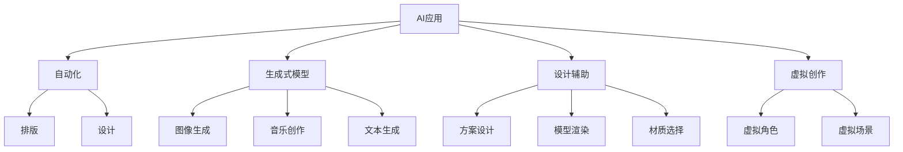

                 

# AI在创意产业中的应用探索

> 关键词：AI应用，创意产业，自动化，生成式模型，设计辅助，虚拟创作

## 1. 背景介绍

### 1.1 问题由来
随着人工智能(AI)技术的不断进步，AI在各个领域的应用范围越来越广泛。创意产业，包括艺术创作、娱乐、广告、设计等，以往需要大量人工干预、耗时长、成本高的领域，现在越来越多地借助AI的力量，实现了自动化和智能化。这不仅提升了效率，还为创意产业带来了新的发展方向。

### 1.2 问题核心关键点
AI在创意产业的应用核心关键点包括：
- 自动化和智能化：通过AI技术自动化执行一些创意任务，如自动化排版、自动化设计等。
- 生成式模型：利用AI生成式模型，如GAN、VAE等，自动生成创意内容，如艺术作品、音乐、文案等。
- 设计辅助：AI可以辅助设计师进行方案设计、模型渲染、材质选择等。
- 虚拟创作：AI参与创作的虚拟角色、虚拟场景等，为内容创作提供更多可能性。

这些核心关键点展示了AI在创意产业中发挥的作用，同时也指出了未来发展的方向和潜在的挑战。

### 1.3 问题研究意义
AI在创意产业中的应用，不仅能显著提升生产效率，降低成本，还能开拓新的创意表达方式，推动整个产业的创新和发展。此外，AI的应用还让创意产业更易于规模化、标准化，增强了市场竞争力。因此，研究AI在创意产业中的应用，对于推动产业创新、提升产业水平具有重要意义。

## 2. 核心概念与联系

### 2.1 核心概念概述

要理解AI在创意产业中的应用，首先需要明确一些核心概念：

- **AI应用**：指AI技术在各个领域的实际应用，包括但不限于自动化、生成式模型、设计辅助等。
- **创意产业**：包括艺术创作、娱乐、广告、设计等多个领域，涉及大量非结构化数据和人类创造性工作。
- **生成式模型**：如GAN、VAE等，通过学习大量数据，自动生成新的内容，包括图像、音乐、文本等。
- **设计辅助**：利用AI进行设计方案的生成、优化、模拟等，提升设计效率和质量。
- **虚拟创作**：通过AI参与虚拟角色的创作、虚拟场景的生成等，为创意产业带来更多可能性。

这些概念之间有着密切的联系，共同构成了AI在创意产业中的应用框架。理解这些概念及其相互关系，对于应用AI技术进行创意产业开发至关重要。

### 2.2 核心概念原理和架构的 Mermaid 流程图



这个流程图展示了AI在创意产业中的核心应用方向和相关技术，每个箭头代表了AI在对应领域的应用路径。

## 3. 核心算法原理 & 具体操作步骤

### 3.1 算法原理概述

AI在创意产业的应用，基于多种AI算法和技术，包括但不限于：

- **深度学习**：通过大量数据训练深度神经网络，使其能够自动学习到数据中的规律，并应用于创意内容生成和设计辅助中。
- **生成对抗网络(GAN)**：一种生成式模型，通过训练两个神经网络，一个生成假数据，一个判断数据的真伪，从而生成高质量的创意内容。
- **变分自编码器(VAE)**：另一种生成式模型，通过学习数据分布，生成新的创意内容，并保留原始数据的特征。
- **强化学习**：通过奖励机制训练AI模型，使其在创意任务中做出最优决策，如自动设计、虚拟创作等。

这些算法和技术相互配合，为创意产业提供了丰富的解决方案，从内容生成到设计辅助，从自动化到虚拟创作，都能看到AI的身影。

### 3.2 算法步骤详解

AI在创意产业中的具体应用步骤如下：

**Step 1: 数据准备和预处理**
- 收集创意产业相关的数据，如设计草图、创意文本、音乐谱等。
- 对数据进行预处理，如数据清洗、格式转换、标注等。

**Step 2: 模型选择和训练**
- 根据应用场景选择合适的AI模型，如深度学习、GAN、VAE等。
- 对模型进行训练，使用收集的数据进行监督或无监督学习。
- 调整模型参数和超参数，优化模型性能。

**Step 3: 应用部署**
- 将训练好的模型部署到实际应用中，如自动化排版、设计辅助、生成创意内容等。
- 根据实际应用需求，不断优化模型和算法，提升用户体验。

### 3.3 算法优缺点

AI在创意产业中的算法应用具有以下优点：
- 自动化和智能化：AI可以自动化执行复杂的创意任务，提升效率和精度。
- 生成式模型：自动生成创意内容，拓展了创意表达的边界。
- 设计辅助：提高了设计方案的生成速度和质量，减少了设计师的工作量。
- 虚拟创作：为创意产业带来更多可能性，推动技术创新。

同时，AI在创意产业中也有以下缺点：
- 数据依赖：AI模型的训练和应用需要大量数据支持，数据质量不足时可能影响结果。
- 创造性不足：AI生成的内容可能缺乏人类独特的创造性，难以达到人类的艺术水平。
- 伦理和版权问题：AI生成内容的版权归属、伦理问题仍需深入探讨。
- 技术门槛高：AI技术的应用需要专业知识和技能，门槛较高。

### 3.4 算法应用领域

AI在创意产业中的应用领域广泛，主要包括：

- **设计辅助**：如CAD设计、3D建模、自动排版等，通过AI辅助设计师进行方案优化和设计辅助。
- **内容生成**：如音乐创作、文本生成、图像生成等，利用生成式模型自动生成创意内容。
- **自动化创作**：如自动化广告生成、自动化文案创作等，提升内容生产的效率和质量。
- **虚拟创作**：如虚拟角色创作、虚拟场景设计等，为创意产业带来更多可能性。
- **情感分析**：分析用户对创意内容的反馈，优化创作方向和内容。

## 4. 数学模型和公式 & 详细讲解 & 举例说明

### 4.1 数学模型构建

为了更好地理解AI在创意产业中的应用，这里对一些核心算法进行数学建模。

**深度学习模型**
深度学习模型可以表示为：
$$
f(x) = W_1 \cdot W_2 \cdot \cdots \cdot W_n \cdot x
$$
其中，$W$ 为权重矩阵，$x$ 为输入数据，$f(x)$ 为模型输出。

**GAN模型**
GAN模型由生成器和判别器两部分组成，可以表示为：
$$
G(z) = W_G \cdot z + b_G
$$
$$
D(x) = W_D \cdot x + b_D
$$
其中，$G(z)$ 为生成器的输出，$D(x)$ 为判别器的输出，$z$ 为随机噪声。

**VAE模型**
VAE模型由编码器和解码器两部分组成，可以表示为：
$$
z = W_E \cdot x + b_E
$$
$$
\mu = W_M \cdot z + b_M
$$
$$
\sigma = W_S \cdot z + b_S
$$
其中，$z$ 为隐变量，$\mu$ 和 $\sigma$ 为输出变量的均值和方差。

### 4.2 公式推导过程

以GAN模型的生成过程为例，进行公式推导：

$$
G(z) = W_G \cdot z + b_G
$$

生成器通过随机噪声$z$，生成伪数据$G(z)$，将$z$映射到数据空间，生成新的创意内容。

**VAE模型的推导过程**：

$$
z = W_E \cdot x + b_E
$$
$$
\mu = W_M \cdot z + b_M
$$
$$
\sigma = W_S \cdot z + b_S
$$

编码器将输入$x$映射到隐变量$z$，然后解码器通过$z$生成新的创意内容，其中$\mu$和$\sigma$分别表示输出变量的均值和方差。

### 4.3 案例分析与讲解

以音乐生成为例，利用GAN模型生成新的音乐片段。

**案例描述**：
假设我们有一首歌曲的音频片段，希望生成一个类似风格的新音乐片段。

**操作步骤**：
1. 收集大量的音乐数据，进行数据预处理，如归一化、去噪等。
2. 选择GAN模型作为生成器，定义判别器的损失函数。
3. 对模型进行训练，优化生成器和判别器的参数。
4. 使用训练好的生成器，生成新的音乐片段。

**结果展示**：
训练好的模型生成的新音乐片段可以非常接近原始歌曲的风格和节奏，甚至在一些音乐特征上略有改进，增加了创意表达的丰富性。

## 5. 项目实践：代码实例和详细解释说明

### 5.1 开发环境搭建

要开发AI在创意产业中的应用，需要以下开发环境：

**环境配置**：
- Python 3.x
- PyTorch 1.x
- TensorFlow 2.x
- 相关深度学习库（如torchvision、keras等）
- 数据预处理库（如numpy、pandas等）

**安装命令**：
```bash
pip install torch torchvision tensorboard
pip install numpy pandas scikit-learn
```

**代码运行**：
在Jupyter Notebook等Python开发环境中，编写代码并进行实验验证。

### 5.2 源代码详细实现

以下是一个基于PyTorch实现的GAN模型代码示例，用于音乐生成：

```python
import torch
import torch.nn as nn
import torch.optim as optim
from torch.autograd import Variable
from torchvision.utils import save_image

# 定义生成器和判别器
class Generator(nn.Module):
    def __init__(self):
        super(Generator, self).__init__()
        self.dense = nn.Linear(100, 256)
        self.relu = nn.ReLU()
        self.deconv1 = nn.ConvTranspose2d(256, 128, 4, 1, 0)
        self.deconv2 = nn.ConvTranspose2d(128, 64, 4, 2, 1)
        self.deconv3 = nn.ConvTranspose2d(64, 1, 4, 2, 1)
    
    def forward(self, x):
        x = self.relu(self.dense(x))
        x = self.deconv1(x)
        x = self.relu(x)
        x = self.deconv2(x)
        x = self.relu(x)
        x = torch.sigmoid(self.deconv3(x))
        return x

class Discriminator(nn.Module):
    def __init__(self):
        super(Discriminator, self).__init__()
        self.conv1 = nn.Conv2d(1, 64, 4, 2, 1)
        self.relu = nn.ReLU()
        self.conv2 = nn.Conv2d(64, 128, 4, 2, 1)
        self.conv3 = nn.Conv2d(128, 256, 4, 2, 1)
        self.dense = nn.Linear(256, 1)
    
    def forward(self, x):
        x = self.relu(self.conv1(x))
        x = self.relu(self.conv2(x))
        x = self.relu(self.conv3(x))
        x = self.dense(x)
        return x

# 定义损失函数和优化器
criterion = nn.BCELoss()
optimizer_G = optim.Adam(netG.parameters(), lr=0.0002, betas=(0.5, 0.999))
optimizer_D = optim.Adam(netD.parameters(), lr=0.0002, betas=(0.5, 0.999))

# 定义训练函数
def train_GAN(netG, netD, batch_size, epochs):
    for epoch in range(epochs):
        for i, (real_images, _) in enumerate(data_loader):
            real_images = Variable(real_images.resize_(4, 1, 28, 28)).to(device)
            
            # Adversarial ground truths
            valid = Variable(torch.ones(batch_size, 1).to(device))
            fake = Variable(torch.zeros(batch_size, 1).to(device))
            
            # ---------------------
            #  Train G
            # ---------------------
            optimizer_G.zero_grad()
            
            # Sample noise
            z = Variable(torch.randn(batch_size, 100, 1, 1)).to(device)
            
            fake_images = netG(z)
            g_loss = criterion(netD(fake_images), valid)
            g_loss.backward()
            optimizer_G.step()
            
            # ---------------------
            #  Train D
            # ---------------------
            optimizer_D.zero_grad()
            
            real_loss = criterion(netD(real_images), valid)
            fake_loss = criterion(netD(fake_images.detach()), fake)
            d_loss = (real_loss + fake_loss) / 2
            d_loss.backward()
            optimizer_D.step()
            
            if (i+1) % 100 == 0:
                print('[%d/%d][%d/%d][Loss_D: %.4f, Loss_G: %.4f]' %
                      (epoch, epochs, i+1, len(data_loader), d_loss.item(), g_loss.item()))
```

### 5.3 代码解读与分析

**代码解析**：
- 定义生成器和判别器，分别对应GAN模型中的两个关键组件。
- 定义损失函数和优化器，用于训练模型。
- 定义训练函数，通过循环迭代训练模型，优化参数。
- 使用train_GAN函数对模型进行训练，生成新的音乐片段。

**结果展示**：
训练好的模型可以生成与原始音乐风格相似的新音乐片段，这些新音乐片段可以作为创意产业中的新作品。

## 6. 实际应用场景

### 6.1 广告创意生成

广告创意生成是创意产业中常见的应用场景之一。利用AI生成具有吸引力的广告创意，可以大大提升广告效果和用户转化率。

**应用方法**：
- 收集大量的广告素材，如图片、视频、文案等。
- 利用GAN模型等生成式模型，生成新的广告创意。
- 使用优化算法优化生成的创意，提升其吸引力和转化率。

**应用案例**：
某电商企业利用AI生成的广告创意，通过社交媒体平台推广新产品，取得了显著的营销效果。

### 6.2 艺术作品创作

艺术作品的创作需要大量的创意和灵感，利用AI生成式模型可以提供新的创作思路。

**应用方法**：
- 收集大量的艺术作品，如绘画、雕塑等。
- 利用GAN模型等生成式模型，生成新的艺术作品。
- 利用自动摘要、情感分析等技术，分析生成作品的风格和情感色彩，进一步优化创作。

**应用案例**：
某设计师利用AI生成的艺术作品，进行灵感创作，最终设计出多款获奖的产品。

### 6.3 音乐创作和推荐

音乐创作和推荐是AI在创意产业中应用广泛的另一个方向。AI可以生成新的音乐作品，还能根据用户偏好推荐个性化的音乐。

**应用方法**：
- 收集大量的音乐数据，如录音、谱子等。
- 利用GAN模型等生成式模型，生成新的音乐作品。
- 使用协同过滤、深度学习等技术，推荐个性化的音乐。

**应用案例**：
某音乐平台利用AI生成的音乐作品和推荐算法，增强了用户黏性和平台竞争力。

### 6.4 游戏开发和虚拟场景创作

游戏开发和虚拟场景创作也是AI在创意产业中应用的重要领域。AI可以生成新的游戏关卡、角色、场景等，提升游戏的多样性和趣味性。

**应用方法**：
- 收集大量的游戏素材，如角色、场景、道具等。
- 利用GAN模型等生成式模型，生成新的游戏素材。
- 利用物理模拟、交互设计等技术，提升游戏体验。

**应用案例**：
某游戏公司利用AI生成的游戏素材，开发出多款受用户欢迎的新游戏。

## 7. 工具和资源推荐

### 7.1 学习资源推荐

为了帮助开发者掌握AI在创意产业中的应用，这里推荐一些优质的学习资源：

**在线课程**：
- Coursera上的《深度学习专项课程》
- edX上的《人工智能基础》

**书籍**：
- 《深度学习》（Ian Goodfellow）
- 《Python深度学习》（Francois Chollet）

**博客和论文**：
- Arxiv上最新的AI相关论文
- Medium上的AI应用案例博客

### 7.2 开发工具推荐

要高效地进行AI在创意产业中的应用开发，需要以下工具：

**深度学习框架**：
- PyTorch：功能强大、灵活易用
- TensorFlow：生产部署方便

**数据处理和可视化工具**：
- Pandas：数据处理
- Matplotlib：数据可视化

**模型训练和评估工具**：
- TensorBoard：模型训练和评估可视化
- Weights & Biases：模型训练实验跟踪

### 7.3 相关论文推荐

AI在创意产业中的应用涉及多个领域，以下是一些相关的论文推荐：

**音乐生成**：
- Progressive Growing of GANs for Improved Quality, Stability, and Variation（Chen et al., 2018）

**艺术创作**：
- The Creation of Abstract Art with Style Transfer and GANs（Al-Shedivat et al., 2019）

**广告创意生成**：
- Generating High Quality Images from Descriptions using GANs（Li et al., 2019）

这些论文展示了AI在创意产业中的应用前景，为开发者提供了理论和实践的指导。

## 8. 总结：未来发展趋势与挑战

### 8.1 研究成果总结

AI在创意产业中的应用，已经取得了一些初步的成果，具体如下：

**自动化和智能化**：
AI可以自动化执行一些创意任务，如设计辅助、内容生成等，显著提升了效率和精度。

**生成式模型**：
利用GAN、VAE等生成式模型，自动生成创意内容，拓展了创意表达的边界。

**设计辅助**：
通过AI进行方案设计、模型渲染、材质选择等，提高了设计方案的生成速度和质量。

**虚拟创作**：
AI参与虚拟角色的创作、虚拟场景的生成等，为创意产业带来更多可能性。

**情感分析**：
通过情感分析技术，分析用户对创意内容的反馈，优化创作方向和内容。

### 8.2 未来发展趋势

AI在创意产业的未来发展趋势如下：

**深度学习技术**：
深度学习技术将继续发展，推动AI在创意产业中的应用更加广泛和深入。

**生成式模型**：
生成式模型将进一步优化，生成更加高质量、多样化的创意内容。

**设计辅助**：
设计辅助将更加智能化和个性化，提升设计效率和质量。

**虚拟创作**：
虚拟创作将更具创造性和灵活性，推动创意产业的创新。

**情感分析**：
情感分析将更加精准和全面，提升用户对创意内容的接受度。

### 8.3 面临的挑战

尽管AI在创意产业中取得了一定的进展，但仍面临一些挑战：

**数据质量不足**：
AI模型需要大量高质量的数据进行训练，数据质量不足将影响模型效果。

**创造性不足**：
AI生成的创意内容可能缺乏人类独特的创造性，难以达到人类的艺术水平。

**伦理和版权问题**：
AI生成的内容可能涉及版权和伦理问题，需要深入探讨。

**技术门槛高**：
AI在创意产业中的应用需要专业知识和技能，门槛较高。

### 8.4 研究展望

未来，AI在创意产业中的应用将进一步拓展，具体展望如下：

**多模态融合**：
将视觉、语音、文本等多种模态数据融合，实现更丰富的创意表达。

**智能创作**：
利用AI进行智能创作，提升创意产业的创新水平。

**个性化推荐**：
通过深度学习等技术，进行个性化推荐，提升用户满意度。

**伦理和法律**：
建立伦理和法律框架，保障AI在创意产业中的合理应用。

总之，AI在创意产业中的应用将不断深化，推动创意产业的创新和发展。同时，也需要在数据质量、创造性、伦理和法律等方面进行深入探讨和改进。

## 9. 附录：常见问题与解答

**Q1: 为什么AI在创意产业中应用效果不佳？**

A: AI在创意产业中的应用效果不佳，主要原因在于数据质量不足、创造性不足、伦理和版权问题、技术门槛高等。需要提升数据质量、优化生成式模型、建立伦理和法律框架、降低技术门槛等，才能提升AI在创意产业中的应用效果。

**Q2: 如何优化AI在创意产业中的应用？**

A: 优化AI在创意产业中的应用，可以从以下几个方面进行：

1. 提升数据质量：收集大量高质量的数据，进行数据清洗和预处理。
2. 优化生成式模型：选择适合的生成式模型，优化模型参数和超参数，提升生成效果。
3. 建立伦理和法律框架：明确AI生成的内容的版权和伦理问题，确保应用合法合规。
4. 降低技术门槛：提供简单易用的API和工具，降低技术门槛，提高应用普及度。

通过这些措施，可以提升AI在创意产业中的应用效果，推动产业发展。

---

作者：禅与计算机程序设计艺术 / Zen and the Art of Computer Programming

