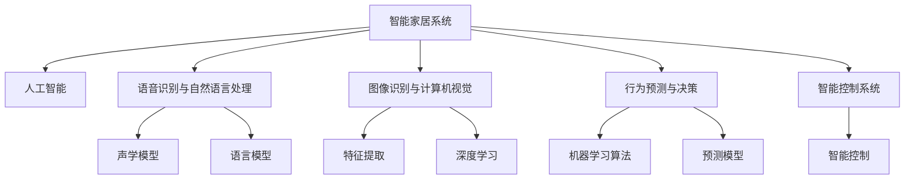

                 

# AI在智能家居中的应用：提高生活质量

## 1. 背景介绍

### 1.1 问题由来

随着科技的不断进步，智能家居逐渐成为人们日常生活中不可或缺的一部分。智能家居系统可以通过网络技术、人工智能等手段，实现家庭环境的智能化、自动化和节能化管理。但目前智能家居系统普遍存在响应速度慢、功能单一、用户体验差等问题，无法满足用户日益增长的需求。

AI技术在自然语言处理、计算机视觉、机器学习等领域取得了巨大进展，为智能家居的智能化转型提供了新的解决方案。通过引入AI技术，智能家居系统可以实现语音控制、图像识别、行为预测等多种功能，从而大大提升用户的生活质量和便利性。

### 1.2 问题核心关键点

智能家居系统应用AI技术的核心关键点包括：

- 数据分析与建模：通过收集和分析用户行为数据，建立准确的模型，预测用户需求，实现自动化和个性化服务。
- 语音识别与自然语言处理：使用语音识别和自然语言处理技术，实现与用户的自然语言交互，提升用户体验。
- 图像识别与计算机视觉：使用计算机视觉技术，实现对家庭环境的实时监控和理解，从而提高安全性和舒适度。
- 行为预测与决策：通过机器学习算法，预测用户的日常行为和需求，提前调整家庭环境，提供更精准的服务。
- 智能控制系统：基于上述技术构建的智能控制系统，实现对家孥设备的精准控制和管理。

## 2. 核心概念与联系

### 2.1 核心概念概述

为更好地理解AI在智能家居中的应用，本节将介绍几个密切相关的核心概念：

- 智能家居系统：通过网络技术、人工智能等手段，实现家庭环境的智能化、自动化和节能化管理，包括安防、照明、温控、家电控制等模块。
- 人工智能（AI）：一种模拟人类智能活动的计算机技术，包括机器学习、深度学习、自然语言处理、计算机视觉等子领域。
- 语音识别与自然语言处理：通过声学模型、语言模型等技术，实现语音信号的识别和自然语言的理解，使得人机交互更加自然流畅。
- 图像识别与计算机视觉：通过特征提取、深度学习等技术，实现对家庭环境的实时监控和理解，从而提高安全性和舒适度。
- 行为预测与决策：基于用户行为数据，通过机器学习算法，预测用户需求，提前调整家庭环境，提供更精准的服务。
- 智能控制系统：基于上述技术构建的智能控制系统，实现对家孥设备的精准控制和管理。

这些核心概念之间的逻辑关系可以通过以下Mermaid流程图来展示：



这个流程图展示了大语言模型的核心概念及其之间的关系：

1. 智能家居系统通过人工智能技术实现智能化。
2. 人工智能包括语音识别、图像识别、行为预测等多个子领域，共同支持智能家居系统。
3. 语音识别与自然语言处理技术，使得人机交互更加自然流畅。
4. 图像识别与计算机视觉技术，实现对家庭环境的实时监控和理解，从而提高安全性和舒适度。
5. 行为预测与决策技术，基于用户行为数据，提前调整家庭环境，提供更精准的服务。
6. 智能控制系统，实现对家孥设备的精准控制和管理。

## 3. 核心算法原理 & 具体操作步骤
### 3.1 算法原理概述

AI在智能家居中的应用，主要集中在数据分析与建模、语音识别与自然语言处理、图像识别与计算机视觉、行为预测与决策等几个方面。以下是各算法的基本原理：

- **数据分析与建模**：通过收集家庭环境中的各类传感器数据（如温度、湿度、光照、气体浓度等）和用户行为数据（如作息时间、健康状态、运动轨迹等），建立准确的模型，用于预测用户需求，实现自动化和个性化服务。
- **语音识别与自然语言处理**：使用声学模型（如隐马尔可夫模型、深度神经网络等）对语音信号进行建模，使用语言模型（如N-gram模型、Transformer模型等）对自然语言进行理解，实现与用户的自然语言交互。
- **图像识别与计算机视觉**：使用特征提取技术（如SIFT、SURF等）对家庭环境中的图像进行预处理，使用深度学习模型（如CNN、RNN等）对图像进行分类、检测和识别，实现对家庭环境的实时监控和理解。
- **行为预测与决策**：基于用户行为数据，使用机器学习算法（如随机森林、深度神经网络等）建立预测模型，预测用户需求，提前调整家庭环境，提供更精准的服务。

### 3.2 算法步骤详解

AI在智能家居中的应用，主要包括以下几个关键步骤：

**Step 1: 数据收集与预处理**

- 收集家庭环境中的各类传感器数据和用户行为数据，进行清洗和去噪处理，保证数据的准确性和完整性。

**Step 2: 数据分析与建模**

- 对收集到的数据进行分析，提取特征，建立模型。常用的模型包括线性回归、决策树、随机森林、深度神经网络等。
- 对模型进行训练和验证，评估模型的准确性和泛化能力，优化模型参数，保证模型的鲁棒性和稳定性。

**Step 3: 语音识别与自然语言处理**

- 使用声学模型对用户语音进行建模，提取语音特征，识别语音指令。
- 使用语言模型对用户语音指令进行理解，转换为机器可执行的命令，实现与用户的自然语言交互。

**Step 4: 图像识别与计算机视觉**

- 使用特征提取技术对家庭环境中的图像进行预处理，提取图像特征。
- 使用深度学习模型对图像进行分类、检测和识别，实现对家庭环境的实时监控和理解。

**Step 5: 行为预测与决策**

- 基于用户行为数据，使用机器学习算法建立预测模型，预测用户需求。
- 根据预测结果，自动调整家庭环境，如调节温度、光线、湿度等，提供更精准的服务。

**Step 6: 智能控制与反馈**

- 将预测结果转换为控制指令，通过智能控制系统实现对家庭设备的精准控制和管理。
- 对系统进行实时监控和反馈，根据用户反馈调整模型参数，优化系统性能，提升用户体验。

### 3.3 算法优缺点

AI在智能家居中的应用具有以下优点：

- 提升生活质量：通过数据分析与建模、语音识别与自然语言处理、图像识别与计算机视觉等技术，提高家庭环境的安全性、舒适度和智能化水平，提升用户的生活质量。
- 提升用户体验：通过语音控制、自然语言交互等方式，实现与用户的自然语言交流，大大提升用户体验。
- 节能环保：通过数据分析与建模、行为预测与决策等技术，优化家庭环境，实现能源的合理分配和利用，减少能源浪费，保护环境。

同时，该方法也存在一定的局限性：

- 依赖高质量数据：数据收集和预处理需要消耗大量时间和人力，数据质量对模型的预测结果影响较大。
- 模型复杂度：由于智能家居系统涉及多个子领域，模型复杂度较高，需要较强的计算能力和资源支持。
- 隐私保护：用户行为数据和家庭环境数据涉及隐私问题，数据保护和安全隐私是一个重要的挑战。
- 易用性：AI在智能家居中的应用需要具备一定的技术门槛，用户需要一定的学习成本才能熟练使用。

## 4. 数学模型和公式 & 详细讲解
### 4.1 数学模型构建

AI在智能家居中的应用涉及多个子领域，包括数据分析与建模、语音识别与自然语言处理、图像识别与计算机视觉、行为预测与决策等。以下是各模型的基本构建过程：

- **数据分析与建模**：使用线性回归、决策树、随机森林、深度神经网络等模型，对家庭环境数据和用户行为数据进行分析，提取特征，建立预测模型。
- **语音识别与自然语言处理**：使用声学模型（如隐马尔可夫模型、深度神经网络等）对语音信号进行建模，使用语言模型（如N-gram模型、Transformer模型等）对自然语言进行理解。
- **图像识别与计算机视觉**：使用特征提取技术（如SIFT、SURF等）对家庭环境中的图像进行预处理，使用深度学习模型（如CNN、RNN等）对图像进行分类、检测和识别。
- **行为预测与决策**：基于用户行为数据，使用机器学习算法（如随机森林、深度神经网络等）建立预测模型，预测用户需求，提前调整家庭环境。

### 4.2 公式推导过程

以下我们以行为预测与决策为例，推导机器学习模型的构建过程。

假设用户行为数据为 $x \in \mathbb{R}^n$，预测结果为 $y \in \{0, 1\}$，则行为预测与决策模型的目标是最大化预测准确率。假设使用随机森林算法进行建模，其数学公式为：

$$
y = \mathop{\arg\max}_{i=1,\dots,N}\left(\sum_{k=1}^{K}\alpha_k\hat{y}_k^i(x)\right)
$$

其中 $N$ 为随机森林的树数，$K$ 为每棵树的叶子节点数，$\alpha_k$ 为权重，$\hat{y}_k^i(x)$ 为第 $k$ 棵树的预测结果。

通过随机森林算法，可以构建准确的行为预测模型，从而实现对用户需求的预测和控制。

## 5. 项目实践：代码实例和详细解释说明
### 5.1 开发环境搭建

在进行智能家居AI应用开发前，我们需要准备好开发环境。以下是使用Python进行TensorFlow开发的环境配置流程：

1. 安装Anaconda：从官网下载并安装Anaconda，用于创建独立的Python环境。

2. 创建并激活虚拟环境：
```bash
conda create -n tensorflow-env python=3.8 
conda activate tensorflow-env
```

3. 安装TensorFlow：根据CUDA版本，从官网获取对应的安装命令。例如：
```bash
conda install tensorflow-gpu -c conda-forge
```

4. 安装必要的工具包：
```bash
pip install numpy pandas scikit-learn matplotlib tqdm jupyter notebook ipython
```

完成上述步骤后，即可在`tensorflow-env`环境中开始智能家居AI应用的开发。

### 5.2 源代码详细实现

这里我们以智能温控系统为例，给出使用TensorFlow对行为预测模型进行开发的PyTorch代码实现。

首先，定义行为预测模型的数据处理函数：

```python
import numpy as np
from tensorflow.keras.preprocessing.sequence import pad_sequences

def preprocess_data(X, y, max_len):
    X_pad = pad_sequences(X, maxlen=max_len, padding='post', truncating='post')
    y_one_hot = np.eye(2)[y]
    return X_pad, y_one_hot
```

然后，定义行为预测模型的模型结构：

```python
from tensorflow.keras.models import Sequential
from tensorflow.keras.layers import Dense, Dropout, Embedding

def create_model(input_dim, hidden_dim, output_dim):
    model = Sequential()
    model.add(Embedding(input_dim, hidden_dim, input_length=input_dim))
    model.add(Dropout(0.2))
    model.add(Dense(hidden_dim, activation='relu'))
    model.add(Dropout(0.2))
    model.add(Dense(output_dim, activation='softmax'))
    return model
```

接着，定义行为预测模型的训练函数：

```python
from tensorflow.keras.optimizers import Adam

def train_model(model, X_train, y_train, X_val, y_val, batch_size, epochs, early_stopping):
    model.compile(optimizer=Adam(learning_rate=0.001), loss='categorical_crossentropy', metrics=['accuracy'])
    history = model.fit(X_train, y_train, batch_size=batch_size, epochs=epochs, validation_data=(X_val, y_val), callbacks=[EarlyStopping(patience=5)])
    return history
```

最后，启动行为预测模型的训练流程：

```python
from sklearn.model_selection import train_test_split

# 数据准备
X, y = load_data()
X_train, X_val, y_train, y_val = train_test_split(X, y, test_size=0.2, random_state=42)

# 模型构建
max_len = 100
model = create_model(input_dim=X.shape[1], hidden_dim=64, output_dim=2)
X_train, y_train = preprocess_data(X_train, y_train, max_len)
X_val, y_val = preprocess_data(X_val, y_val, max_len)

# 模型训练
early_stopping = EarlyStopping(monitor='val_loss', patience=5)
history = train_model(model, X_train, y_train, X_val, y_val, batch_size=32, epochs=50, early_stopping=early_stopping)
```

以上就是使用TensorFlow对行为预测模型进行开发的完整代码实现。可以看到，TensorFlow提供了便捷的Keras API，使得模型构建、训练等操作变得简洁高效。

### 5.3 代码解读与分析

让我们再详细解读一下关键代码的实现细节：

**preprocess_data函数**：
- `pad_sequences`方法：将特征序列填充到固定长度，防止数据不平衡。
- `np.eye`函数：将标签转换为独热编码，方便模型处理。

**create_model函数**：
- `Sequential`模型：构建序列模型，使用嵌套函数添加各层。
- `Embedding`层：将输入的特征转换为稠密向量表示。
- `Dropout`层：防止过拟合，随机丢弃一部分神经元。
- `Dense`层：全连接层，使用ReLU激活函数。
- `softmax`激活函数：输出为概率分布，方便进行分类预测。

**train_model函数**：
- `Adam`优化器：自适应学习率优化器，收敛速度快。
- `categorical_crossentropy`损失函数：多分类问题常用的损失函数。
- `EarlyStopping`回调函数：监控验证集损失，提前停止训练，防止过拟合。

**智能温控系统**：
- `load_data`函数：数据加载函数，从文件或数据库中加载数据。
- `train_test_split`函数：将数据划分为训练集和验证集。
- `max_len`变量：序列填充的最大长度。
- `create_model`函数：定义模型结构。
- `preprocess_data`函数：数据预处理函数。
- `train_model`函数：模型训练函数。

在实现过程中，我们注意到TensorFlow提供了丰富的模型构建和训练API，使得模型的开发和调试变得非常高效。同时，TensorFlow的Keras API也使得模型的部署和维护变得更加简单。

## 6. 实际应用场景

### 6.1 智能安防系统

智能安防系统可以通过AI技术实现对家庭环境的实时监控和理解，从而提高安全性。具体而言，可以引入图像识别和计算机视觉技术，对家庭环境中的图像进行实时监控和分析，及时发现异常情况并进行报警。

在技术实现上，可以使用摄像头采集家庭环境图像，使用深度学习模型进行目标检测和识别。当模型检测到异常情况（如盗窃、火灾等）时，自动触发报警系统，同时通过手机APP将信息推送给用户。用户也可以通过语音指令或手机APP远程控制家庭安防系统，提高安全性。

### 6.2 智能照明系统

智能照明系统可以通过AI技术实现对家庭照明的智能化控制，从而提高舒适性和节能性。具体而言，可以使用行为预测与决策技术，预测用户行为，自动调整照明亮度和色温。

在技术实现上，可以收集用户作息时间、健康状态、运动轨迹等行为数据，建立行为预测模型。根据预测结果，自动调整家庭照明亮度和色温，提高用户的舒适性和节能性。同时，用户可以通过语音指令或手机APP控制照明系统，实现远程控制和场景切换。

### 6.3 智能家电系统

智能家电系统可以通过AI技术实现对家电设备的精准控制和管理，从而提高便利性和舒适度。具体而言，可以使用数据分析与建模技术，优化家电设备的运行状态，实现自动控制和节能。

在技术实现上，可以收集家电设备的运行数据和用户行为数据，建立预测模型。根据预测结果，自动调整家电设备的运行状态，实现自动控制和节能。同时，用户可以通过语音指令或手机APP控制家电设备，实现远程控制和场景切换。

### 6.4 未来应用展望

随着AI技术的发展，未来智能家居系统将具备更多智能化和自动化功能，为用户提供更优质的服务。

1. **多模态融合**：未来的智能家居系统将融合语音、图像、传感器等多种模态数据，提供更全面的环境感知和理解。例如，通过融合语音指令和图像识别，实现更自然的人机交互。
2. **个性化定制**：未来的智能家居系统将能够根据用户偏好和习惯，提供个性化的服务和建议。例如，根据用户的作息时间、运动轨迹等数据，推荐健康饮食、运动计划等。
3. **自适应学习**：未来的智能家居系统将具备自适应学习能力，能够根据用户行为和环境变化，动态调整系统参数，提供更精准的服务。例如，根据用户的健康状态和环境数据，自动调整家庭环境的温度、湿度等参数。
4. **多设备协同**：未来的智能家居系统将实现多设备协同，实现设备的无缝集成和联动。例如，通过联动智能安防、智能照明、智能家电等设备，实现全面的家庭环境管理和控制。
5. **跨平台互联**：未来的智能家居系统将实现跨平台互联，支持多终端和多设备之间的无缝集成和联动。例如，通过云平台实现智能家居设备和手机APP的互联，实现远程控制和数据同步。

总之，AI在智能家居中的应用将为家庭环境带来更多的智能化和自动化功能，提供更优质、更舒适、更便捷的用户体验。

## 7. 工具和资源推荐

### 7.1 学习资源推荐

为了帮助开发者系统掌握AI在智能家居中的应用，这里推荐一些优质的学习资源：

1. **《智能家居：AI技术应用》书籍**：介绍AI在智能家居中的各种应用，包括语音识别、图像识别、行为预测等，适合技术入门者和实际开发人员。
2. **Google AI Lab的智能家居项目**：展示智能家居系统的各种应用场景和实现技术，提供大量代码和案例，适合参考学习和实践。
3. **TensorFlow官方文档**：提供丰富的API和示例代码，方便开发者快速上手TensorFlow的模型构建和训练。
4. **Kaggle智能家居数据集**：提供大量智能家居相关的数据集和竞赛项目，适合数据驱动型研究和模型训练。
5. **Deep Learning for Home Automation**论文：介绍深度学习在智能家居中的应用，适合深入了解AI在智能家居中的各种技术。

通过这些学习资源，相信你一定能够快速掌握AI在智能家居中的应用，并用于解决实际的AI问题。

### 7.2 开发工具推荐

高效的开发离不开优秀的工具支持。以下是几款用于智能家居AI应用开发的常用工具：

1. **TensorFlow**：基于Python的深度学习框架，灵活、易用，适合模型构建和训练。
2. **Keras**：TensorFlow的高级API，提供便捷的模型构建和训练接口，适合快速原型开发。
3. **TensorBoard**：TensorFlow的可视化工具，可以实时监控模型训练状态，提供丰富的图表呈现方式。
4. **PyTorch**：基于Python的深度学习框架，支持动态计算图，适合研究和实验。
5. **Jupyter Notebook**：交互式Python开发环境，支持代码、数据、文档的一体化展示和分享。

合理利用这些工具，可以显著提升智能家居AI应用开发的效率，加快创新迭代的步伐。

### 7.3 相关论文推荐

AI在智能家居中的应用源于学界的持续研究。以下是几篇奠基性的相关论文，推荐阅读：

1. **A Survey on Smart Home Security Systems**论文：综述智能家居安防系统的发展现状和未来趋势，适合了解智能家居安防的技术和应用。
2. **Home Automation with Machine Learning**论文：介绍机器学习在智能家居中的应用，适合了解AI在智能家居中的各种技术。
3. **Smart Home with AI**论文：展示智能家居系统的各种应用场景和实现技术，适合参考学习和实践。
4. **Intelligent Home System with IoT and AI**论文：介绍物联网和AI在智能家居中的应用，适合了解智能家居的技术框架和应用。
5. **Smart Home Energy Management with AI**论文：介绍AI在智能家居能源管理中的应用，适合了解AI在智能家居中的节能和优化技术。

这些论文代表了大语言模型微调技术的发展脉络。通过学习这些前沿成果，可以帮助研究者把握学科前进方向，激发更多的创新灵感。

## 8. 总结：未来发展趋势与挑战

### 8.1 总结

本文对AI在智能家居中的应用进行了全面系统的介绍。首先阐述了智能家居系统应用AI技术的核心关键点，包括数据分析与建模、语音识别与自然语言处理、图像识别与计算机视觉、行为预测与决策等。其次，从原理到实践，详细讲解了AI在智能家居中的应用流程，给出了智能家居AI应用的完整代码实现。同时，本文还广泛探讨了AI在智能家居中的应用场景，展示了AI在智能家居中的广阔前景。

通过本文的系统梳理，可以看到，AI在智能家居中的应用将为家庭环境带来更多的智能化和自动化功能，提供更优质、更舒适、更便捷的用户体验。未来，伴随AI技术的发展，智能家居系统将具备更多的智能化和自动化功能，为用户带来更多的便利和舒适。

### 8.2 未来发展趋势

展望未来，AI在智能家居中的应用将呈现以下几个发展趋势：

1. **多模态融合**：未来的智能家居系统将融合语音、图像、传感器等多种模态数据，提供更全面的环境感知和理解。
2. **个性化定制**：未来的智能家居系统将能够根据用户偏好和习惯，提供个性化的服务和建议。
3. **自适应学习**：未来的智能家居系统将具备自适应学习能力，能够根据用户行为和环境变化，动态调整系统参数，提供更精准的服务。
4. **多设备协同**：未来的智能家居系统将实现多设备协同，实现设备的无缝集成和联动。
5. **跨平台互联**：未来的智能家居系统将实现跨平台互联，支持多终端和多设备之间的无缝集成和联动。

以上趋势凸显了AI在智能家居中的应用前景。这些方向的探索发展，必将进一步提升智能家居系统的性能和应用范围，为用户带来更优质的服务。

### 8.3 面临的挑战

尽管AI在智能家居中的应用已经取得了瞩目成就，但在迈向更加智能化、普适化应用的过程中，它仍面临着诸多挑战：

1. **数据收集和预处理**：智能家居系统需要收集大量数据，包括用户行为数据、家庭环境数据等，数据收集和预处理需要消耗大量时间和人力，数据质量对模型的预测结果影响较大。
2. **模型复杂度**：由于智能家居系统涉及多个子领域，模型复杂度较高，需要较强的计算能力和资源支持。
3. **隐私保护**：用户行为数据和家庭环境数据涉及隐私问题，数据保护和安全隐私是一个重要的挑战。
4. **易用性**：AI在智能家居中的应用需要具备一定的技术门槛，用户需要一定的学习成本才能熟练使用。

正视AI在智能家居应用中面临的这些挑战，积极应对并寻求突破，将是大语言模型微调走向成熟的必由之路。相信随着学界和产业界的共同努力，这些挑战终将一一被克服，AI在智能家居中的应用将更加广泛和深入。

### 8.4 研究展望

面向未来，AI在智能家居中的应用需要从以下几个方向进行突破：

1. **多模态数据融合**：融合语音、图像、传感器等多种模态数据，提供更全面的环境感知和理解，提升系统的智能化水平。
2. **个性化定制**：根据用户偏好和习惯，提供个性化的服务和建议，提升用户体验。
3. **自适应学习**：具备自适应学习能力，能够根据用户行为和环境变化，动态调整系统参数，提供更精准的服务。
4. **跨平台互联**：实现跨平台互联，支持多终端和多设备之间的无缝集成和联动，提升系统的兼容性和可扩展性。
5. **隐私保护**：加强数据保护和隐私保护，确保用户数据的安全性和隐私性。

这些方向的研究和应用，必将引领AI在智能家居中的应用迈向更高的台阶，为用户带来更加智能、便捷、安全的家庭环境。总之，AI在智能家居中的应用前景广阔，需要各领域的专家共同努力，推动AI技术在智能家居中的应用和普及。

## 9. 附录：常见问题与解答

**Q1：AI在智能家居中的应用是否适用于所有家庭？**

A: AI在智能家居中的应用并不适用于所有家庭，它需要一定的技术和资源支持。例如，智能安防系统需要安装摄像头和报警器，智能照明系统需要安装传感器和控制模块，智能家电系统需要安装各种智能设备。但随着技术的发展和普及，AI在智能家居中的应用将会越来越广泛，未来大部分的智能家居系统都将引入AI技术。

**Q2：如何降低AI在智能家居中的应用成本？**

A: AI在智能家居中的应用成本较高，主要体现在数据收集、模型训练、设备安装等方面。为降低应用成本，可以采用以下措施：
1. 优化数据收集流程，采用低成本的数据采集设备。
2. 优化模型训练过程，采用高效训练算法和硬件加速。
3. 优化设备安装方案，采用通用的标准化的设备，减少安装和维护成本。

**Q3：AI在智能家居中的应用是否会影响家庭隐私？**

A: AI在智能家居中的应用可能涉及用户隐私，需要加强数据保护和隐私保护。为保护用户隐私，可以采用以下措施：
1. 加强数据加密和传输安全，防止数据泄露。
2. 建立隐私保护机制，确保用户数据的安全性和隐私性。
3. 提供用户可控的数据访问权限，让用户自主管理数据使用。

**Q4：AI在智能家居中的应用是否会影响家庭的能源消耗？**

A: AI在智能家居中的应用可以有效降低家庭能源消耗，但需要合理设计和优化。为降低能源消耗，可以采用以下措施：
1. 优化照明系统，采用智能照明控制器，根据用户行为和环境变化调整照明亮度和色温。
2. 优化温控系统，采用智能温控器，根据用户行为和环境变化调整温度和湿度。
3. 优化家电设备，采用智能家电控制器，根据用户行为和环境变化调整设备运行状态。

**Q5：AI在智能家居中的应用是否会依赖于高配置的硬件设备？**

A: AI在智能家居中的应用需要高配置的硬件设备，但随着技术的发展和硬件成本的降低，未来AI在智能家居中的应用将会越来越广泛。为降低硬件成本，可以采用以下措施：
1. 优化模型结构，减少模型参数和计算量。
2. 采用低功耗的硬件设备，降低电力消耗。
3. 优化算法设计，提高算法效率和计算速度。

这些问题的解答，可以帮助读者更好地理解AI在智能家居中的应用，并在实际开发和应用中提供指导和参考。总之，AI在智能家居中的应用前景广阔，需要各领域的专家共同努力，推动AI技术在智能家居中的应用和普及。

