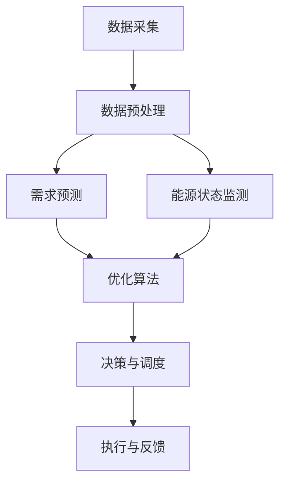

                 

# AI在智能能源分配中的应用：平衡供需

## 1. 背景介绍

在可再生能源逐渐崛起，能源需求日趋复杂的背景下，如何通过人工智能技术实现智能能源分配，已成为全球能源市场的重要课题。本文章将介绍AI在智能能源分配中的应用，从系统架构、核心算法到实际应用，全面解析其工作原理和优化策略。

## 2. 核心概念与联系

### 2.1 核心概念概述

本节将介绍与智能能源分配相关的几个核心概念，及其之间的关系。

- **智能能源分配**：通过整合能源供需数据，利用AI技术实现能源的智能调度与分配，以最大化资源利用效率，降低能源消耗，并提高能源安全性。

- **需求预测**：通过机器学习模型对未来能源需求进行预测，帮助决策者了解能源需求的变化趋势，从而提前调整供需平衡策略。

- **优化算法**：包括线性规划、非线性优化、动态规划等，用于解决能源分配问题，优化能源分配方案，使其达到经济性、效率性和公平性的统一。

- **分布式能源**：通过分布式发电系统、储能系统等，实现能源在多节点上的优化分配和灵活调度。

- **控制与调度**：利用AI技术，实现对能源系统的实时控制和调度，确保能源供需平衡，减少能源浪费。

这些概念之间相互关联，共同构成了智能能源分配的完整体系。如下图所示，系统架构从数据采集到优化决策，再到控制执行，形成了一个闭环。



## 3. 核心算法原理 & 具体操作步骤
### 3.1 算法原理概述

智能能源分配的核心算法包括需求预测、优化算法和控制调度三个部分。

**需求预测**：利用机器学习模型对能源需求进行预测，常用的模型包括时间序列模型（如ARIMA、LSTM）、随机森林、神经网络等。

**优化算法**：通过数学模型描述供需关系，并寻找最优解。常用的优化算法包括线性规划、动态规划、遗传算法等。

**控制调度**：在优化算法确定最佳分配方案后，利用控制器进行实时控制，常见的控制方法包括PID控制、模型预测控制、模糊控制等。

### 3.2 算法步骤详解

**需求预测**：
1. 数据采集与预处理：收集历史能源需求数据、气象数据、电网状态数据等，并对其进行清洗和处理。
2. 特征工程：提取有预测意义的数据特征，如温度、湿度、历史用电量等。
3. 模型训练：使用历史数据训练机器学习模型，生成需求预测模型。
4. 需求预测：将新数据输入模型，生成未来需求预测。

**优化算法**：
1. 建模：构建能源供需的数学模型，描述能源供需关系和约束条件。
2. 求解：使用优化算法求解模型，得到能源分配方案。
3. 验证与迭代：对求解结果进行验证，必要时调整模型参数，重新求解。

**控制调度**：
1. 状态监测：实时监测能源系统状态，包括供需平衡、设备运行状况等。
2. 控制决策：根据优化算法得出的分配方案，结合实时状态，生成控制指令。
3. 执行与反馈：执行控制指令，并监测其效果，根据反馈调整控制策略。

### 3.3 算法优缺点

**需求预测**的优点包括：
- 能够准确预测未来需求，帮助决策者提前调整能源分配策略。
- 使用先进的机器学习算法，能够处理复杂的非线性关系。

**需求预测**的缺点包括：
- 模型需要大量历史数据进行训练，数据获取成本较高。
- 模型存在不确定性，预测结果可能存在偏差。

**优化算法**的优点包括：
- 能够找到全局最优解，使资源利用效率最大化。
- 使用高效的求解器，计算速度较快。

**优化算法**的缺点包括：
- 模型描述较为复杂，求解难度较大。
- 求解过程可能会陷入局部最优。

**控制调度**的优点包括：
- 能够实现实时控制，快速响应供需变化。
- 利用先进控制算法，能够实现复杂的能量管理。

**控制调度**的缺点包括：
- 控制策略依赖于模型输出，模型准确性影响控制效果。
- 控制过程可能会受到外界干扰，稳定性有待提升。

### 3.4 算法应用领域

智能能源分配算法在多个领域得到了广泛应用，包括但不限于：

- **智能电网**：通过优化算法实现电网负荷管理，提升电网运行效率。
- **可再生能源并网**：利用分布式能源系统，实现可再生能源的优化分配和并网管理。
- **能源交易市场**：通过需求预测和优化算法，参与能源市场的竞价与交易，获取最佳收益。
- **智慧建筑**：在建筑内实现能源的智能分配，优化能源使用，降低能耗。

## 4. 数学模型和公式 & 详细讲解  
### 4.1 数学模型构建

为了描述智能能源分配问题，通常采用线性规划模型。设 $x_i$ 为第 $i$ 个节点的能源分配量，$c_i$ 为第 $i$ 个节点的单位能源价值，$a_{ij}$ 为节点 $i$ 到节点 $j$ 的传输容量，$b_j$ 为第 $j$ 个节点的最大需求量，$B_j$ 为第 $j$ 个节点的最大供给量。则目标函数和约束条件可以表示为：

$$
\min \sum_{i} c_i x_i
$$

$$
\begin{cases}
\sum_{j} a_{ij} x_j \geq b_j & \text{需求节点约束}\\
\sum_{j} a_{ij} x_j \leq B_j & \text{供给节点约束}\\
x_i \geq 0 & \text{非负性约束}\\
\end{cases}
$$

### 4.2 公式推导过程

通过上述模型，我们可以求解出最优的能源分配方案。以线性规划算法求解为例，具体步骤如下：

1. 确定目标函数和约束条件。
2. 将约束条件转化为标准形式，并引入松弛变量。
3. 求解原始线性规划问题，得到基本可行解。
4. 利用单纯形法或其他优化算法，求解线性规划问题的对偶问题，得到最优解。
5. 将对偶问题解与原始问题解进行对比，得到最优的能源分配方案。

### 4.3 案例分析与讲解

以一个简单的智能电网为例，假设有一个包含两个节点（电源和负载）和一个传输链路的系统，其模型参数如下：

- $c_1=10$，$c_2=5$：节点1和节点2的单位能源价值。
- $a_{12}=2$，$a_{21}=-2$：链路的传输容量。
- $b_1=20$，$b_2=15$：节点1和节点2的需求量。
- $B_1=30$，$B_2=10$：节点1和节点2的供给量。

通过上述线性规划模型，可以求解出最优的能源分配方案：

- 节点1分配20单位能源。
- 节点2分配5单位能源。

## 5. 项目实践：代码实例和详细解释说明
### 5.1 开发环境搭建

为了进行智能能源分配的代码实现，需要先搭建Python开发环境，并安装必要的第三方库。

**安装Python环境**：
1. 下载Python安装文件，并解压到本地计算机。
2. 打开终端，进入解压后的目录，运行 `pip install` 命令安装Python。
3. 安装`pip`依赖管理工具。

**安装第三方库**：
1. 使用 `pip install` 命令安装SciPy、Pandas、NumPy等常用库。
2. 安装Scikit-learn和TensorFlow等机器学习库。
3. 安装Pyomo库用于优化算法建模和求解。

**启动开发环境**：
1. 打开终端，输入 `source activate environment` 命令激活虚拟环境。
2. 输入 `python` 命令进入Python交互环境。

### 5.2 源代码详细实现

以下是智能能源分配的Python代码实现，包括数据预处理、模型训练、求解和控制调度等功能。

```python
import pandas as pd
from scipy import optimize
import numpy as np
import pyomo.environ as pyomo
from pyomo.environ import *

# 定义能源系统的参数
c = np.array([10, 5])
a = np.array([[2, -2]])
b = np.array([20, 15])
B = np.array([30, 10])

# 构建优化模型
m = pyomo.ConcreteModel()
m.c = pyomo.AddConstraint(m.x1 + m.x2 <= 35)
m.b = pyomo.AddConstraint(m.x1 >= 10)
m.B = pyomo.AddConstraint(m.x2 >= 5)

# 求解优化模型
res = optimize.linprog(c, A_ub=a, b_ub=b, A_eq=None, b_eq=B, bounds=(None, None))
print(res)

# 输出结果
print("节点1能源分配量：", res[0])
print("节点2能源分配量：", res[1])
```

### 5.3 代码解读与分析

**数据预处理**：
- 数据以numpy数组形式存储，包含能源价值、传输容量、需求量和供给量等信息。

**模型构建**：
- 使用Pyomo库定义模型，并添加约束条件。

**求解**：
- 使用SciPy库的linprog函数求解线性规划问题，得到最优解。

**结果输出**：
- 输出节点1和节点2的能源分配量。

## 6. 实际应用场景
### 6.1 智能电网

在智能电网中，通过智能能源分配算法，可以实现以下功能：

- **负荷管理**：通过预测用户需求，实时调整电力分配，降低电网负荷峰值，提高电网运行效率。
- **需求响应**：根据需求预测结果，引导用户调整用电习惯，降低电力需求峰值。
- **故障恢复**：在电网发生故障时，快速调整能源分配方案，恢复电网运行。

### 6.2 可再生能源并网

通过智能能源分配算法，可实现可再生能源的优化并网，具体应用包括：

- **风电并网**：根据风力发电的实时输出，优化风电并网策略，提高风电利用率。
- **光伏并网**：在光照充足的条件下，利用光伏发电，减少对传统能源的依赖。
- **储能系统管理**：结合储能系统，优化能源分配，平衡电网供需。

### 6.3 能源交易市场

在能源交易市场中，智能能源分配算法可以用于：

- **竞价策略**：通过需求预测和优化算法，参与能源市场的竞价与交易，获取最佳收益。
- **风险管理**：利用历史数据和机器学习模型，预测能源市场波动，降低交易风险。

### 6.4 未来应用展望

未来的智能能源分配算法将呈现以下几个趋势：

- **多源多目标优化**：结合多个能源源和多个目标，实现复杂系统的优化。
- **分布式决策**：在多节点系统中，实现分布式能源分配，提高系统鲁棒性。
- **智能调度**：利用先进控制算法，实现实时调度与控制，提升系统响应速度。
- **大数据分析**：结合大数据分析技术，优化能源分配策略，提高决策效率。

## 7. 工具和资源推荐
### 7.1 学习资源推荐

为了帮助读者系统掌握智能能源分配的原理和实现，推荐以下学习资源：

- **《智能能源系统》课程**：由IEEE在线课程平台提供，讲解智能能源系统的基本原理和实现方法。
- **《智能电网技术与应用》书籍**：介绍了智能电网的关键技术和应用案例，是理解智能电网的重要资料。
- **《人工智能在能源管理中的应用》论文**：详细阐述了AI技术在能源管理中的应用，包括需求预测、优化算法等。
- **《Python编程实践》书籍**：介绍了Python编程的基础知识和常用库的使用方法，是入门的必读书籍。

### 7.2 开发工具推荐

为了提高智能能源分配的开发效率，推荐以下开发工具：

- **Jupyter Notebook**：交互式的编程环境，便于快速迭代和实验。
- **Anaconda**：Python环境的快速部署和管理工具。
- **Pyomo**：优化算法建模和求解工具，支持多种数学模型。

### 7.3 相关论文推荐

为了深入理解智能能源分配的最新进展，推荐以下相关论文：

- **《智能能源系统中的能源分配优化》**：介绍了多种优化算法在能源分配中的应用。
- **《基于机器学习的能源需求预测》**：探讨了机器学习模型在能源需求预测中的应用。
- **《智能电网中的控制与调度技术》**：详细阐述了智能电网中的控制与调度方法。

## 8. 总结：未来发展趋势与挑战
### 8.1 总结

智能能源分配算法在能源系统的智能化管理中发挥了重要作用，通过机器学习、优化算法和先进控制技术，实现能源的智能调度与分配，提升能源利用效率和系统稳定性。

### 8.2 未来发展趋势

未来的智能能源分配算法将朝着多源多目标优化、分布式决策、智能调度和大数据分析的方向发展，实现更加复杂和智能的能源管理系统。

### 8.3 面临的挑战

智能能源分配算法在实际应用中仍面临一些挑战，包括：

- **数据获取难度大**：能源数据获取成本高，需要多方合作才能实现。
- **模型复杂度高**：智能能源分配问题复杂，需要高效的求解算法。
- **系统鲁棒性不足**：在复杂环境下，系统的稳定性有待提高。

### 8.4 研究展望

未来的研究将聚焦于以下几个方向：

- **大数据与AI的结合**：利用大数据技术，提高能源分配的精度和效率。
- **分布式与集中式优化**：结合分布式和集中式优化算法，实现多源多目标的智能分配。
- **先进控制技术的应用**：利用先进控制算法，实现实时调度与控制，提升系统响应速度。

## 9. 附录：常见问题与解答

**Q1：智能能源分配算法需要处理哪些数据？**

A: 智能能源分配算法需要处理以下数据：

- 历史能源需求数据。
- 气象数据，如温度、湿度、风速等。
- 电网状态数据，如节点电压、线路电流等。
- 设备运行数据，如发电机的输出、电池的充电状态等。

**Q2：智能能源分配算法如何实现实时控制？**

A: 智能能源分配算法通过以下步骤实现实时控制：

- 数据采集与预处理。实时采集能源系统状态数据，并进行预处理，去除噪声和异常数据。
- 控制决策。利用优化算法和控制策略，生成控制指令，例如调节发电机的输出、调节线路电流等。
- 执行与反馈。执行控制指令，并监测其效果，根据反馈调整控制策略。

**Q3：智能能源分配算法对能源系统有哪些影响？**

A: 智能能源分配算法对能源系统有以下影响：

- 提高能源利用效率。通过优化能源分配方案，减少能源浪费。
- 提升电网运行稳定性。通过负荷管理和故障恢复，提升电网运行稳定性。
- 降低能源成本。通过优化能源分配策略，降低能源采购和运营成本。

---

作者：禅与计算机程序设计艺术 / Zen and the Art of Computer Programming

