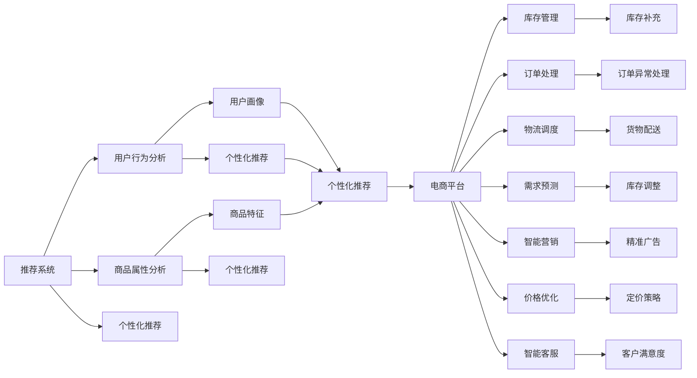

                 

# AI在电商中的多方面应用案例

在数字化转型的大潮中，人工智能(AI)已经成为了电商行业的重要引擎，驱动着从营销、推荐、客服到物流等各个环节的升级迭代。本文将深入探讨AI在电商中的多方面应用案例，展示AI技术如何助力电商企业实现智能化运营，提升用户体验和业务效率。

## 1. 背景介绍

### 1.1 电商行业现状
电商行业正在经历从流量驱动向数据驱动的转变。以亚马逊、阿里巴巴、京东等全球巨头为代表，电商平台的竞争已经从价格、服务升级到基于AI的个性化和智能化服务。据《2022年全球AI投资趋势报告》显示，AI在电商行业的应用渗透率正在逐步提高，AI驱动的市场规模将达到数百亿级别。

### 1.2 AI在电商中的核心价值
AI在电商中的核心价值在于：
- 提升用户体验：通过推荐系统、智能客服、个性化营销等方式，使消费者获得更精准、更及时的购物体验。
- 优化运营效率：通过数据分析和预测，实现库存管理、订单处理、物流调度等环节的自动化和智能化。
- 增加收入和利润：通过精准营销、需求预测、价格优化等策略，提升销售额和利润率。

## 2. 核心概念与联系

### 2.1 核心概念概述

AI在电商中的应用涉及多个核心概念，包括但不限于：

- **推荐系统(Recommendation System)**：通过分析用户行为和商品属性，为每个用户生成个性化推荐，提升购买转化率。
- **智能客服(Intelligent Customer Service)**：利用自然语言处理(NLP)、语音识别等技术，实现智能问答、情感分析、自动化处理等功能。
- **图像识别(Image Recognition)**：通过深度学习模型，自动识别商品、提取特征，应用于库存管理、商品搜索等场景。
- **价格优化(Pricing Optimization)**：根据市场需求、成本、竞争对手等信息，自动调整商品价格，优化利润率。
- **需求预测(Demand Prediction)**：利用时间序列分析、机器学习等技术，预测商品销售趋势，优化库存和物流。
- **智能营销(Intelligent Marketing)**：通过分析用户数据，精准定位目标客户，实施个性化营销活动。

这些概念之间相互联系，共同构成了电商AI应用的生态系统。

### 2.2 核心概念原理和架构的 Mermaid 流程图



这个流程图展示了AI在电商应用中的主要功能和流程：

1. 推荐系统通过分析用户行为和商品属性，生成个性化推荐。
2. 智能客服利用NLP技术，进行智能问答和情感分析。
3. 图像识别用于商品自动识别和特征提取。
4. 价格优化通过需求预测和竞争分析，自动调整商品价格。
5. 需求预测利用时间序列分析，预测商品销售趋势。
6. 智能营销通过用户数据分析，实施个性化营销活动。
7. 这些功能通过电商平台集成，提升运营效率和用户体验。

## 3. 核心算法原理 & 具体操作步骤

### 3.1 算法原理概述

AI在电商中的核心算法包括推荐算法、自然语言处理(NLP)、图像识别、时间序列分析等。其中，推荐算法是最具代表性的AI技术，广泛应用于电商平台的个性化推荐。

推荐算法一般基于协同过滤、基于内容的推荐、深度学习等方法。协同过滤通过分析用户行为，发现用户之间的相似性，生成推荐；基于内容的推荐通过分析商品属性和用户兴趣，推荐类似商品；深度学习模型则通过学习用户和商品特征，预测用户行为和推荐效果。

### 3.2 算法步骤详解

#### 3.2.1 推荐系统算法步骤

1. **数据收集与预处理**：收集用户行为数据（如点击、浏览、购买记录）、商品属性数据、用户画像数据等，并进行清洗和归一化处理。

2. **模型训练**：利用收集到的数据，训练推荐模型。常用的模型包括基于矩阵分解的模型（如ALS、SVD++）、基于神经网络的模型（如DeepFM、NeuMF）、基于图神经网络的模型（如GraphSAGE）等。

3. **推荐计算**：根据用户和商品的特征，利用训练好的模型，计算用户对每个商品的兴趣权重，生成个性化推荐列表。

4. **推荐评估与优化**：通过A/B测试等手段，评估推荐效果，优化模型参数，提升推荐精度和用户体验。

#### 3.2.2 智能客服算法步骤

1. **意图识别**：通过NLP技术，分析用户输入的自然语言，识别出用户意图（如查询商品、咨询订单、投诉等）。

2. **实体抽取**：从用户输入中提取出关键实体（如商品ID、订单号、用户ID等），用于后续处理。

3. **知识库匹配**：利用知识图谱或FAQ库，匹配用户意图，并生成相应的回答模板。

4. **自然语言生成**：通过生成式模型（如Seq2Seq、GPT-3），生成自然流畅的回答，回答用户问题。

5. **回答质量评估**：评估生成的回答质量，优化回答模板和生成模型，提升回答准确性和自然度。

#### 3.2.3 图像识别算法步骤

1. **数据收集与标注**：收集商品图片，并人工标注出关键特征（如颜色、材质、尺寸等）。

2. **模型训练**：利用标注好的数据集，训练图像识别模型（如CNN、ResNet等）。

3. **特征提取**：利用训练好的模型，对新图片进行特征提取，识别出商品的关键属性。

4. **应用场景**：在库存管理中，用于自动补货；在商品搜索中，用于匹配用户输入和商品图片。

#### 3.2.4 需求预测算法步骤

1. **数据收集与预处理**：收集历史销售数据、库存数据、市场趋势数据等，并进行清洗和归一化处理。

2. **模型训练**：利用时间序列分析、机器学习等方法，训练需求预测模型（如ARIMA、LSTM、XGBoost等）。

3. **预测计算**：利用训练好的模型，对未来的销售趋势进行预测。

4. **预测结果应用**：根据预测结果，调整库存和物流计划，提升运营效率。

### 3.3 算法优缺点

#### 3.3.1 推荐系统的优缺点

**优点**：
- 个性化推荐可提升用户购买转化率和满意度。
- 数据驱动的推荐可以动态调整，适应市场变化。
- 结合用户行为和商品属性，推荐效果更加精准。

**缺点**：
- 数据隐私问题：需要收集用户行为数据，可能引发隐私泄露。
- 冷启动问题：新用户或新商品的推荐准确率较低。
- 计算复杂度高：大规模数据集和模型复杂度，导致计算成本较高。

#### 3.3.2 智能客服的优缺点

**优点**：
- 24/7全天候服务，提升用户满意度。
- 自动化处理重复问题，减少人力成本。
- 多模态输入输出，提升用户体验。

**缺点**：
- 无法处理复杂问题：复杂的查询或投诉可能需要人工干预。
- 依赖语料库质量：知识库的覆盖率和更新频率影响回答质量。
- 语言多样性问题：不同地区和语言的用户可能无法获得满意的答案。

#### 3.3.3 图像识别的优缺点

**优点**：
- 自动化处理商品信息，提高数据处理效率。
- 精确匹配商品属性，提升商品搜索和推荐效果。

**缺点**：
- 对图片质量敏感：低质量或遮挡的图片可能影响识别效果。
- 需要大量标注数据：标注数据集的建设成本较高。
- 特征提取难度大：复杂商品的特征提取可能比较困难。

#### 3.3.4 需求预测的优缺点

**优点**：
- 提前调整库存和物流，减少缺货和滞销情况。
- 实时监控市场趋势，提升决策效率。

**缺点**：
- 数据收集难度高：需要收集详细的市场数据和销售数据。
- 模型复杂度高：需要构建高精度的预测模型。
- 结果可能受外部因素影响：如节假日、季节性波动等。

### 3.4 算法应用领域

AI在电商中的应用涵盖了从营销、推荐、客服到物流等多个领域：

- **营销**：个性化营销、精准广告、用户细分等。
- **推荐**：商品推荐、内容推荐、跨域推荐等。
- **客服**：智能问答、情感分析、自动化处理等。
- **库存管理**：自动补货、库存优化等。
- **订单处理**：订单异常检测、智能调单等。
- **物流调度**：货物配送优化、路线规划等。
- **价格优化**：动态定价、促销策略等。

这些应用领域的交叉融合，使电商AI系统能够更全面地提升业务效率和用户体验。

## 4. 数学模型和公式 & 详细讲解 & 举例说明

### 4.1 数学模型构建

AI在电商中的应用，主要基于以下几个数学模型：

- **协同过滤模型**：假设用户对商品的评分可以表示为：$r_{ui}=v_u \cdot p_i + \epsilon_{ui}$，其中 $v_u$ 和 $p_i$ 为用户和商品的潜在特征向量，$\epsilon_{ui}$ 为噪声。
- **深度学习模型**：利用神经网络对用户和商品特征进行编码，预测用户对商品评分或点击概率，如：$z_{ui} = W_u^T x_u + W_i^T x_i + b_{ui}$，其中 $z_{ui}$ 为预测评分或点击概率，$W_u$、$W_i$ 和 $b_{ui}$ 为模型参数。
- **时间序列模型**：利用时间序列分析方法，预测商品销售趋势，如ARIMA模型：$y_{t+1}=\alpha y_t + \beta x_t + \epsilon_t$，其中 $y_t$ 为第 $t$ 天的销售量，$x_t$ 为第 $t$ 天的市场因素，$\alpha$、$\beta$ 和 $\epsilon_t$ 为模型参数。

### 4.2 公式推导过程

以协同过滤模型为例，推导其评分预测公式：

1. **用户评分表示**：假设用户 $u$ 对商品 $i$ 的评分 $r_{ui}$ 可以表示为：$r_{ui}=v_u \cdot p_i + \epsilon_{ui}$，其中 $v_u$ 和 $p_i$ 为用户和商品的潜在特征向量，$\epsilon_{ui}$ 为噪声。

2. **评分矩阵分解**：将评分矩阵 $R$ 分解为用户特征矩阵 $V$ 和商品特征矩阵 $P$ 的乘积，即 $R=VP+\epsilon$，其中 $\epsilon$ 为噪声矩阵。

3. **评分预测**：利用分解后的矩阵，预测用户对商品 $i$ 的评分，即：$r_{ui}=\sum_{j=1}^n v_{uj}p_{ij}$。

### 4.3 案例分析与讲解

#### 4.3.1 协同过滤推荐案例

假设电商平台有1000万用户和1000万商品，每个用户对100个商品进行了评分。利用协同过滤模型进行个性化推荐，步骤如下：

1. **数据收集与预处理**：收集用户评分数据，并进行清洗和归一化处理。

2. **模型训练**：对评分矩阵 $R$ 进行分解，得到用户特征矩阵 $V$ 和商品特征矩阵 $P$。

3. **评分预测**：利用分解后的矩阵，预测用户对商品的评分，生成推荐列表。

4. **推荐评估**：通过A/B测试等手段，评估推荐效果，优化模型参数，提升推荐精度和用户体验。

## 5. 项目实践：代码实例和详细解释说明

### 5.1 开发环境搭建

在进行电商AI应用开发前，需要准备好开发环境。以下是使用Python进行TensorFlow和Keras开发的环境配置流程：

1. 安装Anaconda：从官网下载并安装Anaconda，用于创建独立的Python环境。

2. 创建并激活虚拟环境：
```bash
conda create -n tensorflow-env python=3.8 
conda activate tensorflow-env
```

3. 安装TensorFlow和Keras：
```bash
pip install tensorflow
pip install keras
```

4. 安装各类工具包：
```bash
pip install numpy pandas scikit-learn matplotlib tqdm jupyter notebook ipython
```

完成上述步骤后，即可在`tensorflow-env`环境中开始电商AI应用的开发。

### 5.2 源代码详细实现

这里我们以推荐系统为例，给出使用TensorFlow和Keras对协同过滤推荐模型进行开发的PyTorch代码实现。

首先，定义推荐系统的数据处理函数：

```python
import tensorflow as tf
from tensorflow.keras.layers import Input, Embedding, Dot, Dense
from tensorflow.keras.models import Model

def create_model(n_users, n_items, latent_dim):
    user_input = Input(shape=(n_items,), name='user')
    item_input = Input(shape=(n_users,), name='item')
    
    user_embedding = Embedding(n_users, latent_dim)(user_input)
    item_embedding = Embedding(n_items, latent_dim)(item_input)
    
    dot_product = Dot(axes=[2,1])([user_embedding, item_embedding])
    dot_product = Dense(1)(dot_product)
    
    dot_product = tf.nn.sigmoid(dot_product)
    dot_product = tf.squeeze(dot_product)
    
    model = Model(inputs=[user_input, item_input], outputs=dot_product)
    
    model.compile(optimizer='adam', loss='binary_crossentropy', metrics=['accuracy'])
    return model
```

然后，定义数据生成函数：

```python
import numpy as np

def generate_data(n_users, n_items, n_ratings, n_train, n_test, seed=42):
    np.random.seed(seed)
    user_ids = np.random.randint(0, n_users, size=n_train+n_test)
    item_ids = np.random.randint(0, n_items, size=n_train+n_test)
    rating_true = np.random.rand(n_train+n_test)
    
    user_features = np.random.rand(n_users, n_items)
    item_features = np.random.rand(n_items, n_users)
    
    user_ids = np.vstack([user_features[:, item_ids], user_features[item_ids, :]])
    item_ids = np.vstack([item_features[:, user_ids], item_features[user_ids, :]])
    rating_true = np.vstack([rating_true[:, item_ids], rating_true[item_ids, :]])
    
    return user_ids, item_ids, rating_true
```

接着，定义模型训练函数：

```python
def train_model(model, user_ids, item_ids, rating_true, epochs=50, batch_size=256):
    model.fit([user_ids, item_ids], rating_true, epochs=epochs, batch_size=batch_size, validation_split=0.2)
```

最后，启动模型训练：

```python
n_users = 1000
n_items = 1000
latent_dim = 50
n_ratings = 5
n_train = 50000
n_test = 10000

user_ids, item_ids, rating_true = generate_data(n_users, n_items, n_ratings, n_train, n_test)

model = create_model(n_users, n_items, latent_dim)
train_model(model, user_ids, item_ids, rating_true)

user_ids_test, item_ids_test, rating_true_test = generate_data(n_users, n_items, n_ratings, n_train, n_test)
test_loss, test_acc = model.evaluate([user_ids_test, item_ids_test], rating_true_test)
print('Test Loss:', test_loss)
print('Test Accuracy:', test_acc)
```

以上就是使用TensorFlow和Keras对协同过滤推荐模型进行开发的完整代码实现。可以看到，利用TensorFlow和Keras，推荐模型的构建和训练变得简单易懂，开发者可以快速上手进行实践。

### 5.3 代码解读与分析

让我们再详细解读一下关键代码的实现细节：

**create_model函数**：
- 定义用户和商品的输入层，通过Embedding层将输入转换为低维向量表示。
- 计算用户和商品向量的点积，通过Sigmoid函数得到预测评分。
- 利用Dense层将点积结果转换为0-1之间的值，作为推荐评分。
- 构建Keras模型，设置损失函数和优化器，并返回模型。

**generate_data函数**：
- 生成随机用户ID、商品ID和评分真值。
- 生成用户和商品的特征矩阵，分别计算用户和商品向量的乘积。
- 将乘积结果展平，作为模型的输入和输出。

**train_model函数**：
- 定义模型训练过程，利用fit函数进行模型训练。
- 设置训练轮数和批大小，并设置验证集的占比。

**模型训练**：
- 定义用户和商品的总数，生成数据的维度。
- 调用generate_data函数生成训练和测试数据。
- 构建推荐模型，设置训练轮数和批大小。
- 调用train_model函数进行模型训练。
- 调用evaluate函数在测试集上评估模型性能，输出损失和准确率。

可以看到，利用TensorFlow和Keras，电商AI应用的开发变得简单高效，可以快速迭代和优化模型性能。

## 6. 实际应用场景

### 6.1 智能营销

智能营销是电商AI应用的重要场景之一，通过精准定位和个性化推荐，提升广告投放的转化率和ROI。具体而言，智能营销系统可以通过以下方式实现：

1. **用户画像分析**：利用NLP和图像识别技术，分析用户的行为、兴趣和偏好，构建用户画像。
2. **市场细分**：根据用户画像，将用户分为不同细分市场，实施精准营销策略。
3. **个性化推荐**：根据用户画像和市场细分，生成个性化推荐内容，提升用户点击率和转化率。

例如，电商平台的广告系统可以利用用户行为数据和商品属性数据，生成精准的广告推荐。通过A/B测试等手段，不断优化广告创意和投放策略，提升广告效果。

### 6.2 库存管理

库存管理是电商运营的核心环节，通过AI技术实现库存优化，可以减少缺货和滞销现象，提升库存周转率。具体而言，库存管理系统可以通过以下方式实现：

1. **需求预测**：利用时间序列分析和机器学习模型，预测商品销售趋势，生成库存需求。
2. **自动补货**：根据预测结果，自动调整库存水平，确保商品供需平衡。
3. **库存优化**：利用优化算法，对库存进行优化配置，减少库存成本。

例如，亚马逊的库存管理系统可以通过需求预测和自动补货，实现库存的实时优化。利用机器学习模型对历史销售数据进行分析，预测未来的销售趋势，从而调整库存水平。

### 6.3 智能客服

智能客服系统是电商AI应用的另一个重要场景，通过自然语言处理和语音识别技术，实现智能问答和情感分析，提升客户满意度。具体而言，智能客服系统可以通过以下方式实现：

1. **意图识别**：利用NLP技术，分析用户输入的自然语言，识别出用户意图。
2. **实体抽取**：从用户输入中提取出关键实体，用于后续处理。
3. **知识库匹配**：利用知识图谱或FAQ库，匹配用户意图，并生成相应的回答模板。
4. **自然语言生成**：通过生成式模型，生成自然流畅的回答，回答用户问题。
5. **回答质量评估**：评估生成的回答质量，优化回答模板和生成模型。

例如，阿里巴巴的智能客服系统可以通过自然语言处理技术，实现自动问答和情感分析。利用NLP技术分析用户输入的自然语言，识别出用户意图，并从知识图谱中匹配回答模板，生成自然流畅的回答，提升客户满意度。

### 6.4 未来应用展望

展望未来，AI在电商中的应用将更加广泛和深入，具体趋势如下：

1. **AI驱动的个性化营销**：通过深度学习和强化学习，实现更精准的用户画像和个性化推荐，提升广告投放效果。
2. **智能库存管理系统**：利用AI进行需求预测和库存优化，减少缺货和滞销现象，提升库存周转率。
3. **智能客服和用户体验**：通过NLP和语音识别技术，实现更智能的客户服务，提升用户体验和满意度。
4. **跨模态智能交互**：利用图像识别和语音识别技术，实现跨模态的智能交互，提升用户操作体验。
5. **实时数据处理和决策支持**：通过实时数据分析和预测，提供决策支持，优化电商运营效率。
6. **AI驱动的供应链管理**：利用AI进行供应链优化和物流调度，提升供应链效率和响应速度。

## 7. 工具和资源推荐

### 7.1 学习资源推荐

为了帮助开发者系统掌握电商AI应用的理论基础和实践技巧，这里推荐一些优质的学习资源：

1. 《深度学习理论与实践》：深度学习领域的经典教材，涵盖深度学习的基本原理和应用案例，推荐阅读。
2. CS285《强化学习》课程：斯坦福大学开设的强化学习课程，包含视频和讲义，深入讲解强化学习的基本理论和实践。
3. 《自然语言处理综论》：自然语言处理领域的经典教材，涵盖NLP的基本概念和技术，推荐阅读。
4. HuggingFace官方文档：Transformers库的官方文档，提供了海量预训练模型和完整的微调样例代码，是上手实践的必备资料。
5. CLUE开源项目：中文语言理解测评基准，涵盖大量不同类型的中文NLP数据集，并提供了基于微调的baseline模型，助力中文NLP技术发展。

通过对这些资源的学习实践，相信你一定能够快速掌握电商AI应用的精髓，并用于解决实际的电商问题。

### 7.2 开发工具推荐

高效的开发离不开优秀的工具支持。以下是几款用于电商AI开发常用的工具：

1. Jupyter Notebook：开源的交互式编程环境，支持Python和R等编程语言，适合数据处理和模型训练。
2. TensorFlow：由Google主导开发的开源深度学习框架，生产部署方便，适合大规模工程应用。
3. Keras：高层次的神经网络API，简单易用，适合快速原型开发和模型训练。
4. Scikit-learn：Python中的经典机器学习库，提供了多种算法和工具，支持数据预处理和模型评估。
5. Pandas：Python中的数据处理库，提供了高效的数据清洗和分析工具，适合电商数据处理。
6. Apache Spark：分布式计算框架，适合大规模数据处理和分析，支持电商数据实时处理和存储。

合理利用这些工具，可以显著提升电商AI应用的开发效率，加快创新迭代的步伐。

### 7.3 相关论文推荐

电商AI应用的研究涉及多个前沿方向，以下是几篇代表性的相关论文，推荐阅读：

1. "Personalized Recommendation Models in E-commerce"：研究如何通过深度学习和协同过滤技术，实现电商推荐系统的个性化推荐。
2. "Customer Sentiment Analysis using Natural Language Processing"：研究如何利用NLP技术，进行客户情感分析，提升用户体验。
3. "Real-time Demand Prediction in E-commerce"：研究如何利用时间序列分析和机器学习技术，实现电商需求预测和库存优化。
4. "Practical Implementations of AI in E-commerce"：研究如何将AI技术应用到电商运营的各个环节，提升业务效率和用户体验。

这些论文代表了大电商AI应用的研究方向和技术进展，通过学习这些前沿成果，可以帮助研究者把握学科前进方向，激发更多的创新灵感。

## 8. 总结：未来发展趋势与挑战

### 8.1 研究成果总结

本文对AI在电商中的应用进行了系统介绍，展示了AI技术在推荐系统、智能客服、库存管理、需求预测等各个环节的广泛应用。通过这些案例，可以看到AI技术在电商领域的强大潜力和广阔前景。

### 8.2 未来发展趋势

展望未来，AI在电商中的应用将呈现以下几个发展趋势：

1. **AI驱动的个性化营销**：通过深度学习和强化学习，实现更精准的用户画像和个性化推荐，提升广告投放效果。
2. **智能库存管理系统**：利用AI进行需求预测和库存优化，减少缺货和滞销现象，提升库存周转率。
3. **智能客服和用户体验**：通过NLP和语音识别技术，实现更智能的客户服务，提升用户体验和满意度。
4. **跨模态智能交互**：利用图像识别和语音识别技术，实现跨模态的智能交互，提升用户操作体验。
5. **实时数据处理和决策支持**：通过实时数据分析和预测，提供决策支持，优化电商运营效率。
6. **AI驱动的供应链管理**：利用AI进行供应链优化和物流调度，提升供应链效率和响应速度。

### 8.3 面临的挑战

尽管AI在电商中的应用已经取得了显著进展，但在迈向更加智能化、普适化应用的过程中，仍面临诸多挑战：

1. **数据隐私问题**：电商平台需要收集大量的用户数据，涉及用户隐私和数据安全问题。如何在保证用户隐私的前提下，最大化数据利用价值，是亟待解决的问题。
2. **计算资源瓶颈**：大规模电商数据处理和AI模型训练需要强大的计算资源支持。如何优化计算资源利用，提升模型训练和推理效率，是实现大规模应用的关键。
3. **算法复杂性**：电商AI应用的算法复杂度高，涉及多种算法和模型，需要具备深厚的技术背景。如何简化算法复杂度，降低技术门槛，是推广AI应用的难题。
4. **模型可解释性**：电商AI模型往往是"黑盒"系统，难以解释其内部工作机制和决策逻辑。如何增强模型的可解释性，保障算法决策透明和可控，是应用落地时需要重点考虑的问题。
5. **伦理和合规问题**：电商AI应用可能涉及用户隐私、数据安全等问题，需要符合伦理和法规要求。如何在合规的前提下，提升用户体验和业务效率，是应用推广的重要课题。

### 8.4 研究展望

未来，电商AI应用的研究需要在以下几个方面寻求新的突破：

1. **用户隐私保护**：研究如何利用差分隐私、联邦学习等技术，保护用户隐私，同时最大化数据利用价值。
2. **计算资源优化**：研究如何利用分布式计算、GPU/TPU等硬件加速技术，提升模型训练和推理效率。
3. **算法简化**：研究如何利用轻量级模型、快速算法等手段，简化算法复杂度，降低技术门槛。
4. **模型可解释性**：研究如何利用可解释AI(XAI)技术，增强模型的可解释性，保障算法决策透明和可控。
5. **伦理和合规研究**：研究如何在合规的前提下，提升用户体验和业务效率，保障用户隐私和数据安全。

这些研究方向将进一步推动电商AI应用的普及和发展，为电商行业带来更广阔的创新空间。相信随着技术的不断进步，AI在电商中的应用将更加广泛和深入，助力电商行业实现智能化、普适化的升级。

## 9. 附录：常见问题与解答

**Q1：AI在电商中的应用如何平衡用户隐私与数据利用？**

A: AI在电商中的应用，需要在保护用户隐私和最大化数据利用价值之间找到平衡点。以下是几种常见的方法：

1. **差分隐私**：通过添加噪声或扰动，保护用户隐私的同时，仍然可以获取有价值的数据。例如，在用户评分数据中，可以通过添加Laplace噪声来保护用户隐私。

2. **联邦学习**：通过分布式计算，让各个节点在自己的本地数据上训练模型，只上传模型参数，不共享原始数据。这样可以保护用户隐私，同时利用大规模数据进行模型训练。

3. **匿名化处理**：对用户数据进行匿名化处理，去除可以识别用户的信息，保护用户隐私。例如，在用户画像数据中，可以只使用年龄、性别等匿名特征，不使用姓名、地址等敏感信息。

4. **用户授权管理**：通过用户授权管理，确保用户对数据的知情权和控制权。用户可以选择是否共享数据，以及共享哪些数据，从而保护隐私。

**Q2：AI在电商中的应用如何优化计算资源利用？**

A: AI在电商中的应用，需要优化计算资源利用，以提升模型训练和推理效率。以下是几种常见的方法：

1. **分布式计算**：通过分布式计算框架（如Spark、Ray等），将计算任务分配到多个节点上进行并行处理，提升计算效率。

2. **GPU/TPU加速**：利用高性能硬件（如GPU、TPU等）进行计算加速，提升模型训练和推理速度。例如，使用TensorFlow的TPU优化器，可以大幅提升深度学习模型的训练效率。

3. **模型压缩**：通过模型压缩技术（如剪枝、量化、蒸馏等），减少模型参数量和计算量，提升模型训练和推理速度。例如，使用TensorFlow的模型优化器，可以压缩模型，减少内存占用和计算时间。

4. **增量学习**：通过增量学习技术（如在线学习、小样本学习等），减少模型训练数据量和计算时间。例如，在电商需求预测中，可以利用历史数据和实时数据进行增量学习，提升预测效果。

5. **缓存优化**：通过缓存技术（如TensorFlow的变量缓存），减少模型计算重复，提升模型训练和推理效率。例如，在电商推荐系统中，可以缓存已训练好的模型，减少重复计算，提升推荐速度。

**Q3：AI在电商中的应用如何简化算法复杂度？**

A: AI在电商中的应用，需要简化算法复杂度，降低技术门槛，提升模型的可解释性和可操作性。以下是几种常见的方法：

1. **模型简化**：选择简单易用的模型，避免复杂的深度学习模型。例如，在电商需求预测中，可以选择线性回归模型、ARIMA模型等，避免复杂的深度学习模型。

2. **算法优化**：优化算法流程，提升模型训练和推理效率。例如，在电商推荐系统中，可以通过增加训练批次大小、减少迭代次数等手段，优化算法流程，提升模型训练速度。

3. **轻量级模型**：使用轻量级模型，减少模型参数量和计算量。例如，在电商智能客服中，可以使用轻量级的Transformer模型，减少模型计算量和内存占用。

4. **模型蒸馏**：利用模型蒸馏技术，将复杂的模型压缩为轻量级模型。例如，在电商推荐系统中，可以使用知识蒸馏技术，将复杂的深度学习模型压缩为轻量级模型。

5. **可解释AI(XAI)**：使用可解释AI技术，增强模型的可解释性，降低技术门槛。例如，在电商推荐系统中，可以使用可解释AI技术，生成模型决策路径，帮助用户理解推荐结果。

**Q4：AI在电商中的应用如何增强模型的可解释性？**

A: AI在电商中的应用，需要增强模型的可解释性，保障算法决策透明和可控。以下是几种常见的方法：

1. **模型可视化**：通过模型可视化技术，展示模型的决策过程和特征重要性。例如，在电商推荐系统中，可以使用特征重要性可视化技术，展示推荐结果的决策依据。

2. **因果分析**：通过因果分析方法，识别出模型决策的关键特征，增强输出解释的因果性和逻辑性。例如，在电商智能客服中，可以使用因果分析方法，识别出影响客户满意度的关键因素。

3. **规则抽取**：通过规则抽取技术，生成可解释的规则集合。例如，在电商智能客服中，可以抽取客户意图识别规则，帮助用户理解智能客服的工作机制。

4. **模型解释工具**：使用模型解释工具，生成模型解释报告，帮助用户理解模型决策。例如，在电商推荐系统中，可以使用模型解释工具，生成推荐结果的解释报告。

5. **用户反馈机制**：通过用户反馈机制，获取用户对模型决策的评价，反馈到模型训练中，优化模型性能。例如，在电商智能客服中，可以通过用户评价机制，优化智能客服的回答质量。

---

作者：禅与计算机程序设计艺术 / Zen and the Art of Computer Programming

