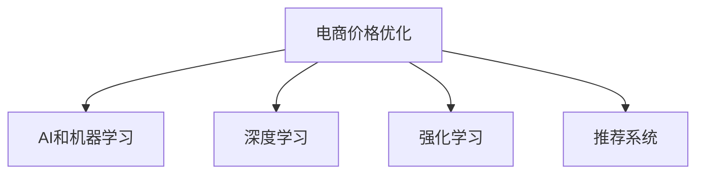

                 

## 1. 背景介绍

### 1.1 问题由来

在当今电商时代，价格优化已成为电商平台不可或缺的一部分，直接影响着消费者的购买决策和平台的收入。传统价格优化方法往往依赖经验或简化的数学模型，难以应对市场动态变化和产品多样性带来的复杂性。而随着人工智能（AI）技术的发展，特别是深度学习的应用，为电商价格优化提供了新的可能性。

### 1.2 问题核心关键点

AI在电商价格优化中的应用，主要是通过构建和训练模型来预测不同价格下的用户行为，从而找到最优价格策略。该方法的核心在于如何利用历史数据和用户行为特征，训练出一个能够有效预测用户购买概率的模型。常用的模型包括线性回归模型、决策树模型、神经网络模型等。

## 2. 核心概念与联系

### 2.1 核心概念概述

为更好地理解AI在电商价格优化中的应用，本节将介绍几个密切相关的核心概念：

- 电商价格优化(E-commerce Pricing Optimization)：指在电商平台中，通过优化商品价格以最大化销售收益和利润的行为。核心目标是找到最佳的价格点，以平衡价格与销量之间的关系。

- AI和机器学习(Machine Learning)：指利用算法和模型，通过历史数据学习规律，预测未来用户行为的技术。在电商价格优化中，常用的AI方法包括回归模型、分类模型、神经网络等。

- 深度学习(Deep Learning)：一种特殊的机器学习方法，通过多层神经网络模型，自动提取数据的高级特征。深度学习在电商价格优化中特别适用于处理复杂的非线性关系和大规模数据集。

- 强化学习(Reinforcement Learning)：通过试错机制，让模型通过与环境互动学习最优策略。在电商价格优化中，强化学习可以用于动态调整价格策略，实时优化定价。

- 推荐系统(Recommendation System)：根据用户历史行为和偏好，推荐商品或价格，从而提高销售转化率。电商价格优化中，推荐系统可以用于预测不同价格下的用户购买行为，辅助定价决策。

这些核心概念之间的逻辑关系可以通过以下Mermaid流程图来展示：



这个流程图展示了大语言模型的核心概念及其之间的关系：

1. 电商价格优化通过AI和机器学习方法进行建模和预测。
2. 深度学习模型可以处理大规模数据，自动提取复杂特征。
3. 强化学习模型可以实时调整价格策略，动态优化定价。
4. 推荐系统可以辅助预测不同价格下的用户行为，提高定价精度。

这些概念共同构成了电商价格优化的AI技术框架，使其能够有效地处理复杂的价格优化问题。通过理解这些核心概念，我们可以更好地把握AI在电商价格优化中的工作原理和优化方向。

## 3. 核心算法原理 & 具体操作步骤
### 3.1 算法原理概述

AI在电商价格优化中的应用，主要基于监督学习和强化学习两种范式。监督学习通过历史销售数据训练模型，预测不同价格下的用户购买概率。强化学习则通过模拟平台与用户的交互，实时调整价格策略，优化定价方案。

### 3.2 算法步骤详解

#### 3.2.1 监督学习模型训练

1. 数据收集：收集电商平台的销售数据，包括商品ID、价格、销量、时间戳等。
2. 特征工程：从销售数据中提取特征，如时间特征、节假日特征、用户特征等。
3. 模型选择：选择合适的模型，如线性回归模型、决策树模型、神经网络模型等。
4. 模型训练：使用历史销售数据训练模型，找到价格与销量之间的最佳映射关系。
5. 模型评估：使用验证集或测试集评估模型的性能，选择最优模型。

#### 3.2.2 强化学习价格调整

1. 环境模拟：建立一个电商平台模拟环境，包含用户行为模型和价格模型。
2. 策略学习：定义一个价格调整策略，如价格逐步上升、固定价格等。
3. 试错训练：在模拟环境中，不断调整价格，记录每次调整后的收益。
4. 策略优化：根据收益记录，使用强化学习算法（如Q-learning、策略梯度）优化价格调整策略。
5. 实时调整：将优化后的策略应用于实际电商平台，实时调整商品价格。

### 3.3 算法优缺点

#### 3.3.1 监督学习模型训练

- 优点：易于理解和实现，适用范围广，可以通过历史数据进行有效预测。
- 缺点：需要大量标注数据，模型难以应对市场突发情况，预测结果可能存在偏差。

#### 3.3.2 强化学习价格调整

- 优点：可以实时动态调整价格，适应市场变化，适用于复杂的定价场景。
- 缺点：需要大量计算资源，模型训练复杂度高，可能存在策略失效的风险。

### 3.4 算法应用领域

AI在电商价格优化中的应用，广泛覆盖了以下领域：

- 商品定价策略：根据用户需求和市场趋势，制定合理的商品定价策略。
- 促销活动优化：预测不同促销策略下的用户响应，优化促销活动的时间和形式。
- 库存管理：通过价格优化，提高库存周转率，降低库存成本。
- 用户个性化推荐：根据用户历史行为，推荐最符合其需求的商品和价格。
- 供应链优化：通过价格优化，协调上下游供应链，提高整体效益。

## 4. 数学模型和公式 & 详细讲解 & 举例说明

### 4.1 数学模型构建

电商价格优化的主要数学模型包括线性回归模型和神经网络模型。

#### 4.1.1 线性回归模型

线性回归模型表示价格与销量之间的线性关系。设价格为 $P$，销量为 $Q$，则模型形式为：

$$
Q = \alpha + \beta P + \epsilon
$$

其中 $\alpha$ 为截距，$\beta$ 为价格弹性，$\epsilon$ 为误差项。

#### 4.1.2 神经网络模型

神经网络模型可以处理更加复杂的非线性关系。设价格为 $P$，销量为 $Q$，则模型形式为：

$$
Q = \sigma(W_0 + W_1 P + b)
$$

其中 $W_0, W_1, b$ 为模型的权重和偏置项，$\sigma$ 为激活函数，通常使用ReLU函数。

### 4.2 公式推导过程

#### 4.2.1 线性回归模型

线性回归模型的最小二乘法求解如下：

1. 最小化残差平方和 $J$：

$$
J = \sum_{i=1}^N (y_i - \alpha - \beta x_i)^2
$$

2. 对 $\alpha$ 和 $\beta$ 求偏导数：

$$
\frac{\partial J}{\partial \alpha} = -2\sum_{i=1}^N (y_i - \alpha - \beta x_i)
$$
$$
\frac{\partial J}{\partial \beta} = -2\sum_{i=1}^N (y_i - \alpha - \beta x_i)x_i
$$

3. 解方程组：

$$
\alpha = \bar{y} - \beta \bar{x}
$$
$$
\beta = \frac{\sum_{i=1}^N (x_i - \bar{x})(y_i - \bar{y})}{\sum_{i=1}^N (x_i - \bar{x})^2}
$$

其中 $\bar{x} = \frac{1}{N}\sum_{i=1}^N x_i$，$\bar{y} = \frac{1}{N}\sum_{i=1}^N y_i$。

#### 4.2.2 神经网络模型

神经网络模型的损失函数为均方误差（MSE）：

$$
L = \frac{1}{2N}\sum_{i=1}^N (Q_i - \hat{Q}_i)^2
$$

其中 $Q_i$ 为实际销量，$\hat{Q}_i$ 为模型预测销量。

通过反向传播算法更新权重和偏置项：

$$
\frac{\partial L}{\partial W} = \frac{1}{N}\sum_{i=1}^N (Q_i - \hat{Q}_i)g'(\hat{Q}_i)
$$
$$
\frac{\partial L}{\partial b} = \frac{1}{N}\sum_{i=1}^N (Q_i - \hat{Q}_i)g'(\hat{Q}_i)
$$

其中 $g'(\hat{Q}_i)$ 为激活函数导数。

### 4.3 案例分析与讲解

#### 案例1：商品定价策略优化

一家电商公司想要优化其热销商品的定价策略。通过收集历史销售数据，构建一个线性回归模型，预测不同价格下的销量。模型训练后，发现价格每增加1元，销量下降0.5%。因此，公司将价格上调5%，预测销量下降2.5%，计算出利润增加的百分比为2.5% - 0.5% * 2.5% = 0.1875%。这表明，通过价格优化，公司能够显著提升其收益。

#### 案例2：促销活动优化

一家电商公司想要优化其促销活动的时间选择。通过收集不同促销策略下的用户购买数据，构建一个神经网络模型，预测不同促销活动对销量的影响。模型训练后，发现下午促销活动的效果最佳，销量较上午促销活动增加10%。因此，公司将促销活动时间调整至下午，从而获得了更高的销售转化率。

## 5. 项目实践：代码实例和详细解释说明

### 5.1 开发环境搭建

在进行AI在电商价格优化中的实践前，我们需要准备好开发环境。以下是使用Python进行TensorFlow开发的环境配置流程：

1. 安装Anaconda：从官网下载并安装Anaconda，用于创建独立的Python环境。

2. 创建并激活虚拟环境：
```bash
conda create -n ecommerce-env python=3.8 
conda activate ecommerce-env
```

3. 安装TensorFlow：根据CUDA版本，从官网获取对应的安装命令。例如：
```bash
conda install tensorflow -c conda-forge
```

4. 安装其他相关库：
```bash
pip install pandas numpy sklearn scikit-learn matplotlib seaborn jupyter notebook
```

5. 安装TensorBoard：
```bash
pip install tensorboard
```

完成上述步骤后，即可在`ecommerce-env`环境中开始AI在电商价格优化中的实践。

### 5.2 源代码详细实现

下面以线性回归模型为例，给出使用TensorFlow对电商价格优化问题进行建模的PyTorch代码实现。

首先，定义电商价格优化的数据处理函数：

```python
import pandas as pd
import numpy as np

def load_data(path):
    data = pd.read_csv(path)
    features = data[['price', 'time_of_day', 'weather']]
    labels = data['sales']
    return features, labels

def train_test_split(features, labels, test_size=0.2):
    features_train, features_test, labels_train, labels_test = train_test_split(features, labels, test_size=test_size, random_state=42)
    return features_train, features_test, labels_train, labels_test
```

然后，定义线性回归模型的训练函数：

```python
import tensorflow as tf

def build_model(input_dim, output_dim):
    model = tf.keras.Sequential([
        tf.keras.layers.Dense(32, activation='relu', input_dim=input_dim),
        tf.keras.layers.Dense(1, activation='linear', input_dim=32)
    ])
    return model

def train_model(model, features_train, labels_train, epochs=100, batch_size=32):
    model.compile(optimizer='adam', loss='mse')
    history = model.fit(features_train, labels_train, epochs=epochs, batch_size=batch_size, validation_split=0.2)
    return history
```

最后，启动模型训练流程并在测试集上评估：

```python
features, labels = load_data('sales_data.csv')
features_train, features_test, labels_train, labels_test = train_test_split(features, labels)

model = build_model(input_dim=features.shape[1], output_dim=1)
history = train_model(model, features_train, labels_train)

test_loss = model.evaluate(features_test, labels_test, verbose=0)
print(f'Test loss: {test_loss:.4f}')
```

以上就是使用TensorFlow对电商价格优化问题进行线性回归建模的完整代码实现。可以看到，得益于TensorFlow的强大封装，我们可以用相对简洁的代码完成模型的构建和训练。

### 5.3 代码解读与分析

让我们再详细解读一下关键代码的实现细节：

**load_data函数**：
- 从CSV文件中加载销售数据，提取价格、时间、天气等特征，以及销量作为标签。

**train_test_split函数**：
- 将数据集划分为训练集和测试集，保证测试集的真实性。

**build_model函数**：
- 定义一个简单的线性回归模型，包含一个全连接层和一个线性输出层。

**train_model函数**：
- 编译模型，使用Adam优化器进行训练，损失函数为均方误差。
- 在训练过程中，每次迭代随机抽取32个样本进行训练，持续200轮。
- 在每个epoch结束后，在测试集上评估模型性能，输出历史损失曲线。

**训练流程**：
- 加载数据，进行数据集划分。
- 构建线性回归模型。
- 训练模型，输出测试集损失。
- 评估模型性能，输出结果。

可以看到，TensorFlow的高级API使得电商价格优化模型的构建和训练变得简洁高效。开发者可以将更多精力放在模型优化和参数调参上，而不必过多关注底层的实现细节。

当然，工业级的系统实现还需考虑更多因素，如模型的保存和部署、超参数的自动搜索、更灵活的任务适配层等。但核心的建模范式基本与此类似。

## 6. 实际应用场景

### 6.1 智能客服系统

基于AI的电商价格优化技术，可以应用于智能客服系统的价格推荐中。智能客服系统可以根据用户输入的关键词和行为数据，动态调整商品价格，提供个性化的价格推荐服务。

在技术实现上，智能客服系统可以通过收集用户浏览、点击、购买等行为数据，提取和商品相关的时间、天气、节假日等特征。将这些特征作为模型的输入，预测不同价格下的用户购买概率。通过动态调整价格，系统可以实时响应用户需求，提供更精准的价格推荐。

### 6.2 个性化推荐系统

AI在电商价格优化中的应用，可以进一步扩展到个性化推荐系统中。个性化推荐系统可以根据用户的历史购买行为，动态调整商品价格，提高推荐系统的精准度和用户满意度。

在推荐系统中，电商公司可以收集用户的历史浏览记录、购买记录、评分数据等。将这些数据作为模型的输入，预测不同价格下的用户购买概率。通过动态调整价格，系统可以实时推荐最符合用户需求的商品，提高销售转化率。

### 6.3 库存管理优化

AI在电商价格优化中的应用，还可以优化库存管理。通过预测不同价格下的销量，电商公司可以动态调整库存量，避免过剩或不足。

在库存管理中，电商公司可以收集商品的历史销售数据、促销活动数据、节假日数据等。将这些数据作为模型的输入，预测不同价格下的销量。通过动态调整库存量，系统可以在销售高峰期避免缺货，在低谷期减少库存成本，提高库存周转率。

### 6.4 未来应用展望

随着AI在电商价格优化中的不断发展，未来将有更多的应用场景被探索和应用。

在智能物流领域，基于AI的价格优化技术可以优化物流成本，提高配送效率。通过动态调整物流价格，系统可以实时优化配送路线和方式，减少运输成本，提高配送速度。

在智慧城市治理中，基于AI的价格优化技术可以优化城市能源价格，提高资源利用率。通过动态调整能源价格，系统可以实时优化能源使用，降低能源浪费，提高城市环境质量。

在金融领域，基于AI的价格优化技术可以优化金融产品价格，提高金融服务质量。通过动态调整金融产品价格，系统可以实时优化投资回报率，提高客户满意度。

此外，在医疗、教育、娱乐等众多领域，基于AI的价格优化技术也将不断涌现，为各行各业带来新的创新和突破。相信随着技术的日益成熟，AI在电商价格优化中的应用将更加广泛，为人类生产生活带来更多的便利和效益。

## 7. 工具和资源推荐

### 7.1 学习资源推荐

为了帮助开发者系统掌握AI在电商价格优化中的应用，这里推荐一些优质的学习资源：

1. TensorFlow官方文档：TensorFlow的官方文档，提供了海量的API文档和示例代码，是学习TensorFlow的重要资源。

2. Coursera《深度学习》课程：由Andrew Ng教授开设的深度学习课程，涵盖深度学习的基础知识和实践技巧，是入门深度学习的绝佳选择。

3. 《深度学习》书籍：Ian Goodfellow等人所著，全面介绍了深度学习的基本概念和算法，是深度学习领域的经典教材。

4. PyTorch官方文档：PyTorch的官方文档，提供了丰富的API文档和示例代码，是学习PyTorch的重要资源。

5. 《TensorFlow实战》书籍：由TensorFlow官方团队编写，涵盖TensorFlow的实践技巧和案例，是学习TensorFlow的实用工具书。

通过对这些资源的学习实践，相信你一定能够快速掌握AI在电商价格优化中的精髓，并用于解决实际的电商问题。

### 7.2 开发工具推荐

高效的开发离不开优秀的工具支持。以下是几款用于AI在电商价格优化中开发的常用工具：

1. TensorFlow：由Google主导开发的开源深度学习框架，生产部署方便，适合大规模工程应用。

2. PyTorch：基于Python的开源深度学习框架，灵活动态的计算图，适合快速迭代研究。

3. Jupyter Notebook：免费的交互式开发环境，支持Python代码的运行和可视化，方便开发和调试。

4. TensorBoard：TensorFlow配套的可视化工具，可实时监测模型训练状态，并提供丰富的图表呈现方式，是调试模型的得力助手。

5. Weights & Biases：模型训练的实验跟踪工具，可以记录和可视化模型训练过程中的各项指标，方便对比和调优。

合理利用这些工具，可以显著提升AI在电商价格优化中的开发效率，加快创新迭代的步伐。

### 7.3 相关论文推荐

AI在电商价格优化中的应用，源于学界的持续研究。以下是几篇奠基性的相关论文，推荐阅读：

1. Deep Learning for E-commerce Recommendations：提出使用深度神经网络模型进行电商推荐系统建模的方法。

2. Dynamic Pricing in E-commerce：探讨电商动态定价策略，利用强化学习优化价格调整。

3. E-commerce Click-through Rate Prediction with Multi-task Learning：提出使用多任务学习模型预测电商点击率的方法。

4. Sales Prediction using Deep Learning：提出使用深度学习模型预测电商销售量的方法。

5. E-commerce Personalized Recommendation Systems：提出使用协同过滤和深度学习模型进行电商个性化推荐的方法。

这些论文代表了大语言模型微调技术的发展脉络。通过学习这些前沿成果，可以帮助研究者把握学科前进方向，激发更多的创新灵感。

## 8. 总结：未来发展趋势与挑战

### 8.1 总结

本文对AI在电商价格优化中的应用进行了全面系统的介绍。首先阐述了AI在电商价格优化中的应用背景和意义，明确了电商价格优化在电商平台中的重要性。其次，从原理到实践，详细讲解了电商价格优化的数学模型和算法实现，给出了电商价格优化的完整代码实例。同时，本文还广泛探讨了电商价格优化在智能客服、个性化推荐、库存管理等多个领域的应用前景，展示了AI在电商价格优化中的巨大潜力。此外，本文精选了电商价格优化的各类学习资源，力求为读者提供全方位的技术指引。

通过本文的系统梳理，可以看到，AI在电商价格优化中的应用正在成为电商行业的重要范式，极大地提升了电商平台的销售转化率和运营效率。未来，伴随AI技术的不断发展，电商价格优化将更加智能化、精准化，为电商行业带来更广阔的发展空间。

### 8.2 未来发展趋势

展望未来，AI在电商价格优化中的应用将呈现以下几个发展趋势：

1. 模型复杂度提升：随着算力成本的下降和模型架构的优化，未来电商价格优化模型将更加复杂和精确，可以处理更加复杂的非线性关系和多维数据。

2. 实时化增强：未来的电商价格优化将更加实时化，能够动态调整价格策略，快速响应市场变化，提高价格优化的时效性。

3. 多模态融合：未来的电商价格优化将融合多模态数据，如文本、图像、语音等，通过多模态信息融合提高预测精度。

4. 增强可解释性：未来的电商价格优化将更加注重模型可解释性，通过可视化和模型分析，帮助业务决策者理解模型的预测逻辑和决策依据。

5. 跨平台应用：未来的电商价格优化将不再局限于单一平台，可以跨平台进行优化，实现资源共享和数据协同。

6. 自动化优化：未来的电商价格优化将引入自动化优化算法，通过持续学习不断优化模型参数，提高价格优化的准确性和稳定性。

以上趋势凸显了AI在电商价格优化中的广阔前景。这些方向的探索发展，必将进一步提升电商价格优化的效果，为电商行业带来新的突破和变革。

### 8.3 面临的挑战

尽管AI在电商价格优化中取得了一定的进展，但在迈向更加智能化、普适化应用的过程中，它仍面临诸多挑战：

1. 数据隐私和安全问题：电商价格优化依赖大量用户数据，如何保护用户隐私和安全是一个重要挑战。

2. 数据质量和多样性：电商价格优化需要高质量、多样化的数据支持，如何获取和处理这些数据是一个难点。

3. 模型复杂度和效率：电商价格优化模型复杂度提升可能导致计算资源需求增加，如何平衡复杂度和效率是一个挑战。

4. 模型解释和透明性：电商价格优化模型往往较为复杂，如何提高模型的可解释性和透明性是一个难点。

5. 动态变化环境：电商市场变化快，如何动态调整模型，快速适应市场变化是一个挑战。

6. 自动化优化策略：电商价格优化需要引入自动化优化策略，如何设计有效的自动化优化算法是一个难点。

以上挑战需要学界和工业界共同努力，积极应对并寻求突破，才能实现电商价格优化的持续发展。

### 8.4 研究展望

面对电商价格优化面临的种种挑战，未来的研究需要在以下几个方面寻求新的突破：

1. 数据隐私保护：探索如何在保证数据隐私和安全的前提下，进行电商价格优化。

2. 数据质量和获取：研究如何高效地获取和处理电商价格优化所需的高质量数据，提高数据的多样性和准确性。

3. 模型复杂度和效率：研究如何在保证模型精度和效果的同时，提高模型计算效率，减少计算资源消耗。

4. 模型解释和透明性：研究如何提高电商价格优化模型的可解释性和透明性，增强模型信任度。

5. 动态变化环境：研究如何设计动态调整策略，快速适应电商市场的变化，提高价格优化的时效性和适应性。

6. 自动化优化策略：研究如何设计有效的自动化优化算法，提高电商价格优化的自动化水平和效果。

这些研究方向将推动电商价格优化的不断进步，为电商行业带来更多的创新和突破，为人类生产生活带来更多的便利和效益。

## 9. 附录：常见问题与解答

**Q1：电商价格优化是否适用于所有商品？**

A: 电商价格优化主要适用于销量和价格具有明显关系的商品，如日用品、电子产品等。对于一些特殊商品，如奢侈品、收藏品等，由于价格波动大，需求不确定，可能不太适合进行价格优化。

**Q2：电商价格优化是否会影响客户体验？**

A: 合理的电商价格优化可以提高用户购买体验，但过度频繁的价格调整可能会影响客户的购物体验。因此，电商公司需要权衡价格优化和用户体验之间的关系，制定合理的定价策略。

**Q3：电商价格优化是否需要实时数据？**

A: 实时电商价格优化需要依赖实时数据进行动态调整，能够快速响应市场变化。因此，电商公司需要建立实时数据采集和处理系统，确保数据的时效性。

**Q4：电商价格优化是否需要考虑节假日和促销活动的影响？**

A: 电商价格优化需要考虑节假日和促销活动的影响，因为节假日和促销活动往往会带来销量的波动。因此，电商公司需要在模型中引入节假日和促销活动特征，优化价格策略。

**Q5：电商价格优化是否需要考虑商品类别和价格区间的影响？**

A: 电商价格优化需要考虑商品类别和价格区间的影响，因为不同类别和价格区间的商品具有不同的消费群体和价格敏感度。因此，电商公司需要在模型中引入商品类别和价格区间特征，优化价格策略。

这些问题的解答有助于电商公司更好地理解电商价格优化的应用场景和注意事项，制定更加合理的价格优化策略。

