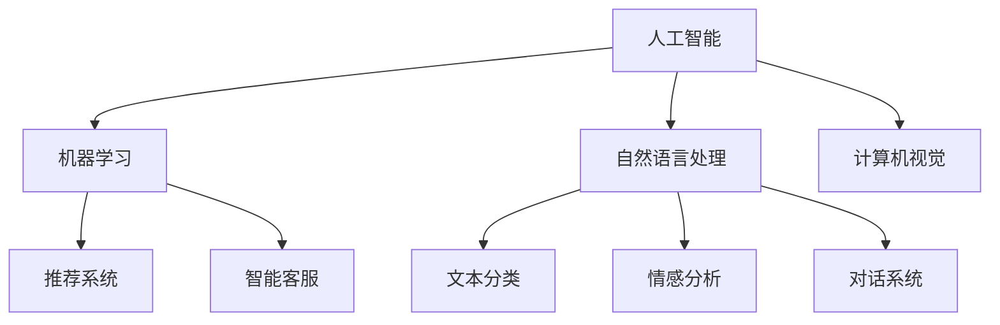

                 

## 1. 背景介绍

### 1.1 问题由来

随着电子商务的迅猛发展，电商平台已成为人们日常生活不可或缺的一部分。在线购物的便捷性、多样性和性价比，使得消费者对其依赖度逐渐加深。与此同时，电商平台也面临着激烈的竞争压力，如何在茫茫电商市场中脱颖而出，提升用户满意度和销售额，成为各平台运营者关注的重点。

人工智能（AI）技术的兴起，为电商平台注入了新的活力。AI技术通过大数据分析和机器学习算法，能够精准预测用户行为，优化商品推荐，提高用户体验，从而提升电商平台的运营效率和竞争力。

### 1.2 问题核心关键点

AI在电商平台中的应用主要围绕以下几个核心关键点展开：

- **用户行为预测**：通过分析用户的历史行为数据，AI可以预测用户的购买意向、搜索习惯等，从而提供更加精准的商品推荐。
- **个性化推荐系统**：根据用户的兴趣和偏好，AI算法能够智能推荐相关商品，提升用户体验和转化率。
- **智能客服**：通过自然语言处理和机器学习技术，AI可以实现自动化客服，处理用户咨询和投诉，提高客户满意度。
- **库存管理**：AI能够优化库存分配和补货策略，减少库存积压和缺货现象，提升运营效率。
- **欺诈检测**：利用AI技术，电商平台可以实时检测和防范交易欺诈行为，保障交易安全。

AI技术在电商平台的成功应用，不仅提升了用户体验和平台运营效率，也带来了巨大的经济效益。然而，AI技术在电商平台的实际落地过程中，仍面临诸多挑战，如数据隐私保护、算法偏见、系统可解释性等。

## 2. 核心概念与联系

### 2.1 核心概念概述

为更好地理解AI在电商平台中的应用，本节将介绍几个密切相关的核心概念：

- **人工智能（AI）**：利用计算机算法和大数据，模拟人类智能行为的技术。包括机器学习、自然语言处理、计算机视觉等多个分支。
- **机器学习（ML）**：通过训练数据集，让计算机自主学习，不断优化模型预测能力的技术。
- **自然语言处理（NLP）**：让计算机理解和处理人类语言的技术，包括文本分类、情感分析、对话系统等。
- **计算机视觉（CV）**：让计算机“看”懂图像和视频的技术，包括图像识别、目标检测、图像生成等。
- **推荐系统**：根据用户的历史行为和偏好，推荐相关商品或内容的技术。
- **智能客服**：利用AI技术自动处理用户咨询和投诉，提升客户服务效率和质量。

这些核心概念之间的逻辑关系可以通过以下Mermaid流程图来展示：



这个流程图展示了AI的核心组件及其相互关系：

1. 人工智能作为AI技术的高层次概念，涵盖了机器学习、自然语言处理和计算机视觉等多个子领域。
2. 机器学习是AI技术的重要组成部分，通过训练数据集不断优化模型预测能力。
3. 自然语言处理利用计算机处理和理解人类语言，实现文本分类、情感分析等任务。
4. 计算机视觉让计算机“看”懂图像和视频，实现图像识别、目标检测等应用。
5. 推荐系统和智能客服分别利用机器学习、自然语言处理等技术，提升用户购物体验和客户服务质量。

这些核心概念共同构成了AI在电商平台应用的基石，为其提供了坚实的技术支撑。

## 3. 核心算法原理 & 具体操作步骤

### 3.1 算法原理概述

AI在电商平台中的应用，核心在于通过机器学习和数据分析，实现对用户行为的预测和个性化推荐。其核心算法原理包括：

- **协同过滤算法**：通过分析用户的历史行为和偏好，推测其他用户的兴趣和需求，实现个性化推荐。
- **内容推荐算法**：利用商品的属性和标签，通过相似度匹配，实现相关商品的推荐。
- **深度学习算法**：通过构建深度神经网络模型，从大量数据中学习用户行为和商品特征，实现更精准的预测和推荐。
- **强化学习算法**：通过不断调整推荐策略，最大化用户满意度和平台收益，提升推荐系统效果。

这些算法通过组合使用，构建了电商平台的智能推荐和客服系统，极大地提升了用户体验和运营效率。

### 3.2 算法步骤详解

AI在电商平台中的具体应用步骤主要包括：

1. **数据收集与预处理**：收集用户历史行为数据、商品属性和标签等，进行数据清洗和特征工程，构建训练数据集。
2. **模型训练与优化**：选择适当的机器学习模型，通过训练数据集进行模型训练和参数优化，提升预测和推荐精度。
3. **模型部署与监控**：将训练好的模型部署到电商平台，实时处理用户请求，同时进行模型监控和评估，保证系统稳定运行。
4. **用户交互与反馈**：收集用户对推荐结果的反馈，如点击率、购买率等，不断优化模型和推荐策略。
5. **个性化服务**：根据用户行为和偏好，提供定制化的商品推荐和客服服务，提升用户满意度和转化率。

### 3.3 算法优缺点

AI在电商平台中的应用，具有以下优点：

- **提升用户体验**：通过精准的个性化推荐，满足用户个性化需求，提升购物体验。
- **优化运营效率**：通过预测用户行为和需求，优化库存管理和商品推荐，提高运营效率。
- **提升转化率**：通过精准的推荐和客服，减少用户流失，提升商品销售转化率。
- **降低运营成本**：通过自动化客服和智能推荐，减少人工干预，降低运营成本。

同时，AI在电商平台中面临以下挑战：

- **数据隐私问题**：用户行为数据的隐私保护，需要在保证推荐效果的同时，确保用户数据安全。
- **算法偏见问题**：模型训练过程中可能引入算法偏见，导致推荐结果不公平。
- **系统可解释性**：推荐系统的黑盒特性，难以解释其内部决策逻辑，影响用户信任。
- **技术门槛高**：AI技术的落地应用需要高水平的技术团队和丰富的数据资源，对中小企业形成一定的门槛。

### 3.4 算法应用领域

AI在电商平台中的应用领域非常广泛，主要包括：

- **商品推荐**：根据用户历史行为和偏好，智能推荐相关商品。
- **搜索优化**：通过自然语言处理和机器学习算法，优化搜索引擎结果，提升搜索体验。
- **智能客服**：利用自然语言处理和机器学习技术，自动处理用户咨询和投诉，提高客户服务效率和质量。
- **库存管理**：通过预测用户需求和优化库存分配，减少库存积压和缺货现象，提升运营效率。
- **欺诈检测**：利用机器学习算法，实时检测和防范交易欺诈行为，保障交易安全。
- **广告投放**：通过预测用户行为，优化广告投放策略，提升广告效果和ROI。

## 4. 数学模型和公式 & 详细讲解 & 举例说明

### 4.1 数学模型构建

AI在电商平台中的应用，涉及多个数学模型。这里以商品推荐系统为例，简要介绍其中几个重要模型：

- **协同过滤模型**：基于用户行为数据的矩阵分解，实现相似度匹配推荐。
- **基于内容的推荐模型**：利用商品属性和标签，通过余弦相似度等方法，实现相关商品推荐。
- **深度学习推荐模型**：通过构建深度神经网络，学习用户行为和商品特征，实现更精准的预测和推荐。

### 4.2 公式推导过程

以协同过滤模型为例，其基本思想是通过用户行为数据，构建用户-商品评分矩阵 $U$，通过矩阵分解 $U \approx \tilde{U} \tilde{V}^T$，实现用户对商品的评分预测。其中，$\tilde{U}$ 和 $\tilde{V}$ 分别为用户和商品的低维表示矩阵。具体公式推导如下：

$$
U \approx \tilde{U} \tilde{V}^T
$$

$$
\tilde{U} = \hat{U}U^{-1}W
$$

$$
\tilde{V} = \hat{V}V^{-1}W^T
$$

其中，$\hat{U}$ 和 $\hat{V}$ 为低秩近似矩阵，$U$ 为用户-商品评分矩阵，$V$ 为商品属性矩阵，$W$ 为低维空间映射矩阵。

### 4.3 案例分析与讲解

以电商平台的个性化推荐系统为例，分析其核心算法和实际应用场景。

假设某电商平台用户对商品A和商品B均给出了4星评分。基于协同过滤模型，系统可以推测用户对其他相关商品的评分。例如，假设用户对商品C的评分也较高，系统可以预测用户对商品C的评分约为4星。

具体实现步骤如下：

1. 构建用户-商品评分矩阵 $U$。
2. 通过矩阵分解方法，如奇异值分解（SVD），得到低维表示矩阵 $\tilde{U}$ 和 $\tilde{V}$。
3. 根据预测结果，向用户推荐评分较高的商品C。

## 5. 项目实践：代码实例和详细解释说明

### 5.1 开发环境搭建

为了快速上手AI在电商平台中的应用，可以使用以下开发环境：

1. **Python**：选择Python作为开发语言，其丰富的第三方库和框架支持，适合数据分析和机器学习任务。
2. **TensorFlow或PyTorch**：选择深度学习框架，支持构建神经网络模型。
3. **NLP库**：选择自然语言处理库，如NLTK、SpaCy等，支持文本处理和情感分析。
4. **计算机视觉库**：选择OpenCV、TensorFlow Image等，支持图像处理和目标检测。
5. **推荐系统库**：选择Surprise、LightFM等，支持推荐系统模型的实现和优化。
6. **智能客服库**：选择ChatterBot、Rasa等，支持构建对话系统。

### 5.2 源代码详细实现

以下是一个简单的商品推荐系统实现，使用Python和TensorFlow框架：

```python
import tensorflow as tf
from surprise import Dataset, Reader
from surprise.model_selection import train_test_split

# 数据读取
reader = Reader(line_format='user item rating', sep=',', skip_lines=1)
data = Dataset.load_from_file('ratings.csv', reader=reader)

# 数据分割
trainset, testset = train_test_split(data, test_size=0.2)

# 构建模型
model = SVD()

# 模型训练
trainset.build_full_trainset()
model.fit(trainset)

# 模型预测
predictions = model.test(testset)

# 模型评估
rmse = np.sqrt(mean_squared_error(predictions, testset))

# 模型部署
# 将模型保存为TensorFlow模型文件
model.save('model.pb')

# 加载模型进行推理
new_user = np.array([user_id])
new_item = np.array([item_id])
new_data = np.concatenate((new_user, new_item), axis=0)
prediction = tf.saved_model.load('model.pb').run(None, {'serving_default': new_data})
```

### 5.3 代码解读与分析

**数据读取与分割**：

1. **数据读取**：使用Surprise库的Reader类，从CSV文件中读取用户、商品和评分数据，构建用户-商品评分矩阵。
2. **数据分割**：将数据集分割为训练集和测试集，用于模型训练和评估。

**模型构建与训练**：

1. **模型构建**：选择协同过滤算法中的SVD模型，用于预测用户对商品的评分。
2. **模型训练**：使用训练集对模型进行训练，不断优化模型参数。
3. **模型评估**：在测试集上评估模型效果，计算均方根误差（RMSE）作为评价指标。

**模型部署与推理**：

1. **模型保存**：将训练好的模型保存为TensorFlow模型文件，便于后续部署和推理。
2. **模型加载**：通过TensorFlow的SavedModel API，加载模型文件，进行推理预测。

## 6. 实际应用场景

### 6.1 电商推荐系统

电商平台的核心功能之一是推荐系统。通过AI技术，电商推荐系统能够根据用户历史行为和偏好，智能推荐相关商品，提升用户购物体验和转化率。

例如，某用户在电商平台上浏览了某品牌的高端手机，根据其浏览历史和评分数据，推荐系统可以智能推荐该品牌旗下的其他型号和配件，满足其多样化需求。

### 6.2 智能客服系统

智能客服系统通过自然语言处理和机器学习技术，自动处理用户咨询和投诉，提高客户服务效率和质量。

例如，某用户在电商平台上咨询商品信息，智能客服系统可以通过理解用户的自然语言描述，提供相关商品的信息、评价和购买建议，提升用户购物体验。

### 6.3 库存管理系统

库存管理系统通过AI技术，优化库存分配和补货策略，减少库存积压和缺货现象，提升运营效率。

例如，某电商平台根据用户的购买历史和季节性需求，预测未来一段时间内的销售量，优化库存分配和补货策略，避免库存积压和缺货。

### 6.4 未来应用展望

未来，AI在电商平台中的应用将更加广泛和深入，具体包括以下几个方面：

1. **个性化推荐系统的优化**：通过深度学习算法，构建更加精准的推荐模型，提升推荐效果。
2. **多模态数据融合**：利用计算机视觉和自然语言处理技术，实现图像和文本数据的融合，提供更全面的商品推荐。
3. **智能客服的升级**：引入对话生成技术和情感分析算法，提升客服系统的自然语言理解和响应能力。
4. **实时交易监控**：通过实时数据分析和机器学习算法，检测和防范交易欺诈行为，保障交易安全。
5. **用户体验的增强**：通过智能推荐和个性化服务，提升用户满意度和忠诚度，增强平台竞争力。

## 7. 工具和资源推荐

### 7.1 学习资源推荐

为帮助开发者系统掌握AI在电商平台中的应用，这里推荐一些优质的学习资源：

1. **《深度学习》课程**：斯坦福大学Andrew Ng教授的《深度学习》课程，系统介绍深度学习算法和框架，适合入门学习。
2. **《TensorFlow官方文档》**：TensorFlow的官方文档，包含丰富的教程和示例，适合深入学习。
3. **《Python自然语言处理》书籍**：自然语言处理领域的经典教材，涵盖NLP基础和高级算法。
4. **《计算机视觉：算法与应用》书籍**：计算机视觉领域的经典教材，涵盖图像处理和目标检测等技术。
5. **《推荐系统实战》书籍**：推荐系统领域的实战教程，涵盖Surprise、LightFM等推荐系统库的使用。
6. **《机器学习实战》书籍**：机器学习领域的实战教程，涵盖Scikit-Learn、TensorFlow等库的使用。

通过对这些资源的学习实践，相信你一定能够快速掌握AI在电商平台中的应用。

### 7.2 开发工具推荐

高效的开发离不开优秀的工具支持。以下是几款用于AI在电商平台中的应用开发的常用工具：

1. **Jupyter Notebook**：免费开源的交互式编程环境，适合数据分析和机器学习任务。
2. **Google Colab**：谷歌提供的云端Jupyter Notebook环境，支持GPU/TPU等高性能设备，方便快速实验最新模型。
3. **TensorFlow**：开源深度学习框架，支持构建神经网络模型，并提供丰富的工具和库。
4. **PyTorch**：开源深度学习框架，支持构建神经网络模型，并提供动态计算图和丰富的工具库。
5. **Surprise**：Python推荐系统库，提供多种推荐算法和评估指标。
6. **ChatterBot**：Python对话系统库，支持构建智能客服系统。

合理利用这些工具，可以显著提升AI在电商平台中的应用开发效率，加快创新迭代的步伐。

### 7.3 相关论文推荐

AI在电商平台中的应用源于学界的持续研究。以下是几篇奠基性的相关论文，推荐阅读：

1. **《Amazon Personalization》**：亚马逊的研究论文，介绍了其个性化推荐系统的构建和优化方法。
2. **《Deep Collaborative Filtering》**：由微软研究院发表的论文，介绍深度学习在协同过滤算法中的应用。
3. **《A Survey of Recommender Systems》**：推荐系统领域的综述论文，涵盖推荐系统的基本原理和算法。
4. **《Personalized Top-N Recommendation with Attention Mechanism》**：介绍注意力机制在推荐系统中的应用，提升推荐效果。
5. **《Dialogue Systems》**：自然语言处理领域的综述论文，涵盖对话系统的基本原理和算法。

这些论文代表了大语言模型微调技术的发展脉络。通过学习这些前沿成果，可以帮助研究者把握学科前进方向，激发更多的创新灵感。

## 8. 总结：未来发展趋势与挑战

### 8.1 研究成果总结

AI在电商平台中的应用，已经取得了显著成效，提升了用户购物体验和平台运营效率。主要成果包括：

1. **个性化推荐系统**：通过AI技术，提升推荐精度和用户体验，显著提高了转化率和销售额。
2. **智能客服系统**：通过自然语言处理和机器学习技术，实现自动化客服，提高了客户服务效率和质量。
3. **库存管理系统**：通过AI技术，优化库存分配和补货策略，减少了库存积压和缺货现象，提升了运营效率。
4. **实时交易监控**：通过机器学习算法，检测和防范交易欺诈行为，保障了交易安全。

### 8.2 未来发展趋势

展望未来，AI在电商平台中的应用将更加广泛和深入，具体包括以下几个方面：

1. **推荐系统的优化**：通过深度学习算法，构建更加精准的推荐模型，提升推荐效果。
2. **多模态数据融合**：利用计算机视觉和自然语言处理技术，实现图像和文本数据的融合，提供更全面的商品推荐。
3. **智能客服的升级**：引入对话生成技术和情感分析算法，提升客服系统的自然语言理解和响应能力。
4. **实时交易监控**：通过实时数据分析和机器学习算法，检测和防范交易欺诈行为，保障交易安全。
5. **用户体验的增强**：通过智能推荐和个性化服务，提升用户满意度和忠诚度，增强平台竞争力。

### 8.3 面临的挑战

尽管AI在电商平台中的应用已经取得了显著成效，但在实际落地过程中，仍面临诸多挑战：

1. **数据隐私问题**：用户行为数据的隐私保护，需要在保证推荐效果的同时，确保用户数据安全。
2. **算法偏见问题**：模型训练过程中可能引入算法偏见，导致推荐结果不公平。
3. **系统可解释性**：推荐系统的黑盒特性，难以解释其内部决策逻辑，影响用户信任。
4. **技术门槛高**：AI技术的落地应用需要高水平的技术团队和丰富的数据资源，对中小企业形成一定的门槛。

### 8.4 研究展望

为了克服上述挑战，未来需要在以下几个方面进行深入研究：

1. **隐私保护技术**：研究数据加密、差分隐私等技术，保护用户隐私。
2. **算法公平性**：引入公平性约束和算法偏见检测技术，确保推荐结果公平。
3. **系统可解释性**：研究可解释性算法和模型，提升推荐系统的透明度和可信度。
4. **多模态融合技术**：研究多模态数据融合方法，提升推荐系统的多样性和全面性。

总之，AI在电商平台中的应用前景广阔，但需要克服诸多挑战，才能实现其最大的潜力和价值。只有在技术、隐私、公平性等多方面协同发力，才能让AI在电商平台上发挥更大的作用，提升用户体验和平台运营效率。

## 9. 附录：常见问题与解答

**Q1：AI在电商平台中的应用是否适用于所有类型的电商场景？**

A: AI在电商平台中的应用虽然具有广泛适用性，但对于特定类型的电商场景（如二手交易、虚拟商品等），由于其特性和需求与传统电商不同，AI的应用方式和效果也可能有所差异。需要根据具体场景进行适配和优化。

**Q2：AI在电商平台中使用的推荐算法有哪些？**

A: 电商平台的推荐算法主要包括以下几种：

1. **协同过滤算法**：基于用户行为数据，推荐相似用户喜欢的商品。
2. **基于内容的推荐算法**：利用商品属性和标签，通过相似度匹配，推荐相关商品。
3. **深度学习推荐算法**：通过构建深度神经网络模型，学习用户行为和商品特征，实现更精准的预测和推荐。
4. **强化学习推荐算法**：通过不断调整推荐策略，最大化用户满意度和平台收益，提升推荐系统效果。

**Q3：AI在电商平台中的推荐系统是如何构建的？**

A: AI在电商平台中的推荐系统构建主要包括以下几个步骤：

1. **数据收集与预处理**：收集用户历史行为数据、商品属性和标签等，进行数据清洗和特征工程，构建训练数据集。
2. **模型训练与优化**：选择适当的推荐算法，通过训练数据集进行模型训练和参数优化，提升预测和推荐精度。
3. **模型部署与监控**：将训练好的模型部署到电商平台，实时处理用户请求，同时进行模型监控和评估，保证系统稳定运行。
4. **用户交互与反馈**：收集用户对推荐结果的反馈，如点击率、购买率等，不断优化模型和推荐策略。

**Q4：AI在电商平台中的智能客服系统是如何构建的？**

A: AI在电商平台中的智能客服系统构建主要包括以下几个步骤：

1. **自然语言处理**：通过NLP技术，理解用户的自然语言描述，提取关键信息。
2. **对话生成**：利用对话生成技术，生成合适的回复内容，提升客服的自然语言理解和响应能力。
3. **情感分析**：通过情感分析技术，理解用户情绪，提供更好的情感支持。
4. **知识库管理**：通过构建知识库，存储商品信息、评价、FAQ等，提升客服的响应准确性。

**Q5：AI在电商平台中的库存管理系统是如何构建的？**

A: AI在电商平台中的库存管理系统构建主要包括以下几个步骤：

1. **需求预测**：通过AI技术，预测未来一段时间内的销售量，优化库存分配。
2. **库存优化**：根据需求预测结果，优化库存分配和补货策略，减少库存积压和缺货现象。
3. **实时监控**：通过实时数据分析和机器学习算法，监控库存状态，及时调整库存策略。

**Q6：AI在电商平台中的实时交易监控系统是如何构建的？**

A: AI在电商平台中的实时交易监控系统构建主要包括以下几个步骤：

1. **异常检测**：通过机器学习算法，检测交易中的异常行为，如欺诈行为、虚假交易等。
2. **风险评估**：对检测到的异常行为进行风险评估，确定其影响范围和程度。
3. **预警与响应**：根据风险评估结果，及时发出预警，采取相应的措施，防止欺诈行为的发生。

通过系统学习和应用实践，相信你一定能够快速掌握AI在电商平台中的应用，并用于解决实际的电商问题。

---

作者：禅与计算机程序设计艺术 / Zen and the Art of Computer Programming

