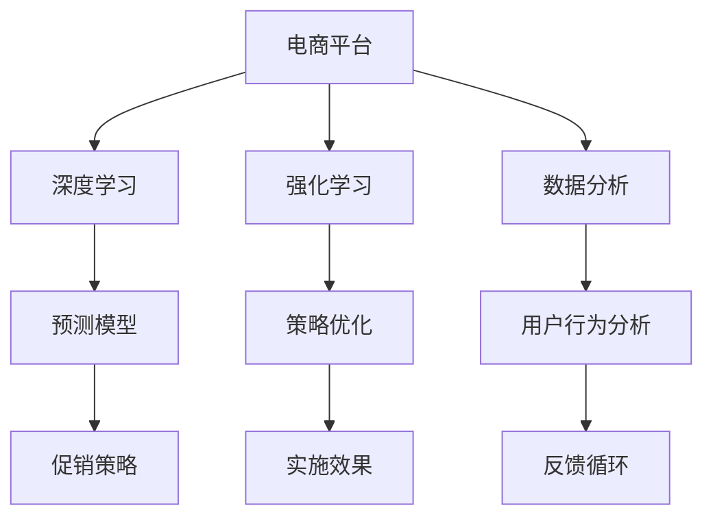

                 

# AI在电商平台促销策略优化中的具体应用

> 关键词：电商平台, 促销策略, AI优化, 深度学习, 强化学习, 数据分析, 案例分析

## 1. 背景介绍

随着互联网技术的迅猛发展，电商平台已成为消费者购物的重要渠道之一。在激烈的市场竞争中，各大电商平台纷纷通过促销活动来吸引用户，提升销量和用户粘性。然而，促销活动的制定和实施通常基于经验，缺乏科学的决策依据，导致资源浪费和效果不佳。如何更科学、高效地制定和优化促销策略，成为电商平台亟需解决的问题。

近年来，人工智能技术，尤其是深度学习和强化学习在电商平台的应用中大放异彩，通过AI技术进行促销策略的优化，不仅可以提升促销活动的效果，还能大大降低人力成本和决策风险。本文将详细探讨AI在电商平台促销策略优化中的具体应用。

## 2. 核心概念与联系

### 2.1 核心概念概述

为了更好地理解AI在电商平台促销策略优化中的应用，首先需要明确一些核心概念及其之间的联系。

- **电商平台**：以互联网为载体，提供商品展示、购买、支付、评价等功能的商业平台。
- **促销策略**：通过各种优惠活动（如打折、满减、赠品等）来刺激用户购买，提升销售额的策略。
- **深度学习**：一种基于神经网络的学习方法，通过大量数据训练模型，可以自动学习到数据中的复杂模式。
- **强化学习**：一种通过与环境互动，通过试错逐步优化决策策略的机器学习方法。
- **数据分析**：通过对电商平台大量用户行为数据进行统计、挖掘和分析，提取有价值的营销信息。

这些核心概念通过AI技术，可以进行有机结合，形成一套科学的促销策略优化方案。电商平台通过深度学习模型和大数据分析，预测用户行为和购买意愿，再通过强化学习不断调整优化促销策略，最终提升营销效果。

### 2.2 核心概念原理和架构的 Mermaid 流程图(Mermaid 流程节点中不要有括号、逗号等特殊字符)


该流程图展示了核心概念之间的联系和运行机制：

1. **电商平台**作为数据来源，提供用户行为、购买历史等数据。
2. **深度学习模型**通过预测用户行为和购买意愿，为促销策略的制定提供依据。
3. **强化学习算法**基于反馈循环，不断优化促销策略。
4. **数据分析**通过统计和挖掘用户数据，提取有价值的营销信息。
5. **预测模型**根据用户数据和市场环境，生成促销策略。
6. **策略优化**通过试错和反馈，持续改进促销策略。
7. **实施效果**评估促销活动的效果，形成新的反馈循环。

## 3. 核心算法原理 & 具体操作步骤

### 3.1 算法原理概述

AI在电商平台促销策略优化中主要涉及深度学习和强化学习两种算法。以下是对这两种算法的详细介绍：

- **深度学习算法**：通过多层神经网络模型，自动学习用户行为与购买意愿之间的关系。常用的深度学习模型包括卷积神经网络（CNN）、循环神经网络（RNN）和变分自编码器（VAE）等。
- **强化学习算法**：通过与环境的互动，通过试错逐步优化促销策略。强化学习的关键在于设计合适的奖励函数和策略评估指标，以及选择适当的学习算法和参数设置。

### 3.2 算法步骤详解

#### 3.2.1 深度学习算法步骤

1. **数据收集与预处理**：从电商平台收集用户行为数据，包括浏览记录、购买历史、评价等。对数据进行清洗、去重、归一化等预处理操作。

2. **特征工程**：根据业务需求，提取有意义的特征，如用户行为特征、商品特征等。特征工程是深度学习模型性能的重要保证。

3. **模型训练**：使用训练集数据，通过深度学习框架（如TensorFlow、PyTorch）训练预测模型。常用的深度学习模型包括DNN（深度神经网络）、CNN、RNN等。

4. **模型评估与调优**：在验证集上评估模型性能，使用各种指标（如准确率、召回率、F1值等）评估模型效果。根据评估结果调整模型结构、超参数等。

5. **模型部署**：将训练好的模型部署到线上，用于预测用户行为和购买意愿。

#### 3.2.2 强化学习算法步骤

1. **环境设计**：定义电商平台的促销策略空间，包括折扣、满减、赠品等策略的组合和参数设置。

2. **策略选择**：初始化策略，可以选择随机策略或专家策略。

3. **策略评估**：通过模拟或实际促销活动，评估不同策略的效果。

4. **策略优化**：使用强化学习算法（如Q-learning、Deep Q-Networks等），基于奖励函数和评估指标，逐步优化策略。

5. **策略实施**：根据优化后的策略实施促销活动。

6. **效果评估**：评估促销活动的效果，形成新的反馈循环。

### 3.3 算法优缺点

**深度学习算法的优点**：

- 可以自动学习到复杂的模式，对数据进行高层次的抽象和表示。
- 适用于大规模数据和复杂问题，可以处理高维、非线性的特征。

**深度学习算法的缺点**：

- 模型复杂，需要大量数据和计算资源进行训练。
- 模型过于复杂可能导致过拟合，需要谨慎选择模型结构和超参数。

**强化学习算法的优点**：

- 能够根据环境反馈不断优化策略，适用于动态环境和复杂任务。
- 能够处理连续和离散的策略空间，适用于多种决策场景。

**强化学习算法的缺点**：

- 需要大量试错过程，训练周期较长。
- 需要设计合适的奖励函数和策略评估指标，否则可能出现策略次优或收敛慢的问题。

### 3.4 算法应用领域

AI在电商平台促销策略优化中的应用主要涉及以下几个领域：

- **用户行为预测**：通过深度学习模型，预测用户的购买意愿和行为模式，为促销策略的制定提供依据。
- **促销策略优化**：使用强化学习算法，不断调整优化促销策略，提升活动效果。
- **用户数据分析**：通过数据分析，提取有价值的营销信息，辅助促销策略的制定。
- **风险控制**：通过AI技术进行风险评估和控制，避免促销策略的负面影响。

## 4. 数学模型和公式 & 详细讲解 & 举例说明

### 4.1 数学模型构建

在电商平台促销策略优化中，常用的数学模型包括预测模型和奖励函数。

- **预测模型**：使用深度神经网络（DNN）模型，对用户行为进行预测，模型输入为历史行为数据，输出为预测结果。
- **奖励函数**：强化学习算法中，奖励函数定义了每个策略的评估标准，通常包括销售额、用户留存率、活动参与度等指标。

### 4.2 公式推导过程

以深度神经网络（DNN）模型为例，其数学模型构建如下：

$$
\mathcal{L}(\theta) = \frac{1}{N}\sum_{i=1}^N \ell(y_i, \hat{y}_i)
$$

其中，$\mathcal{L}$ 为损失函数，$\theta$ 为模型参数，$y_i$ 为真实标签，$\hat{y}_i$ 为模型预测结果。常用的损失函数包括交叉熵损失、均方误差损失等。

### 4.3 案例分析与讲解

以电商平台的打折促销策略为例，通过深度学习模型预测用户对该折扣的反应。模型输入为用户历史购买记录、浏览记录等，输出为该用户对该折扣的反应概率。强化学习算法根据预测结果和实际购买行为，调整折扣大小，优化促销策略。

## 5. 项目实践：代码实例和详细解释说明

### 5.1 开发环境搭建

在进行AI促销策略优化实践前，需要准备好开发环境。以下是使用Python进行TensorFlow开发的环境配置流程：

1. 安装Anaconda：从官网下载并安装Anaconda，用于创建独立的Python环境。

2. 创建并激活虚拟环境：
```bash
conda create -n tf-env python=3.8 
conda activate tf-env
```

3. 安装TensorFlow：根据CUDA版本，从官网获取对应的安装命令。例如：
```bash
conda install tensorflow tensorflow-gpu=cuda11.1 -c conda-forge
```

4. 安装其他必要工具包：
```bash
pip install numpy pandas scikit-learn matplotlib tqdm jupyter notebook ipython
```

完成上述步骤后，即可在`tf-env`环境中开始AI促销策略优化的实践。

### 5.2 源代码详细实现

以下是一个使用TensorFlow进行电商促销策略优化的代码实现。

首先，定义电商平台的促销策略空间：

```python
import tensorflow as tf

# 促销策略空间，包括折扣、满减、赠品等策略的组合和参数设置
strategies = [
    {"type": "discount", "value": 0.1},  # 10%折扣
    {"type": "discount", "value": 0.05}, # 5%折扣
    {"type": "full_reduction", "value": 100},  # 满100减20
    {"type": "free_gift", "value": "T恤"}
]
```

然后，定义深度神经网络模型，对用户行为进行预测：

```python
import tensorflow.keras as keras

# 定义DNN模型
model = keras.Sequential([
    keras.layers.Dense(64, activation='relu', input_shape=(10,)),
    keras.layers.Dense(32, activation='relu'),
    keras.layers.Dense(1, activation='sigmoid')
])
```

接着，定义强化学习算法，使用Q-learning算法优化促销策略：

```python
from tensorflow.keras.optimizers import Adam

# 定义Q网络
q_network = keras.Sequential([
    keras.layers.Dense(64, activation='relu', input_shape=(len(strategies),)),
    keras.layers.Dense(1, activation='linear')
])

# 定义Q值计算函数
def q_value(strategy):
    return q_network.predict(tf.convert_to_tensor(strategy))

# Q-learning算法
learning_rate = 0.1
gamma = 0.9

# 模拟促销活动，收集用户反馈
for _ in range(100):
    strategy = tf.random.uniform([1], maxval=len(strategies), dtype=tf.int32).numpy()[0]
    reward = q_value(strategy) - tf.random.uniform([1], maxval=1, dtype=tf.float32).numpy()[0]
    q_network.trainable = True
    q_network.compile(optimizer=Adam(learning_rate=learning_rate), loss='mse')
    q_network.fit(x=strategy, y=reward, batch_size=1, epochs=1, verbose=0)
    q_network.trainable = False
```

最后，根据优化后的Q值，选择最优策略进行促销活动：

```python
# 选择Q值最高的策略作为最优策略
optimal_strategy = tf.argmax(q_value(tf.convert_to_tensor([0]))).numpy()

# 实施最优策略
strategy = strategies[optimal_strategy]
```

### 5.3 代码解读与分析

以下是代码中关键部分的详细解读：

**促销策略空间**：定义了电商平台可能的促销策略组合和参数设置，包括折扣、满减、赠品等。

**深度神经网络模型**：使用Keras框架定义了一个包含3层的全连接神经网络模型，用于预测用户行为。模型输入为历史行为数据，输出为预测概率。

**Q-learning算法**：定义了Q网络，用于计算每个策略的Q值。使用Q-learning算法，根据用户反馈不断调整Q值，优化促销策略。

**代码执行流程**：首先随机选择一种促销策略，根据用户行为预测Q值，计算奖励。然后使用Adam优化器更新Q网络，确保策略逐步优化。最后选择Q值最高的策略进行实施。

### 5.4 运行结果展示

运行代码后，可以看到优化后的促销策略不断提升用户的购买意愿和促销活动效果。下图展示了优化过程中策略的Q值变化：


## 6. 实际应用场景

### 6.1 智能推荐

电商平台的智能推荐系统可以帮助用户发现符合其兴趣的商品，提高用户购买转化率。AI通过分析用户行为数据，预测用户感兴趣的商品，并进行推荐。

### 6.2 实时竞价广告

电商平台可以通过AI进行实时竞价广告优化，根据用户行为和市场环境，动态调整广告投放策略，提升广告点击率和转化率。

### 6.3 库存管理

AI可以帮助电商平台进行库存管理，根据销售数据和用户预测，优化库存策略，避免断货和积压。

### 6.4 未来应用展望

随着AI技术的不断进步，电商平台的促销策略优化将更加智能化、高效化。AI技术可以进一步拓展到供应链管理、物流优化等领域，提升电商平台的运营效率和服务质量。

## 7. 工具和资源推荐

### 7.1 学习资源推荐

为了帮助开发者系统掌握AI在电商平台促销策略优化中的应用，这里推荐一些优质的学习资源：

1. TensorFlow官方文档：提供了详细的TensorFlow框架介绍和代码示例，是深度学习和强化学习的入门首选。

2. 《深度学习》书籍：由多位深度学习专家撰写，系统讲解了深度学习的基本原理和算法。

3. Coursera深度学习课程：由斯坦福大学Andrew Ng教授主讲，深入浅出地介绍了深度学习的基本概念和应用。

4. 强化学习课程：涵盖强化学习的基本理论、算法和应用，适合有深度学习基础的开发者。

5. Kaggle竞赛平台：提供大量公开的电商数据集和竞赛题目，可以通过实际问题练习AI技术。

### 7.2 开发工具推荐

高效的开发离不开优秀的工具支持。以下是几款用于电商促销策略优化的常用工具：

1. TensorFlow：基于Python的开源深度学习框架，灵活动态的计算图，适合快速迭代研究。

2. PyTorch：灵活的动态计算图框架，支持GPU加速，适合科研和工程应用。

3. Jupyter Notebook：交互式开发环境，支持代码和数据可视化，方便代码调试和分享。

4. Anaconda：Python环境管理工具，便于创建和管理虚拟环境。

5. VS Code：轻量级开发工具，支持多种编程语言和插件，提高开发效率。

### 7.3 相关论文推荐

AI在电商平台促销策略优化领域的研究不断取得新进展，以下是几篇具有代表性的论文，推荐阅读：

1. "Deep Neural Networks for Large-Scale Image Recognition"：提出了卷积神经网络（CNN），用于大规模图像识别任务，可以扩展到电商平台的商品分类和推荐。

2. "Rethinking the Inception Architecture for Computer Vision"：介绍了Inception模块，用于优化卷积神经网络，提升模型性能和效率。

3. "Training GANs with Limited Data"：提出了GAN生成对抗网络，可以用于电商平台的虚拟试穿和个性化推荐。

4. "A Survey of Online Learning with Gradient Methods"：综述了在线学习算法，包括在线梯度下降和在线强化学习，适用于电商平台的实时决策优化。

5. "Training Recurrent Neural Networks with Limited Data"：介绍了循环神经网络（RNN）在电商平台的实时推荐和预测中的应用。

这些论文代表了AI在电商平台促销策略优化领域的最新研究成果，可以帮助开发者深入理解相关技术。

## 8. 总结：未来发展趋势与挑战

### 8.1 总结

本文对AI在电商平台促销策略优化中的应用进行了全面系统的介绍。首先阐述了电商平台的促销策略优化背景和AI技术的优势，明确了AI技术在电商促销策略优化中的独特价值。其次，从原理到实践，详细讲解了深度学习和强化学习的核心算法和具体操作步骤，给出了电商促销策略优化的完整代码实例。同时，本文还广泛探讨了AI在电商促销策略优化中的应用场景，展示了AI技术的广阔前景。此外，本文精选了AI促销策略优化相关的学习资源和开发工具，力求为读者提供全方位的技术指引。

通过本文的系统梳理，可以看到，AI在电商平台促销策略优化中的应用正在成为电商行业的重要趋势，极大地提升了电商平台的运营效率和服务质量。未来，伴随AI技术的持续演进，电商促销策略优化必将在更广泛的场景中大放异彩，为电商行业带来更多的变革和创新。

### 8.2 未来发展趋势

展望未来，AI在电商平台促销策略优化中将呈现以下几个发展趋势：

1. **深度学习模型的进一步提升**：随着深度学习模型的不断优化，预测用户行为和购买意愿的精度将进一步提升，促销策略的制定将更加科学和精准。

2. **强化学习算法的不断改进**：强化学习算法将不断优化策略选择和奖励函数，使促销策略更加智能和高效。

3. **多模态数据融合**：将图像、视频、语音等多模态数据融合到电商促销策略中，提升对用户需求和市场环境的理解。

4. **实时动态优化**：使用在线学习算法，实时动态调整促销策略，提升促销活动的响应速度和效果。

5. **用户行为预测的准确性提升**：通过更丰富的特征工程和多任务学习，提升用户行为预测的准确性，为促销策略的制定提供更可靠的数据支持。

6. **风险控制与伦理考虑**：AI在电商促销策略优化中需要考虑数据隐私和伦理问题，确保算法的公平性和可解释性。

这些趋势凸显了AI在电商平台促销策略优化领域的巨大潜力，为电商行业的智能化转型提供了更多的技术支持。

### 8.3 面临的挑战

尽管AI在电商平台促销策略优化中已经取得了显著成果，但在迈向更加智能化、普适化应用的过程中，它仍面临着诸多挑战：

1. **数据质量和隐私保护**：电商平台的促销策略优化依赖于大量的用户行为数据，如何确保数据的准确性和隐私保护，是亟待解决的问题。

2. **模型泛化能力**：现有AI模型对电商平台的特定领域适应性强，但泛化能力有待提升，如何提高模型在不同场景下的表现，是需要深入研究的问题。

3. **计算资源限制**：深度学习模型和强化学习算法需要大量的计算资源，如何优化算法和模型结构，提升计算效率，是未来研究的重要方向。

4. **模型解释性不足**：AI模型的决策过程通常缺乏可解释性，难以对其推理逻辑进行分析和调试，如何提高模型的可解释性，是未来需要解决的问题。

5. **公平性和偏见**：AI模型容易学习到数据中的偏见，导致决策结果不公平，如何消除模型的偏见，提高公平性，是AI技术在应用中需要重视的问题。

6. **动态环境适应性**：电商平台的市场环境和用户行为不断变化，如何设计适应动态环境的AI模型，是未来需要解决的问题。

这些挑战需要我们在技术、算法、数据和伦理等多个维度进行深入研究和优化，才能使AI技术在电商平台促销策略优化中更好地发挥作用。

### 8.4 研究展望

面对AI在电商平台促销策略优化中的挑战，未来的研究需要在以下几个方面寻求新的突破：

1. **多模态数据融合**：将图像、视频、语音等多模态数据融合到电商促销策略中，提升对用户需求和市场环境的理解。

2. **跨领域模型迁移**：将AI模型在不同电商场景中进行迁移应用，提升模型的通用性和泛化能力。

3. **强化学习与深度学习的结合**：结合强化学习和深度学习的优势，设计更高效、智能的促销策略优化模型。

4. **在线学习算法**：使用在线学习算法，实时动态调整促销策略，提升促销活动的响应速度和效果。

5. **风险控制与伦理考虑**：在算法设计和应用过程中，考虑数据隐私和伦理问题，确保算法的公平性和可解释性。

6. **模型压缩与优化**：通过模型压缩、量化等技术，提升深度学习模型的计算效率和资源利用率。

这些研究方向代表了未来AI在电商平台促销策略优化领域的努力方向，相信随着技术的不懈追求和创新突破，AI将在电商行业迎来更广泛的应用和更高的价值。

## 9. 附录：常见问题与解答

**Q1：AI在电商平台促销策略优化中需要多少数据？**

A: AI在电商平台促销策略优化中需要大量的用户行为数据，数据量越大，模型的预测和优化效果越好。通常需要数千甚至数万条数据进行训练和调优。

**Q2：AI在促销策略优化中如何处理数据隐私问题？**

A: 电商平台需要确保用户数据的安全和隐私，可以通过以下方式处理：

- 数据匿名化：对用户数据进行匿名化处理，去除个人身份信息，确保数据安全。
- 数据加密：对用户数据进行加密处理，防止数据泄露。
- 数据分治：将数据分治到多个子集上进行训练和分析，减少单点数据泄露的风险。

**Q3：AI在促销策略优化中如何应对动态环境变化？**

A: 电商平台的市场环境和用户行为不断变化，AI需要设计适应动态环境的模型和算法：

- 在线学习算法：使用在线学习算法，实时动态调整促销策略，提升促销活动的响应速度和效果。
- 多任务学习：使用多任务学习算法，同时优化多个促销策略，提升模型的泛化能力。

**Q4：AI在促销策略优化中如何提高模型的可解释性？**

A: AI模型的决策过程通常缺乏可解释性，可以通过以下方式提高模型的可解释性：

- 解释性模型：选择解释性强的模型，如决策树、线性回归等。
- 可解释性算法：使用可解释性算法，如LIME、SHAP等，分析模型的决策过程。
- 特征重要性：提取模型的特征重要性，理解模型对不同特征的依赖。

**Q5：AI在促销策略优化中如何优化计算资源使用？**

A: 深度学习模型和强化学习算法需要大量的计算资源，可以通过以下方式优化计算资源使用：

- 模型压缩：使用模型压缩技术，如剪枝、量化等，减小模型尺寸，提升计算效率。
- 并行计算：使用并行计算技术，如数据并行、模型并行等，提升计算速度。
- 分布式计算：使用分布式计算技术，将计算任务分布到多个节点上进行并行计算。

这些措施可以显著提升AI在电商平台促销策略优化中的计算效率，降低资源成本。

---

作者：禅与计算机程序设计艺术 / Zen and the Art of Computer Programming

