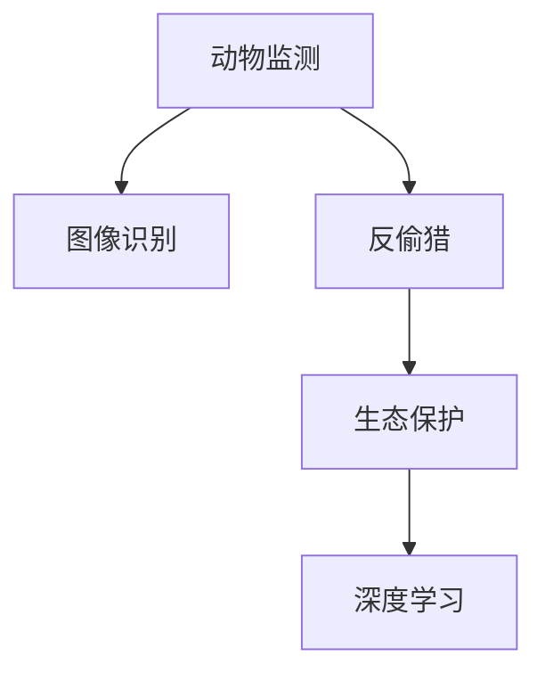

                 

# AI在野生动物保护中的应用:监测与反偷猎

> 关键词：人工智能,动物监测,反偷猎,图像识别,无人机,深度学习

## 1. 背景介绍

### 1.1 问题由来
随着人口增长和城市化进程加快，人类活动对自然环境的影响日益加剧，许多野生动物的栖息地被破坏，导致物种数量大幅减少。偷猎和非法贩运野生动物的黑市交易也屡禁不止，严重威胁生物多样性和生态平衡。在这样的背景下，如何高效、准确地监测野生动物的状况，及时发现和打击偷猎行为，成为野生动植物保护领域亟需解决的重要问题。

### 1.2 问题核心关键点
AI在野生动物保护中的应用，主要集中在以下几个方面：

- **动物监测**：通过图像识别、无人机巡查等技术，实时监控野生动物的活动情况，收集相关数据。
- **反偷猎**：利用AI技术识别偷猎者、追踪偷猎活动，提供精确的反偷猎策略。
- **生态保护**：通过分析卫星影像、气象数据等，评估生态系统的健康状况，制定保护措施。

这些核心关键点共同构成了AI在野生动物保护中的广泛应用，有助于提高监测效率、打击偷猎活动，保护生物多样性。

## 2. 核心概念与联系

### 2.1 核心概念概述

要深入了解AI在野生动物保护中的应用，首先需要理解以下核心概念：

- **动物监测**：通过摄像头、无人机、红外传感器等设备，获取野生动物的活动数据，评估其生存状态。
- **图像识别**：利用深度学习技术，从监控图像中自动识别野生动物及其行为，减少人工成本。
- **反偷猎**：通过数据分析和图像识别，及时发现偷猎活动，并采取应对措施。
- **生态保护**：利用AI对卫星影像和气象数据进行分析，评估生态系统健康状况，指导保护行动。
- **深度学习**：一种基于神经网络的机器学习方法，通过大量数据训练模型，提取复杂特征，实现高效识别和预测。

这些核心概念之间的逻辑关系可以通过以下Mermaid流程图来展示：



这个流程图展示了AI在野生动物保护中的主要应用流程：

1. 通过动物监测获取数据。
2. 利用图像识别技术，自动识别和分析野生动物。
3. 反偷猎系统基于识别结果，实时监控和打击偷猎行为。
4. 生态保护系统综合气象和影像数据，评估和指导保护措施。
5. 深度学习作为核心技术，贯穿各个环节，提升识别和分析的准确性。

## 3. 核心算法原理 & 具体操作步骤
### 3.1 算法原理概述

AI在野生动物保护中的核心算法原理主要基于深度学习和计算机视觉技术，通过图像识别和分析，实现对野生动物的活动监测和行为识别。同时，结合数据分析和机器学习，用于反偷猎和生态保护。

### 3.2 算法步骤详解

#### 3.2.1 数据收集与预处理
- **数据收集**：通过摄像头、无人机、红外传感器等设备，收集野生动物的监控数据。
- **数据预处理**：对图像数据进行去噪、裁剪、归一化等处理，提升后续处理的准确性。

#### 3.2.2 图像识别与分析
- **模型选择**：选择适合的深度学习模型，如卷积神经网络(CNN)、YOLO等，用于识别野生动物及其行为。
- **模型训练**：利用标注数据集，训练识别模型，提升识别准确性。
- **实时监测**：将训练好的模型部署到实时监测系统中，对野生动物活动进行识别和分析。

#### 3.2.3 反偷猎系统设计
- **行为识别**：利用图像识别结果，判断是否为偷猎行为。
- **轨迹跟踪**：通过实时监控和位置数据，跟踪偷猎者的活动轨迹。
- **实时报警**：系统自动向保护区工作人员发出警报，及时采取行动。

#### 3.2.4 生态保护系统构建
- **数据整合**：整合气象数据、卫星影像等，综合分析生态系统状况。
- **健康评估**：通过模型分析，评估生态系统的健康状态。
- **保护措施**：根据评估结果，制定相应的保护措施，如恢复栖息地、控制人类活动等。

### 3.3 算法优缺点

AI在野生动物保护中的应用，具有以下优点：

- **高效监测**：通过图像识别和数据分析，能够快速、准确地获取野生动物和生态系统的信息。
- **实时响应**：系统能够实时监控偷猎行为，及时采取应对措施。
- **精准识别**：深度学习模型在识别野生动物和行为方面，具有较高的准确性和鲁棒性。
- **综合分析**：通过整合多种数据源，提供多维度的生态评估和保护建议。

同时，也存在一些缺点：

- **数据依赖**：对高质量、大量标注数据的需求较高，数据获取和标注成本较大。
- **技术门槛**：深度学习模型的开发和部署需要较高的技术门槛，对技术人员依赖较大。
- **资源消耗**：高精度的AI系统对计算资源和存储需求较大，需要投入较大的硬件资源。
- **模型偏见**：AI模型可能会引入数据偏见，导致识别和分析结果出现偏差。

### 3.4 算法应用领域

AI在野生动物保护中的应用主要集中在以下几个领域：

- **国家公园管理**：通过AI系统实时监控国家公园内的野生动物和偷猎行为，及时发出警报，辅助护林员工作。
- **野生动物保护研究**：利用AI分析野生动物的行为数据，研究其迁徙、繁殖等规律，为保护工作提供科学依据。
- **自然保护区巡查**：部署无人机进行空中巡查，结合地面监控数据，提升保护区的监测覆盖率。
- **濒危物种保护**：通过深度学习模型识别濒危物种，评估其生存状况，指导保护措施的制定。
- **生态修复项目**：利用AI对卫星影像进行分析，评估生态修复项目的效果，优化保护方案。

这些应用领域展示了AI在野生动物保护中的广泛潜力和应用前景。

## 4. 数学模型和公式 & 详细讲解 & 举例说明

### 4.1 数学模型构建

为更好地理解AI在野生动物保护中的应用，本节将介绍几个相关的数学模型：

- **卷积神经网络(CNN)**：用于图像识别和处理，提取空间特征。
- **YOLO目标检测算法**：通过单阶段检测模型，实现实时高效的图像目标检测。
- **深度学习分类模型**：用于分类任务，如偷猎行为识别、物种分类等。

### 4.2 公式推导过程

以YOLO算法为例，其核心公式为：

$$
\mathbf{Y} = \sigma\left(\mathbf{X}W_0 + b_0\right) + \mathbf{X}W_1 + b_1
$$

其中，$\mathbf{Y}$ 为预测结果，$\sigma$ 为激活函数，$\mathbf{X}$ 为输入特征图，$W_0$ 和 $b_0$ 为卷积核和偏置项，$W_1$ 和 $b_1$ 为检测和置信度预测的卷积核和偏置项。

通过这个公式，YOLO算法可以高效地进行目标检测和定位，适用于实时监控和图像识别任务。

### 4.3 案例分析与讲解

以下以国家公园反偷猎系统为例，具体分析其技术实现：

**案例背景**：某国家公园野生动物频繁被盗猎，公园管理者需要实时监控偷猎行为，及时采取行动。

**技术方案**：
1. **数据收集**：在公园内设置多个摄像头，收集偷猎活动的监控视频。
2. **图像预处理**：对视频数据进行去噪、裁剪、归一化等处理，提升识别准确性。
3. **模型训练**：利用标注好的偷猎视频数据集，训练YOLO目标检测模型，实时检测视频中的偷猎行为。
4. **行为识别**：将检测结果传入深度学习分类模型，判断是否为偷猎行为，并发出警报。
5. **实时响应**：通过GPS和无人机，定位偷猎者的位置，引导护林员及时介入。

通过这个案例，我们可以看到，AI在野生动物保护中的应用，不仅能够提高监测效率，还能提供精准的应对措施。

## 5. 项目实践：代码实例和详细解释说明
### 5.1 开发环境搭建

在进行AI在野生动物保护中的项目实践前，我们需要准备好开发环境。以下是使用Python进行深度学习开发的配置流程：

1. 安装Anaconda：从官网下载并安装Anaconda，用于创建独立的Python环境。

2. 创建并激活虚拟环境：
```bash
conda create -n ai-env python=3.8 
conda activate ai-env
```

3. 安装深度学习框架：
```bash
conda install pytorch torchvision torchaudio -c pytorch -c conda-forge
conda install tensorflow -c conda-forge
```

4. 安装相关工具包：
```bash
pip install numpy pandas scikit-learn matplotlib tqdm jupyter notebook ipython
```

完成上述步骤后，即可在`ai-env`环境中开始AI项目开发。

### 5.2 源代码详细实现

下面我们以反偷猎系统为例，给出使用PyTorch进行YOLO目标检测模型的PyTorch代码实现。

首先，定义YOLO模型类：

```python
import torch
import torch.nn as nn
import torchvision.transforms as transforms
from torchvision.models.detection.faster_rcnn import FastRCNNPredictor

class YOLO(nn.Module):
    def __init__(self, num_classes, input_size):
        super(YOLO, self).__init__()
        self.num_classes = num_classes
        self.input_size = input_size
        
        # 加载预训练模型
        model = torchvision.models.detection.fasterrcnn_resnet50_fpn(pretrained=True)
        # 替换分类器层
        in_features = model.roi_heads.box_predictor.cls_score.in_features
        model.roi_heads.box_predictor = nn.Linear(in_features, num_classes)
        
        # 替换预测器层
        num_anchors = len(model.roi_heads.box_predictor.cls_score.weight)
        model.roi_heads.box_predictor = FastRCNNPredictor(in_features, num_anchors, num_classes)
        
        self.model = model
        
    def forward(self, x):
        outputs = self.model(x)
        return outputs[0]
```

然后，定义模型训练和评估函数：

```python
import torch.optim as optim
import torchvision.transforms as transforms
from torch.utils.data import DataLoader
from torchvision.datasets import ImageFolder

def train_model(model, dataloader, optimizer, device, num_epochs):
    model.train()
    for epoch in range(num_epochs):
        for inputs, targets in dataloader:
            inputs, targets = inputs.to(device), targets.to(device)
            optimizer.zero_grad()
            outputs = model(inputs)
            loss = compute_loss(outputs, targets)
            loss.backward()
            optimizer.step()
        
def evaluate_model(model, dataloader, device):
    model.eval()
    total_loss = 0
    for inputs, targets in dataloader:
        inputs, targets = inputs.to(device), targets.to(device)
        outputs = model(inputs)
        total_loss += compute_loss(outputs, targets)
    return total_loss / len(dataloader)

def compute_loss(outputs, targets):
    criterion = nn.CrossEntropyLoss()
    loss = criterion(outputs, targets)
    return loss
```

最后，启动训练流程并在测试集上评估：

```python
from PIL import Image
import matplotlib.pyplot as plt

# 加载数据集
train_data = ImageFolder('train', transform=transforms.ToTensor())
train_loader = DataLoader(train_data, batch_size=4, shuffle=True)

# 初始化模型
num_classes = 1
model = YOLO(num_classes, (640, 640))
optimizer = optim.SGD(model.parameters(), lr=0.001, momentum=0.9)
device = torch.device('cuda') if torch.cuda.is_available() else torch.device('cpu')
model.to(device)

# 训练模型
num_epochs = 10
train_model(model, train_loader, optimizer, device, num_epochs)
total_loss = evaluate_model(model, train_loader, device)
print(f"Epoch {num_epochs}, total loss: {total_loss:.4f}")
```

以上就是使用PyTorch进行YOLO模型训练和评估的完整代码实现。可以看到，通过深度学习框架和数据集处理库，开发者可以快速搭建AI项目，实现图像识别和目标检测。

### 5.3 代码解读与分析

让我们再详细解读一下关键代码的实现细节：

**YOLO类**：
- `__init__`方法：初始化模型参数，包括类别数和输入尺寸。
- `forward`方法：定义模型前向传播，计算输出。

**训练和评估函数**：
- `train_model`函数：在每个epoch内，对模型进行前向传播、反向传播和参数更新。
- `evaluate_model`函数：计算模型在测试集上的损失，用于评估模型性能。
- `compute_loss`函数：计算预测结果与真实标签之间的交叉熵损失。

**训练流程**：
- 加载训练数据集和模型，定义优化器和设备。
- 设置训练轮数和超参数，开始训练模型。
- 在每个epoch结束后，计算模型在测试集上的总损失，并输出。

可以看到，PyTorch提供了丰富的深度学习工具和库，使得YOLO模型的训练和评估过程变得简洁高效。开发者只需关注模型设计、数据处理等高层逻辑，而不必过多关注底层的实现细节。

## 6. 实际应用场景

### 6.1 智能巡护系统

智能巡护系统通过AI技术，实时监测国家公园内的野生动物活动和偷猎行为，提供精准的反偷猎策略。具体实现如下：

**技术方案**：
1. **摄像头部署**：在国家公园内设置多个摄像头，实时监控野生动物活动。
2. **数据上传**：将摄像头数据上传到云端，进行预处理和存储。
3. **模型训练**：利用标注好的偷猎视频数据集，训练YOLO目标检测模型。
4. **行为识别**：对实时上传的摄像头数据进行检测和识别，判断是否为偷猎行为。
5. **实时报警**：根据识别结果，向护林员发出警报，及时采取应对措施。

通过智能巡护系统，国家公园管理者能够实时了解野生动物和偷猎情况，减少人力投入，提高保护效率。

### 6.2 濒危物种保护

濒危物种保护项目利用AI技术，对野生动物的活动数据进行分析和评估，制定保护措施。具体实现如下：

**技术方案**：
1. **数据收集**：通过摄像头、红外传感器等设备，收集濒危物种的监控数据。
2. **数据预处理**：对数据进行去噪、裁剪、归一化等处理，提升识别准确性。
3. **模型训练**：利用标注好的物种数据集，训练YOLO目标检测模型。
4. **健康评估**：通过分析物种的迁徙、繁殖等行为数据，评估其生存状况。
5. **保护措施**：根据评估结果，制定相应的保护措施，如恢复栖息地、控制人类活动等。

通过濒危物种保护项目，科学家能够全面了解濒危物种的生存状态，制定科学合理的保护策略。

### 6.3 野生动物救助站

野生动物救助站通过AI技术，实时监控野生动物的健康状况，及时发现和救助受伤或疾病发作的动物。具体实现如下：

**技术方案**：
1. **数据收集**：在救助站内安装摄像头，实时监控动物的健康状况。
2. **数据预处理**：对数据进行去噪、裁剪、归一化等处理，提升识别准确性。
3. **模型训练**：利用标注好的动物健康数据集，训练YOLO目标检测模型。
4. **健康监测**：对实时上传的摄像头数据进行检测和识别，判断动物是否受伤或生病。
5. **及时救助**：根据识别结果，及时采取救助措施，提高救助效率。

通过AI技术，野生动物救助站能够实时监控动物的健康状况，及时发现和救助受伤动物，提升救助效果。

### 6.4 未来应用展望

随着AI技术的不断进步，未来AI在野生动物保护中的应用将更加广泛和深入，具体展望如下：

1. **深度学习模型优化**：未来将开发更加高效、鲁棒的深度学习模型，提升识别和分析的准确性。
2. **多模态数据融合**：结合卫星影像、气象数据、无人机等，提供多维度的生态评估和保护建议。
3. **实时监控系统**：部署更多摄像头和传感器，构建实时监控网络，提高监测覆盖率。
4. **智能决策系统**：结合机器学习和大数据分析，提供智能决策支持，优化保护措施。
5. **用户交互平台**：构建AI保护应用的交互平台，提供用户友好界面，提升用户体验。

这些未来应用展望展示了AI在野生动物保护中的广阔前景，为保护生态多样性提供了新的技术手段。

## 7. 工具和资源推荐
### 7.1 学习资源推荐

为帮助开发者系统掌握AI在野生动物保护中的应用，这里推荐一些优质的学习资源：

1. **深度学习课程**：斯坦福大学、Coursera、Udacity等平台提供丰富的深度学习课程，涵盖基础理论、经典模型和应用实践。
2. **YOLO算法论文**：YOLO算法是由Joseph Redmon等人提出的，详细介绍了YOLO的目标检测方法，提供算法原理和实现细节。
3. **动物保护资源**：IUCN、WWF等国际组织提供丰富的野生动物保护资源，包括物种数据、保护政策等。
4. **Python深度学习库**：PyTorch、TensorFlow等深度学习库，提供丰富的模型和工具，支持深度学习项目开发。

通过对这些资源的学习实践，相信你一定能够快速掌握AI在野生动物保护中的应用，并用于解决实际的生态保护问题。

### 7.2 开发工具推荐

高效的开发离不开优秀的工具支持。以下是几款用于AI在野生动物保护中开发的工具：

1. **深度学习框架**：PyTorch、TensorFlow等深度学习框架，提供丰富的模型和工具，支持深度学习项目开发。
2. **数据处理库**：Pillow、OpenCV等图像处理库，提供强大的数据预处理能力。
3. **数据分析工具**：Pandas、NumPy等数据处理库，提供高效的数据分析和可视化功能。
4. **云服务**：AWS、Google Cloud等云服务，提供强大的计算和存储资源，支持大规模数据处理和模型训练。

合理利用这些工具，可以显著提升AI在野生动物保护中的开发效率，加快创新迭代的步伐。

### 7.3 相关论文推荐

AI在野生动物保护中的应用源于学界的持续研究。以下是几篇奠基性的相关论文，推荐阅读：

1. **YOLO目标检测算法**：Joseph Redmon等人发表的YOLO算法论文，详细介绍了YOLO的目标检测方法，提供算法原理和实现细节。
2. **深度学习分类模型**：Andrew Ng等人发表的深度学习分类模型论文，介绍经典的分类算法和模型。
3. **智能巡护系统**：Jianwen Lv等人发表的智能巡护系统论文，展示如何使用AI技术实时监控野生动物活动，及时采取应对措施。

这些论文代表了大语言模型微调技术的发展脉络。通过学习这些前沿成果，可以帮助研究者把握学科前进方向，激发更多的创新灵感。

## 8. 总结：未来发展趋势与挑战

### 8.1 总结

本文对AI在野生动物保护中的应用进行了全面系统的介绍。首先阐述了AI在野生动物保护中的广泛应用，明确了智能巡护、濒危物种保护、野生动物救助站等核心关键点。其次，从原理到实践，详细讲解了YOLO目标检测算法的数学原理和关键步骤，给出了YOLO模型训练和评估的完整代码实例。同时，本文还广泛探讨了AI在野生动物保护中的应用前景，展示了AI技术在生态保护中的巨大潜力。

通过本文的系统梳理，可以看到，AI在野生动物保护中的应用，不仅能够提高监测效率，还能提供精准的应对措施，保护生物多样性。未来，伴随深度学习模型的不断优化和数据获取技术的进步，AI在野生动物保护中的作用将进一步提升。

### 8.2 未来发展趋势

展望未来，AI在野生动物保护中的应用将呈现以下几个发展趋势：

1. **模型性能提升**：未来将开发更加高效、鲁棒的深度学习模型，提升识别和分析的准确性。
2. **多模态数据融合**：结合卫星影像、气象数据、无人机等，提供多维度的生态评估和保护建议。
3. **实时监控系统**：部署更多摄像头和传感器，构建实时监控网络，提高监测覆盖率。
4. **智能决策系统**：结合机器学习和大数据分析，提供智能决策支持，优化保护措施。
5. **用户交互平台**：构建AI保护应用的交互平台，提供用户友好界面，提升用户体验。

这些趋势展示了AI在野生动物保护中的广阔前景，为保护生态多样性提供了新的技术手段。

### 8.3 面临的挑战

尽管AI在野生动物保护中的应用已经取得了瞩目成就，但在迈向更加智能化、普适化应用的过程中，它仍面临着诸多挑战：

1. **数据依赖**：对高质量、大量标注数据的需求较高，数据获取和标注成本较大。
2. **技术门槛**：深度学习模型的开发和部署需要较高的技术门槛，对技术人员依赖较大。
3. **资源消耗**：高精度的AI系统对计算资源和存储需求较大，需要投入较大的硬件资源。
4. **模型偏见**：AI模型可能会引入数据偏见，导致识别和分析结果出现偏差。

### 8.4 研究展望

未来，AI在野生动物保护中的应用需要从以下几个方面进行突破：

1. **数据获取与标注**：开发新的数据获取和标注技术，降低对高成本数据的依赖，扩大数据覆盖范围。
2. **模型优化与迁移学习**：改进深度学习模型的架构和训练方法，提升模型的泛化能力和鲁棒性。
3. **多模态融合与协同建模**：结合卫星影像、气象数据、无人机等，实现多模态信息的融合，提供更加全面、准确的生态评估。
4. **智能决策与知识图谱**：引入知识图谱和专家知识，增强AI系统的决策能力和可解释性。

这些研究方向的探索，将引领AI在野生动物保护中的应用迈向新的高度，为生态保护提供更加科学、高效的技术手段。

## 9. 附录：常见问题与解答

**Q1：AI在野生动物保护中的应用有哪些？**

A: AI在野生动物保护中的应用主要集中在以下几个方面：
1. 智能巡护系统：通过实时监控和行为识别，及时发现和打击偷猎行为。
2. 濒危物种保护：利用AI技术，评估物种的健康状况，制定科学保护措施。
3. 野生动物救助站：实时监控动物的健康状况，及时发现和救助受伤或疾病发作的动物。

**Q2：如何使用YOLO算法进行目标检测？**

A: YOLO算法进行目标检测的主要步骤如下：
1. 加载预训练模型，并替换分类器和预测器层。
2. 定义模型前向传播函数，计算输出。
3. 在每个epoch内，进行前向传播、反向传播和参数更新。
4. 在测试集上评估模型性能。

**Q3：AI在野生动物保护中面临哪些挑战？**

A: AI在野生动物保护中面临以下挑战：
1. 数据依赖：对高质量、大量标注数据的需求较高。
2. 技术门槛：深度学习模型的开发和部署需要较高的技术门槛。
3. 资源消耗：高精度的AI系统对计算资源和存储需求较大。
4. 模型偏见：AI模型可能会引入数据偏见，导致识别和分析结果出现偏差。

**Q4：AI在野生动物保护中的应用前景如何？**

A: AI在野生动物保护中的应用前景非常广阔：
1. 实时监控系统：部署更多摄像头和传感器，构建实时监控网络，提高监测覆盖率。
2. 智能决策系统：结合机器学习和大数据分析，提供智能决策支持，优化保护措施。
3. 用户交互平台：构建AI保护应用的交互平台，提供用户友好界面，提升用户体验。

**Q5：AI在野生动物保护中的数据获取与标注方法有哪些？**

A: AI在野生动物保护中的数据获取与标注方法包括：
1. 摄像头监控：安装摄像头，实时记录野生动物的活动数据。
2. 红外传感器：利用红外传感器，监测野生动物的夜间活动。
3. 无人机巡查：部署无人机，进行空中巡查，收集高空数据。
4. 数据分析：结合卫星影像、气象数据等，提供多维度的生态评估和保护建议。

这些方法能够提供高质量的数据，支持AI模型的训练和优化。

---

作者：禅与计算机程序设计艺术 / Zen and the Art of Computer Programming

