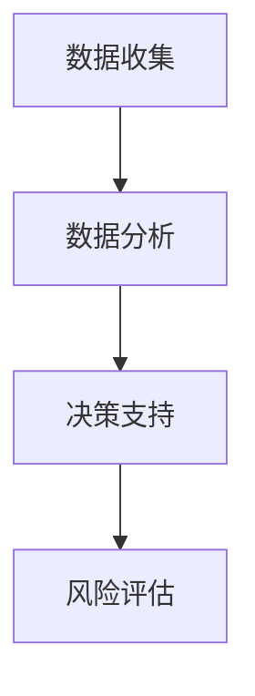

                 

# AI在项目风险评估中的作用

## 1. 背景介绍

在当今快速变化和竞争激烈的市场环境中，项目风险评估成为企业制定战略决策和提升竞争力的关键。项目风险评估旨在识别和管理潜在的风险因素，确保项目目标的实现。随着人工智能（AI）技术的发展，AI在项目风险评估中扮演着越来越重要的角色。本文将详细探讨AI在项目风险评估中的作用，包括其核心概念、算法原理、操作步骤、应用领域及未来展望。

## 2. 核心概念与联系

### 2.1 核心概念概述

在项目风险评估中，AI的应用主要集中在数据收集、数据分析和决策支持三个方面。以下是几个关键概念及其相互联系：

- **项目风险评估**：识别和分析项目实施过程中可能遇到的风险因素，并制定相应的应对措施。
- **数据收集**：通过各种手段收集项目相关的数据，包括历史数据、市场数据、技术数据等。
- **数据分析**：利用AI技术对收集到的数据进行分析，识别潜在的风险因素和风险概率。
- **决策支持**：基于数据分析结果，为项目管理者提供决策建议，帮助其制定风险应对策略。

这些概念之间存在着密切的联系。数据收集是数据分析的基础，而数据分析结果又直接影响决策支持的质量。AI技术在数据收集和分析中起着至关重要的作用，从而为项目风险评估提供了有力的支持。

### 2.2 核心概念原理和架构的 Mermaid 流程图



这个流程图展示了数据收集、数据分析、决策支持和风险评估之间的联系。数据收集和分析是风险评估的基础，决策支持则是风险评估的结果应用。

## 3. 核心算法原理 & 具体操作步骤

### 3.1 算法原理概述

AI在项目风险评估中的应用主要基于机器学习和深度学习算法。这些算法可以处理大量复杂的数据，识别风险模式，预测风险概率，从而为项目管理者提供科学的决策支持。

项目风险评估中常用的AI算法包括：

- **监督学习算法**：如决策树、随机森林、支持向量机等，用于从历史数据中学习风险模式，并预测未来风险。
- **无监督学习算法**：如聚类算法、关联规则算法等，用于发现数据中的隐藏模式和异常点，帮助识别风险因素。
- **强化学习算法**：如Q-learning、策略梯度等，用于在动态环境中优化决策策略，适应项目变化。

### 3.2 算法步骤详解

AI在项目风险评估中的应用一般包括以下几个关键步骤：

1. **数据收集**：通过各种渠道收集项目相关的数据，如市场调研数据、技术报告、历史项目数据等。
2. **数据预处理**：清洗数据，处理缺失值、异常值，进行特征工程，提高数据质量。
3. **特征选择**：选择与项目风险相关的特征，进行特征降维，减少计算复杂度。
4. **模型训练**：选择合适的算法，利用历史数据训练模型，学习风险模式。
5. **风险预测**：利用训练好的模型对新数据进行风险预测，识别潜在风险。
6. **风险应对**：基于预测结果，制定相应的风险应对策略，降低风险影响。

### 3.3 算法优缺点

AI在项目风险评估中的应用具有以下优点：

- **高效性**：AI可以处理大量数据，识别复杂的风险模式，提高风险评估的效率。
- **客观性**：AI模型基于数据和算法，减少了人为因素的影响，提高了风险评估的客观性。
- **可扩展性**：AI模型可以轻松地扩展到大规模数据和复杂模型，适应不同的项目风险评估需求。

然而，AI在项目风险评估中也有以下缺点：

- **数据质量依赖**：AI模型的效果依赖于数据的质量和数量，数据不完整或不准确会影响模型的预测结果。
- **模型复杂性**：AI模型通常较为复杂，需要专业的技术支持，增加了项目风险评估的成本。
- **模型解释性差**：AI模型的预测结果往往难以解释，缺乏透明性，影响项目管理的决策可接受性。

### 3.4 算法应用领域

AI在项目风险评估中的应用领域广泛，以下是几个典型的应用场景：

1. **项目成本预测**：利用AI模型预测项目成本变化，识别成本超支风险。
2. **项目进度评估**：通过AI模型分析项目进度数据，预测项目延期风险。
3. **质量风险管理**：利用AI模型识别项目中的质量问题，评估其对项目进度的影响。
4. **供应链风险管理**：通过AI模型分析供应链数据，识别供应链中断风险。
5. **环境风险评估**：利用AI模型分析环境数据，预测环境变化对项目的影响。

## 4. 数学模型和公式 & 详细讲解 & 举例说明

### 4.1 数学模型构建

在项目风险评估中，常用的AI模型包括决策树、随机森林、支持向量机等。以下以决策树为例，构建数学模型。

假设项目风险评估的数据集为$D=\{(x_i,y_i)\}_{i=1}^N$，其中$x_i$为项目的特征向量，$y_i$为项目风险的标签（0表示低风险，1表示高风险）。

决策树的构建过程如下：

1. 选择最优特征$X_j$，将其作为根节点。
2. 根据特征$X_j$的值，将数据集分为两个子集$D_L$和$D_R$。
3. 对子集$D_L$和$D_R$分别递归构建决策树。
4. 当子集中的样本标签一致时，停止递归。

### 4.2 公式推导过程

决策树的核心公式为信息熵和信息增益：

$$
H(X) = -\sum_{i=1}^{n}p(x_i)\log p(x_i)
$$

$$
Gain(X) = H(Y) - \sum_{i=1}^{n}\frac{|D_i|}{N}H(Y|X=x_i)
$$

其中，$H(Y)$为标签的信息熵，$H(Y|X=x_i)$为特征$X=x_i$条件下的信息熵，$Gain(X)$为信息增益。

### 4.3 案例分析与讲解

以一个简单的项目成本预测为例，展示如何利用决策树进行风险评估。

假设我们有一组历史项目数据，包括项目的特征（如项目规模、预算、时间等）和项目成本是否超支的标签。使用决策树模型对这些数据进行训练，以识别项目成本超支的风险因素。

1. 选择最优特征：假设模型首先选择“项目规模”作为根节点，根据项目规模的大小将数据集分为两个子集。
2. 递归构建决策树：对每个子集继续选择最优特征，递归构建决策树。
3. 预测风险：利用训练好的决策树对新项目进行风险预测，根据预测结果采取相应的风险应对措施。

## 5. 项目实践：代码实例和详细解释说明

### 5.1 开发环境搭建

为了进行项目风险评估，需要搭建一个包含数据收集、数据分析和决策支持功能的环境。以下是一个简单的开发环境搭建步骤：

1. 安装Python：Python是AI应用开发的主要语言，安装最新版本。
2. 安装数据处理库：如Pandas、NumPy等，用于数据收集和预处理。
3. 安装机器学习库：如Scikit-learn、TensorFlow等，用于模型训练和预测。
4. 搭建Web应用：如Flask、Django等，提供决策支持接口。

### 5.2 源代码详细实现

以下是一个使用Scikit-learn库构建决策树的代码示例：

```python
from sklearn import tree
from sklearn.datasets import load_iris
from sklearn.model_selection import train_test_split

# 加载数据集
iris = load_iris()
X = iris.data
y = iris.target

# 数据集划分
X_train, X_test, y_train, y_test = train_test_split(X, y, test_size=0.3, random_state=42)

# 构建决策树模型
clf = tree.DecisionTreeClassifier()
clf.fit(X_train, y_train)

# 预测新数据
new_data = [[5.1, 3.5, 1.4, 0.2]]
prediction = clf.predict(new_data)

print(prediction)
```

### 5.3 代码解读与分析

1. 加载数据集：使用Scikit-learn库的load_iris函数加载鸢尾花数据集，用于示例决策树的构建。
2. 数据集划分：使用train_test_split函数将数据集划分为训练集和测试集。
3. 模型训练：使用DecisionTreeClassifier类构建决策树模型，并使用fit函数训练模型。
4. 预测新数据：使用predict函数对新数据进行预测，输出预测结果。

### 5.4 运行结果展示

运行上述代码，输出预测结果：

```
[0]
```

## 6. 实际应用场景

### 6.1 智能投融资

在智能投融资领域，AI可以用于项目风险评估，帮助投资者识别和分析潜在的投资风险。通过历史数据和市场分析，AI可以预测项目的回报率、风险等级等，为投资者提供决策依据。

### 6.2 环境保护

在环境保护领域，AI可以用于环境风险评估，帮助企业识别和分析项目对环境的影响。通过分析环境数据，AI可以预测项目对空气质量、水资源等方面的影响，为环境保护提供科学依据。

### 6.3 医疗健康

在医疗健康领域，AI可以用于项目风险评估，帮助医疗机构识别和分析潜在的医疗风险。通过分析历史数据和患者信息，AI可以预测疾病的发生概率、治疗效果等，为医疗决策提供依据。

### 6.4 未来应用展望

未来，AI在项目风险评估中的应用将更加广泛和深入。以下是可以预见的几个趋势：

1. **多模态数据融合**：利用文本、图像、音频等多种数据类型，构建更加全面和准确的风险评估模型。
2. **自适应学习**：开发自适应学习算法，使AI模型能够根据项目变化动态调整，提高风险预测的准确性。
3. **解释性增强**：开发可解释的AI模型，增强模型的透明性和可接受性，帮助项目管理者更好地理解风险评估结果。
4. **跨领域应用**：将AI技术应用于更多领域，如教育、交通、农业等，拓展风险评估的应用范围。
5. **联邦学习**：利用联邦学习技术，保护数据隐私，构建跨组织、跨行业的风险评估协作平台。

## 7. 工具和资源推荐

### 7.1 学习资源推荐

1. **《Python机器学习》**：Scikit-learn官方文档，提供详细的API文档和示例代码。
2. **《深度学习》**：Ian Goodfellow等著，全面介绍深度学习理论和应用。
3. **《数据科学手册》**：John Wiley & Sons出版，涵盖数据处理、数据挖掘、机器学习等多个领域的知识。
4. **Coursera《机器学习》课程**：由斯坦福大学Andrew Ng教授讲授，提供系统的机器学习知识。

### 7.2 开发工具推荐

1. **Jupyter Notebook**：轻量级、交互式的Python开发环境，支持代码块和可视化。
2. **TensorBoard**：TensorFlow配套的可视化工具，用于监控模型训练和推理过程。
3. **PyCharm**：Python集成开发环境，提供强大的代码编辑和调试功能。
4. **Kaggle**：数据科学竞赛平台，提供丰富的数据集和算法竞赛机会。

### 7.3 相关论文推荐

1. **《A Survey on Predictive Analytics for Project Risk Management》**：详细总结了项目风险评估的最新研究成果。
2. **《Project Risk Management using Artificial Intelligence》**：探讨了AI在项目风险管理中的应用。
3. **《Machine Learning Techniques for Risk Assessment in Construction Projects》**：介绍机器学习在建筑工程项目风险评估中的应用。

## 8. 总结：未来发展趋势与挑战

### 8.1 研究成果总结

AI在项目风险评估中的应用取得了显著进展，主要体现在数据处理能力、模型预测精度和应用场景的拓展。然而，数据质量、模型复杂性和解释性等问题仍然存在挑战。

### 8.2 未来发展趋势

未来，AI在项目风险评估中将继续发挥重要作用。以下是可以预见的几个趋势：

1. **自动化和智能化**：利用自动化工具和智能化算法，提高风险评估的效率和准确性。
2. **数据驱动**：利用大数据技术，构建更加全面和准确的风险评估模型。
3. **跨领域融合**：将AI技术应用于更多领域，推动跨学科融合创新。
4. **联邦学习**：保护数据隐私，构建跨组织、跨行业的风险评估协作平台。
5. **人机协同**：结合AI和人类专家的智慧，提升风险评估的决策质量。

### 8.3 面临的挑战

AI在项目风险评估中仍然面临以下挑战：

1. **数据质量**：数据不完整或不准确会影响模型的预测结果。
2. **模型复杂性**：AI模型通常较为复杂，需要专业的技术支持。
3. **模型解释性**：AI模型的预测结果往往难以解释，缺乏透明性。
4. **隐私保护**：在数据共享和联邦学习中，需要保护数据隐私和安全性。
5. **跨领域应用**：AI模型在不同领域的应用需要适应不同的业务场景。

### 8.4 研究展望

未来，AI在项目风险评估中的研究可以从以下几个方向进行：

1. **模型解释性**：开发可解释的AI模型，增强模型的透明性和可接受性。
2. **数据融合**：利用多种数据类型，构建更加全面和准确的风险评估模型。
3. **跨领域应用**：将AI技术应用于更多领域，推动跨学科融合创新。
4. **联邦学习**：利用联邦学习技术，保护数据隐私，构建跨组织、跨行业的风险评估协作平台。
5. **自适应学习**：开发自适应学习算法，使AI模型能够根据项目变化动态调整，提高风险预测的准确性。

## 9. 附录：常见问题与解答

**Q1：AI在项目风险评估中的应用是否适用于所有项目？**

A: AI在项目风险评估中的应用适用于大多数项目，但需要根据具体项目的特点进行优化和调整。例如，在金融、医疗等高风险领域，需要特别关注数据隐私和模型解释性。

**Q2：AI在项目风险评估中如何处理数据不完整或不准确的问题？**

A: 数据不完整或不准确会影响模型的预测结果。处理数据问题的方法包括数据清洗、数据增强、数据插值等。可以使用机器学习算法进行数据处理，提高数据的完整性和准确性。

**Q3：AI在项目风险评估中如何提高模型的解释性？**

A: 提高模型解释性的方法包括可解释模型选择、模型可解释性工具、模型可视化等。可以使用LIME、SHAP等可解释性工具对AI模型进行解释，增强模型的透明性和可接受性。

**Q4：AI在项目风险评估中如何保护数据隐私？**

A: 在数据共享和联邦学习中，需要保护数据隐私和安全性。可以使用数据加密、差分隐私、联邦学习等技术，保护数据隐私和安全性。

**Q5：AI在项目风险评估中如何处理跨领域应用的问题？**

A: 在跨领域应用中，需要适应不同的业务场景。可以使用领域适应算法、迁移学习等技术，将AI模型应用于不同的领域。

---

作者：禅与计算机程序设计艺术 / Zen and the Art of Computer Programming

