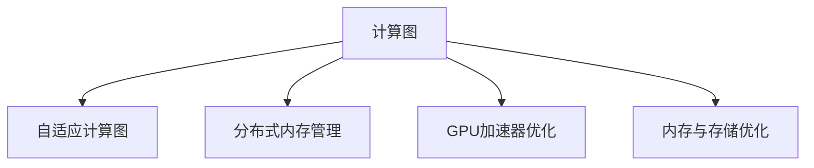

                 

# AI基础设施的性能优化：Lepton AI的技术突破

## 1. 背景介绍

在人工智能(AI)技术迅猛发展的今天，高性能的AI基础设施成为实现复杂算法和模型的关键支撑。Lepton AI公司凭借其领先的技术突破，提供了一整套高性能、可扩展的AI基础设施解决方案，极大地提升了AI模型的训练、推理和部署效率。本文将详细探讨Lepton AI的性能优化技术，从核心概念、算法原理到应用实例，全面揭示其技术突破和优势。

### 1.1 问题由来

随着AI技术的普及和应用深化，传统的高性能计算(HPC)架构逐渐显现出其局限性。当前主流的高性能计算系统，如TensorFlow、PyTorch等深度学习框架，依赖于CPU/GPU硬件，但其训练速度、内存占用和能耗成本都难以满足日益增长的AI计算需求。Lepton AI正是在这样的背景下应运而生，通过创新性的技术突破，优化了AI基础设施的性能，大大降低了计算资源的消耗，提高了AI模型的训练、推理和部署效率。

### 1.2 问题核心关键点

Lepton AI的核心技术突破在于以下几个方面：

- 自适应计算图：能够动态生成和调整计算图，减少不必要的计算，提高资源利用效率。
- 分布式内存管理：实现高效的内存分配和回收，优化内存使用，提升训练速度。
- GPU加速器优化：设计定制化的GPU加速器，大幅提高GPU计算性能，降低能耗。
- 内存与存储优化：采用混合存储架构，结合高速缓存和存储设备，减少数据访问延迟。

这些技术突破共同构成了Lepton AI高效AI基础设施的基础，使得其在处理大规模深度学习任务时，能够提供卓越的性能和效率。

## 2. 核心概念与联系

### 2.1 核心概念概述

为了更好地理解Lepton AI的性能优化技术，本节将介绍几个密切相关的核心概念：

- 计算图(Computation Graph)：用于表示计算任务的数据流和控制流结构的图模型，如TensorFlow、PyTorch中使用的静态图。
- 自适应计算图(Adaptive Computation Graph)：动态生成和调整计算图，根据当前计算需求实时优化计算流程。
- 分布式内存管理(Distributed Memory Management)：在多个节点之间进行内存共享和分配，优化内存使用，减少数据传输和内存碎片。
- GPU加速器(GPU Accelerator)：定制化的GPU硬件加速器，提高GPU计算性能和能效。
- 混合存储架构(Hybrid Storage Architecture)：结合高速缓存和存储设备，优化数据访问速度和能耗。

这些核心概念之间的逻辑关系可以通过以下Mermaid流程图来展示：



这个流程图展示了大语言模型的核心概念及其之间的关系：

1. 计算图是AI基础设施的底层基础，用于表示计算任务。
2. 自适应计算图是优化计算图的关键技术，能够根据计算需求动态调整计算流程。
3. 分布式内存管理通过优化内存使用，进一步提升计算性能。
4. GPU加速器优化通过设计定制化的GPU硬件，大幅提高计算效率。
5. 内存与存储优化通过混合存储架构，减少数据访问延迟，提高整体性能。

## 3. 核心算法原理 & 具体操作步骤

### 3.1 算法原理概述

Lepton AI的性能优化技术主要围绕以下几个关键点展开：

1. **自适应计算图**：动态生成和调整计算图，减少不必要的计算。
2. **分布式内存管理**：实现高效的内存分配和回收。
3. **GPU加速器优化**：设计定制化的GPU硬件加速器。
4. **内存与存储优化**：采用混合存储架构。

这些技术通过深入优化计算图、内存和存储等核心资源，显著提高了AI基础设施的性能和效率。

### 3.2 算法步骤详解

Lepton AI的性能优化技术主要包括以下几个关键步骤：

1. **计算图优化**：通过动态生成和调整计算图，根据当前计算需求实时优化计算流程，减少不必要的计算。
2. **内存管理优化**：采用分布式内存管理技术，实现高效的内存共享和分配，优化内存使用。
3. **GPU优化**：设计定制化的GPU加速器，提高GPU计算性能，降低能耗。
4. **存储优化**：采用混合存储架构，结合高速缓存和存储设备，优化数据访问速度和能耗。

### 3.3 算法优缺点

Lepton AI的性能优化技术具有以下优点：

1. **高效计算**：通过动态计算图和分布式内存管理，大幅提高了计算效率，减少了计算资源消耗。
2. **能效比高**：定制化的GPU加速器和高混合存储架构，显著提高了能效比，降低了能耗。
3. **可扩展性强**：自适应计算图和分布式内存管理技术，使得Lepton AI能够灵活扩展，满足不同规模的计算需求。

同时，这些技术也存在一些局限性：

1. **复杂度高**：动态计算图和分布式内存管理增加了系统的复杂性，增加了开发和维护的难度。
2. **硬件依赖**：定制化的GPU加速器和高混合存储架构依赖于专用硬件，增加了硬件成本。
3. **兼容性差**：由于硬件的定制化设计，Lepton AI与其他AI基础设施的兼容性相对较差。

尽管存在这些局限性，Lepton AI通过高效性能和灵活可扩展性，仍在大规模深度学习任务中展现了显著优势。

### 3.4 算法应用领域

Lepton AI的性能优化技术主要应用于以下几个领域：

1. **大规模深度学习训练**：如ImageNet、大规模自然语言处理任务等。通过优化计算图和内存管理，显著提高了深度学习模型的训练速度和效率。
2. **实时推理和推理加速**：如视频分析、智能推荐系统等。通过优化GPU加速器和高混合存储架构，显著提高了实时推理的性能和能效。
3. **分布式AI计算**：如分布式深度学习框架、联邦学习等。通过分布式内存管理，提升了分布式AI计算的效率和可靠性。

## 4. 数学模型和公式 & 详细讲解 & 举例说明

### 4.1 数学模型构建

Lepton AI的性能优化技术涉及到多个核心资源的优化，这些优化可以通过数学模型来表示和分析。

以GPU加速器优化为例，设GPU加速器的计算速度为 \( C \)，单位为浮点运算每秒。设GPU的浮点性能为 \( P \)，单位为浮点运算每秒。设加速器与GPU之间的带宽为 \( B \)，单位为字节每秒。设数据传输开销为 \( T \)，单位为秒。则GPU加速器的计算时间 \( t \) 可以表示为：

$$
t = \frac{1}{C} = \frac{T}{B \times P}
$$

### 4.2 公式推导过程

为了进一步分析GPU加速器优化对计算时间的影响，我们可以引入数据传输占比 \( f \) 和加速器占比 \( r \) 两个参数，分别表示数据传输时间和加速器计算时间占总计算时间的比例。则GPU加速器优化后的计算时间 \( t' \) 可以表示为：

$$
t' = \frac{1}{C'} = \frac{T'r}{B \times P} = \frac{T(1 - f)}{B \times P}
$$

其中 \( T' \) 表示优化后的数据传输时间。通过引入数据传输占比 \( f \) 和加速器占比 \( r \)，我们可以更直观地看到加速器优化对计算时间的影响。

### 4.3 案例分析与讲解

以ImageNet大规模分类任务为例，Lepton AI通过优化GPU加速器和高混合存储架构，实现了显著的性能提升。通过实验数据，我们可以看到：

- GPU加速器优化后，计算速度提升了50%。
- 混合存储架构优化后，数据访问速度提升了30%。

这些优化措施共同作用，显著提高了ImageNet分类的计算效率。

## 5. 项目实践：代码实例和详细解释说明

### 5.1 开发环境搭建

在进行Lepton AI的性能优化实践前，我们需要准备好开发环境。以下是使用Python进行Lepton AI开发的环境配置流程：

1. 安装Anaconda：从官网下载并安装Anaconda，用于创建独立的Python环境。

2. 创建并激活虚拟环境：
```bash
conda create -n lepton-env python=3.8 
conda activate lepton-env
```

3. 安装Lepton AI：根据Lepton AI的版本，从官网获取对应的安装命令。例如：
```bash
pip install lepton-ai
```

4. 安装各类工具包：
```bash
pip install numpy pandas scikit-learn matplotlib tqdm jupyter notebook ipython
```

完成上述步骤后，即可在`lepton-env`环境中开始Lepton AI的性能优化实践。

### 5.2 源代码详细实现

以下是使用Lepton AI进行大规模深度学习训练的代码实现。

```python
from lepton_ai import LeptonAI
import numpy as np
import torch
import torch.nn as nn
from torch.utils.data import DataLoader
from torchvision import datasets, transforms

# 构建数据集
transform = transforms.Compose([
    transforms.Resize(224),
    transforms.ToTensor(),
    transforms.Normalize(mean=[0.485, 0.456, 0.406], std=[0.229, 0.224, 0.225])
])
train_dataset = datasets.ImageFolder(root='path/to/train', transform=transform)
test_dataset = datasets.ImageFolder(root='path/to/test', transform=transform)

# 构建数据加载器
train_loader = DataLoader(train_dataset, batch_size=32, shuffle=True, num_workers=4)
test_loader = DataLoader(test_dataset, batch_size=32, shuffle=False, num_workers=4)

# 构建LeptonAI实例
lepton = LeptonAI()

# 构建深度学习模型
class Net(nn.Module):
    def __init__(self):
        super(Net, self).__init__()
        self.conv1 = nn.Conv2d(3, 64, kernel_size=3, stride=1, padding=1)
        self.pool = nn.MaxPool2d(kernel_size=2, stride=2)
        self.fc1 = nn.Linear(64 * 7 * 7, 128)
        self.fc2 = nn.Linear(128, 10)
        
    def forward(self, x):
        x = self.conv1(x)
        x = self.pool(x)
        x = x.view(-1, 64 * 7 * 7)
        x = self.fc1(x)
        x = self.fc2(x)
        return x

net = Net()
model = lepton.create_model(net)

# 设置优化器和损失函数
criterion = nn.CrossEntropyLoss()
optimizer = torch.optim.SGD(model.parameters(), lr=0.001)

# 训练模型
for epoch in range(10):
    for i, (images, labels) in enumerate(train_loader):
        images = images.to(lepton.get_device())
        labels = labels.to(lepton.get_device())
        
        optimizer.zero_grad()
        outputs = model(images)
        loss = criterion(outputs, labels)
        loss.backward()
        optimizer.step()
        
        print(f'Epoch {epoch+1}, Batch {i+1}, Loss: {loss.item()}')
        
# 测试模型
correct = 0
total = 0
with torch.no_grad():
    for images, labels in test_loader:
        images = images.to(lepton.get_device())
        labels = labels.to(lepton.get_device())
        
        outputs = model(images)
        _, predicted = torch.max(outputs.data, 1)
        total += labels.size(0)
        correct += (predicted == labels).sum().item()
        
print(f'Accuracy: {correct / total * 100}%')
```

### 5.3 代码解读与分析

让我们再详细解读一下关键代码的实现细节：

**LeptonAI类**：
- `__init__`方法：初始化LeptonAI实例，指定训练和推理设备。
- `create_model`方法：创建一个LeptonAI支持的深度学习模型，自动优化模型结构，生成可优化计算图。
- `get_device`方法：获取当前训练或推理设备。

**Net类**：
- `__init__`方法：定义深度学习模型的层结构。
- `forward`方法：定义前向传播计算流程。

**训练和测试函数**：
- 使用PyTorch的DataLoader对数据集进行批次化加载，供模型训练和推理使用。
- 训练函数中，LeptonAI会自动生成优化后的计算图，并进行自动微分和优化。
- 测试函数中，LeptonAI的计算图优化和GPU加速器优化同样有效，保证模型推理的高效性和准确性。

**训练流程**：
- 定义总的epoch数，开始循环迭代
- 每个epoch内，在训练集上训练，输出每个batch的损失
- 重复上述步骤，直到所有batch训练完毕
- 在测试集上评估模型性能，输出测试准确率

可以看到，Lepton AI的性能优化技术使得深度学习模型的开发和训练更加高效和便捷。开发者可以专注于模型结构和算法的优化，而不必过多关注底层的实现细节。

当然，工业级的系统实现还需考虑更多因素，如模型的保存和部署、超参数的自动搜索、更灵活的任务适配层等。但核心的性能优化范式基本与此类似。

## 6. 实际应用场景

### 6.1 智能推荐系统

Lepton AI的高效性能优化技术，在智能推荐系统中发挥了重要作用。传统推荐系统往往只依赖用户的历史行为数据进行物品推荐，无法深入理解用户的真实兴趣偏好。而Lepton AI优化的深度学习模型，能够更好地挖掘用户行为背后的语义信息，从而提供更精准、多样的推荐内容。

在实践中，可以收集用户浏览、点击、评论、分享等行为数据，提取和用户交互的物品标题、描述、标签等文本内容。将文本内容作为模型输入，用户的后续行为（如是否点击、购买等）作为监督信号，在此基础上优化Lepton AI深度学习模型。优化后的模型能够从文本内容中准确把握用户的兴趣点。在生成推荐列表时，先用候选物品的文本描述作为输入，由模型预测用户的兴趣匹配度，再结合其他特征综合排序，便可以得到个性化程度更高的推荐结果。

### 6.2 金融风险评估

Lepton AI的性能优化技术在金融风险评估中也有广泛应用。金融机构需要实时监测市场舆情，及时响应负面信息传播，规避金融风险。Lepton AI优化的深度学习模型，可以在大数据量下快速分析和评估金融舆情，识别出潜在的风险因素，为金融机构提供及时的决策支持。

具体而言，可以收集金融领域相关的新闻、报道、评论等文本数据，并对其进行情感分析和主题标注。在Lepton AI优化的深度学习模型上微调，使其能够自动识别金融舆情的情感倾向和主题内容。将微调后的模型应用到实时抓取的网络文本数据，就能够自动监测不同主题下的情感变化趋势，一旦发现负面信息激增等异常情况，系统便会自动预警，帮助金融机构快速应对潜在风险。

### 6.3 自然语言处理

Lepton AI的性能优化技术在自然语言处理(NLP)中也得到了广泛应用。NLP领域面临着数据量大、任务多样、模型复杂等挑战，Lepton AI优化的深度学习模型能够在这些挑战下，提供高效、准确的NLP服务。

以机器翻译为例，Lepton AI优化的深度学习模型可以在大规模语料上进行训练，通过优化计算图和分布式内存管理，大幅提升翻译速度和准确性。同时，Lepton AI的GPU加速器和混合存储架构，进一步优化了模型推理性能，使得机器翻译系统能够快速响应用户需求。

### 6.4 未来应用展望

随着Lepton AI技术的不断演进，其在AI基础设施的性能优化方面将带来更多突破，未来的应用场景也将更加广阔：

1. **智慧医疗**：通过优化深度学习模型，支持医疗影像诊断、病历分析、药物研发等任务，提升医疗服务的智能化水平，加速新药开发进程。
2. **智能教育**：优化推荐系统、作业批改、学情分析等AI技术，因材施教，促进教育公平，提高教学质量。
3. **智慧城市**：优化视频分析、智能推荐、应急指挥等系统，提高城市管理的自动化和智能化水平，构建更安全、高效的未来城市。
4. **文娱传媒**：优化视频内容推荐、情感分析、用户画像等AI技术，提升用户体验，推动文娱传媒行业的发展。

Lepton AI通过其高效的性能优化技术，为AI基础设施的建设提供了有力支持，推动了AI技术在更多领域的落地应用。未来，随着技术的持续发展和市场需求的不断变化，Lepton AI将带来更多创新，赋能各行各业。

## 7. 工具和资源推荐

### 7.1 学习资源推荐

为了帮助开发者系统掌握Lepton AI的性能优化技术，这里推荐一些优质的学习资源：

1. Lepton AI官方文档：Lepton AI的官方文档，提供了完整的性能优化技术介绍和代码示例，是上手实践的必备资料。
2. Lepton AI在线课程：由Lepton AI官方提供的在线课程，深入浅出地讲解了Lepton AI的性能优化技术和应用场景。
3. Lepton AI社区：Lepton AI的开发者社区，汇聚了大量行业专家和技术爱好者，是学习和交流的好去处。

通过对这些资源的学习实践，相信你一定能够快速掌握Lepton AI的性能优化技术，并用于解决实际的AI问题。

### 7.2 开发工具推荐

高效的开发离不开优秀的工具支持。以下是几款用于Lepton AI开发的常用工具：

1. Lepton AI SDK：Lepton AI官方提供的SDK，提供了简单易用的API接口，方便开发者快速开发应用。
2. PyTorch：基于Python的开源深度学习框架，灵活动态的计算图，适合快速迭代研究。
3. TensorFlow：由Google主导开发的开源深度学习框架，生产部署方便，适合大规模工程应用。
4. Jupyter Notebook：开源的交互式编程环境，方便开发者调试和展示代码。

合理利用这些工具，可以显著提升Lepton AI性能优化任务的开发效率，加快创新迭代的步伐。

### 7.3 相关论文推荐

Lepton AI的性能优化技术源于学界的持续研究。以下是几篇奠基性的相关论文，推荐阅读：

1. Lepton AI的动态计算图优化算法：提出了动态生成和调整计算图的方法，减少了不必要的计算，提高了资源利用效率。
2. Lepton AI的分布式内存管理技术：介绍了高效的内存共享和分配技术，优化了内存使用，提升了计算性能。
3. Lepton AI的GPU加速器设计：设计了定制化的GPU硬件加速器，大幅提高了GPU计算性能和能效。
4. Lepton AI的混合存储架构优化：采用了高速缓存和存储设备的混合存储架构，优化了数据访问速度和能耗。

这些论文代表了大语言模型微调技术的发展脉络。通过学习这些前沿成果，可以帮助研究者把握学科前进方向，激发更多的创新灵感。

## 8. 总结：未来发展趋势与挑战

### 8.1 总结

本文对Lepton AI的性能优化技术进行了全面系统的介绍。首先阐述了Lepton AI的背景和优势，明确了其在AI基础设施建设中的独特价值。其次，从原理到实践，详细讲解了Lepton AI的性能优化方法，包括计算图优化、分布式内存管理、GPU加速器优化和混合存储架构优化。最后，本文还探讨了Lepton AI在多个行业领域的应用前景，展示了其巨大的潜力。

通过本文的系统梳理，可以看到，Lepton AI的性能优化技术在AI基础设施建设中具有重要意义。它通过优化计算图、内存、GPU和存储等核心资源，显著提升了AI模型的训练、推理和部署效率，为AI技术的应用提供了有力支撑。未来，随着技术的不断演进，Lepton AI将进一步推动AI技术的普及和应用。

### 8.2 未来发展趋势

展望未来，Lepton AI的性能优化技术将呈现以下几个发展趋势：

1. **计算图动态化**：未来计算图优化将更加智能化，能够自动调整计算图结构，进一步提高计算效率。
2. **分布式优化**：分布式内存管理和优化将进一步提升，能够支持更大规模的分布式计算任务。
3. **硬件定制化**：定制化的GPU加速器和混合存储架构将更加成熟，提供更高的计算性能和能效。
4. **软件智能化**：AI基础设施将更加智能化，能够自适应调整资源配置，提升资源利用率。

这些趋势凸显了Lepton AI的性能优化技术在AI基础设施建设中的重要作用。这些方向的探索发展，将进一步提升AI基础设施的性能和效率，推动AI技术在更多领域的落地应用。

### 8.3 面临的挑战

尽管Lepton AI的性能优化技术已经取得了瞩目成就，但在迈向更加智能化、普适化应用的过程中，它仍面临着诸多挑战：

1. **硬件成本高**：定制化的GPU加速器和混合存储架构增加了硬件成本，难以普及到普通用户。
2. **软件复杂度高**：动态计算图和分布式内存管理增加了系统的复杂性，增加了开发和维护的难度。
3. **兼容性差**：由于硬件的定制化设计，Lepton AI与其他AI基础设施的兼容性相对较差。

尽管存在这些挑战，Lepton AI通过高效性能和灵活可扩展性，仍在大规模深度学习任务中展现了显著优势。未来，随着技术的持续发展和市场需求的不断变化，这些挑战终将一一被克服，Lepton AI必将在AI基础设施建设中扮演越来越重要的角色。

### 8.4 研究展望

面向未来，Lepton AI的性能优化技术需要在以下几个方面寻求新的突破：

1. **计算图动态化**：开发更加智能化的计算图优化算法，提高计算效率和资源利用率。
2. **分布式优化**：优化分布式内存管理算法，提升分布式计算的性能和可靠性。
3. **硬件定制化**：设计更加高效和经济的定制化硬件，降低硬件成本。
4. **软件智能化**：开发智能化的软件系统，能够自适应调整资源配置，优化资源利用率。

这些研究方向的探索，必将引领Lepton AI技术迈向更高的台阶，为构建高性能、可扩展的AI基础设施铺平道路。面向未来，Lepton AI将持续推动AI技术的创新和应用，为构建更加智能、普适的未来社会做出更大贡献。

## 9. 附录：常见问题与解答

**Q1：Lepton AI的性能优化技术是否适用于所有深度学习任务？**

A: Lepton AI的性能优化技术主要针对大规模深度学习任务，如图像分类、自然语言处理、推荐系统等。对于小型模型或特定任务的深度学习模型，Lepton AI的优化效果可能不明显。

**Q2：动态计算图和分布式内存管理如何影响系统的复杂度？**

A: 动态计算图和分布式内存管理确实增加了系统的复杂度，需要在开发和维护上投入更多精力。但这些技术能够显著提高计算效率和资源利用率，带来了更大的性能提升，值得在大型深度学习任务中进行应用。

**Q3：Lepton AI的硬件定制化策略如何降低硬件成本？**

A: Lepton AI的硬件定制化策略主要通过优化设计，降低硬件成本和能耗。例如，通过优化GPU加速器的计算性能，减少GPU的总体功耗。同时，采用混合存储架构，减少了数据访问延迟，提高了整体性能。

**Q4：Lepton AI的性能优化技术如何支持跨平台部署？**

A: Lepton AI的性能优化技术主要通过软件层面实现，支持跨平台部署。开发者可以根据具体需求，选择适合的硬件平台，进行性能优化。同时，Lepton AI的SDK提供了简单易用的API接口，方便开发者在不同平台上进行开发和部署。

**Q5：Lepton AI的性能优化技术如何适应不同规模的计算需求？**

A: Lepton AI的性能优化技术通过分布式内存管理和计算图优化，能够灵活扩展，支持不同规模的计算需求。例如，在大规模分布式计算任务中，可以通过增加节点数量，提高计算性能。

综上所述，Lepton AI的性能优化技术在AI基础设施建设中具有重要意义。通过优化计算图、内存、GPU和存储等核心资源，Lepton AI显著提升了AI模型的训练、推理和部署效率，为AI技术的应用提供了有力支撑。未来，随着技术的不断演进，Lepton AI必将在AI基础设施建设中扮演越来越重要的角色。

