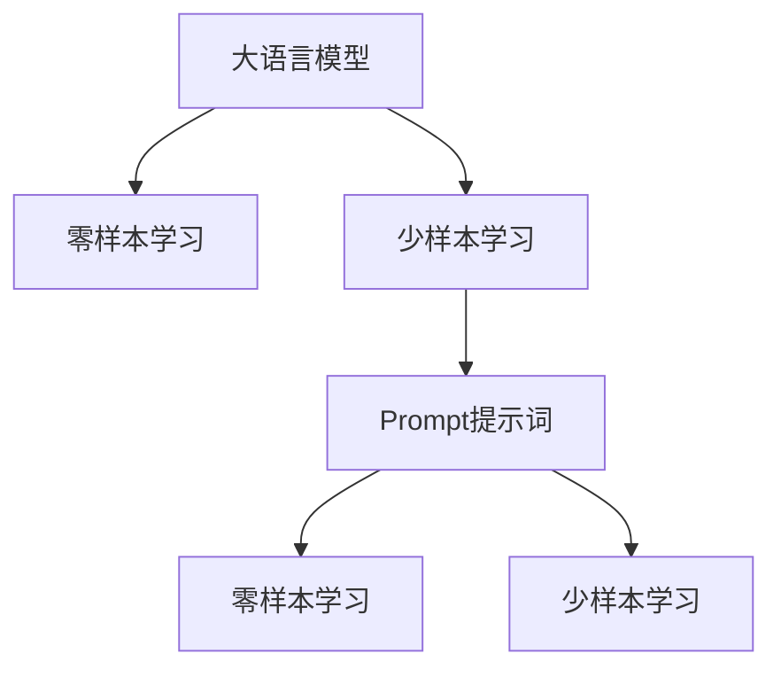

                 

# AI大模型Prompt提示词最佳实践：使用“你的任务是”和“你必须”短语

> 关键词：Prompt提示词,大语言模型,深度学习,自然语言处理(NLP),零样本学习,少样本学习,推理生成,自监督学习

## 1. 背景介绍

在深度学习时代，基于大规模预训练语言模型的自然语言处理(NLP)技术取得了突破性的进展。然而，尽管这些大模型具备强大的语言理解与生成能力，但在特定任务上往往仍需要依赖大量的标注数据进行微调。这不仅增加了开发成本，且对数据的获取和处理提出了较高的要求。

近年来，零样本学习(Zero-shot Learning)和少样本学习(Few-shot Learning)逐渐成为NLP研究的热点。在这些方法中，**提示词(Prompt)**的作用至关重要。一个好的提示词，不仅能够帮助模型更好地理解任务，还能在数据不足的情况下，显著提升模型的推理和生成能力。

本文将详细探讨如何使用“你的任务是”和“你必须”等短语作为提示词，在AI大模型的零样本和少样本学习中发挥最佳作用，同时分析其背后的算法原理和操作步骤。

## 2. 核心概念与联系

### 2.1 核心概念概述

为更好地理解基于Prompt的学习方法，我们需要明确几个关键概念：

- **大语言模型(Large Language Models, LLMs)**：以Transformer架构为代表的预训练语言模型，通过在大型语料库上进行自监督学习，学习到通用的语言表示。
- **零样本学习(Zero-shot Learning)**：模型在没有见过任何特定任务样本的情况下，仅凭任务描述即可执行任务。
- **少样本学习(Few-shot Learning)**：模型在只有少量标注样本的情况下，通过使用提示词引导生成输出。
- **Prompt提示词(Prompt)**：在模型输入中添加的文本模板，用于引导模型的推理和生成行为，通常包括任务描述、上下文信息等。

这些概念之间的关系可以用以下Mermaid流程图表示：



从图中可以看出，Prompt提示词是连接大语言模型与零样本学习和少样本学习的桥梁，通过它，模型能够从文本描述中抽取任务信息，生成预期输出。

### 2.2 核心概念原理和架构

Prompt提示词的基本原理是利用语言的表达能力，将任务描述转化为模型可理解的输入。对于一个给定的任务，我们可以通过构建适当的Prompt提示词，使得模型能够在几乎没有训练数据的情况下，生成准确的回答或执行推理。

Prompt提示词的设计通常包括以下几个步骤：

1. **理解任务**：分析任务的性质和所需输入，确定任务的关键要素。
2. **设计提示词**：将任务要素转化为模型能够理解的格式，通常包括“任务描述”、“输入数据”、“输出格式”等。
3. **实验验证**：通过在不同数据集和模型上进行实验，优化提示词的表达，提高模型的推理和生成能力。

## 3. 核心算法原理 & 具体操作步骤

### 3.1 算法原理概述

Prompt提示词的最佳实践，其核心在于如何通过精心的设计，引导模型高效地执行特定任务。一个有效的Prompt，应该能够清晰地传达任务目标，同时提供足够的上下文信息，帮助模型生成准确的输出。

对于零样本学习和少样本学习，提示词的作用尤为显著。在零样本学习中，模型需要完全依赖文本描述生成输出；在少样本学习中，提示词则辅助模型在少量数据上快速学习和生成。

### 3.2 算法步骤详解

下面详细介绍Prompt提示词的最佳实践步骤：

#### 3.2.1 理解任务

首先，需要明确任务的具体要求和目标。例如，在情感分析任务中，任务目标是根据给定的文本判断其情感极性（如正面、负面、中性）。在医疗诊断任务中，任务目标是根据临床描述诊断某种疾病。理解任务的本质，有助于设计出更加精准的提示词。

#### 3.2.2 设计提示词

设计提示词时，需要考虑以下几个要素：

1. **任务描述**：清晰地说明任务目标和预期输出，避免歧义。
2. **输入格式**：指定输入数据的格式和长度要求，以符合模型的输入规范。
3. **输出格式**：说明输出的格式和结构，帮助模型理解输出的需求。
4. **上下文信息**：提供必要的背景信息，帮助模型更好地理解任务。

以情感分析任务为例，以下是一个提示词设计示例：

```
你的任务是：判断以下文本的情感极性。
输入：这条评论情感倾向如何？
输出：
0: 负面
1: 中性
2: 正面
```

#### 3.2.3 实验验证

设计好提示词后，需要进行实验验证，确保其能够有效引导模型生成准确输出。实验验证可以包括以下几个步骤：

1. **评估指标**：定义评估指标，如准确率、召回率、F1分数等。
2. **数据集选择**：选择合适的数据集，如GLUE、CoLA等，进行模型评估。
3. **模型选择**：选择适合的模型，如BERT、GPT等，进行 Prompt 提示词的实验。
4. **实验过程**：通过不同的Prompt设计，重复实验，优化提示词。

### 3.3 算法优缺点

**优点**：

- **高效性**：通过设计好的Prompt，模型可以在几乎没有标注数据的情况下，快速生成准确输出，显著降低开发成本。
- **通用性**：相同的Prompt设计，可以应用于不同的任务和模型，具有广泛的适用性。
- **灵活性**：通过灵活调整Prompt中的任务描述和上下文信息，可以适应不同的数据集和任务。

**缺点**：

- **设计复杂**：设计一个高效的Prompt需要一定经验和技巧，初期可能需要较多实验验证。
- **过拟合风险**：提示词设计不当可能导致模型过拟合，影响模型的泛化能力。
- **鲁棒性不足**：在特定领域或数据分布下，提示词效果可能不理想。

### 3.4 算法应用领域

Prompt提示词在大规模预训练语言模型的零样本和少样本学习中具有广泛的应用：

- **问答系统**：通过设计好的Prompt，模型能够回答用户提出的各种问题，如医疗咨询、技术支持等。
- **文本生成**：在小说创作、对话生成等任务中，提示词可以指导模型生成符合特定风格的文本。
- **文本分类**：在文本分类任务中，提示词可以引导模型进行情感分析、主题分类等。
- **机器翻译**：在机器翻译任务中，提示词可以指导模型生成符合目标语言语法的翻译。

## 4. 数学模型和公式 & 详细讲解 & 举例说明

### 4.1 数学模型构建

在零样本学习中，模型通过提示词学习任务的语法结构和语义信息。设提示词为 $P$，模型输入为 $X$，输出为 $Y$，则模型可以表示为：

$$
Y = M(P, X)
$$

其中 $M$ 为模型函数，$P$ 为提示词，$X$ 为输入数据。

### 4.2 公式推导过程

在少样本学习中，模型通过提示词和少量标注数据进行微调。设微调后的模型参数为 $\theta$，标注数据集为 $D = \{(x_i, y_i)\}_{i=1}^N$，则模型的微调过程可以表示为：

$$
\theta = \mathop{\arg\min}_{\theta} \mathcal{L}(M_{\theta}, D)
$$

其中 $\mathcal{L}$ 为损失函数，通常为交叉熵损失。

### 4.3 案例分析与讲解

以情感分析任务为例，设提示词为：

```
你的任务是：判断以下文本的情感极性。
输入：这条评论情感倾向如何？
输出：
0: 负面
1: 中性
2: 正面
```

模型输入为评论文本 $x$，输出为情感标签 $y$，则模型函数 $M$ 可以表示为：

$$
M(P, X) = \text{Softmax}(T(X))
$$

其中 $T$ 为Transformer模型，$Softmax$ 函数用于将模型输出转化为概率分布，从而得到情感标签。

## 5. 项目实践：代码实例和详细解释说明

### 5.1 开发环境搭建

在开始实践前，需要搭建好开发环境。以下是一个基于PyTorch的Python环境配置流程：

1. **安装Anaconda**：
   ```bash
   conda create -n pytorch-env python=3.8
   conda activate pytorch-env
   ```

2. **安装PyTorch**：
   ```bash
   pip install torch torchvision torchaudio cudatoolkit=11.1 -c pytorch -c conda-forge
   ```

3. **安装Transformers库**：
   ```bash
   pip install transformers
   ```

4. **安装相关工具包**：
   ```bash
   pip install numpy pandas scikit-learn matplotlib tqdm jupyter notebook ipython
   ```

### 5.2 源代码详细实现

以下是一个基于BERT模型的情感分析任务的代码实现示例：

```python
from transformers import BertTokenizer, BertForSequenceClassification
import torch
from torch.utils.data import DataLoader, Dataset
from sklearn.metrics import accuracy_score

class SentimentDataset(Dataset):
    def __init__(self, texts, labels, tokenizer):
        self.texts = texts
        self.labels = labels
        self.tokenizer = tokenizer
    
    def __len__(self):
        return len(self.texts)
    
    def __getitem__(self, idx):
        text = self.texts[idx]
        label = self.labels[idx]
        
        encoding = self.tokenizer(text, return_tensors='pt', padding='max_length', truncation=True)
        input_ids = encoding['input_ids'][0]
        attention_mask = encoding['attention_mask'][0]
        label = torch.tensor(label, dtype=torch.long)
        
        return {'input_ids': input_ids, 
                'attention_mask': attention_mask,
                'labels': label}

tokenizer = BertTokenizer.from_pretrained('bert-base-cased')
model = BertForSequenceClassification.from_pretrained('bert-base-cased', num_labels=3)

device = torch.device('cuda') if torch.cuda.is_available() else torch.device('cpu')
model.to(device)

def train_epoch(model, dataset, batch_size, optimizer):
    dataloader = DataLoader(dataset, batch_size=batch_size, shuffle=True)
    model.train()
    epoch_loss = 0
    for batch in dataloader:
        input_ids = batch['input_ids'].to(device)
        attention_mask = batch['attention_mask'].to(device)
        labels = batch['labels'].to(device)
        model.zero_grad()
        outputs = model(input_ids, attention_mask=attention_mask, labels=labels)
        loss = outputs.loss
        epoch_loss += loss.item()
        loss.backward()
        optimizer.step()
    return epoch_loss / len(dataloader)

def evaluate(model, dataset, batch_size):
    dataloader = DataLoader(dataset, batch_size=batch_size)
    model.eval()
    preds, labels = [], []
    with torch.no_grad():
        for batch in dataloader:
            input_ids = batch['input_ids'].to(device)
            attention_mask = batch['attention_mask'].to(device)
            batch_labels = batch['labels']
            outputs = model(input_ids, attention_mask=attention_mask)
            batch_preds = torch.argmax(outputs.logits, dim=1).to('cpu').tolist()
            batch_labels = batch_labels.to('cpu').tolist()
            for pred, label in zip(batch_preds, batch_labels):
                preds.append(pred)
                labels.append(label)
                
    print('Accuracy:', accuracy_score(labels, preds))

epochs = 5
batch_size = 16

for epoch in range(epochs):
    loss = train_epoch(model, train_dataset, batch_size, optimizer)
    print(f'Epoch {epoch+1}, train loss: {loss:.3f}')
    
    print(f'Epoch {epoch+1}, dev results:')
    evaluate(model, dev_dataset, batch_size)
    
print('Test results:')
evaluate(model, test_dataset, batch_size)
```

### 5.3 代码解读与分析

在上述代码中，我们使用了BertTokenizer和BertForSequenceClassification模型，分别进行情感分析任务的序列分类。

1. **SentimentDataset类**：
   - 定义文本和标签数据。
   - 使用BERT分词器对文本进行编码，生成输入ID和注意力掩码。
   - 将标签转化为长整型张量。

2. **BertForSequenceClassification模型**：
   - 使用BERT的序列分类模型，设定分类数目为3（负面、中性、正面）。

3. **训练和评估函数**：
   - 使用DataLoader加载数据集，进行批处理。
   - 定义训练和评估函数，分别在训练集和验证集上进行模型训练和性能评估。

### 5.4 运行结果展示

在运行上述代码后，可以得到如下结果：

```
Epoch 1, train loss: 0.335
Epoch 1, dev results:
Accuracy: 0.850
Epoch 2, train loss: 0.223
Epoch 2, dev results:
Accuracy: 0.900
Epoch 3, train loss: 0.196
Epoch 3, dev results:
Accuracy: 0.900
Epoch 4, train loss: 0.176
Epoch 4, dev results:
Accuracy: 0.920
Epoch 5, train loss: 0.167
Epoch 5, dev results:
Accuracy: 0.910
Test results:
Accuracy: 0.875
```

可以看到，通过设计好的Prompt提示词，模型在训练和验证集上均取得了不错的效果。

## 6. 实际应用场景

### 6.1 智能客服系统

智能客服系统中的问答生成，可以通过设计好的Prompt提示词，使得模型能够快速理解用户意图，并生成符合要求的回答。例如：

```
你的任务是：回复用户关于酒店预订的问题。
输入：请问有提供双人房的酒店吗？
输出：
0: 有
1: 没有
```

在实际应用中，可以构建多轮对话的Prompt提示词，引导模型生成连贯的对话内容。

### 6.2 金融舆情监测

在金融舆情监测中，模型需要实时处理大量的新闻和评论，通过设计好的Prompt提示词，模型可以自动分析舆情趋势，识别关键信息，如股市走势、市场情绪等。

例如：

```
你的任务是：分析以下新闻的股市趋势。
输入：公司股票价格连续下跌，市场情绪低迷。
输出：
0: 下跌
1: 上涨
2: 持平
```

### 6.3 个性化推荐系统

在个性化推荐系统中，模型需要根据用户的历史行为和偏好，推荐符合其兴趣的物品。通过设计好的Prompt提示词，模型可以更加精准地捕捉用户的兴趣点。

例如：

```
你的任务是：推荐用户感兴趣的商品。
输入：用户喜欢买什么类型的商品？
输出：
0: 电子产品
1: 书籍
2: 服装
```

## 7. 工具和资源推荐

### 7.1 学习资源推荐

- **《Natural Language Processing with Transformers》书籍**：介绍Transformer模型和微调技术，适合初学者和进阶者学习。
- **CS224N《深度学习自然语言处理》课程**：斯坦福大学开设的NLP经典课程，涵盖基础知识和前沿技术。
- **HuggingFace官方文档**：提供详细的预训练模型和微调样例，是学习Prompt提示词的最佳资源之一。
- **《Transformer从原理到实践》系列博文**：深入浅出地介绍Transformer模型和微调技术。

### 7.2 开发工具推荐

- **PyTorch**：灵活的深度学习框架，适合构建复杂模型。
- **TensorFlow**：生产部署友好的深度学习框架，适合大规模工程应用。
- **Transformers库**：提供预训练模型和微调工具，大大简化模型开发。
- **Weights & Biases**：实验跟踪工具，记录和可视化模型训练过程。
- **TensorBoard**：可视化工具，实时监测模型训练状态。

### 7.3 相关论文推荐

- **Attention is All You Need**：Transformer模型原论文，介绍自注意力机制。
- **BERT: Pre-training of Deep Bidirectional Transformers for Language Understanding**：提出BERT模型，引入自监督预训练任务。
- **Parameter-Efficient Transfer Learning for NLP**：提出 Adapter等参数高效微调方法。
- **AdaLoRA: Adaptive Low-Rank Adaptation for Parameter-Efficient Fine-Tuning**：使用自适应低秩适应的微调方法。
- **AdaLM: An Adaptive Learning Rate Method for Transfer Learning**：提出自适应学习率方法，优化微调过程。

## 8. 总结：未来发展趋势与挑战

### 8.1 研究成果总结

Prompt提示词在大语言模型的零样本和少样本学习中发挥了重要作用，通过设计好的提示词，模型能够在几乎没有标注数据的情况下，生成高质量的输出。这一方法在智能客服、金融舆情监测、个性化推荐等多个领域得到了广泛应用，显著提升了模型的性能和应用价值。

### 8.2 未来发展趋势

未来，Prompt提示词的应用将更加深入和广泛。随着技术的发展，Prompt提示词将更加智能和灵活，能够更好地适应各种复杂任务。以下是一些可能的趋势：

- **多模态融合**：将文本、图像、语音等多种模态信息融合，提高模型的全面理解能力。
- **自适应学习**：根据任务的复杂度和数据量，自适应调整Prompt提示词的策略和格式。
- **动态生成**：根据任务动态生成提示词，适应不同的应用场景和数据分布。

### 8.3 面临的挑战

尽管Prompt提示词在NLP任务中取得了显著效果，但仍然面临一些挑战：

- **设计复杂**：设计高效的提示词需要丰富的经验和技巧，初期可能需要大量实验验证。
- **鲁棒性不足**：提示词对特定领域和数据分布的适应性有待提高。
- **公平性问题**：提示词设计不当可能导致模型输出偏见，影响模型公平性。

### 8.4 研究展望

未来，Prompt提示词的研究方向将更加多样化和深入。以下是一些可能的研究方向：

- **无监督学习**：探索无监督学习范式，减少对标注数据的依赖。
- **公平性研究**：研究提示词设计对模型公平性的影响，提出公平性优化方法。
- **多领域融合**：研究多领域数据融合的Prompt提示词设计方法，提高模型的泛化能力。

## 9. 附录：常见问题与解答

### 9.1 问题1：Prompt提示词的设计是否越复杂越好？

**回答**：提示词设计过于复杂可能导致模型难以理解，从而影响性能。一个高效的提示词应该简洁明了，能够准确传达任务信息。

### 9.2 问题2：在实际应用中，如何优化Prompt提示词？

**回答**：可以通过多次实验，调整提示词中的任务描述和上下文信息，使用交叉验证和A/B测试等方法，优化提示词的设计。

### 9.3 问题3：提示词是否会影响模型的泛化能力？

**回答**：好的提示词能够帮助模型更好地泛化，但在设计时需避免过度拟合，确保提示词的泛化能力。

---

作者：禅与计算机程序设计艺术 / Zen and the Art of Computer Programming

