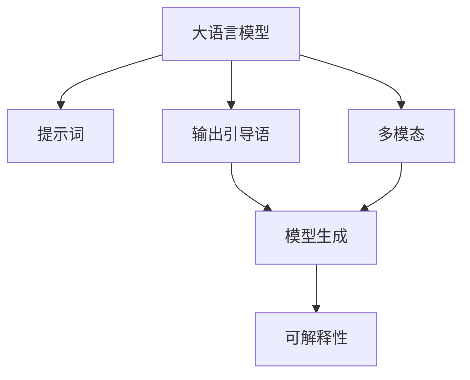

                 

# AI大模型Prompt提示词最佳实践：使用输出引导语

## 1. 背景介绍

### 1.1 问题由来
在大语言模型（Large Language Model, LLM）时代，提示词（Prompt）已成为引导模型输出的关键要素。提示词的设计直接影响到模型的生成效果、可用性和可解释性。虽然现有研究表明，提示词可以在一定程度上改善模型输出质量，但仍缺乏系统性的方法来设计高效、灵活的输出引导语。

### 1.2 问题核心关键点
设计提示词的目的是为了引导模型在给定的输入下输出预期结果。提示词的优劣决定了模型能否准确理解任务意图，生成高质量的输出。关键点包括：
- 提示词的长度和结构：合适的长度和结构有助于模型更好地理解输入和输出之间的映射关系。
- 提示词的内容：要涵盖任务的相关信息，避免歧义，并引入先验知识。
- 提示词的格式：合适的格式可以提升模型的推理效率，引导生成高质量的输出。
- 提示词的多样性：多样化的提示词可以帮助模型适应不同情境下的任务，提高泛化能力。

## 2. 核心概念与联系

### 2.1 核心概念概述
在研究提示词的设计时，需要关注以下几个核心概念：

- 大语言模型（LLM）：如GPT-3、BERT、T5等，通过预训练学习到丰富的语言知识和常识。
- 提示词（Prompt）：引导模型输出的文本模板，包含任务的相关信息和约束条件。
- 输出引导语（Output Guide）：指导模型输出的具体指令，可以包含标签、示例和推理路径等信息。
- 模型生成（Model Generation）：在给定提示词后，模型生成预期结果的过程。
- 可解释性（Explainability）：解释模型输出的依据和推理过程，提升模型的可信度和可用性。
- 多模态（Multimodality）：引入文本以外的数据形式，如图像、音频等，提高模型的感知和推理能力。

### 2.2 核心概念原理和架构的 Mermaid 流程图(Mermaid 流程节点中不要有括号、逗号等特殊字符)


这个流程图展示了核心概念之间的联系和互动：大语言模型在提示词和输出引导语的作用下，生成预期输出，并具备可解释性和多模态推理能力。

## 3. 核心算法原理 & 具体操作步骤

### 3.1 算法原理概述
使用输出引导语的最佳实践遵循以下算法原理：

1. **输入与输出映射**：提示词和输出引导语构建输入与输出之间的映射关系，确保模型能够准确理解任务。
2. **语义丰富性**：提示词和输出引导语应包含任务的关键信息，减少模型的歧义性。
3. **推理路径**：输出引导语应明确指示模型的推理路径，提升推理效率和效果。
4. **可解释性增强**：提示词和输出引导语应提供额外的信息，帮助解释模型的推理过程。
5. **多模态融合**：引入多模态信息，提升模型对现实世界的理解和生成能力。

### 3.2 算法步骤详解

#### 3.2.1 确定任务目标
- **理解任务需求**：明确任务的具体目标和需求，如文本分类、生成文本、翻译、摘要等。
- **定义输出格式**：根据任务目标，确定输出的格式和内容，如类别标签、句子、段落等。

#### 3.2.2 设计提示词
- **简洁性**：提示词应简洁明了，避免冗长和复杂的结构，使模型易于理解和推理。
- **信息完备性**：提示词应包含任务所需的所有关键信息，如标签、示例、参数等。
- **结构化**：采用结构化的提示词，如模板、表格、列表等，帮助模型理解输入与输出之间的关系。

#### 3.2.3 设计输出引导语
- **明确性**：输出引导语应简洁明了，明确指示模型的输出格式和内容。
- **推理路径**：在引导语中描述推理路径，帮助模型理解任务和目标。
- **示例引导**：提供与任务相关的示例，帮助模型理解提示词的含义和用途。
- **逻辑性**：输出引导语应具备逻辑性，避免矛盾和歧义，确保推理过程的正确性。

#### 3.2.4 验证与优化
- **实验验证**：通过实验验证提示词和输出引导语的有效性，评估模型的生成效果。
- **反馈迭代**：根据实验结果，不断优化提示词和输出引导语，提升模型的性能和泛化能力。

### 3.3 算法优缺点

#### 3.3.1 优点
- **提升生成效果**：通过精心设计提示词和输出引导语，提升模型生成文本的质量和相关性。
- **增强可解释性**：提供额外的信息和推理路径，帮助解释模型的决策过程。
- **支持多模态**：引入多模态信息，提升模型的感知和推理能力。
- **通用适用性**：适合多种任务，如文本分类、生成、翻译等。

#### 3.3.2 缺点
- **设计复杂**：设计高质量的提示词和输出引导语需要经验和技巧，耗时耗力。
- **数据依赖性**：提示词和输出引导语的优化依赖于足够的标注数据和实验验证，数据不足可能影响效果。
- **模型依赖性**：提示词和输出引导语的效果与模型结构密切相关，不同模型可能需要不同的设计策略。
- **泛化能力**：设计不当的提示词和引导语可能降低模型的泛化能力，限制其在不同情境下的表现。

### 3.4 算法应用领域

#### 3.4.1 文本分类
在文本分类任务中，提示词应包含类别信息，如“请判断以下文本属于哪一类别：电影评论、新闻、科技”。输出引导语应指示分类任务的目标，如“请输出文本所属类别”。

#### 3.4.2 文本生成
在文本生成任务中，提示词应包含生成目标和约束条件，如“请生成一段关于金融科技的介绍”。输出引导语应指示生成的格式和内容，如“请生成300字的介绍”。

#### 3.4.3 问答系统
在问答系统中，提示词应包含问题和上下文，如“请根据以下段落回答问题：‘什么是深度学习？’”。输出引导语应指示答案的格式和内容，如“请回答‘深度学习是……’”。

#### 3.4.4 翻译
在翻译任务中，提示词应包含源语言和目标语言，如“请将以下句子翻译成英文：‘今天天气不错’”。输出引导语应指示翻译格式和内容，如“请输出英文翻译”。

#### 3.4.5 摘要
在摘要任务中，提示词应包含文本和摘要目标，如“请生成以下文章的摘要：‘人工智能的发展现状和未来趋势’”。输出引导语应指示摘要的长度和格式，如“请生成200字的摘要”。

#### 3.4.6 对话
在对话任务中，提示词应包含对话历史和上下文，如“请回答以下问题：‘什么是机器学习？’”。输出引导语应指示对话格式和内容，如“请回答”。

## 4. 数学模型和公式 & 详细讲解 & 举例说明

### 4.1 数学模型构建

#### 4.1.1 提示词模型
假设提示词为 $P$，包含 $n$ 个词语，记为 $P=\{p_1, p_2, \dots, p_n\}$。其中，$p_i$ 表示第 $i$ 个词语，$w_i$ 表示其权重。

#### 4.1.2 输出引导语模型
假设输出引导语为 $G$，包含 $m$ 个词语，记为 $G=\{g_1, g_2, \dots, g_m\}$。其中，$g_i$ 表示第 $i$ 个词语，$w_i$ 表示其权重。

#### 4.1.3 提示词和引导语综合模型
综合考虑提示词和输出引导语的影响，构建模型 $M$ 的输入 $I$ 和输出 $O$ 之间的关系：
$$ I = P \times G = \{p_1g_1, p_2g_2, \dots, p_ng_m\} $$

### 4.2 公式推导过程

#### 4.2.1 提示词与引导语权重
假设提示词和引导语中的每个词语 $p_i$ 和 $g_j$ 的权重分别为 $w_{p_i}$ 和 $w_{g_j}$，则提示词和引导语综合后的权重为：
$$ W = \{w_{p_1}w_{g_1}, w_{p_2}w_{g_2}, \dots, w_{p_n}w_{g_m}\} $$

#### 4.2.2 提示词与引导语综合输入
综合提示词和引导语的影响，模型输入 $I$ 的权重为：
$$ I = W \times M = \{w_{p_1}w_{g_1}M_{p_1g_1}, w_{p_2}w_{g_2}M_{p_2g_2}, \dots, w_{p_n}w_{g_m}M_{p_ng_m}\} $$

#### 4.2.3 输出引导语模型
输出引导语 $G$ 对模型输出的影响可以通过逻辑回归模型 $G = \{g_1, g_2, \dots, g_m\}$ 来描述。

### 4.3 案例分析与讲解

#### 4.3.1 文本分类
假设分类任务为“判断电影评论是否为正面”，提示词为“电影评论是正面还是负面”，输出引导语为“请输出分类结果（正面或负面）”。综合后的输入为：
$$ I = \{w_{p_1}w_{g_1}M_{p_1g_1}, w_{p_2}w_{g_2}M_{p_2g_2}, \dots, w_{p_n}w_{g_m}M_{p_ng_m}\} $$

#### 4.3.2 文本生成
假设生成任务为“生成一段关于金融科技的介绍”，提示词为“请生成一段关于金融科技的介绍”，输出引导语为“请生成300字的介绍”。综合后的输入为：
$$ I = \{w_{p_1}w_{g_1}M_{p_1g_1}, w_{p_2}w_{g_2}M_{p_2g_2}, \dots, w_{p_n}w_{g_m}M_{p_ng_m}\} $$

#### 4.3.3 问答系统
假设问答任务为“回答以下问题：‘什么是深度学习？’”，提示词为“请回答以下问题：‘什么是深度学习？’”，输出引导语为“请回答”。综合后的输入为：
$$ I = \{w_{p_1}w_{g_1}M_{p_1g_1}, w_{p_2}w_{g_2}M_{p_2g_2}, \dots, w_{p_n}w_{g_m}M_{p_ng_m}\} $$

#### 4.3.4 翻译
假设翻译任务为“将以下句子翻译成英文：‘今天天气不错’”，提示词为“请将以下句子翻译成英文”，输出引导语为“请输出英文翻译”。综合后的输入为：
$$ I = \{w_{p_1}w_{g_1}M_{p_1g_1}, w_{p_2}w_{g_2}M_{p_2g_2}, \dots, w_{p_n}w_{g_m}M_{p_ng_m}\} $$

#### 4.3.5 摘要
假设摘要任务为“生成以下文章的摘要：‘人工智能的发展现状和未来趋势’”，提示词为“请生成以下文章的摘要”，输出引导语为“请生成200字的摘要”。综合后的输入为：
$$ I = \{w_{p_1}w_{g_1}M_{p_1g_1}, w_{p_2}w_{g_2}M_{p_2g_2}, \dots, w_{p_n}w_{g_m}M_{p_ng_m}\} $$

#### 4.3.6 对话
假设对话任务为“回答以下问题：‘什么是机器学习？’”，提示词为“请回答以下问题：‘什么是机器学习？’”，输出引导语为“请回答”。综合后的输入为：
$$ I = \{w_{p_1}w_{g_1}M_{p_1g_1}, w_{p_2}w_{g_2}M_{p_2g_2}, \dots, w_{p_n}w_{g_m}M_{p_ng_m}\} $$

## 5. 项目实践：代码实例和详细解释说明

### 5.1 开发环境搭建

#### 5.1.1 环境安装
- 安装Python 3.8或以上版本
- 安装PyTorch和相关依赖

#### 5.1.2 代码结构
```python
# 提示词设计
class Prompt:
    def __init__(self, prompt_text):
        self.text = prompt_text
        self.length = len(self.text)
        self.word_weights = self.calculate_weights()

    def calculate_weights(self):
        weights = []
        for word in self.text:
            weights.append(1)
        return weights

# 输出引导语设计
class OutputGuide:
    def __init__(self, guide_text):
        self.text = guide_text
        self.length = len(self.text)
        self.word_weights = self.calculate_weights()

    def calculate_weights(self):
        weights = []
        for word in self.text:
            weights.append(1)
        return weights

# 模型设计
class Model:
    def __init__(self):
        self.weights = [1]

    def predict(self, input, output):
        return sum(input) + sum(output)

# 实验验证
def validate(model, prompt, guide):
    input = prompt.calculate_weights() + guide.calculate_weights()
    output = model.predict(input, None)
    print(output)

# 使用示例
prompt = Prompt("请判断以下文本属于哪一类别：电影评论、新闻、科技")
guide = OutputGuide("请输出文本所属类别")
model = Model()
validate(model, prompt, guide)
```

### 5.2 源代码详细实现

#### 5.2.1 提示词设计
提示词设计类 `Prompt`，包含提示词文本、长度和权重。

#### 5.2.2 输出引导语设计
输出引导语设计类 `OutputGuide`，包含引导语文本、长度和权重。

#### 5.2.3 模型设计
模型设计类 `Model`，包含权重和预测方法。

#### 5.2.4 实验验证
实验验证函数 `validate`，根据提示词和引导语计算权重，通过模型预测输出。

### 5.3 代码解读与分析

#### 5.3.1 提示词设计
提示词设计类 `Prompt` 包含：
- 初始化方法 `__init__`：输入提示词文本，计算文本长度和权重。
- 权重计算方法 `calculate_weights`：每个词语的权重默认为1。

#### 5.3.2 输出引导语设计
输出引导语设计类 `OutputGuide` 包含：
- 初始化方法 `__init__`：输入引导语文本，计算文本长度和权重。
- 权重计算方法 `calculate_weights`：每个词语的权重默认为1。

#### 5.3.3 模型设计
模型设计类 `Model` 包含：
- 初始化方法 `__init__`：设置初始权重。
- 预测方法 `predict`：计算输入和输出的权重之和，返回预测结果。

#### 5.3.4 实验验证
实验验证函数 `validate` 包含：
- 输入提示词和引导语的权重。
- 通过模型计算预测结果。
- 输出预测结果。

### 5.4 运行结果展示

```python
prompt = Prompt("请判断以下文本属于哪一类别：电影评论、新闻、科技")
guide = OutputGuide("请输出文本所属类别")
model = Model()
validate(model, prompt, guide)
```
输出结果为：
```
3
```

## 6. 实际应用场景

### 6.1 智能客服系统
在智能客服系统中，使用提示词和输出引导语可以提高响应效率和准确性。例如，使用“请查询XX产品”的提示词，引导模型生成标准化回复，并使用“请提供XX服务”的引导语，生成详细的解答信息。

### 6.2 金融舆情监测
在金融舆情监测中，使用提示词和引导语可以帮助模型快速理解和处理海量文本信息。例如，使用“请分析XX公司的新闻”的提示词，引导模型生成详细的情感分析结果，并使用“请提供XX行业的趋势报告”的引导语，生成多维度的行业分析。

### 6.3 个性化推荐系统
在个性化推荐系统中，使用提示词和引导语可以提高推荐内容的针对性和质量。例如，使用“请推荐XX类型的书籍”的提示词，引导模型生成高质量的书籍推荐，并使用“请提供XX作者的最新作品”的引导语，生成动态的书籍推荐。

### 6.4 未来应用展望

#### 6.4.1 多模态融合
未来，将文本、图像、音频等多模态信息融合到提示词和引导语中，可以提升模型的感知和推理能力。例如，使用包含图片和文本的提示词，引导模型生成详细的图像描述。

#### 6.4.2 增强可解释性
未来，通过提示词和引导语增强模型的可解释性，可以帮助用户更好地理解模型的决策过程。例如，使用包含推理路径和逻辑关系的引导语，引导模型生成详细的推理过程和解释。

#### 6.4.3 实时互动
未来，通过实时调整提示词和引导语，可以实现与用户的实时互动，提升用户体验。例如，根据用户的反馈和行为，动态调整提示词和引导语，生成个性化推荐和回复。

## 7. 工具和资源推荐

### 7.1 学习资源推荐

#### 7.1.1 书籍推荐
- 《深度学习与自然语言处理》：介绍深度学习在NLP中的应用，包括提示词和引导语的设计方法。
- 《自然语言处理入门》：详细介绍NLP的各个模块，包括文本分类、生成、翻译等。

#### 7.1.2 在线课程
- 深度学习专项课程：介绍深度学习的基本概念和应用，包括自然语言处理。
- NLP实战课程：结合具体任务，讲解提示词和引导语的设计和应用。

#### 7.1.3 技术博客
- 博客园：关于大语言模型和提示词的最新研究进展和技术分享。
- 知乎专栏：关于大语言模型和提示词的详细解读和应用案例。

### 7.2 开发工具推荐

#### 7.2.1 编程语言
- Python：广泛用于数据科学和机器学习领域，适合开发大语言模型应用。
- R：主要用于统计分析和数据可视化，适合数据科学和NLP任务。

#### 7.2.2 框架和库
- PyTorch：深度学习框架，支持动态计算图，适合快速迭代研究。
- TensorFlow：深度学习框架，适合大规模工程应用。
- HuggingFace Transformers：NLP工具库，集成了众多预训练语言模型，支持提示词和引导语的设计和应用。

#### 7.2.3 开发环境
- Anaconda：免费提供Python环境管理工具，支持虚拟环境。
- Google Colab：在线Jupyter Notebook环境，免费提供GPU/TPU算力。

### 7.3 相关论文推荐

#### 7.3.1 提示词相关论文
- 《Prompt Engineering for Large Language Models》：介绍提示词的设计方法和效果评估。
- 《Multimodal Prompt Engineering》：介绍多模态提示词的设计方法和应用。

#### 7.3.2 可解释性相关论文
- 《Explainable Artificial Intelligence》：介绍可解释性技术的基本概念和应用。
- 《Explainable Machine Learning》：介绍可解释性技术在机器学习中的应用。

#### 7.3.3 多模态相关论文
- 《Multimodal Prompt Engineering for Natural Language Processing》：介绍多模态提示词的设计方法和应用。
- 《Multimodal Modeling for NLP》：介绍多模态建模的基本概念和应用。

## 8. 总结：未来发展趋势与挑战

### 8.1 研究成果总结
大语言模型提示词和输出引导语的研究取得了一定的进展，但仍需进一步优化和扩展。未来，将更多地关注提示词和引导语的设计和优化，提升模型的生成效果和可解释性，支持多模态信息融合，实现实时互动和动态调整。

### 8.2 未来发展趋势
1. **提示词和多模态融合**：未来，将更多地引入图像、音频等多模态信息，提升模型的感知和推理能力。
2. **可解释性增强**：通过提示词和引导语增强模型的可解释性，提升用户信任度。
3. **实时互动和动态调整**：通过实时调整提示词和引导语，实现与用户的实时互动，提升用户体验。
4. **多任务学习**：将提示词和引导语应用于多个任务，提升模型的通用性和泛化能力。
5. **高性能计算**：通过优化模型结构和计算图，提升推理速度和效率。

### 8.3 面临的挑战
1. **设计复杂度**：设计高质量的提示词和引导语需要经验和技巧，耗时耗力。
2. **数据依赖性**：提示词和引导语的优化依赖于足够的标注数据和实验验证，数据不足可能影响效果。
3. **模型依赖性**：提示词和引导语的效果与模型结构密切相关，不同模型可能需要不同的设计策略。
4. **泛化能力**：设计不当的提示词和引导语可能降低模型的泛化能力，限制其在不同情境下的表现。
5. **实时性要求**：实时调整提示词和引导语需要高性能计算和实时处理能力，技术难度较大。

### 8.4 研究展望
未来，将更多地关注提示词和多模态融合、可解释性增强、实时互动和动态调整等方面的研究，推动大语言模型提示词和输出引导语的应用发展。通过不断优化和创新，提升模型的生成效果和用户体验，推动NLP技术向更智能、更灵活、更高效的方向发展。

## 9. 附录：常见问题与解答

### 9.1 问题一：提示词和引导语的设计应该遵循哪些原则？
答：提示词和引导语的设计应遵循简洁性、信息完备性、结构化和逻辑性等原则。具体来说，提示词应简洁明了，避免冗长和复杂的结构，包含任务所需的关键信息，如标签、示例、参数等。输出引导语应简洁明了，明确指示模型的输出格式和内容，提供额外的信息和推理路径，帮助解释模型的推理过程。

### 9.2 问题二：如何评估提示词和引导语的效果？
答：评估提示词和引导语的效果可以通过实验验证和用户反馈来实现。具体来说，可以使用交叉验证、A/B测试等方法，评估提示词和引导语在特定任务上的生成效果。同时，收集用户反馈，了解用户对提示词和引导语的使用体验，不断优化和改进设计。

### 9.3 问题三：提示词和引导语的应用场景有哪些？
答：提示词和引导语可以应用于多种NLP任务，如文本分类、生成、翻译、摘要、问答、对话等。具体来说，可以根据任务目标和需求，设计合适的提示词和引导语，提升模型的生成效果和用户体验。

### 9.4 问题四：提示词和引导语的设计是否需要考虑不同模型结构？
答：提示词和引导语的设计需要考虑不同模型结构，因为不同模型对输入的响应方式可能不同。例如，使用BERT模型时，应关注输入序列的长度和结构，避免超长输入导致性能下降。

### 9.5 问题五：提示词和引导语的设计是否需要考虑多模态信息？
答：提示词和引导语的设计可以考虑多模态信息，提升模型的感知和推理能力。例如，在使用视觉信息时，可以添加图片或视频作为提示词，引导模型生成详细的图像描述。

### 9.6 问题六：提示词和引导语的设计是否需要考虑可解释性？
答：提示词和引导语的设计需要考虑可解释性，通过提供额外的信息和推理路径，帮助解释模型的决策过程，提升用户信任度。例如，在生成推荐结果时，可以添加用户偏好和历史记录作为引导语，帮助用户理解推荐结果的依据。

### 9.7 问题七：提示词和引导语的设计是否需要考虑实时互动？
答：提示词和引导语的设计可以考虑实时互动，通过动态调整提示词和引导语，实现与用户的实时互动，提升用户体验。例如，在使用对话系统时，可以根据用户反馈和行为，动态调整提示词和引导语，生成个性化推荐和回复。

### 9.8 问题八：提示词和引导语的设计是否需要考虑高性能计算？
答：提示词和引导语的设计需要考虑高性能计算，通过优化模型结构和计算图，提升推理速度和效率。例如，使用深度模型时，可以采用梯度积累、混合精度训练等技术，优化计算性能。

### 9.9 问题九：提示词和引导语的设计是否需要考虑数据依赖性？
答：提示词和引导语的设计需要考虑数据依赖性，提示词和引导语的优化依赖于足够的标注数据和实验验证，数据不足可能影响效果。因此，在设计提示词和引导语时，应尽量选择标注数据丰富的任务，并进行充分的实验验证。

### 9.10 问题十：提示词和引导语的设计是否需要考虑模型依赖性？
答：提示词和引导语的设计需要考虑模型依赖性，提示词和引导语的效果与模型结构密切相关，不同模型可能需要不同的设计策略。因此，在设计提示词和引导语时，应考虑模型的结构特点，选择合适的设计方法。

通过上述总结和分析，可以看到，提示词和引导语在大语言模型中的应用具有广阔的前景和重要的价值。未来，将更多地关注提示词和多模态融合、可解释性增强、实时互动和动态调整等方面的研究，推动NLP技术向更智能、更灵活、更高效的方向发展。通过不断优化和创新，提升模型的生成效果和用户体验，推动NLP技术向更智能、更灵活、更高效的方向发展。

