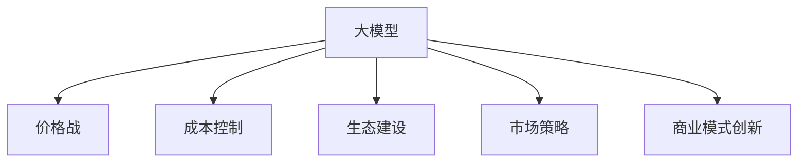

                 

# AI大模型创业：如何应对未来价格战？

## 1. 背景介绍

### 1.1 问题由来
随着人工智能(AI)技术的迅猛发展，大模型如BERT、GPT、ViT等迅速成为各大科技公司的标配。它们在图像识别、自然语言处理(NLP)、语音识别等领域大放异彩，推动了行业应用的发展。然而，这种技术热潮也催生了激烈的价格战，各大企业纷纷投入重金，抢占市场份额。

大模型创业面临的挑战不仅在于技术的突破，更在于如何在价格战中生存并保持竞争力。面对数据和算力成本的不断上升，如何构建可持续的商业模式，确保长期盈利，成为大模型创业公司必须应对的问题。

### 1.2 问题核心关键点
未来价格战中，大模型创业公司需要关注以下几个核心关键点：

1. **技术差异化**：构建与竞争对手不同的技术优势，通过持续技术创新，获得差异化竞争优势。
2. **成本控制**：降低成本，提高效率，确保在价格战中具备成本优势。
3. **生态建设**：建立强大的生态系统，形成用户粘性和市场壁垒，提升品牌价值。
4. **市场策略**：采用灵活的市场策略，精准定位细分市场，满足特定客户需求。
5. **商业模式创新**：探索新的商业模式，如订阅制、按需付费等，提高用户转化率和生命周期价值。

本文将围绕这些核心关键点，深入分析大模型创业公司在未来价格战中的应对策略。

## 2. 核心概念与联系

### 2.1 核心概念概述

为更好地理解大模型创业公司在未来价格战中的应对策略，本节将介绍几个密切相关的核心概念：

- **大模型(Big Models)**：指具有海量参数、高计算需求的AI模型，如BERT、GPT、ViT等。这些模型能够处理复杂的非结构化数据，进行深度学习。
- **价格战(Pricing War)**：指企业通过价格竞争来争夺市场份额的策略。在大模型市场中，价格战通常以大幅度的降价或免费开放模型为手段。
- **成本控制(Cost Control)**：指在产品研发和运营过程中，对各项成本进行严格控制，以确保盈利性。
- **生态建设(Ecosystem Building)**：指构建一个包含模型、工具、社区、用户等多个要素的生态系统，增强用户粘性和品牌忠诚度。
- **市场策略(Market Strategy)**：指企业在市场中采取的具体策略，如市场定位、销售渠道、定价策略等。
- **商业模式创新(Commercial Model Innovation)**：指企业通过创新商业模式，提升市场竞争力，实现可持续增长。

这些核心概念之间的逻辑关系可以通过以下Mermaid流程图来展示：



这个流程图展示了大模型创业公司需要关注的几个关键环节，以及它们之间的相互作用关系。

## 3. 核心算法原理 & 具体操作步骤

### 3.1 算法原理概述

大模型创业公司在面对未来价格战时，需要构建差异化的技术优势。这通常涉及以下几个步骤：

1. **算法研发**：构建具有特定优势的算法模型，如处理特定领域的图像、文本或语音数据。
2. **技术优化**：通过算法优化、模型压缩等技术手段，降低模型计算成本和存储需求。
3. **数据优化**：采用更高效的数据处理和存储方案，如分布式存储、GPU加速等，降低数据成本。

### 3.2 算法步骤详解

以下是大模型创业公司构建差异化技术优势的具体操作步骤：

**Step 1: 算法研发**

- **确定应用场景**：选择合适的应用场景，如医疗影像分析、金融风险评估、自动驾驶等。
- **算法选择与设计**：根据应用场景需求，选择合适的算法模型，如卷积神经网络(CNN)、循环神经网络(RNN)、Transformer等。
- **模型训练**：使用大规模数据集对模型进行训练，确保模型性能达到预期。

**Step 2: 技术优化**

- **模型压缩**：采用模型压缩技术，如知识蒸馏、剪枝、量化等，降低模型参数量和计算复杂度。
- **分布式训练**：使用分布式训练框架，如Horovod、TensorFlow分布式等，提高训练效率。
- **GPU加速**：利用GPU硬件加速，降低训练和推理时间。

**Step 3: 数据优化**

- **数据预处理**：采用高效的预处理技术，如数据分块、数据增强、数据采样等，提高数据处理效率。
- **分布式存储**：使用分布式存储系统，如Hadoop、Ceph等，降低数据存储成本。
- **数据压缩**：采用数据压缩技术，如LZO、Gzip等，降低数据存储和传输成本。

### 3.3 算法优缺点

大模型创业公司构建差异化技术优势的方法有以下优缺点：

**优点**：
1. **竞争力提升**：通过技术优势，可以获得更高的市场份额和更高的用户认可度。
2. **成本降低**：通过技术优化和数据优化，可以大幅降低计算和存储成本，提高盈利能力。
3. **生态系统增强**：构建差异化技术优势，可以吸引更多的开发者和用户，增强生态系统。

**缺点**：
1. **研发成本高**：构建差异化技术优势需要大量的研发投入。
2. **市场风险**：技术优势容易被竞争对手模仿或超越，导致市场竞争加剧。
3. **人才需求大**：需要具备高水平的技术人才，对人才储备和培养提出了更高的要求。

### 3.4 算法应用领域

构建差异化技术优势的方法在多个领域都有应用，例如：

- **医疗影像分析**：使用大模型进行影像分类、病灶检测、诊断辅助等，通过算法优化和数据优化，降低计算成本，提高诊断精度。
- **金融风险评估**：利用大模型进行信用评估、欺诈检测、交易分析等，通过技术优化和数据优化，降低计算成本，提高风险控制能力。
- **自动驾驶**：使用大模型进行目标检测、路径规划、行为预测等，通过算法优化和数据优化，降低计算成本，提高驾驶安全性和智能性。

这些领域的大模型应用，展示了差异化技术优势在提高产品性能和降低成本方面的巨大潜力。

## 4. 数学模型和公式 & 详细讲解 & 举例说明

### 4.1 数学模型构建

本节将使用数学语言对构建差异化技术优势的过程进行更加严格的刻画。

设大模型为 $M$，输入为 $X$，输出为 $Y$。假设模型的损失函数为 $L(M(X), Y)$。构建差异化技术优势的目标是最小化损失函数，即：

$$
\min_{M} L(M(X), Y)
$$

模型训练的目标是优化模型参数 $\theta$，使得模型输出 $M(X; \theta)$ 与真实标签 $Y$ 的误差最小化。具体而言，模型训练分为以下几个步骤：

1. **数据准备**：准备训练数据集 $D$，划分为训练集、验证集和测试集。
2. **模型初始化**：选择预训练模型或自定义模型，并进行初始化。
3. **前向传播**：将训练数据 $X$ 输入模型 $M$，计算模型输出 $M(X; \theta)$。
4. **计算损失**：根据模型输出和真实标签，计算损失函数 $L(M(X; \theta), Y)$。
5. **反向传播**：计算损失函数对模型参数的梯度，进行反向传播，更新模型参数 $\theta$。
6. **优化器更新**：使用优化器（如SGD、Adam等）更新模型参数，确保最小化损失函数。

### 4.2 公式推导过程

以图像分类任务为例，推导最小化交叉熵损失的过程。

假设模型 $M$ 在输入图像 $X$ 上的输出为 $Z = M(X; \theta) \in [0,1]^C$，表示类别 $c$ 的概率。真实标签 $Y \in \{0,1\}^C$。则交叉熵损失函数定义为：

$$
L(M(X; \theta), Y) = -\frac{1}{N} \sum_{i=1}^N \sum_{c=1}^C [y_i^c \log M_i^c + (1-y_i^c) \log (1-M_i^c)]
$$

其中 $N$ 为样本数量，$y_i^c$ 表示样本 $i$ 是否属于类别 $c$。

通过链式法则，计算损失函数对模型参数 $\theta_k$ 的梯度为：

$$
\frac{\partial L(M(X; \theta), Y)}{\partial \theta_k} = -\frac{1}{N}\sum_{i=1}^N \sum_{c=1}^C [(y_i^c - M_i^c) \frac{\partial M_i^c}{\partial \theta_k}]
$$

其中 $\frac{\partial M_i^c}{\partial \theta_k}$ 可通过自动微分技术高效计算。

通过以上公式，可以系统地进行模型训练和优化，构建差异化技术优势。

### 4.3 案例分析与讲解

**案例：医疗影像分类**

假设要构建一个用于医学影像分类的模型，具体步骤如下：

1. **数据准备**：收集大规模的医学影像数据集，标注为癌症、非癌症两类。将数据集划分为训练集、验证集和测试集。
2. **模型初始化**：选择预训练的Transformer模型，并进行初始化。
3. **前向传播**：将影像数据输入模型，计算类别概率。
4. **计算损失**：计算交叉熵损失。
5. **反向传播**：计算损失函数对模型参数的梯度，进行反向传播，更新模型参数。
6. **优化器更新**：使用Adam优化器更新模型参数，确保最小化交叉熵损失。
7. **模型评估**：在验证集和测试集上评估模型性能，确保模型泛化能力。

通过上述步骤，可以构建一个具有高精度和低计算成本的医疗影像分类模型。

## 5. 项目实践：代码实例和详细解释说明

### 5.1 开发环境搭建

在进行大模型创业实践前，我们需要准备好开发环境。以下是使用Python进行PyTorch开发的环境配置流程：

1. 安装Anaconda：从官网下载并安装Anaconda，用于创建独立的Python环境。
2. 创建并激活虚拟环境：
```bash
conda create -n pytorch-env python=3.8 
conda activate pytorch-env
```
3. 安装PyTorch：根据CUDA版本，从官网获取对应的安装命令。例如：
```bash
conda install pytorch torchvision torchaudio cudatoolkit=11.1 -c pytorch -c conda-forge
```
4. 安装Transformers库：
```bash
pip install transformers
```
5. 安装各类工具包：
```bash
pip install numpy pandas scikit-learn matplotlib tqdm jupyter notebook ipython
```

完成上述步骤后，即可在`pytorch-env`环境中开始创业实践。

### 5.2 源代码详细实现

这里我们以构建医疗影像分类模型为例，给出使用Transformers库对预训练模型进行微调的PyTorch代码实现。

首先，定义模型和优化器：

```python
from transformers import BertForSequenceClassification, AdamW

model = BertForSequenceClassification.from_pretrained('bert-base-cased', num_labels=2)
optimizer = AdamW(model.parameters(), lr=2e-5)
```

然后，定义训练和评估函数：

```python
from torch.utils.data import DataLoader
from tqdm import tqdm
from sklearn.metrics import classification_report

device = torch.device('cuda') if torch.cuda.is_available() else torch.device('cpu')
model.to(device)

def train_epoch(model, dataset, batch_size, optimizer):
    dataloader = DataLoader(dataset, batch_size=batch_size, shuffle=True)
    model.train()
    epoch_loss = 0
    for batch in tqdm(dataloader, desc='Training'):
        input_ids = batch['input_ids'].to(device)
        attention_mask = batch['attention_mask'].to(device)
        labels = batch['labels'].to(device)
        model.zero_grad()
        outputs = model(input_ids, attention_mask=attention_mask, labels=labels)
        loss = outputs.loss
        epoch_loss += loss.item()
        loss.backward()
        optimizer.step()
    return epoch_loss / len(dataloader)

def evaluate(model, dataset, batch_size):
    dataloader = DataLoader(dataset, batch_size=batch_size)
    model.eval()
    preds, labels = [], []
    with torch.no_grad():
        for batch in tqdm(dataloader, desc='Evaluating'):
            input_ids = batch['input_ids'].to(device)
            attention_mask = batch['attention_mask'].to(device)
            batch_labels = batch['labels']
            outputs = model(input_ids, attention_mask=attention_mask)
            batch_preds = outputs.logits.argmax(dim=2).to('cpu').tolist()
            batch_labels = batch_labels.to('cpu').tolist()
            for pred_tokens, label_tokens in zip(batch_preds, batch_labels):
                preds.append(pred_tokens[:len(label_tokens)])
                labels.append(label_tokens)
                
    print(classification_report(labels, preds))
```

最后，启动训练流程并在测试集上评估：

```python
epochs = 5
batch_size = 16

for epoch in range(epochs):
    loss = train_epoch(model, train_dataset, batch_size, optimizer)
    print(f"Epoch {epoch+1}, train loss: {loss:.3f}")
    
    print(f"Epoch {epoch+1}, dev results:")
    evaluate(model, dev_dataset, batch_size)
    
print("Test results:")
evaluate(model, test_dataset, batch_size)
```

以上就是使用PyTorch对预训练模型进行医疗影像分类模型微调的完整代码实现。可以看到，得益于Transformers库的强大封装，我们可以用相对简洁的代码完成模型的训练和评估。

### 5.3 代码解读与分析

让我们再详细解读一下关键代码的实现细节：

**BertForSequenceClassification类**：
- `__init__`方法：初始化模型，传入预训练模型路径和标签数量。
- `from_pretrained`方法：从预训练模型库中加载指定模型的实例。

**train_epoch函数**：
- 使用DataLoader对数据集进行批次化加载，供模型训练和推理使用。
- 每个epoch内，先在训练集上训练，输出平均loss。
- 在验证集上评估，输出分类指标。
- 所有epoch结束后，在测试集上评估，给出最终测试结果。

**evaluate函数**：
- 与训练类似，不同点在于不更新模型参数。
- 在每个batch结束后，将预测和标签结果存储下来。
- 使用sklearn的classification_report对整个评估集的预测结果进行打印输出。

**训练流程**：
- 定义总的epoch数和batch size，开始循环迭代。
- 每个epoch内，先在训练集上训练，输出平均loss。
- 在验证集上评估，输出分类指标。
- 所有epoch结束后，在测试集上评估，给出最终测试结果。

可以看到，PyTorch配合Transformers库使得模型微调的代码实现变得简洁高效。开发者可以将更多精力放在数据处理、模型改进等高层逻辑上，而不必过多关注底层的实现细节。

当然，工业级的系统实现还需考虑更多因素，如模型的保存和部署、超参数的自动搜索、更灵活的任务适配层等。但核心的微调范式基本与此类似。

## 6. 实际应用场景

### 6.1 智能客服系统

基于大模型微调的对话技术，可以广泛应用于智能客服系统的构建。传统客服往往需要配备大量人力，高峰期响应缓慢，且一致性和专业性难以保证。而使用微调后的对话模型，可以7x24小时不间断服务，快速响应客户咨询，用自然流畅的语言解答各类常见问题。

在技术实现上，可以收集企业内部的历史客服对话记录，将问题和最佳答复构建成监督数据，在此基础上对预训练对话模型进行微调。微调后的对话模型能够自动理解用户意图，匹配最合适的答案模板进行回复。对于客户提出的新问题，还可以接入检索系统实时搜索相关内容，动态组织生成回答。如此构建的智能客服系统，能大幅提升客户咨询体验和问题解决效率。

### 6.2 金融舆情监测

金融机构需要实时监测市场舆论动向，以便及时应对负面信息传播，规避金融风险。传统的人工监测方式成本高、效率低，难以应对网络时代海量信息爆发的挑战。基于大语言模型微调的文本分类和情感分析技术，为金融舆情监测提供了新的解决方案。

具体而言，可以收集金融领域相关的新闻、报道、评论等文本数据，并对其进行主题标注和情感标注。在此基础上对预训练语言模型进行微调，使其能够自动判断文本属于何种主题，情感倾向是正面、中性还是负面。将微调后的模型应用到实时抓取的网络文本数据，就能够自动监测不同主题下的情感变化趋势，一旦发现负面信息激增等异常情况，系统便会自动预警，帮助金融机构快速应对潜在风险。

### 6.3 个性化推荐系统

当前的推荐系统往往只依赖用户的历史行为数据进行物品推荐，无法深入理解用户的真实兴趣偏好。基于大语言模型微调技术，个性化推荐系统可以更好地挖掘用户行为背后的语义信息，从而提供更精准、多样的推荐内容。

在实践中，可以收集用户浏览、点击、评论、分享等行为数据，提取和用户交互的物品标题、描述、标签等文本内容。将文本内容作为模型输入，用户的后续行为（如是否点击、购买等）作为监督信号，在此基础上微调预训练语言模型。微调后的模型能够从文本内容中准确把握用户的兴趣点。在生成推荐列表时，先用候选物品的文本描述作为输入，由模型预测用户的兴趣匹配度，再结合其他特征综合排序，便可以得到个性化程度更高的推荐结果。

### 6.4 未来应用展望

随着大语言模型和微调方法的不断发展，基于微调范式将在更多领域得到应用，为传统行业带来变革性影响。

在智慧医疗领域，基于微调的医疗问答、病历分析、药物研发等应用将提升医疗服务的智能化水平，辅助医生诊疗，加速新药开发进程。

在智能教育领域，微调技术可应用于作业批改、学情分析、知识推荐等方面，因材施教，促进教育公平，提高教学质量。

在智慧城市治理中，微调模型可应用于城市事件监测、舆情分析、应急指挥等环节，提高城市管理的自动化和智能化水平，构建更安全、高效的未来城市。

此外，在企业生产、社会治理、文娱传媒等众多领域，基于大模型微调的人工智能应用也将不断涌现，为NLP技术带来全新的突破。相信随着预训练模型和微调方法的不断进步，NLP技术将在更广阔的应用领域大放异彩。

## 7. 工具和资源推荐

### 7.1 学习资源推荐

为了帮助开发者系统掌握大模型微调的理论基础和实践技巧，这里推荐一些优质的学习资源：

1. 《Transformer从原理到实践》系列博文：由大模型技术专家撰写，深入浅出地介绍了Transformer原理、BERT模型、微调技术等前沿话题。

2. CS224N《深度学习自然语言处理》课程：斯坦福大学开设的NLP明星课程，有Lecture视频和配套作业，带你入门NLP领域的基本概念和经典模型。

3. 《Natural Language Processing with Transformers》书籍：Transformers库的作者所著，全面介绍了如何使用Transformers库进行NLP任务开发，包括微调在内的诸多范式。

4. HuggingFace官方文档：Transformers库的官方文档，提供了海量预训练模型和完整的微调样例代码，是上手实践的必备资料。

5. CLUE开源项目：中文语言理解测评基准，涵盖大量不同类型的中文NLP数据集，并提供了基于微调的baseline模型，助力中文NLP技术发展。

通过对这些资源的学习实践，相信你一定能够快速掌握大语言模型微调的精髓，并用于解决实际的NLP问题。

### 7.2 开发工具推荐

高效的开发离不开优秀的工具支持。以下是几款用于大模型微调开发的常用工具：

1. PyTorch：基于Python的开源深度学习框架，灵活动态的计算图，适合快速迭代研究。大部分预训练语言模型都有PyTorch版本的实现。

2. TensorFlow：由Google主导开发的开源深度学习框架，生产部署方便，适合大规模工程应用。同样有丰富的预训练语言模型资源。

3. Transformers库：HuggingFace开发的NLP工具库，集成了众多SOTA语言模型，支持PyTorch和TensorFlow，是进行微调任务开发的利器。

4. Weights & Biases：模型训练的实验跟踪工具，可以记录和可视化模型训练过程中的各项指标，方便对比和调优。与主流深度学习框架无缝集成。

5. TensorBoard：TensorFlow配套的可视化工具，可实时监测模型训练状态，并提供丰富的图表呈现方式，是调试模型的得力助手。

6. Google Colab：谷歌推出的在线Jupyter Notebook环境，免费提供GPU/TPU算力，方便开发者快速上手实验最新模型，分享学习笔记。

合理利用这些工具，可以显著提升大模型微调任务的开发效率，加快创新迭代的步伐。

### 7.3 相关论文推荐

大语言模型和微调技术的发展源于学界的持续研究。以下是几篇奠基性的相关论文，推荐阅读：

1. Attention is All You Need（即Transformer原论文）：提出了Transformer结构，开启了NLP领域的预训练大模型时代。

2. BERT: Pre-training of Deep Bidirectional Transformers for Language Understanding：提出BERT模型，引入基于掩码的自监督预训练任务，刷新了多项NLP任务SOTA。

3. Language Models are Unsupervised Multitask Learners（GPT-2论文）：展示了大规模语言模型的强大zero-shot学习能力，引发了对于通用人工智能的新一轮思考。

4. Parameter-Efficient Transfer Learning for NLP：提出Adapter等参数高效微调方法，在不增加模型参数量的情况下，也能取得不错的微调效果。

5. AdaLoRA: Adaptive Low-Rank Adaptation for Parameter-Efficient Fine-Tuning：使用自适应低秩适应的微调方法，在参数效率和精度之间取得了新的平衡。

6. Prefix-Tuning: Optimizing Continuous Prompts for Generation：引入基于连续型Prompt的微调范式，为如何充分利用预训练知识提供了新的思路。

这些论文代表了大语言模型微调技术的发展脉络。通过学习这些前沿成果，可以帮助研究者把握学科前进方向，激发更多的创新灵感。

## 8. 总结：未来发展趋势与挑战

### 8.1 总结

本文对大模型创业公司在未来价格战中的应对策略进行了全面系统的介绍。首先阐述了价格战对大模型创业公司的挑战，明确了技术差异化、成本控制、生态建设、市场策略、商业模式创新等核心关键点。其次，从原理到实践，详细讲解了构建差异化技术优势的数学模型和操作步骤，给出了微调任务开发的完整代码实例。同时，本文还广泛探讨了微调方法在智能客服、金融舆情、个性化推荐等多个行业领域的应用前景，展示了微调范式的巨大潜力。此外，本文精选了微调技术的各类学习资源，力求为读者提供全方位的技术指引。

通过本文的系统梳理，可以看到，大模型微调技术在大模型创业中的应用前景广阔，但如何在价格战中生存并保持竞争力，还需要企业在多个环节进行全面优化。只有不断创新，才能在激烈的市场竞争中立于不败之地。

### 8.2 未来发展趋势

展望未来，大模型微调技术将呈现以下几个发展趋势：

1. **技术突破加速**：未来，随着算力、数据和理论的不断进步，预训练模型和微调方法的性能将进一步提升。超大模型的出现和高效微调算法的开发，将进一步降低微调成本，提高模型性能。

2. **应用场景拓展**：微调技术将在更多垂直领域得到应用，如智慧农业、智能制造、智慧物流等，助力传统行业数字化转型。

3. **生态系统完善**：随着微调模型的大量部署，将形成丰富的应用生态系统，开发者、用户、服务提供商等多元主体将共同推动技术进步和应用落地。

4. **商业模型多样化**：除了传统的订阅制、按需付费外，新的商业模式如按用付费、按效果付费等将不断涌现，提升用户体验和商业价值。

5. **治理机制完善**：随着模型应用的普及，如何保障模型公平性、透明性和安全性，将是未来技术发展的重要方向。

以上趋势凸显了大模型微调技术的广阔前景。这些方向的探索发展，必将进一步提升NLP系统的性能和应用范围，为人类认知智能的进化带来深远影响。

### 8.3 面临的挑战

尽管大模型微调技术已经取得了瞩目成就，但在迈向更加智能化、普适化应用的过程中，它仍面临着诸多挑战：

1. **算力资源瓶颈**：随着模型规模的增大，计算资源需求不断提升。如何高效利用算力，降低成本，是未来技术发展的重要课题。

2. **数据质量问题**：尽管微调技术对标注数据的需求降低，但数据的偏见和噪声仍可能影响模型性能。如何构建高质量的数据集，提升数据处理效率，将是未来的研究方向。

3. **模型复杂性增加**：超大模型的构建和微调，增加了模型的复杂性，导致模型的部署和维护成本上升。如何降低模型复杂性，提高模型效率，将是重要的优化方向。

4. **隐私和安全性问题**：微调模型涉及用户数据和隐私，如何在保障隐私的前提下进行高效微调，将是未来技术发展的重要方向。

5. **法律法规风险**：随着微调模型的普及，如何遵守相关法律法规，避免侵权和不当使用，将是未来技术发展的重要课题。

6. **知识表示困难**：模型难以充分理解复杂的知识表示和推理，如何构建更加灵活的知识表示机制，提升模型泛化能力，将是未来技术发展的重要方向。

这些挑战凸显了大模型微调技术的应用复杂性和发展难度。只有在技术、应用、治理等多个层面进行全面优化，才能真正实现人工智能技术在垂直行业的规模化落地。

### 8.4 研究展望

面对大模型微调技术面临的挑战，未来的研究需要在以下几个方面寻求新的突破：

1. **知识增强**：将符号化的先验知识与神经网络模型进行融合，构建更加灵活和高效的知识表示机制。

2. **自监督学习**：探索更加高效的无监督和半监督学习范式，最大化利用非结构化数据，提升模型的泛化能力和鲁棒性。

3. **元学习**：研究元学习技术，提升模型的泛化能力和迁移学习能力，降低对标注数据的依赖。

4. **深度强化学习**：结合深度强化学习技术，提升模型的自主学习能力和决策能力。

5. **联邦学习**：探索联邦学习技术，在保障数据隐私和安全的前提下，提升模型的训练效果和泛化能力。

6. **可解释性提升**：研究可解释性技术，提升模型的透明性和可解释性，增强用户信任和接受度。

这些研究方向的探索，必将引领大语言模型微调技术迈向更高的台阶，为构建安全、可靠、可解释、可控的智能系统铺平道路。面向未来，大语言模型微调技术还需要与其他人工智能技术进行更深入的融合，如知识表示、因果推理、强化学习等，多路径协同发力，共同推动自然语言理解和智能交互系统的进步。只有勇于创新、敢于突破，才能不断拓展语言模型的边界，让智能技术更好地造福人类社会。

## 9. 附录：常见问题与解答

**Q1：大模型微调是否适用于所有NLP任务？**

A: 大模型微调在大多数NLP任务上都能取得不错的效果，特别是对于数据量较小的任务。但对于一些特定领域的任务，如医学、法律等，仅仅依靠通用语料预训练的模型可能难以很好地适应。此时需要在特定领域语料上进一步预训练，再进行微调，才能获得理想效果。此外，对于一些需要时效性、个性化很强的任务，如对话、推荐等，微调方法也需要针对性的改进优化。

**Q2：微调过程中如何选择合适的学习率？**

A: 微调的学习率一般要比预训练时小1-2个数量级，如果使用过大的学习率，容易破坏预训练权重，导致过拟合。一般建议从1e-5开始调参，逐步减小学习率，直至收敛。也可以使用warmup策略，在开始阶段使用较小的学习率，再逐渐过渡到预设值。需要注意的是，不同的优化器(如AdamW、Adafactor等)以及不同的学习率调度策略，可能需要设置不同的学习率阈值。

**Q3：采用大模型微调时会面临哪些资源瓶颈？**

A: 目前主流的预训练大模型动辄以亿计的参数规模，对算力、内存、存储都提出了很高的要求。GPU/TPU等高性能设备是必不可少的，但即便如此，超大批次的训练和推理也可能遇到显存不足的问题。因此需要采用一些资源优化技术，如梯度积累、混合精度训练、模型并行等，来突破硬件瓶颈。同时，模型的存储和读取也可能占用大量时间和空间，需要采用模型压缩、稀疏化存储等方法进行优化。

**Q4：如何缓解微调过程中的过拟合问题？**

A: 过拟合是微调面临的主要挑战，尤其是在标注数据不足的情况下。常见的缓解策略包括：
1. 数据增强：通过回译、近义替换等方式扩充训练集
2. 正则化：使用L2正则、Dropout、Early Stopping等避免过拟合
3. 对抗训练：引入对抗样本，提高模型鲁棒性
4. 参数高效微调：只调整少量参数(如Adapter、Prefix等)，减小过拟合风险
5. 多模型集成：训练多个微调模型，取平均输出，抑制过拟合

这些策略往往需要根据具体任务和数据特点进行灵活组合。只有在数据、模型、训练、推理等各环节进行全面优化，才能最大限度地发挥大模型微调的威力。

**Q5：微调模型在落地部署时需要注意哪些问题？**

A: 将微调模型转化为实际应用，还需要考虑以下因素：
1. 模型裁剪：去除不必要的层和参数，减小模型尺寸，加快推理速度
2. 量化加速：将浮点模型转为定点模型，压缩存储空间，提高计算效率
3. 服务化封装：将模型封装为标准化服务接口，便于集成调用
4. 弹性伸缩：根据请求流量动态调整资源配置，平衡服务质量和成本
5. 监控告警：实时采集系统指标，设置异常告警阈值，确保服务稳定性
6. 安全防护：采用访问鉴权、数据脱敏等措施，保障数据和模型安全

大模型微调为NLP应用开启了广阔的想象空间，但如何将强大的性能转化为稳定、高效、安全的业务价值，还需要工程实践的不断打磨。唯有从数据、算法、工程、业务等多个维度协同发力，才能真正实现人工智能技术在垂直行业的规模化落地。总之，微调需要开发者根据具体任务，不断迭代和优化模型、数据和算法，方能得到理想的效果。

---

作者：禅与计算机程序设计艺术 / Zen and the Art of Computer Programming

