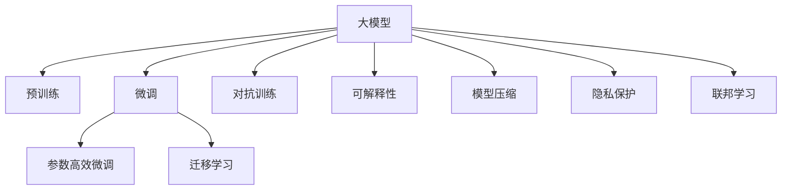

                 

## 1. 背景介绍

### 1.1 问题由来
近年来，人工智能（AI）技术飞速发展，特别是深度学习和大规模预训练模型在自然语言处理（NLP）、计算机视觉（CV）、语音识别等领域取得了显著进展。基于预训练模型的AI大模型已经在诸多领域展示了强大的应用潜力，成为创业公司打造技术壁垒、构建核心竞争力的重要手段。

但随着大模型的商业化进程加快，如何高效构建、应用和维护这些模型，确保其技术领先性、安全性和可靠性，成为AI大模型创业公司面临的重要挑战。大模型虽然功能强大，但同时也带来了计算成本高、模型训练时间长、易受攻击等诸多挑战。

### 1.2 问题核心关键点
为有效应对这些挑战，AI大模型创业公司需要在算法、架构、管理等方面进行全面创新和优化。关键问题点包括：

- **模型性能**：如何提升大模型的预测准确性、泛化能力和实时性。
- **训练效率**：如何优化模型训练流程，减少计算时间和成本。
- **模型安全性**：如何防范模型的攻击和滥用，确保模型使用的合规性和安全性。
- **部署灵活性**：如何在多样化的环境中高效部署模型，实现快速迭代和升级。

## 2. 核心概念与联系

### 2.1 核心概念概述

为更好地理解大模型创业的技术挑战，本节将介绍几个密切相关的核心概念：

- **大模型（Large Model）**：指通过大规模数据和计算资源训练得到的，参数量达数亿甚至数十亿的深度学习模型。这些模型在处理大规模数据集和复杂任务时表现出色。

- **预训练（Pre-training）**：指在大规模无标签数据上对模型进行训练，使其学习通用的语言或视觉表示。常见的预训练方法包括自监督学习、无监督学习等。

- **微调（Fine-tuning）**：在预训练模型基础上，针对特定任务使用少量有标签数据进行有监督学习，优化模型在该任务上的性能。

- **迁移学习（Transfer Learning）**：指将一个任务学到的知识迁移到另一个相似任务中，以减少在新任务上的学习成本。

- **参数高效微调（Parameter-Efficient Fine-Tuning, PEFT）**：在微调过程中只更新部分模型参数，保留预训练的权重，以减少计算资源消耗。

- **对抗训练（Adversarial Training）**：通过对抗样本增强模型鲁棒性，使其能更好地抵抗恶意攻击。

- **可解释性（Explainability）**：指模型的决策过程透明、可解释，有助于开发者理解和信任模型的输出。

- **模型压缩（Model Compression）**：通过剪枝、量化等方法减少模型体积，提高推理速度和存储效率。

- **隐私保护（Privacy Protection）**：指在模型训练和部署过程中保护用户隐私，防止数据泄露和滥用。

- **联邦学习（Federated Learning）**：指在分布式环境中，各节点分别对本地数据进行训练，再通过聚合模型参数进行全局模型更新。

这些概念构成了大模型创业的技术基础，帮助企业应对复杂的市场和技术挑战。

### 2.2 核心概念原理和架构的 Mermaid 流程图(Mermaid 流程节点中不要有括号、逗号等特殊字符)



这个流程图展示了各概念之间的联系和应用场景：

1. 大模型通过预训练学习通用知识。
2. 在特定任务上，通过微调优化模型性能。
3. 利用迁移学习，在新任务上快速获取知识。
4. 通过参数高效微调，减少计算资源消耗。
5. 通过对抗训练增强模型鲁棒性。
6. 通过可解释性提高模型透明度。
7. 通过模型压缩提高推理效率和存储效率。
8. 通过隐私保护确保数据安全。
9. 通过联邦学习实现分布式训练。

这些概念共同构成了大模型创业的技术框架，帮助企业构建强大的AI模型，应对未来的技术挑战。

## 3. 核心算法原理 & 具体操作步骤
### 3.1 算法原理概述

大模型创业的核心在于高效构建和应用大模型，解决特定的业务问题。基于大模型的创业公司需要关注以下几个关键算法原理：

- **预训练算法**：如Transformer、BERT等，这些算法通过自监督学习在大规模数据上训练模型，学习通用的语言或视觉表示。

- **微调算法**：包括全参数微调和参数高效微调（PEFT），在特定任务上使用少量有标签数据进行有监督学习，优化模型在该任务上的性能。

- **迁移学习算法**：通过将一个领域学到的知识迁移到另一个领域，减少在新任务上的学习成本。

- **对抗训练算法**：通过对抗样本增强模型的鲁棒性，防止模型被恶意攻击。

- **模型压缩算法**：通过剪枝、量化等方法减少模型体积，提高推理速度和存储效率。

- **隐私保护算法**：通过数据匿名化、差分隐私等方法保护用户隐私，防止数据泄露和滥用。

- **联邦学习算法**：在分布式环境中，通过各节点本地训练模型，再通过聚合模型参数进行全局模型更新。

### 3.2 算法步骤详解

基于大模型的创业公司需要进行以下核心步骤：

**Step 1: 数据准备和预处理**
- 收集并预处理大规模数据集，进行数据清洗、标注等预处理。
- 使用自监督学习方法在大规模数据上训练预训练模型。

**Step 2: 模型选择和微调**
- 选择适合的预训练模型，如BERT、GPT-3等。
- 在特定任务上使用少量有标签数据进行微调，优化模型在该任务上的性能。
- 考虑参数高效微调，减少计算资源消耗。

**Step 3: 对抗训练和模型鲁棒性提升**
- 生成对抗样本，进行对抗训练，增强模型鲁棒性。
- 设计模型鲁棒性测试，评估模型的抗干扰能力。

**Step 4: 模型压缩和优化**
- 使用模型压缩技术，如剪枝、量化、蒸馏等，减少模型体积和计算资源消耗。
- 优化模型结构，提升推理速度和存储效率。

**Step 5: 隐私保护和合规性**
- 使用隐私保护技术，如数据匿名化、差分隐私等，保护用户隐私。
- 确保模型使用的合规性，避免法律风险。

**Step 6: 联邦学习和分布式训练**
- 在分布式环境中，使用联邦学习技术，通过各节点本地训练模型，再聚合模型参数进行全局模型更新。
- 优化分布式训练算法，提高训练效率和性能。

### 3.3 算法优缺点

大模型创业的算法具有以下优点：

- **通用性**：大模型可以处理各种复杂的任务，具有较强的泛化能力。
- **高效性**：大模型可以显著提升特定任务的性能，减少开发和调优成本。
- **可扩展性**：大模型可以通过微调和迁移学习扩展到更多领域和任务。

同时，大模型创业的算法也存在一些缺点：

- **计算成本高**：大模型训练和推理需要大量计算资源和存储空间，成本较高。
- **易受攻击**：大模型可能受到对抗样本的攻击，导致输出错误。
- **隐私和安全风险**：大模型可能泄露用户隐私，带来安全风险。
- **复杂度**：大模型的构建和维护需要专业知识和技能，有一定复杂度。

尽管存在这些缺点，但大模型创业在解决特定业务问题上具有无可替代的优势，应积极应对其带来的挑战，充分利用其优势，提升技术竞争力。

### 3.4 算法应用领域

大模型创业的算法广泛应用于以下几个领域：

- **自然语言处理（NLP）**：如文本分类、情感分析、机器翻译、对话系统等。
- **计算机视觉（CV）**：如图像分类、目标检测、图像生成等。
- **语音识别和处理**：如语音识别、语音合成、情感分析等。
- **推荐系统**：如个性化推荐、商品推荐、内容推荐等。
- **医疗健康**：如疾病诊断、医疗影像分析、智能问诊等。
- **金融服务**：如信用评分、欺诈检测、风险管理等。
- **智能制造**：如生产调度、设备监控、质量检测等。
- **智能交通**：如智能驾驶、交通预测、交通管理等。

## 4. 数学模型和公式 & 详细讲解 & 举例说明

### 4.1 数学模型构建

本节将使用数学语言对大模型创业的核心算法进行严格描述。

设大模型为 $M_{\theta}$，其中 $\theta$ 为模型参数。在特定任务 $T$ 上，使用 $D$ 个有标签数据进行微调，损失函数为 $\mathcal{L}(\theta, D)$。微调的目标是最小化损失函数，得到最优参数 $\hat{\theta}$。具体地，微调过程可以用以下数学模型描述：

$$
\hat{\theta} = \arg\min_{\theta} \mathcal{L}(\theta, D)
$$

### 4.2 公式推导过程

以微调为例，使用基于交叉熵的损失函数，假设模型 $M_{\theta}$ 在输入 $x$ 上的输出为 $\hat{y}=M_{\theta}(x) \in [0,1]$，真实标签 $y \in \{0,1\}$，则二分类交叉熵损失函数定义为：

$$
\ell(M_{\theta}(x),y) = -[y\log \hat{y} + (1-y)\log(1-\hat{y})]
$$

将其代入经验风险公式，得：

$$
\mathcal{L}(\theta) = -\frac{1}{N}\sum_{i=1}^N [y_i\log M_{\theta}(x_i)+(1-y_i)\log(1-M_{\theta}(x_i))]
$$

根据链式法则，损失函数对参数 $\theta_k$ 的梯度为：

$$
\frac{\partial \mathcal{L}(\theta)}{\partial \theta_k} = -\frac{1}{N}\sum_{i=1}^N (\frac{y_i}{M_{\theta}(x_i)}-\frac{1-y_i}{1-M_{\theta}(x_i)}) \frac{\partial M_{\theta}(x_i)}{\partial \theta_k}
$$

其中 $\frac{\partial M_{\theta}(x_i)}{\partial \theta_k}$ 可进一步递归展开，利用自动微分技术完成计算。

在得到损失函数的梯度后，即可带入参数更新公式，完成模型的迭代优化。重复上述过程直至收敛，最终得到适应下游任务的最优模型参数 $\hat{\theta}$。

### 4.3 案例分析与讲解

以情感分析任务为例，假设文本 $x$ 的情感标签 $y$ 为正面或负面。使用BERT模型作为预训练模型，在情感分析数据集上进行微调。微调过程包括：

1. 数据预处理：将文本进行分词、向量化等处理。
2. 模型初始化：将BERT模型的参数初始化为预训练得到的权重。
3. 定义损失函数：使用交叉熵损失函数，计算模型预测情感标签与真实标签之间的差异。
4. 模型训练：通过反向传播更新模型参数，最小化损失函数。
5. 模型评估：在验证集上评估模型性能，调整超参数。
6. 模型部署：将微调后的模型部署到实际应用系统中。

## 5. 项目实践：代码实例和详细解释说明

### 5.1 开发环境搭建

在进行大模型创业的实践中，首先需要准备好开发环境。以下是使用Python进行PyTorch开发的环境配置流程：

1. 安装Anaconda：从官网下载并安装Anaconda，用于创建独立的Python环境。

2. 创建并激活虚拟环境：
```bash
conda create -n pytorch-env python=3.8 
conda activate pytorch-env
```

3. 安装PyTorch：根据CUDA版本，从官网获取对应的安装命令。例如：
```bash
conda install pytorch torchvision torchaudio cudatoolkit=11.1 -c pytorch -c conda-forge
```

4. 安装Transformers库：
```bash
pip install transformers
```

5. 安装各类工具包：
```bash
pip install numpy pandas scikit-learn matplotlib tqdm jupyter notebook ipython
```

完成上述步骤后，即可在`pytorch-env`环境中开始项目实践。

### 5.2 源代码详细实现

以下是一个基于BERT模型进行情感分析任务微调的PyTorch代码实现。

```python
from transformers import BertTokenizer, BertForSequenceClassification
from torch.utils.data import DataLoader, Dataset
import torch
import numpy as np

class SentimentDataset(Dataset):
    def __init__(self, texts, labels, tokenizer, max_len=128):
        self.texts = texts
        self.labels = labels
        self.tokenizer = tokenizer
        self.max_len = max_len

    def __len__(self):
        return len(self.texts)

    def __getitem__(self, item):
        text = self.texts[item]
        label = self.labels[item]
        
        encoding = self.tokenizer(text, truncation=True, max_length=self.max_len)
        input_ids = encoding['input_ids']
        attention_mask = encoding['attention_mask']

        # 转换label为张量
        label = torch.tensor(label)

        return {'input_ids': input_ids,
                'attention_mask': attention_mask,
                'labels': label}

# 初始化BERT模型
model = BertForSequenceClassification.from_pretrained('bert-base-cased', num_labels=2)

# 定义训练参数
batch_size = 16
epochs = 5
learning_rate = 2e-5

# 初始化优化器和损失函数
optimizer = torch.optim.Adam(model.parameters(), lr=learning_rate)
loss_fn = torch.nn.CrossEntropyLoss()

# 训练函数
def train_epoch(model, train_dataset, batch_size, optimizer):
    model.train()
    train_loader = DataLoader(train_dataset, batch_size=batch_size, shuffle=True)
    loss_sum = 0
    for batch in train_loader:
        inputs = {k: v.to(device) for k, v in batch.items()}
        labels = inputs.pop('labels')
        outputs = model(**inputs)
        loss = loss_fn(outputs.logits, labels)
        loss_sum += loss.item()
        optimizer.zero_grad()
        loss.backward()
        optimizer.step()

    return loss_sum / len(train_loader)

# 评估函数
def evaluate(model, test_dataset, batch_size):
    model.eval()
    test_loader = DataLoader(test_dataset, batch_size=batch_size, shuffle=False)
    loss_sum = 0
    total_correct = 0
    for batch in test_loader:
        inputs = {k: v.to(device) for k, v in batch.items()}
        labels = inputs.pop('labels')
        outputs = model(**inputs)
        loss = loss_fn(outputs.logits, labels)
        loss_sum += loss.item()
        logits = outputs.logits
        _, preds = torch.max(logits, dim=1)
        total_correct += torch.sum(preds == labels)

    print(f'Test loss: {loss_sum / len(test_loader):.4f}')
    print(f'Test acc: {total_correct.double() / len(test_dataset):.4f}')

# 启动训练流程
device = torch.device('cuda' if torch.cuda.is_available() else 'cpu')
model.to(device)
model.train()
for epoch in range(epochs):
    train_loss = train_epoch(model, train_dataset, batch_size, optimizer)
    print(f'Epoch {epoch+1}, train loss: {train_loss:.4f}')

    test_loss, test_acc = evaluate(model, test_dataset, batch_size)
    print(f'Epoch {epoch+1}, test loss: {test_loss:.4f}, test acc: {test_acc:.4f}')
```

### 5.3 代码解读与分析

让我们再详细解读一下关键代码的实现细节：

**SentimentDataset类**：
- `__init__`方法：初始化文本、标签、分词器等组件。
- `__len__`方法：返回数据集的样本数量。
- `__getitem__`方法：对单个样本进行处理，将文本输入编码为token ids，将标签转换为张量。

**BertForSequenceClassification模型**：
- `BertForSequenceClassification`类：继承自`BertModel`，用于序列分类任务。
- `from_pretrained`方法：从预训练模型库中加载BERT模型，并设置分类标签。

**训练和评估函数**：
- 使用PyTorch的`DataLoader`对数据集进行批次化加载。
- `train_epoch`函数：对数据以批为单位进行迭代，在每个批次上前向传播计算损失并反向传播更新模型参数。
- `evaluate`函数：在验证集上评估模型性能，输出分类指标。

**训练流程**：
- 定义总训练轮数和批次大小，启动训练循环。
- 每个epoch内，在训练集上训练，输出平均损失。
- 在验证集上评估，输出分类准确率。

## 6. 实际应用场景

### 6.1 智能客服系统

基于大模型的智能客服系统通过微调，能够快速适配不同的企业需求，提供个性化的客户服务。智能客服系统可以处理常见问题，引导用户完成自助服务，还能在复杂问题上与人工客服协同工作，提升客户满意度。

在技术实现上，可以收集企业内部的历史客服对话记录，将问题和最佳答复构建成监督数据，在此基础上对预训练模型进行微调。微调后的模型能够自动理解用户意图，匹配最合适的答案模板进行回复。对于客户提出的新问题，还可以接入检索系统实时搜索相关内容，动态组织生成回答。

### 6.2 金融舆情监测

金融机构的舆情监测系统通过微调，能够实时监测市场舆论动向，及时响应负面信息传播，规避金融风险。微调后的模型可以自动判断新闻、评论、社交媒体等文本的情感倾向，识别出重要的舆情信息，帮助决策者快速决策。

具体而言，可以收集金融领域相关的新闻、报道、评论等文本数据，并对其进行主题标注和情感标注。在此基础上对预训练语言模型进行微调，使其能够自动判断文本属于何种主题，情感倾向是正面、中性还是负面。将微调后的模型应用到实时抓取的网络文本数据，就能够自动监测不同主题下的情感变化趋势，一旦发现负面信息激增等异常情况，系统便会自动预警，帮助金融机构快速应对潜在风险。

### 6.3 个性化推荐系统

当前的推荐系统往往只依赖用户的历史行为数据进行物品推荐，无法深入理解用户的真实兴趣偏好。基于大模型的推荐系统通过微调，可以更好地挖掘用户行为背后的语义信息，从而提供更精准、多样的推荐内容。

在实践中，可以收集用户浏览、点击、评论、分享等行为数据，提取和用户交互的物品标题、描述、标签等文本内容。将文本内容作为模型输入，用户的后续行为（如是否点击、购买等）作为监督信号，在此基础上微调预训练语言模型。微调后的模型能够从文本内容中准确把握用户的兴趣点。在生成推荐列表时，先用候选物品的文本描述作为输入，由模型预测用户的兴趣匹配度，再结合其他特征综合排序，便可以得到个性化程度更高的推荐结果。

### 6.4 未来应用展望

随着大模型和微调技术的不断发展，基于大模型的应用场景将更加多样和广泛。未来，大模型创业在以下几个领域有望获得更广阔的发展空间：

- **医疗健康**：大模型通过微调，可以用于疾病诊断、医疗影像分析、智能问诊等，提升医疗服务的智能化水平。
- **智能制造**：大模型可以用于生产调度、设备监控、质量检测等，推动工业自动化和智能化。
- **智能交通**：大模型可以用于智能驾驶、交通预测、交通管理等，提升城市交通的智能化水平。
- **环境保护**：大模型可以用于环境监测、数据分析、预测等，推动绿色发展和可持续发展。
- **公共安全**：大模型可以用于安全监控、犯罪预测、应急管理等，提升公共安全水平。
- **娱乐产业**：大模型可以用于内容生成、智能编辑、娱乐推荐等，推动文化创意产业发展。

## 7. 工具和资源推荐

### 7.1 学习资源推荐

为了帮助开发者系统掌握大模型创业的理论基础和实践技巧，这里推荐一些优质的学习资源：

1. 《深度学习》课程：斯坦福大学Andrew Ng教授开设的深度学习课程，系统讲解了深度学习的基本原理和核心算法。
2. 《深度学习理论与实战》书籍：刘建平老师所著，涵盖深度学习的基本概念和实践技巧，适合入门和进阶读者。
3. 《自然语言处理综述》论文：由ACL 2022大会最佳论文得主、麻省理工学院教授Luong V. Pham等联合撰写，全面总结了NLP领域的最新进展。
4. 《AI大模型创业实战》书籍：由深度学习专家撰写，介绍了大模型创业的流程和工具，包括模型选择、数据预处理、模型微调等。
5. 《AI大模型创业案例》书籍：由AI创业公司团队编写，提供了多个AI大模型创业的案例和实战经验。

通过对这些资源的学习实践，相信你一定能够快速掌握大模型创业的关键技术，并用于解决实际的AI应用问题。

### 7.2 开发工具推荐

高效的开发离不开优秀的工具支持。以下是几款用于大模型创业开发的常用工具：

1. PyTorch：基于Python的开源深度学习框架，灵活动态的计算图，适合快速迭代研究。
2. TensorFlow：由Google主导开发的开源深度学习框架，生产部署方便，适合大规模工程应用。
3. Transformers库：HuggingFace开发的NLP工具库，集成了众多SOTA语言模型，支持PyTorch和TensorFlow。
4. Weights & Biases：模型训练的实验跟踪工具，可以记录和可视化模型训练过程中的各项指标，方便对比和调优。
5. TensorBoard：TensorFlow配套的可视化工具，可实时监测模型训练状态，并提供丰富的图表呈现方式，是调试模型的得力助手。

合理利用这些工具，可以显著提升大模型创业的开发效率，加快创新迭代的步伐。

### 7.3 相关论文推荐

大模型和微调技术的发展源于学界的持续研究。以下是几篇奠基性的相关论文，推荐阅读：

1. Attention is All You Need：提出了Transformer结构，开启了NLP领域的预训练大模型时代。
2. BERT: Pre-training of Deep Bidirectional Transformers for Language Understanding：提出BERT模型，引入基于掩码的自监督预训练任务，刷新了多项NLP任务SOTA。
3. Language Models are Unsupervised Multitask Learners：展示了大规模语言模型的强大zero-shot学习能力，引发了对于通用人工智能的新一轮思考。
4. Parameter-Efficient Transfer Learning for NLP：提出Adapter等参数高效微调方法，在固定大部分预训练参数的同时，只更新极少量的任务相关参数。
5. Adaptation of Language Models to Multiple Tasks and Domains：介绍了通过微调实现多任务和多域适应的技术。

这些论文代表了大模型和微调技术的发展脉络。通过学习这些前沿成果，可以帮助研究者把握学科前进方向，激发更多的创新灵感。

## 8. 总结：未来发展趋势与挑战

### 8.1 总结

本文对大模型创业的技术挑战进行了全面系统的介绍。首先阐述了大模型创业的兴起背景和重要意义，明确了微调在构建和应用大模型中的核心作用。其次，从原理到实践，详细讲解了大模型创业的数学模型和核心算法，给出了具体的代码实例。同时，本文还广泛探讨了微调技术在智能客服、金融舆情、个性化推荐等多个行业领域的应用前景，展示了微调范式的巨大潜力。此外，本文精选了微调技术的各类学习资源，力求为读者提供全方位的技术指引。

通过本文的系统梳理，可以看到，大模型创业正处于快速发展阶段，具有广阔的市场前景和技术潜力。其背后的核心技术—微调，通过持续优化和创新，将为更多领域的智能化发展提供有力支持。未来，随着技术的不断进步，大模型创业必将迎来更多创新和突破，推动人工智能技术在更广泛的领域落地应用。

### 8.2 未来发展趋势

展望未来，大模型创业将呈现以下几个发展趋势：

1. **模型规模持续增大**：随着算力成本的下降和数据规模的扩张，大模型的参数量将继续增长，其应用场景也将更加广泛。
2. **微调方法多样化**：除了传统的全参数微调，未来将涌现更多参数高效的微调方法，如Adapter、LoRA等，进一步提高微调效率和精度。
3. **持续学习成为常态**：大模型需要不断学习新数据，以保持性能，持续学习将成为模型的重要特性。
4. **无监督和半监督微调**：摆脱对大规模标注数据的依赖，利用自监督学习、主动学习等无监督和半监督范式，最大限度利用非结构化数据。
5. **多模态微调崛起**：大模型将更好地整合视觉、语音等多模态信息，实现跨模态智能推理。
6. **模型通用性增强**：大模型将具备更强的常识推理和跨领域迁移能力，逐步迈向通用人工智能(AGI)的目标。
7. **计算效率提升**：通过模型压缩、量化等技术，提升大模型的推理速度和存储效率。
8. **隐私保护和合规性**：在数据隐私和模型合规方面，将采取更严格的措施，确保数据安全和使用合规。
9. **联邦学习普及**：在分布式环境中，通过联邦学习技术，实现各节点本地训练模型，再聚合模型参数进行全局模型更新。

### 8.3 面临的挑战

尽管大模型创业在构建和应用大模型方面取得了显著进展，但在迈向更加智能化、普适化应用的过程中，仍面临诸多挑战：

1. **计算成本高**：大模型训练和推理需要大量计算资源和存储空间，成本较高。
2. **易受攻击**：大模型可能受到对抗样本的攻击，导致输出错误。
3. **隐私和安全风险**：大模型可能泄露用户隐私，带来安全风险。
4. **复杂度**：大模型的构建和维护需要专业知识和技能，有一定复杂度。
5. **模型鲁棒性不足**：模型在面对新的数据分布时，泛化性能可能下降。
6. **模型可解释性不足**：大模型的决策过程缺乏可解释性，难以理解和信任。
7. **持续学习困难**：大模型需要不断学习新数据，以保持性能，但模型结构复杂，难以优化。

### 8.4 研究展望

面对大模型创业面临的挑战，未来的研究需要在以下几个方面寻求新的突破：

1. **探索无监督和半监督微调方法**：利用自监督学习、主动学习等无监督和半监督范式，最大限度利用非结构化数据，实现更加灵活高效的微调。
2. **研究参数高效和计算高效的微调范式**：开发更加参数高效的微调方法，在固定大部分预训练参数的同时，只更新极少量的任务相关参数。
3. **融合因果和对比学习范式**：通过引入因果推断和对比学习思想，增强模型的泛化能力和鲁棒性。
4. **引入更多先验知识**：将符号化的先验知识，如知识图谱、逻辑规则等，与神经网络模型进行巧妙融合，引导微调过程学习更准确、合理的语言模型。
5. **结合因果分析和博弈论工具**：将因果分析方法引入微调模型，识别出模型决策的关键特征，增强输出解释的因果性和逻辑性。
6. **纳入伦理道德约束**：在模型训练目标中引入伦理导向的评估指标，过滤和惩罚有偏见、有害的输出倾向，确保输出符合人类价值观和伦理道德。
7. **优化分布式训练算法**：在大规模分布式训练中，优化模型更新策略和通信协议，提高训练效率和性能。
8. **模型剪枝和量化技术**：通过剪枝、量化等方法，减少模型体积和计算资源消耗，提升推理速度和存储效率。
9. **数据增强和对抗样本生成**：通过数据增强和对抗样本生成技术，提高模型的鲁棒性和泛化能力。

## 9. 附录：常见问题与解答

**Q1：大模型创业有哪些关键技术？**

A: 大模型创业的关键技术包括预训练、微调、对抗训练、模型压缩、隐私保护、联邦学习等。这些技术共同构成了大模型构建和应用的完整流程，帮助企业高效构建和应用大模型，解决特定的业务问题。

**Q2：大模型创业需要哪些资源？**

A: 大模型创业需要计算资源、存储空间、专业知识和技能、学习资源等多方面的资源支持。计算资源用于模型训练和推理，存储空间用于存储数据和模型，专业知识和技能用于模型构建和维护，学习资源用于技术学习和经验积累。

**Q3：大模型创业面临哪些挑战？**

A: 大模型创业面临的主要挑战包括计算成本高、易受攻击、隐私和安全风险、模型鲁棒性不足、复杂度高等问题。解决这些挑战需要持续的技术创新和优化，确保模型的高效、安全、可解释和鲁棒性。

**Q4：大模型创业有哪些应用场景？**

A: 大模型创业广泛应用于自然语言处理、计算机视觉、语音识别、推荐系统、医疗健康、金融服务、智能制造、智能交通、环境保护、公共安全、娱乐产业等领域。

**Q5：大模型创业如何提高模型可解释性？**

A: 提高大模型的可解释性可以通过多种方法，如模型压缩、可视化技术、逻辑推理等。通过这些方法，可以增强模型的透明度，使得决策过程更容易理解和信任。

---

作者：禅与计算机程序设计艺术 / Zen and the Art of Computer Programming

