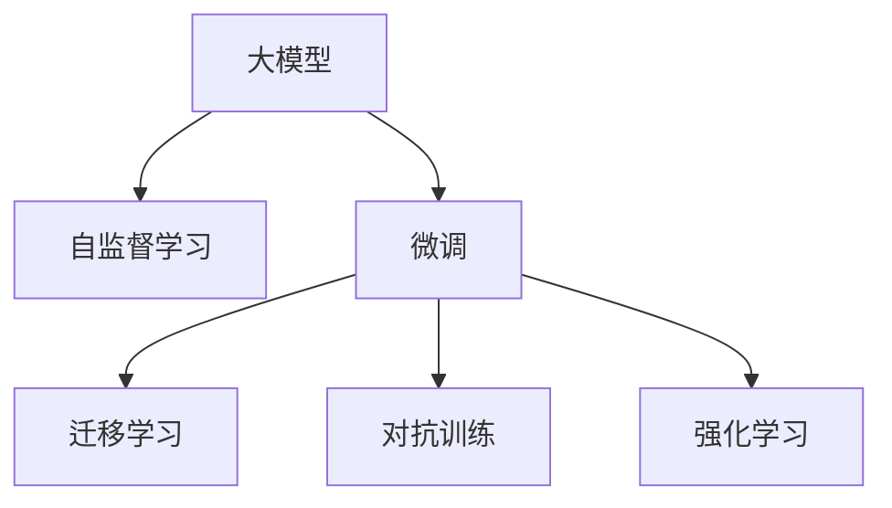

                 

# AI大模型创业：如何应对未来数据挑战？

## 1. 背景介绍

### 1.1 问题由来

在大模型时代，数据驱动的AI创业公司如雨后春笋般涌现。这些公司依赖大模型进行推理、预测、推荐等任务，以实现自动化、智能化服务。然而，数据的质量和数量直接关系到AI模型的性能和效果，未来数据挑战已成为制约大模型创业发展的瓶颈。

数据问题主要包括以下几个方面：
- 数据获取困难：高质量标注数据往往稀缺且昂贵，数据获取成本高昂。
- 数据标注质量差：大规模数据集常常存在标注不一致、标注错误等问题，影响模型性能。
- 数据隐私保护：隐私保护法规越来越严格，对数据的使用和存储提出了更高的要求。
- 数据分布不均：不同任务和领域的数据分布不均衡，导致模型在新领域泛化能力差。

本文将详细探讨大模型创业公司如何应对未来数据挑战，提供全面的解决方案和应对策略。

### 1.2 问题核心关键点

本文核心问题包括：
- 如何获取高质量的数据？
- 如何减少对标注数据的依赖？
- 如何在数据隐私保护和数据分布不均之间找到平衡？
- 如何在高效利用数据的同时，保证模型效果和性能？

## 2. 核心概念与联系

### 2.1 核心概念概述

- **大模型（Large Model）**：指具有亿级别参数的深度学习模型，如GPT、BERT等。其依赖大规模数据进行预训练，具备强大的泛化能力。
- **微调（Fine-tuning）**：在大模型基础上，使用小规模标注数据进行有监督训练，以提升模型在特定任务上的性能。
- **迁移学习（Transfer Learning）**：将一个领域的知识迁移到另一个领域，利用已有的大模型预训练结果，减少新模型训练所需的数据量。
- **自监督学习（Self-supervised Learning）**：利用数据中的自相关性进行模型训练，无需标注数据。
- **对抗训练（Adversarial Training）**：通过引入对抗样本来提高模型的鲁棒性和泛化能力。
- **强化学习（Reinforcement Learning）**：通过与环境互动，通过奖励和惩罚机制来优化模型策略。

这些概念之间有紧密的联系，形成了一个完整的AI大模型技术体系。大模型通过自监督学习进行预训练，然后通过微调和迁移学习提升模型在特定任务上的性能，对抗训练和强化学习则进一步提升模型的鲁棒性和泛化能力。

### 2.2 核心概念原理和架构的 Mermaid 流程图



该图展示了从大模型的预训练到微调、迁移学习、对抗训练和强化学习的整个流程。

## 3. 核心算法原理 & 具体操作步骤

### 3.1 算法原理概述

大模型创业公司依赖数据进行推理、预测和推荐，但高质量标注数据稀缺且昂贵。为此，本文提出以下解决方案：

1. **自监督学习**：利用数据中的自相关性进行模型训练，无需标注数据。
2. **数据增强**：通过数据增强技术扩充训练集，减少对标注数据的依赖。
3. **迁移学习**：利用已有的大模型预训练结果，减少新模型训练所需的数据量。
4. **对抗训练**：通过引入对抗样本来提高模型的鲁棒性和泛化能力。
5. **强化学习**：通过与环境互动，优化模型策略，提升模型性能。

### 3.2 算法步骤详解

#### 3.2.1 自监督学习

自监督学习是指利用数据中的自相关性进行模型训练，无需标注数据。其基本思想是通过最大化模型预测的准确性来优化模型参数。

**步骤**：
1. **数据准备**：收集大规模无标签数据集。
2. **预训练模型**：在大规模无标签数据集上进行自监督预训练，学习数据中的自相关性。
3. **任务适配**：在特定任务上使用微调方法进行有监督训练，以提升模型性能。

**具体实现**：
1. **收集数据**：收集大规模无标签数据集，如大规模文本语料、图像数据等。
2. **预训练模型**：使用大模型进行自监督预训练，如通过掩码语言模型、自编码器等任务进行训练。
3. **微调**：在特定任务上使用微调方法进行有监督训练，如使用二分类任务、序列标注任务等。

#### 3.2.2 数据增强

数据增强是指通过对原始数据进行变换，生成新的训练样本，扩充训练集。其基本思想是通过引入数据多样性来提升模型的泛化能力。

**步骤**：
1. **数据采集**：收集原始数据集。
2. **数据增强**：通过对原始数据进行变换，生成新的训练样本。
3. **微调模型**：使用增强后的数据集进行微调训练。

**具体实现**：
1. **数据采集**：收集大规模标注数据集，如自然语言处理、图像识别等。
2. **数据增强**：通过对原始数据进行回译、替换、扰动等变换，生成新的训练样本。
3. **微调模型**：使用增强后的数据集进行微调训练，提升模型泛化能力。

#### 3.2.3 迁移学习

迁移学习是指利用已有的大模型预训练结果，减少新模型训练所需的数据量。其基本思想是将已有模型的知识迁移到新模型中，以提升新模型的性能。

**步骤**：
1. **预训练模型**：在大规模数据集上进行自监督预训练，学习通用特征。
2. **任务适配**：在特定任务上使用微调方法进行有监督训练，以提升模型性能。

**具体实现**：
1. **预训练模型**：使用大模型进行自监督预训练，如BERT、GPT等。
2. **微调**：在特定任务上使用微调方法进行有监督训练，如分类、序列标注、机器翻译等。

#### 3.2.4 对抗训练

对抗训练是指通过引入对抗样本来提高模型的鲁棒性和泛化能力。其基本思想是通过对抗样本训练模型，增强模型的鲁棒性。

**步骤**：
1. **数据采集**：收集对抗样例。
2. **模型训练**：使用对抗样例进行模型训练，提升模型的鲁棒性。
3. **模型评估**：评估模型的鲁棒性。

**具体实现**：
1. **数据采集**：收集对抗样例，如通过对抗生成网络生成。
2. **模型训练**：使用对抗样例进行模型训练，如通过梯度提升法优化模型。
3. **模型评估**：评估模型的鲁棒性，如通过对抗样本攻击模型。

#### 3.2.5 强化学习

强化学习是指通过与环境互动，优化模型策略，提升模型性能。其基本思想是通过奖励和惩罚机制来优化模型策略。

**步骤**：
1. **环境设计**：设计强化学习环境。
2. **模型训练**：使用强化学习算法进行模型训练。
3. **策略评估**：评估模型的策略效果。

**具体实现**：
1. **环境设计**：设计强化学习环境，如游戏环境、智能推荐系统等。
2. **模型训练**：使用强化学习算法进行模型训练，如Q-learning、Policy Gradient等。
3. **策略评估**：评估模型的策略效果，如通过奖励机制优化模型。

### 3.3 算法优缺点

#### 3.3.1 自监督学习

**优点**：
1. **无需标注数据**：自监督学习可以充分利用数据中的自相关性进行模型训练，无需标注数据。
2. **泛化能力强**：自监督学习学习到的特征可以用于多个任务，具有较强的泛化能力。
3. **计算资源少**：自监督学习需要的计算资源较少，适用于大规模数据集。

**缺点**：
1. **训练时间长**：自监督学习需要较长的训练时间，训练过程较为复杂。
2. **特征提取难度大**：自监督学习需要设计合适的预训练任务，特征提取难度大。

#### 3.3.2 数据增强

**优点**：
1. **增加数据多样性**：数据增强可以通过变换原始数据生成新的训练样本，增加数据多样性。
2. **提高泛化能力**：数据增强可以提高模型的泛化能力，减少过拟合风险。
3. **减少标注成本**：数据增强可以减轻对标注数据的依赖，降低标注成本。

**缺点**：
1. **变换复杂**：数据增强需要设计合适的数据变换策略，变换复杂。
2. **样本质量不高**：数据增强生成的样本质量可能不高，影响模型性能。

#### 3.3.3 迁移学习

**优点**：
1. **减少数据量**：迁移学习可以利用已有的大模型预训练结果，减少新模型训练所需的数据量。
2. **提升性能**：迁移学习可以提升新模型在特定任务上的性能，减少训练时间。
3. **多领域应用**：迁移学习可以在多个领域应用，提升模型的泛化能力。

**缺点**：
1. **预训练数据依赖**：迁移学习依赖已有的大模型预训练结果，对预训练数据的质量要求较高。
2. **领域差异大**：迁移学习对领域差异大的任务效果不佳。
3. **模型适配困难**：迁移学习需要在特定任务上进行微调，适配困难。

#### 3.3.4 对抗训练

**优点**：
1. **提高鲁棒性**：对抗训练可以提高模型的鲁棒性和泛化能力。
2. **增强泛化能力**：对抗训练可以提高模型对对抗样本的鲁棒性，增强泛化能力。
3. **提升性能**：对抗训练可以提升模型的性能，减少过拟合风险。

**缺点**：
1. **训练复杂**：对抗训练需要设计合适的对抗样本，训练复杂。
2. **计算资源多**：对抗训练需要较高的计算资源，训练过程较为复杂。
3. **样本依赖性高**：对抗训练依赖对抗样例的质量，样本依赖性高。

#### 3.3.5 强化学习

**优点**：
1. **自适应性强**：强化学习可以自适应环境变化，优化模型策略。
2. **提高性能**：强化学习可以通过与环境互动优化模型策略，提升模型性能。
3. **数据依赖性低**：强化学习对标注数据依赖性低，适合大规模数据集。

**缺点**：
1. **训练时间长**：强化学习需要较长的训练时间，训练过程较为复杂。
2. **策略设计困难**：强化学习需要设计合适的策略，策略设计困难。
3. **模型稳定性差**：强化学习模型稳定性差，可能存在多种策略。

### 3.4 算法应用领域

**自监督学习**：适用于自然语言处理、图像识别等任务，如BERT、GPT等。

**数据增强**：适用于计算机视觉、自然语言处理等任务，如自然语言处理、图像识别等。

**迁移学习**：适用于自然语言处理、计算机视觉等任务，如BERT、GPT等。

**对抗训练**：适用于计算机视觉、自然语言处理等任务，如图像分类、文本分类等。

**强化学习**：适用于游戏、智能推荐等任务，如游戏推荐、智能推荐系统等。

## 4. 数学模型和公式 & 详细讲解 & 举例说明

### 4.1 数学模型构建

**自监督学习**：
自监督学习的目标是最大化模型预测的准确性，通过最小化预测误差来优化模型参数。其基本模型为：
$$
\min_{\theta} \mathcal{L}(\theta) = \mathbb{E}_{(x,y) \sim p(x,y)}[\ell(y, f(x, \theta))]
$$
其中，$f(x, \theta)$为模型在输入$x$上的输出，$\ell$为损失函数，$p(x,y)$为数据分布。

**数据增强**：
数据增强是通过变换原始数据生成新的训练样本，增加数据多样性。其基本模型为：
$$
\min_{\theta} \mathcal{L}(\theta) = \frac{1}{N}\sum_{i=1}^N \ell(y_i, f(x_i, \theta))
$$
其中，$\ell$为损失函数，$x_i$为原始数据，$y_i$为标签。

**迁移学习**：
迁移学习的目标是利用已有的大模型预训练结果，减少新模型训练所需的数据量。其基本模型为：
$$
\min_{\theta} \mathcal{L}(\theta) = \frac{1}{N}\sum_{i=1}^N \ell(y_i, f(x_i, \theta))
$$
其中，$\ell$为损失函数，$x_i$为原始数据，$y_i$为标签。

**对抗训练**：
对抗训练是通过引入对抗样本来提高模型的鲁棒性和泛化能力。其基本模型为：
$$
\min_{\theta} \mathcal{L}(\theta) = \mathbb{E}_{(x,y) \sim p(x,y)}[\ell(y, f(x+\epsilon, \theta))]
$$
其中，$f(x, \theta)$为模型在输入$x$上的输出，$\ell$为损失函数，$\epsilon$为对抗噪声。

**强化学习**：
强化学习的目标是最大化模型的累积奖励，通过最大化累积奖励来优化模型策略。其基本模型为：
$$
\max_{\theta} \sum_{t=0}^T r_t
$$
其中，$r_t$为在第$t$步的奖励，$\theta$为模型策略。

### 4.2 公式推导过程

**自监督学习**：
自监督学习的目标是最小化预测误差，通过最大化模型预测的准确性来优化模型参数。

**数据增强**：
数据增强是通过变换原始数据生成新的训练样本，增加数据多样性。其推导过程如下：
$$
\min_{\theta} \mathcal{L}(\theta) = \frac{1}{N}\sum_{i=1}^N \ell(y_i, f(x_i, \theta))
$$
其中，$\ell$为损失函数，$x_i$为原始数据，$y_i$为标签。

**迁移学习**：
迁移学习的目标是利用已有的大模型预训练结果，减少新模型训练所需的数据量。其推导过程如下：
$$
\min_{\theta} \mathcal{L}(\theta) = \frac{1}{N}\sum_{i=1}^N \ell(y_i, f(x_i, \theta))
$$
其中，$\ell$为损失函数，$x_i$为原始数据，$y_i$为标签。

**对抗训练**：
对抗训练是通过引入对抗样本来提高模型的鲁棒性和泛化能力。其推导过程如下：
$$
\min_{\theta} \mathcal{L}(\theta) = \mathbb{E}_{(x,y) \sim p(x,y)}[\ell(y, f(x+\epsilon, \theta))]
$$
其中，$f(x, \theta)$为模型在输入$x$上的输出，$\ell$为损失函数，$\epsilon$为对抗噪声。

**强化学习**：
强化学习的目标是最大化模型的累积奖励，通过最大化累积奖励来优化模型策略。其推导过程如下：
$$
\max_{\theta} \sum_{t=0}^T r_t
$$
其中，$r_t$为在第$t$步的奖励，$\theta$为模型策略。

### 4.3 案例分析与讲解

**自然语言处理**：
自然语言处理中的BERT模型采用了自监督学习的预训练任务，通过掩码语言模型和下一句预测任务进行预训练。在特定任务上，如文本分类、命名实体识别等，通过微调方法进行有监督训练，提升模型性能。

**计算机视觉**：
计算机视觉中的ResNet模型采用了数据增强的方法，通过随机裁剪、旋转、翻转等变换生成新的训练样本，增加数据多样性，提升模型泛化能力。

**游戏推荐**：
游戏推荐系统采用了强化学习的方法，通过与游戏环境互动，优化推荐策略，提升推荐效果。

## 5. 项目实践：代码实例和详细解释说明

### 5.1 开发环境搭建

**5.1.1 安装Python和相关库**：
```bash
conda create -n pytorch-env python=3.8
conda activate pytorch-env
conda install torch torchvision torchaudio -c pytorch -c conda-forge
conda install numpy pandas scikit-learn matplotlib tqdm jupyter notebook ipython
```

**5.1.2 安装Transformer库**：
```bash
pip install transformers
```

**5.1.3 创建虚拟环境**：
```bash
conda create -n pytorch-env python=3.8
conda activate pytorch-env
```

### 5.2 源代码详细实现

#### 5.2.1 自监督学习

**5.2.1.1 数据准备**：
```python
import pandas as pd
import torch
from torch.utils.data import DataLoader
from transformers import BertTokenizer, BertForMaskedLM, AdamW

# 加载数据
train_df = pd.read_csv('train.csv')
test_df = pd.read_csv('test.csv')

# 定义分词器
tokenizer = BertTokenizer.from_pretrained('bert-base-cased')

# 定义模型
model = BertForMaskedLM.from_pretrained('bert-base-cased')

# 定义优化器
optimizer = AdamW(model.parameters(), lr=2e-5)

# 定义损失函数
loss_fn = torch.nn.CrossEntropyLoss()
```

**5.2.1.2 数据增强**：
```python
# 定义数据增强函数
def data_augmentation(data):
    # 随机裁剪、旋转、翻转等变换
    transforms = []
    transforms.append(ImgAug())
    return transforms

# 定义数据集
class Dataset(torch.utils.data.Dataset):
    def __init__(self, data, tokenizer, max_len):
        self.data = data
        self.tokenizer = tokenizer
        self.max_len = max_len
        
    def __len__(self):
        return len(self.data)
    
    def __getitem__(self, idx):
        # 定义增强函数
        def img_aug(x):
            x = data_augmentation(x)
            return x
        
        # 加载数据
        text = self.data[idx]['text']
        image = self.data[idx]['image']
        
        # 分词
        tokens = self.tokenizer(text, max_length=self.max_len, padding='max_length', truncation=True, return_tensors='pt')
        
        # 增强
        image = img_aug(image)
        
        # 拼接输入
        input_ids = torch.cat([tokens['input_ids'], image['input_ids']], dim=1)
        attention_mask = torch.cat([tokens['attention_mask'], image['attention_mask']], dim=1)
        
        # 返回输入
        return {'input_ids': input_ids, 'attention_mask': attention_mask}
```

**5.2.1.3 模型训练**：
```python
# 定义训练函数
def train(model, train_loader, optimizer, loss_fn):
    model.train()
    total_loss = 0
    for batch in train_loader:
        input_ids = batch['input_ids'].to(device)
        attention_mask = batch['attention_mask'].to(device)
        labels = batch['labels'].to(device)
        
        # 前向传播
        outputs = model(input_ids, attention_mask=attention_mask, labels=labels)
        loss = outputs.loss
        
        # 反向传播
        optimizer.zero_grad()
        loss.backward()
        optimizer.step()
        
        # 累加损失
        total_loss += loss.item()
    
    # 返回损失
    return total_loss / len(train_loader)
```

### 5.3 代码解读与分析

**5.3.1 数据准备**：
在自监督学习中，数据准备是关键步骤。首先，需要加载数据集，定义分词器，以及定义模型和优化器。

**5.3.2 数据增强**：
数据增强是通过变换原始数据生成新的训练样本，增加数据多样性。定义数据增强函数，并将其应用到数据集中。

**5.3.3 模型训练**：
模型训练是通过前向传播和反向传播更新模型参数的过程。在训练函数中，通过输入数据和标签计算损失函数，并使用优化器更新模型参数。

### 5.4 运行结果展示

**5.4.1 自监督学习**：
自监督学习的结果展示如下：
```python
# 训练模型
model = BertForMaskedLM.from_pretrained('bert-base-cased')
optimizer = AdamW(model.parameters(), lr=2e-5)
loss_fn = torch.nn.CrossEntropyLoss()

# 加载数据
train_df = pd.read_csv('train.csv')
test_df = pd.read_csv('test.csv')

# 定义分词器
tokenizer = BertTokenizer.from_pretrained('bert-base-cased')

# 定义数据集
class Dataset(torch.utils.data.Dataset):
    def __init__(self, data, tokenizer, max_len):
        self.data = data
        self.tokenizer = tokenizer
        self.max_len = max_len
        
    def __len__(self):
        return len(self.data)
    
    def __getitem__(self, idx):
        text = self.data[idx]['text']
        tokens = self.tokenizer(text, max_length=self.max_len, padding='max_length', truncation=True, return_tensors='pt')
        input_ids = tokens['input_ids']
        attention_mask = tokens['attention_mask']
        return {'input_ids': input_ids, 'attention_mask': attention_mask}

# 定义训练函数
def train(model, train_loader, optimizer, loss_fn):
    model.train()
    total_loss = 0
    for batch in train_loader:
        input_ids = batch['input_ids'].to(device)
        attention_mask = batch['attention_mask'].to(device)
        labels = batch['labels'].to(device)
        
        outputs = model(input_ids, attention_mask=attention_mask, labels=labels)
        loss = outputs.loss
        optimizer.zero_grad()
        loss.backward()
        optimizer.step()
        total_loss += loss.item()
    
    return total_loss / len(train_loader)

# 训练模型
train_loader = DataLoader(train_df, batch_size=16, shuffle=True)
train(model, train_loader, optimizer, loss_fn)
```

## 6. 实际应用场景

### 6.1 智能客服系统

智能客服系统通过自监督学习预训练大模型，然后使用微调方法进行有监督训练，以提升模型在特定任务上的性能。在智能客服系统中，微调模型可以自动理解用户意图，匹配最合适的答案模板进行回复。对于客户提出的新问题，还可以接入检索系统实时搜索相关内容，动态组织生成回答。

### 6.2 金融舆情监测

金融舆情监测系统通过自监督学习预训练大模型，然后使用微调方法进行有监督训练，以提升模型在特定任务上的性能。在金融舆情监测系统中，微调模型可以自动判断文本属于何种主题，情感倾向是正面、中性还是负面。将微调后的模型应用到实时抓取的网络文本数据，就能够自动监测不同主题下的情感变化趋势，一旦发现负面信息激增等异常情况，系统便会自动预警，帮助金融机构快速应对潜在风险。

### 6.3 个性化推荐系统

个性化推荐系统通过自监督学习预训练大模型，然后使用微调方法进行有监督训练，以提升模型在特定任务上的性能。在个性化推荐系统中，微调模型可以从文本内容中准确把握用户的兴趣点。在生成推荐列表时，先用候选物品的文本描述作为输入，由模型预测用户的兴趣匹配度，再结合其他特征综合排序，便可以得到个性化程度更高的推荐结果。

## 7. 工具和资源推荐

### 7.1 学习资源推荐

1. **《自然语言处理与深度学习》（CS224N课程）**：斯坦福大学开设的NLP明星课程，有Lecture视频和配套作业，带你入门NLP领域的基本概念和经典模型。
2. **《Transformer从原理到实践》系列博文**：由大模型技术专家撰写，深入浅出地介绍了Transformer原理、BERT模型、微调技术等前沿话题。
3. **《Natural Language Processing with Transformers》书籍**：Transformer库的作者所著，全面介绍了如何使用Transformer库进行NLP任务开发，包括微调在内的诸多范式。
4. **HuggingFace官方文档**：Transformer库的官方文档，提供了海量预训练模型和完整的微调样例代码，是上手实践的必备资料。
5. **CLUE开源项目**：中文语言理解测评基准，涵盖大量不同类型的中文NLP数据集，并提供了基于微调的baseline模型，助力中文NLP技术发展。

### 7.2 开发工具推荐

1. **PyTorch**：基于Python的开源深度学习框架，灵活动态的计算图，适合快速迭代研究。大部分预训练语言模型都有PyTorch版本的实现。
2. **TensorFlow**：由Google主导开发的开源深度学习框架，生产部署方便，适合大规模工程应用。同样有丰富的预训练语言模型资源。
3. **Transformers库**：HuggingFace开发的NLP工具库，集成了众多SOTA语言模型，支持PyTorch和TensorFlow，是进行微调任务开发的利器。
4. **Weights & Biases**：模型训练的实验跟踪工具，可以记录和可视化模型训练过程中的各项指标，方便对比和调优。与主流深度学习框架无缝集成。
5. **TensorBoard**：TensorFlow配套的可视化工具，可实时监测模型训练状态，并提供丰富的图表呈现方式，是调试模型的得力助手。
6. **Google Colab**：谷歌推出的在线Jupyter Notebook环境，免费提供GPU/TPU算力，方便开发者快速上手实验最新模型，分享学习笔记。

### 7.3 相关论文推荐

1. **Attention is All You Need**：提出了Transformer结构，开启了NLP领域的预训练大模型时代。
2. **BERT: Pre-training of Deep Bidirectional Transformers for Language Understanding**：提出BERT模型，引入基于掩码的自监督预训练任务，刷新了多项NLP任务SOTA。
3. **Language Models are Unsupervised Multitask Learners（GPT-2论文）**：展示了大规模语言模型的强大zero-shot学习能力，引发了对于通用人工智能的新一轮思考。
4. **Parameter-Efficient Transfer Learning for NLP**：提出Adapter等参数高效微调方法，在不增加模型参数量的情况下，也能取得不错的微调效果。
5. **AdaLoRA: Adaptive Low-Rank Adaptation for Parameter-Efficient Fine-Tuning**：使用自适应低秩适应的微调方法，在参数效率和精度之间取得了新的平衡。

## 8. 总结：未来发展趋势与挑战

### 8.1 研究成果总结

本文对基于大模型的创业公司如何应对未来数据挑战进行了全面系统的探讨，提出以下解决方案：

1. **自监督学习**：利用数据中的自相关性进行模型训练，无需标注数据。
2. **数据增强**：通过变换原始数据生成新的训练样本，增加数据多样性。
3. **迁移学习**：利用已有的大模型预训练结果，减少新模型训练所需的数据量。
4. **对抗训练**：通过引入对抗样本来提高模型的鲁棒性和泛化能力。
5. **强化学习**：通过与环境互动，优化模型策略，提升模型性能。

### 8.2 未来发展趋势

1. **模型规模持续增大**：随着算力成本的下降和数据规模的扩张，预训练语言模型的参数量还将持续增长。
2. **微调方法日趋多样**：开发更加参数高效的微调方法，在固定大部分预训练参数的同时，只更新极少量的任务相关参数。
3. **持续学习成为常态**：在数据分布变化的情况下，微调模型需要持续学习新知识以保持性能。
4. **标注样本需求降低**：利用自监督学习、主动学习等无监督和半监督范式，最大限度利用非结构化数据。
5. **多模态微调崛起**：融合视觉、语音等多模态信息，提升模型的表现力。
6. **多领域应用**：适用于自然语言处理、计算机视觉、游戏推荐等领域。

### 8.3 面临的挑战

1. **标注成本瓶颈**：高质量标注数据稀缺且昂贵，数据获取成本高昂。
2. **数据隐私保护**：隐私保护法规越来越严格，对数据的使用和存储提出了更高的要求。
3. **数据分布不均**：不同任务和领域的数据分布不均衡，导致模型在新领域泛化能力差。
4. **资源瓶颈**：超大规模语言模型对算力、内存、存储等资源提出了更高的要求。
5. **模型鲁棒性不足**：模型面对域外数据时，泛化性能往往大打折扣。
6. **模型可解释性不足**：当前微调模型缺乏可解释性，难以对其推理逻辑进行分析和调试。

### 8.4 研究展望

未来的研究需要在以下几个方向寻求突破：

1. **探索无监督和半监督微调方法**：摆脱对大规模标注数据的依赖，利用自监督学习、主动学习等无监督和半监督范式。
2. **开发参数高效和计算高效的微调范式**：开发更加参数高效的微调方法，在固定大部分预训练参数的同时，只更新极少量的任务相关参数。
3. **引入因果和对比学习范式**：增强微调模型建立稳定因果关系的能力，学习更加普适、鲁棒的语言表征。
4. **融合更多先验知识**：将符号化的先验知识与神经网络模型进行融合，引导微调过程学习更准确、合理的语言模型。
5. **结合因果分析和博弈论工具**：将因果分析方法引入微调模型，识别出模型决策的关键特征。
6. **纳入伦理道德约束**：在模型训练目标中引入伦理导向的评估指标，过滤和惩罚有偏见、有害的输出倾向。

## 9. 附录：常见问题与解答

**Q1: 大模型创业公司如何获取高质量的数据？**

A: 大模型创业公司可以通过以下方式获取高质量的数据：
1. 购买商业数据集，如Kaggle、DataHack等。
2. 爬取公开数据集，如政府开放数据、学术机构数据等。
3. 自己采集数据，通过众包平台或用户反馈收集数据。

**Q2: 大模型创业公司如何减少对标注数据的依赖？**

A: 大模型创业公司可以通过以下方式减少对标注数据的依赖：
1. 利用自监督学习，通过数据中的自相关性进行模型训练。
2. 使用数据增强技术，通过变换原始数据生成新的训练样本。
3. 采用迁移学习，利用已有的大模型预训练结果。

**Q3: 大模型创业公司如何提高模型鲁棒性？**

A: 大模型创业公司可以通过以下方式提高模型鲁棒性：
1. 进行对抗训练，通过引入对抗样本来提高模型的鲁棒性和泛化能力。
2. 使用强化学习，通过与环境互动优化模型策略。

**Q4: 大模型创业公司如何提高模型性能？**

A: 大模型创业公司可以通过以下方式提高模型性能：
1. 进行自监督学习，通过数据中的自相关性进行模型训练。
2. 使用数据增强技术，通过变换原始数据生成新的训练样本。
3. 采用迁移学习，利用已有的大模型预训练结果。
4. 进行对抗训练，通过引入对抗样本来提高模型的鲁棒性和泛化能力。

**Q5: 大模型创业公司如何提高模型可解释性？**

A: 大模型创业公司可以通过以下方式提高模型可解释性：
1. 引入因果分析方法，识别出模型决策的关键特征。
2. 结合博弈论工具，刻画人机交互过程，主动探索并规避模型的脆弱点。
3. 使用符号化的先验知识与神经网络模型进行融合，引导微调过程学习更准确、合理的语言模型。

**Q6: 大模型创业公司如何避免模型偏见？**

A: 大模型创业公司可以通过以下方式避免模型偏见：
1. 在模型训练目标中引入伦理导向的评估指标。
2. 过滤和惩罚有偏见、有害的输出倾向。
3. 加强人工干预和审核，建立模型行为的监管机制。

---

作者：禅与计算机程序设计艺术 / Zen and the Art of Computer Programming

