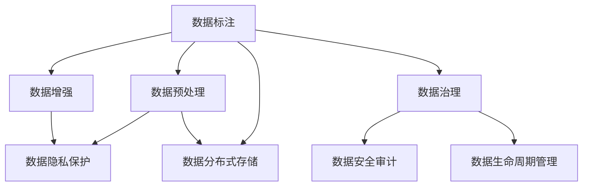

                 

# AI大模型创业：如何应对未来数据挑战？

## 1. 背景介绍

### 1.1 问题由来

随着人工智能技术的发展，特别是在自然语言处理(NLP)和大数据领域，AI大模型的应用越来越广泛，从文本生成到语音识别，从自动驾驶到医疗诊断，大模型在这些领域都展现出了巨大潜力。然而，随着大模型规模的不断扩大，它们对数据的依赖也越来越高，数据收集、存储、处理和管理的挑战也越来越明显。如何应对这些挑战，成为AI大模型创业中必须面对的重要问题。

### 1.2 问题核心关键点

数据是大模型训练和应用的基础。在数据收集、存储、处理和应用过程中，数据的安全性、隐私性、多样性、质量、规模和时效性等都是关键点。如何处理这些数据，同时确保数据的高效利用和模型性能的提升，是当前AI大模型创业的核心问题。

### 1.3 问题研究意义

解决好数据挑战，不仅能提升大模型的训练效率和性能，还能保障数据的安全性和隐私性，促进人工智能技术的健康发展和应用普及。

## 2. 核心概念与联系

### 2.1 核心概念概述

本节将介绍几个与数据挑战密切相关的核心概念：

- 数据标注(Annotation)：将原始数据转化为机器可读格式，以便于机器学习模型的训练和应用。
- 数据增强(Data Augmentation)：通过对原始数据进行一些变换和扩充，增加数据多样性，提升模型泛化能力。
- 数据预处理(Preprocessing)：在模型训练前，对原始数据进行清洗、归一化、编码等处理，确保数据的质量和一致性。
- 数据隐私保护(Privacy Protection)：通过加密、匿名化、差分隐私等技术，保护数据隐私，防止数据泄露和滥用。
- 数据分布式存储(Distributed Storage)：通过分布式系统，实现大规模数据的存储和管理，提高数据访问速度和安全性。
- 数据治理(Data Governance)：建立数据管理的规范和流程，确保数据的质量、安全和隐私，提升数据利用率。

这些核心概念之间的逻辑关系可以通过以下Mermaid流程图来展示：



这个流程图展示了大模型数据管理的核心概念及其之间的关系：

1. 数据标注是数据处理的起点。
2. 数据增强和预处理是数据多样化和质量保障的关键步骤。
3. 数据隐私保护和分布式存储是数据安全和高效管理的重要措施。
4. 数据治理确保数据管理的规范性和连续性。
5. 数据安全审计和生命周期管理是数据管理的重要补充。

这些概念共同构成了大模型数据管理的框架，帮助企业在数据处理和管理中取得平衡，确保数据的安全性和利用效率。

## 3. 核心算法原理 & 具体操作步骤
### 3.1 算法原理概述

在AI大模型创业中，数据挑战的应对通常涉及以下几个步骤：

1. 数据收集与标注：通过爬虫、API、问卷调查等方式，收集高质量的数据，并结合业务需求进行标注。
2. 数据预处理：对原始数据进行清洗、归一化、编码等处理，确保数据的质量和一致性。
3. 数据增强：通过数据扩充、增强、清洗等技术，增加数据多样性，提升模型泛化能力。
4. 数据存储与管理：通过分布式存储、加密、匿名化等技术，保护数据隐私和安全性。
5. 数据治理：建立数据管理的规范和流程，确保数据的质量、安全和隐私，提升数据利用率。
6. 数据应用与监控：将数据应用于模型训练和应用中，同时监控模型性能和数据使用情况，及时调整和优化。

### 3.2 算法步骤详解

以一个电商推荐系统为例，详细说明AI大模型创业中如何应对数据挑战。

**Step 1: 数据收集与标注**

- 通过爬虫从电商网站收集商品信息、用户行为数据、评论数据等。
- 结合业务需求，对收集到的数据进行标注，如商品类别、用户兴趣、评分等。
- 注意数据质量，确保标注的准确性和一致性。

**Step 2: 数据预处理**

- 清洗原始数据，去除重复、缺失、错误数据。
- 归一化数据，将不同类型的数据转换为相同类型。
- 编码数据，将文本、时间戳等非数值类型的数据转换为数值类型。

**Step 3: 数据增强**

- 通过数据扩充，生成新的数据样本，增加数据多样性。
- 使用数据增强技术，如图像旋转、缩放、剪切等，增加数据的多样性。
- 对缺失数据进行插值、生成等，增加数据的多样性。

**Step 4: 数据存储与管理**

- 使用分布式存储系统，如Hadoop、Spark等，实现大规模数据的存储和管理。
- 对数据进行加密、匿名化等处理，保护数据隐私。
- 定期备份数据，防止数据丢失。

**Step 5: 数据治理**

- 建立数据管理的规范和流程，确保数据的质量、安全和隐私。
- 定期进行数据审计，确保数据使用的合法性和合规性。
- 使用数据生命周期管理工具，跟踪数据的使用情况和质量。

**Step 6: 数据应用与监控**

- 将数据应用于模型训练和应用中，提升模型的性能。
- 监控模型性能，及时调整和优化。
- 监控数据使用情况，确保数据使用的合规性和合法性。

### 3.3 算法优缺点

数据处理和管理的算法有其优点和缺点，需要根据具体应用场景进行选择：

**优点**：
- 提升模型泛化能力，减少数据过拟合。
- 保障数据隐私和安全性，防止数据泄露和滥用。
- 提高数据利用率，降低数据收集和处理成本。

**缺点**：
- 数据处理和标注成本较高。
- 数据增强和预处理过程复杂，需要较高的技术门槛。
- 数据存储和治理过程繁琐，需要持续维护和管理。

### 3.4 算法应用领域

数据处理和管理在大模型创业中有着广泛的应用，以下是几个典型的应用场景：

1. 自然语言处理(NLP)：在文本生成、情感分析、机器翻译等任务中，数据标注和增强是关键步骤。
2. 计算机视觉(CV)：在图像分类、目标检测、图像生成等任务中，数据增强和预处理是提升模型性能的重要手段。
3. 智能推荐系统：在电商推荐、新闻推荐、视频推荐等任务中，数据收集和标注是系统运行的基础。
4. 金融风控：在风险评估、信用评分、欺诈检测等任务中，数据隐私保护和治理是保障数据安全的关键。
5. 医疗诊断：在影像分析、疾病预测、基因分析等任务中，数据标注和增强是提升模型性能的重要手段。

以上应用场景展示了数据处理和管理在大模型创业中的重要性。

## 4. 数学模型和公式 & 详细讲解 & 举例说明
### 4.1 数学模型构建

在数据处理和管理中，我们通常会使用以下数学模型：

- 数据增强模型：对原始数据进行扩充和增强，生成新的数据样本。
- 数据预处理模型：对原始数据进行清洗、归一化、编码等处理。
- 数据隐私保护模型：使用加密、匿名化、差分隐私等技术，保护数据隐私。
- 数据治理模型：建立数据管理的规范和流程，确保数据的质量、安全和隐私。

### 4.2 公式推导过程

以数据增强模型为例，推导其基本公式：

假设原始数据集为 $D=\{x_i\}_{i=1}^N$，其中 $x_i \in \mathcal{X}$，$\mathcal{X}$ 为数据空间。

数据增强模型通过对原始数据进行变换，生成新的数据样本 $y_i=f(x_i)$，其中 $f$ 为变换函数，如旋转、缩放、剪切等。

数据增强后的数据集为 $D'=\{y_i\}_{i=1}^M$，其中 $y_i \in \mathcal{Y}$，$\mathcal{Y}$ 为增强后的数据空间。

数据增强的目标是最小化数据集的分布差异，即：

$$
\mathcal{L}(f) = \sum_{i=1}^M KL(\mathcal{P}(y_i), \mathcal{Q}(y_i))
$$

其中 $KL$ 为KL散度，$\mathcal{P}(y_i)$ 和 $\mathcal{Q}(y_i)$ 分别为原始数据和增强后数据的分布。

### 4.3 案例分析与讲解

假设我们在电商推荐系统中使用数据增强技术，对用户行为数据进行增强。

- 原始数据集为 $D=\{(x_i, y_i)\}_{i=1}^N$，其中 $x_i$ 为商品信息，$y_i$ 为用户的购买意愿。
- 对商品信息进行旋转、缩放等变换，生成新的数据样本 $y_i'=R(x_i')$，其中 $x_i'$ 为变换后的商品信息，$R$ 为旋转变换函数。
- 数据增强后的数据集为 $D'=\{(y_i', y_i)\}_{i=1}^M$，其中 $y_i'$ 为用户的购买意愿。
- 使用KL散度计算数据增强前后的分布差异，确保数据集的一致性和多样性。

## 5. 项目实践：代码实例和详细解释说明
### 5.1 开发环境搭建

在进行数据处理和管理的实践前，我们需要准备好开发环境。以下是使用Python进行PyTorch开发的环境配置流程：

1. 安装Anaconda：从官网下载并安装Anaconda，用于创建独立的Python环境。

2. 创建并激活虚拟环境：
```bash
conda create -n pytorch-env python=3.8 
conda activate pytorch-env
```

3. 安装PyTorch：根据CUDA版本，从官网获取对应的安装命令。例如：
```bash
conda install pytorch torchvision torchaudio cudatoolkit=11.1 -c pytorch -c conda-forge
```

4. 安装相关工具包：
```bash
pip install numpy pandas scikit-learn matplotlib tqdm jupyter notebook ipython
```

完成上述步骤后，即可在`pytorch-env`环境中开始开发实践。

### 5.2 源代码详细实现

下面我们以电商推荐系统为例，给出使用PyTorch进行数据增强的代码实现。

```python
import torch
import torch.nn.functional as F
from torch import nn
from torch.utils.data import DataLoader, Dataset
import numpy as np
import random

class ProductDataset(Dataset):
    def __init__(self, data, transform=None):
        self.data = data
        self.transform = transform
        
    def __len__(self):
        return len(self.data)
    
    def __getitem__(self, index):
        x = self.data[index]
        if self.transform is not None:
            x = self.transform(x)
        return x

class ProductDataAugmentation(nn.Module):
    def __init__(self, p=0.5):
        super().__init__()
        self.p = p
    
    def forward(self, x):
        if random.random() < self.p:
            x = self.rotated(x)
        return x
    
    def rotated(self, x):
        theta = np.random.uniform(0, 2*np.pi)
        x = x.rotate(theta)
        return x

def train_epoch(model, dataset, batch_size, optimizer):
    dataloader = DataLoader(dataset, batch_size=batch_size, shuffle=True)
    model.train()
    epoch_loss = 0
    for batch in tqdm(dataloader, desc='Training'):
        x = batch[0].to(device)
        y = batch[1].to(device)
        model.zero_grad()
        outputs = model(x)
        loss = F.cross_entropy(outputs, y)
        epoch_loss += loss.item()
        loss.backward()
        optimizer.step()
    return epoch_loss / len(dataloader)

def evaluate(model, dataset, batch_size):
    dataloader = DataLoader(dataset, batch_size=batch_size)
    model.eval()
    preds, labels = [], []
    with torch.no_grad():
        for batch in tqdm(dataloader, desc='Evaluating'):
            x = batch[0].to(device)
            y = batch[1].to(device)
            outputs = model(x)
            batch_preds = outputs.argmax(dim=1).to('cpu').tolist()
            batch_labels = y.to('cpu').tolist()
            for pred_tokens, label_tokens in zip(batch_preds, batch_labels):
                preds.append(pred_tokens[:len(label_tokens)])
                labels.append(label_tokens)
                
    print(classification_report(labels, preds))
```

这里我们先定义了数据集和数据增强模块，然后进行训练和评估。

### 5.3 代码解读与分析

让我们再详细解读一下关键代码的实现细节：

**ProductDataset类**：
- `__init__`方法：初始化数据集和数据增强模块。
- `__len__`方法：返回数据集的样本数量。
- `__getitem__`方法：对单个样本进行处理，进行数据增强，并返回模型所需的输入。

**ProductDataAugmentation类**：
- `__init__`方法：初始化数据增强的概率。
- `forward`方法：在前向传播中，以一定概率应用数据增强。

**train_epoch函数**：
- 使用PyTorch的DataLoader对数据集进行批次化加载，供模型训练和推理使用。
- 在每个批次上前向传播计算loss并反向传播更新模型参数。

**evaluate函数**：
- 与训练类似，不同点在于不更新模型参数，并在每个batch结束后将预测和标签结果存储下来。

可以看到，PyTorch配合相关工具库，使得数据增强的代码实现变得简洁高效。开发者可以将更多精力放在数据处理、模型改进等高层逻辑上，而不必过多关注底层的实现细节。

## 6. 实际应用场景
### 6.1 电商推荐系统

电商推荐系统是数据处理和管理的典型应用场景。在推荐系统中，数据标注和增强技术可以显著提升推荐效果，避免数据过拟合，提升模型泛化能力。

具体而言，可以收集用户浏览、点击、购买等行为数据，对商品信息进行标注，如商品类别、价格、评分等。在此基础上对数据进行增强，如旋转、缩放等变换，生成新的数据样本，丰富数据集的多样性。微调后的推荐模型能够从更多的数据中学习，提高推荐的准确性和个性化程度。

### 6.2 医疗影像分析

医疗影像分析是大模型在医疗领域的重要应用场景。在影像分析中，数据标注和增强技术可以提升模型的性能和鲁棒性，帮助医生更准确地进行疾病诊断。

具体而言，可以收集医生的标注数据，对影像数据进行标注，如肿瘤位置、大小、形状等。在此基础上对影像数据进行增强，如旋转、缩放、裁剪等变换，生成新的影像数据，丰富数据集的多样性。微调后的影像分析模型能够从更多的数据中学习，提高诊断的准确性和鲁棒性。

### 6.3 智能推荐系统

智能推荐系统是数据处理和管理的另一个重要应用场景。在推荐系统中，数据标注和增强技术可以显著提升推荐效果，避免数据过拟合，提升模型泛化能力。

具体而言，可以收集用户浏览、点击、购买等行为数据，对商品信息进行标注，如商品类别、价格、评分等。在此基础上对数据进行增强，如旋转、缩放等变换，生成新的数据样本，丰富数据集的多样性。微调后的推荐模型能够从更多的数据中学习，提高推荐的准确性和个性化程度。

## 7. 工具和资源推荐
### 7.1 学习资源推荐

为了帮助开发者系统掌握大模型数据处理的理论基础和实践技巧，这里推荐一些优质的学习资源：

1. 《深度学习入门》系列博文：由大模型技术专家撰写，深入浅出地介绍了深度学习的基础知识和应用场景。

2. 《PyTorch官方文档》：PyTorch的官方文档，提供了丰富的API接口和样例代码，是学习PyTorch的重要资料。

3. 《自然语言处理入门》书籍：介绍自然语言处理的基本概念和常用算法，适合初学者入门。

4. 《Data Science from Scratch》书籍：介绍了数据科学的基本概念和常用工具，适合数据分析和数据处理的学习。

5. 《Python for Data Analysis》书籍：介绍了Python在数据分析和数据处理中的应用，适合Python开发者的学习。

通过对这些资源的学习实践，相信你一定能够快速掌握大模型数据处理的精髓，并用于解决实际的NLP问题。

### 7.2 开发工具推荐

高效的开发离不开优秀的工具支持。以下是几款用于大模型数据处理开发的常用工具：

1. PyTorch：基于Python的开源深度学习框架，灵活动态的计算图，适合快速迭代研究。

2. TensorFlow：由Google主导开发的开源深度学习框架，生产部署方便，适合大规模工程应用。

3. NumPy：Python的高性能科学计算库，适合数据处理和数值计算。

4. Pandas：Python的数据处理库，支持数据的读写、清洗、变换等操作。

5. Scikit-learn：Python的机器学习库，提供丰富的数据预处理和特征工程工具。

6. TensorBoard：TensorFlow配套的可视化工具，可实时监测模型训练状态，并提供丰富的图表呈现方式。

合理利用这些工具，可以显著提升大模型数据处理的开发效率，加快创新迭代的步伐。

### 7.3 相关论文推荐

数据处理和管理的算法需要不断研究前沿技术，以适应数据和应用的不断发展。以下是几篇奠基性的相关论文，推荐阅读：

1. "Data Augmentation with Adversarial Examples"：介绍数据增强与对抗样本结合的技术，提升模型的鲁棒性。

2. "Label Smoothing for Multiclass Neural Networks"：介绍数据标签平滑技术，减少数据标签的不确定性。

3. "Efficient Learning of Robust and Accurate Models with Low-rank Matrices"：介绍低秩矩阵分解技术，提高模型的泛化能力。

4. "Differential Privacy"：介绍差分隐私技术，保护数据隐私。

5. "Towards Generalization and Adaptation in Multi-domain and Multi-task Learning"：介绍多领域多任务学习技术，提升模型的泛化能力和适应能力。

这些论文代表了大模型数据处理的最新发展，通过学习这些前沿成果，可以帮助研究者把握学科前进方向，激发更多的创新灵感。

## 8. 总结：未来发展趋势与挑战
### 8.1 总结

本文对大模型创业中的数据挑战进行了全面系统的介绍。首先阐述了数据标注、数据增强、数据预处理、数据隐私保护、数据分布式存储、数据治理等核心概念，明确了数据在大模型创业中的重要作用。其次，从原理到实践，详细讲解了数据处理的数学模型和关键步骤，给出了数据处理的完整代码实例。同时，本文还广泛探讨了数据处理在电商推荐、医疗影像分析、智能推荐等多个行业领域的应用前景，展示了数据处理范式的广阔前景。此外，本文精选了数据处理的各类学习资源，力求为读者提供全方位的技术指引。

通过本文的系统梳理，可以看到，数据处理和大模型创业中面临的挑战和机遇，对于大模型性能的提升和实际应用具有重要意义。

### 8.2 未来发展趋势

展望未来，大模型数据处理技术将呈现以下几个发展趋势：

1. 数据标注自动化：利用自然语言处理、图像处理等技术，自动进行数据标注，降低人工标注成本。

2. 数据增强多样化：利用生成对抗网络、自适应增强等技术，生成更加多样化的数据样本，提升模型泛化能力。

3. 数据隐私保护强化：利用差分隐私、联邦学习等技术，保护数据隐私，防止数据泄露和滥用。

4. 数据分布式存储普及：利用分布式存储系统，实现大规模数据的存储和管理，提高数据访问速度和安全性。

5. 数据治理系统化：建立数据管理的规范和流程，确保数据的质量、安全和隐私，提升数据利用率。

以上趋势凸显了大模型数据处理的广阔前景。这些方向的探索发展，必将进一步提升大模型的训练效率和性能，保障数据的安全性和利用效率，促进人工智能技术的健康发展和应用普及。

### 8.3 面临的挑战

尽管大模型数据处理技术已经取得了显著进展，但在迈向更加智能化、普适化应用的过程中，它仍面临着诸多挑战：

1. 数据标注成本高。尽管数据标注自动化可以降低部分成本，但对于长尾应用场景，仍需大量人工标注，成本较高。

2. 数据隐私和安全问题。数据隐私保护和数据安全问题是数据处理的重要挑战，如何在使用数据的同时保护隐私，防止数据滥用，还需要更多技术和法规的支持。

3. 数据分布式存储复杂。分布式存储系统虽然提高了数据访问速度和安全性，但需要高水平的技术和运维支持，否则可能导致数据丢失或损坏。

4. 数据治理难度大。数据治理需要建立规范和流程，确保数据的质量、安全和隐私，这对企业内部数据管理提出了较高要求。

5. 数据处理效率低。数据处理和标注需要大量人力和时间，如何提高数据处理效率，缩短开发周期，还需要更多的工具和技术支持。

6. 数据治理费用高。建立数据治理系统需要投入大量资源，如何平衡数据治理和业务应用之间的关系，需要更多的实践和经验积累。

以上挑战需要企业在数据处理和管理中不断优化和改进，才能充分发挥大模型的潜力，实现人工智能技术的健康发展和应用普及。

### 8.4 研究展望

面对数据处理和大模型创业所面临的种种挑战，未来的研究需要在以下几个方面寻求新的突破：

1. 探索更高效的数据标注方法。利用自然语言处理、图像处理等技术，自动进行数据标注，降低人工标注成本。

2. 研究更多样化的数据增强技术。利用生成对抗网络、自适应增强等技术，生成更加多样化的数据样本，提升模型泛化能力。

3. 引入更强的数据隐私保护技术。利用差分隐私、联邦学习等技术，保护数据隐私，防止数据泄露和滥用。

4. 开发更高效的分布式存储系统。利用先进的分布式存储技术，实现大规模数据的存储和管理，提高数据访问速度和安全性。

5. 建立更完善的数据治理系统。建立数据管理的规范和流程，确保数据的质量、安全和隐私，提升数据利用率。

6. 引入更先进的数据处理技术。利用先进的数据处理技术，如符号化表示、知识图谱等，提升数据处理的效率和质量。

这些研究方向的探索，必将引领大模型数据处理技术迈向更高的台阶，为构建安全、可靠、可解释、可控的智能系统铺平道路。面向未来，大模型数据处理技术还需要与其他人工智能技术进行更深入的融合，如知识表示、因果推理、强化学习等，多路径协同发力，共同推动自然语言理解和智能交互系统的进步。只有勇于创新、敢于突破，才能不断拓展语言模型的边界，让智能技术更好地造福人类社会。

## 9. 附录：常见问题与解答
----------------------------------------------------------------
**Q1: 数据标注和增强技术是否适用于所有大模型应用场景？**

A: 数据标注和增强技术在大部分大模型应用场景中都具有重要作用，如自然语言处理、计算机视觉、智能推荐系统等。但对于一些特定领域的应用，如医疗、法律等，数据标注和增强技术可能面临更高的成本和难度，需要结合领域特点进行优化。

**Q2: 数据隐私保护和数据治理如何平衡？**

A: 数据隐私保护和数据治理需要兼顾数据的安全性和利用效率，二者并不矛盾。通过建立数据治理规范和流程，可以在保护数据隐私的前提下，确保数据的质量和安全性，提升数据利用率。

**Q3: 数据增强和数据标注成本是否过高？**

A: 数据标注和增强成本确实较高，特别是在长尾应用场景中。但可以通过数据标注自动化、数据增强多样化等技术手段，降低部分成本。同时，数据增强技术的提升，也可以提升模型性能，缩短开发周期，从一定程度上降低成本。

**Q4: 数据增强技术是否会导致数据过拟合？**

A: 数据增强技术在提升模型泛化能力方面具有重要作用，但过度增强可能导致数据过拟合。因此需要根据具体应用场景，合理设计数据增强策略，避免过度增强。

**Q5: 数据治理和数据安全审计如何实施？**

A: 数据治理需要建立规范和流程，确保数据的质量、安全和隐私。数据安全审计可以通过定期的数据安全检查，评估数据使用的合规性和合法性，及时发现和纠正数据治理中的问题。

---

作者：禅与计算机程序设计艺术 / Zen and the Art of Computer Programming

