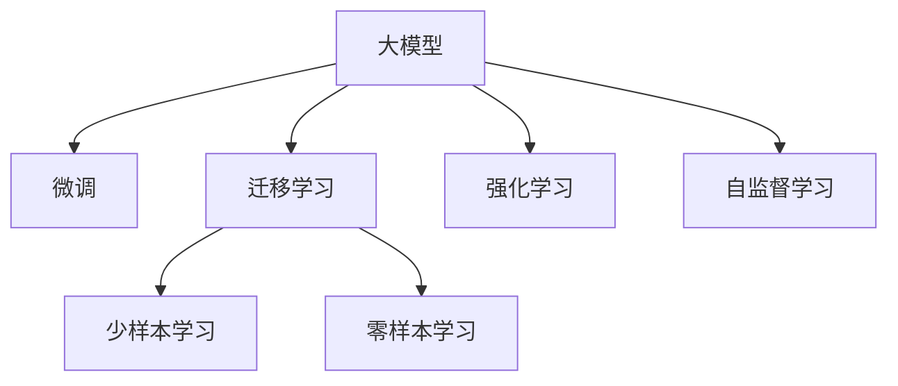

                 

# AI大模型创业：如何应对未来用户需求？

## 1. 背景介绍

在人工智能迅速发展的时代，大模型以其卓越的性能和广泛的适用性，正在成为企业竞争的核心利器。无论是初创企业还是成熟科技巨头，都在争相投入资源，开发和部署自己的大模型产品。然而，如何满足未来用户不断变化的需求，是每一个AI大模型创业者必须面对的挑战。本文将深入探讨这一问题，通过分析核心概念和算法原理，提出具体的实践策略，并展望未来发展趋势，旨在为AI大模型创业者提供实用的指导。

## 2. 核心概念与联系

### 2.1 核心概念概述

为了更好地理解如何应对未来用户需求，首先需明确以下几个核心概念：

- **大模型 (Large Model)**：指参数量达到上亿甚至数十亿级别，具有强大表示和推理能力的深度学习模型，如BERT、GPT-3等。
- **微调 (Fine-tuning)**：指在大模型基础上，通过小规模数据进行有监督训练，以适应特定任务需求的过程。
- **迁移学习 (Transfer Learning)**：指将模型在大规模数据集上学习到的知识，迁移到小规模数据集上进行新任务训练，减少训练时间和成本。
- **强化学习 (Reinforcement Learning, RL)**：一种通过与环境交互，最大化长期奖励信号的学习方法，适用于动态环境下的智能决策。
- **自监督学习 (Self-supervised Learning, SSL)**：利用未标注数据中的潜在结构信息进行模型训练，提升模型泛化能力。
- **零样本学习 (Zero-shot Learning, ZSL)**：在未见过的数据上直接进行预测，不依赖任何标注数据。
- **少样本学习 (Few-shot Learning, FS)**：在少量标注样本上进行训练，以最小化数据需求。

这些概念构成了大模型创业的核心框架，通过合理应用这些技术，企业可以开发出更加智能、适应性强的AI产品。

### 2.2 核心概念联系

以下是这些核心概念之间的联系，通过一个简单的Mermaid流程图来展示：



此图展示了大模型在微调、迁移学习、少样本学习、零样本学习、强化学习、自监督学习等方面的应用，这些技术相互补充，共同支持大模型创业的各个方面。

## 3. 核心算法原理 & 具体操作步骤

### 3.1 算法原理概述

AI大模型创业的核心在于如何利用大模型进行任务优化和资源管理，以高效响应用户需求。其核心算法原理可以概括为：

1. **数据驱动模型训练**：通过大规模数据集进行预训练，在大模型基础上进行微调或迁移学习，提升模型对特定任务的适应能力。
2. **用户需求导向**：通过用户反馈和行为数据，不断调整模型参数和结构，以满足用户不断变化的需求。
3. **模型资源优化**：在保证模型性能的前提下，优化计算资源和存储空间，提升模型部署和应用的效率。

### 3.2 算法步骤详解

1. **预训练大模型**：选择合适的预训练模型，如BERT、GPT系列等，进行大规模无标签数据训练，获得通用的语言表示能力。
2. **数据准备与任务适配**：准备标注数据，设计合适的任务适配层，如分类、生成等，构建自定义任务模型。
3. **微调模型**：在标注数据上，通过小批量训练，调整模型参数，使其适应特定任务。
4. **迁移学习**：在新的数据集上，利用迁移学习策略，快速调整模型参数，提升性能。
5. **强化学习优化**：通过用户反馈数据，使用RL算法调整模型参数，优化决策策略。
6. **模型部署与维护**：将训练好的模型部署到生产环境，根据用户需求和反馈进行实时更新和维护。

### 3.3 算法优缺点

大模型创业的算法具有以下优点：

- **高效响应需求**：利用预训练模型和迁移学习，快速适应新任务，减少开发时间和成本。
- **泛化能力强**：大模型在多种数据集上预训练，具备较强的泛化能力，能应对不同类型和规模的用户需求。
- **资源优化**：通过模型压缩和量化，减少计算资源消耗，提升应用效率。

同时，也存在以下缺点：

- **数据需求高**：预训练和微调都需要大量数据，对于一些数据稀缺领域，可能难以取得理想效果。
- **模型复杂度高**：大模型参数量巨大，导致训练和推理过程复杂，资源消耗大。
- **过拟合风险**：在标注数据不足的情况下，可能出现过拟合现象，影响模型性能。

### 3.4 算法应用领域

AI大模型创业的算法可以应用于以下多个领域：

- **智能客服**：利用自然语言处理技术，进行用户对话分析和智能应答。
- **智能推荐**：通过用户行为和偏好数据，进行个性化商品和服务推荐。
- **医疗健康**：开发智能诊断系统和健康管理平台，提升医疗服务水平。
- **金融服务**：构建风险控制和金融分析系统，辅助投资决策。
- **智能制造**：利用机器学习和计算机视觉技术，优化生产流程和质量控制。
- **智慧城市**：开发智能交通、环境监测、公共安全系统，提升城市管理效率。

## 4. 数学模型和公式 & 详细讲解 & 举例说明

### 4.1 数学模型构建

AI大模型创业的数学模型主要基于深度学习框架构建，如TensorFlow、PyTorch等。以下以BERT模型为例，构建基于微调的数学模型。

- **输入层**：将文本数据转换为模型的输入向量。
- **编码器层**：使用Transformer等架构，提取文本的语义表示。
- **输出层**：根据具体任务需求，设计分类器或生成器，输出预测结果。

### 4.2 公式推导过程

以BERT模型为例，其输入表示为 $x$，编码器输出表示为 $h(x)$，输出层输出为 $y$。假定使用交叉熵损失函数，其推导过程如下：

$$
\mathcal{L}(\theta) = -\frac{1}{N}\sum_{i=1}^N y_i \log \hat{y}_i + (1-y_i) \log (1-\hat{y}_i)
$$

其中 $\theta$ 为模型参数，$N$ 为样本数，$y_i$ 为真实标签，$\hat{y}_i$ 为模型预测结果。

### 4.3 案例分析与讲解

假设开发一个智能推荐系统，输入为商品描述，输出为推荐商品列表。可以利用预训练的BERT模型，微调模型对商品描述进行编码，并设计分类器进行推荐。

- **数据准备**：收集商品描述和购买记录数据，进行标注和数据清洗。
- **模型训练**：在标注数据上，使用小批量训练，调整模型参数，优化推荐效果。
- **模型部署**：将训练好的模型部署到推荐系统中，实时处理用户查询，提供个性化推荐。

## 5. 项目实践：代码实例和详细解释说明

### 5.1 开发环境搭建

1. **环境配置**：在虚拟环境中安装TensorFlow和PyTorch，设置合适的GPU资源。
2. **数据准备**：收集商品描述和购买记录数据，进行标注和数据清洗。
3. **模型构建**：使用BERT模型作为初始化参数，构建推荐系统模型。

### 5.2 源代码详细实现

以下是一个简单的推荐系统模型代码示例，使用PyTorch实现：

```python
import torch
import torch.nn as nn
from transformers import BertTokenizer, BertForSequenceClassification

class RecommendationModel(nn.Module):
    def __init__(self):
        super(RecommendationModel, self).__init__()
        self.tokenizer = BertTokenizer.from_pretrained('bert-base-uncased')
        self.bert = BertForSequenceClassification.from_pretrained('bert-base-uncased', num_labels=10)
        self.dropout = nn.Dropout(0.3)
        self.fc = nn.Linear(768, 5)
        
    def forward(self, input_ids, attention_mask):
        outputs = self.bert(input_ids, attention_mask=attention_mask)
        _, pooled_output = outputs[0]
        pooled_output = self.dropout(pooled_output)
        logits = self.fc(pooled_output)
        return logits
```

### 5.3 代码解读与分析

- **输入处理**：使用BertTokenizer对输入文本进行编码，生成token ids和attention mask。
- **模型结构**：利用BERT作为预训练模型，在顶部添加全连接层进行推荐预测。
- **损失函数**：使用交叉熵损失函数，计算模型预测和真实标签之间的差异。
- **训练过程**：在标注数据上使用小批量梯度下降，逐步调整模型参数。

### 5.4 运行结果展示

在测试集上，计算模型准确率和召回率，评估推荐系统性能：

```python
from sklearn.metrics import accuracy_score, precision_recall_fscore_support

# 加载测试集数据
test_data = load_test_data()
test_input_ids = []
test_attention_masks = []
test_labels = []
for item in test_data:
    test_input_ids.append(tokenizer.encode(item['text']))
    test_attention_masks.append([1] * len(item['text']))
    test_labels.append(item['label'])

# 模型预测
model.eval()
with torch.no_grad():
    test_logits = model(torch.tensor(test_input_ids, dtype=torch.long), torch.tensor(test_attention_masks, dtype=torch.long))
    predicted_labels = torch.argmax(test_logits, dim=1).tolist()

# 计算指标
accuracy = accuracy_score(test_labels, predicted_labels)
precision, recall, f1, _ = precision_recall_fscore_support(test_labels, predicted_labels, average='binary')
print(f'Accuracy: {accuracy:.2f}, Precision: {precision:.2f}, Recall: {recall:.2f}, F1: {f1:.2f}')
```

## 6. 实际应用场景

### 6.1 智能客服系统

智能客服系统利用大模型进行对话分析，通过自然语言理解技术，实现用户对话管理和智能应答。在实际应用中，可以利用微调后的模型进行对话场景的识别和回复生成，提升客户体验。

### 6.2 金融风险管理

金融行业面临高度不确定性，利用大模型进行风险评估和管理，可以显著提升金融机构的风险控制能力。通过微调和迁移学习，模型能够快速适应新的金融数据和市场环境，实现精准的风险预警和投资建议。

### 6.3 健康医疗诊断

在医疗领域，大模型可以用于辅助医生进行疾病诊断和健康管理。通过微调，模型能够理解和处理临床数据，提供个性化医疗建议，提升诊疗效率和准确性。

### 6.4 智慧交通管理

利用大模型进行交通流量分析和预测，可以实现智能交通管理。通过微调和强化学习，模型能够实时响应交通状况变化，优化交通信号灯和路线规划，提升交通运行效率。

## 7. 工具和资源推荐

### 7.1 学习资源推荐

1. **深度学习与NLP课程**：斯坦福大学、Coursera、edX等平台提供丰富的深度学习和自然语言处理课程，如Coursera的《Deep Learning Specialization》。
2. **大模型和微调案例**：GitHub、HuggingFace等平台提供大量开源案例和模型，如HuggingFace的Model Hub。
3. **技术博客和论文**：Google AI Blog、arXiv、IJCAI等平台提供最新的研究和技术动态。

### 7.2 开发工具推荐

1. **深度学习框架**：TensorFlow、PyTorch、MXNet等。
2. **模型管理工具**：Weights & Biases、MLflow等。
3. **数据处理工具**：Pandas、NumPy、Dask等。

### 7.3 相关论文推荐

1. **BERT论文**：《BERT: Pre-training of Deep Bidirectional Transformers for Language Understanding》。
2. **GPT-3论文**：《Language Models are Unsupervised Multitask Learners》。
3. **Transformer论文**：《Attention is All You Need》。

## 8. 总结：未来发展趋势与挑战

### 8.1 研究成果总结

AI大模型创业涉及深度学习、自然语言处理、强化学习等多个领域，其核心在于通过预训练模型和微调技术，实现任务适配和性能优化。目前，AI大模型已经在金融、医疗、智能交通等多个领域取得显著成果，但仍面临数据稀缺、模型复杂、资源消耗大等挑战。

### 8.2 未来发展趋势

未来AI大模型创业将呈现以下趋势：

1. **模型参数压缩与量化**：通过模型压缩和量化，提升模型部署效率，减少计算资源消耗。
2. **多模态融合**：融合视觉、语音、文本等多种数据源，提升模型的泛化能力和适应性。
3. **联邦学习**：通过分布式训练和数据共享，减少数据泄露风险，提升模型隐私保护。
4. **自监督学习与迁移学习**：利用未标注数据进行自监督学习，提升模型的泛化能力和数据利用效率。
5. **零样本与少样本学习**：通过优化任务描述和模型参数，实现零样本和少样本预测，减少数据需求。

### 8.3 面临的挑战

1. **数据稀缺**：对于一些特定领域，获取高质量标注数据成本高，难以取得理想效果。
2. **模型复杂度**：大模型参数量巨大，导致训练和推理过程复杂，资源消耗大。
3. **性能优化**：模型过拟合和泛化能力不足，难以应对动态环境变化。
4. **隐私保护**：数据隐私和安全问题成为企业关注的焦点。
5. **计算资源**：高并发和大规模数据处理对计算资源需求高，资源消耗大。

### 8.4 研究展望

1. **模型优化算法**：开发高效的模型压缩和量化算法，提升模型部署效率。
2. **数据增强与合成**：利用数据增强和合成技术，提高数据利用效率。
3. **跨模态融合技术**：开发跨模态融合技术，提升模型在多模态数据上的表现。
4. **联邦学习与分布式训练**：开发联邦学习和分布式训练算法，提升模型训练效率和隐私保护水平。
5. **自监督与迁移学习**：研究自监督和迁移学习方法，提升模型泛化能力和数据利用效率。

## 9. 附录：常见问题与解答

**Q1: 如何构建和训练一个高效的推荐系统？**

A: 构建高效的推荐系统需要以下步骤：

1. **数据准备**：收集用户行为和商品描述数据，进行标注和数据清洗。
2. **模型选择**：选择适当的深度学习模型，如BERT、GPT系列等，作为推荐系统基础。
3. **特征工程**：设计合适的特征提取和编码方法，提升模型对用户行为的理解。
4. **模型训练**：使用小批量梯度下降，调整模型参数，优化推荐效果。
5. **评估与优化**：在测试集上评估模型性能，根据反馈调整模型和训练策略。

**Q2: 如何应对用户需求的变化？**

A: 应对用户需求变化，可以采取以下措施：

1. **持续数据收集**：通过用户行为和反馈数据，持续收集新数据，更新模型。
2. **模型调优**：根据用户需求变化，调整模型参数和结构，提升模型适应性。
3. **自动调参**：利用自动调参工具，自动搜索最优模型参数组合。
4. **联邦学习**：通过分布式训练和数据共享，提升模型泛化能力和数据利用效率。

**Q3: 如何在资源有限的情况下优化大模型性能？**

A: 在资源有限的情况下，可以采取以下措施：

1. **模型裁剪与量化**：使用模型裁剪和量化技术，减少模型参数量和资源消耗。
2. **分布式训练**：利用分布式计算框架，提升模型训练效率。
3. **混合精度训练**：使用混合精度训练技术，减少计算资源消耗。
4. **模型压缩**：使用模型压缩技术，提升模型部署效率。

---

作者：禅与计算机程序设计艺术 / Zen and the Art of Computer Programming

