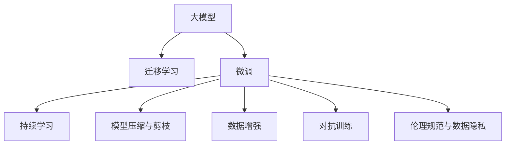

                 

# AI大模型创业：如何应对未来竞争对手？

> 关键词：AI大模型、创业、竞争策略、技术创新、商业化、市场趋势、数据隐私、伦理规范、可持续性

## 1. 背景介绍

### 1.1 问题由来

近年来，人工智能（AI）特别是深度学习技术迅猛发展，催生了包括自然语言处理（NLP）、计算机视觉（CV）、语音识别（ASR）等在内的多个领域的技术突破。大模型（如GPT-3、BERT等）凭借其在大规模无监督学习上的优势，已经在多个领域展现出了强劲的竞争力。在AI创业领域，大模型成为了竞争的核心焦点，如何在未来市场中占据有利位置，成为每个创业公司需要认真考虑的问题。

### 1.2 问题核心关键点

大模型在创业中扮演着至关重要的角色，其核心关键点主要包括：
1. **模型规模与性能**：模型参数量越大，处理复杂任务的能力越强，但也需要更多的计算资源和时间。
2. **数据依赖**：大模型的性能依赖于大规模高质量数据，数据来源和质量对模型效果有重要影响。
3. **应用场景**：大模型的应用领域广泛，如何针对特定场景进行优化和定制，是创业公司需要解决的问题。
4. **商业模式**：大模型创业公司需要考虑如何平衡技术投入与商业回报，选择合适的盈利模式。
5. **市场趋势**：AI大模型市场竞争激烈，了解市场动态和趋势，及时调整战略是关键。
6. **伦理与隐私**：大模型在处理敏感数据时需遵循伦理规范，保障数据隐私和安全。
7. **可持续性**：创业公司需考虑模型的可扩展性、可维护性和长期运行成本。

这些关键点构成了大模型创业的基本框架，创业者需要深入理解和灵活应对。

## 2. 核心概念与联系

### 2.1 核心概念概述

为更好地理解AI大模型创业的策略和方法，本节将介绍几个核心概念：

- **大模型（Large Model）**：指具有大规模参数量的深度学习模型，如BERT、GPT-3等，通过在大规模无标签数据上进行预训练，学习到丰富的特征表示，适用于复杂语言理解和生成任务。

- **迁移学习（Transfer Learning）**：指在大规模预训练模型的基础上，通过微调或重训练等技术，使其在新任务上获得良好表现的过程。

- **微调（Fine-Tuning）**：针对特定任务，在大规模预训练模型的基础上，调整模型参数以适应新任务，通常使用较小的学习率进行训练。

- **持续学习（Continual Learning）**：指模型在面对新数据时，能够不断学习并更新已有知识，以保持其适应性和时效性。

- **模型压缩与剪枝（Model Compression & Pruning）**：通过减少模型参数量，降低计算复杂度和内存占用，提高模型效率和可扩展性。

- **数据增强（Data Augmentation）**：通过对原始数据进行变换，扩充训练集，提高模型的泛化能力和鲁棒性。

- **对抗训练（Adversarial Training）**：通过在训练中加入对抗样本，增强模型对异常输入的鲁棒性。

- **伦理规范与数据隐私（Ethical Standards & Privacy）**：在大模型处理敏感数据时，需要遵循相关法规，保障数据隐私和伦理。

这些核心概念之间的逻辑关系可以通过以下Mermaid流程图来展示：



这个流程图展示了大模型创业中各个关键技术之间的关系：

1. 大模型通过预训练获得基础能力。
2. 微调是对预训练模型进行任务特定的优化，以适应新任务。
3. 持续学习保持模型对新数据的适应性。
4. 模型压缩与剪枝提高模型效率和可扩展性。
5. 数据增强增强模型的泛化能力和鲁棒性。
6. 对抗训练提高模型对异常输入的鲁棒性。
7. 伦理规范与数据隐私保障模型应用的安全性。

这些概念共同构成了大模型创业的技术基础，使其能够在各种场景下发挥作用。

## 3. 核心算法原理 & 具体操作步骤

### 3.1 算法原理概述

AI大模型创业的竞争主要集中在技术研发、产品创新和市场推广三个方面。本文重点介绍如何在技术层面上提升大模型的性能和应用效率。

大模型创业的核心算法原理包括：
1. **预训练与微调**：通过在大规模无标签数据上预训练，然后在特定任务上微调，提升模型的性能。
2. **模型压缩与剪枝**：通过减少模型参数量，提高模型的推理速度和效率。
3. **对抗训练**：通过引入对抗样本，提高模型的鲁棒性。
4. **数据增强**：通过扩充训练集，提高模型的泛化能力和鲁棒性。
5. **持续学习**：通过不断地学习新数据，保持模型的时效性和适应性。

这些技术是构建高性能、高效能AI大模型的基础，需要创业者在技术层面上深入理解和灵活运用。

### 3.2 算法步骤详解

#### 3.2.1 预训练与微调

**步骤1：收集数据**  
首先，需要收集并准备用于预训练和微调的数据集。这些数据集应尽可能广泛，涵盖多种语言、多种任务，以确保模型的泛化能力。

**步骤2：预训练**  
使用大规模预训练算法，如自监督学习、掩码语言模型等，在大规模无标签数据上进行预训练，得到基础语言模型。

**步骤3：微调**  
选择合适的任务，收集少量有标签数据，在预训练模型基础上进行微调，调整模型参数以适应特定任务。

**步骤4：评估与优化**  
在微调后，使用验证集评估模型性能，并根据评估结果进行模型优化，如调整学习率、正则化参数等。

#### 3.2.2 模型压缩与剪枝

**步骤1：模型分析**  
分析模型结构，确定哪些参数是冗余的，哪些参数对模型性能有重要影响。

**步骤2：剪枝**  
通过剪枝技术，删除冗余参数，减少模型大小和计算复杂度。

**步骤3：量化与加速**  
将剪枝后的模型进行量化，使用定点计算替代浮点计算，进一步提高模型推理速度和效率。

**步骤4：部署与优化**  
将模型部署到目标平台上，进行优化，如使用缓存、优化算法等，提高模型性能。

#### 3.2.3 对抗训练

**步骤1：生成对抗样本**  
使用对抗样本生成技术，生成扰动后的输入样本。

**步骤2：对抗训练**  
在训练过程中，加入对抗样本，通过反向传播更新模型参数，提高模型对异常输入的鲁棒性。

**步骤3：评估与优化**  
在对抗训练后，使用验证集评估模型性能，根据评估结果进行优化，如调整对抗样本的强度、数量等。

#### 3.2.4 数据增强

**步骤1：数据收集**  
收集更多的数据，包括不同来源、不同类型的数据。

**步骤2：数据变换**  
对原始数据进行变换，如旋转、缩放、噪声添加等，生成更多训练样本。

**步骤3：数据增强**  
在训练过程中，使用增强后的数据，提高模型的泛化能力和鲁棒性。

**步骤4：评估与优化**  
在数据增强后，使用验证集评估模型性能，根据评估结果进行优化，如调整增强策略、数据变换方法等。

#### 3.2.5 持续学习

**步骤1：数据收集**  
持续收集新数据，更新训练集。

**步骤2：模型更新**  
使用新数据进行微调，更新模型参数，保持模型对新数据的适应性。

**步骤3：评估与优化**  
在模型更新后，使用验证集评估模型性能，根据评估结果进行优化，如调整模型结构、微调策略等。

### 3.3 算法优缺点

#### 3.3.1 预训练与微调的优缺点

**优点**：
1. 预训练在大规模数据上进行，能够学习到丰富的语言知识。
2. 微调在小规模数据上进行调整，能够快速适应新任务。
3. 能够显著提升模型在特定任务上的性能。

**缺点**：
1. 需要大量的数据和计算资源。
2. 可能过拟合，特别是在数据量较少的情况下。

#### 3.3.2 模型压缩与剪枝的优缺点

**优点**：
1. 减少计算复杂度，提高推理速度。
2. 降低存储需求，提高模型可扩展性。
3. 减少内存占用，提高模型在移动设备上的应用能力。

**缺点**：
1. 可能降低模型性能。
2. 需要额外的计算资源进行剪枝和量化。

#### 3.3.3 对抗训练的优缺点

**优点**：
1. 提高模型对异常输入的鲁棒性。
2. 增强模型的泛化能力。
3. 减少模型在现实环境中的错误率。

**缺点**：
1. 增加训练时间。
2. 对抗样本生成可能较为复杂。

#### 3.3.4 数据增强的优缺点

**优点**：
1. 增加训练集样本数量。
2. 提高模型泛化能力。
3. 增强模型对噪声的鲁棒性。

**缺点**：
1. 需要额外的计算资源。
2. 可能增加训练复杂度。

#### 3.3.5 持续学习的优缺点

**优点**：
1. 保持模型对新数据的适应性。
2. 提高模型时效性。
3. 减少重新训练的需要。

**缺点**：
1. 需要持续收集新数据。
2. 增加模型维护成本。

### 3.4 算法应用领域

大模型在多个领域具有广泛的应用前景：
1. **自然语言处理（NLP）**：包括文本分类、命名实体识别、情感分析、机器翻译等。
2. **计算机视觉（CV）**：包括图像分类、目标检测、图像生成等。
3. **语音识别（ASR）**：包括语音转文本、情感识别等。
4. **医疗健康**：包括疾病诊断、患者护理、医疗咨询等。
5. **金融科技**：包括风险评估、智能投顾、财务分析等。
6. **智能制造**：包括智能客服、质量检测、生产调度等。
7. **自动驾驶**：包括路况分析、交通预测、决策支持等。

## 4. 数学模型和公式 & 详细讲解  
### 4.1 数学模型构建

以BERT模型为例，假设原始无标签数据集为 $\mathcal{D}$，原始数据量为 $n$，预训练时使用的掩码语言模型为 $LM(\cdot)$，微调任务为 $T$，模型为 $M_{\theta}$。

**预训练阶段**：
$$
M_{\theta} = LM(\mathcal{D})
$$

**微调阶段**：
$$
M_{\theta}^{\prime} = \arg\min_{\theta} \sum_{(x,y)\in T} \ell(M_{\theta}(x), y)
$$

其中 $\ell$ 为损失函数，如交叉熵损失、均方误差损失等。

### 4.2 公式推导过程

以二分类任务为例，假设模型 $M_{\theta}$ 在输入 $x$ 上的输出为 $\hat{y}=M_{\theta}(x)$，真实标签 $y \in \{0,1\}$。则二分类交叉熵损失函数定义为：

$$
\ell(M_{\theta}(x),y) = -[y\log \hat{y} + (1-y)\log (1-\hat{y})]
$$

将其代入经验风险公式，得：

$$
\mathcal{L}(\theta) = -\frac{1}{N}\sum_{i=1}^N [y_i\log M_{\theta}(x_i)+(1-y_i)\log(1-M_{\theta}(x_i))]
$$

根据链式法则，损失函数对参数 $\theta_k$ 的梯度为：

$$
\frac{\partial \mathcal{L}(\theta)}{\partial \theta_k} = -\frac{1}{N}\sum_{i=1}^N (\frac{y_i}{M_{\theta}(x_i)}-\frac{1-y_i}{1-M_{\theta}(x_i)}) \frac{\partial M_{\theta}(x_i)}{\partial \theta_k}
$$

其中 $\frac{\partial M_{\theta}(x_i)}{\partial \theta_k}$ 可进一步递归展开，利用自动微分技术完成计算。

### 4.3 案例分析与讲解

假设使用BERT模型进行情感分析任务的微调。首先，收集情感标注数据集，将文本和情感标签输入模型中进行微调。然后，使用微调后的模型对新文本进行情感分析，预测其情感倾向。

## 5. 项目实践：代码实例和详细解释说明

### 5.1 开发环境搭建

在进行大模型创业实践前，我们需要准备好开发环境。以下是使用Python进行TensorFlow开发的环境配置流程：

1. 安装Anaconda：从官网下载并安装Anaconda，用于创建独立的Python环境。

2. 创建并激活虚拟环境：
```bash
conda create -n tf-env python=3.8 
conda activate tf-env
```

3. 安装TensorFlow：根据CUDA版本，从官网获取对应的安装命令。例如：
```bash
pip install tensorflow tensorflow-gpu==2.8.0
```

4. 安装各类工具包：
```bash
pip install numpy pandas scikit-learn matplotlib tqdm jupyter notebook ipython
```

完成上述步骤后，即可在`tf-env`环境中开始创业实践。

### 5.2 源代码详细实现

下面我们以情感分析任务为例，给出使用TensorFlow对BERT模型进行微调的PyTorch代码实现。

首先，定义情感分析任务的数据处理函数：

```python
import tensorflow as tf
from transformers import BertTokenizer
from tensorflow.keras.preprocessing.text import Tokenizer
from tensorflow.keras.preprocessing.sequence import pad_sequences

def preprocess_data(texts, labels, max_len=128):
    tokenizer = BertTokenizer.from_pretrained('bert-base-cased')
    texts_tokenized = [tokenizer.tokenize(text) for text in texts]
    labels = [1 if label == 'positive' else 0 for label in labels]
    
    tokenized_texts = [tokenizer.convert_tokens_to_ids(tokens) for tokens in texts_tokenized]
    tokenized_texts = pad_sequences(tokenized_texts, maxlen=max_len, padding='post', truncating='post')
    labels = tf.keras.preprocessing.sequence.pad_sequences(labels, maxlen=max_len, padding='post', truncating='post')
    
    return tokenized_texts, labels
```

然后，定义模型和优化器：

```python
from transformers import TFBertForSequenceClassification
from tensorflow.keras.optimizers import Adam

model = TFBertForSequenceClassification.from_pretrained('bert-base-cased', num_labels=2)
optimizer = Adam(learning_rate=2e-5)
```

接着，定义训练和评估函数：

```python
def train_epoch(model, dataset, batch_size, optimizer):
    dataset = tf.data.Dataset.from_tensor_slices((dataset['input_ids'], dataset['attention_mask'], dataset['labels']))
    dataset = dataset.shuffle(buffer_size=10000).batch(batch_size)
    
    model.trainable = True
    for batch in dataset:
        input_ids, attention_mask, labels = batch
        with tf.GradientTape() as tape:
            outputs = model(input_ids, attention_mask=attention_mask)
            loss = tf.keras.losses.SparseCategoricalCrossentropy(from_logits=True)(labels, outputs.logits)
        gradients = tape.gradient(loss, model.trainable_variables)
        optimizer.apply_gradients(zip(gradients, model.trainable_variables))
    return loss.numpy().mean()

def evaluate(model, dataset, batch_size):
    dataset = tf.data.Dataset.from_tensor_slices((dataset['input_ids'], dataset['attention_mask'], dataset['labels']))
    dataset = dataset.shuffle(buffer_size=10000).batch(batch_size)
    
    model.trainable = False
    total_loss = 0
    total_correct = 0
    for batch in dataset:
        input_ids, attention_mask, labels = batch
        outputs = model(input_ids, attention_mask=attention_mask)
        loss = tf.keras.losses.SparseCategoricalCrossentropy(from_logits=True)(labels, outputs.logits)
        correct = tf.reduce_mean(tf.cast(tf.equal(tf.argmax(outputs.logits, axis=1), labels), tf.float32))
        total_loss += loss.numpy().mean()
        total_correct += correct.numpy().mean()
    return total_loss / len(dataset), total_correct / len(dataset)
```

最后，启动训练流程并在测试集上评估：

```python
epochs = 5
batch_size = 16

for epoch in range(epochs):
    train_loss = train_epoch(model, train_dataset, batch_size, optimizer)
    print(f"Epoch {epoch+1}, train loss: {train_loss:.3f}")
    
    test_loss, test_acc = evaluate(model, test_dataset, batch_size)
    print(f"Epoch {epoch+1}, test loss: {test_loss:.3f}, test acc: {test_acc:.3f}")
    
print("Final test loss: {:.3f}, test acc: {:.3f}".format(test_loss, test_acc))
```

以上就是使用TensorFlow对BERT进行情感分析任务微调的完整代码实现。可以看到，得益于TensorFlow的强大封装，我们可以用相对简洁的代码完成BERT模型的加载和微调。

### 5.3 代码解读与分析

让我们再详细解读一下关键代码的实现细节：

**preprocess_data函数**：
- 定义文本和标签的预处理步骤，包括分词、标签二值化、填充和截断等。

**模型与优化器定义**：
- 使用TFBertForSequenceClassification定义情感分析任务模型，并设置Adam优化器，学习率为2e-5。

**训练和评估函数**：
- 使用TensorFlow的Dataset和tf.GradientTape实现模型的训练和评估过程。在训练函数中，计算模型输出与真实标签的交叉熵损失，并反向传播更新模型参数。在评估函数中，计算模型输出与真实标签的交叉熵损失和准确率。

**训练流程**：
- 定义总的epoch数和batch size，开始循环迭代。
- 每个epoch内，先在训练集上训练，输出平均训练损失。
- 在验证集上评估，输出平均验证损失和准确率。
- 所有epoch结束后，在测试集上评估，给出最终的测试损失和准确率。

可以看到，TensorFlow配合BERT模型的代码实现变得简洁高效。开发者可以将更多精力放在数据处理、模型改进等高层逻辑上，而不必过多关注底层的实现细节。

当然，工业级的系统实现还需考虑更多因素，如模型的保存和部署、超参数的自动搜索、更灵活的任务适配层等。但核心的微调范式基本与此类似。

## 6. 实际应用场景

### 6.1 智能客服系统

基于大语言模型微调的对话技术，可以广泛应用于智能客服系统的构建。传统客服往往需要配备大量人力，高峰期响应缓慢，且一致性和专业性难以保证。而使用微调后的对话模型，可以7x24小时不间断服务，快速响应客户咨询，用自然流畅的语言解答各类常见问题。

在技术实现上，可以收集企业内部的历史客服对话记录，将问题和最佳答复构建成监督数据，在此基础上对预训练对话模型进行微调。微调后的对话模型能够自动理解用户意图，匹配最合适的答案模板进行回复。对于客户提出的新问题，还可以接入检索系统实时搜索相关内容，动态组织生成回答。如此构建的智能客服系统，能大幅提升客户咨询体验和问题解决效率。

### 6.2 金融舆情监测

金融机构需要实时监测市场舆论动向，以便及时应对负面信息传播，规避金融风险。传统的人工监测方式成本高、效率低，难以应对网络时代海量信息爆发的挑战。基于大语言模型微调的文本分类和情感分析技术，为金融舆情监测提供了新的解决方案。

具体而言，可以收集金融领域相关的新闻、报道、评论等文本数据，并对其进行主题标注和情感标注。在此基础上对预训练语言模型进行微调，使其能够自动判断文本属于何种主题，情感倾向是正面、中性还是负面。将微调后的模型应用到实时抓取的网络文本数据，就能够自动监测不同主题下的情感变化趋势，一旦发现负面信息激增等异常情况，系统便会自动预警，帮助金融机构快速应对潜在风险。

### 6.3 个性化推荐系统

当前的推荐系统往往只依赖用户的历史行为数据进行物品推荐，无法深入理解用户的真实兴趣偏好。基于大语言模型微调技术，个性化推荐系统可以更好地挖掘用户行为背后的语义信息，从而提供更精准、多样的推荐内容。

在实践中，可以收集用户浏览、点击、评论、分享等行为数据，提取和用户交互的物品标题、描述、标签等文本内容。将文本内容作为模型输入，用户的后续行为（如是否点击、购买等）作为监督信号，在此基础上微调预训练语言模型。微调后的模型能够从文本内容中准确把握用户的兴趣点。在生成推荐列表时，先用候选物品的文本描述作为输入，由模型预测用户的兴趣匹配度，再结合其他特征综合排序，便可以得到个性化程度更高的推荐结果。

### 6.4 未来应用展望

随着大语言模型微调技术的发展，其应用场景将越来越广泛，为各行各业带来变革性影响。

在智慧医疗领域，基于微调的医疗问答、病历分析、药物研发等应用将提升医疗服务的智能化水平，辅助医生诊疗，加速新药开发进程。

在智能教育领域，微调技术可应用于作业批改、学情分析、知识推荐等方面，因材施教，促进教育公平，提高教学质量。

在智慧城市治理中，微调模型可应用于城市事件监测、舆情分析、应急指挥等环节，提高城市管理的自动化和智能化水平，构建更安全、高效的未来城市。

此外，在企业生产、社会治理、文娱传媒等众多领域，基于大模型微调的人工智能应用也将不断涌现，为经济社会发展注入新的动力。相信随着技术的日益成熟，微调方法将成为人工智能落地应用的重要范式，推动人工智能技术在垂直行业的规模化落地。

## 7. 工具和资源推荐
### 7.1 学习资源推荐

为了帮助创业者系统掌握大模型微调的理论基础和实践技巧，这里推荐一些优质的学习资源：

1. **《Transformer from Scratch》**：一本关于Transformer原理和实践的书籍，适合入门学习和深入理解。

2. **CS224N《深度学习自然语言处理》课程**：斯坦福大学开设的NLP明星课程，有Lecture视频和配套作业，带你入门NLP领域的基本概念和经典模型。

3. **《Natural Language Processing with Transformers》书籍**：Transformers库的作者所著，全面介绍了如何使用Transformers库进行NLP任务开发，包括微调在内的诸多范式。

4. **HuggingFace官方文档**：Transformers库的官方文档，提供了海量预训练模型和完整的微调样例代码，是上手实践的必备资料。

5. **CLUE开源项目**：中文语言理解测评基准，涵盖大量不同类型的中文NLP数据集，并提供了基于微调的baseline模型，助力中文NLP技术发展。

通过对这些资源的学习实践，相信你一定能够快速掌握大模型微调的精髓，并用于解决实际的NLP问题。

### 7.2 开发工具推荐

高效的开发离不开优秀的工具支持。以下是几款用于大模型微调开发的常用工具：

1. **PyTorch**：基于Python的开源深度学习框架，灵活动态的计算图，适合快速迭代研究。大部分预训练语言模型都有PyTorch版本的实现。

2. **TensorFlow**：由Google主导开发的开源深度学习框架，生产部署方便，适合大规模工程应用。同样有丰富的预训练语言模型资源。

3. **Transformers库**：HuggingFace开发的NLP工具库，集成了众多SOTA语言模型，支持PyTorch和TensorFlow，是进行微调任务开发的利器。

4. **Weights & Biases**：模型训练的实验跟踪工具，可以记录和可视化模型训练过程中的各项指标，方便对比和调优。与主流深度学习框架无缝集成。

5. **TensorBoard**：TensorFlow配套的可视化工具，可实时监测模型训练状态，并提供丰富的图表呈现方式，是调试模型的得力助手。

6. **Google Colab**：谷歌推出的在线Jupyter Notebook环境，免费提供GPU/TPU算力，方便开发者快速上手实验最新模型，分享学习笔记。

合理利用这些工具，可以显著提升大模型微调任务的开发效率，加快创新迭代的步伐。

### 7.3 相关论文推荐

大模型和微调技术的发展源于学界的持续研究。以下是几篇奠基性的相关论文，推荐阅读：

1. **Attention is All You Need**：提出了Transformer结构，开启了NLP领域的预训练大模型时代。

2. **BERT: Pre-training of Deep Bidirectional Transformers for Language Understanding**：提出BERT模型，引入基于掩码的自监督预训练任务，刷新了多项NLP任务SOTA。

3. **Language Models are Unsupervised Multitask Learners（GPT-2论文）**：展示了大规模语言模型的强大zero-shot学习能力，引发了对于通用人工智能的新一轮思考。

4. **Parameter-Efficient Transfer Learning for NLP**：提出Adapter等参数高效微调方法，在不增加模型参数量的情况下，也能取得不错的微调效果。

5. **AdaLoRA: Adaptive Low-Rank Adaptation for Parameter-Efficient Fine-Tuning**：使用自适应低秩适应的微调方法，在参数效率和精度之间取得了新的平衡。

这些论文代表了大模型微调技术的发展脉络。通过学习这些前沿成果，可以帮助研究者把握学科前进方向，激发更多的创新灵感。

## 8. 总结：未来发展趋势与挑战

### 8.1 研究成果总结

本文对AI大模型创业中的核心技术进行了全面系统的介绍。首先阐述了AI大模型创业的基本背景和核心关键点，明确了微调技术在技术研发、产品创新和市场推广中的重要性。其次，从原理到实践，详细讲解了微调、压缩、对抗训练等关键技术，并给出了代码实现和解释。最后，本文广泛探讨了微调技术在多个领域的应用前景，展示了其广阔的想象空间。

通过本文的系统梳理，可以看到，AI大模型微调技术正在成为NLP领域的重要范式，极大地拓展了预训练语言模型的应用边界，催生了更多的落地场景。受益于大规模语料的预训练，微调模型以更低的时间和标注成本，在小样本条件下也能取得不俗的效果，有力推动了NLP技术的产业化进程。未来，伴随预训练语言模型和微调方法的持续演进，相信NLP技术将在更广阔的应用领域大放异彩，深刻影响人类的生产生活方式。

### 8.2 未来发展趋势

展望未来，AI大模型微调技术将呈现以下几个发展趋势：

1. **模型规模持续增大**：随着算力成本的下降和数据规模的扩张，预训练语言模型的参数量还将持续增长。超大规模语言模型蕴含的丰富语言知识，有望支撑更加复杂多变的下游任务微调。

2. **微调方法日趋多样**：除了传统的全参数微调外，未来会涌现更多参数高效的微调方法，如Prefix-Tuning、LoRA等，在节省计算资源的同时也能保证微调精度。

3. **持续学习成为常态**：随着数据分布的不断变化，微调模型也需要持续学习新知识以保持其性能。如何在不遗忘原有知识的同时，高效吸收新样本信息，将成为重要的研究课题。

4. **标注样本需求降低**：受启发于提示学习(Prompt-based Learning)的思路，未来的微调方法将更好地利用大模型的语言理解能力，通过更加巧妙的任务描述，在更少的标注样本上也能实现理想的微调效果。

5. **多模态微调崛起**：当前的微调主要聚焦于纯文本数据，未来会进一步拓展到图像、视频、语音等多模态数据微调。多模态信息的融合，将显著提升语言模型对现实世界的理解和建模能力。

6. **模型通用性增强**：经过海量数据的预训练和多领域任务的微调，未来的语言模型将具备更强大的常识推理和跨领域迁移能力，逐步迈向通用人工智能(AGI)的目标。

以上趋势凸显了大模型微调技术的广阔前景。这些方向的探索发展，必将进一步提升NLP系统的性能和应用范围，为人类认知智能的进化带来深远影响。

### 8.3 面临的挑战

尽管大语言模型微调技术已经取得了瞩目成就，但在迈向更加智能化、普适化应用的过程中，它仍面临着诸多挑战：

1. **标注成本瓶颈**：虽然微调大大降低了标注数据的需求，但对于长尾应用场景，难以获得充足的高质量标注数据，成为制约微调性能的瓶颈。如何进一步降低微调对标注样本的依赖，将是一大难题。

2. **模型鲁棒性不足**：当前微调模型面对域外数据时，泛化性能往往大打折扣。对于测试样本的微小扰动，微调模型的预测也容易发生波动。如何提高微调模型的鲁棒性，避免灾难性遗忘，还需要更多理论和实践的积累。

3. **推理效率有待提高**：大规模语言模型虽然精度高，但在实际部署时往往面临推理速度慢、内存占用大等效率问题。如何在保证性能的同时，简化模型结构，提升推理速度，优化资源占用，将是重要的优化方向。

4. **可解释性亟需加强**：当前微调模型更像是"黑盒"系统，难以解释其内部工作机制和决策逻辑。对于医疗、金融等高风险应用，算法的可解释性和可审计性尤为重要。如何赋予微调模型更强的可解释性，将是亟待攻克的难题。

5. **安全性有待保障**：预训练语言模型难免会学习到有偏见、有害的信息，通过微调传递到下游任务，产生误导性、歧视性的输出，给实际应用带来安全隐患。如何从数据和算法层面消除模型偏见，避免恶意用途，确保输出的安全性，也将是重要的研究课题。

6. **知识整合能力不足**：现有的微调模型往往局限于任务内数据，难以灵活吸收和运用更广泛的先验知识。如何让微调过程更好地与外部知识库、规则库等专家知识结合，形成更加全面、准确的信息整合能力，还有很大的想象空间。

正视微调面临的这些挑战，积极应对并寻求突破，将是大语言模型微调走向成熟的必由之路。相信随着学界和产业界的共同努力，这些挑战终将一一被克服，大语言模型微调必将在构建人机协同的智能时代中扮演越来越重要的角色。

### 8.4 研究展望

面对大语言模型微调所面临的种种挑战，未来的研究需要在以下几个方面寻求新的突破：

1. **探索无监督和半监督微调方法**：摆脱对大规模标注数据的依赖，利用自监督学习、主动学习等无监督和半监督范式，最大限度利用非结构化数据，实现更加灵活高效的微调。

2. **研究参数高效和计算高效的微调范式**：开发更加参数高效的微调方法，在固定大部分预训练参数的同时，只更新极少量的任务相关参数。同时优化微调模型的计算图，减少前向传播和反向传播的资源消耗，实现更加轻量级、实时性的部署。

3. **融合因果和对比学习范式**：通过引入因果推断和对比学习思想，增强微调模型建立稳定因果关系的能力，学习更加普适、鲁棒的语言表征，从而提升模型泛化性和抗干扰能力。

4. **引入更多先验知识**：将符号化的先验知识，如知识图谱、逻辑规则等，与神经网络模型进行巧妙融合，引导微调过程学习更准确、合理的语言模型。同时加强不同模态数据的整合，实现视觉、语音等多模态信息与文本信息的协同建模。

5. **结合因果分析和博弈论工具**：将因果分析方法引入微调模型，识别出模型决策的关键特征，增强输出解释的因果性和逻辑性。借助博弈论工具刻画人机交互过程，主动探索并规避模型的脆弱点，提高系统稳定性。

6. **纳入伦理道德约束**：在模型训练目标中引入伦理导向的评估指标，过滤和惩罚有偏见、有害的输出倾向。同时加强人工干预和审核，建立模型行为的监管机制，确保输出符合人类价值观和伦理道德。

这些研究方向的探索，必将引领大语言模型微调技术迈向更高的台阶，为构建安全、可靠、可解释、可控的智能系统铺平道路。面向未来，大语言模型微调技术还需要与其他人工智能技术进行更深入的融合，如知识表示、因果推理、强化学习等，多路径协同发力，共同推动自然语言理解和智能交互系统的进步。只有勇于创新、敢于突破，才能不断拓展语言模型的边界，让智能技术更好地造福人类社会。

## 9. 附录：常见问题与解答

**Q1：大语言模型微调是否适用于所有NLP任务？**

A: 大语言模型微调在大多数NLP任务上都能取得不错的效果，特别是对于数据量较小的任务。但对于一些特定领域的任务，如医学、法律等，仅仅依靠通用语料预训练的模型可能难以很好地适应。此时需要在特定领域语料上进一步预训练，再进行微调，才能获得理想效果。此外，对于一些需要时效性、个性化很强的任务，如对话、推荐等，微调方法也需要针对性的改进优化。

**Q2：微调过程中如何选择合适的学习率？**

A: 微调的学习率一般要比预训练时小1-2个数量级，如果使用过大的学习率，容易破坏预训练权重，导致过拟合。一般建议从1e-5开始调参，逐步减小学习率，直至收敛。也可以使用warmup策略，在开始阶段使用较小的学习率，再逐渐过渡到预设值。需要注意的是，不同的优化器(如AdamW、Adafactor等)以及不同的学习率调度策略，可能需要设置不同的学习率阈值。

**Q3：采用大模型微调时会面临哪些资源瓶颈？**

A: 目前主流的预训练大模型动辄以亿计的参数规模，对算力、内存、存储都提出了很高的要求。GPU/TPU等高性能设备是必不可少的，但即便如此，超大批次的训练和推理也可能遇到显存不足的问题。因此需要采用一些资源优化技术，如梯度积累、混合精度训练、模型并行等，来突破硬件瓶颈。同时，模型的存储和读取也可能占用大量时间和空间，需要采用模型压缩、稀疏化存储等方法进行优化。

**Q4：如何缓解微调过程中的过拟合问题？**

A: 过拟合是微调面临的主要挑战，尤其是在数据量较少的情况下。常见的缓解策略包括：
1. 数据增强：通过回译、近义替换等方式扩充训练集
2. 正则化：使用L2正则、Dropout、Early Stopping等避免过拟合
3. 对抗训练：引入对抗样本，提高模型鲁棒性
4. 参数高效微调：只调整少量参数(如Adapter、Prefix等)，减小过拟合风险
5. 多模型集成：训练多个微调模型，取平均输出，抑制过拟合

这些策略往往需要根据具体任务和数据特点进行灵活组合。只有在数据、模型、训练、推理等各环节进行全面优化，才能最大限度地发挥大模型微调的威力。

**Q5：微调模型在落地部署时需要注意哪些问题？**

A: 将微调模型转化为实际应用，还需要考虑以下因素：
1. 模型裁剪：去除不必要的层和参数，减小模型尺寸，加快推理速度
2. 量化与加速：将浮点模型转为定点模型，压缩存储空间，提高计算效率
3. 服务化封装：将模型封装为标准化服务接口，便于集成调用
4. 弹性伸缩：根据请求流量动态调整资源配置，平衡服务质量和成本
5. 监控告警：实时采集系统指标，设置异常告警阈值，确保服务稳定性
6. 安全防护：采用访问鉴权、数据脱敏等措施，保障数据和模型安全

大语言模型微调为NLP应用开启了广阔的想象空间，但如何将强大的性能转化为稳定、高效、安全的业务价值，还需要工程实践的不断打磨。唯有从数据、算法、工程、业务等多个维度协同发力，才能真正实现人工智能技术在垂直行业的规模化落地。总之，微调需要开发者根据具体任务，不断迭代和优化模型、数据和算法，方能得到理想的效果。

---

作者：禅与计算机程序设计艺术 / Zen and the Art of Computer Programming

