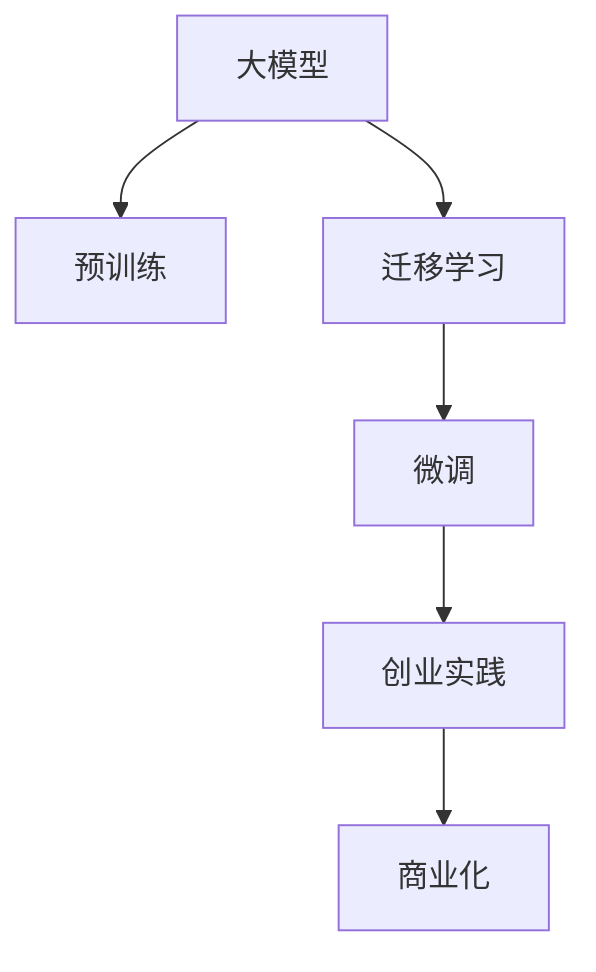

                 

## 1. 背景介绍

在人工智能(AI)领域，大模型已经成为了一种趋势。通过预训练的方式，大模型能够在各种任务中表现出色。然而，在实际应用中，如何将大模型商业化、进行有效的创业实践，却是一个值得探讨的问题。本文将通过深入浅出的讲解，帮助读者理解AI大模型创业的核心原理、实施步骤、注意事项以及未来发展方向。

## 2. 核心概念与联系

### 2.1 核心概念概述

在AI大模型创业中，涉及到的核心概念包括：

- **大模型**：指通过大规模无标签数据预训练得到的高性能模型，如BERT、GPT-3、T5等。
- **迁移学习**：指在预训练模型的基础上，使用下游任务的少量标注数据进行微调，以适应特定任务。
- **微调**：指通过有监督的方式，使用下游任务的标注数据对大模型进行训练，以提升模型在特定任务上的表现。
- **创业实践**：指通过将大模型应用到实际业务场景中，解决具体问题，形成可复制、可商业化的解决方案。
- **商业化**：指通过技术、产品、服务等方式，将AI大模型转化为商业价值，创造收入。

这些概念之间存在紧密的联系。通过预训练和微调，大模型能够在各种任务中表现出色；通过创业实践，可以将大模型应用到实际业务场景中，解决具体问题；而商业化则是将这些应用成果转化为商业价值，形成可持续的商业模式。

### 2.2 核心概念原理和架构的 Mermaid 流程图



## 3. 核心算法原理 & 具体操作步骤

### 3.1 算法原理概述

AI大模型创业的核心在于将大模型的预训练能力与实际业务需求结合起来，形成可商业化的解决方案。其核心算法原理包括：

- **预训练**：使用大规模无标签数据，训练得到高性能大模型。
- **迁移学习**：在大模型基础上，使用下游任务的少量标注数据进行微调，提升模型在该任务上的性能。
- **创业实践**：将微调后的模型应用到具体业务场景中，解决实际问题。
- **商业化**：通过技术、产品、服务等方式，将大模型应用转化为商业价值。

### 3.2 算法步骤详解

AI大模型创业的具体操作步骤包括：

1. **选择合适的预训练模型**：根据业务需求选择合适的预训练模型，如BERT、GPT-3、T5等。
2. **准备下游任务数据**：收集并准备下游任务的少量标注数据，作为微调的监督信号。
3. **微调模型**：使用下游任务的标注数据对预训练模型进行微调，提升模型在该任务上的性能。
4. **创业实践**：将微调后的模型应用到具体业务场景中，解决实际问题。
5. **商业化**：通过技术、产品、服务等方式，将大模型应用转化为商业价值。

### 3.3 算法优缺点

AI大模型创业的算法优缺点如下：

- **优点**：
  - 预训练模型具备强大的通用能力，能够适应多种任务。
  - 微调过程简单高效，能够快速提升模型在特定任务上的性能。
  - 创业实践可以迅速将模型应用到具体业务场景中，解决实际问题。
  - 商业化过程可以创造巨大的商业价值，形成可复制、可持续的商业模式。

- **缺点**：
  - 需要大量的预训练和微调数据，成本较高。
  - 微调过程中可能存在过拟合问题，需要精心设计正则化技术。
  - 创业实践中需要不断迭代优化，形成稳定的解决方案。
  - 商业化过程中可能面临市场竞争、法律法规等多重挑战。

### 3.4 算法应用领域

AI大模型创业在多个领域中具有广泛的应用前景，包括但不限于：

- **自然语言处理(NLP)**：如智能客服、机器翻译、情感分析等。
- **计算机视觉(CV)**：如图像识别、视频分析、人脸识别等。
- **语音识别和处理**：如语音翻译、语音合成等。
- **推荐系统**：如电商推荐、内容推荐等。
- **医疗健康**：如疾病预测、基因分析等。
- **金融科技**：如信用评分、欺诈检测等。

## 4. 数学模型和公式 & 详细讲解 & 举例说明

### 4.1 数学模型构建

AI大模型创业的数学模型主要涉及预训练、迁移学习、微调等过程。以BERT模型为例，其预训练目标函数为：

$$
\mathcal{L}_{pre} = \frac{1}{2N} \sum_{i=1}^N (2C(x_i) - C(y_i) - C(-y_i))
$$

其中，$C(x_i)$ 表示模型在输入 $x_i$ 上的预测结果，$C(y_i)$ 和 $C(-y_i)$ 分别表示模型在正样本和负样本上的预测结果。

### 4.2 公式推导过程

在大模型创业过程中，主要涉及的公式推导包括预训练目标函数的推导、迁移学习目标函数的推导、微调目标函数的推导等。以BERT模型为例，其迁移学习目标函数为：

$$
\mathcal{L}_{mig} = \frac{1}{N} \sum_{i=1}^N \ell(M_{\theta}(x_i),y_i)
$$

其中，$\ell$ 表示损失函数，$M_{\theta}(x_i)$ 表示模型在输入 $x_i$ 上的预测结果。

### 4.3 案例分析与讲解

以智能客服系统为例，我们可以使用BERT模型进行预训练，然后将其应用到智能客服的微调任务中，提升模型对客户咨询的理解能力。具体步骤如下：

1. **预训练模型选择**：选择BERT模型作为预训练模型。
2. **下游任务数据准备**：收集客户咨询的历史数据，准备标注数据集。
3. **微调模型训练**：使用客户咨询的历史数据对BERT模型进行微调，提升模型在智能客服任务上的性能。
4. **创业实践应用**：将微调后的模型应用到实际业务场景中，构建智能客服系统。
5. **商业化推广**：通过技术、产品、服务等方式，将智能客服系统推广到市场中，创造商业价值。

## 5. 项目实践：代码实例和详细解释说明

### 5.1 开发环境搭建

在进行AI大模型创业实践时，需要搭建合适的开发环境。以下是一个基本的Python开发环境搭建流程：

1. **安装Python**：从官网下载并安装Python，建议选择最新版本。
2. **安装相关库**：安装所需的Python库，如TensorFlow、PyTorch、Keras等。
3. **安装BERT模型**：使用Hugging Face提供的预训练BERT模型。

### 5.2 源代码详细实现

以下是一个基于BERT模型的智能客服系统的实现代码示例：

```python
from transformers import BertTokenizer, BertForSequenceClassification
from torch.utils.data import DataLoader
import torch

# 定义模型和分词器
model = BertForSequenceClassification.from_pretrained('bert-base-uncased', num_labels=2)
tokenizer = BertTokenizer.from_pretrained('bert-base-uncased')

# 加载数据集
train_data = # 训练数据集
dev_data = # 验证数据集
test_data = # 测试数据集

# 构建数据集
train_dataset = # 训练数据集
dev_dataset = # 验证数据集
test_dataset = # 测试数据集

# 构建模型
device = 'cuda' if torch.cuda.is_available() else 'cpu'
model.to(device)

# 定义优化器和损失函数
optimizer = torch.optim.Adam(model.parameters(), lr=2e-5)
loss_fn = torch.nn.CrossEntropyLoss()

# 定义训练函数
def train_epoch(model, dataset, batch_size, optimizer):
    model.train()
    total_loss = 0
    for batch in DataLoader(dataset, batch_size=batch_size, shuffle=True):
        inputs, labels = batch
        inputs = inputs.to(device)
        labels = labels.to(device)
        optimizer.zero_grad()
        outputs = model(inputs)
        loss = loss_fn(outputs, labels)
        loss.backward()
        optimizer.step()
        total_loss += loss.item()
    return total_loss / len(dataset)

# 定义评估函数
def evaluate(model, dataset, batch_size):
    model.eval()
    total_loss = 0
    total_correct = 0
    for batch in DataLoader(dataset, batch_size=batch_size):
        inputs, labels = batch
        inputs = inputs.to(device)
        labels = labels.to(device)
        with torch.no_grad():
            outputs = model(inputs)
            loss = loss_fn(outputs, labels)
            total_loss += loss.item()
            total_correct += torch.argmax(outputs, dim=1) == labels
    acc = total_correct / len(dataset)
    return total_loss / len(dataset), acc

# 训练模型
epochs = 5
batch_size = 16

for epoch in range(epochs):
    train_loss, acc = train_epoch(model, train_dataset, batch_size, optimizer)
    print(f'Epoch {epoch+1}, train loss: {train_loss:.4f}, train acc: {acc:.4f}')

    dev_loss, dev_acc = evaluate(model, dev_dataset, batch_size)
    print(f'Epoch {epoch+1}, dev loss: {dev_loss:.4f}, dev acc: {dev_acc:.4f}')

# 测试模型
test_loss, test_acc = evaluate(model, test_dataset, batch_size)
print(f'Test loss: {test_loss:.4f}, test acc: {test_acc:.4f}')
```

### 5.3 代码解读与分析

在上述代码中，我们首先定义了BERT模型和分词器，然后加载了训练数据集、验证数据集和测试数据集。接下来，我们定义了训练函数和评估函数，用于在训练过程中计算损失和准确率。最后，我们进行了模型训练，并在测试集上评估了模型的性能。

## 6. 实际应用场景

### 6.1 智能客服系统

智能客服系统是大模型创业的一个重要应用场景。传统的客服系统依赖人工客服，成本高、效率低。而使用智能客服系统，可以大幅提升客户咨询体验和问题解决效率。具体应用包括：

1. **自然语言理解**：使用BERT等预训练模型，对客户咨询进行自然语言理解，提取关键信息。
2. **意图识别**：对客户咨询的意图进行识别，分类到不同的意图类型中。
3. **知识库检索**：根据客户咨询的意图，从知识库中检索相关问题及答案。
4. **自动回复**：基于检索结果和知识库中的模板，生成自动回复。

### 6.2 金融舆情监测

金融舆情监测是大模型创业的另一个重要应用场景。传统的舆情监测依赖人工分析和处理，效率低、成本高。而使用大模型，可以实时监测金融市场舆情，及时发现潜在的风险和机会。具体应用包括：

1. **新闻信息提取**：使用BERT等预训练模型，从金融新闻中提取关键信息。
2. **情感分析**：对金融新闻进行情感分析，判断其情感倾向是正面、负面还是中性。
3. **事件监测**：监测金融市场中的重大事件，如股票行情、政策变化等。
4. **风险预警**：根据舆情监测结果，及时预警潜在的金融风险。

### 6.3 个性化推荐系统

个性化推荐系统是大模型创业的第三个重要应用场景。传统的推荐系统依赖用户历史行为数据进行推荐，难以处理多维度的数据。而使用大模型，可以更全面地理解用户需求，提供更加精准的个性化推荐。具体应用包括：

1. **用户兴趣建模**：使用BERT等预训练模型，对用户的历史行为数据进行建模，提取用户兴趣。
2. **物品特征表示**：对物品的文本描述进行编码，生成物品的向量表示。
3. **推荐算法优化**：将用户兴趣和物品向量表示输入推荐模型，优化推荐算法。
4. **推荐结果展示**：根据推荐结果，向用户展示推荐内容。

### 6.4 未来应用展望

随着AI大模型技术的不断发展和应用场景的不断拓展，未来的应用前景广阔。以下是一些可能的未来应用场景：

1. **医疗健康**：使用大模型进行疾病预测、基因分析等，提升医疗服务的智能化水平。
2. **智能交通**：使用大模型进行交通流量预测、智能导航等，提升交通管理的智能化水平。
3. **智慧农业**：使用大模型进行农情预测、病虫害监测等，提升农业生产的智能化水平。
4. **环境保护**：使用大模型进行环境监测、生态保护等，提升环境保护的智能化水平。

## 7. 工具和资源推荐

### 7.1 学习资源推荐

1. **《深度学习》课程**：斯坦福大学提供的深度学习课程，涵盖深度学习的基本概念和算法。
2. **《TensorFlow官方文档》**：TensorFlow官方提供的详细文档，包括代码示例和API参考。
3. **《BERT论文》**：BERT模型的原论文，详细介绍了BERT模型的设计思想和实验结果。
4. **《BERT代码库》**：Hugging Face提供的BERT模型代码库，包含预训练模型和微调示例。
5. **Kaggle竞赛**：Kaggle平台上的AI竞赛，涵盖各种NLP和图像处理任务，提供丰富的数据集和模型资源。

### 7.2 开发工具推荐

1. **TensorFlow**：Google提供的深度学习框架，支持分布式计算和GPU加速。
2. **PyTorch**：Facebook提供的深度学习框架，支持动态计算图和GPU加速。
3. **Jupyter Notebook**：常用的Python代码开发环境，支持代码调试和可视化展示。
4. **Weights & Biases**：用于模型训练和实验跟踪的工具，可以记录和可视化模型训练过程中的各项指标。
5. **TensorBoard**：用于模型可视化展示的工具，可以生成各种图表和可视化效果。

### 7.3 相关论文推荐

1. **《Attention is All You Need》**：Transformer模型的原论文，详细介绍了Transformer的结构和算法。
2. **《BERT: Pre-training of Deep Bidirectional Transformers for Language Understanding》**：BERT模型的原论文，详细介绍了BERT模型的预训练和微调方法。
3. **《AdaLoRA: Adaptive Low-Rank Adaptation for Parameter-Efficient Fine-Tuning》**：介绍了AdaLoRA参数高效微调方法，可以在固定大部分预训练参数的情况下进行微调。
4. **《AdaGrad: An Adaptive Learning Rate Method》**：介绍了一种自适应学习率算法，可以用于优化深度学习模型的训练过程。

## 8. 总结：未来发展趋势与挑战

### 8.1 研究成果总结

通过以上分析，可以看出AI大模型创业具备广阔的发展前景。预训练模型具备强大的通用能力，微调过程简单高效，能够快速提升模型在特定任务上的性能，从而形成可商业化的解决方案。

### 8.2 未来发展趋势

未来AI大模型创业的发展趋势包括：

1. **模型规模增大**：随着算力成本的下降和数据规模的扩张，预训练模型将更加庞大，能够处理更加复杂的任务。
2. **应用场景多样化**：AI大模型将应用于更多领域，如医疗、金融、交通等。
3. **模型性能提升**：随着算法和算力的提升，预训练模型和微调模型的性能将不断提升。
4. **技术集成化**：大模型将与其他AI技术进行更深入的集成，如知识图谱、因果推理等。
5. **应用场景智能化**：AI大模型将更加智能地应用于实际场景，提供更加精准的解决方案。

### 8.3 面临的挑战

尽管AI大模型创业具有广阔的发展前景，但在实际应用中仍面临一些挑战：

1. **数据质量问题**：高质量的数据集是模型训练的基础，但获取高质量数据集的成本较高。
2. **模型泛化能力**：模型在特定任务上的性能提升可能受限于数据集的大小和分布。
3. **技术壁垒**：深度学习技术的高门槛使得初创企业面临技术挑战。
4. **市场竞争**：AI大模型创业领域竞争激烈，如何突破市场竞争是关键。
5. **法律法规**：AI大模型的应用可能面临法律法规的限制和挑战。

### 8.4 研究展望

未来AI大模型创业的研究展望包括：

1. **数据生成技术**：探索如何生成高质量的数据集，减少对标注数据的依赖。
2. **模型压缩技术**：探索如何压缩预训练模型，降低计算和存储成本。
3. **模型迁移技术**：探索如何实现跨领域模型的迁移，提升模型的泛化能力。
4. **模型优化技术**：探索如何优化模型的训练和推理过程，提升模型性能。
5. **模型应用技术**：探索如何更好地将模型应用于实际业务场景，提供高质量的解决方案。

总之，AI大模型创业是一个充满挑战但潜力巨大的领域，需要不断探索和创新，才能实现技术的突破和商业的成功。

## 9. 附录：常见问题与解答

### Q1: AI大模型创业的流程是怎样的？

**A**: AI大模型创业的流程包括选择合适的预训练模型、准备下游任务数据、微调模型、创业实践应用和商业化推广。具体来说，首先选择适合任务的预训练模型，然后使用下游任务的少量标注数据对其进行微调，提升模型在该任务上的性能。最后将微调后的模型应用到实际业务场景中，提供解决方案，并进行商业化推广，形成可复制、可持续的商业模式。

### Q2: AI大模型创业需要哪些关键技术？

**A**: AI大模型创业需要以下关键技术：

1. **预训练技术**：使用大规模无标签数据训练预训练模型，获得强大的通用能力。
2. **微调技术**：使用下游任务的少量标注数据对预训练模型进行微调，提升模型在该任务上的性能。
3. **创业实践技术**：将微调后的模型应用到具体业务场景中，解决实际问题。
4. **商业化技术**：通过技术、产品、服务等方式，将大模型应用转化为商业价值。

### Q3: AI大模型创业面临哪些挑战？

**A**: AI大模型创业面临以下挑战：

1. **数据质量问题**：高质量的数据集是模型训练的基础，但获取高质量数据集的成本较高。
2. **模型泛化能力**：模型在特定任务上的性能提升可能受限于数据集的大小和分布。
3. **技术壁垒**：深度学习技术的高门槛使得初创企业面临技术挑战。
4. **市场竞争**：AI大模型创业领域竞争激烈，如何突破市场竞争是关键。
5. **法律法规**：AI大模型的应用可能面临法律法规的限制和挑战。

### Q4: 如何选择合适的预训练模型？

**A**: 选择合适的预训练模型需要考虑以下几个因素：

1. **任务相关性**：选择与任务相关的预训练模型，如BERT适用于自然语言处理任务，GPT适用于生成任务。
2. **模型规模**：根据任务的复杂程度选择合适的模型规模，大规模模型适合处理复杂任务，小规模模型适合处理简单任务。
3. **模型性能**：根据任务的精度要求选择性能稳定的预训练模型。
4. **资源消耗**：根据计算资源和存储资源的情况选择合适的模型，避免资源浪费。

### Q5: 如何提高AI大模型的泛化能力？

**A**: 提高AI大模型的泛化能力需要以下几个步骤：

1. **数据增强**：使用数据增强技术扩充训练集，增加模型对数据的多样性适应能力。
2. **正则化**：使用正则化技术防止过拟合，提高模型泛化能力。
3. **迁移学习**：使用迁移学习技术，将模型在多个任务上的泛化能力进行迁移，提升模型泛化能力。
4. **多任务学习**：使用多任务学习技术，同时训练多个任务，提升模型泛化能力。
5. **对抗训练**：使用对抗训练技术，提高模型的鲁棒性和泛化能力。

---

作者：禅与计算机程序设计艺术 / Zen and the Art of Computer Programming

