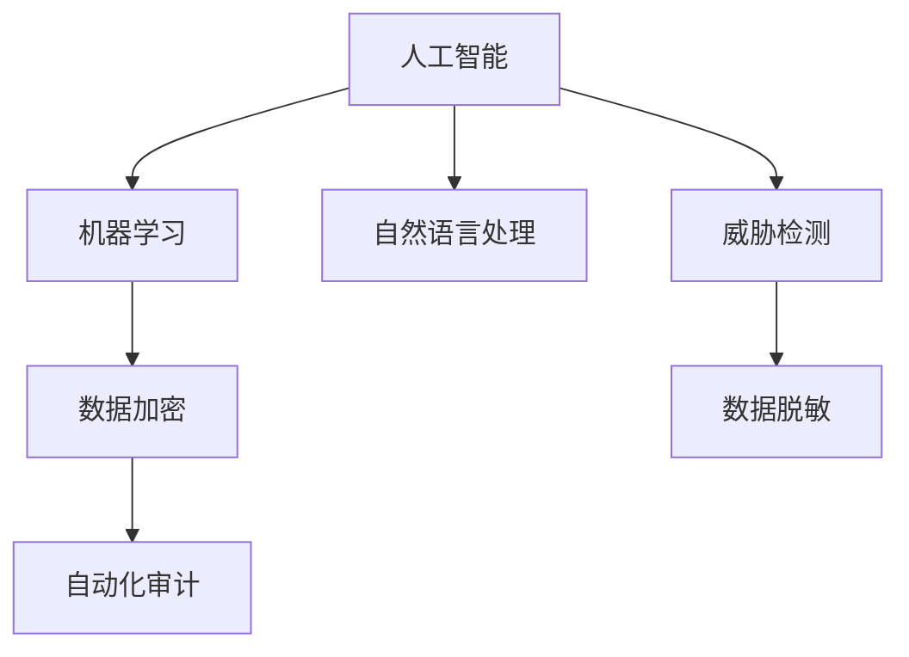

                 

# AI如何帮助电商企业进行用户数据安全风险管理

在数字化转型的浪潮下，电子商务企业积累了大量的用户数据，这些数据不仅关乎企业的商业成功，也牵涉到用户的隐私权益。如何利用AI技术，强化用户数据安全风险管理，是电商企业亟待解决的关键问题。本文将全面剖析AI在用户数据安全风险管理中的作用，详细介绍其实现机制、操作步骤、以及实际应用场景。

## 1. 背景介绍

### 1.1 问题由来
随着电子商务的迅猛发展，企业对用户数据的依赖日益加深。用户数据涉及个人隐私、交易记录、行为偏好等敏感信息，一旦泄露或滥用，不仅影响企业商誉，还可能对用户个人造成严重损失。而用户数据安全风险管理，正是为了保障用户数据的安全性和隐私性，降低风险，确保数据被合法、合理地使用。

近年来，随着人工智能技术的不断成熟，AI在数据安全风险管理领域展现出巨大的潜力。通过机器学习、自然语言处理、图像识别等技术，AI能够从海量数据中高效识别安全威胁，实时监控和预警潜在风险，有效提升电商企业的数据安全保障能力。

### 1.2 问题核心关键点
AI在用户数据安全风险管理中的核心关键点主要包括以下几个方面：

- 实时监控：利用机器学习模型，实时分析数据流量和访问行为，识别异常和威胁。
- 威胁检测：通过自然语言处理和图像识别技术，分析文本、图片、视频等数据，检测出潜在的安全威胁。
- 预警和响应：一旦检测到安全威胁，及时通过告警系统通知相关人员，并自动触发响应措施，如封锁账户、修改密码等。
- 数据加密和脱敏：利用AI对敏感数据进行加密和脱敏处理，确保数据在传输和存储过程中的安全性。
- 自动化审计和合规检查：使用AI对数据访问和使用情况进行自动化审计，确保符合相关法律法规和合规要求。

## 2. 核心概念与联系

### 2.1 核心概念概述

为更好地理解AI在用户数据安全风险管理中的作用，本节将介绍几个密切相关的核心概念：

- 人工智能(AI)：一种通过模拟人类智能行为，利用算法和模型解决复杂问题的技术。
- 机器学习(ML)：AI的一个分支，利用算法和模型从数据中自动学习和提取规律。
- 自然语言处理(NLP)：AI的一个应用领域，涉及对人类语言文字的理解、处理和生成。
- 威胁检测：识别和分析安全威胁的过程，利用各种技术手段检测潜在风险。
- 数据加密：通过算法将数据转换为难以理解的代码，确保数据在传输和存储过程中的安全性。
- 数据脱敏：对数据进行模糊处理，掩盖个人身份信息，确保数据在使用中的隐私性。
- 自动化审计：使用AI对数据访问和使用情况进行自动化审计，确保合规性。

这些核心概念之间的逻辑关系可以通过以下Mermaid流程图来展示：



这个流程图展示了几类核心概念及其之间的关系：

1. 人工智能通过机器学习、自然语言处理等技术手段，实现对数据的自动化处理和分析。
2. 威胁检测利用AI技术，从海量数据中识别潜在的安全威胁。
3. 数据加密和脱敏通过AI算法，保护数据在传输和存储过程中的安全性和隐私性。
4. 自动化审计使用AI对数据访问和使用情况进行实时监控和审计，确保合规性。

这些概念共同构成了AI在用户数据安全风险管理中的基础框架，使其能够高效地识别和应对安全威胁，保障用户数据的安全性和隐私性。

## 3. 核心算法原理 & 具体操作步骤
### 3.1 算法原理概述

AI在用户数据安全风险管理中的核心算法原理主要包括以下几个方面：

- 异常检测：利用机器学习模型，对用户行为和数据流量进行实时监控，识别异常和威胁。
- 威胁分类：通过自然语言处理技术，分析文本数据，分类识别各种安全威胁。
- 风险预警：使用AI模型，对威胁行为进行实时检测和评估，及时发出预警。
- 应急响应：自动化生成应对策略，如封锁账户、修改密码等，防止威胁扩散。

这些算法原理通过组合应用，形成了一套完整的AI用户数据安全风险管理框架，能够从数据流量的监控、安全威胁的检测、风险预警的及时响应，到应急响应的自动化生成，全方位保障用户数据的安全性和隐私性。

### 3.2 算法步骤详解

以下是AI在用户数据安全风险管理中的具体操作步骤：

**Step 1: 数据收集与预处理**

- 收集电商平台的用户行为数据、交易记录、访问日志等，作为数据输入。
- 对数据进行清洗、去重、标注等预处理操作，确保数据质量。

**Step 2: 异常检测与分析**

- 使用机器学习模型，对用户行为进行实时监控，识别异常和威胁。常用的模型包括异常检测算法、聚类算法等。
- 通过自然语言处理技术，分析文本数据，提取有价值的信息。常用的技术包括词向量、情感分析等。
- 对检测到的异常和威胁进行分类和评估，确定其风险等级。

**Step 3: 风险预警与响应**

- 使用AI模型，对识别到的威胁进行实时检测和评估，确定是否需要发出预警。
- 根据风险等级，自动触发相应的应急响应措施，如封锁账户、修改密码等。

**Step 4: 审计与合规检查**

- 使用AI对数据访问和使用情况进行实时监控和审计，确保符合相关法律法规和合规要求。
- 生成审计报告，记录和分析数据访问和使用情况，确保合规性。

### 3.3 算法优缺点

AI在用户数据安全风险管理中具有以下优点：

- 高效性：AI能够快速处理和分析大量数据，实时识别和响应安全威胁。
- 准确性：利用机器学习模型和大数据分析，AI能够精准识别和分类安全威胁。
- 自动化：通过AI自动化处理数据和生成应急响应措施，减少人工干预。
- 持续性：AI能够持续监控数据流量和访问行为，确保数据安全。

同时，AI在用户数据安全风险管理中也存在以下缺点：

- 依赖高质量数据：AI的准确性和效率依赖于输入数据的质量，数据标注不准确会影响模型效果。
- 算法复杂度：AI算法模型的复杂度较高，对计算资源和数据量有较高要求。
- 模型可解释性：一些AI模型的决策过程缺乏可解释性，难以理解和调试。
- 安全风险：AI模型自身可能存在漏洞，需要不断更新和优化，避免被攻击。

### 3.4 算法应用领域

AI在用户数据安全风险管理中的应用领域广泛，包括但不限于以下几个方面：

- 交易安全：监控交易行为，识别异常交易，防止欺诈和盗刷。
- 身份验证：通过AI进行身份识别和验证，保障用户身份安全。
- 数据保护：对敏感数据进行加密和脱敏处理，确保数据在传输和存储过程中的安全性。
- 合规审计：使用AI对数据访问和使用情况进行自动化审计，确保合规性。
- 欺诈检测：识别和防止各类欺诈行为，如假冒用户、虚假交易等。
- 行为分析：分析用户行为，识别潜在的安全威胁，提前预警。

## 4. 数学模型和公式 & 详细讲解 & 举例说明

### 4.1 数学模型构建

以下是AI在用户数据安全风险管理中的数学模型构建：

设用户行为数据集为 $\{(x_i, y_i)\}_{i=1}^N$，其中 $x_i$ 表示用户行为数据，$y_i$ 表示标注的安全风险标签。

定义异常检测模型为 $M(x) = [M_1(x), M_2(x), ..., M_k(x)]$，其中 $M_i(x)$ 表示第 $i$ 个异常检测模型，用于识别不同维度的异常行为。

定义威胁分类模型为 $C(x) = [C_1(x), C_2(x), ..., C_m(x)]$，其中 $C_i(x)$ 表示第 $i$ 个威胁分类模型，用于对文本数据进行分类。

定义风险预警模型为 $W(x, y) = [W_1(x, y), W_2(x, y), ..., W_n(x, y)]$，其中 $W_i(x, y)$ 表示第 $i$ 个风险预警模型，用于对威胁行为进行实时检测和评估。

定义应急响应模型为 $R(x, y) = [R_1(x, y), R_2(x, y), ..., R_k(x, y)]$，其中 $R_i(x, y)$ 表示第 $i$ 个应急响应模型，用于生成应对策略。

### 4.2 公式推导过程

以下是AI在用户数据安全风险管理中的公式推导过程：

**异常检测模型的训练**：
设异常检测模型的损失函数为 $\mathcal{L}_M$，使用交叉熵损失函数：
$$
\mathcal{L}_M = -\frac{1}{N}\sum_{i=1}^N \sum_{j=1}^{k} y_{ij}\log M_{j}(x_i) + (1-y_{ij})\log (1-M_{j}(x_i))
$$
其中 $y_{ij}$ 表示 $x_i$ 是否属于第 $j$ 个异常类别。

**威胁分类模型的训练**：
设威胁分类模型的损失函数为 $\mathcal{L}_C$，使用交叉熵损失函数：
$$
\mathcal{L}_C = -\frac{1}{N}\sum_{i=1}^N \sum_{j=1}^{m} y_{ij}\log C_{j}(x_i) + (1-y_{ij})\log (1-C_{j}(x_i))
$$
其中 $y_{ij}$ 表示 $x_i$ 是否属于第 $j$ 个威胁类别。

**风险预警模型的训练**：
设风险预警模型的损失函数为 $\mathcal{L}_W$，使用交叉熵损失函数：
$$
\mathcal{L}_W = -\frac{1}{N}\sum_{i=1}^N \sum_{j=1}^{n} y_{ij}\log W_{j}(x_i, y_i) + (1-y_{ij})\log (1-W_{j}(x_i, y_i))
$$
其中 $y_{ij}$ 表示 $(x_i, y_i)$ 是否属于第 $j$ 个风险预警类别。

**应急响应模型的训练**：
设应急响应模型的损失函数为 $\mathcal{L}_R$，使用交叉熵损失函数：
$$
\mathcal{L}_R = -\frac{1}{N}\sum_{i=1}^N \sum_{j=1}^{k} y_{ij}\log R_{j}(x_i, y_i) + (1-y_{ij})\log (1-R_{j}(x_i, y_i))
$$
其中 $y_{ij}$ 表示 $(x_i, y_i)$ 是否属于第 $j$ 个应急响应类别。

### 4.3 案例分析与讲解

以电商平台的交易安全为例，以下是AI在用户数据安全风险管理中的具体应用：

1. 异常检测：
   - 使用机器学习模型，对用户的交易行为进行实时监控，识别异常交易行为，如大额交易、异地交易等。
   - 异常检测模型的训练数据集包括正常交易记录和异常交易记录，通过对比分析，模型学习到正常交易的规律，识别出异常行为。

2. 威胁分类：
   - 通过自然语言处理技术，分析交易记录中的文本信息，提取有价值的信息。
   - 威胁分类模型使用词向量技术，将文本转换为向量表示，然后使用分类算法，如支持向量机、随机森林等，对文本进行分类。

3. 风险预警：
   - 实时监控交易行为，一旦检测到异常行为，立即使用风险预警模型进行评估。
   - 风险预警模型通过分析异常行为的特点，预测其是否构成安全威胁，如盗刷、欺诈等。

4. 应急响应：
   - 根据风险预警结果，自动触发应急响应措施，如封锁账户、修改密码等。
   - 应急响应模型使用决策树、规则引擎等技术，生成具体的应对策略。

通过以上案例，可以看出AI在用户数据安全风险管理中的高效性和自动化优势。

## 5. 项目实践：代码实例和详细解释说明
### 5.1 开发环境搭建

在进行AI用户数据安全风险管理实践前，我们需要准备好开发环境。以下是使用Python进行Keras和TensorFlow开发的环境配置流程：

1. 安装Anaconda：从官网下载并安装Anaconda，用于创建独立的Python环境。

2. 创建并激活虚拟环境：
```bash
conda create -n ai-env python=3.8 
conda activate ai-env
```

3. 安装Keras和TensorFlow：根据GPU版本，从官网获取对应的安装命令。例如：
```bash
pip install keras tensorflow-gpu -U
```

4. 安装各类工具包：
```bash
pip install numpy pandas scikit-learn matplotlib tqdm jupyter notebook ipython
```

完成上述步骤后，即可在`ai-env`环境中开始AI用户数据安全风险管理的实践。

### 5.2 源代码详细实现

这里我们以交易安全检测为例，给出使用Keras和TensorFlow进行AI用户数据安全风险管理的PyTorch代码实现。

首先，定义数据预处理函数：

```python
import pandas as pd
from sklearn.model_selection import train_test_split
from sklearn.preprocessing import MinMaxScaler
from tensorflow.keras.preprocessing.text import Tokenizer
from tensorflow.keras.preprocessing.sequence import pad_sequences

def preprocess_data(df, max_features=10000):
    # 文本特征
    X = df['text']
    
    # 标签特征
    y = df['label']
    
    # 分词
    tokenizer = Tokenizer(num_words=max_features, oov_token='<OOV>')
    tokenizer.fit_on_texts(X)
    X = tokenizer.texts_to_sequences(X)
    
    # 填充序列
    X = pad_sequences(X, maxlen=128, padding='post')
    
    # 归一化
    scaler = MinMaxScaler()
    y = scaler.fit_transform(y.reshape(-1, 1)).ravel()
    
    return X, y
```

然后，定义模型：

```python
from tensorflow.keras.models import Sequential
from tensorflow.keras.layers import Embedding, LSTM, Dense

def build_model(input_dim, output_dim):
    model = Sequential()
    model.add(Embedding(input_dim, 128, input_length=128))
    model.add(LSTM(64, dropout=0.2, recurrent_dropout=0.2))
    model.add(Dense(output_dim, activation='sigmoid'))
    
    model.compile(loss='binary_crossentropy', optimizer='adam', metrics=['accuracy'])
    return model
```

接着，加载数据并进行模型训练：

```python
from tensorflow.keras.utils import to_categorical

# 加载数据
df = pd.read_csv('data.csv')
X, y = preprocess_data(df)

# 划分训练集和测试集
X_train, X_test, y_train, y_test = train_test_split(X, y, test_size=0.2, random_state=42)

# 构建模型
model = build_model(input_dim=X_train.shape[1], output_dim=1)

# 训练模型
model.fit(X_train, to_categorical(y_train), epochs=10, batch_size=32, validation_data=(X_test, to_categorical(y_test)))
```

最后，使用模型进行预测：

```python
# 加载测试数据
test_df = pd.read_csv('test_data.csv')
X_test, y_test = preprocess_data(test_df)

# 进行预测
y_pred = model.predict(X_test)

# 输出结果
print(classification_report(y_test, y_pred))
```

以上就是使用Keras和TensorFlow进行交易安全检测的完整代码实现。可以看到，通过Python和深度学习框架，我们能够高效实现AI用户数据安全风险管理的具体应用。

### 5.3 代码解读与分析

让我们再详细解读一下关键代码的实现细节：

**preprocess_data函数**：
- 将文本数据转换为序列，填充至固定长度。
- 使用归一化技术，将标签数据缩放到0-1之间。

**build_model函数**：
- 定义了一个简单的LSTM模型，包含嵌入层、LSTM层和输出层。
- 使用二分类交叉熵损失函数和Adam优化器进行训练。

**训练和测试代码**：
- 将数据划分为训练集和测试集，使用交叉验证进行训练。
- 模型在训练集上进行训练，在测试集上进行验证，输出模型性能指标。

通过以上代码，我们展示了AI用户数据安全风险管理的实现流程。开发者可以将这些方法应用于其他领域，如身份验证、数据保护、合规审计等，以实现全方位的安全防护。

## 6. 实际应用场景
### 6.1 交易安全检测

电商平台的交易安全是用户数据安全风险管理中的重要环节。通过AI技术，可以实时监控交易行为，识别异常交易，防止欺诈和盗刷。

具体而言，可以收集电商平台的交易数据，通过预处理和特征提取，构建异常检测和威胁分类模型。通过实时监控交易行为，及时检测出异常交易和潜在威胁，并发出预警，自动触发应急响应措施，如封锁账户、修改密码等。

### 6.2 身份验证

身份验证是保障用户数据安全的重要手段。通过AI技术，可以提高身份验证的准确性和安全性。

具体而言，可以收集用户登录数据，构建身份验证模型。通过实时监控登录行为，识别出异常登录尝试，并发出预警。一旦检测到可疑行为，自动锁定账户或启用多因素认证，确保用户身份安全。

### 6.3 数据保护

数据保护是用户数据安全风险管理中的关键环节。通过AI技术，可以对敏感数据进行加密和脱敏处理，确保数据在传输和存储过程中的安全性。

具体而言，可以收集敏感数据，使用加密算法进行加密处理。通过分布式存储技术，对加密数据进行安全存储。在数据传输过程中，使用脱敏技术，掩盖个人身份信息，确保数据在传输过程中的隐私性。

### 6.4 合规审计

合规审计是用户数据安全风险管理中的重要手段。通过AI技术，可以自动化审计数据访问和使用情况，确保符合相关法律法规和合规要求。

具体而言，可以收集数据访问日志，构建审计模型。通过实时监控数据访问情况，识别出违规行为，并发出预警。一旦检测到违规行为，自动记录审计日志，生成审计报告，并通知相关部门进行调查和处理。

### 6.5 欺诈检测

欺诈检测是保障用户数据安全的重要环节。通过AI技术，可以识别和防止各类欺诈行为，如假冒用户、虚假交易等。

具体而言，可以收集交易数据，构建欺诈检测模型。通过实时监控交易行为，识别出欺诈行为，并发出预警。一旦检测到欺诈行为，自动触发应急响应措施，如封锁账户、修改密码等，防止欺诈行为扩散。

### 6.6 行为分析

行为分析是用户数据安全风险管理中的重要手段。通过AI技术，可以分析用户行为，识别潜在的安全威胁，提前预警。

具体而言，可以收集用户行为数据，构建行为分析模型。通过实时监控用户行为，识别出潜在的安全威胁，并发出预警。一旦检测到潜在威胁，自动采取相应措施，如提醒用户、限制操作等，避免安全威胁的发生。

## 7. 工具和资源推荐
### 7.1 学习资源推荐

为了帮助开发者系统掌握AI在用户数据安全风险管理中的理论基础和实践技巧，这里推荐一些优质的学习资源：

1. 《深度学习》系列书籍：由吴恩达教授等著，全面介绍了深度学习的基本概念和经典模型。

2. 《机器学习实战》书籍：由Peter Harrington著，通过实际案例，介绍了机器学习算法和模型实现。

3. 《Python深度学习》书籍：由Francois Chollet著，介绍了使用Keras和TensorFlow实现深度学习的全过程。

4. CS229《机器学习》课程：斯坦福大学开设的机器学习课程，有Lecture视频和配套作业，系统讲解机器学习理论和算法。

5. CS231n《卷积神经网络》课程：斯坦福大学开设的计算机视觉课程，介绍了卷积神经网络在图像识别中的运用。

通过这些资源的学习，相信你一定能够快速掌握AI在用户数据安全风险管理中的精髓，并用于解决实际的NLP问题。

### 7.2 开发工具推荐

高效的开发离不开优秀的工具支持。以下是几款用于AI用户数据安全风险管理开发的常用工具：

1. Keras：一个高效易用的深度学习框架，支持快速迭代研究。Keras提供了丰富的神经网络模块，适合构建各种AI模型。

2. TensorFlow：由Google主导开发的开源深度学习框架，生产部署方便，适合大规模工程应用。TensorFlow支持分布式计算和GPU加速，性能卓越。

3. Scikit-learn：一个基于Python的机器学习库，提供了丰富的机器学习算法和模型实现。

4. Pandas：一个数据分析库，支持高效的数据处理和分析操作，适合进行数据清洗和特征提取。

5. PyTorch：由Facebook主导开发的深度学习框架，灵活易用，适合快速迭代研究。PyTorch支持动态计算图，灵活度较高。

6. Jupyter Notebook：一个开源的交互式笔记本环境，支持多语言编程，适合快速开发和调试AI模型。

合理利用这些工具，可以显著提升AI用户数据安全风险管理的开发效率，加快创新迭代的步伐。

### 7.3 相关论文推荐

AI在用户数据安全风险管理领域的研究已经取得了丰硕成果。以下是几篇奠基性的相关论文，推荐阅读：

1. Adversarial Machine Learning（对抗机器学习）：指攻击者通过修改输入数据，使机器学习模型产生错误预测的攻击手段。了解对抗攻击的原理和防御方法，对保障模型安全具有重要意义。

2. SafeGAN: Certified Defenses against Adversarial Examples：提出一种安全的生成对抗网络（GAN）模型，能够在对抗攻击下保持模型性能稳定。

3. Deep Speech: Scalable End-to-End Speech Recognition Using Convolutional Neural Networks：介绍了一种使用卷积神经网络实现语音识别的深度学习模型，展示了深度学习在语音识别中的应用。

4. SIFT: Scalable Information Flow Tracking：提出了一种信息流跟踪技术，能够实时监控数据访问和使用情况，确保数据安全。

5. Robust RNNs to Semantic Attacks with Controlled Language Model Outputs：提出了一种鲁棒的RNN模型，能够在语言攻击下保持模型稳定。

这些论文代表了大语言模型微调技术的发展脉络。通过学习这些前沿成果，可以帮助研究者把握学科前进方向，激发更多的创新灵感。

## 8. 总结：未来发展趋势与挑战

### 8.1 总结

本文对AI在用户数据安全风险管理中的作用进行了全面系统的介绍。首先阐述了AI技术在用户数据安全风险管理中的重要性，明确了AI技术的核心应用场景。其次，从原理到实践，详细讲解了AI在用户数据安全风险管理中的实现机制和操作步骤，给出了具体的应用案例。最后，本文对AI在用户数据安全风险管理中的前景和挑战进行了分析，提出了未来发展的方向和思考。

通过本文的系统梳理，可以看到，AI在用户数据安全风险管理中具有高效、准确、自动化等优势，能够在实时监控、威胁检测、风险预警、应急响应等多个环节发挥重要作用。未来，随着AI技术的不断进步，用户数据安全风险管理将更加智能化、自动化，从而提升电商企业的安全防护能力，保障用户数据的安全性和隐私性。

### 8.2 未来发展趋势

展望未来，AI在用户数据安全风险管理中的发展趋势主要包括以下几个方面：

1. 模型融合：将多种AI技术（如机器学习、自然语言处理、图像识别等）融合，构建更加全面的安全防护体系。

2. 模型解释：引入可解释性技术，使AI模型的决策过程透明化，提高用户对AI技术的信任度。

3. 模型更新：定期更新AI模型，应对新的安全威胁和攻击手段，确保模型始终保持高效和稳定。

4. 模型优化：通过优化算法和架构，提升AI模型的效率和性能，降低资源消耗。

5. 自动化部署：通过自动化工具和流程，简化AI模型的部署和维护，提高开发效率。

6. 跨领域应用：将AI技术应用于更多领域，如金融、医疗、政府等，构建安全防护屏障。

7. 数据共享：建立数据共享机制，促进多方合作，提高数据安全防护能力。

这些趋势表明，AI在用户数据安全风险管理中的作用将不断增强，成为保障数据安全的重要手段。

### 8.3 面临的挑战

尽管AI在用户数据安全风险管理中具有诸多优势，但在实际应用中也面临以下挑战：

1. 数据隐私：在数据收集和处理过程中，如何保护用户隐私，防止数据泄露，是一个重要问题。

2. 模型复杂度：AI模型的复杂度较高，需要大量的计算资源和数据量，对硬件和网络环境有较高要求。

3. 模型可解释性：一些AI模型的决策过程缺乏可解释性，难以理解和调试。

4. 对抗攻击：AI模型可能受到对抗攻击，导致模型失效，需要进行安全性检测和防御。

5. 合规性：AI模型需要符合法律法规和合规要求，需要在模型设计和训练过程中加入合规性考量。

6. 资源消耗：AI模型在推理和训练过程中，需要大量的计算资源和存储资源，成本较高。

7. 模型鲁棒性：AI模型需要具备一定的鲁棒性，能够应对各种复杂的攻击手段和环境变化。

8. 数据质量：AI模型的效果依赖于输入数据的质量，数据标注不准确会影响模型效果。

这些挑战需要多方共同努力，通过技术创新和政策支持，才能有效解决，确保AI在用户数据安全风险管理中的可靠性和安全性。

### 8.4 研究展望

面向未来，AI在用户数据安全风险管理中的研究展望主要包括以下几个方向：

1. 自适应学习：通过自适应学习技术，使AI模型能够不断学习和适应新的安全威胁和攻击手段。

2. 跨模态分析：将多种数据模态（如文本、图像、语音等）进行融合，构建更加全面的安全防护体系。

3. 异常检测：引入异常检测技术，通过分析数据流量和行为，及时发现和预警安全威胁。

4. 威胁溯源：通过威胁溯源技术，追踪安全攻击的来源和路径，提高安全防护能力。

5. 数据匿名化：通过数据匿名化技术，对敏感数据进行去标识化处理，确保数据隐私。

6. 数据增强：通过数据增强技术，增加训练数据的多样性和覆盖面，提高模型鲁棒性。

7. 模型集成：将多种AI模型进行集成，构建更加复杂和强大的安全防护体系。

8. 模型优化：通过优化算法和架构，提升AI模型的效率和性能，降低资源消耗。

9. 自动化工具：开发自动化工具和流程，简化AI模型的开发和部署，提高效率。

10. 跨领域应用：将AI技术应用于更多领域，构建安全防护屏障，促进多方合作。

这些研究方向的探索，必将引领AI在用户数据安全风险管理中的技术进步，推动用户数据安全防护能力的提升。

## 9. 附录：常见问题与解答

**Q1：AI在用户数据安全风险管理中的核心优势是什么？**

A: AI在用户数据安全风险管理中的核心优势主要包括：
1. 高效性：AI能够快速处理和分析大量数据，实时识别和响应安全威胁。
2. 准确性：利用机器学习模型和大数据分析，AI能够精准识别和分类安全威胁。
3. 自动化：通过AI自动化处理数据和生成应急响应措施，减少人工干预。
4. 持续性：AI能够持续监控数据流量和访问行为，确保数据安全。

**Q2：AI在用户数据安全风险管理中存在哪些局限性？**

A: AI在用户数据安全风险管理中也存在以下局限性：
1. 数据隐私：在数据收集和处理过程中，如何保护用户隐私，防止数据泄露，是一个重要问题。
2. 模型复杂度：AI模型的复杂度较高，需要大量的计算资源和数据量，对硬件和网络环境有较高要求。
3. 模型可解释性：一些AI模型的决策过程缺乏可解释性，难以理解和调试。
4. 对抗攻击：AI模型可能受到对抗攻击，导致模型失效，需要进行安全性检测和防御。
5. 合规性：AI模型需要符合法律法规和合规要求，需要在模型设计和训练过程中加入合规性考量。
6. 资源消耗：AI模型在推理和训练过程中，需要大量的计算资源和存储资源，成本较高。
7. 模型鲁棒性：AI模型需要具备一定的鲁棒性，能够应对各种复杂的攻击手段和环境变化。
8. 数据质量：AI模型的效果依赖于输入数据的质量，数据标注不准确会影响模型效果。

**Q3：AI在用户数据安全风险管理中的主要应用场景有哪些？**

A: AI在用户数据安全风险管理中的主要应用场景包括：
1. 交易安全检测：实时监控交易行为，识别异常交易，防止欺诈和盗刷。
2. 身份验证：提高身份验证的准确性和安全性，防止账户被盗用。
3. 数据保护：对敏感数据进行加密和脱敏处理，确保数据在传输和存储过程中的安全性。
4. 合规审计：自动化审计数据访问和使用情况，确保符合相关法律法规和合规要求。
5. 欺诈检测：识别和防止各类欺诈行为，如假冒用户、虚假交易等。
6. 行为分析：分析用户行为，识别潜在的安全威胁，提前预警。

**Q4：AI在用户数据安全风险管理中如何实现高效性？**

A: AI在用户数据安全风险管理中实现高效性的主要手段包括：
1. 实时监控：利用机器学习模型，对用户行为和数据流量进行实时监控，识别异常和威胁。
2. 快速训练：使用高效的训练算法和架构，快速训练出高效的AI模型。
3. 数据增强：通过数据增强技术，增加训练数据的多样性和覆盖面，提高模型鲁棒性。
4. 自动化部署：通过自动化工具和流程，简化AI模型的开发和部署，提高效率。

**Q5：AI在用户数据安全风险管理中如何进行威胁检测？**

A: AI在用户数据安全风险管理中进行威胁检测的主要手段包括：
1. 自然语言处理：利用自然语言处理技术，分析文本数据，提取有价值的信息。
2. 异常检测：使用机器学习模型，对用户行为进行实时监控，识别异常和威胁。
3. 威胁分类：通过分类算法，对文本数据进行分类，识别不同类型的威胁。
4. 特征提取：使用特征提取技术，从数据中提取有用的特征，提高威胁检测的准确性。

通过以上常见问题的解答，相信你对AI在用户数据安全风险管理中的核心优势、局限性、主要应用场景以及实现机制有了更加深刻的理解。

---

作者：禅与计算机程序设计艺术 / Zen and the Art of Computer Programming

