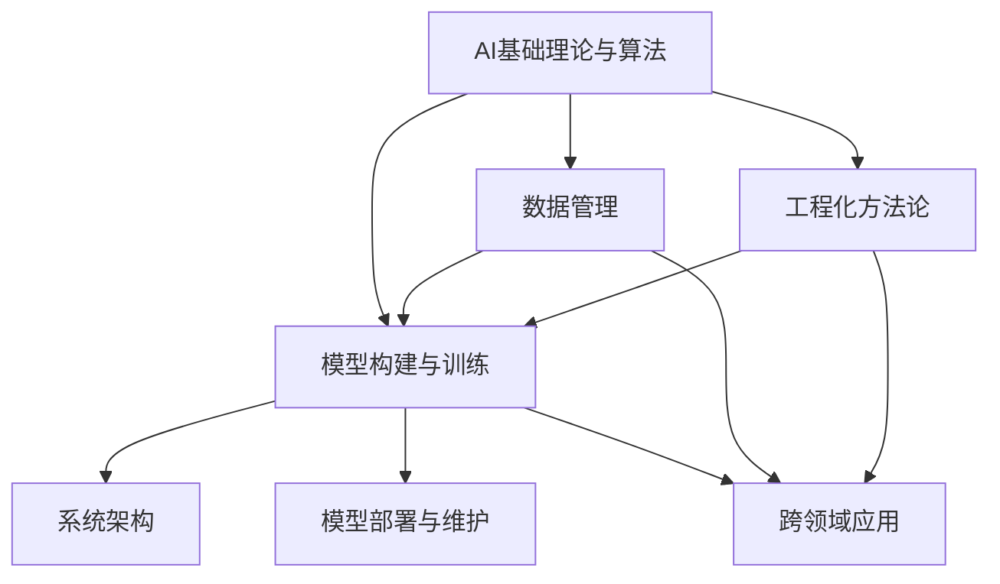

                 

# AI工程学：从理论到实践

## 1. 背景介绍

### 1.1 问题由来

人工智能(AI)已经成为现代社会的重要引擎，极大地推动了各行各业的发展。无论是无人驾驶、医疗诊断，还是金融风控、教育培训，AI技术无处不在。但如何让AI技术真正落地、创造价值，是摆在每一个AI从业者面前的难题。这就是AI工程学的核心议题。

AI工程学是一门将AI理论转化为实际应用的技术学科，旨在提供系统、高效、可行的AI解决方案。与传统软件工程学相比，AI工程学不仅包括算法实现、模型训练，还包括数据管理、系统架构、模型部署等诸多方面，更加强调工程化和实用性。

### 1.2 问题核心关键点

AI工程学的核心在于如何将AI理论高效转化为工程实践，解决AI在实际应用中的关键问题。具体而言，主要包括以下几个方面：

- **数据管理**：高质量的数据是AI模型训练的基石。AI工程学需要建立有效的数据管理机制，确保数据收集、存储、清洗、标注等环节的稳定性和高效性。

- **模型构建与训练**：从模型的选择、设计、调参到训练、评估、优化，AI工程学提供一套完整的解决方案，确保模型能够在最短时间内达到最优性能。

- **系统架构**：AI模型往往依赖于复杂的软件系统，如何设计高效、可扩展、可靠的系统架构，是AI工程学的核心任务之一。

- **模型部署与维护**：AI模型上线后，如何保证其稳定运行、高效服务、持续迭代，是AI工程学的关键挑战。

- **跨领域应用**：AI技术在不同领域的落地，需要结合具体应用场景进行优化和定制，AI工程学提供了通用的工程工具和方法，支持跨领域应用。

### 1.3 问题研究意义

AI工程学对于推动AI技术的广泛应用具有重要意义：

- **降低应用门槛**：通过系统化的工程方法，将复杂的AI技术转化为易用工具，降低开发和部署难度。
- **提高模型性能**：通过高效的数据管理、模型训练、系统优化等手段，提升AI模型在实际应用中的表现。
- **加速行业转型**：通过跨领域应用的优化，AI技术可以快速渗透到各行各业，推动数字化转型。
- **促进创新**：通过AI工程学的体系化方法，促进技术和应用的持续迭代，催生更多创新应用。
- **保障安全与伦理**：通过规范的工程实践，确保AI应用的安全性和伦理性，避免潜在的风险。

## 2. 核心概念与联系

### 2.1 核心概念概述

为更好地理解AI工程学的理论基础和实践方法，本节将介绍几个关键概念及其相互关系：

- **AI基础理论与算法**：包括机器学习、深度学习、强化学习等基本理论和算法，为AI工程实践提供理论支撑。
- **数据管理**：包括数据收集、存储、清洗、标注等环节，是AI模型训练的基础。
- **模型构建与训练**：从模型选择、设计、调参到训练、评估、优化，确保模型在实际应用中的性能。
- **系统架构**：设计高效、可扩展、可靠的系统架构，支持AI模型的部署与维护。
- **模型部署与维护**：确保AI模型在实际应用中的稳定运行和持续迭代。
- **跨领域应用**：将AI技术结合具体应用场景进行优化和定制，支持跨领域应用。
- **工程化方法论**：包括敏捷开发、持续集成、测试驱动开发等工程化方法，提升AI工程实践的效率和质量。

这些核心概念之间的逻辑关系可以通过以下Mermaid流程图来展示：



这个流程图展示了AI工程学的各个核心概念及其相互关系：

1. AI基础理论与算法为AI工程实践提供理论支撑。
2. 数据管理是AI模型训练的基础。
3. 模型构建与训练确保模型在实际应用中的性能。
4. 系统架构支持AI模型的部署与维护。
5. 模型部署与维护确保AI模型在实际应用中的稳定运行和持续迭代。
6. 跨领域应用将AI技术结合具体应用场景进行优化和定制。
7. 工程化方法论提升AI工程实践的效率和质量。

这些概念共同构成了AI工程学的完整框架，为AI技术的实际应用提供了有力的支撑。

## 3. 核心算法原理 & 具体操作步骤
### 3.1 算法原理概述

AI工程学的核心在于将AI基础理论与算法高效转化为工程实践。具体而言，包括以下几个关键步骤：

1. **数据管理**：通过有效的数据收集、存储、清洗、标注等环节，确保数据的高质量和多样性。
2. **模型构建与训练**：选择合适的模型架构，设计合理的训练流程，确保模型在实际应用中的性能。
3. **系统架构设计**：设计高效、可扩展、可靠的系统架构，支持AI模型的部署与维护。
4. **模型部署与维护**：确保AI模型在实际应用中的稳定运行和持续迭代。
5. **跨领域应用优化**：将AI技术结合具体应用场景进行优化和定制，支持跨领域应用。
6. **工程化方法论**：采用敏捷开发、持续集成、测试驱动开发等工程化方法，提升AI工程实践的效率和质量。

这些步骤形成一个完整的闭环，确保AI技术在实际应用中的高效、稳定、可扩展和可维护性。

### 3.2 算法步骤详解

以下是对AI工程学核心步骤的详细介绍：

**Step 1: 数据管理**

数据管理是AI工程学的基石，包括以下几个关键环节：

1. **数据收集**：从不同渠道收集高质量的数据，确保数据的多样性和代表性。
2. **数据存储**：选择合适的存储方式，确保数据的可访问性和持久性。
3. **数据清洗**：去除噪音数据和异常值，确保数据的质量和一致性。
4. **数据标注**：对数据进行标签化，便于后续的模型训练和评估。

数据管理的关键在于确保数据的可用性和质量。通过有效的数据管理，可以为AI模型的训练和优化提供坚实的基础。

**Step 2: 模型构建与训练**

模型构建与训练是AI工程学的核心环节，包括以下几个关键步骤：

1. **模型选择与设计**：根据具体应用场景选择合适的模型架构和算法，设计合理的模型结构。
2. **模型调参与优化**：通过交叉验证、网格搜索、贝叶斯优化等方法，确定模型参数的最佳值。
3. **模型训练与评估**：选择合适的优化器和损失函数，确保模型在训练集和验证集上的性能。
4. **模型融合与集成**：采用模型融合和集成方法，提升模型的整体性能和泛化能力。

模型构建与训练的关键在于确保模型的性能和泛化能力。通过有效的模型构建与训练，可以为AI应用提供可靠的预测和决策支持。

**Step 3: 系统架构设计**

系统架构设计是AI工程学的重要组成部分，包括以下几个关键环节：

1. **系统设计**：设计高效、可扩展、可靠的系统架构，支持AI模型的部署与维护。
2. **服务编排**：通过API、微服务等方式，将AI模型和其他服务进行有效集成。
3. **数据管道**：设计数据管道，确保数据的高效传输和处理。
4. **监控与告警**：实时监控系统运行状态，设置异常告警阈值，确保系统稳定性。

系统架构设计的关键在于确保系统的可靠性和高效性。通过有效的系统架构设计，可以为AI应用提供稳定、高效的服务。

**Step 4: 模型部署与维护**

模型部署与维护是AI工程学的最终环节，包括以下几个关键步骤：

1. **模型部署**：将训练好的模型部署到生产环境，确保模型的高效运行。
2. **模型监控**：实时监控模型运行状态，确保模型的稳定性和准确性。
3. **模型更新**：定期更新模型，确保模型性能的持续提升。
4. **模型回滚**：在模型出现问题时，能够快速回滚到之前的稳定版本，保障系统连续性。

模型部署与维护的关键在于确保模型的稳定性和连续性。通过有效的模型部署与维护，可以为AI应用提供持续、稳定的服务。

**Step 5: 跨领域应用优化**

跨领域应用优化是AI工程学的扩展环节，包括以下几个关键步骤：

1. **领域定制**：根据具体应用场景，对AI模型进行定制优化。
2. **数据融合**：将多源数据进行融合，提升AI模型的性能和鲁棒性。
3. **用户反馈**：通过用户反馈，不断优化AI模型和应用。
4. **技术创新**：采用最新的技术手段，提升AI模型的性能和用户体验。

跨领域应用优化的关键在于确保AI应用在具体场景中的高性能和用户体验。通过有效的跨领域应用优化，可以为AI应用提供更加多样化和高效的服务。

**Step 6: 工程化方法论**

工程化方法论是AI工程学的重要保障，包括以下几个关键环节：

1. **敏捷开发**：采用敏捷开发方法，快速迭代和优化AI模型和应用。
2. **持续集成**：通过持续集成，确保代码的质量和稳定性。
3. **测试驱动开发**：采用测试驱动开发方法，确保模型的准确性和鲁棒性。
4. **自动化测试**：采用自动化测试工具，提升测试效率和覆盖率。

工程化方法论的关键在于确保AI工程实践的高效和质量。通过有效的工程化方法论，可以为AI应用提供可靠、高效的开发和维护支持。

### 3.3 算法优缺点

AI工程学作为一种工程化方法，具有以下优点和缺点：

**优点**：

1. **系统化方法**：通过系统化的工程方法，将复杂的AI技术转化为易用工具，降低了开发和部署难度。
2. **高效性**：通过有效的数据管理、模型训练、系统优化等手段，提升AI模型在实际应用中的表现。
3. **跨领域应用**：将AI技术结合具体应用场景进行优化和定制，支持跨领域应用。
4. **工程化方法论**：采用敏捷开发、持续集成、测试驱动开发等工程化方法，提升AI工程实践的效率和质量。

**缺点**：

1. **高成本**：AI工程学的开发和部署成本较高，需要大量的数据、算法和人力资源。
2. **技术门槛高**：AI工程学涉及多领域知识，技术门槛较高，需要系统的学习和实践。
3. **数据隐私和安全**：在数据管理和应用过程中，需要严格遵守数据隐私和安全法规。

尽管存在这些缺点，AI工程学作为AI技术落地应用的重要手段，对于推动AI技术的广泛应用具有不可替代的作用。

### 3.4 算法应用领域

AI工程学在多个领域得到了广泛应用，包括以下几个主要方向：

- **智能医疗**：通过AI技术辅助诊断、药物研发、患者管理等，提升医疗服务的质量和效率。
- **金融风控**：通过AI技术进行信用评估、欺诈检测、风险管理等，提升金融服务的稳定性和安全性。
- **智能制造**：通过AI技术进行设备监控、生产调度、质量控制等，提升制造业的智能化和自动化水平。
- **智慧城市**：通过AI技术进行交通管理、环境监测、公共安全等，提升城市管理的智能化和高效性。
- **教育培训**：通过AI技术进行个性化推荐、智能辅导、学习分析等，提升教育培训的针对性和效果。

除了这些主要方向，AI工程学还广泛应用于各种行业领域，推动了社会的数字化转型和智能化升级。

## 4. 数学模型和公式 & 详细讲解 & 举例说明
### 4.1 数学模型构建

AI工程学涉及多个领域的数学模型和公式，这里以机器学习和深度学习为例进行介绍：

**机器学习模型**：

机器学习模型主要分为监督学习、无监督学习和半监督学习三类。常见的机器学习模型包括线性回归、逻辑回归、决策树、随机森林、支持向量机、K近邻等。

以线性回归为例，其数学模型为：

$$
y = \beta_0 + \beta_1 x_1 + \beta_2 x_2 + ... + \beta_n x_n
$$

其中，$y$为输出变量，$x_1, x_2, ..., x_n$为输入变量，$\beta_0, \beta_1, ..., \beta_n$为模型参数。

**深度学习模型**：

深度学习模型主要包括神经网络、卷积神经网络、循环神经网络等。以神经网络为例，其数学模型为：

$$
\mathcal{L}(\theta) = \frac{1}{N} \sum_{i=1}^N \ell(y_i, \hat{y}_i)
$$

其中，$\theta$为模型参数，$y_i$为真实标签，$\hat{y}_i$为模型预测输出，$\ell$为损失函数。

### 4.2 公式推导过程

以下是对线性回归和神经网络模型的推导过程：

**线性回归**：

线性回归的目标是最小化损失函数，通常采用均方误差（MSE）作为损失函数。其推导过程如下：

$$
\mathcal{L}(\theta) = \frac{1}{2N} \sum_{i=1}^N (y_i - \hat{y}_i)^2
$$

通过梯度下降算法，求解损失函数的最小值，即：

$$
\theta = \mathop{\arg\min}_{\theta} \mathcal{L}(\theta)
$$

通过求解上述优化问题，可以得到模型参数$\theta$的值。

**神经网络**：

神经网络的推导过程更加复杂，通常采用反向传播算法（Backpropagation）进行优化。其关键在于通过链式法则，计算损失函数对每个模型参数的梯度，即：

$$
\frac{\partial \mathcal{L}}{\partial \theta_i} = \frac{\partial \mathcal{L}}{\partial z_i} \frac{\partial z_i}{\partial w_{ij}} \frac{\partial w_{ij}}{\partial \theta_i}
$$

其中，$z_i$为神经元的输出，$w_{ij}$为神经元之间的连接权重。通过上述推导过程，可以得到模型参数的更新公式，进行模型训练。

### 4.3 案例分析与讲解

以神经网络模型为例，其训练和优化过程如下：

1. **数据准备**：收集训练数据，进行预处理和归一化。
2. **模型选择**：选择合适的神经网络结构，如全连接网络、卷积神经网络、循环神经网络等。
3. **模型训练**：通过前向传播和反向传播，计算损失函数和梯度，更新模型参数。
4. **模型评估**：在验证集上评估模型性能，调整模型超参数，避免过拟合。
5. **模型部署**：将训练好的模型部署到生产环境，进行实时推理和预测。

通过上述步骤，可以有效训练和优化神经网络模型，提升其在实际应用中的表现。

## 5. 项目实践：代码实例和详细解释说明
### 5.1 开发环境搭建

在进行AI工程学实践前，我们需要准备好开发环境。以下是使用Python进行TensorFlow开发的环境配置流程：

1. 安装Anaconda：从官网下载并安装Anaconda，用于创建独立的Python环境。

2. 创建并激活虚拟环境：
```bash
conda create -n tf-env python=3.8 
conda activate tf-env
```

3. 安装TensorFlow：根据CUDA版本，从官网获取对应的安装命令。例如：
```bash
conda install tensorflow=2.5 -c pytorch -c conda-forge
```

4. 安装各类工具包：
```bash
pip install numpy pandas scikit-learn matplotlib tqdm jupyter notebook ipython
```

完成上述步骤后，即可在`tf-env`环境中开始AI工程学实践。

### 5.2 源代码详细实现

这里以TensorFlow实现线性回归为例，给出完整的代码实现。

```python
import tensorflow as tf
import numpy as np
import matplotlib.pyplot as plt

# 准备数据
X = np.array([[1], [2], [3], [4], [5]])
y = np.array([[1], [2], [3], [4], [5]])

# 定义模型
theta = tf.Variable(tf.random.normal([1, 1]))
x = tf.placeholder(tf.float32, shape=[None, 1])
y_pred = tf.matmul(x, theta)

# 定义损失函数
loss = tf.reduce_mean(tf.square(y_pred - y))

# 定义优化器
optimizer = tf.train.GradientDescentOptimizer(learning_rate=0.01)
train_op = optimizer.minimize(loss)

# 训练模型
with tf.Session() as sess:
    sess.run(tf.global_variables_initializer())
    for i in range(1000):
        sess.run(train_op)
        if i % 100 == 0:
            loss_val = sess.run(loss, feed_dict={x: X, y: y})
            plt.plot(i, loss_val, 'ro')
            plt.draw()
            plt.pause(0.01)
    plt.show()
```

### 5.3 代码解读与分析

让我们再详细解读一下关键代码的实现细节：

**数据准备**：

使用NumPy生成训练数据`X`和标签`y`。`X`为输入特征，`y`为输出标签。

**模型定义**：

定义线性回归模型，包括模型参数`theta`和输入特征`x`，输出预测值`y_pred`。

**损失函数定义**：

使用均方误差作为损失函数，计算预测值和真实标签之间的差异。

**优化器定义**：

选择梯度下降优化器，并设置学习率。

**训练过程**：

通过前向传播和反向传播，计算损失函数和梯度，更新模型参数。使用TensorFlow的Session进行模型训练，每100次迭代记录一次损失函数值，并绘制损失函数变化曲线。

通过上述步骤，可以有效地训练线性回归模型，提升其在实际应用中的表现。

## 6. 实际应用场景
### 6.1 智能医疗

AI工程学在智能医疗领域具有广泛应用，主要包括疾病诊断、药物研发、患者管理等方面。通过AI技术，可以大幅提升医疗服务的质量和效率。

以疾病诊断为例，AI工程学可以通过图像识别、自然语言处理等技术，对医学影像、病历等进行分析和诊断。具体实现如下：

1. **数据准备**：收集医学影像、病历等数据，进行预处理和标注。
2. **模型选择与训练**：选择适合的深度学习模型，如卷积神经网络（CNN）、循环神经网络（RNN）等，进行模型训练。
3. **模型评估**：在验证集上评估模型性能，调整模型超参数，避免过拟合。
4. **模型部署**：将训练好的模型部署到医院、诊所等医疗机构，进行实时诊断和预测。

通过上述步骤，可以有效提升疾病诊断的准确性和效率，推动智能医疗的发展。

### 6.2 金融风控

金融风控是AI工程学的另一个重要应用领域，主要包括信用评估、欺诈检测、风险管理等。通过AI技术，可以大幅提升金融服务的稳定性和安全性。

以欺诈检测为例，AI工程学可以通过异常检测、序列分析等技术，对交易行为进行实时监控和预测。具体实现如下：

1. **数据准备**：收集交易记录、用户行为等数据，进行预处理和标注。
2. **模型选择与训练**：选择适合的机器学习模型，如支持向量机（SVM）、随机森林（Random Forest）等，进行模型训练。
3. **模型评估**：在验证集上评估模型性能，调整模型超参数，避免过拟合。
4. **模型部署**：将训练好的模型部署到金融系统，进行实时欺诈检测和预警。

通过上述步骤，可以有效提升欺诈检测的准确性和效率，保障金融系统的安全。

### 6.3 智能制造

AI工程学在智能制造领域具有广泛应用，主要包括设备监控、生产调度、质量控制等方面。通过AI技术，可以大幅提升制造业的智能化和自动化水平。

以设备监控为例，AI工程学可以通过机器学习、深度学习等技术，对设备运行数据进行分析和预测。具体实现如下：

1. **数据准备**：收集设备运行数据，进行预处理和标注。
2. **模型选择与训练**：选择适合的机器学习模型，如随机森林（Random Forest）、梯度提升树（Gradient Boosting Tree）等，进行模型训练。
3. **模型评估**：在验证集上评估模型性能，调整模型超参数，避免过拟合。
4. **模型部署**：将训练好的模型部署到生产设备，进行实时监控和预测。

通过上述步骤，可以有效提升设备监控的准确性和效率，推动智能制造的发展。

### 6.4 智慧城市

AI工程学在智慧城市领域具有广泛应用，主要包括交通管理、环境监测、公共安全等方面。通过AI技术，可以大幅提升城市管理的智能化和高效性。

以交通管理为例，AI工程学可以通过图像识别、自然语言处理等技术，对交通数据进行分析和预测。具体实现如下：

1. **数据准备**：收集交通流量、摄像头图像等数据，进行预处理和标注。
2. **模型选择与训练**：选择适合的深度学习模型，如卷积神经网络（CNN）、循环神经网络（RNN）等，进行模型训练。
3. **模型评估**：在验证集上评估模型性能，调整模型超参数，避免过拟合。
4. **模型部署**：将训练好的模型部署到交通管理系统，进行实时监控和预测。

通过上述步骤，可以有效提升交通管理的智能化和效率，推动智慧城市的发展。

## 7. 工具和资源推荐
### 7.1 学习资源推荐

为了帮助开发者系统掌握AI工程学的理论基础和实践技巧，这里推荐一些优质的学习资源：

1. **《深度学习》书籍**：由Goodfellow等著，全面介绍深度学习的理论基础和算法实现。
2. **《TensorFlow实战》书籍**：由Clevert等著，深入讲解TensorFlow的开发和应用。
3. **Google AI官方博客**：涵盖深度学习、机器学习、AI工程学等多个领域的最新研究进展和实践经验。
4. **Coursera AI课程**：提供多门AI领域的在线课程，涵盖深度学习、机器学习、自然语言处理等多个方向。
5. **Kaggle竞赛平台**：提供大量数据集和竞赛任务，供开发者实践和提升自己的AI技能。

通过对这些资源的学习实践，相信你一定能够快速掌握AI工程学的精髓，并用于解决实际的AI问题。
###  7.2 开发工具推荐

高效的开发离不开优秀的工具支持。以下是几款用于AI工程学开发的常用工具：

1. **Jupyter Notebook**：免费的交互式开发环境，支持Python、R等多种语言，适用于快速迭代和实验。
2. **PyCharm**：功能强大的Python IDE，提供丰富的开发工具和调试功能，适用于系统化的项目开发。
3. **TensorFlow**：开源深度学习框架，支持多种算法和模型，适用于大规模的模型训练和部署。
4. **Keras**：基于TensorFlow等框架的高层次API，支持快速搭建和训练模型，适用于快速原型开发。
5. **ModelScope**：提供大量的预训练模型和任务库，支持多种深度学习框架，适用于跨领域AI应用。

合理利用这些工具，可以显著提升AI工程学的开发效率，加快创新迭代的步伐。

### 7.3 相关论文推荐

AI工程学的快速发展离不开学界的持续研究。以下是几篇奠基性的相关论文，推荐阅读：

1. **《ImageNet Classification with Deep Convolutional Neural Networks》**：AlexNet的论文，提出深度卷积神经网络，推动了计算机视觉领域的进步。
2. **《Deep Learning》**：Goodfellow等著，全面介绍深度学习的理论基础和算法实现。
3. **《TensorFlow: A System for Large-Scale Machine Learning》**：TensorFlow的论文，介绍TensorFlow的架构和应用。
4. **《A Survey on Deep Learning Architectures and Applications》**：总结深度学习领域的主要架构和应用，为AI工程学提供理论基础。
5. **《Modeling Data-Driven Discovery in Datasets》**：探讨数据驱动发现的方法，为数据管理和AI工程学提供理论支持。

这些论文代表了大AI工程学的研究脉络。通过学习这些前沿成果，可以帮助研究者把握学科前进方向，激发更多的创新灵感。

## 8. 总结：未来发展趋势与挑战
### 8.1 研究成果总结

AI工程学是一门不断发展的学科，其研究成果在多个领域得到了广泛应用。以下是AI工程学的几个重要研究方向和成果：

1. **深度学习模型优化**：通过改进模型架构和优化算法，提升模型训练和推理效率。
2. **跨领域应用优化**：将AI技术结合具体应用场景进行优化和定制，支持跨领域应用。
3. **工程化方法论**：采用敏捷开发、持续集成、测试驱动开发等工程化方法，提升AI工程实践的效率和质量。
4. **多模态数据融合**：将多源数据进行融合，提升AI模型的性能和鲁棒性。
5. **自动化模型训练**：通过自动化模型训练和优化工具，提升模型训练和评估的效率和准确性。

这些研究方向和成果，为AI技术的落地应用提供了坚实的基础。

### 8.2 未来发展趋势

展望未来，AI工程学将呈现以下几个发展趋势：

1. **模型高效化**：通过模型剪枝、知识蒸馏、模型压缩等方法，提高模型训练和推理效率，降低硬件成本。
2. **数据智能化**：通过自动化数据标注、数据增强、数据合成等方法，提升数据质量和多样性。
3. **模型自动化**：通过自动化模型训练和优化工具，提升模型训练和评估的效率和准确性。
4. **跨领域应用拓展**：将AI技术结合更多应用场景，推动跨领域应用的广泛发展。
5. **工程化方法论创新**：采用新的工程化方法，如自动机器学习（AutoML）、元学习（Meta-Learning）等，提升AI工程实践的效率和质量。
6. **多模态数据融合**：将多源数据进行融合，提升AI模型的性能和鲁棒性。

这些趋势将推动AI工程学的发展，进一步提升AI技术在实际应用中的表现。

### 8.3 面临的挑战

尽管AI工程学已经取得了显著成果，但在迈向更加智能化、普适化应用的过程中，仍面临诸多挑战：

1. **数据隐私和安全**：在数据管理和应用过程中，需要严格遵守数据隐私和安全法规。
2. **技术门槛高**：AI工程学涉及多领域知识，技术门槛较高，需要系统的学习和实践。
3. **模型复杂度高**：大模型的训练和推理复杂度高，需要高效的硬件设备和算法支持。
4. **模型鲁棒性不足**：在实际应用中，模型面对域外数据时，泛化性能往往大打折扣。
5. **系统可扩展性差**：传统AI系统的可扩展性较差，难以应对大规模应用需求。
6. **伦理和法律问题**：AI应用可能带来伦理和法律问题，需要规范的监管机制。

这些挑战需要AI工程学界共同努力，不断突破技术瓶颈，推动AI技术的广泛应用。

### 8.4 研究展望

未来AI工程学的研究将更加注重以下几个方向：

1. **自动化模型训练**：通过自动化模型训练和优化工具，提升模型训练和评估的效率和准确性。
2. **跨领域应用拓展**：将AI技术结合更多应用场景，推动跨领域应用的广泛发展。
3. **多模态数据融合**：将多源数据进行融合，提升AI模型的性能和鲁棒性。
4. **模型高效化**：通过模型剪枝、知识蒸馏、模型压缩等方法，提高模型训练和推理效率，降低硬件成本。
5. **数据智能化**：通过自动化数据标注、数据增强、数据合成等方法，提升数据质量和多样性。
6. **工程化方法论创新**：采用新的工程化方法，如自动机器学习（AutoML）、元学习（Meta-Learning）等，提升AI工程实践的效率和质量。

这些研究方向将推动AI工程学的发展，进一步提升AI技术在实际应用中的表现。

## 9. 附录：常见问题与解答

**Q1：AI工程学的核心内容是什么？**

A: AI工程学的核心内容主要包括数据管理、模型构建与训练、系统架构设计、模型部署与维护、跨领域应用优化和工程化方法论。这些内容共同构成了AI技术的落地应用基础。

**Q2：AI工程学的应用领域有哪些？**

A: AI工程学在多个领域得到了广泛应用，主要包括智能医疗、金融风控、智能制造、智慧城市、教育培训等。

**Q3：AI工程学的发展趋势是什么？**

A: AI工程学的发展趋势包括模型高效化、数据智能化、自动化模型训练、跨领域应用拓展、工程化方法论创新、多模态数据融合等。

**Q4：AI工程学面临的主要挑战有哪些？**

A: AI工程学面临的主要挑战包括数据隐私和安全、技术门槛高、模型复杂度高、模型鲁棒性不足、系统可扩展性差、伦理和法律问题等。

**Q5：AI工程学的未来展望是什么？**

A: AI工程学的未来展望包括自动化模型训练、跨领域应用拓展、多模态数据融合、模型高效化、数据智能化、工程化方法论创新等。

---

作者：禅与计算机程序设计艺术 / Zen and the Art of Computer Programming

