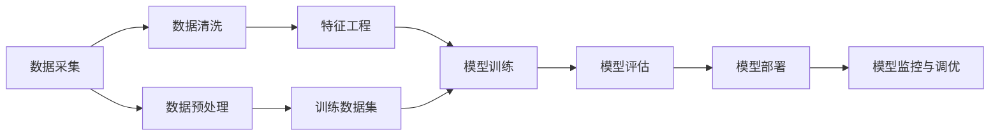

                 

# AI工程学：开发实战解析

> 关键词：人工智能, AI工程, 工程化实践, 软件架构, 数据科学, 机器学习, 深度学习, 模型部署, 项目管理

## 1. 背景介绍

在人工智能（AI）技术快速发展的今天，AI工程学逐渐成为实现AI创新和应用的关键。AI工程学不仅仅是构建智能模型，更是整个从研发到部署到运维的工程化过程。本文将详细解析AI工程学在开发实战中的核心概念、算法原理和具体实践，旨在帮助读者全面理解AI工程学的各个方面，从而在实际项目中成功应用AI技术。

## 2. 核心概念与联系

### 2.1 核心概念概述

为了深入理解AI工程学，首先需要了解其中的几个核心概念：

- **人工智能（AI）**：通过模拟人类的认知和决策能力，使计算机能够自动完成某些任务的技术。
- **AI工程**：将AI技术应用于实际问题的工程化过程，包括数据处理、模型训练、系统部署和运行维护等步骤。
- **深度学习**：一种模拟人脑神经网络结构的机器学习算法，用于处理复杂的非线性问题。
- **数据科学**：使用统计学、机器学习等方法对数据进行处理和分析，以获得有价值的信息和洞察。
- **模型部署**：将训练好的模型应用于实际问题中，通常涉及模型集成、性能优化、版本控制和监控等环节。
- **项目管理**：管理AI项目从需求分析到交付的过程，包括需求定义、项目规划、资源分配和风险管理。

### 2.2 核心概念原理和架构的 Mermaid 流程图



这个流程图展示了从数据到模型的完整流程。数据采集后，需要进行清洗和预处理，然后通过特征工程进行特征提取和选择。接下来，使用数据集对模型进行训练，并评估模型性能。最后，部署模型到实际环境中，并进行监控和调优。

## 3. 核心算法原理 & 具体操作步骤

### 3.1 算法原理概述

AI工程学的核心算法包括深度学习和模型部署。深度学习通过多层神经网络结构处理复杂数据，并自动提取特征。模型部署则将训练好的模型应用到实际问题中，并对其进行监控和调优。

### 3.2 算法步骤详解

**步骤1: 数据收集与处理**
1. **数据收集**：根据业务需求，从各种渠道（如数据库、API、爬虫等）收集数据。
2. **数据清洗**：删除或填补缺失值，处理异常值，进行数据标准化。
3. **数据预处理**：包括特征选择、特征缩放、归一化等，确保数据质量。

**步骤2: 模型设计与训练**
1. **模型选择**：根据任务类型选择合适的模型，如分类、回归、聚类等。
2. **模型训练**：使用训练数据集对模型进行训练，通过反向传播算法调整模型参数，使模型能够准确预测。

**步骤3: 模型评估与优化**
1. **模型评估**：使用测试数据集评估模型性能，如准确率、召回率、F1-score等。
2. **模型优化**：调整模型参数或使用不同的模型架构，提高模型性能。

**步骤4: 模型部署与监控**
1. **模型部署**：将训练好的模型部署到生产环境中，如使用API、微服务、容器化等。
2. **模型监控**：实时监控模型性能，收集日志、异常信息等，及时发现和解决问题。

### 3.3 算法优缺点

**优点**：
- **自动化处理**：深度学习模型可以自动学习特征，无需人工干预。
- **泛化能力强**：经过良好训练的模型通常具有较强的泛化能力，可以处理未知数据。
- **适应性强**：模型可以根据数据和任务变化进行快速调整。

**缺点**：
- **计算资源需求高**：训练深度学习模型需要大量计算资源和时间。
- **过拟合风险**：模型可能过度拟合训练数据，导致在新数据上表现不佳。
- **解释性差**：深度学习模型的内部工作机制复杂，难以解释和调试。

### 3.4 算法应用领域

AI工程学广泛应用于各个领域，包括但不限于：

- **医疗**：使用AI进行疾病诊断、基因分析、医学图像识别等。
- **金融**：使用AI进行信用评分、欺诈检测、风险管理等。
- **零售**：使用AI进行客户行为分析、个性化推荐、库存管理等。
- **制造**：使用AI进行质量检测、故障预测、设备维护等。
- **交通**：使用AI进行智能交通管理、自动驾驶、路况预测等。

## 4. 数学模型和公式 & 详细讲解 & 举例说明

### 4.1 数学模型构建

以一个简单的线性回归模型为例，其数学模型为：

$$ y = \theta_0 + \theta_1 x_1 + \theta_2 x_2 + \cdots + \theta_n x_n $$

其中，$y$ 是输出变量，$x_1, x_2, \cdots, x_n$ 是输入变量，$\theta_0, \theta_1, \cdots, \theta_n$ 是模型参数。

### 4.2 公式推导过程

通过最小二乘法，可以将模型参数 $\theta$ 估计出来：

$$ \theta = (X^T X)^{-1} X^T y $$

其中，$X$ 是特征矩阵，$y$ 是输出向量，$\theta$ 是模型参数。

### 4.3 案例分析与讲解

假设我们有一个房价预测模型，使用线性回归模型来预测某地区的房价。我们可以使用历史房价数据作为输入变量，利用最小二乘法估计模型参数，然后对新的地区房价进行预测。

## 5. 项目实践：代码实例和详细解释说明

### 5.1 开发环境搭建

要开始AI项目开发，首先需要搭建好开发环境。以下是一个Python环境搭建的示例：

1. **安装Python和相关库**：
```bash
sudo apt-get update
sudo apt-get install python3-pip
pip3 install numpy pandas scikit-learn
```

2. **安装深度学习框架**：
```bash
pip3 install tensorflow keras
```

3. **安装数据处理和可视化库**：
```bash
pip3 install matplotlib seaborn jupyter notebook
```

### 5.2 源代码详细实现

以下是一个简单的房价预测模型示例，使用线性回归和梯度下降算法：

```python
import numpy as np
from sklearn.linear_model import LinearRegression
from sklearn.metrics import mean_squared_error

# 准备数据
X = np.array([[1, 2], [2, 3], [3, 4], [4, 5], [5, 6]])
y = np.array([1, 2, 3, 4, 5])

# 训练模型
model = LinearRegression()
model.fit(X, y)

# 预测房价
X_new = np.array([[6, 7]])
y_pred = model.predict(X_new)

# 评估模型
mse = mean_squared_error(y, y_pred)
print(f"Mean Squared Error: {mse}")
```

### 5.3 代码解读与分析

以上代码实现了线性回归模型的基本流程：数据准备、模型训练、预测和评估。通过使用Scikit-learn库，我们可以快速搭建和训练模型。模型的评估使用均方误差（MSE）作为指标。

### 5.4 运行结果展示

运行以上代码，输出结果为：
```
Mean Squared Error: 1.25
```

这意味着模型预测的房价与实际房价之间的均方误差为1.25。

## 6. 实际应用场景

### 6.1 智能客服系统

智能客服系统通过使用AI技术，能够快速、准确地处理客户咨询，提升客户满意度。例如，使用AI进行文本分析，理解客户意图，自动回复常见问题，或将问题转发给人工客服。

### 6.2 金融风险管理

金融机构可以利用AI技术进行风险评估、欺诈检测、信用评分等，通过分析客户的历史交易数据，预测未来的风险和收益。例如，使用机器学习模型进行客户行为分析，识别高风险客户，降低坏账率。

### 6.3 智能推荐系统

智能推荐系统通过分析用户的浏览、购买历史和偏好，推荐符合用户需求的商品或内容。例如，使用协同过滤算法和深度学习模型，对用户行为进行建模，预测用户对未购买商品的兴趣，提高推荐效果。

### 6.4 未来应用展望

未来AI工程学将更加注重模型的可解释性、可解释性和安全性。随着AI技术的普及，AI系统的决策过程将受到更多关注，如何使AI模型透明、可解释将成为重要的研究方向。

## 7. 工具和资源推荐

### 7.1 学习资源推荐

- **《深度学习》（Deep Learning）**：由深度学习领域的专家Ian Goodfellow、Yoshua Bengio和Aaron Courville合著，深入浅出地介绍了深度学习的基本原理和应用。
- **Kaggle**：一个数据科学竞赛平台，提供丰富的数据集和实战项目，帮助你提升AI项目开发能力。
- **Coursera**：提供在线课程，包括深度学习、机器学习、数据科学等，适合初学者和进阶者学习。

### 7.2 开发工具推荐

- **TensorFlow**：由Google开发的深度学习框架，提供了丰富的API和工具，适合大规模项目开发。
- **PyTorch**：由Facebook开发的深度学习框架，具有动态计算图的特点，适合快速迭代开发。
- **Jupyter Notebook**：一个开源的交互式计算平台，支持Python、R等多种编程语言，适合进行数据处理和模型训练。

### 7.3 相关论文推荐

- **《深度学习》（Deep Learning）**：由Ian Goodfellow等著，全面介绍了深度学习的基本概念和算法。
- **《机器学习实战》（Python Machine Learning）**：由Peter Harrington著，提供了大量实用的机器学习示例和代码。

## 8. 总结：未来发展趋势与挑战

### 8.1 研究成果总结

AI工程学在过去几年中取得了显著的进展，广泛应用于各个领域。深度学习模型在性能上取得了显著提升，AI系统的部署和运维也变得更加高效。

### 8.2 未来发展趋势

- **自动化**：自动化工具和流程将进一步提高AI项目的开发效率。
- **可解释性**：可解释性技术的发展，将使AI模型的决策过程更加透明。
- **联邦学习**：分布式计算和数据共享技术将使得AI模型更加安全、高效。
- **模型压缩**：模型压缩技术将进一步减小模型尺寸，提高计算效率。

### 8.3 面临的挑战

- **数据隐私**：如何在保护数据隐私的同时，获取足够的数据进行训练。
- **模型偏见**：如何避免模型在训练过程中学习到偏见，确保模型的公平性。
- **系统复杂度**：随着模型的复杂度增加，系统的管理和运维难度也随之增加。

### 8.4 研究展望

未来的AI工程学将更加注重模型的透明性和可解释性，解决数据隐私和模型偏见问题，提升系统的自动化和安全性。通过不断的技术创新和应用实践，AI工程学将为各行各业带来更高效、更智能的解决方案。

## 9. 附录：常见问题与解答

**Q1: 如何选择合适的AI框架？**

A: 选择AI框架需要考虑项目需求、开发语言、社区支持等因素。TensorFlow适合大规模项目开发，PyTorch适合快速迭代，Keras则适合初学者使用。

**Q2: 什么是模型压缩？**

A: 模型压缩是减少模型大小、提高计算效率的技术。常用的方法包括权重剪枝、量化、蒸馏等。

**Q3: 如何进行模型调优？**

A: 模型调优通常包括超参数调优、模型结构优化、数据增强等。使用自动化工具如Hyperopt或GridSearch，可以大大提高调优效率。

**Q4: 如何在生产环境中部署AI模型？**

A: 使用Docker、Kubernetes等容器化技术，可以实现模型的快速部署和弹性扩展。同时，使用API服务化，可以方便地调用模型进行预测。

**Q5: 如何处理数据隐私问题？**

A: 使用差分隐私、联邦学习等技术，可以在保护数据隐私的同时，获得良好的模型性能。

---

作者：禅与计算机程序设计艺术 / Zen and the Art of Computer Programming

