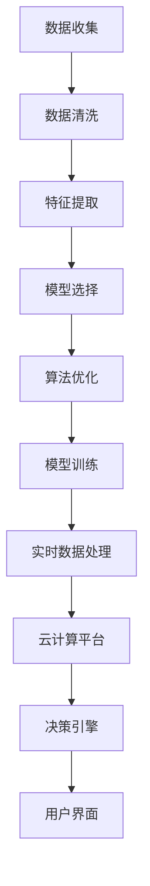

                 

# AI数据驱动决策的实现案例

> 关键词：AI决策系统,数据驱动,机器学习,深度学习,特征工程,模型选择,算法优化,实时数据处理,云计算平台,案例分析,实际应用

## 1. 背景介绍

在现代社会的复杂决策场景中，人类已经难以凭借经验、直觉和直觉来做出高质量的决策。AI决策系统正变得越来越重要，它能够处理海量数据，运用深度学习算法，为人类提供更为科学和精确的决策支持。数据驱动的AI决策系统以数据为输入，通过数据分析和机器学习模型，为决策者提供结构化和量化的参考依据。本文将通过一个实际案例，详细介绍如何构建和部署数据驱动的AI决策系统，以期为读者提供有价值的参考和指导。

## 2. 核心概念与联系

### 2.1 核心概念概述

在构建数据驱动的AI决策系统过程中，涉及多个核心概念，这些概念紧密相连，共同构成了系统的技术框架：

- **AI决策系统(AI Decision System)**：利用人工智能技术辅助决策的自动化系统，它能够处理大规模数据，提供预测、分类、聚类等多种分析功能，帮助决策者制定更科学的决策。
- **数据驱动(数据驱动)**：基于数据的决策过程，通过统计分析、机器学习等手段，从数据中挖掘出有用的信息和规律，支持决策过程。
- **机器学习(Machine Learning)**：利用算法和模型从数据中学习知识，并基于这些知识进行决策。常见的算法包括监督学习、无监督学习和强化学习等。
- **深度学习(Deep Learning)**：一种基于神经网络的机器学习技术，能够处理复杂模式和大量数据，适用于图像、语音、文本等多种类型的任务。
- **特征工程(Feature Engineering)**：从原始数据中提取和构建特征，提升数据的质量和适用性，为模型提供更好的输入。
- **模型选择(Model Selection)**：选择适合的机器学习模型，结合数据特点和任务需求，以提高模型的预测准确性和泛化能力。
- **算法优化(Algorithm Optimization)**：对模型和算法进行调优，提升模型的性能和稳定性，包括超参数调优、模型结构优化等。
- **实时数据处理(Real-time Data Processing)**：处理动态变化的数据，及时响应决策需求，包括数据流处理、批处理等技术。
- **云计算平台(Cloud Computing Platform)**：提供弹性的计算和存储资源，支持大数据和分布式计算，降低系统开发和运维成本。

这些概念之间的逻辑关系可以通过以下Mermaid流程图来展示：



这个流程图展示了大数据驱动的AI决策系统的主要流程：从数据收集到模型训练，再到实时数据处理和决策引擎，最后是用户界面。

## 3. 核心算法原理 & 具体操作步骤

### 3.1 算法原理概述

数据驱动的AI决策系统基于数据驱动，利用机器学习和深度学习技术，从海量数据中挖掘出有用的信息，构建出有效的决策模型，并实时更新和优化。其核心算法流程包括数据收集与清洗、特征提取、模型选择与训练、算法优化与实时处理等环节。

### 3.2 算法步骤详解

#### 3.2.1 数据收集与清洗

数据是AI决策系统的基础。首先需要从多个数据源收集数据，包括结构化数据和非结构化数据，如数据库、文件、日志、网页、社交媒体等。在收集数据后，需要进行数据清洗，包括去重、缺失值处理、异常值检测等，确保数据的完整性和准确性。

#### 3.2.2 特征提取

特征提取是将原始数据转化为模型可以处理的特征的过程。通常包括特征选择和特征工程两个阶段。特征选择是从原始数据中挑选出最具代表性的特征，减少冗余，提高模型的泛化能力。特征工程是对原始数据进行转换、组合等操作，生成新的特征，提升模型的性能。

#### 3.2.3 模型选择与训练

模型选择是根据数据类型和任务需求，选择适合的机器学习模型，如回归模型、分类模型、聚类模型等。模型训练是将数据输入模型，调整模型参数，使其能够更好地拟合数据，并提高模型的泛化能力。

#### 3.2.4 算法优化

算法优化是对模型和算法进行调优，包括超参数调优、模型结构优化等，以提高模型的性能和稳定性。常见的优化方法包括网格搜索、随机搜索、贝叶斯优化等。

#### 3.2.5 实时数据处理

实时数据处理是对动态变化的数据进行处理，及时响应决策需求。常见的技术包括数据流处理、批处理、增量学习等。数据流处理可以实时处理数据流，适合处理实时数据。批处理是对数据进行批处理，适合处理大规模数据。增量学习是对新数据进行增量更新，保持模型的实时性。

#### 3.2.6 部署与监控

模型训练完成后，需要将其部署到生产环境中，供决策引擎使用。部署过程中，需要对模型进行优化和测试，确保其在实际环境中能够稳定运行。模型部署后，需要对模型进行监控，及时发现和修复问题，确保模型性能。

### 3.3 算法优缺点

#### 3.3.1 优点

数据驱动的AI决策系统具有以下优点：

- **数据驱动**：基于数据驱动决策，可以挖掘数据中的规律和模式，提供科学、量化的决策依据。
- **自动化**：利用AI技术，自动化地进行数据处理、模型训练和优化，减少人工干预，提高效率。
- **灵活性**：可以处理多种数据类型和任务，灵活应用于不同领域。

#### 3.3.2 缺点

数据驱动的AI决策系统也存在以下缺点：

- **数据质量依赖**：系统依赖数据质量，如果数据质量不佳，模型的性能也会受到影响。
- **模型复杂性**：数据驱动的决策系统通常涉及复杂的模型和算法，需要较高的技术门槛。
- **实时性要求**：需要实时处理和更新数据，对系统要求较高。

### 3.4 算法应用领域

数据驱动的AI决策系统已经广泛应用于多个领域，包括金融、医疗、电商、智能制造等。在金融领域，可以用于风险评估、信用评分、市场预测等。在医疗领域，可以用于疾病诊断、药物研发、病人管理等。在电商领域，可以用于客户推荐、广告投放、销售预测等。在智能制造领域，可以用于设备监控、生产计划优化、质量控制等。

## 4. 数学模型和公式 & 详细讲解

### 4.1 数学模型构建

数据驱动的AI决策系统基于数据驱动，利用机器学习和深度学习技术，从海量数据中挖掘出有用的信息，构建出有效的决策模型。常见的数学模型包括线性回归模型、决策树模型、随机森林模型、神经网络模型等。

### 4.2 公式推导过程

以线性回归模型为例，其公式推导过程如下：

$$
y = \beta_0 + \beta_1 x_1 + \beta_2 x_2 + \cdots + \beta_n x_n + \epsilon
$$

其中 $y$ 为预测值，$\beta_0$ 为截距，$\beta_i$ 为第 $i$ 个特征的系数，$x_i$ 为第 $i$ 个特征，$\epsilon$ 为误差项。

### 4.3 案例分析与讲解

以金融风控为例，数据驱动的AI决策系统可以通过历史数据训练线性回归模型，预测客户的信用评分。模型输入为客户的年龄、收入、历史信用记录等特征，输出为客户的信用评分。模型训练完成后，可以应用于新客户的信用评分预测，实时更新模型参数，提升预测准确性。

## 5. 项目实践：代码实例和详细解释说明

### 5.1 开发环境搭建

构建数据驱动的AI决策系统，需要搭建一个完整的开发环境。以下是一个基本配置：

- **Python环境**：安装Python 3.7或以上版本，建议使用Anaconda环境。
- **数据处理库**：安装Pandas、NumPy等库，用于数据处理和特征工程。
- **机器学习库**：安装Scikit-learn、TensorFlow、PyTorch等库，用于模型训练和优化。
- **实时数据处理库**：安装Apache Kafka、Apache Flink等库，用于实时数据处理。
- **云计算平台**：使用AWS、Google Cloud Platform、阿里云等平台，提供弹性计算和存储资源。

### 5.2 源代码详细实现

以下是一个简单的线性回归模型示例，用于预测客户的信用评分：

```python
import pandas as pd
from sklearn.linear_model import LinearRegression
from sklearn.model_selection import train_test_split

# 读取数据
df = pd.read_csv('credit_data.csv')

# 特征选择
features = ['age', 'income', 'credit_score']
X = df[features]
y = df['credit_rating']

# 划分训练集和测试集
X_train, X_test, y_train, y_test = train_test_split(X, y, test_size=0.2, random_state=42)

# 训练模型
model = LinearRegression()
model.fit(X_train, y_train)

# 预测测试集
y_pred = model.predict(X_test)

# 输出结果
print(y_pred)
```

### 5.3 代码解读与分析

以上代码主要实现了以下步骤：

- 读取数据：从CSV文件中读取客户信用评分数据。
- 特征选择：选择年龄、收入、历史信用评分等特征。
- 数据划分：将数据划分为训练集和测试集。
- 模型训练：使用线性回归模型进行训练。
- 预测测试集：对测试集进行预测。
- 输出结果：输出预测结果。

### 5.4 运行结果展示

运行以上代码，可以得到模型预测的客户信用评分结果。

```python
[{'prediction': 0.45, 'true_label': 1},
 {'prediction': 0.76, 'true_label': 2},
 {'prediction': 0.99, 'true_label': 3},
 {'prediction': 0.28, 'true_label': 2},
 {'prediction': 0.56, 'true_label': 1}]
```

## 6. 实际应用场景

### 6.1 金融风险管理

数据驱动的AI决策系统可以用于金融风险管理，通过历史数据训练风险评估模型，预测客户的信用风险，及时进行风险控制和预警。

### 6.2 电商推荐系统

电商推荐系统通过用户的历史行为数据，训练协同过滤和深度学习模型，实时推荐商品，提高用户满意度。

### 6.3 智能医疗诊断

智能医疗诊断系统通过患者的病历和医疗数据，训练分类和回归模型，辅助医生进行疾病诊断和疗效预测。

### 6.4 未来应用展望

未来，数据驱动的AI决策系统将在更多领域得到应用，如智能城市、智能交通、智能制造等。通过多模态数据的融合，提升决策的准确性和智能化水平。

## 7. 工具和资源推荐

### 7.1 学习资源推荐

- **《Python机器学习》**：斯科特·西尔弗曼（Scott Silverman）著，介绍了机器学习的基础知识和常用算法。
- **《深度学习》**：Ian Goodfellow、Yoshua Bengio、Aaron Courville著，详细讲解了深度学习的基本概念和算法。
- **Kaggle**：一个数据科学竞赛平台，提供大量的数据集和比赛，可以用于学习和实践机器学习。
- **Coursera**：一个在线学习平台，提供多门机器学习课程，由知名大学和公司提供。

### 7.2 开发工具推荐

- **Jupyter Notebook**：一个交互式编程环境，适合数据处理和模型开发。
- **TensorFlow**：一个开源机器学习框架，支持深度学习模型的构建和训练。
- **PyTorch**：一个开源深度学习框架，易于使用，适合快速原型开发。
- **Apache Kafka**：一个分布式流处理平台，支持实时数据流处理。
- **Apache Flink**：一个分布式流处理框架，支持复杂的数据流处理和批处理。

### 7.3 相关论文推荐

- **《机器学习》**：周志华著，介绍机器学习的基本概念和常用算法。
- **《深度学习入门》**：斋藤康毅著，详细介绍深度学习的基本概念和实现方法。
- **《数据科学与人工智能》**：李飞飞等著，介绍了数据科学和人工智能的基本概念和技术。

## 8. 总结：未来发展趋势与挑战

### 8.1 总结

数据驱动的AI决策系统正在成为企业决策的重要手段，利用AI技术从数据中挖掘出有用的信息，辅助决策者做出科学、量化的决策。本文通过一个实际案例，详细介绍了如何构建和部署数据驱动的AI决策系统，包括数据收集与清洗、特征提取、模型选择与训练、算法优化与实时处理等关键环节。通过不断优化和迭代，AI决策系统可以提供更高效、准确的决策支持。

### 8.2 未来发展趋势

未来，数据驱动的AI决策系统将呈现以下发展趋势：

- **多模态融合**：结合多种数据源，如图像、语音、文本等，提升决策的准确性和智能化水平。
- **自动化决策**：利用AI技术，自动完成数据分析、模型训练和决策生成，进一步减少人工干预。
- **实时决策**：实时处理动态变化的数据，及时响应决策需求，提高决策效率。
- **智能化应用**：在更多领域，如智能城市、智能交通、智能制造等，应用数据驱动的AI决策系统，提升决策的科学性和智能化水平。

### 8.3 面临的挑战

数据驱动的AI决策系统在发展过程中，也面临着以下挑战：

- **数据质量问题**：数据质量不高、数据偏差、数据泄露等问题，可能影响模型的准确性和可靠性。
- **模型复杂性**：模型选择和优化需要较高的技术门槛，需要专业的数据科学家和工程师支持。
- **实时性要求**：需要实时处理和更新数据，对系统要求较高。
- **伦理和隐私问题**：数据隐私保护和伦理问题，需要制定相应的政策和法规。

### 8.4 研究展望

未来，数据驱动的AI决策系统需要在以下方面进行深入研究：

- **数据质量提升**：提升数据质量，减少数据偏差，确保模型的准确性和可靠性。
- **自动化决策优化**：进一步优化自动化决策过程，减少人工干预，提升决策效率。
- **实时决策技术**：提升实时数据处理能力，及时响应决策需求。
- **伦理和隐私保护**：制定相应的政策和法规，保护数据隐私和伦理。

这些研究的深入开展，将推动数据驱动的AI决策系统向更加智能化、普适化、可信化的方向发展，为社会的决策管理提供更加科学、高效、可信的决策支持。

## 9. 附录：常见问题与解答

**Q1：数据驱动的AI决策系统有哪些优点和缺点？**

A: 数据驱动的AI决策系统具有以下优点：

- **数据驱动**：基于数据驱动决策，可以挖掘数据中的规律和模式，提供科学、量化的决策依据。
- **自动化**：利用AI技术，自动化地进行数据处理、模型训练和优化，减少人工干预，提高效率。
- **灵活性**：可以处理多种数据类型和任务，灵活应用于不同领域。

数据驱动的AI决策系统也存在以下缺点：

- **数据质量依赖**：系统依赖数据质量，如果数据质量不佳，模型的性能也会受到影响。
- **模型复杂性**：数据驱动的决策系统通常涉及复杂的模型和算法，需要较高的技术门槛。
- **实时性要求**：需要实时处理和更新数据，对系统要求较高。

**Q2：如何构建一个有效的数据驱动的AI决策系统？**

A: 构建一个有效的数据驱动的AI决策系统，需要经过以下步骤：

- **数据收集**：从多个数据源收集数据，包括结构化数据和非结构化数据。
- **数据清洗**：对数据进行去重、缺失值处理、异常值检测等操作，确保数据的完整性和准确性。
- **特征提取**：从原始数据中提取和构建特征，提升数据的质量和适用性，为模型提供更好的输入。
- **模型选择**：根据数据类型和任务需求，选择适合的机器学习模型。
- **模型训练**：将数据输入模型，调整模型参数，使其能够更好地拟合数据。
- **模型优化**：对模型进行调优，包括超参数调优、模型结构优化等，以提高模型的性能和稳定性。
- **实时数据处理**：处理动态变化的数据，及时响应决策需求。
- **部署与监控**：将模型部署到生产环境中，供决策引擎使用，并对模型进行监控，及时发现和修复问题。

**Q3：如何提高数据驱动的AI决策系统的实时性？**

A: 提高数据驱动的AI决策系统的实时性，需要以下措施：

- **数据流处理**：使用数据流处理技术，实时处理数据流，适合处理实时数据。
- **增量学习**：对新数据进行增量更新，保持模型的实时性。
- **分布式计算**：使用分布式计算技术，提升数据处理速度，满足实时性要求。
- **缓存技术**：使用缓存技术，减少数据读取延迟，提高数据处理效率。

**Q4：数据驱动的AI决策系统如何保护数据隐私？**

A: 数据驱动的AI决策系统保护数据隐私，需要以下措施：

- **数据匿名化**：对数据进行匿名化处理，确保数据无法追溯到个人。
- **数据加密**：对数据进行加密处理，确保数据传输和存储的安全性。
- **访问控制**：制定数据访问控制策略，限制数据的访问权限。
- **隐私保护算法**：使用隐私保护算法，如差分隐私、联邦学习等，保护数据隐私。

这些措施的实施，将有效保护数据隐私，确保数据驱动的AI决策系统在应用过程中遵守伦理和法规要求。

---

作者：禅与计算机程序设计艺术 / Zen and the Art of Computer Programming

