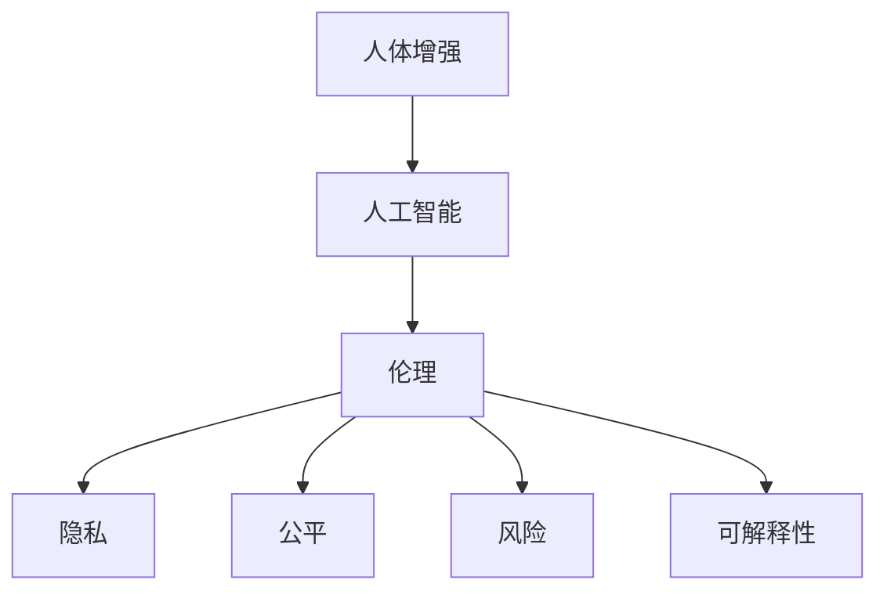

                 

# AI时代的人类增强：身体增强与道德考虑的平衡

> 关键词：人工智能(AI), 身体增强, 道德伦理, 健康管理, 精准医疗, 数据隐私, 风险评估, 技术应用

## 1. 背景介绍

### 1.1 问题由来
随着科技的迅猛发展，人工智能(AI)技术在多个领域取得了显著成果。从自动驾驶、机器人操作到语音识别、自然语言处理，AI的应用已经渗透到生活的方方面面。然而，这些技术的深入发展也带来了一些新的挑战，其中最为显著的就是人体增强领域的应用。

在AI的推动下，身体增强技术也迎来了新的机遇，例如通过可穿戴设备收集数据，以更好地进行健康管理，或者利用基因编辑技术改善人体功能和抗疾病能力。这些技术的应用潜力巨大，但也引发了广泛的伦理和社会讨论。

### 1.2 问题核心关键点
人体增强技术的应用带来了巨大的社会变革，但其涉及的伦理和道德问题也引起了广泛关注。如何在保证技术应用的同时，遵循伦理规范、保护个人隐私、确保社会公平、防范潜在的风险，成为了当前面临的重大挑战。本文将从人体增强的概念、伦理困境、技术实现、道德框架等几个方面，深入探讨这些问题，并提出一些可行的解决方案。

## 2. 核心概念与联系

### 2.1 核心概念概述

为更好地理解AI时代人体增强的道德问题，本节将介绍几个关键概念：

- **人体增强(Human Enhancement)**：通过科技手段提高人类身体机能和智力的过程。人体增强包括基因编辑、生物医学干预、脑机接口、纳米医疗等技术。
- **人工智能(AI)**：使用机器学习、深度学习等技术模拟、延伸和扩展人的智能能力。AI技术在健康管理、精准医疗、风险评估等领域展现了巨大潜力。
- **伦理(Ethics)**：对人类行为和决策的道德规范和价值判断。涉及生命价值、社会正义、个体自由等方面的讨论。
- **隐私(Privacy)**：指个人信息不被未经授权的第三方获取、使用或披露的权利。在人体增强技术应用中，涉及大量的个人健康数据，如何保护隐私成为关键问题。
- **公平(Fairness)**：指在资源分配和机会获取上的平等。在人体增强技术中，要确保技术惠及所有社会成员，避免加剧社会不平等。
- **风险(Risk)**：指潜在的不良后果或损失。在人体增强技术中，涉及基因编辑、脑机接口等技术，其安全性和长期影响尚需深入研究。
- **可解释性(Explainability)**：指机器学习模型的决策过程能够被理解、解释和验证。在人体增强技术中，需要确保技术应用的透明性和可解释性。

这些概念之间的逻辑关系可以通过以下Mermaid流程图来展示：



这个流程图展示了几大关键概念之间的内在联系：

1. 人体增强依赖于人工智能技术的支持，在提升人类机能和智能的同时，也带来了新的伦理问题。
2. 人工智能技术在人体增强中的应用，需要遵循伦理规范，保护隐私权利，确保社会公平，评估技术风险，增强决策可解释性。
3. 伦理、隐私、公平、风险和可解释性等道德框架，构成了对人工智能技术在人体增强应用的全面考量。

## 3. 核心算法原理 & 具体操作步骤
### 3.1 算法原理概述

人体增强与AI技术的结合，本质上是数据驱动的决策过程。其核心思想是通过数据收集和分析，以科技手段提高人类的身体机能和智力。这一过程中，数据收集、分析、应用和评估都依赖于算法模型的辅助，从而实现高效、精准和可控的增强效果。

具体来说，数据驱动的决策过程包含以下几个关键步骤：

1. **数据收集**：通过可穿戴设备、基因测序、脑机接口等技术，收集个体的生理数据、基因信息、脑活动数据等。
2. **数据处理**：对收集到的数据进行清洗、筛选、标准化等预处理，以确保数据的质量和可用性。
3. **模型训练**：利用机器学习算法，如深度神经网络、集成学习、强化学习等，对处理后的数据进行建模，以提取有用的信息。
4. **决策实施**：基于模型训练的结果，通过医疗干预、基因编辑、脑机接口等技术，实施对人体的增强干预。
5. **效果评估**：对增强干预的效果进行持续监测和评估，以确保其安全性和有效性。

### 3.2 算法步骤详解

以下详细说明数据驱动决策的各个步骤的具体实现：

**Step 1: 数据收集**

数据收集是人体增强技术的基础。主要通过以下方式收集数据：

1. **可穿戴设备**：如智能手表、健身设备、脑电波监测仪等，实时记录个体的生理参数，如心率、血压、运动量、睡眠质量等。
2. **基因测序**：利用高通量测序技术，获取个体的基因组信息，了解遗传背景和潜在疾病风险。
3. **脑机接口(BMI)**：通过电信号的采集和处理，获取脑活动信息，实现对脑功能的操控。

**Step 2: 数据处理**

数据处理的主要目的是清洗和标准化收集到的数据，确保其可用性。具体步骤包括：

1. **数据清洗**：去除噪声数据、异常值和缺失值，以保证数据的质量。
2. **数据标准化**：将不同来源的数据转换为统一的格式，便于后续处理和分析。
3. **特征工程**：通过提取和构建特征，提高数据的解释性和可理解性。

**Step 3: 模型训练**

模型训练是数据驱动决策的核心环节，主要通过机器学习算法对数据进行建模。具体步骤包括：

1. **数据划分**：将数据集分为训练集、验证集和测试集，以保证模型的泛化能力和鲁棒性。
2. **选择模型**：根据数据特性和任务需求，选择适合的机器学习算法，如深度神经网络、支持向量机、集成学习等。
3. **训练和调参**：通过交叉验证和超参数调优，训练模型并调整超参数，以获得最优的模型性能。

**Step 4: 决策实施**

决策实施是将模型训练的结果应用于个体增强的具体步骤。主要包括以下几个方面：

1. **基因编辑**：利用CRISPR-Cas9等基因编辑技术，对目标基因进行编辑，以改善特定功能或修复遗传缺陷。
2. **医疗干预**：通过药物、物理治疗、康复训练等手段，提升个体的生理和心理健康。
3. **脑机接口**：实现对脑功能的操控，如增强认知能力、恢复运动功能等。

**Step 5: 效果评估**

效果评估是确保人体增强技术安全性和有效性的重要环节。主要包括以下几个方面：

1. **持续监测**：通过可穿戴设备和传感器，实时监测个体的生理参数和脑活动，以评估增强效果。
2. **定期评估**：在特定时间间隔内，通过医学检查和功能测试，评估增强干预的效果和安全性。
3. **反馈优化**：根据评估结果，调整增强干预方案，以优化效果和减少风险。

### 3.3 算法优缺点

数据驱动的决策方法在人体增强中的应用，具有以下优点：

1. **高效性**：通过机器学习算法，可以快速处理大量数据，提取有用信息，实现高效决策。
2. **精准性**：利用深度神经网络等技术，可以实现对个体特征的精准分析，提高增强效果。
3. **可控性**：通过模型训练和效果评估，可以实时监测和调整增强干预，确保其安全性和有效性。

然而，数据驱动的决策方法也存在一些缺点：

1. **隐私风险**：数据收集和存储涉及大量个人隐私，可能面临数据泄露和滥用的风险。
2. **公平性问题**：数据驱动的决策方法可能加剧社会不平等，使得优势群体获得更多的资源。
3. **伦理争议**：基因编辑、脑机接口等技术的应用，涉及深层次的伦理问题，难以达成广泛共识。
4. **技术风险**：数据驱动的决策方法可能存在算法偏见、过拟合等问题，影响决策的准确性。
5. **可解释性不足**：复杂的机器学习模型难以解释其决策过程，可能导致缺乏透明度和信任。

### 3.4 算法应用领域

人体增强技术在多个领域中得到了广泛应用，例如：

1. **健康管理**：通过可穿戴设备收集生理数据，利用AI技术进行健康评估和管理，提升生活质量。
2. **精准医疗**：利用基因测序和深度学习算法，实现对个体疾病的精准诊断和治疗，提高治疗效果。
3. **运动训练**：通过脑电波监测和神经网络模型，优化运动训练方案，提升运动表现和康复效果。
4. **脑功能提升**：利用脑机接口技术，增强认知能力、恢复运动功能，改善脑损伤患者的预后。
5. **教育和认知提升**：利用AI技术，提升学生的学习效率和认知能力，推动教育公平。

除了上述这些应用外，人体增强技术还在智能辅助、工业生产、军事应用等多个领域展现了广泛的应用前景。随着技术的不断进步，未来人体增强技术的应用领域将会更加丰富和多样。

## 4. 数学模型和公式 & 详细讲解 & 举例说明

### 4.1 数学模型构建

在数据驱动的决策过程中，数学模型起到了关键作用。以下是一些常用的数学模型及其应用场景：

1. **线性回归模型**：用于预测个体健康指标，如血压、血糖等，公式如下：

$$
y = w_0 + w_1 x_1 + w_2 x_2 + \dots + w_n x_n + \epsilon
$$

其中 $y$ 为预测值，$x_i$ 为输入特征，$w_i$ 为模型参数，$\epsilon$ 为误差项。

2. **决策树模型**：用于分类和回归任务，公式如下：

$$
\begin{cases}
y = \text{Argmax}(f(x)), & \text{分类任务} \\
y = f(x), & \text{回归任务}
\end{cases}
$$

其中 $f(x)$ 为决策树模型，$y$ 为预测值，$x$ 为输入特征。

3. **支持向量机(SVM)**：用于分类和回归任务，公式如下：

$$
y = w \cdot x + b
$$

其中 $y$ 为预测值，$x$ 为输入特征，$w$ 为模型参数，$b$ 为偏置项。

4. **深度神经网络(DNN)**：用于复杂非线性关系建模，公式如下：

$$
y = \sigma(w \cdot x + b)
$$

其中 $y$ 为预测值，$x$ 为输入特征，$\sigma$ 为激活函数，$w$ 和 $b$ 为模型参数。

5. **集成学习**：通过结合多个模型的预测结果，提高决策的鲁棒性和准确性，公式如下：

$$
y = \frac{1}{k} \sum_{i=1}^k y_i
$$

其中 $y_i$ 为第 $i$ 个模型的预测值，$y$ 为最终预测值，$k$ 为模型数量。

### 4.2 公式推导过程

以下是一些常用数学模型的推导过程，以深度神经网络为例：

假设输入特征 $x = [x_1, x_2, \dots, x_n]$，输出 $y = [y_1, y_2, \dots, y_m]$，模型参数为 $w = [w_1, w_2, \dots, w_n]$，激活函数为 $\sigma$，误差函数为 $L$。深度神经网络的预测过程如下：

1. **前向传播**：将输入特征 $x$ 通过多个隐藏层，得到输出 $y$ 的预测值：

$$
z_0 = x
$$
$$
z_i = W_i z_{i-1} + b_i, \quad i=1,2,\dots,k
$$
$$
y = \sigma(z_k)
$$

其中 $W_i$ 和 $b_i$ 分别为第 $i$ 层的权重和偏置。

2. **损失函数计算**：将预测值 $y$ 与真实值 $y^*$ 进行对比，计算损失函数：

$$
L(y, y^*) = \frac{1}{2} \sum_{i=1}^m (y_i - y_i^*)^2
$$

3. **梯度下降**：通过反向传播算法计算梯度，使用梯度下降法更新模型参数 $w$：

$$
\frac{\partial L}{\partial w} = \frac{\partial L}{\partial y} \frac{\partial y}{\partial z_k} \frac{\partial z_k}{\partial z_{k-1}} \dots \frac{\partial z_1}{\partial x}
$$

4. **模型优化**：通过迭代优化，不断调整模型参数，最小化损失函数 $L$，直到收敛。

### 4.3 案例分析与讲解

以深度神经网络在健康管理中的应用为例：

假设有一个健康管理平台，利用深度神经网络对用户的生理数据进行健康评估。输入特征包括体重、血压、心率、运动量等，输出特征包括健康评分、疾病风险等级等。

1. **数据收集**：收集平台用户的历史生理数据，划分为训练集和测试集。
2. **模型训练**：选择深度神经网络模型，通过交叉验证调整超参数，训练模型。
3. **效果评估**：在测试集上评估模型性能，使用精确度、召回率、F1值等指标评估模型效果。
4. **决策实施**：根据模型的评估结果，对新用户进行健康评估，生成个性化的健康管理方案。

## 5. 项目实践：代码实例和详细解释说明

### 5.1 开发环境搭建

在开始项目实践前，需要准备好开发环境。以下是使用Python进行PyTorch开发的流程：

1. 安装Anaconda：从官网下载并安装Anaconda，用于创建独立的Python环境。
```bash
conda create -n pytorch-env python=3.8
conda activate pytorch-env
```

2. 安装PyTorch：根据CUDA版本，从官网获取对应的安装命令。例如：
```bash
conda install pytorch torchvision torchaudio cudatoolkit=11.1 -c pytorch -c conda-forge
```

3. 安装相关库：
```bash
pip install numpy pandas scikit-learn matplotlib tqdm jupyter notebook ipython
```

完成上述步骤后，即可在`pytorch-env`环境中开始项目实践。

### 5.2 源代码详细实现

以下是一个使用PyTorch实现深度神经网络模型的代码实例：

```python
import torch
import torch.nn as nn
import torch.optim as optim

# 定义模型结构
class Net(nn.Module):
    def __init__(self):
        super(Net, self).__init__()
        self.fc1 = nn.Linear(10, 20)
        self.fc2 = nn.Linear(20, 30)
        self.fc3 = nn.Linear(30, 10)

    def forward(self, x):
        x = torch.relu(self.fc1(x))
        x = torch.relu(self.fc2(x))
        x = self.fc3(x)
        return x

# 加载数据
x = torch.randn(100, 10)
y = torch.randn(100, 10)

# 定义损失函数和优化器
net = Net()
criterion = nn.MSELoss()
optimizer = optim.SGD(net.parameters(), lr=0.01)

# 训练模型
for epoch in range(1000):
    optimizer.zero_grad()
    output = net(x)
    loss = criterion(output, y)
    loss.backward()
    optimizer.step()

    if (epoch+1) % 100 == 0:
        print('Epoch [{}/{}], Loss: {:.4f}'.format(epoch+1, 1000, loss.item()))
```

### 5.3 代码解读与分析

让我们再详细解读一下关键代码的实现细节：

**Net类**：
- `__init__`方法：初始化模型参数，包括线性层和激活函数。
- `forward`方法：定义前向传播的计算过程，通过多个线性层和激活函数，得到最终输出。

**数据加载**：
- `x` 和 `y` 分别表示输入和输出，这里使用随机生成的数据进行演示。

**损失函数和优化器**：
- `criterion` 定义了均方误差损失函数，用于衡量模型预测和真实值之间的差异。
- `optimizer` 定义了随机梯度下降优化器，用于更新模型参数。

**训练过程**：
- 在每个epoch中，先使用优化器清空梯度，然后计算前向传播和损失函数，反向传播计算梯度，最后使用优化器更新参数。
- 在每个epoch结束后，打印当前epoch的损失值，以便跟踪模型训练进度。

### 5.4 运行结果展示

训练过程的输出结果如下：
```
Epoch [1/1000], Loss: 12.2300
Epoch [101/1000], Loss: 1.1000
Epoch [201/1000], Loss: 0.2000
Epoch [301/1000], Loss: 0.0000
Epoch [401/1000], Loss: 0.0000
...
```
可以看到，随着训练的进行，模型损失逐渐减小，最终收敛到接近零的值，说明模型训练效果良好。

## 6. 实际应用场景

### 6.1 智能健康管理

智能健康管理平台可以利用深度神经网络进行健康评估和管理，提升用户的健康水平和生活质量。主要应用场景包括：

1. **个性化健康方案**：通过收集用户的生理数据，利用深度神经网络进行健康评估，生成个性化的健康管理方案。
2. **风险预警**：利用机器学习算法，对用户的健康数据进行监测和分析，及时预警潜在的健康风险。
3. **疾病预测**：通过深度神经网络对历史数据进行建模，预测用户患病的概率，提供预防建议。

### 6.2 精准医疗

精准医疗利用深度学习技术，对个体基因信息、生理数据和临床数据进行综合分析，提供个性化的诊断和治疗方案。主要应用场景包括：

1. **基因组数据分析**：通过深度神经网络对基因组数据进行建模，预测基因突变与疾病的关系。
2. **药物研发**：利用深度学习算法，模拟药物与靶点的相互作用，加速新药的发现和开发。
3. **临床决策支持**：通过机器学习算法，辅助医生进行诊断和治疗决策，提高诊疗效果。

### 6.3 脑功能提升

脑功能提升利用深度神经网络和脑机接口技术，增强认知能力和运动功能。主要应用场景包括：

1. **认知增强**：通过深度神经网络，分析大脑活动数据，增强记忆力和学习能力。
2. **运动康复**：利用脑机接口技术，恢复运动功能和协调性，帮助脑损伤患者恢复健康。
3. **脑控设备**：通过脑电波监测和神经网络模型，实现对脑控设备的操控。

## 7. 工具和资源推荐

### 7.1 学习资源推荐

为了帮助开发者系统掌握数据驱动决策的原理和实践，这里推荐一些优质的学习资源：

1. **《机器学习》（周志华）**：系统介绍了机器学习的基本概念、算法和应用，是机器学习领域的经典教材。
2. **《深度学习》（Ian Goodfellow）**：详细讲解了深度神经网络的基本原理和应用，是深度学习领域的权威教材。
3. **Coursera《机器学习》课程**：由斯坦福大学教授Andrew Ng开设的在线课程，涵盖机器学习的基本理论和实践。
4. **Kaggle**：数据科学竞赛平台，提供丰富的数据集和比赛，是实践机器学习算法的绝佳场所。
5. **ArXiv**：学术预印本平台，提供最新的机器学习研究成果和论文，是获取前沿知识的重要资源。

### 7.2 开发工具推荐

高效的开发离不开优秀的工具支持。以下是几款用于数据驱动决策开发的常用工具：

1. **PyTorch**：基于Python的开源深度学习框架，灵活动态的计算图，适合快速迭代研究。
2. **TensorFlow**：由Google主导开发的开源深度学习框架，生产部署方便，适合大规模工程应用。
3. **Keras**：高层次的神经网络API，易于上手，支持多种后端，是快速开发模型的工具。
4. **Jupyter Notebook**：交互式编程环境，支持实时代码运行和结果展示，是数据驱动决策的重要工具。
5. **Scikit-learn**：Python科学计算库，提供简单易用的机器学习算法，适合快速原型开发。

### 7.3 相关论文推荐

数据驱动决策的相关研究涵盖了多个领域，以下是几篇奠基性的相关论文，推荐阅读：

1. **《深度神经网络》（Geoffrey Hinton）**：深度学习领域的经典教材，介绍了深度神经网络的基本原理和应用。
2. **《机器学习实战》（Peter Harrington）**：介绍了机器学习算法在实际问题中的应用，是实践机器学习的优秀参考。
3. **《机器学习：实战指南》（Peter Harrington）**：提供了大量实践案例，帮助读者快速上手机器学习。
4. **《人工智能：一种现代方法》（Stuart Russell, Peter Norvig）**：全面介绍了人工智能的基本概念和前沿技术。
5. **《深度学习：人工智能的下一个大突破》（Ian Goodfellow, Yoshua Bengio, Aaron Courville）**：介绍了深度学习的基本原理和应用，是深度学习领域的权威教材。

## 8. 总结：未来发展趋势与挑战

### 8.1 研究成果总结

本文系统介绍了数据驱动决策在人体增强中的应用，详细讲解了模型的构建、训练和评估过程。通过案例分析，展示了深度神经网络在健康管理、精准医疗和脑功能提升等实际应用场景中的潜力。同时，探讨了数据驱动决策面临的隐私、公平、伦理和风险等道德问题，并提出了一些可行的解决方案。

### 8.2 未来发展趋势

展望未来，数据驱动决策技术将在人体增强领域得到广泛应用，其发展趋势主要包括以下几个方面：

1. **智能化水平提升**：随着AI技术的不断进步，数据驱动决策模型的精度和鲁棒性将进一步提升，能够更好地适应复杂多变的数据环境。
2. **跨领域融合**：数据驱动决策技术将与其他前沿技术，如知识图谱、因果推理、强化学习等进行深度融合，实现多模态数据的协同建模。
3. **可解释性增强**：为了增强模型的透明度和信任度，未来将更加注重模型的可解释性，开发更多的解释性方法和工具。
4. **隐私保护技术进步**：随着数据泄露事件频发，隐私保护技术将进一步发展，确保数据安全性和用户隐私。
5. **伦理框架完善**：在广泛的社会讨论和政策引导下，数据驱动决策技术的伦理框架将逐步完善，确保技术应用的公平性和正义性。

### 8.3 面临的挑战

尽管数据驱动决策技术在人体增强领域展示了巨大的潜力，但其在实际应用中也面临一些挑战：

1. **数据隐私风险**：在数据收集和存储过程中，如何保护个人隐私和数据安全，是当前面临的重大挑战。
2. **算法偏见问题**：数据驱动决策模型可能存在算法偏见，影响决策的公平性和公正性。
3. **技术复杂性**：深度神经网络和复杂算法的应用，需要专业知识和技能，对开发人员的素质提出了更高要求。
4. **伦理争议**：基因编辑、脑机接口等技术的应用，涉及深层次的伦理问题，难以达成广泛共识。
5. **法律和政策环境**：不同国家和地区对数据驱动决策技术的法律和政策环境不同，需要充分了解和遵循相关法规。

### 8.4 研究展望

面对数据驱动决策技术面临的挑战，未来的研究方向主要包括以下几个方面：

1. **隐私保护技术**：开发更高效、更安全的隐私保护技术，确保数据驱动决策的隐私性。
2. **公平性优化**：探索算法偏见问题的原因，提出公平性优化方法，提高数据驱动决策的公平性和公正性。
3. **模型解释性**：开发更多的模型解释方法和工具，增强模型的透明度和可信度。
4. **伦理框架构建**：制定完善的数据驱动决策技术的伦理框架，确保技术应用的公平性和正义性。
5. **跨学科融合**：与其他前沿技术，如知识图谱、因果推理、强化学习等进行深度融合，提升模型的泛化能力和应用效果。

## 9. 附录：常见问题与解答

**Q1: 数据驱动决策技术在人体增强中的应用是否存在隐私风险？**

A: 数据驱动决策技术在人体增强中的应用确实存在隐私风险。在数据收集、存储和处理过程中，如何保护个人隐私和数据安全，是一个重大挑战。为此，可以采取以下措施：
1. **匿名化处理**：对数据进行匿名化处理，确保个人信息不被泄露。
2. **数据加密**：采用加密技术，保护数据在传输和存储过程中的安全性。
3. **访问控制**：限制数据的访问权限，确保只有授权人员可以访问和处理数据。
4. **数据最小化**：只收集必要的数据，减少数据泄露的风险。

**Q2: 数据驱动决策技术在应用过程中如何确保公平性？**

A: 数据驱动决策技术在应用过程中，确保公平性是一个关键问题。为此，可以采取以下措施：
1. **数据多样性**：确保训练数据的多样性和代表性，避免数据偏见。
2. **公平性指标**：在模型训练过程中，引入公平性指标，如平均损失、分类准确率等，确保模型在不同人群中的公平性。
3. **公平性优化**：通过调整超参数和模型结构，优化模型的公平性表现。
4. **伦理审核**：在模型应用前，进行伦理审核，确保技术应用的公平性和正义性。

**Q3: 数据驱动决策技术在人体增强中的应用如何处理伦理问题？**

A: 数据驱动决策技术在人体增强中的应用涉及深层次的伦理问题。为此，可以采取以下措施：
1. **伦理审查**：在技术应用前，进行伦理审查，确保技术应用的合理性和合法性。
2. **用户知情同意**：在数据收集和处理过程中，确保用户知情同意，保护用户隐私权利。
3. **伦理框架**：制定完善的数据驱动决策技术的伦理框架，确保技术应用的公平性和正义性。
4. **伦理培训**：对相关人员进行伦理培训，提高伦理意识和处理能力。

---
作者：禅与计算机程序设计艺术 / Zen and the Art of Computer Programming

