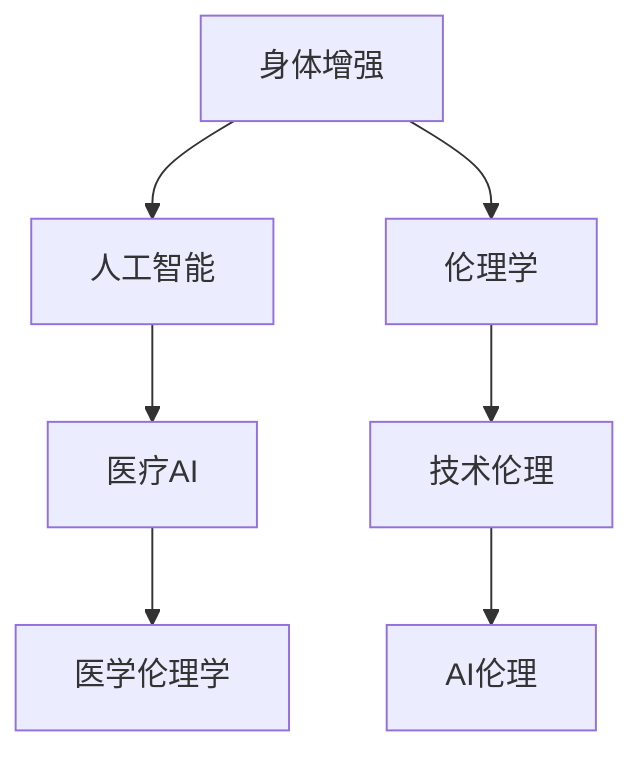

                 

## 1. 背景介绍

随着人工智能技术的飞速发展，AI时代正迅速到来，人类与机器的界限日益模糊。AI技术的广泛应用，极大地改变了人们的生活方式和社会结构，也引发了一系列道德伦理问题。本文聚焦于AI时代的人类增强，探讨了身体增强技术与伦理道德的融合发展问题。

### 1.1 问题由来

近年来，人工智能技术在医疗、体育、娱乐等多个领域的应用取得了显著进展。例如，AI驱动的手术机器人可以辅助医生进行高精度的微创手术；增强现实(AR)和虚拟现实(VR)技术可以增强运动员的训练效果；智能语音助手可以帮助人们处理日常事务。然而，这些技术的广泛应用也带来了新的挑战和道德困境。

### 1.2 问题核心关键点

本文的主要研究问题包括：
- 身体增强技术的现状与趋势
- 道德伦理在身体增强技术中的应用
- 技术进步与道德伦理的平衡与协调

这些核心问题将指导我们全面分析AI时代人类增强技术的道德困境，提出解决策略，为AI技术的应用提供伦理指引。

## 2. 核心概念与联系

### 2.1 核心概念概述

为更好地理解身体增强技术及其伦理道德，本节将介绍几个密切相关的核心概念：

- **身体增强(Body Enhancement)**：指通过技术手段提升人体的各项功能，改善生活质量，如假肢、义眼、助听器等。
- **人工智能(AI)**：指模拟人类智能的计算系统，包括机器学习、深度学习、自然语言处理等技术。
- **医疗AI**：指利用AI技术辅助医疗诊断、治疗和管理的系统，如医学影像分析、电子病历、智能诊断等。
- **伦理学(Ethics)**：指研究行为规范、道德原则的理论和实践，关注技术应用的社会影响和道德困境。

这些核心概念之间的逻辑关系可以通过以下Mermaid流程图来展示：



这个流程图展示了大语言模型的核心概念及其之间的关系：

1. 身体增强技术可以应用人工智能实现更高效、精准的功能提升。
2. 医疗AI结合伦理学，引导AI技术在医疗领域的应用，以符合道德规范。
3. 伦理学指导AI技术在各个领域的道德应用，强调技术应用的社会责任。

## 3. 核心算法原理 & 具体操作步骤
### 3.1 算法原理概述

基于身体增强技术与伦理道德的融合发展，本节将介绍AI驱动的身体增强技术的算法原理，并阐述其具体操作步骤。

### 3.2 算法步骤详解

#### 3.2.1 预处理与数据准备

身体增强技术的算法实现通常需要先进行数据预处理和标注。以假肢技术为例，需要在大量实验数据上标注不同情境下的运动数据、压力数据等，作为模型的输入和输出。同时，需要考虑数据的安全性、隐私性和伦理性，确保数据的合法使用。

#### 3.2.2 模型训练与优化

选择合适的深度学习模型，如卷积神经网络(CNN)、递归神经网络(RNN)、变分自编码器(VAE)等，进行模型训练。通过正则化、归一化、dropout等技术优化模型，避免过拟合，提高模型泛化能力。

#### 3.2.3 模型评估与测试

在训练完成后，进行模型评估和测试，验证模型在不同情境下的性能和稳定性。评估指标包括准确率、召回率、F1值等。

#### 3.2.4 模型部署与应用

将训练好的模型部署到实际应用场景中，如医疗、体育、娱乐等。监控模型运行状态，收集用户反馈，持续优化模型性能。

### 3.3 算法优缺点

身体增强技术的AI算法具有以下优点：
- 精度高：深度学习模型能够处理大量数据，提取复杂模式，提高身体增强功能的精度。
- 可扩展性强：模型可以在不同应用场景中进行迁移学习，实现快速部署和推广。
- 实时性高：AI算法能够实时处理数据，提升身体增强技术的响应速度。

同时，该算法也存在以下局限性：
- 数据依赖性强：模型性能很大程度上依赖于数据的质量和数量，获取高质量标注数据的成本较高。
- 可解释性差：深度学习模型通常是一个"黑盒"，难以解释其内部工作机制和决策逻辑。
- 伦理风险高：AI技术的应用可能会引发隐私泄露、安全风险、伦理争议等问题。

### 3.4 算法应用领域

基于身体增强技术的AI算法在多个领域都有广泛应用，例如：

- **医疗健康**：利用AI技术进行医学影像分析、电子病历管理、智能诊断等，提升医疗服务质量。
- **体育训练**：使用增强现实和虚拟现实技术，辅助运动员训练，提升运动表现和身体功能。
- **娱乐产业**：智能语音助手、智能电视、虚拟现实游戏等，增强用户体验和互动性。
- **辅助生活**：智能家居、智能辅助设备等，提升老年人、残障人士的生活质量。

## 4. 数学模型和公式 & 详细讲解 & 举例说明
### 4.1 数学模型构建

以假肢技术的AI算法为例，假肢控制模型通常基于目标跟踪和姿态估计，使用卷积神经网络(CNN)进行图像识别和处理。输入为假肢使用者的运动视频数据，输出为控制信号，以驱动假肢运动。

假肢控制模型的数学模型可以表示为：
$$
\mathbf{y} = \mathcal{F}(\mathbf{x}; \theta)
$$
其中 $\mathbf{x}$ 为输入视频数据，$\mathbf{y}$ 为控制信号，$\theta$ 为模型参数。

### 4.2 公式推导过程

假肢控制模型的训练目标为最小化预测误差，即：
$$
\mathcal{L}(\theta) = \frac{1}{N}\sum_{i=1}^N \|\mathbf{y}_i - \mathcal{F}(\mathbf{x}_i; \theta)\|^2
$$

通过反向传播算法更新模型参数，最小化损失函数：
$$
\theta \leftarrow \theta - \eta \nabla_{\theta}\mathcal{L}(\theta)
$$
其中 $\eta$ 为学习率。

### 4.3 案例分析与讲解

假设训练数据集包含100个运动视频和对应的控制信号。将数据分为训练集和测试集，使用交叉验证方法进行模型评估。训练过程中，使用Adam优化器，设置学习率为0.001，批量大小为32。在测试集上进行评估时，计算准确率和均方误差。

## 5. 项目实践：代码实例和详细解释说明
### 5.1 开发环境搭建

要进行假肢控制模型的开发，需要准备以下环境：

1. **Python环境**：安装Python 3.7或更高版本，确保pip、conda等依赖管理工具可用。
2. **深度学习框架**：安装TensorFlow或PyTorch，以便进行深度学习模型的开发和训练。
3. **数据集**：收集假肢使用者的运动视频数据和对应的控制信号数据，确保数据的质量和多样性。
4. **硬件设备**：根据需要，配置相应的GPU、TPU等高性能计算设备，以便进行大规模模型训练。

### 5.2 源代码详细实现

以下是一个使用PyTorch框架进行假肢控制模型开发的示例代码：

```python
import torch
import torch.nn as nn
import torch.optim as optim
import torchvision.transforms as transforms
from torch.utils.data import DataLoader
from torchvision.datasets import CIFAR10

# 定义模型
class ConvNet(nn.Module):
    def __init__(self):
        super(ConvNet, self).__init__()
        self.conv1 = nn.Conv2d(3, 64, kernel_size=3, stride=1, padding=1)
        self.pool = nn.MaxPool2d(kernel_size=2, stride=2)
        self.conv2 = nn.Conv2d(64, 128, kernel_size=3, stride=1, padding=1)
        self.fc1 = nn.Linear(128 * 8 * 8, 512)
        self.fc2 = nn.Linear(512, 10)

    def forward(self, x):
        x = self.pool(F.relu(self.conv1(x)))
        x = self.pool(F.relu(self.conv2(x)))
        x = x.view(-1, 128 * 8 * 8)
        x = F.relu(self.fc1(x))
        x = self.fc2(x)
        return x

# 定义训练函数
def train(model, train_loader, optimizer, criterion, num_epochs):
    model.train()
    for epoch in range(num_epochs):
        for i, (images, labels) in enumerate(train_loader):
            images = images.to(device)
            labels = labels.to(device)
            optimizer.zero_grad()
            outputs = model(images)
            loss = criterion(outputs, labels)
            loss.backward()
            optimizer.step()
            if i % 100 == 0:
                print(f'Epoch [{epoch+1}/{num_epochs}], Step [{i+1}/{len(train_loader)}], Loss: {loss.item():.4f}')

# 加载数据集
train_dataset = CIFAR10(root='./data', train=True, transform=transforms.ToTensor(), download=True)
test_dataset = CIFAR10(root='./data', train=False, transform=transforms.ToTensor(), download=True)

# 划分数据集
train_loader = DataLoader(train_dataset, batch_size=64, shuffle=True)
test_loader = DataLoader(test_dataset, batch_size=64, shuffle=False)

# 初始化模型
model = ConvNet().to(device)
optimizer = optim.Adam(model.parameters(), lr=0.001)
criterion = nn.CrossEntropyLoss()

# 训练模型
train(model, train_loader, optimizer, criterion, num_epochs=10)
```

### 5.3 代码解读与分析

以上代码展示了使用PyTorch进行假肢控制模型开发的完整流程，主要包括：
- 定义卷积神经网络模型
- 加载和处理数据集
- 定义训练函数，使用Adam优化器进行模型训练
- 在测试集上评估模型性能

## 6. 实际应用场景
### 6.1 医疗健康

在医疗健康领域，AI驱动的假肢技术可以极大地提升残疾人的生活质量。例如，使用深度学习算法训练的假肢控制系统，可以帮助截肢患者进行精确的步态控制和手指运动，使其能够进行日常活动和劳动。此外，AI技术还可以用于辅助诊断和治疗，如利用医学影像分析系统进行肿瘤检测和分类，提高诊断精度。

### 6.2 体育训练

在体育训练领域，AI驱动的增强现实和虚拟现实技术可以提供个性化的训练方案，辅助运动员进行技能提升。例如，通过实时分析运动员的动作数据，调整训练难度和训练计划，确保运动员在最佳状态下进行训练。此外，AI技术还可以用于比赛分析，预测比赛结果，提供赛事管理支持。

### 6.3 娱乐产业

在娱乐产业，智能语音助手和智能家居设备可以提升用户的互动体验，增强娱乐效果。例如，智能语音助手可以基于用户的兴趣和历史行为，推荐电影、音乐、游戏等娱乐内容，提供个性化服务。智能家居设备可以通过AI技术实现自动化控制，提升用户的生活便利性和舒适度。

### 6.4 未来应用展望

随着AI技术的不断进步，未来身体增强技术将呈现出以下趋势：
- **智能化提升**：通过更先进的人工智能算法，提升假肢、助听器等设备的智能化水平，实现更高的精度和自适应能力。
- **多模态融合**：将视觉、听觉、触觉等多模态信息融合，提升身体增强设备的功能和性能。
- **伦理导向**：加强伦理和隐私保护，确保身体增强技术的安全性和可信度，避免伦理争议和道德风险。

## 7. 工具和资源推荐
### 7.1 学习资源推荐

为了帮助开发者系统掌握身体增强技术的理论基础和实践技巧，这里推荐一些优质的学习资源：

1. **《人工智能导论》**：清华大学出版社出版的经典教材，系统介绍了人工智能的基本原理和应用场景。
2. **《深度学习》**：Ian Goodfellow等人著作，深入浅出地讲解了深度学习的核心概念和算法。
3. **Coursera**：提供多个AI和机器学习课程，涵盖深度学习、自然语言处理、计算机视觉等方向，适合系统学习。
4. **Kaggle**：提供大量数据集和竞赛，帮助开发者实践和应用AI技术。

通过对这些资源的学习实践，相信你一定能够快速掌握身体增强技术的精髓，并用于解决实际的NLP问题。

### 7.2 开发工具推荐

高效的开发离不开优秀的工具支持。以下是几款用于身体增强技术开发的常用工具：

1. **Python**：广泛用于AI和机器学习开发，具备丰富的第三方库和框架，适合快速迭代研究。
2. **TensorFlow**：由Google主导开发的深度学习框架，具备强大的计算图优化能力，适合大规模工程应用。
3. **PyTorch**：由Facebook开发，灵活的动态计算图设计，支持深度学习模型的快速开发和调试。
4. **Jupyter Notebook**：交互式开发环境，支持Python代码的快速迭代和展示，方便开发者协作和分享。
5. **Google Colab**：谷歌提供的免费在线Jupyter Notebook环境，支持GPU和TPU计算，方便开发者实践和分享。

合理利用这些工具，可以显著提升身体增强技术的开发效率，加快创新迭代的步伐。

### 7.3 相关论文推荐

身体增强技术的发展源于学界的持续研究。以下是几篇奠基性的相关论文，推荐阅读：

1. **《神经网络与深度学习》**：Ian Goodfellow等人著作，系统讲解了深度学习的基础理论和算法。
2. **《深度学习与神经网络：理论和实践》**：Tarry Singh等著作，涵盖深度学习的理论基础和应用实践。
3. **《AI伦理学》**：Richard S. Foord等人著作，探讨了AI技术的伦理、道德和社会影响。

这些论文代表了大语言模型微调技术的发展脉络。通过学习这些前沿成果，可以帮助研究者把握学科前进方向，激发更多的创新灵感。

## 8. 总结：未来发展趋势与挑战
### 8.1 总结

本文对基于身体增强技术与伦理道德的融合发展进行了全面系统的介绍。首先阐述了身体增强技术的现状与趋势，明确了AI技术在提升身体功能方面的潜力与挑战。其次，从原理到实践，详细讲解了AI驱动的身体增强技术的算法原理和具体操作步骤，给出了实际应用代码实现。同时，本文还广泛探讨了AI技术在医疗健康、体育训练、娱乐产业等多个领域的应用前景，展示了AI技术的广泛潜力。此外，本文精选了AI技术的学习资源和开发工具，力求为开发者提供全方位的技术指引。

通过本文的系统梳理，可以看到，AI技术在身体增强中的应用前景广阔，但也面临诸多伦理和道德挑战。只有合理平衡技术进步与社会责任，才能实现AI技术的可持续发展。

### 8.2 未来发展趋势

展望未来，身体增强技术的AI算法将呈现以下几个发展趋势：

1. **智能化提升**：通过更先进的人工智能算法，提升身体增强设备的智能化水平，实现更高的精度和自适应能力。
2. **多模态融合**：将视觉、听觉、触觉等多模态信息融合，提升身体增强设备的功能和性能。
3. **伦理导向**：加强伦理和隐私保护，确保身体增强技术的安全性和可信度，避免伦理争议和道德风险。

以上趋势凸显了AI技术在身体增强领域的广阔前景。这些方向的探索发展，必将进一步提升身体增强技术的功能和应用范围，为AI技术的应用提供新的方向。

### 8.3 面临的挑战

尽管身体增强技术的AI算法已经取得了显著进展，但在迈向更加智能化、普适化应用的过程中，它仍面临着诸多挑战：

1. **数据依赖性强**：模型性能很大程度上依赖于数据的质量和数量，获取高质量标注数据的成本较高。如何进一步降低数据依赖，是未来研究的重要方向。
2. **可解释性差**：深度学习模型通常是一个"黑盒"，难以解释其内部工作机制和决策逻辑。如何增强模型的可解释性，是未来研究的重要课题。
3. **伦理风险高**：AI技术的应用可能会引发隐私泄露、安全风险、伦理争议等问题。如何保障技术应用的安全性和伦理性，是未来研究的重要任务。

### 8.4 研究展望

面对身体增强技术面临的挑战，未来的研究需要在以下几个方面寻求新的突破：

1. **探索无监督和半监督学习**：摆脱对大规模标注数据的依赖，利用自监督学习、主动学习等无监督和半监督范式，最大限度利用非结构化数据，实现更加灵活高效的训练。
2. **研究参数高效和计算高效的算法**：开发更加参数高效的算法，在固定大部分预训练参数的同时，只更新极少量的任务相关参数。同时优化计算图，减少前向和反向传播的资源消耗，实现更加轻量级、实时性的部署。
3. **引入因果分析和博弈论工具**：将因果分析方法引入AI模型，识别出模型决策的关键特征，增强输出解释的因果性和逻辑性。借助博弈论工具刻画人机交互过程，主动探索并规避模型的脆弱点，提高系统稳定性。
4. **结合符号化的知识库**：将符号化的知识库，如知识图谱、逻辑规则等，与神经网络模型进行巧妙融合，引导AI模型学习更准确、合理的语言模型。同时加强不同模态数据的整合，实现视觉、听觉、触觉等多模态信息与文本信息的协同建模。
5. **纳入伦理道德约束**：在模型训练目标中引入伦理导向的评估指标，过滤和惩罚有偏见、有害的输出倾向。同时加强人工干预和审核，建立模型行为的监管机制，确保输出符合人类价值观和伦理道德。

这些研究方向的探索，必将引领AI技术在身体增强领域迈向更高的台阶，为AI技术的应用提供新的方向。只有勇于创新、敢于突破，才能不断拓展AI技术的边界，让AI技术更好地造福人类社会。

## 9. 附录：常见问题与解答

**Q1：身体增强技术如何确保用户隐私安全？**

A: 身体增强技术的AI算法需要收集大量用户数据，因此用户隐私保护显得尤为重要。以下是一些常见的隐私保护措施：
1. **数据匿名化**：在收集和处理数据时，对用户身份信息进行匿名化处理，确保用户数据不被泄露。
2. **数据加密**：使用加密技术对用户数据进行保护，防止数据在传输和存储过程中被窃取或篡改。
3. **访问控制**：建立严格的访问控制机制，限制对用户数据的访问权限，确保数据仅被授权人员使用。
4. **隐私协议**：制定明确的隐私协议，告知用户数据的使用范围和保护措施，并获得用户的知情同意。
5. **数据去标识化**：对数据进行去标识化处理，使其无法被重新关联回用户身份，确保数据的匿名性。

**Q2：AI技术在身体增强领域可能面临哪些伦理问题？**

A: 随着AI技术在身体增强领域的应用日益广泛，可能会引发以下伦理问题：
1. **歧视和偏见**：AI算法可能因训练数据偏差或设计缺陷，导致输出结果存在歧视或偏见。例如，基于种族或性别的偏见。
2. **隐私泄露**：在处理用户数据时，可能出现隐私泄露的风险，导致用户隐私被侵犯。
3. **安全风险**：AI系统可能存在漏洞或攻击，导致系统被恶意利用，造成人身或财产损失。
4. **伦理争议**：AI技术的应用可能引发伦理争议，如增强功能的过度使用，引发社会不公或伦理争议。
5. **技术滥用**：AI技术可能被滥用，用于不道德或非法的目的，如制造虚假信息、侵犯隐私等。

**Q3：AI驱动的身体增强技术在医疗领域有哪些应用？**

A: AI驱动的身体增强技术在医疗领域有多种应用：
1. **医学影像分析**：利用深度学习算法进行医学影像分析，如CT、MRI等影像数据的分类、分割和标注。
2. **智能诊断**：基于医学影像和病历数据，使用AI算法辅助医生进行疾病诊断，提高诊断精度。
3. **手术辅助**：利用机器人技术进行微创手术，提高手术的精度和安全性。
4. **电子病历管理**：使用自然语言处理技术进行病历数据的自动化处理和分析，提高医院管理效率。
5. **康复训练**：使用增强现实和虚拟现实技术，辅助患者进行康复训练，提高康复效果。

**Q4：AI驱动的身体增强技术在娱乐产业有哪些应用？**

A: AI驱动的身体增强技术在娱乐产业有多种应用：
1. **智能语音助手**：基于自然语言处理技术，提供智能语音助手服务，提升用户互动体验。
2. **智能家居设备**：利用深度学习算法，提升智能家居设备的自动化和智能化水平，提高用户生活质量。
3. **虚拟现实游戏**：使用增强现实和虚拟现实技术，开发沉浸式虚拟现实游戏，提升用户体验。
4. **音乐推荐系统**：基于用户行为数据，使用AI算法推荐个性化音乐，提供优质娱乐体验。
5. **智能电视**：利用深度学习算法，提升智能电视的个性化推荐和内容优化，提供高质量娱乐服务。

**Q5：AI驱动的身体增强技术在体育训练领域有哪些应用？**

A: AI驱动的身体增强技术在体育训练领域有多种应用：
1. **动作捕捉和分析**：使用传感器和深度学习算法，捕捉和分析运动员的动作数据，优化训练计划。
2. **运动数据分析**：基于运动数据和生理指标，使用AI算法分析运动员的表现，提供训练建议。
3. **比赛分析**：利用机器学习算法，分析比赛数据，预测比赛结果，提供赛事管理支持。
4. **个性化训练**：基于运动员的个人数据和偏好，使用AI算法设计个性化训练计划，提高训练效果。
5. **智能设备辅助**：使用智能设备，如智能手表、智能眼镜等，辅助运动员进行训练和恢复。

---

作者：禅与计算机程序设计艺术 / Zen and the Art of Computer Programming

