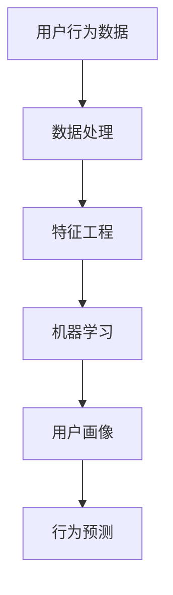

                 

# AI用户行为分析系统的实现

## 1. 背景介绍

### 1.1 问题由来
随着互联网的普及，越来越多的企业开始利用网络进行产品销售和品牌推广，但如何更好地理解用户需求、优化用户体验、提升销售转化率，成为企业数字化转型的关键问题。通过用户行为数据分析，企业可以深入了解用户行为特征，预测用户需求，优化产品设计和营销策略，从而提高运营效率和市场竞争力。

### 1.2 问题核心关键点
用户行为分析旨在通过分析用户在产品使用过程中的各种行为数据，挖掘用户的偏好、需求和行为模式，以指导企业进行产品优化和精准营销。其关键点包括：

1. **数据采集**：收集用户行为数据，涵盖浏览记录、点击行为、购买记录、互动反馈等。
2. **数据处理**：对采集的数据进行清洗、去重、归一化等预处理，确保数据质量。
3. **数据分析**：应用机器学习、深度学习等技术，对数据进行建模和分析，挖掘用户行为特征。
4. **用户画像构建**：将分析结果转化为可视化的用户画像，帮助企业理解不同用户群体。
5. **行为预测**：基于历史行为数据，预测用户未来的行为，如购买意向、流失风险等。

### 1.3 问题研究意义
用户行为分析系统不仅能帮助企业提高运营效率，还能提升用户体验，增强用户粘性。其研究意义在于：

1. **提升用户体验**：通过精准了解用户需求，优化产品功能，提升用户满意度。
2. **增强精准营销**：利用用户画像和行为预测，进行个性化营销，提高转化率和ROI。
3. **促进数据驱动决策**：提供数据支持和可视化分析，帮助企业决策，优化业务流程。
4. **应对市场竞争**：洞察市场趋势，预测用户行为，保持竞争优势。

## 2. 核心概念与联系

### 2.1 核心概念概述

为更好地理解用户行为分析系统，本节将介绍几个核心概念：

- **用户行为分析**：通过分析用户在产品使用过程中的各种行为数据，挖掘用户的偏好、需求和行为模式。
- **机器学习**：使用算法对数据进行建模和分析，从中提取有价值的信息。
- **深度学习**：一种特殊的机器学习方法，使用多层神经网络进行复杂模式的提取和分类。
- **用户画像**：根据用户行为数据，构建用户特征向量，以可视化形式展示。
- **行为预测**：基于历史行为数据，预测用户未来的行为，如购买意向、流失风险等。

这些核心概念之间的逻辑关系可以通过以下Mermaid流程图来展示：



这个流程图展示了一个简单的用户行为分析系统的数据流程：从用户行为数据开始，经过数据处理、特征工程、机器学习，最终得到用户画像和行为预测结果。

## 3. 核心算法原理 & 具体操作步骤

### 3.1 算法原理概述
用户行为分析系统通常包括以下几个核心算法：

- **数据预处理算法**：包括数据清洗、特征选择、归一化等，目的是提高数据质量。
- **特征提取算法**：使用统计方法、聚类算法等，从原始数据中提取有意义的特征。
- **分类算法**：使用监督学习算法如逻辑回归、决策树、随机森林等，进行分类预测。
- **回归算法**：使用监督学习算法如线性回归、岭回归等，进行连续值预测。
- **聚类算法**：使用无监督学习算法如K-means、DBSCAN等，对用户进行分组。

### 3.2 算法步骤详解

用户行为分析系统的实现一般包括以下几个关键步骤：

**Step 1: 数据收集与清洗**
- 定义数据采集渠道，包括网站日志、应用日志、社交媒体等。
- 使用日志分析工具，对采集数据进行清洗和去重，确保数据的准确性和完整性。
- 对异常数据进行处理，如填充缺失值、处理异常值等。

**Step 2: 特征工程**
- 分析数据，提取有意义的特征。
- 选择最优特征，并进行归一化、编码等预处理操作。
- 设计特征工程流程，避免过拟合和欠拟合。

**Step 3: 模型训练与优化**
- 选择适合的机器学习模型，进行训练和验证。
- 调整模型参数，优化模型性能。
- 应用交叉验证、网格搜索等方法，选择最优模型。

**Step 4: 用户画像构建**
- 根据训练好的模型，对用户进行分类和聚类。
- 使用特征可视化工具，构建用户画像。
- 生成用户画像报告，展示用户特征和行为模式。

**Step 5: 行为预测**
- 使用训练好的模型，进行行为预测。
- 生成预测报告，展示预测结果和置信度。
- 应用预测结果，指导企业进行决策。

### 3.3 算法优缺点

用户行为分析系统的优点包括：

1. **高效率**：能够快速处理大规模数据，提供实时分析结果。
2. **高精度**：使用先进的机器学习算法，提高预测和分类的准确性。
3. **多维度**：涵盖用户行为的全方位数据，提供多角度的分析视角。
4. **可视化**：生成用户画像和预测报告，便于理解和展示分析结果。

同时，该方法也存在一定的局限性：

1. **数据依赖**：依赖于数据质量，数据采集和处理环节的偏差会影响结果。
2. **模型复杂度**：模型设计复杂，需要专业知识。
3. **隐私问题**：处理敏感数据，需要确保数据隐私和安全。
4. **计算资源**：需要较高的计算资源，特别是深度学习模型。

尽管存在这些局限性，但用户行为分析系统在当前数字化时代具有重要应用价值，是企业进行数据驱动决策的关键工具。

### 3.4 算法应用领域

用户行为分析系统的应用领域广泛，涵盖以下几个方面：

1. **电子商务**：通过分析用户购物行为，进行个性化推荐和精准营销。
2. **社交媒体**：分析用户互动和内容消费，优化内容策略，提高用户粘性。
3. **金融服务**：分析用户交易行为，进行风险评估和用户分类。
4. **医疗健康**：分析用户健康数据，进行疾病预测和个性化健康建议。
5. **物流管理**：分析用户物流行为，优化配送路线和物流策略。
6. **旅游行业**：分析用户旅游行为，优化旅游产品和营销策略。

用户行为分析系统在以上领域的应用，能够帮助企业深入了解用户需求，优化产品和服务，提高运营效率和市场竞争力。

## 4. 数学模型和公式 & 详细讲解  
### 4.1 数学模型构建

本节将使用数学语言对用户行为分析系统的核心算法进行更加严格的刻画。

记用户行为数据为 $D=\{x_i\}_{i=1}^N$，其中 $x_i$ 表示第 $i$ 个用户的行为数据。记机器学习模型为 $f_{\theta}$，其中 $\theta$ 为模型参数。

假设用户行为数据为二分类数据，即 $x_i \in \{0,1\}$，表示用户是否发生某个行为。使用逻辑回归模型进行分类，其损失函数为：

$$
\mathcal{L}(\theta) = -\frac{1}{N}\sum_{i=1}^N [y_i\log \hat{y_i} + (1-y_i)\log(1-\hat{y_i})]
$$

其中 $\hat{y_i}=f_{\theta}(x_i)$ 为模型预测结果。

### 4.2 公式推导过程

以下我们以二分类任务为例，推导逻辑回归模型的公式及其梯度计算。

逻辑回归模型的输出为 $\hat{y_i}=f_{\theta}(x_i)=\frac{1}{1+\exp(-z_i)}$，其中 $z_i=\theta^T x_i$。

损失函数 $\mathcal{L}(\theta)$ 对 $\theta$ 的梯度为：

$$
\nabla_{\theta}\mathcal{L}(\theta) = -\frac{1}{N}\sum_{i=1}^N [y_i(x_i-\hat{y_i})x_i]
$$

其中 $\nabla_{\theta}\mathcal{L}(\theta)$ 为损失函数对参数 $\theta$ 的梯度，可通过反向传播算法高效计算。

在得到损失函数的梯度后，即可带入参数更新公式，完成模型的迭代优化。重复上述过程直至收敛，最终得到最优模型参数 $\theta^*$。

## 5. 项目实践：代码实例和详细解释说明

### 5.1 开发环境搭建

在进行用户行为分析系统的开发前，我们需要准备好开发环境。以下是使用Python进行Scikit-learn开发的环境配置流程：

1. 安装Anaconda：从官网下载并安装Anaconda，用于创建独立的Python环境。

2. 创建并激活虚拟环境：
```bash
conda create -n sklearn-env python=3.8 
conda activate sklearn-env
```

3. 安装Scikit-learn：
```bash
pip install scikit-learn
```

4. 安装各类工具包：
```bash
pip install numpy pandas scikit-learn matplotlib tqdm jupyter notebook ipython
```

完成上述步骤后，即可在`sklearn-env`环境中开始用户行为分析系统的开发。

### 5.2 源代码详细实现

下面我们以用户行为分析为例，给出使用Scikit-learn进行二分类任务的代码实现。

首先，定义数据集：

```python
from sklearn.datasets import make_classification
from sklearn.model_selection import train_test_split
import numpy as np

X, y = make_classification(n_samples=1000, n_features=10, n_informative=5, n_redundant=0, random_state=42)
X_train, X_test, y_train, y_test = train_test_split(X, y, test_size=0.2, random_state=42)
```

然后，定义模型和评估函数：

```python
from sklearn.linear_model import LogisticRegression
from sklearn.metrics import classification_report
from sklearn.model_selection import cross_val_score

model = LogisticRegression(solver='lbfgs', max_iter=1000)
model.fit(X_train, y_train)
y_pred = model.predict(X_test)

print(classification_report(y_test, y_pred))
```

接着，应用交叉验证进行模型评估：

```python
cross_val_score(model, X, y, cv=5)
```

最后，启动训练流程并在测试集上评估：

```python
from sklearn.metrics import roc_auc_score

y_pred_proba = model.predict_proba(X_test)[:, 1]
roc_auc = roc_auc_score(y_test, y_pred_proba)
print(f"ROC AUC Score: {roc_auc}")
```

以上就是使用Scikit-learn对二分类任务进行用户行为分析的完整代码实现。可以看到，借助Scikit-learn的强大封装，我们可以用相对简洁的代码完成用户行为分析任务的实现。

### 5.3 代码解读与分析

让我们再详细解读一下关键代码的实现细节：

**数据集定义**：
- 使用Scikit-learn的`make_classification`函数生成一个随机二分类数据集，其中包含1000个样本和10个特征。
- 使用`train_test_split`函数将数据集划分为训练集和测试集，并随机打乱数据顺序。

**模型定义**：
- 定义逻辑回归模型，并设置超参数`solver='lbfgs'`和`max_iter=1000`。

**训练与评估**：
- 使用`fit`方法训练模型，并使用`predict`方法在测试集上进行预测。
- 使用`classification_report`函数输出分类报告，展示精确度、召回率、F1得分等指标。
- 使用`roc_auc_score`函数计算ROC AUC，评估模型预测能力。

**交叉验证**：
- 使用`cross_val_score`函数进行交叉验证，评估模型在不同数据集上的泛化能力。

可以看到，Scikit-learn提供了一系列强大的机器学习工具，可以显著提升用户行为分析任务的开发效率，加快创新迭代的步伐。

当然，工业级的系统实现还需考虑更多因素，如模型的保存和部署、超参数的自动搜索、更灵活的任务适配层等。但核心的用户行为分析算法基本与此类似。

## 6. 实际应用场景

### 6.1 电商平台的用户行为分析

电商平台的业务场景中，通过用户行为分析，能够了解用户的购买意向和消费习惯，从而进行个性化推荐和精准营销。具体而言，可以分析用户的浏览记录、购买历史、点击行为等数据，预测用户未来的购买意向，并根据预测结果进行推荐。

在技术实现上，可以收集用户浏览、点击、购买等行为数据，构建二分类模型进行预测。使用交叉验证和网格搜索，优化模型参数，选择最优模型。最终将模型应用于电商平台的推荐系统中，实时生成个性化推荐内容。

### 6.2 社交媒体的用户行为分析

社交媒体平台的用户行为分析，能够帮助企业了解用户的互动行为和内容偏好，优化内容策略，提高用户粘性。具体而言，可以分析用户在平台上的点赞、评论、分享等行为数据，预测用户对不同内容的喜好程度，从而优化内容分发策略。

在技术实现上，可以收集用户互动数据，构建多分类模型进行预测。使用特征工程技术，提取有意义的特征。应用集成学习技术，提高模型性能。最终将模型应用于社交媒体平台的内容推荐系统中，优化内容分发策略。

### 6.3 金融服务的行为分析

金融服务行业需要通过用户行为分析，进行风险评估和用户分类。具体而言，可以分析用户的交易记录、财务数据等行为数据，预测用户是否存在风险行为，如欺诈行为、违约行为等。

在技术实现上，可以收集用户交易数据，构建分类模型进行预测。使用聚类算法，将用户进行分组，识别高风险用户。应用风险评估算法，量化风险程度。最终将模型应用于金融服务系统，进行风险评估和预警。

### 6.4 医疗健康的行为分析

医疗健康行业需要通过用户行为分析，进行疾病预测和个性化健康建议。具体而言，可以分析用户的健康数据，如运动记录、饮食记录等行为数据，预测用户的健康状况和疾病风险，从而提供个性化的健康建议。

在技术实现上，可以收集用户的健康数据，构建回归模型进行预测。使用特征工程技术，提取有意义的特征。应用可视化技术，展示健康趋势。最终将模型应用于医疗健康系统，提供个性化的健康建议。

## 7. 工具和资源推荐

### 7.1 学习资源推荐

为了帮助开发者系统掌握用户行为分析的理论基础和实践技巧，这里推荐一些优质的学习资源：

1. **《Python机器学习》（2nd Edition）**：由Sebastian Raschka和Vahid Mirjalili所著，系统介绍了机器学习在Python中的实现方法，涵盖了数据处理、模型训练、模型评估等内容。

2. **《深度学习》（Ian Goodfellow著）**：全面介绍了深度学习的基本概念、算法原理和应用实践，是深度学习领域的经典教材。

3. **Kaggle竞赛和项目**：Kaggle是一个著名的数据科学竞赛平台，提供了丰富的机器学习竞赛和项目，是学习和实践用户行为分析的好资源。

4. **Coursera在线课程**：Coursera提供了大量机器学习和深度学习的在线课程，由斯坦福大学、密歇根大学等名校教授授课，深入浅出地介绍了机器学习理论和实践。

5. **Scikit-learn官方文档**：Scikit-learn的官方文档详细介绍了机器学习算法的原理和使用方法，是Scikit-learn用户必备的参考资料。

通过对这些资源的学习实践，相信你一定能够快速掌握用户行为分析的核心算法和实现方法，并将其应用于实际问题中。

### 7.2 开发工具推荐

高效的开发离不开优秀的工具支持。以下是几款用于用户行为分析系统开发的常用工具：

1. **Python**：Python是一种高效易学的编程语言，适合数据处理和机器学习算法的实现。

2. **Scikit-learn**：基于Python的机器学习库，提供了丰富的算法实现和数据处理工具，适合快速迭代研究。

3. **TensorFlow**：由Google主导开发的深度学习框架，适合大规模工程应用，支持GPU加速。

4. **PyTorch**：基于Python的深度学习框架，灵活动态的计算图，适合快速迭代研究。

5. **Jupyter Notebook**：交互式的笔记本环境，适合编写和调试代码，展示分析结果。

6. **Visual Studio Code**：轻量级的代码编辑器，支持Python和Scikit-learn的语法高亮和自动补全，提高开发效率。

合理利用这些工具，可以显著提升用户行为分析系统的开发效率，加快创新迭代的步伐。

### 7.3 相关论文推荐

用户行为分析系统的研究源于学界的持续研究。以下是几篇奠基性的相关论文，推荐阅读：

1. **"User Behavior Analysis for Recommendation Systems"**：由Fernando Lopes和José Raimundo所著，系统介绍了用户行为分析在推荐系统中的应用，提出了一些经典的用户行为分析方法。

2. **"Personalized Recommendation Algorithms for E-commerce"**：由Dawen Li等所著，介绍了电商领域中的推荐算法，包括协同过滤、基于内容的推荐等。

3. **"Understanding Social Media Users: An Analysis of Social Media Users' Behavior"**：由Julianne Vosoughi等所著，研究了社交媒体用户的行为模式，提出了一些社交媒体数据分析方法。

4. **"Health Data Mining: A Survey of Recent Advances and Challenges"**：由Nikita Kumar和Anant Raj等所著，介绍了健康数据分析方法，包括用户行为分析和疾病预测等。

这些论文代表了大用户行为分析技术的发展脉络。通过学习这些前沿成果，可以帮助研究者把握学科前进方向，激发更多的创新灵感。

## 8. 总结：未来发展趋势与挑战

### 8.1 总结

本文对用户行为分析系统的实现进行了全面系统的介绍。首先阐述了用户行为分析系统的背景和意义，明确了其在提升用户体验、增强精准营销、促进数据驱动决策等方面的重要性。其次，从原理到实践，详细讲解了用户行为分析的数学原理和关键步骤，给出了用户行为分析任务开发的完整代码实例。同时，本文还广泛探讨了用户行为分析系统在电商、社交媒体、金融、医疗等众多领域的应用前景，展示了用户行为分析技术的巨大潜力。

通过本文的系统梳理，可以看到，用户行为分析系统在当前数字化时代具有重要应用价值，是企业进行数据驱动决策的关键工具。未来，伴随机器学习、深度学习技术的持续演进，用户行为分析系统也将不断迭代和优化，为构建数据驱动的智能决策系统铺平道路。

### 8.2 未来发展趋势

展望未来，用户行为分析技术将呈现以下几个发展趋势：

1. **智能化**：通过深度学习和自然语言处理技术，用户行为分析系统将更加智能化，能够理解用户意图，进行更准确的预测和推荐。

2. **实时化**：通过大数据和云计算技术，用户行为分析系统将实现实时分析和预测，提高响应速度。

3. **多模态化**：涵盖用户行为的全方位数据，包括语音、图像、视频等，构建多模态用户行为分析系统。

4. **个性化**：通过深度学习等技术，用户行为分析系统将更加个性化，能够为每个用户提供量身定制的推荐和服务。

5. **联邦学习**：通过分布式学习技术，用户行为分析系统能够在多个设备之间共享知识，提高模型的泛化能力。

以上趋势凸显了用户行为分析技术的广阔前景。这些方向的探索发展，必将进一步提升用户行为分析系统的性能和应用范围，为构建人机协同的智能系统铺平道路。

### 8.3 面临的挑战

尽管用户行为分析技术已经取得了瞩目成就，但在迈向更加智能化、普适化应用的过程中，它仍面临着诸多挑战：

1. **数据质量**：数据采集和处理环节的偏差会影响结果，需要高质量、完整的数据。

2. **模型复杂度**：模型设计复杂，需要专业知识，难以推广到更广泛的应用场景。

3. **隐私问题**：处理敏感数据，需要确保数据隐私和安全。

4. **计算资源**：需要较高的计算资源，特别是深度学习模型。

尽管存在这些挑战，但用户行为分析技术在当前数字化时代具有重要应用价值，是企业进行数据驱动决策的关键工具。未来，伴随技术的不断进步，这些挑战也将逐步被克服，用户行为分析系统必将在构建数据驱动的智能决策系统方面发挥更大的作用。

### 8.4 研究展望

面对用户行为分析系统所面临的挑战，未来的研究需要在以下几个方面寻求新的突破：

1. **数据增强技术**：通过数据增强技术，提高数据的多样性和泛化能力。

2. **轻量级模型**：开发轻量级模型，减少计算资源消耗，提高实时性。

3. **联邦学习**：通过联邦学习技术，实现分布式学习，提高模型泛化能力。

4. **模型解释性**：提高模型的可解释性，帮助用户理解和信任模型。

5. **隐私保护技术**：开发隐私保护技术，保护用户数据隐私和安全。

6. **多模态融合**：将语音、图像、视频等多模态数据与文本数据融合，提高用户行为分析的准确性。

这些研究方向将推动用户行为分析技术不断迭代和优化，为构建数据驱动的智能决策系统提供强有力的技术支撑。

## 9. 附录：常见问题与解答

**Q1：用户行为分析系统是否适用于所有业务场景？**

A: 用户行为分析系统适用于大多数业务场景，特别是数据驱动决策场景。但某些特定场景，如医疗、金融等，需要更多的专业知识和领域知识，才能获得理想的效果。

**Q2：用户行为分析系统如何避免过拟合？**

A: 避免过拟合的关键在于数据预处理和模型设计。需要确保数据质量，选择合适的模型和算法，进行交叉验证和参数调优。使用正则化技术，如L2正则、Dropout等，可以进一步提高模型的泛化能力。

**Q3：用户行为分析系统如何提高实时性？**

A: 提高实时性的关键在于算法优化和硬件资源配置。可以通过减少模型参数、优化算法计算图、使用GPU加速等方式，提高模型的计算效率。合理配置硬件资源，如CPU、GPU等，也可以提高系统的响应速度。

**Q4：用户行为分析系统如何处理数据隐私问题？**

A: 处理数据隐私问题的关键在于数据匿名化和加密技术。需要对用户数据进行去标识化处理，确保数据匿名。使用加密技术，如同态加密、差分隐私等，保护用户数据隐私。

**Q5：用户行为分析系统如何提高模型解释性？**

A: 提高模型解释性的关键在于模型可视化技术和特征可解释性分析。可以使用特征可视化工具，展示模型特征重要性。应用可解释性算法，如LIME、SHAP等，解释模型的决策过程。

这些问题的答案，能够帮助开发者在实际应用中更好地理解和应用用户行为分析系统，解决实际问题。

---

作者：禅与计算机程序设计艺术 / Zen and the Art of Computer Programming

