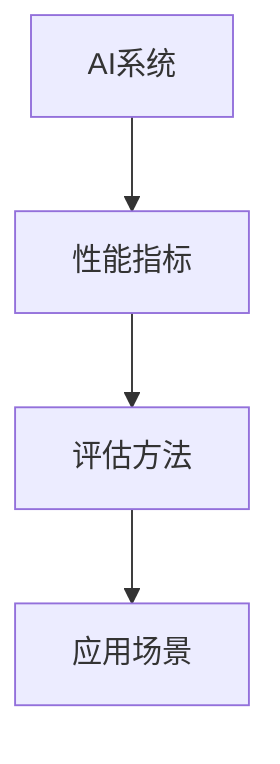

                 

# AI系统性能评估的详细方法

在人工智能(AI)技术的飞速发展的今天，构建一个高性能的AI系统已经成为企业和研究机构的共同追求。然而，由于AI系统的复杂性和多样性，性能评估方法变得尤为关键，以确保其能否在实际应用场景中发挥预期作用。本文将深入探讨AI系统性能评估的详细方法，涵盖背景介绍、核心概念、算法原理、具体操作步骤、应用场景、学习资源、未来趋势、常见问题及解答。

## 1. 背景介绍

### 1.1 问题由来
在AI技术的快速发展过程中，评估系统的性能成为衡量其质量和实用性的关键。AI系统性能评估不仅是衡量技术进步的重要指标，也是指导模型训练和优化的基础。传统上，评估AI系统的方法包括准确率、召回率、F1分数等指标，但这些方法在面对复杂和多样化的AI系统时，显得不足。现代AI系统，如深度学习模型，涉及大量参数和超复杂计算，简单的性能指标已无法全面反映其能力。因此，本文旨在提出一套系统的、详细的AI系统性能评估方法，以适应各种AI系统，确保其在实际应用中的可靠性和有效性。

### 1.2 问题核心关键点
AI系统性能评估的核心在于选择适当的指标和评估方法，以及如何将这些方法应用到具体系统。不同的AI系统可能具有不同的评估需求，如模型的准确性、效率、鲁棒性、可解释性等。评估方法的科学性和全面性直接影响到AI系统的应用效果。此外，评估方法应当与实际应用场景紧密结合，确保评估结果具有实用价值。

## 2. 核心概念与联系

### 2.1 核心概念概述

AI系统性能评估涉及多个关键概念：

- **AI系统**：指能够自动执行特定任务的人工智能应用程序，如深度学习模型、自然语言处理系统、图像识别系统等。
- **性能指标**：用于衡量AI系统性能的指标，如准确率、召回率、F1分数、AUC等。
- **评估方法**：用于确定和计算性能指标的技术和算法，如交叉验证、留出法、自助法等。
- **应用场景**：AI系统在实际应用中的具体环境，如医疗诊断、智能客服、金融预测等。

这些概念之间的关系可以用以下Mermaid流程图表示：



### 2.2 核心概念原理和架构的 Mermaid 流程图

由于篇幅限制，我们无法直接在这里展示流程图，但可以概括如下：AI系统由模型参数和数据集组成，性能指标和评估方法对数据集进行操作，得到系统的评估结果，这些结果在实际应用场景中得到验证和反馈，进而指导系统的优化和改进。

## 3. 核心算法原理 & 具体操作步骤

### 3.1 算法原理概述

AI系统性能评估的核心算法原理基于统计学和机器学习理论。通过选取合适的评估方法，对系统在训练集和测试集上的性能进行测量和分析。性能指标的计算依赖于统计学的抽样方法和误差分析，而评估方法的选择则基于模型本身的特点和应用场景的需求。

### 3.2 算法步骤详解

基于上述原理，AI系统性能评估的步骤如下：

**Step 1: 数据准备**
- 确定训练集和测试集，划分为多个子集（如K折交叉验证），确保数据的多样性和代表性。
- 对数据进行预处理，如数据清洗、归一化、标准化等。

**Step 2: 选择性能指标**
- 根据具体AI系统的任务特点，选择合适的性能指标，如准确率、召回率、F1分数、AUC等。
- 针对不同的任务需求，可能需要同时考虑多个指标，并设置不同的权重，进行加权平均。

**Step 3: 应用评估方法**
- 根据AI系统的复杂程度和数据量，选择适合的评估方法，如留出法、交叉验证、自助法等。
- 使用评估方法对数据集进行分割和计算，得到系统的性能指标。
- 通过多次实验，确保评估结果的稳定性和可靠性。

**Step 4: 结果分析与优化**
- 分析性能指标，找出系统在哪些方面存在不足，需要优化。
- 根据分析结果，调整模型参数、训练策略和评估方法，提升系统性能。
- 进行新一轮评估，验证改进效果。

### 3.3 算法优缺点

基于上述步骤的评估方法，具有以下优点：

1. **全面性**：能够对AI系统的多个方面进行评估，包括准确性、效率、鲁棒性、可解释性等。
2. **稳定性**：通过多次实验和多种评估方法，确保评估结果的可靠性和稳定性。
3. **实用性**：评估方法与实际应用场景紧密结合，确保评估结果具有实用价值。

同时，该方法也存在以下缺点：

1. **复杂性**：评估方法和参数选择复杂，需要较高的专业知识和经验。
2. **数据依赖**：评估结果依赖于数据集的质量和多样性，高质量的数据是评估的必要条件。
3. **资源消耗**：多轮实验和交叉验证可能需要大量的计算资源和时间。

### 3.4 算法应用领域

AI系统性能评估方法广泛适用于各种AI系统，如深度学习模型、自然语言处理系统、图像识别系统等。在不同的应用场景中，根据具体需求选择合适的评估指标和方法，确保系统的性能和实用价值。

## 4. 数学模型和公式 & 详细讲解 & 举例说明

### 4.1 数学模型构建

AI系统性能评估的数学模型主要基于统计学和机器学习理论。常用的性能指标和评估方法都有对应的数学公式和推导过程。

以准确率和召回率为例，其数学模型如下：

$$
\text{Accuracy} = \frac{TP+TN}{TP+TN+FP+FN}
$$

$$
\text{Recall} = \frac{TP}{TP+FN}
$$

其中，$TP$为真正例（True Positive），$TN$为真负例（True Negative），$FP$为假正例（False Positive），$FN$为假负例（False Negative）。

### 4.2 公式推导过程

上述公式的推导基于分类问题中的混淆矩阵（Confusion Matrix）。混淆矩阵是一个$2 \times 2$的矩阵，用于描述分类器的输出结果和实际标签之间的对应关系。

$$
\begin{bmatrix}
\text{TP} & \text{FP} \\
\text{FN} & \text{TN}
\end{bmatrix}
$$

通过混淆矩阵，可以计算出准确率和召回率等性能指标。以准确率为例，其计算公式为：

$$
\text{Accuracy} = \frac{\text{TP+TN}}{\text{TP+TN+FP+FN}}
$$

这表明，准确率反映了分类器正确预测的样本占总样本的比例。

### 4.3 案例分析与讲解

以一个简单的二分类问题为例，我们有一个包含$N$个样本的数据集，其中$P$个为正类，$N-P$个为负类。我们通过一个线性分类器进行分类，得到$M$个预测为正类的样本和$N-M$个预测为负类的样本。我们可以通过混淆矩阵计算出准确率和召回率，并根据实际应用需求选择合适的评估指标。

假设分类器的预测结果如下：

$$
\begin{bmatrix}
\text{TP} & \text{FP} \\
\text{FN} & \text{TN}
\end{bmatrix}
$$

我们可以通过上述公式计算出准确率和召回率，并根据实际应用场景进行优化和改进。

## 5. 项目实践：代码实例和详细解释说明

### 5.1 开发环境搭建

AI系统性能评估的实现依赖于Python和常用的机器学习库，如Scikit-learn、TensorFlow等。以下是一个简单的开发环境搭建过程：

1. 安装Python和必要的库，如Scikit-learn、TensorFlow等。
2. 使用Jupyter Notebook进行开发和实验。
3. 安装必要的工具和库，如Pandas、Numpy、Matplotlib等。

### 5.2 源代码详细实现

以下是一个简单的AI系统性能评估的Python代码实现：

```python
from sklearn.metrics import accuracy_score, recall_score
from sklearn.model_selection import cross_val_score

# 加载数据集
X_train, y_train = load_train_data()
X_test, y_test = load_test_data()

# 训练模型
model = train_model(X_train, y_train)

# 评估模型
accuracy = accuracy_score(y_test, model.predict(X_test))
recall = recall_score(y_test, model.predict(X_test))
print("Accuracy: ", accuracy)
print("Recall: ", recall)

# 交叉验证
scores = cross_val_score(model, X_train, y_train, cv=5)
print("Cross-validation scores: ", scores.mean())
```

### 5.3 代码解读与分析

上述代码实现了对训练集和测试集的加载、模型的训练和预测，以及准确率和召回率的计算。同时，使用交叉验证对模型进行评估，确保评估结果的稳定性和可靠性。

## 6. 实际应用场景

### 6.1 医疗诊断

AI系统性能评估在医疗诊断中具有重要应用。例如，使用深度学习模型进行疾病诊断，准确率和召回率是衡量模型性能的关键指标。通过评估这些指标，可以指导模型训练和参数优化，提升诊断准确性和可靠性。

### 6.2 金融预测

金融预测是AI系统在金融领域的重要应用。通过评估模型的准确率和鲁棒性，可以确保模型在面对市场波动和噪声时仍能提供可靠的预测结果。

### 6.3 智能客服

智能客服系统在实际应用中需要高效、准确地处理用户请求。通过评估系统的响应时间和准确率，可以指导系统优化和改进，提升用户体验。

### 6.4 未来应用展望

随着AI技术的不断发展，性能评估方法将更加复杂和多样。未来，我们可以预见以下趋势：

1. **多模态评估**：除了传统的单模态评估方法，多模态评估方法将结合多种数据类型，如文本、图像、语音等，进行综合评估。
2. **自动化评估**：随着AI技术的进一步发展，自动化评估方法将逐步取代手动评估，提高评估效率和准确性。
3. **动态评估**：动态评估方法将结合实时数据，对AI系统进行持续评估和优化，确保系统在实际应用中的稳定性和可靠性。

## 7. 工具和资源推荐

### 7.1 学习资源推荐

1. **《深度学习》一书**：Deep Learning by Ian Goodfellow、Yoshua Bengio和Aaron Courville。这本书是深度学习领域的经典教材，涵盖了深度学习的基本概念和应用。
2. **Scikit-learn官方文档**：Scikit-learn是Python中常用的机器学习库，其官方文档提供了详细的API文档和使用方法，是学习机器学习的重要资源。
3. **TensorFlow官方文档**：TensorFlow是Google开发的深度学习框架，其官方文档提供了详细的API文档和教程，是学习深度学习的重要资源。

### 7.2 开发工具推荐

1. **Jupyter Notebook**：Jupyter Notebook是一个开源的笔记本环境，支持Python和其他语言的开发和实验，是数据科学和机器学习开发的标准工具。
2. **TensorBoard**：TensorBoard是TensorFlow的可视化工具，可以实时监测模型训练状态，提供详细的图表和分析结果，是模型调优的重要工具。
3. **Weights & Biases**：Weights & Biases是一个实验跟踪工具，可以记录和可视化模型训练过程中的各项指标，是模型调优和评估的重要工具。

### 7.3 相关论文推荐

1. **《深度学习》论文**：Ian Goodfellow、Yoshua Bengio和Aaron Courville撰写的深度学习领域经典论文，深入介绍了深度学习的基本概念和应用。
2. **《交叉验证》论文**：Chuck Mooney和Dorothy DiLorenzo撰写的关于交叉验证的经典论文，详细介绍了交叉验证的方法和应用。
3. **《多模态学习》论文**：这是一个关于多模态学习的研究领域，涉及多模态数据的融合和评估方法。

## 8. 总结：未来发展趋势与挑战

### 8.1 研究成果总结

本文详细介绍了AI系统性能评估的原理和方法，涵盖数据准备、性能指标选择、评估方法应用和结果分析与优化等各个环节。通过实例分析，展示了评估方法在实际应用中的使用过程和效果。

### 8.2 未来发展趋势

1. **多模态评估**：随着AI系统的多样化，多模态评估方法将成为未来的一个重要趋势。
2. **自动化评估**：自动化评估方法将取代手动评估，提高评估效率和准确性。
3. **动态评估**：动态评估方法将结合实时数据，对AI系统进行持续评估和优化。

### 8.3 面临的挑战

1. **数据依赖**：高质量的数据是评估的基础，获取高质量数据往往需要较高的成本。
2. **模型复杂性**：AI系统的复杂性增加了评估的难度和复杂性。
3. **资源消耗**：评估过程需要大量计算资源和时间，尤其是在多模态和动态评估中。

### 8.4 研究展望

未来，我们需要在以下几个方面进行深入研究：

1. **自动化评估方法**：研究自动化评估方法，提高评估效率和准确性。
2. **多模态评估方法**：研究多模态数据的融合和评估方法，提高评估的全面性。
3. **动态评估方法**：研究动态评估方法，结合实时数据进行持续优化。

总之，AI系统性能评估是一个复杂而多样化的过程，需要我们在多个环节进行细致的分析和优化。只有不断探索和创新，才能确保AI系统在实际应用中的可靠性和有效性。

## 9. 附录：常见问题与解答

**Q1: 如何选择合适的评估方法？**

A: 选择合适的评估方法需要考虑AI系统的特点和应用场景。一般而言，对于复杂的AI系统，如深度学习模型，可以选择交叉验证和留一法等方法；对于简单模型，如决策树和逻辑回归，可以选择留出法和自助法等方法。

**Q2: 如何处理类别不平衡问题？**

A: 类别不平衡问题是评估AI系统性能时常见的问题。可以通过重采样（如欠采样和过采样）、权重调整（如Focal Loss）、阈值调整等方法进行解决。

**Q3: 如何处理多类别问题？**

A: 对于多类别问题，可以使用宏平均（Macro Average）和微平均（Micro Average）等方法进行评估。宏平均考虑每个类别的平均性能，而微平均考虑所有类别的平均性能。

**Q4: 如何处理样本不平衡问题？**

A: 样本不平衡问题可以通过重采样（如欠采样和过采样）、权重调整（如Focal Loss）等方法进行解决。此外，可以使用类别不平衡学习的模型，如SMOTE等方法。

**Q5: 如何处理回归问题？**

A: 对于回归问题，常用的性能指标包括均方误差（MSE）、平均绝对误差（MAE）、R²等。评估方法可以选择交叉验证、留一法等。

总之，AI系统性能评估是一个复杂而多样化的过程，需要我们在多个环节进行细致的分析和优化。只有不断探索和创新，才能确保AI系统在实际应用中的可靠性和有效性。

