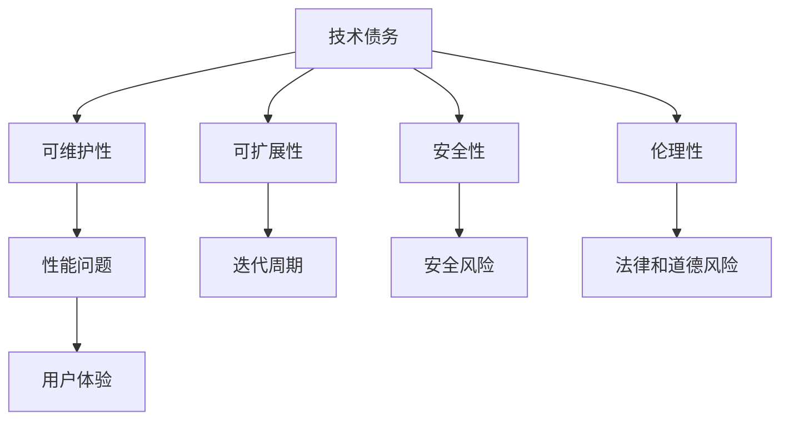

                 

# AI系统的技术债务评估

## 1. 背景介绍

随着人工智能技术的飞速发展，AI系统的规模和复杂度也在不断增加。这不仅带来了巨大的创新潜力，也带来了一些不可避免的副作用——技术债务。技术债务是指在开发过程中为了追求短期目标而牺牲长期可维护性、可扩展性和安全性所带来的隐形成本。在AI系统的设计和开发过程中，技术债务尤为严重，因为模型的持续训练、更新和维护往往需要大量的计算资源和专业知识，而且在处理大规模数据集时，数据偏差、模型过拟合等问题也常常困扰着开发者。

### 1.1 技术债务的来源

技术债务主要来源于以下几个方面：

- **快速迭代**：在快速迭代和竞争激烈的市场环境中，开发者往往更注重产品的快速交付和市场反馈，而忽视了对系统的长期维护和优化，导致系统设计缺陷和代码债务的积累。
- **数据偏差**：AI系统依赖于大量数据进行训练，数据偏差和不平衡会导致模型产生歧视性或不公平的输出，这不仅影响模型的性能，还会引发伦理和社会问题。
- **模型复杂性**：随着模型的复杂度增加，模型的训练和推理时间会显著增长，资源需求也会随之上升。这不仅增加了系统的维护成本，还可能带来性能瓶颈和安全风险。
- **技术栈多样性**：为了满足各种需求和场景，AI系统往往采用多种技术栈和工具，导致系统复杂度和维护难度大幅增加。

### 1.2 技术债务的影响

技术债务对AI系统的影响主要体现在以下几个方面：

- **性能问题**：技术债务可能导致系统性能下降，模型响应时间变慢，影响用户体验。
- **安全风险**：数据偏差和模型过拟合等问题可能导致系统输出错误或不公平的决策，带来法律和道德风险。
- **维护成本**：技术债务增加了系统的维护成本，延长了迭代周期，降低了开发效率。
- **用户体验**：技术债务可能导致系统的易用性和稳定性下降，影响用户体验和系统口碑。

## 2. 核心概念与联系

### 2.1 核心概念概述

为了更清晰地理解技术债务的概念及其在AI系统中的体现，本文将介绍几个关键概念：

- **技术债务**：指在开发过程中为了追求短期目标而牺牲长期可维护性、可扩展性和安全性所带来的隐形成本。
- **可维护性**：指系统的代码和设计能够被理解、修改、扩展和测试的能力。
- **可扩展性**：指系统能够灵活应对需求变化和未来扩展的能力。
- **安全性**：指系统能够保护数据和用户隐私，防止数据泄露、篡改等安全威胁。
- **伦理性**：指系统在处理敏感数据和决策时，能够保证公平、透明和合规。

这些概念之间存在紧密联系。技术债务不仅影响系统的性能和可维护性，还可能导致安全性和伦理性的问题，最终影响用户体验和系统口碑。因此，评估和应对技术债务是AI系统设计和开发过程中不可或缺的一环。

### 2.2 核心概念原理和架构的 Mermaid 流程图



这个流程图展示了技术债务对AI系统各个方面的影响。技术债务的存在会导致系统的可维护性下降，性能问题增加，可扩展性和安全性受到威胁，伦理性和用户体验也会受到影响。

## 3. 核心算法原理 & 具体操作步骤

### 3.1 算法原理概述

评估AI系统的技术债务，需要从多个维度进行分析，包括代码质量、模型性能、系统架构和用户反馈等。本文将介绍一种基于度量的技术债务评估方法，通过综合考虑这些维度，给出系统的技术债务评估分数。

### 3.2 算法步骤详解

基于度量的技术债务评估方法主要包括以下几个步骤：

1. **定义技术债务度量指标**：根据AI系统的特点，定义关键的技术债务度量指标，如代码质量指标、模型性能指标、架构复杂性指标和用户反馈指标等。
2. **收集数据**：通过代码审查、性能测试、架构分析等手段，收集相关的数据和信息，作为技术债务评估的依据。
3. **计算技术债务得分**：根据预定义的度量指标，计算系统的技术债务得分。
4. **分析技术债务原因**：对技术债务得分的各个维度进行深入分析，找出技术债务的主要原因。
5. **提出改进措施**：根据分析结果，提出针对性的改进措施，以降低技术债务的影响。

### 3.3 算法优缺点

基于度量的技术债务评估方法具有以下优点：

- **量化技术债务**：通过综合考虑多个维度的数据，可以较为全面地评估系统的技术债务。
- **指导改进**：通过分析技术债务的原因，可以帮助开发团队有针对性地提出改进措施，提高系统的质量和性能。

然而，该方法也存在一些局限性：

- **数据依赖**：评估结果的准确性依赖于数据的质量和完整性，数据偏差可能导致误判。
- **复杂性**：评估过程中需要综合考虑多个维度的数据，可能导致评估过程复杂、耗时。
- **主观性**：某些度量指标的评估可能存在主观性，需要开发团队具备一定的经验和专业知识。

### 3.4 算法应用领域

基于度量的技术债务评估方法适用于各种类型的AI系统，包括机器学习模型、自然语言处理、计算机视觉、智能推荐系统等。通过评估技术债务，开发团队可以及时发现和解决系统中的问题，提升系统的质量、性能和安全性，保障系统的长期稳定运行。

## 4. 数学模型和公式 & 详细讲解 & 举例说明

### 4.1 数学模型构建

为了量化技术债务，本文定义了一个简单的数学模型，用于综合评估AI系统的技术债务得分。该模型包括以下几个关键度量指标：

- **代码质量指标（Code Quality Score, CQS）**：用于评估代码的可读性、可维护性和可测试性。
- **模型性能指标（Model Performance Score, MPS）**：用于评估模型的准确性、召回率和F1分数等性能指标。
- **架构复杂性指标（Architecture Complexity Score, AC）**：用于评估系统的架构复杂度和设计合理性。
- **用户反馈指标（User Feedback Score, UFS）**：用于评估用户对系统的满意度和使用体验。

技术债务得分（Technical Debt Score, TDS）定义为：

$$
TDS = \alpha_1 \times CQS + \alpha_2 \times MPS + \alpha_3 \times AC + \alpha_4 \times UFS
$$

其中，$\alpha_1, \alpha_2, \alpha_3, \alpha_4$ 为各度量指标的权重，需要根据实际情况进行调整。

### 4.2 公式推导过程

各度量指标的具体计算方法如下：

- **代码质量指标（CQS）**：通过代码审查、静态分析工具等手段，评估代码的可读性、可维护性和可测试性。可以采用代码复杂度、耦合度、注释覆盖率等指标进行计算。
- **模型性能指标（MPS）**：通过测试集和验证集等手段，评估模型的准确性、召回率和F1分数等性能指标。
- **架构复杂性指标（AC）**：通过架构分析工具，评估系统的架构复杂度和设计合理性。可以采用模块化程度、类和方法的复杂度等指标进行计算。
- **用户反馈指标（UFS）**：通过用户调查、日志分析等手段，评估用户对系统的满意度和使用体验。可以采用用户满意度评分、问题反馈率等指标进行计算。

### 4.3 案例分析与讲解

以一个基于深度学习的智能推荐系统为例，介绍如何应用技术债务评估模型进行评估和改进：

1. **数据收集**：通过代码审查工具和性能测试工具，收集系统的代码质量数据和模型性能数据。
2. **计算技术债务得分**：根据预定义的度量指标，计算系统的技术债务得分。
3. **分析技术债务原因**：通过分析各度量指标的值，找出技术债务的主要原因。
4. **提出改进措施**：针对技术债务的主要原因，提出针对性的改进措施，如优化模型结构、改进代码质量、提高架构设计等。
5. **实施改进措施**：实施改进措施，并对系统的技术债务得分进行跟踪和评估，确保改进效果。

## 5. 项目实践：代码实例和详细解释说明

### 5.1 开发环境搭建

为了进行技术债务评估，我们需要搭建一个开发环境，包括以下几个关键组件：

1. **代码审查工具**：如SonarQube、CodeClimate等，用于评估代码质量。
2. **性能测试工具**：如JMeter、Gatling等，用于评估模型性能。
3. **架构分析工具**：如NDepend、SonarQube等，用于评估架构复杂性。
4. **用户反馈收集工具**：如Google Forms、SurveyMonkey等，用于收集用户反馈。
5. **数据仓库**：如Hadoop、Spark等，用于存储和分析数据。

### 5.2 源代码详细实现

下面以一个简单的代码质量评估工具为例，介绍如何实现代码质量指标的计算：

```python
import ast
import os

# 定义代码质量指标计算函数
def code_quality_score(source_dir):
    # 读取代码文件
    with open(os.path.join(source_dir, 'main.py'), 'r') as f:
        code = f.read()

    # 计算代码复杂度
    code_ast = ast.parse(code)
    complexity_score = calculate_code_complexity(code_ast)

    # 计算耦合度
    coupling_score = calculate_code_coupling(code_ast)

    # 计算注释覆盖率
    comment_score = calculate_code_comments(code)

    # 计算代码质量指标得分
    return complexity_score + coupling_score + comment_score

# 定义代码复杂度计算函数
def calculate_code_complexity(code_ast):
    # 实现代码复杂度计算的逻辑
    pass

# 定义代码耦合度计算函数
def calculate_code_coupling(code_ast):
    # 实现代码耦合度计算的逻辑
    pass

# 定义代码注释计算函数
def calculate_code_comments(code):
    # 实现代码注释计算的逻辑
    pass
```

### 5.3 代码解读与分析

上述代码实现了基本的代码质量指标计算函数。其中，`code_quality_score` 函数读取源代码文件，并调用其他函数计算代码复杂度、耦合度和注释覆盖率等指标。`calculate_code_complexity`、`calculate_code_coupling` 和 `calculate_code_comments` 函数实现了具体的计算逻辑，可以根据需要进行扩展和优化。

## 6. 实际应用场景

### 6.1 智能推荐系统

智能推荐系统是AI系统中常见的应用场景之一，技术债务评估可以帮助推荐系统优化代码质量、提升模型性能和设计合理性，从而提升推荐效果和用户体验。

### 6.2 自然语言处理

自然语言处理系统中，技术债务评估可以帮助优化语言模型、改进代码质量和设计合理性，提升系统的性能和可维护性，确保系统能够稳定运行。

### 6.3 计算机视觉

计算机视觉系统中，技术债务评估可以帮助优化模型结构、提升图像处理性能和代码质量，确保系统的稳定性和安全性。

### 6.4 未来应用展望

未来，技术债务评估方法将不断扩展和优化，涵盖更多维度和更细粒度的指标。同时，技术债务评估工具和平台也将更加智能化、自动化，帮助开发团队更加高效地进行技术债务评估和管理。

## 7. 工具和资源推荐

### 7.1 学习资源推荐

为了帮助开发团队系统掌握技术债务评估的方法，这里推荐一些优质的学习资源：

1. **《软件质量：理论、工具、实践》**：由Gary Barnes和Chris Oestreich合著，全面介绍了软件质量管理的理论、工具和实践，是学习软件质量评估的重要参考书。
2. **《代码质量评估：理论与实践》**：由Martin Klein和Edward Tigero合著，详细介绍了代码质量评估的方法和工具，帮助开发者提升代码质量。
3. **《软件架构评估与重构》**：由Gary Barnes和Edward Tigero合著，介绍了软件架构评估和重构的方法和工具，帮助开发者优化系统架构。
4. **《人工智能系统质量管理》**：由Michael Riedmann合著，详细介绍了人工智能系统质量管理的理论和方法，帮助开发团队管理AI系统的技术债务。
5. **《代码审查：实践与流程》**：由Philschmid合著，详细介绍了代码审查的实践和流程，帮助开发团队提升代码质量。

通过对这些资源的学习实践，相信你一定能够系统掌握技术债务评估的理论基础和实践技巧，提升AI系统的质量和管理水平。

### 7.2 开发工具推荐

为了高效进行技术债务评估，这里推荐一些常用的开发工具：

1. **SonarQube**：一款广泛使用的代码质量评估工具，支持多种编程语言，提供详细的代码质量报告和改进建议。
2. **CodeClimate**：一款集成了代码质量、性能和安全性评估的工具，支持多种编程语言，提供自动化测试和持续集成。
3. **JMeter**：一款性能测试工具，用于评估系统的响应时间和吞吐量等性能指标。
4. **Gatling**：一款基于Scala的性能测试工具，支持高并发的负载测试，适用于大型系统的性能评估。
5. **NDepend**：一款架构分析工具，用于评估系统的架构复杂度和设计合理性，提供详细的架构评估报告。

这些工具可以帮助开发团队高效进行技术债务评估和改进，提升系统的质量、性能和可维护性。

### 7.3 相关论文推荐

技术债务评估是近年来研究的热点话题，以下几篇论文代表了这个领域的研究进展，推荐阅读：

1. **《技术债务评估和管理》**：由Mike Pratley和Andrew Maiden合著，介绍了技术债务的评估和管理方法，帮助开发团队系统掌握技术债务评估的理论基础。
2. **《软件质量评估和改进：理论与实践》**：由Andy Herbsleb和Natalia Shmoys合著，详细介绍了软件质量评估和改进的方法和工具，帮助开发团队提升系统质量。
3. **《自动化技术债务评估和管理》**：由Kristoffer Vestergaard合著，介绍了自动化技术债务评估和管理的方法和工具，帮助开发团队提升系统维护效率。
4. **《软件架构评估与改进》**：由Gary Barnes和Chris Oestreich合著，介绍了软件架构评估和改进的方法和工具，帮助开发团队优化系统架构。
5. **《人工智能系统质量评估与管理》**：由Michael Riedmann合著，详细介绍了人工智能系统质量评估和管理的方法和工具，帮助开发团队管理AI系统的技术债务。

这些论文代表了技术债务评估领域的研究进展，通过学习这些前沿成果，可以帮助研究者掌握技术债务评估的理论和方法，推动AI系统的发展和优化。

## 8. 总结：未来发展趋势与挑战

### 8.1 研究成果总结

本文系统介绍了技术债务评估的概念、原理和操作步骤，通过综合考虑多个维度的数据，评估AI系统的技术债务得分，并提出了针对性的改进措施。技术债务评估方法适用于各种类型的AI系统，帮助开发团队提升系统的质量、性能和可维护性，确保系统的长期稳定运行。

### 8.2 未来发展趋势

未来，技术债务评估将呈现以下几个发展趋势：

1. **自动化程度提升**：随着自动化评估工具和平台的普及，技术债务评估的效率和准确性将大幅提升，开发团队可以更加高效地进行技术债务评估和管理。
2. **多维度评估**：技术债务评估将涵盖更多维度和更细粒度的指标，帮助开发团队全面了解系统的健康状况，提出更加有效的改进措施。
3. **智能分析**：引入机器学习和数据挖掘技术，进行智能分析和预测，帮助开发团队提前发现和解决技术债务问题，提升系统的质量和性能。
4. **实时监控**：通过实时监控和预警系统，及时发现和解决技术债务问题，确保系统的稳定性和安全性。
5. **跨领域应用**：技术债务评估方法将逐步应用于更多领域，如金融、医疗、教育等，帮助这些领域的AI系统优化开发和维护过程，提升系统质量和服务水平。

### 8.3 面临的挑战

尽管技术债务评估方法在实践中取得了一定的进展，但仍面临一些挑战：

1. **数据质量和完整性**：技术债务评估结果的准确性依赖于数据的质量和完整性，数据偏差可能导致误判。
2. **技术债务定义和度量**：不同系统和技术栈的技术债务定义和度量标准可能不同，需要开发团队具备一定的专业知识和经验。
3. **评估复杂性**：技术债务评估过程涉及多个维度的数据，可能较为复杂和耗时。
4. **改进措施落地**：技术债务评估只是第一步，如何有效落地改进措施，提升系统质量和性能，仍需开发团队的持续努力。
5. **用户反馈获取**：用户反馈是技术债务评估的重要组成部分，如何高效获取用户反馈，并进行有效分析，是开发团队面临的另一个挑战。

### 8.4 研究展望

未来，技术债务评估的研究将从以下几个方向进行：

1. **多维度和细粒度评估**：进一步细化和扩展技术债务评估的维度和粒度，提升评估的准确性和全面性。
2. **自动化和智能化**：引入自动化工具和智能化算法，提升技术债务评估的效率和准确性。
3. **跨领域应用**：将技术债务评估方法应用到更多领域，提升系统开发和维护的效率和质量。
4. **持续改进**：建立持续改进机制，及时发现和解决技术债务问题，确保系统长期稳定运行。
5. **伦理和安全保障**：引入伦理和安全的评估指标，确保技术债务评估和管理过程中的合规性和安全性。

通过这些研究方向的研究和实践，技术债务评估将进一步提升AI系统的质量和安全性，推动AI技术在更多领域的落地和应用。

## 9. 附录：常见问题与解答

### Q1: 如何评估AI系统的技术债务？

A: 评估AI系统的技术债务，需要从多个维度进行综合分析，包括代码质量、模型性能、架构复杂性和用户反馈等。可以使用基于度量的技术债务评估方法，通过综合考虑这些维度的数据，计算系统的技术债务得分。

### Q2: 技术债务评估对开发团队有什么帮助？

A: 技术债务评估可以帮助开发团队及时发现和解决系统中的问题，提升系统的质量、性能和可维护性，确保系统的长期稳定运行。通过评估技术债务，开发团队可以更加全面地了解系统的健康状况，提出更加有效的改进措施。

### Q3: 技术债务评估的难点有哪些？

A: 技术债务评估的难点主要包括以下几个方面：
1. 数据质量和完整性：评估结果的准确性依赖于数据的质量和完整性，数据偏差可能导致误判。
2. 技术债务定义和度量：不同系统和技术栈的技术债务定义和度量标准可能不同，需要开发团队具备一定的专业知识和经验。
3. 评估复杂性：技术债务评估过程涉及多个维度的数据，可能较为复杂和耗时。
4. 改进措施落地：技术债务评估只是第一步，如何有效落地改进措施，提升系统质量和性能，仍需开发团队的持续努力。
5. 用户反馈获取：用户反馈是技术债务评估的重要组成部分，如何高效获取用户反馈，并进行有效分析，是开发团队面临的另一个挑战。

### Q4: 如何提升AI系统的技术债务评估效率？

A: 提升AI系统的技术债务评估效率，可以从以下几个方面入手：
1. 引入自动化工具和智能化算法，提升评估的效率和准确性。
2. 使用基于度量的技术债务评估方法，综合考虑多个维度的数据，提升评估的全面性。
3. 建立持续改进机制，及时发现和解决技术债务问题，确保系统长期稳定运行。
4. 引入伦理和安全的评估指标，确保技术债务评估和管理过程中的合规性和安全性。

### Q5: 如何有效降低AI系统的技术债务？

A: 有效降低AI系统的技术债务，需要从以下几个方面进行：
1. 优化代码质量，提升代码可读性、可维护性和可测试性。
2. 优化模型结构，提升模型的准确性、召回率和F1分数等性能指标。
3. 优化架构设计，降低系统的架构复杂度，提升系统的可扩展性和可维护性。
4. 优化用户反馈机制，及时获取用户反馈，并进行有效分析，提升系统的用户体验。
5. 引入持续改进机制，建立技术债务评估和改进的闭环流程，确保系统长期稳定运行。

通过以上措施，可以有效降低AI系统的技术债务，提升系统的质量、性能和可维护性，确保系统的长期稳定运行。

---

作者：禅与计算机程序设计艺术 / Zen and the Art of Computer Programming

