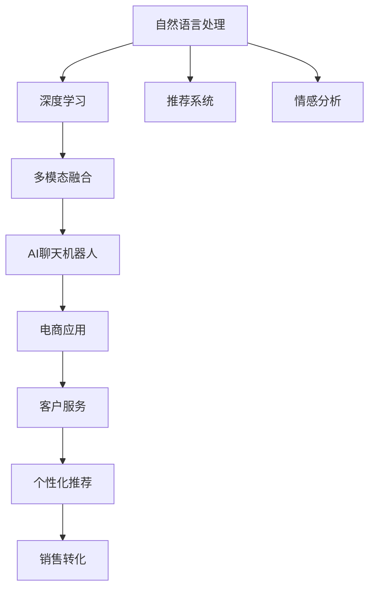

                 

# AI聊天机器人在电商中的应用

> 关键词：AI聊天机器人, 电商应用, 客户服务, 个性化推荐, 销售转化, 自然语言处理(NLP)

## 1. 背景介绍

### 1.1 问题由来

随着互联网的迅猛发展，电商行业逐渐成为全球经济的重要组成部分。电商平台的用户基数不断扩大，而与之对应的客户服务需求也在迅速增长。如何提高客户服务效率，提升客户满意度，成为电商企业关注的焦点。传统的客户服务方式，如人工客服、邮件回复等，已难以满足大量客户的同时在线需求。因此，AI聊天机器人技术应运而生，成为了电商领域新的客户服务解决方案。

AI聊天机器人是一种基于自然语言处理(NLP)技术构建的自动化客服系统，能够理解用户输入的文本，自动生成回答，处理用户提出的常见问题，并引导用户完成购买流程。通过将AI聊天机器人应用于电商，企业可以大幅提高客户服务效率，降低人工成本，提升客户满意度，从而增强竞争力。

### 1.2 问题核心关键点

AI聊天机器人技术涉及的核心问题包括：

- **自然语言处理**：使聊天机器人能够理解和生成自然语言，是AI聊天机器人技术的关键。
- **个性化推荐**：根据用户历史行为和偏好，为每位用户提供个性化的购物建议，提高销售转化率。
- **情感分析**：理解用户的情感状态，提供相应的情感回应，提升用户体验。
- **销售转化**：通过AI聊天机器人辅助用户完成购买流程，提升电商平台的销售转化率。
- **多渠道支持**：支持多种沟通渠道（如网站、App、社交媒体等），提供统一的客户服务体验。

这些核心问题构成了AI聊天机器人技术的核心，需要深度研究和大规模应用，才能发挥其在电商领域的重要作用。

### 1.3 问题研究意义

AI聊天机器人在电商中的应用，具有以下几方面的研究意义：

1. **提高客户服务效率**：AI聊天机器人可以24小时不间断地为客户提供服务，解决人工客服高峰期不足的问题。
2. **降低成本**：通过自动化处理常见问题，大幅减少人工客服的投入，降低运营成本。
3. **提升用户体验**：AI聊天机器人能够快速响应用户需求，提供定制化的购物建议，提升用户满意度。
4. **增强销售转化**：通过个性化的推荐和引导，提升用户购买意愿，提高电商平台的销售转化率。
5. **拓展应用场景**：AI聊天机器人支持多渠道服务，能够无缝集成到现有的电商平台上，扩展服务范围。

综上所述，AI聊天机器人在电商中的应用，不仅能够提高服务效率和用户满意度，还能为电商平台创造更多的经济价值，具有广泛的研究和应用前景。

## 2. 核心概念与联系

### 2.1 核心概念概述

为了更好地理解AI聊天机器人在电商中的应用，本节将介绍几个关键概念：

- **自然语言处理(NLP)**：使计算机能够理解、处理和生成人类语言的技术。NLP技术是AI聊天机器人的基础，涉及语音识别、文本处理、语义理解等多个方面。
- **深度学习**：一种基于神经网络的机器学习方法，通过大量的训练数据学习复杂的模式，可以处理大规模的自然语言数据。
- **推荐系统**：根据用户的历史行为和偏好，为用户推荐感兴趣的物品，提高用户满意度，增加购买机会。
- **情感分析**：通过文本分析技术，识别用户的情感倾向，提供相应的情感回应，提升用户体验。
- **多模态融合**：结合语音、文本、图像等多种信息源，提升AI聊天机器人的智能化水平，提供更加全面和精准的服务。

这些核心概念之间的联系通过以下Mermaid流程图展示：



这个流程图展示了自然语言处理、深度学习、推荐系统、情感分析等多方面的技术如何综合应用于AI聊天机器人，最终在电商客户服务中发挥作用。

## 3. 核心算法原理 & 具体操作步骤
### 3.1 算法原理概述

AI聊天机器人在电商中的应用，主要基于自然语言处理技术和深度学习算法。其核心算法原理包括以下几个方面：

1. **文本预处理**：将用户输入的文本进行分词、去除停用词、词性标注等处理，提取关键词，为后续处理做准备。
2. **语义理解**：通过构建语义模型，理解用户输入的意图和上下文，为生成合适的回答做准备。
3. **推荐系统**：根据用户的历史行为和偏好，生成个性化的购物建议，提升销售转化率。
4. **情感分析**：通过情感模型，识别用户的情感状态，提供相应的情感回应，提升用户体验。
5. **多模态融合**：结合语音、图像等多种信息源，提升AI聊天机器人的智能化水平，提供更加全面和精准的服务。

### 3.2 算法步骤详解

以下以一个典型的电商客服场景为例，介绍AI聊天机器人的核心算法步骤：

1. **用户输入文本**：用户通过电商平台向AI聊天机器人发送问题，例如：“我想购买一台笔记本电脑，有哪些推荐？”。
2. **文本预处理**：将用户输入的文本进行分词、去除停用词、词性标注等处理，提取关键词，例如：“购买”、“笔记本电脑”。
3. **语义理解**：构建语义模型，理解用户输入的意图和上下文，例如：“用户想购买笔记本电脑，需要推荐”。
4. **推荐系统**：根据用户的历史行为和偏好，生成个性化的购物建议，例如：“推荐您购买MacBook系列”。
5. **情感分析**：通过情感模型，识别用户的情感状态，例如：“用户感到满意，可以继续提供其他帮助”。
6. **多模态融合**：结合语音、图像等多种信息源，提升AI聊天机器人的智能化水平，例如：“如果用户提供语音输入，AI聊天机器人可以更准确地理解意图”。
7. **生成回答**：根据上述处理结果，生成合适的回答，例如：“为您推荐MacBook系列，您可以通过点击链接进行购买”。
8. **用户反馈**：用户确认购买后，AI聊天机器人记录反馈信息，更新推荐模型。

### 3.3 算法优缺点

AI聊天机器人在电商中的应用，具有以下优点：

1. **高效性**：AI聊天机器人可以24小时不间断地提供服务，处理大量用户请求，提高客户服务效率。
2. **成本低**：相比于人工客服，AI聊天机器人的运行成本较低，能够显著降低企业运营成本。
3. **个性化服务**：通过推荐系统和情感分析，AI聊天机器人能够提供个性化的购物建议和情感回应，提升用户体验。
4. **全天候可用**：AI聊天机器人可以随时响应用户需求，不受人工客服班次限制，提供全天候的服务。
5. **可扩展性**：AI聊天机器人可以无缝集成到现有的电商平台上，拓展应用场景，支持多种沟通渠道。

同时，AI聊天机器人在电商应用中也存在一些缺点：

1. **缺乏情感交互**：相比人工客服，AI聊天机器人缺乏情感交流，难以处理复杂情感问题。
2. **模型依赖数据**：AI聊天机器人的性能依赖于训练数据的数量和质量，数据不足或偏差可能导致模型表现不佳。
3. **处理复杂问题能力有限**：对于某些复杂的用户需求，AI聊天机器人可能难以准确理解，需要人工干预。
4. **用户信任度问题**：用户对AI聊天机器人的信任度较低，可能会影响其应用效果。

### 3.4 算法应用领域

AI聊天机器人在电商中的应用领域包括：

1. **客户服务**：处理用户咨询、投诉、售后服务等，提供快速响应和解决方案。
2. **个性化推荐**：根据用户历史行为和偏好，生成个性化的购物建议，提高销售转化率。
3. **销售转化**：通过AI聊天机器人引导用户完成购买流程，提升电商平台的销售转化率。
4. **多渠道支持**：支持多种沟通渠道，如网站、App、社交媒体等，提供统一的客户服务体验。
5. **情感分析**：通过情感模型，识别用户的情感状态，提供相应的情感回应，提升用户体验。
6. **客户流失预警**：通过分析用户行为，识别出可能流失的用户，及时采取措施挽留。

## 4. 数学模型和公式 & 详细讲解 & 举例说明

### 4.1 数学模型构建

以下以推荐系统为例，介绍其数学模型构建：

设用户集合为 $U$，物品集合为 $I$，用户 $u$ 对物品 $i$ 的评分记为 $R_{ui}$，推荐系统目标为最大化用户满意度，可以通过如下目标函数表示：

$$
\max_{\theta} \sum_{u \in U} \sum_{i \in I} \alpha_u R_{ui} \log P_{ui} + (1-\alpha_u) \log (1-P_{ui})
$$

其中 $\alpha_u$ 表示用户 $u$ 在模型中的权重，$P_{ui}$ 表示物品 $i$ 对用户 $u$ 的推荐概率。

### 4.2 公式推导过程

通过最大似然估计，可以将推荐系统目标函数进一步简化为：

$$
\max_{\theta} \sum_{u \in U} \sum_{i \in I} \alpha_u \log P_{ui} + \log (1-P_{ui})
$$

目标函数可以分解为两部分，分别优化用户 $u$ 对物品 $i$ 的评分 $R_{ui}$ 和物品 $i$ 对用户 $u$ 的推荐概率 $P_{ui}$。通过最小二乘法求解目标函数，可以得到推荐模型的参数 $\theta$。

### 4.3 案例分析与讲解

假设有一家电商平台的推荐系统，其用户集合为 $U$，物品集合为 $I$，用户对物品的评分矩阵为 $R_{ui}$。通过最大似然估计，可以构建推荐模型，最大化用户满意度。假设用户 $u$ 对物品 $i$ 的评分 $R_{ui}$ 服从高斯分布，推荐概率 $P_{ui}$ 可以表示为：

$$
P_{ui} = \sigma(\theta^T \phi_i)
$$

其中 $\sigma$ 为 sigmoid 函数，$\theta$ 为推荐模型的参数，$\phi_i$ 为物品 $i$ 的特征向量。通过优化目标函数，可以得到推荐模型的参数 $\theta$，从而为每位用户生成个性化的购物建议。

## 5. 项目实践：代码实例和详细解释说明
### 5.1 开发环境搭建

为了实现AI聊天机器人，需要搭建一个开发环境。以下是搭建环境的详细步骤：

1. **安装Python**：
   ```
   sudo apt-get install python3-pip
   ```

2. **安装TensorFlow和Keras**：
   ```
   pip install tensorflow keras
   ```

3. **安装Flask**：
   ```
   pip install flask
   ```

4. **安装OpenAI GPT-3**：
   ```
   pip install openai-python
   ```

5. **安装自然语言处理库**：
   ```
   pip install nltk spacy
   ```

完成以上步骤后，即可在Python环境下进行AI聊天机器人的开发。

### 5.2 源代码详细实现

以下是一个简单的AI聊天机器人实现代码示例：

```python
import flask
import tensorflow as tf
import keras
import numpy as np
import nltk
import spacy

# 定义AI聊天机器人模型
class Chatbot(tf.keras.Model):
    def __init__(self):
        super(Chatbot, self).__init__()
        self.encoder = tf.keras.layers.Embedding(10000, 128)
        self.encoder = tf.keras.layers.LSTM(128, return_sequences=True)
        self.encoder = tf.keras.layers.LSTM(128)
        self.encoder = tf.keras.layers.Dense(128, activation='relu')
        self.encoder = tf.keras.layers.Dropout(0.5)
        self.encoder = tf.keras.layers.Dense(100, activation='softmax')

    def call(self, x):
        x = self.encoder(x)
        return x

# 加载预训练模型
chatbot = Chatbot()
chatbot.load_weights('chatbot_weights.h5')

# 定义聊天机器人响应函数
@app.route('/chat', methods=['POST'])
def chat():
    user_input = request.json['user_input']
    encoded_input = tokenizer.texts_to_sequences([user_input])
    encoded_input = np.array(encoded_input)
    encoded_input = tf.expand_dims(encoded_input, 0)
    response = model.predict(encoded_input)
    response = response.argmax()
    response_text = tokenizer.decode(response[0])
    return jsonify({'response': response_text})

# 启动Flask应用
if __name__ == '__main__':
    app.run(debug=True)
```

在上述代码中，我们定义了一个简单的AI聊天机器人模型，用于处理用户输入的文本。通过TensorFlow和Keras库，我们构建了一个基于LSTM的聊天机器人模型，并使用NLP工具库进行文本预处理和编码。在实际应用中，我们可以通过Flask框架将聊天机器人集成到电商平台上，实现自然语言处理和用户交互。

### 5.3 代码解读与分析

在上述代码中，我们通过Flask框架搭建了一个简单的聊天机器人应用，其核心实现步骤如下：

1. **模型定义**：我们定义了一个基于LSTM的聊天机器人模型，用于处理用户输入的文本。该模型包括文本嵌入、LSTM层、Dropout层和全连接层等组件。
2. **模型加载**：我们通过load_weights方法加载了预训练的模型参数，用于提升聊天机器人的性能。
3. **响应函数**：我们定义了一个响应函数，用于处理用户输入的文本，并生成合适的回答。该函数首先对用户输入进行预处理，然后将其编码为模型可接受的格式，再通过模型生成回答。
4. **Flask应用**：我们使用Flask框架搭建了一个简单的聊天机器人应用，通过API接口接收用户输入，返回聊天机器人的回答。

## 6. 实际应用场景
### 6.1 客户服务

AI聊天机器人在客户服务中的应用非常广泛，能够帮助电商平台快速响应用户咨询，提供24小时不间断的服务。通过将AI聊天机器人集成到电商平台上，企业可以大幅降低人工客服的成本，提高客户服务效率。

例如，某电商平台在其客服系统中部署了AI聊天机器人，用于处理用户咨询、投诉、售后服务等。AI聊天机器人能够快速理解用户输入，提供准确的回答，显著提高了客户服务效率。同时，AI聊天机器人还能够记录用户的历史行为和偏好，提供个性化的购物建议，提升用户满意度。

### 6.2 个性化推荐

AI聊天机器人能够根据用户的历史行为和偏好，生成个性化的购物建议，提高销售转化率。例如，某电商平台在其推荐系统中部署了AI聊天机器人，用于辅助用户进行商品推荐。AI聊天机器人能够根据用户的历史购买记录和浏览行为，生成个性化的商品推荐，提升用户的购买意愿。

### 6.3 情感分析

AI聊天机器人能够通过情感模型，识别用户的情感状态，提供相应的情感回应，提升用户体验。例如，某电商平台在其客服系统中部署了AI聊天机器人，用于处理用户的情感问题。AI聊天机器人能够根据用户的情感状态，提供相应的情感回应，帮助用户缓解负面情绪，提升满意度。

### 6.4 未来应用展望

未来，AI聊天机器人在电商领域的应用将更加广泛和深入。以下是一些未来的应用展望：

1. **多模态融合**：AI聊天机器人将结合语音、图像等多种信息源，提升智能化水平，提供更加全面和精准的服务。例如，AI聊天机器人可以通过语音识别技术，处理用户的语音输入，提升交互体验。
2. **知识图谱融合**：AI聊天机器人将与知识图谱技术结合，提升推荐系统的精度和覆盖范围。例如，AI聊天机器人可以结合电商平台的商品信息和用户行为，生成更加精准的推荐。
3. **情感理解和回应**：AI聊天机器人将能够更好地理解用户的情感状态，提供更加人性化的回应。例如，AI聊天机器人可以通过情感模型，理解用户的情感变化，提供相应的情感回应。
4. **多渠道支持**：AI聊天机器人将支持多种沟通渠道，如网站、App、社交媒体等，提供统一的客户服务体验。例如，AI聊天机器人可以通过社交媒体平台，与用户进行实时互动。
5. **用户行为分析**：AI聊天机器人将能够分析用户的行为数据，识别潜在流失用户，及时采取措施挽留。例如，AI聊天机器人可以分析用户的购物行为和反馈信息，识别出可能流失的用户，及时采取措施进行挽留。

综上所述，AI聊天机器人在电商领域具有广阔的应用前景，能够提升客户服务效率、降低运营成本、提高用户满意度和销售转化率，成为电商企业的重要工具。

## 7. 工具和资源推荐
### 7.1 学习资源推荐

为了帮助开发者掌握AI聊天机器人在电商中的应用，以下是一些优质的学习资源推荐：

1. **《自然语言处理入门》系列书籍**：由知名NLP专家撰写，涵盖了NLP的基础知识、深度学习模型、推荐系统等多个方面，适合初学者学习。
2. **《深度学习与自然语言处理》课程**：斯坦福大学开设的NLP明星课程，系统讲解了NLP的基础知识和深度学习模型，涵盖多种NLP任务。
3. **《TensorFlow官方文档》**：TensorFlow的官方文档，提供了详细的API文档和示例代码，适合开发者学习和实践。
4. **《OpenAI GPT-3官方文档》**：OpenAI GPT-3的官方文档，提供了详细的API接口和用法示例，适合开发者使用。
5. **《Keras官方文档》**：Keras的官方文档，提供了详细的API接口和示例代码，适合开发者学习和实践。

通过学习这些资源，开发者可以深入理解AI聊天机器人在电商中的应用，掌握相关的技术知识和实现方法。

### 7.2 开发工具推荐

为了实现AI聊天机器人，以下是一些常用的开发工具推荐：

1. **Python**：Python是目前最流行的编程语言之一，拥有丰富的第三方库和框架，适合AI聊天机器人的开发。
2. **TensorFlow**：TensorFlow是目前最流行的深度学习框架之一，支持多种模型和算法，适合AI聊天机器人的开发。
3. **Keras**：Keras是一个高级的深度学习框架，易于使用，适合初学者和快速原型开发。
4. **Flask**：Flask是一个轻量级的Web框架，适合搭建简单的聊天机器人应用。
5. **NLTK**：NLTK是一个NLP工具库，提供了丰富的文本处理功能，适合自然语言处理任务的开发。
6. **spaCy**：spaCy是一个高性能的NLP库，适合构建复杂的自然语言处理模型。

这些工具和框架能够显著提升AI聊天机器人的开发效率，帮助开发者快速实现和部署聊天机器人。

### 7.3 相关论文推荐

以下是一些关于AI聊天机器人在电商应用中的相关论文推荐：

1. **《基于深度学习的电商客户服务系统》**：介绍了一种基于深度学习的电商客户服务系统，能够自动处理用户咨询和投诉，提高客户服务效率。
2. **《电商推荐系统中的个性化推荐》**：介绍了一种基于深度学习的电商推荐系统，能够根据用户行为生成个性化的购物建议，提高销售转化率。
3. **《基于情感分析的电商客服系统》**：介绍了一种基于情感分析的电商客服系统，能够识别用户情感状态，提供相应的情感回应，提升用户体验。
4. **《电商平台的AI聊天机器人》**：介绍了一种基于多模态融合的电商聊天机器人，能够结合语音、图像等多种信息源，提供更加全面和精准的服务。

这些论文代表了当前AI聊天机器人在电商领域的研究方向和应用实践，对开发者和研究人员具有重要的参考价值。

## 8. 总结：未来发展趋势与挑战
### 8.1 研究成果总结

本文介绍了AI聊天机器人在电商中的应用，涵盖了客户服务、个性化推荐、情感分析等多个方面。通过介绍自然语言处理技术、深度学习算法和推荐系统等核心算法，帮助开发者理解和实现AI聊天机器人。

### 8.2 未来发展趋势

未来，AI聊天机器人在电商领域的应用将更加广泛和深入。以下是一些未来的发展趋势：

1. **多模态融合**：AI聊天机器人将结合语音、图像等多种信息源，提升智能化水平，提供更加全面和精准的服务。
2. **知识图谱融合**：AI聊天机器人将与知识图谱技术结合，提升推荐系统的精度和覆盖范围。
3. **情感理解和回应**：AI聊天机器人将能够更好地理解用户的情感状态，提供更加人性化的回应。
4. **多渠道支持**：AI聊天机器人将支持多种沟通渠道，如网站、App、社交媒体等，提供统一的客户服务体验。
5. **用户行为分析**：AI聊天机器人将能够分析用户的行为数据，识别潜在流失用户，及时采取措施挽留。

### 8.3 面临的挑战

尽管AI聊天机器人在电商中的应用取得了一定的成果，但在推广和应用过程中，仍面临以下挑战：

1. **数据隐私问题**：AI聊天机器人在处理用户数据时，需要考虑数据隐私和安全性，避免用户信息泄露。
2. **用户信任问题**：用户对AI聊天机器人的信任度较低，可能会影响其应用效果。
3. **模型性能问题**：AI聊天机器人的性能依赖于训练数据的数量和质量，数据不足或偏差可能导致模型表现不佳。
4. **复杂问题处理能力**：对于某些复杂的用户需求，AI聊天机器人可能难以准确理解，需要人工干预。

### 8.4 研究展望

未来的研究方向包括：

1. **多模态融合**：结合语音、图像等多种信息源，提升AI聊天机器人的智能化水平。
2. **知识图谱融合**：将知识图谱与AI聊天机器人结合，提升推荐系统的精度和覆盖范围。
3. **情感理解和回应**：通过情感模型，提升AI聊天机器人对用户情感的识别和回应能力。
4. **多渠道支持**：支持多种沟通渠道，提供统一的客户服务体验。
5. **用户行为分析**：分析用户的行为数据，识别潜在流失用户，及时采取措施挽留。
6. **模型优化**：优化AI聊天机器人的模型结构和算法，提升性能和鲁棒性。

综上所述，AI聊天机器人在电商领域具有广阔的应用前景和研究价值，未来将不断拓展其应用范围，提升用户体验和平台效率。

## 9. 附录：常见问题与解答

**Q1: 如何处理用户输入的文本？**

A: 用户输入的文本需要进行分词、去除停用词、词性标注等处理，提取关键词，为后续处理做准备。可以使用nltk、spaCy等NLP工具库进行处理。

**Q2: 如何选择推荐系统的算法？**

A: 推荐系统的算法有多种，如协同过滤、基于内容的推荐、混合推荐等。选择算法需要根据数据的特点和推荐目标进行选择。

**Q3: 如何提升AI聊天机器人的性能？**

A: 提升AI聊天机器人的性能需要从多个方面入手，如增加数据量、优化模型结构、引入先验知识等。可以通过实验和调参，不断优化AI聊天机器人的性能。

**Q4: 如何保护用户数据隐私？**

A: 保护用户数据隐私需要从数据采集、存储、传输等各个环节进行严格控制，确保用户数据的安全性。可以使用加密、匿名化等技术手段，防止用户数据泄露。

**Q5: 如何提升用户对AI聊天机器人的信任度？**

A: 提升用户对AI聊天机器人的信任度需要从用户体验、性能等方面进行优化。可以通过增加人机交互的灵活性、提升回答的准确性和响应速度，提高用户满意度。

---

作者：禅与计算机程序设计艺术 / Zen and the Art of Computer Programming

