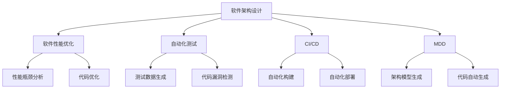

                 

# AI辅助的软件架构设计与优化

> 关键词：软件架构设计,AI辅助优化,系统可扩展性,性能优化,自动化测试,模型驱动开发,持续集成/持续交付(CI/CD)

## 1. 背景介绍

### 1.1 问题由来
随着软件规模的不断增大，软件架构的设计与优化成为软件开发过程中的一项重要任务。传统的软件架构设计往往依赖于人工经验和直觉，难以应对复杂系统的需求变化和性能瓶颈。如何通过技术手段辅助软件架构设计，提升系统可扩展性、性能和可靠性，成为业界关注的焦点。

AI技术的兴起为软件架构优化提供了新的可能。通过AI算法对大量代码数据进行分析，可以发现代码间的依赖关系、性能瓶颈和潜在风险，辅助架构师做出更加科学合理的决策。AI辅助的软件架构设计与优化，将逐步成为软件工程领域的重要手段。

### 1.2 问题核心关键点
AI辅助软件架构设计与优化，旨在通过机器学习、数据挖掘等AI技术，辅助架构师从海量代码数据中提取知识，优化软件架构设计，提升系统性能和可扩展性。其核心在于：

1. **数据驱动决策**：利用代码度量和测试数据，构建软件架构性能与设计决策之间的映射关系，指导架构优化。
2. **知识发现与学习**：通过分析代码历史、架构模式等数据，发现软件架构设计的潜在问题与改进机会。
3. **自动化测试与评估**：借助AI算法对测试数据进行分析，自动化发现代码漏洞和性能问题，优化测试策略。
4. **持续集成/持续交付(CI/CD)**：结合AI模型，自动化构建、测试和部署软件，提升开发效率和软件质量。
5. **模型驱动开发(MDD)**：使用模型描述软件架构，自动化生成代码，提升开发效率和代码质量。

这些核心点共同构成了AI辅助软件架构设计与优化的基本框架，为提升软件开发效率和质量提供了新的思路和工具。

## 2. 核心概念与联系

### 2.1 核心概念概述

为更好地理解AI辅助的软件架构设计与优化方法，本节将介绍几个密切相关的核心概念：

- **软件架构设计**：指对系统进行高层次的结构设计，包括组件划分、通信机制、数据流等。良好的架构设计可以提高系统的可维护性、可扩展性和性能。
- **软件性能优化**：通过各种技术手段提升系统运行效率，包括代码优化、硬件升级、负载均衡等。
- **自动化测试**：利用自动化工具和算法，对软件进行全面测试，保证软件质量和稳定性。
- **持续集成/持续交付(CI/CD)**：通过自动化构建、测试和部署流程，加速软件交付周期，提升开发效率。
- **模型驱动开发(MDD)**：使用模型描述软件架构，自动化生成代码，提升开发效率和代码质量。

这些核心概念之间的逻辑关系可以通过以下Mermaid流程图来展示：



这个流程图展示了一系列核心概念及其之间的联系：

1. 软件架构设计是基础，后续的性能优化、自动化测试和CI/CD都依赖于良好的架构设计。
2. 性能优化通过分析性能瓶颈和代码优化，提升系统效率。
3. 自动化测试通过代码漏洞检测和测试数据生成，保证软件质量。
4. CI/CD通过自动化构建和部署，提升开发效率。
5. MDD通过生成架构模型和自动生成代码，提升开发效率和代码质量。

这些概念共同构成了AI辅助软件架构设计与优化的基础框架，有助于提升软件工程的整体水平。

## 3. 核心算法原理 & 具体操作步骤
### 3.1 算法原理概述

AI辅助软件架构设计与优化，本质上是将AI技术与软件架构优化相结合，利用数据挖掘和机器学习技术，辅助架构师进行决策。其核心思想是：

1. **数据采集与处理**：从代码库、测试数据和日志等数据源中，采集与架构设计相关的度量数据。
2. **模型训练与评估**：利用机器学习算法对采集到的数据进行训练，构建架构设计与软件性能、质量之间的模型。
3. **优化与决策支持**：将训练好的模型应用到新的软件架构设计中，辅助架构师做出最优决策。

### 3.2 算法步骤详解

AI辅助软件架构设计与优化的主要步骤如下：

**Step 1: 数据采集与预处理**
- 从代码库、测试数据和日志等数据源中，采集与架构设计相关的度量数据，如代码复杂度、耦合度、性能指标等。
- 对采集到的数据进行清洗和预处理，去除噪声和冗余数据。

**Step 2: 模型训练与构建**
- 选择合适的机器学习算法，如决策树、随机森林、神经网络等，对预处理后的数据进行训练。
- 使用训练数据构建架构设计与软件性能、质量之间的映射模型。
- 在模型构建过程中，可以使用交叉验证等技术，评估模型的泛化能力和准确性。

**Step 3: 优化与决策支持**
- 将训练好的模型应用到新的软件架构设计中，预测不同设计方案的性能和质量。
- 根据预测结果，辅助架构师选择最优的设计方案。
- 结合实际开发情况和专家经验，进一步调整和优化设计方案。

**Step 4: 验证与部署**
- 对优化后的软件架构进行测试和验证，确保其性能和质量符合预期。
- 将优化后的架构部署到生产环境，持续监控其性能和质量。
- 根据监控结果，进行必要的调整和优化。

### 3.3 算法优缺点

AI辅助软件架构设计与优化方法具有以下优点：
1. **数据驱动决策**：通过数据分析，发现隐藏在代码中的设计问题，辅助架构师做出更科学的决策。
2. **高效自动化**：利用AI算法自动化发现性能瓶颈和代码漏洞，减少手动调试和测试的时间。
3. **持续优化**：通过持续集成和持续交付，快速迭代和优化软件架构，提升系统性能和可扩展性。
4. **知识复用**：通过模型训练和优化，积累和复用架构设计的经验，提升团队的整体技术水平。

同时，该方法也存在一些局限性：
1. **数据质量依赖**：模型的性能和准确性高度依赖于数据的质量和代表性。
2. **模型复杂性高**：构建和训练复杂的机器学习模型需要较高的计算资源和时间。
3. **过度依赖算法**：模型的决策可能受限于算法的局限性，存在一定的误差。
4. **专家经验无法替代**：模型无法完全替代人工经验，架构师的直觉和判断仍然重要。

尽管存在这些局限性，但AI辅助的软件架构设计与优化方法在实际应用中已经取得了显著的效果，成为提升软件工程质量的重要手段。

### 3.4 算法应用领域

AI辅助软件架构设计与优化方法在软件开发过程中得到了广泛的应用，涵盖了以下领域：

- **移动应用开发**：通过分析代码和性能数据，辅助移动应用的架构设计和性能优化。
- **Web应用开发**：通过代码复杂度和耦合度分析，优化Web应用的架构设计和代码质量。
- **嵌入式系统开发**：通过硬件性能分析和功耗优化，提升嵌入式系统的性能和稳定性。
- **大数据处理**：通过数据流分析和负载均衡优化，提升大数据系统的性能和可扩展性。
- **物联网系统**：通过设备间通信和数据同步优化，提升物联网系统的性能和可靠性。

除了上述这些领域外，AI辅助软件架构设计与优化方法还将在更多场景中得到应用，为软件开发带来全新的突破。

## 4. 数学模型和公式 & 详细讲解 & 举例说明
### 4.1 数学模型构建

本节将使用数学语言对AI辅助软件架构设计与优化方法进行更加严格的刻画。

记软件架构设计为 $\mathcal{A}$，其性能指标为 $\mathcal{P}$，质量指标为 $\mathcal{Q}$。假设有一组历史数据 $\mathcal{D}=\{(\mathcal{A}_i, \mathcal{P}_i, \mathcal{Q}_i)\}_{i=1}^N$，其中 $\mathcal{A}_i$ 为第 $i$ 个历史架构设计，$\mathcal{P}_i$ 和 $\mathcal{Q}_i$ 分别为第 $i$ 个设计的性能和质量指标。

定义模型 $M$ 为从架构设计 $\mathcal{A}$ 到性能指标 $\mathcal{P}$ 和质量指标 $\mathcal{Q}$ 的映射，即：

$$
M: \mathcal{A} \rightarrow (\mathcal{P}, \mathcal{Q})
$$

通过机器学习算法训练模型 $M$，使其最小化损失函数：

$$
L(M) = \frac{1}{N}\sum_{i=1}^N (l(\mathcal{P}_i, M(\mathcal{A}_i)) + l(\mathcal{Q}_i, M(\mathcal{A}_i)))
$$

其中 $l$ 为损失函数，如均方误差、交叉熵等。通过最小化损失函数，训练得到的模型 $M$ 能够预测新的架构设计 $\mathcal{A}'$ 的性能和质量。

### 4.2 公式推导过程

以下我们以移动应用性能优化为例，推导基于AI的架构设计与性能优化模型的构建和优化过程。

假设移动应用的架构设计由多个组件组成，每个组件的代码复杂度和性能指标可以表示为：

$$
C = \{C_1, C_2, ..., C_n\}, P = \{P_1, P_2, ..., P_n\}
$$

其中 $C_i$ 为第 $i$ 个组件的代码复杂度，$P_i$ 为第 $i$ 个组件的性能指标。

定义一个简单的性能模型 $M$ 为：

$$
M = (P_i = f(C_i))
$$

其中 $f$ 为映射函数，通过训练数据学习到最优的映射关系。模型的训练目标为：

$$
L(M) = \frac{1}{N}\sum_{i=1}^N (\|P_i - f(C_i)\|^2)
$$

使用梯度下降等优化算法对 $f$ 进行训练，使得模型能够准确预测每个组件的性能指标。

在得到性能模型 $M$ 后，可以将其应用到新的架构设计 $\mathcal{A}'$ 中，预测每个组件的性能指标 $P' = (P'_1, P'_2, ..., P'_n)$。根据预测结果，辅助架构师调整和优化设计，提升整体性能。

### 4.3 案例分析与讲解

以下是一个具体的AI辅助软件架构设计与优化的案例分析：

**案例背景**：某电商平台需要优化其移动应用架构，提升用户体验和系统性能。

**数据采集**：从代码库、日志和测试数据中采集与架构设计相关的度量数据，包括组件代码复杂度、耦合度、性能指标等。

**模型训练**：选择合适的机器学习算法，如随机森林，对采集到的数据进行训练。构建组件复杂度与性能指标之间的映射模型。

**优化与决策支持**：将训练好的模型应用到新的架构设计中，预测每个组件的性能指标。根据预测结果，辅助架构师调整和优化设计。

**验证与部署**：对优化后的软件架构进行测试和验证，确保其性能和质量符合预期。将优化后的架构部署到生产环境，持续监控其性能和质量。

## 5. 项目实践：代码实例和详细解释说明
### 5.1 开发环境搭建

在进行AI辅助软件架构设计与优化实践前，我们需要准备好开发环境。以下是使用Python进行Scikit-Learn开发的Python环境配置流程：

1. 安装Anaconda：从官网下载并安装Anaconda，用于创建独立的Python环境。

2. 创建并激活虚拟环境：
```bash
conda create -n sklearn-env python=3.8 
conda activate sklearn-env
```

3. 安装Scikit-Learn：
```bash
pip install scikit-learn
```

4. 安装各类工具包：
```bash
pip install numpy pandas scikit-learn matplotlib tqdm jupyter notebook ipython
```

完成上述步骤后，即可在`sklearn-env`环境中开始AI辅助软件架构设计与优化的实践。

### 5.2 源代码详细实现

下面我们以移动应用性能优化为例，给出使用Scikit-Learn对代码复杂度和性能指标进行回归分析的Python代码实现。

首先，定义数据处理函数：

```python
from sklearn.ensemble import RandomForestRegressor
from sklearn.model_selection import train_test_split
from sklearn.metrics import mean_squared_error

def process_data(X, y, test_size=0.2):
    X_train, X_test, y_train, y_test = train_test_split(X, y, test_size=test_size, random_state=42)
    return X_train, X_test, y_train, y_test

# 假设X为组件代码复杂度，y为组件性能指标
X = ...
y = ...

X_train, X_test, y_train, y_test = process_data(X, y)
```

然后，定义模型和训练函数：

```python
model = RandomForestRegressor(n_estimators=100, random_state=42)

model.fit(X_train, y_train)
```

接着，定义评估函数：

```python
def evaluate(model, X_test, y_test):
    y_pred = model.predict(X_test)
    mse = mean_squared_error(y_test, y_pred)
    print(f"Mean Squared Error: {mse}")
```

最后，启动训练流程并在测试集上评估：

```python
model.fit(X_train, y_train)
evaluate(model, X_test, y_test)
```

以上就是使用Scikit-Learn对代码复杂度和性能指标进行回归分析的完整代码实现。可以看到，通过Scikit-Learn，我们可以方便地构建和训练机器学习模型，评估其性能。

### 5.3 代码解读与分析

让我们再详细解读一下关键代码的实现细节：

**process_data函数**：
- 将数据划分为训练集和测试集，以80%的数据用于训练，20%的数据用于测试。
- 返回训练集和测试集的数据和标签。

**RandomForestRegressor模型**：
- 定义随机森林回归器，用于回归预测性能指标。
- 设置随机森林的树数和随机种子，确保结果的可复现性。

**evaluate函数**：
- 对测试集进行预测，计算预测值与真实值之间的均方误差。
- 打印出均方误差，用于评估模型的性能。

**训练流程**：
- 调用fit方法对模型进行训练。
- 调用evaluate方法在测试集上评估模型的性能。

通过上述代码，我们可以看到，利用Scikit-Learn构建和训练机器学习模型非常简单，可以快速完成AI辅助软件架构设计与优化的任务。

## 6. 实际应用场景

### 6.1 智能客服系统

智能客服系统需要高效处理用户咨询，提供快速准确的响应。AI辅助的架构设计与优化，可以帮助构建高效、稳定的智能客服系统。

通过分析历史客服数据，识别出常见的用户咨询问题和响应模板，辅助架构师设计出更符合用户需求的系统架构。结合性能模型，优化系统的响应速度和准确率，提升用户体验。

### 6.2 金融风控系统

金融风控系统需要实时监控交易行为，识别和防范欺诈风险。AI辅助的架构设计与优化，可以构建高效、安全的风控系统。

通过分析交易数据，构建用户行为与欺诈风险之间的预测模型，辅助架构师设计出更强大的风控策略。结合性能模型，优化系统的实时监测和响应速度，提升风险防范能力。

### 6.3 电商平台

电商平台需要高效处理订单和库存，提供高质量的商品推荐和搜索服务。AI辅助的架构设计与优化，可以构建高效、可靠的电商平台。

通过分析订单和用户行为数据，构建商品推荐和搜索算法，辅助架构师设计出更符合用户需求的系统架构。结合性能模型，优化系统的推荐和搜索速度，提升用户体验。

### 6.4 未来应用展望

随着AI技术的不断进步，AI辅助软件架构设计与优化将有更广阔的应用前景。未来的应用场景可能包括：

- **智慧城市**：通过分析城市数据，构建智慧城市的架构设计和性能模型，提升城市管理和市民生活质量。
- **医疗健康**：通过分析医疗数据，构建医疗系统的架构设计和性能模型，提升医疗服务的质量和效率。
- **智能交通**：通过分析交通数据，构建智能交通系统的架构设计和性能模型，提升交通管理和安全水平。
- **工业制造**：通过分析工业数据，构建智能制造系统的架构设计和性能模型，提升生产效率和质量控制。

## 7. 工具和资源推荐
### 7.1 学习资源推荐

为了帮助开发者系统掌握AI辅助软件架构设计与优化的理论基础和实践技巧，这里推荐一些优质的学习资源：

1. **《深度学习：理论与算法》系列博文**：由深度学习专家撰写，深入浅出地介绍了深度学习理论、算法和应用，包括AI辅助软件架构设计与优化。

2. **CS229《机器学习》课程**：斯坦福大学开设的机器学习明星课程，涵盖机器学习的基本概念、算法和应用，是理解AI辅助软件架构设计与优化的重要基础。

3. **《Python数据科学手册》书籍**：全面介绍了Python在数据科学和机器学习中的应用，包括数据处理、模型训练和评估等，是实践AI辅助软件架构设计与优化的必备工具。

4. **Kaggle平台**：数据科学和机器学习竞赛平台，提供大量公开数据集和比赛，帮助开发者练习和提升AI辅助软件架构设计与优化的技能。

通过对这些资源的学习实践，相信你一定能够快速掌握AI辅助软件架构设计与优化的精髓，并用于解决实际的开发问题。

### 7.2 开发工具推荐

高效的开发离不开优秀的工具支持。以下是几款用于AI辅助软件架构设计与优化的常用工具：

1. **Jupyter Notebook**：交互式开发环境，支持Python和Scikit-Learn等工具，方便快速迭代和实验。

2. **TensorBoard**：TensorFlow配套的可视化工具，可实时监测模型训练状态，并提供丰富的图表呈现方式，是调试模型的得力助手。

3. **Weights & Biases**：模型训练的实验跟踪工具，可以记录和可视化模型训练过程中的各项指标，方便对比和调优。

4. **Anaconda Navigator**：Anaconda的桌面管理工具，方便查看和管理虚拟环境、包安装和环境配置。

5. **Docker**：容器化技术，方便管理和部署应用程序，支持跨平台一致性。

6. **Hadoop**：大数据处理框架，支持大规模数据的存储和处理，适用于需要分析海量代码数据的任务。

合理利用这些工具，可以显著提升AI辅助软件架构设计与优化的开发效率，加快创新迭代的步伐。

### 7.3 相关论文推荐

AI辅助软件架构设计与优化技术的发展源于学界的持续研究。以下是几篇奠基性的相关论文，推荐阅读：

1. **《Model-Based Design and Implementation of Architecture-centric Software Systems》**：探讨了基于模型驱动的软件架构设计与实现方法，提供了AI辅助架构设计的理论基础。

2. **《Performance Analysis of Software Architectures》**：研究了软件架构性能的度量和优化方法，提出了AI辅助性能优化的基本框架。

3. **《Machine Learning for Software Architecture Optimization》**：介绍了机器学习在软件架构优化中的应用，展示了AI辅助架构优化的实际效果。

4. **《Deep Learning for Software Engineering》**：探讨了深度学习在软件工程中的应用，包括代码生成、测试和优化等，提供了AI辅助软件架构设计与优化的前沿视角。

这些论文代表了大规模软件架构设计与优化的发展脉络。通过学习这些前沿成果，可以帮助研究者把握学科前进方向，激发更多的创新灵感。

## 8. 总结：未来发展趋势与挑战

### 8.1 总结

本文对AI辅助的软件架构设计与优化方法进行了全面系统的介绍。首先阐述了AI技术在软件架构优化中的重要性和应用前景，明确了AI辅助软件架构设计与优化的基本框架和主要步骤。其次，从原理到实践，详细讲解了AI辅助架构优化的数学模型和关键算法，给出了具体的代码实现和解释分析。同时，本文还广泛探讨了AI辅助软件架构设计与优化的实际应用场景，展示了其巨大的应用潜力。此外，本文精选了AI辅助软件架构设计与优化的各类学习资源，力求为读者提供全方位的技术指引。

通过本文的系统梳理，可以看到，AI辅助的软件架构设计与优化技术正在成为软件工程领域的重要手段，极大地提升了软件开发的效率和质量。未来，伴随AI技术的持续进步，AI辅助软件架构设计与优化技术必将迎来更广阔的应用前景，为软件开发带来新的突破。

### 8.2 未来发展趋势

展望未来，AI辅助软件架构设计与优化技术将呈现以下几个发展趋势：

1. **模型复杂度提升**：随着AI技术的发展，未来的模型将更加复杂和强大，能够处理更复杂的架构设计和性能问题。

2. **自动化程度提高**：AI辅助软件架构设计与优化的自动化程度将不断提升，进一步减少人工干预和复杂度，提升开发效率。

3. **数据来源多样化**：未来的数据来源将更加多样化和全面，涵盖代码库、测试数据、日志等多个方面，帮助构建更准确的性能和质量模型。

4. **多模态数据融合**：未来的架构设计与性能优化将更加关注多模态数据融合，将代码、测试、日志等多种数据进行综合分析，提升模型的泛化能力和精度。

5. **动态优化**：未来的架构设计与性能优化将更加关注动态优化，通过持续集成和持续交付，实时监控和优化系统性能和质量。

6. **分布式优化**：未来的架构设计与性能优化将更加关注分布式优化，利用云计算和分布式计算资源，提升优化效率和精度。

以上趋势凸显了AI辅助软件架构设计与优化的广阔前景。这些方向的探索发展，必将进一步提升软件工程的自动化和智能化水平，为软件开发带来新的突破。

### 8.3 面临的挑战

尽管AI辅助软件架构设计与优化技术已经取得了显著进展，但在迈向更加智能化、普适化应用的过程中，仍面临诸多挑战：

1. **数据质量问题**：数据的质量和代表性直接影响模型的性能和准确性。如何获取高质量的数据，构建可靠的性能和质量模型，是首要挑战。

2. **算法复杂性高**：构建和训练复杂的机器学习模型需要较高的计算资源和时间，如何高效实现模型训练和优化，是关键问题。

3. **过度依赖算法**：模型的决策可能受限于算法的局限性，存在一定的误差，如何提升模型的可解释性和可信度，是重要挑战。

4. **专家经验无法替代**：模型无法完全替代人工经验，架构师的直觉和判断仍然重要，如何在AI辅助下更好地发挥专家经验，是重要研究方向。

5. **系统复杂性高**：大型软件系统架构复杂，如何高效应用AI辅助技术，实现系统的全面优化，是重要挑战。

6. **伦理和安全问题**：AI模型可能学习到有害的偏见和有害信息，如何确保模型输出的伦理和安全，是重要研究方向。

正视这些挑战，积极应对并寻求突破，将是大规模软件架构设计与优化技术走向成熟的必由之路。相信随着学界和产业界的共同努力，这些挑战终将一一被克服，AI辅助软件架构设计与优化技术必将在软件开发中发挥更大的作用。

### 8.4 研究展望

面对大规模软件架构设计与优化所面临的种种挑战，未来的研究需要在以下几个方面寻求新的突破：

1. **数据增强技术**：开发数据增强算法，从更多样化的数据源中获取高质量的数据，提升模型的泛化能力和精度。

2. **多模态数据融合**：研究多模态数据融合方法，将代码、测试、日志等多种数据进行综合分析，提升模型的泛化能力和精度。

3. **可解释性提升**：提升模型的可解释性和可信度，使其输出具有更高的透明度和可理解性。

4. **动态优化方法**：研究动态优化方法，通过持续集成和持续交付，实时监控和优化系统性能和质量。

5. **分布式优化算法**：研究分布式优化算法，利用云计算和分布式计算资源，提升优化效率和精度。

6. **伦理和安全约束**：研究伦理和安全约束方法，确保模型输出的伦理和安全，避免有害信息的输出。

这些研究方向将进一步提升AI辅助软件架构设计与优化的效果，为软件开发带来新的突破。面向未来，需要从数据、算法、工具、伦理等多个维度协同发力，共同推动软件工程技术的发展。

## 9. 附录：常见问题与解答

**Q1：AI辅助软件架构设计与优化是否适用于所有类型的软件系统？**

A: AI辅助软件架构设计与优化方法适用于大多数类型的软件系统，尤其是那些数据量较大、系统复杂的软件系统。然而，对于一些特定领域的系统，如医疗、法律等，其架构设计和性能优化可能需要结合领域特定的知识。

**Q2：如何选择合适的机器学习算法？**

A: 选择合适的机器学习算法需要考虑数据的特点和问题的复杂度。常用的算法包括线性回归、决策树、随机森林、神经网络等。一般建议从简单算法开始，逐步尝试复杂算法，根据实验结果选择合适的算法。

**Q3：AI辅助软件架构设计与优化能否代替人工经验？**

A: AI辅助软件架构设计与优化方法能够提供科学的数据驱动决策，辅助架构师优化设计，但无法完全替代人工经验。架构师的经验和直觉仍然是优化过程中的重要因素。

**Q4：AI辅助软件架构设计与优化需要哪些资源支持？**

A: AI辅助软件架构设计与优化需要高性能计算资源、大规模数据集、先进的工具和算法等支持。对于数据量较大的系统，可能需要使用分布式计算框架如Hadoop、Spark等。

**Q5：AI辅助软件架构设计与优化的方法如何与现有的架构设计方法结合？**

A: AI辅助软件架构设计与优化方法可以与现有的架构设计方法结合，形成更为全面的优化策略。例如，结合架构设计模式和架构评估指标，构建更加科学的架构优化模型。

通过对这些常见问题的解答，可以更好地理解AI辅助软件架构设计与优化的应用场景和方法，帮助开发者在实际开发中更好地应用这一技术。

---

作者：禅与计算机程序设计艺术 / Zen and the Art of Computer Programming

