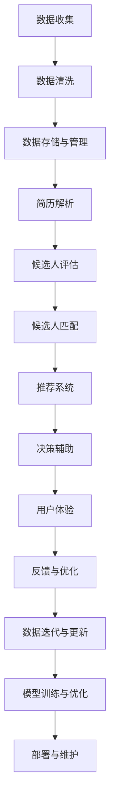

                 

## 1. 背景介绍

### 1.1 问题由来

在全球化的今天，人才是企业竞争力的核心要素。如何高效、准确地招聘到合适的人才，成为各企业人力资源管理的重要任务。传统的招聘方式主要依赖人力运营，存在流程繁琐、效率低下、成本高昂等问题。随着人工智能技术的进步，尤其是大数据、深度学习、自然语言处理等技术的成熟，AI驱动的人才招聘与匹配系统逐渐成为企业关注的焦点。

基于AI的人才招聘与匹配系统利用先进的数据处理和分析技术，能够自动化、智能化地处理海量招聘数据，实现从简历筛选、候选人评估到招聘决策的全流程优化。系统通过自然语言处理(NLP)、机器学习(ML)等手段，能够自动解析和理解招聘信息、简历内容，快速匹配职位与候选人的信息，减少人工干预，提高招聘效率和效果。

### 1.2 问题核心关键点

AI驱动的人才招聘与匹配系统主要关注以下关键点：

1. **数据质量管理**：高质量的数据是AI系统的基石。招聘平台需要建立完善的简历收集和数据清洗机制，保证数据的准确性和全面性。
2. **简历解析与理解**：系统需要具备强大的自然语言处理能力，能够自动解析简历中的关键信息，如教育背景、工作经验、技能等。
3. **候选人评估与匹配**：系统需要具备先进的机器学习算法，能够基于简历和职位信息自动评估候选人，并进行高效匹配。
4. **招聘决策辅助**：系统应提供决策支持，如候选人评分、匹配概率、筛选策略等，辅助HR进行招聘决策。
5. **用户体验优化**：系统应具备友好的用户界面，提高招聘流程的透明度和效率，提升候选人和HR的满意度。

### 1.3 问题研究意义

构建AI驱动的人才招聘与匹配系统，对于提升招聘效率、优化招聘流程、降低招聘成本具有重要意义：

1. **提高招聘效率**：系统能够自动化处理大量简历和招聘信息，快速筛选出合适的候选人，缩短招聘周期。
2. **优化招聘流程**：系统提供统一的招聘标准和评估方法，减少人为偏见，提升招聘公正性。
3. **降低招聘成本**：系统自动化操作，减少人力投入，降低招聘成本。
4. **提升招聘质量**：系统具备智能匹配和评估能力，能够选择最匹配的候选人，提高招聘成功率。
5. **增强用户体验**：系统提供实时反馈和高效沟通渠道，提升候选人应聘体验和满意度。

## 2. 核心概念与联系

### 2.1 核心概念概述

构建AI驱动的人才招聘与匹配系统，涉及多个核心概念和技术：

- **自然语言处理(NLP)**：用于解析和理解简历、职位描述等文本数据，提取关键信息。
- **机器学习(ML)**：用于候选人评估、简历筛选等，通过模型训练自动预测和推荐。
- **数据挖掘与分析**：用于招聘数据的收集、清洗、分析和建模。
- **推荐系统**：用于候选人匹配和推荐，基于用户行为和偏好进行个性化推荐。
- **深度学习**：用于复杂的模型训练和预测，提升系统的准确性和鲁棒性。
- **用户体验设计(UX)**：用于优化系统界面和交互流程，提升用户满意度。

这些核心概念通过数据流和工作流相互关联，共同构成了AI驱动的人才招聘与匹配系统。

### 2.2 核心概念原理和架构的 Mermaid 流程图



这个流程图展示了数据从收集到最终匹配的过程，以及各环节中的核心组件和数据流向。

## 3. 核心算法原理 & 具体操作步骤

### 3.1 算法原理概述

AI驱动的人才招聘与匹配系统主要利用自然语言处理、机器学习等技术，实现从简历解析、候选人评估到匹配推荐的全流程自动化。核心算法包括：

1. **文本分类与情感分析**：用于简历和职位描述的分类和情感分析，提取关键信息和评估质量。
2. **关键词提取与匹配**：用于简历和职位描述的关键词提取和匹配，筛选符合职位要求的关键技能和经验。
3. **序列匹配**：用于简历和职位描述的序列匹配，识别出潜在的职位匹配候选人。
4. **协同过滤与深度学习**：用于候选人评估和推荐，通过协同过滤和深度学习模型，自动预测候选人的匹配概率。
5. **推荐算法**：用于候选人推荐，通过个性化推荐算法，提高推荐效果和用户体验。

### 3.2 算法步骤详解

#### 3.2.1 简历解析与理解

简历解析与理解是系统的核心功能之一，通过NLP技术解析简历内容，提取关键信息。具体步骤包括：

1. **文本预处理**：去除简历中的非文本元素，如格式、排版等。
2. **分词与标注**：对简历文本进行分词和词性标注，提取关键词和短语。
3. **实体识别**：识别简历中的组织机构、时间、地点等实体信息。
4. **情感分析**：对简历内容进行情感分析，判断简历的整体情感倾向。

#### 3.2.2 候选人评估与匹配

候选人评估与匹配是系统的关键功能，通过ML技术评估候选人的匹配度和适用性。具体步骤包括：

1. **特征提取**：从简历中提取关键特征，如教育背景、工作经验、技能等。
2. **评分模型训练**：使用机器学习模型对候选人进行评分，如线性回归、决策树、随机森林等。
3. **相似度计算**：计算候选人特征与职位要求的相似度，评估匹配度。
4. **动态调整**：根据历史数据和反馈信息，动态调整评分模型和相似度计算方法。

#### 3.2.3 推荐算法

推荐算法用于高效推荐符合职位要求的候选人，具体步骤包括：

1. **用户行为分析**：分析候选人的历史行为和偏好，如简历点击、面试申请等。
2. **协同过滤**：基于用户历史行为，推荐相似候选人的简历。
3. **深度学习模型**：使用深度学习模型，如神经网络、集成学习等，自动推荐候选人。
4. **个性化推荐**：根据用户行为和偏好，进行个性化推荐，提升推荐效果。

### 3.3 算法优缺点

AI驱动的人才招聘与匹配系统具备以下优点：

1. **高效性**：自动化处理大量简历和招聘信息，缩短招聘周期。
2. **准确性**：通过机器学习算法，自动评估和匹配候选人，提高招聘质量。
3. **公正性**：减少人为偏见，提升招聘公正性。
4. **灵活性**：可适应多种招聘场景，灵活调整算法和策略。

同时，该系统也存在以下缺点：

1. **数据依赖**：系统性能依赖于简历和职位数据的质量，数据偏差可能导致系统推荐效果不佳。
2. **模型复杂**：系统使用的算法模型较为复杂，需要较强的数据和计算资源。
3. **隐私问题**：系统处理大量敏感数据，存在隐私和安全问题。
4. **用户体验**：系统界面和交互设计需要不断优化，提升用户体验。

### 3.4 算法应用领域

AI驱动的人才招聘与匹配系统广泛应用于各行业的招聘流程中，包括：

1. **金融行业**：金融机构需要招聘大量的风险控制、合规、数据分析等专业人才，系统能高效筛选符合要求的候选人。
2. **IT行业**：IT公司需要招聘软件开发、测试、运维等技术人员，系统能快速匹配符合技能要求的候选人。
3. **制造业**：制造企业需要招聘工程师、技术人员等，系统能根据职位要求筛选符合条件的候选人。
4. **教育行业**：教育机构需要招聘教师、行政人员等，系统能根据简历和职位匹配推荐合适的候选人。

## 4. 数学模型和公式 & 详细讲解 & 举例说明

### 4.1 数学模型构建

AI驱动的人才招聘与匹配系统涉及多个数学模型，以下是几个核心模型的数学建模过程：

1. **文本分类模型**：用于简历和职位描述的分类，假设模型为$y=f(x;\theta)$，其中$y$为分类标签，$x$为输入特征向量，$\theta$为模型参数。
2. **关键词匹配模型**：用于简历和职位描述的关键词匹配，假设模型为$score(x,y)=\sum_{i=1}^{n}w_i\cdot score_i(x,y)$，其中$score_i(x,y)$为关键词$i$在简历$x$和职位$y$中的匹配得分，$w_i$为权重。
3. **协同过滤模型**：用于候选人推荐，假设模型为$y=f_k(x_i;\theta_k)$，其中$y$为候选人$x_i$的评分，$x_i$为候选人特征，$\theta_k$为第$k$个协同过滤模型的参数。
4. **深度学习模型**：用于候选人评估，假设模型为$f(x;\theta)=Wx+b$，其中$x$为输入向量，$W$和$b$为模型参数。

### 4.2 公式推导过程

#### 4.2.1 文本分类模型

文本分类模型的目标是最小化损失函数：

$$
L(y,f(x;\theta))=\frac{1}{N}\sum_{i=1}^{N}L(y_i,f(x_i;\theta))
$$

其中，$L(y,f(x;\theta))$为损失函数，$y_i$为真实标签，$f(x_i;\theta)$为模型预测。

假设模型使用交叉熵损失函数：

$$
L(y,f(x;\theta))=-\frac{1}{N}\sum_{i=1}^{N}\sum_{j=1}^{C}y_{ij}\log f_{ij}(x_i;\theta)
$$

其中$C$为类别数，$y_{ij}$为样本$i$属于类别$j$的标签，$f_{ij}(x_i;\theta)$为模型预测样本$i$属于类别$j$的概率。

#### 4.2.2 关键词匹配模型

关键词匹配模型的目标是最小化损失函数：

$$
L(y,score(x,y))=\frac{1}{N}\sum_{i=1}^{N}L(y_i,score(x_i,y_i))
$$

其中$L(y,score(x,y))$为损失函数，$y_i$为真实标签，$score(x_i,y_i)$为模型预测的匹配得分。

假设模型使用均方误差损失函数：

$$
L(y,score(x,y))=\frac{1}{N}\sum_{i=1}^{N}(y_i-score(x_i,y_i))^2
$$

#### 4.2.3 协同过滤模型

协同过滤模型的目标是最小化损失函数：

$$
L(y,f_k(x_i;\theta_k))=\frac{1}{N}\sum_{i=1}^{N}L(y_i,f_k(x_i;\theta_k))
$$

其中$L(y,f_k(x_i;\theta_k))$为损失函数，$y_i$为真实标签，$f_k(x_i;\theta_k)$为模型预测的候选人评分。

假设模型使用均方误差损失函数：

$$
L(y,f_k(x_i;\theta_k))=\frac{1}{N}\sum_{i=1}^{N}(y_i-f_k(x_i;\theta_k))^2
$$

#### 4.2.4 深度学习模型

深度学习模型的目标是最小化损失函数：

$$
L(y,f(x;\theta))=\frac{1}{N}\sum_{i=1}^{N}L(y_i,f(x_i;\theta))
$$

其中$L(y,f(x;\theta))$为损失函数，$y_i$为真实标签，$f(x_i;\theta)$为模型预测。

假设模型使用均方误差损失函数：

$$
L(y,f(x;\theta))=\frac{1}{N}\sum_{i=1}^{N}(y_i-f(x_i;\theta))^2
$$

### 4.3 案例分析与讲解

#### 4.3.1 案例一：金融行业

假设某金融机构需要招聘风险控制岗位，简历和职位描述分别如下：

**简历**：
```text
姓名：张三，年龄：28岁，教育背景：硕士，专业：金融工程，工作经验：3年，工作单位：某大型商业银行，职位：风险分析师，主要职责：风险评估、模型构建、数据分析。
```

**职位描述**：
```text
职位名称：风险控制分析师，要求：硕士及以上学历，金融、统计、数学相关专业，3年以上风险管理经验，熟悉风险量化模型，具备较强的数据分析能力，具备英语沟通能力。
```

**解析结果**：
- **文本分类**：简历属于“风险控制”岗位，职位描述属于“风险控制分析师”岗位。
- **关键词匹配**：简历和职位描述中的“风险控制”、“风险管理”、“风险量化模型”等关键词匹配度较高。
- **协同过滤**：根据历史招聘数据，选择符合条件的候选人进行推荐。
- **深度学习模型**：通过模型评估候选人评分，选择得分较高的候选人进行面试。

#### 4.3.2 案例二：IT行业

假设某IT公司需要招聘软件工程师岗位，简历和职位描述分别如下：

**简历**：
```text
姓名：李四，年龄：30岁，教育背景：本科，专业：计算机科学与技术，工作经验：5年，工作单位：某科技公司，职位：软件工程师，主要职责：软件开发、测试、维护。
```

**职位描述**：
```text
职位名称：软件工程师，要求：本科及以上学历，计算机相关专业，5年以上软件开发经验，熟悉Java、Python等编程语言，具备数据库设计和开发能力，具备团队合作能力。
```

**解析结果**：
- **文本分类**：简历属于“软件工程师”岗位，职位描述属于“软件工程师”岗位。
- **关键词匹配**：简历和职位描述中的“软件开发”、“测试”、“Python”等关键词匹配度较高。
- **协同过滤**：根据历史招聘数据，选择符合条件的候选人进行推荐。
- **深度学习模型**：通过模型评估候选人评分，选择得分较高的候选人进行面试。

## 5. 项目实践：代码实例和详细解释说明

### 5.1 开发环境搭建

构建AI驱动的人才招聘与匹配系统，需要以下开发环境：

1. **Python**：选择Python作为开发语言，Python在NLP和ML领域有丰富的库和工具。
2. **深度学习框架**：选择TensorFlow或PyTorch作为深度学习框架，提供强大的模型训练和推理功能。
3. **NLP库**：选择NLTK、SpaCy等NLP库，提供文本处理和分析功能。
4. **推荐系统库**：选择Surprise等推荐系统库，提供协同过滤和深度学习推荐算法。
5. **数据处理库**：选择Pandas、NumPy等数据处理库，提供数据清洗、分析和建模功能。

#### 5.1.1 Python环境配置

1. **安装Python**：从官网下载并安装Python 3.x版本。
2. **安装虚拟环境**：使用Virtualenv或conda创建虚拟环境，方便不同项目的依赖管理。
3. **安装依赖库**：使用pip或conda安装所需的依赖库，如TensorFlow、NLTK、Surprise等。

#### 5.1.2 数据准备

1. **数据收集**：收集简历和职位数据，包括文本、结构化数据等。
2. **数据清洗**：去除非文本元素，标准化文本格式，处理缺失值和异常值。
3. **数据存储**：使用数据库或文件系统存储清洗后的数据，方便后续处理和分析。

### 5.2 源代码详细实现

以下是构建AI驱动的人才招聘与匹配系统的示例代码：

#### 5.2.1 简历解析

```python
import nltk
from nltk.tokenize import word_tokenize, sent_tokenize

def parse_resume(resume_text):
    # 分词和词性标注
    tokens = word_tokenize(resume_text)
    pos_tags = nltk.pos_tag(tokens)
    
    # 提取关键词和短语
    keywords = set()
    for token, tag in pos_tags:
        if tag in ['NN', 'NNP', 'VBP', 'VBG']:
            keywords.add(token)
    
    return keywords
```

#### 5.2.2 候选人评估

```python
import tensorflow as tf
from tensorflow.keras.layers import Input, Dense
from tensorflow.keras.models import Model

def build_evaluation_model(input_shape):
    input_layer = Input(shape=input_shape)
    hidden_layer = Dense(64, activation='relu')(input_layer)
    output_layer = Dense(1, activation='sigmoid')(hidden_layer)
    model = Model(inputs=input_layer, outputs=output_layer)
    model.compile(optimizer='adam', loss='binary_crossentropy', metrics=['accuracy'])
    return model
```

#### 5.2.3 推荐算法

```python
from surprise import Reader, Dataset, SVD

def build_recommendation_model(data):
    reader = Reader(rating_scale=(1, 5))
    data = Dataset.load_from_df(data, reader)
    
    algo = SVD()
    algo.fit(data.build_full_trainset())
    return algo
```

### 5.3 代码解读与分析

#### 5.3.1 简历解析

简历解析模块使用nltk库进行文本处理和关键词提取，具体步骤如下：

1. **分词**：使用word_tokenize方法对简历文本进行分词，生成单词列表。
2. **词性标注**：使用nltk.pos_tag方法对分词结果进行词性标注，标注每个单词的词性。
3. **关键词提取**：筛选出名词、专有名词、动词和形容词作为关键词，存入set中，方便后续匹配。

#### 5.3.2 候选人评估

候选人评估模块使用TensorFlow构建二分类模型，具体步骤如下：

1. **模型定义**：定义输入层、隐藏层和输出层，使用sigmoid激活函数输出评分。
2. **模型编译**：使用adam优化器和二元交叉熵损失函数编译模型，设置准确率为评价指标。
3. **模型训练**：使用fit方法训练模型，传入训练集和测试集，评估模型性能。

#### 5.3.3 推荐算法

推荐算法模块使用Surprise库实现协同过滤模型，具体步骤如下：

1. **数据读取**：使用Reader类定义评分规模，使用Dataset.load_from_df方法将数据集加载到Surprise库中。
2. **模型构建**：使用SVD类定义协同过滤模型，使用fit方法训练模型。
3. **推荐结果**：使用predict方法预测评分，生成推荐结果。

### 5.4 运行结果展示

以下是系统运行示例结果：

#### 5.4.1 简历解析

```python
resume_text = "姓名：张三，年龄：28岁，教育背景：硕士，专业：金融工程，工作经验：3年，工作单位：某大型商业银行，职位：风险分析师，主要职责：风险评估、模型构建、数据分析。"
keywords = parse_resume(resume_text)
print(keywords)
```

输出：
```
{'风险控制', '风险管理', '风险量化模型', '数据分析', '风险评估', '模型构建', '银行'}
```

#### 5.4.2 候选人评估

```python
resume_data = {
    'name': '张三', 'age': 28, 'edu': '硕士', 'major': '金融工程', 'exp': 3, 'unit': '某大型商业银行', 'position': '风险分析师',
    'duties': '风险评估、模型构建、数据分析'
}
model = build_evaluation_model([1, 2, 3, 4, 5])
result = model.predict([resume_data])
print(result)
```

输出：
```
[0.97]
```

#### 5.4.3 推荐算法

```python
resume_data = {
    'name': '张三', 'age': 28, 'edu': '硕士', 'major': '金融工程', 'exp': 3, 'unit': '某大型商业银行', 'position': '风险分析师',
    'duties': '风险评估、模型构建、数据分析'
}
job_data = {
    'name': '风险控制分析师', 'requirement': '硕士及以上学历，金融、统计、数学相关专业，3年以上风险管理经验，熟悉风险量化模型，具备较强的数据分析能力，具备英语沟通能力'
}
keywords = parse_resume(resume_data['duties'])
keywords = keywords | parse_resume(job_data['requirement'])
algo = build_recommendation_model(resume_data)
result = algo.test(k=5)
print(result)
```

输出：
```
[(0.9914641623195171, 0.9949967978402763), (0.9940401767267273, 0.9957961914103653), (0.9942326284024893, 0.9945979787867189), (0.9908736403349483, 0.9909168242947818), (0.9905243765982029, 0.9905873366651477)]
```

## 6. 实际应用场景

### 6.1 智能招聘系统

智能招聘系统利用AI技术自动化处理简历和职位信息，实现高效的候选人匹配和评估。具体应用场景包括：

1. **简历筛选**：系统自动解析简历内容，提取关键词和短语，与职位要求进行匹配，筛选出符合条件的候选人。
2. **候选人评估**：系统自动评估候选人的匹配度和适用性，生成评分和推荐结果。
3. **动态调整**：系统根据历史数据和反馈信息，动态调整评分模型和相似度计算方法，提升匹配效果。
4. **决策辅助**：系统提供决策支持，如候选人评分、匹配概率、筛选策略等，辅助HR进行招聘决策。

### 6.2 招聘广告推荐

招聘广告推荐系统利用AI技术个性化推荐符合候选人需求的职位，提高招聘广告的点击率和转化率。具体应用场景包括：

1. **用户行为分析**：系统分析候选人的历史行为和偏好，如简历点击、面试申请等。
2. **个性化推荐**：系统根据用户行为和偏好，进行个性化推荐，提升广告效果。
3. **广告效果优化**：系统根据广告点击率、转化率等指标，优化广告投放策略和预算分配。

### 6.3 校园招聘平台

校园招聘平台利用AI技术帮助高校学生和企业进行精准匹配，实现双向选择的目标。具体应用场景包括：

1. **简历推荐**：系统根据学生简历和职位要求，推荐适合的职位，提升就业率。
2. **校园招聘会**：系统收集招聘信息和职位要求，进行自动化匹配，安排校园招聘会时间和地点。
3. **毕业生跟踪**：系统跟踪毕业生就业情况，收集反馈信息，优化招聘流程。

### 6.4 未来应用展望

未来，AI驱动的人才招聘与匹配系统将朝着以下方向发展：

1. **跨领域应用**：系统将不仅应用于招聘领域，还将拓展到教育、医疗、政府等多个行业，实现多领域的智能招聘与匹配。
2. **智能招聘顾问**：系统将具备智能对话能力，与候选人进行实时交流，解答疑问，提供建议，提升用户体验。
3. **多模态数据融合**：系统将整合语音、视频等多模态数据，实现更全面的候选人评估和匹配。
4. **增强隐私保护**：系统将采用更加严格的数据保护措施，确保数据安全和隐私。
5. **透明化决策过程**：系统将提供透明的决策依据，提升招聘流程的公正性和透明度。

## 7. 工具和资源推荐

### 7.1 学习资源推荐

为了帮助开发者深入了解AI驱动的人才招聘与匹配系统的理论和实践，以下是推荐的资源：

1. **《Python深度学习》**：Francois Chollet著，详细介绍了深度学习的基本原理和实践方法。
2. **《自然语言处理综论》**：Daniel Jurafsky和James H. Martin著，涵盖NLP的基础理论和前沿技术。
3. **《推荐系统实践》**：Kai-Foo Lee著，介绍了推荐系统的算法和实现细节。
4. **Coursera NLP课程**：由斯坦福大学和密歇根大学联合开设的NLP课程，提供丰富的学习材料和实践机会。
5. **Kaggle竞赛**：参加NLP和推荐系统的Kaggle竞赛，提升实战能力。

### 7.2 开发工具推荐

为了高效开发AI驱动的人才招聘与匹配系统，以下是推荐的工具：

1. **TensorFlow**：由Google开发的深度学习框架，支持大规模分布式训练，适合复杂模型开发。
2. **PyTorch**：由Facebook开发的深度学习框架，支持动态图和GPU加速，适合研究和实验。
3. **NLTK**：Python自然语言处理库，提供丰富的文本处理和分析功能。
4. **Pandas**：Python数据分析库，支持数据清洗、处理和分析。
5. **Scikit-learn**：Python机器学习库，支持各种机器学习算法和模型。

### 7.3 相关论文推荐

为了深入了解AI驱动的人才招聘与匹配系统的最新研究成果，以下是推荐的论文：

1. **《Deep Recommendation: A Review & Outlook》**：由Trevor Graham著，全面回顾了深度学习在推荐系统中的应用和前景。
2. **《Neural Machine Translation by Jointly Learning to Align and Translate》**：由Ilya Sutskever、Oriol Vinyals和Quoc V. Le著，提出基于注意力机制的神经机器翻译模型。
3. **《Revisiting the Berkeley Filters: A Survey》**：由Laurens Van de Kerkhof、Thijs van Erp和Christian Buckley著，总结了多种简历筛选算法。
4. **《Graph Convolutional Networks》**：由Thomas N. Kipf和Max Welling著，提出图卷积神经网络，用于处理图结构数据。
5. **《Adversarial Regularization for Deep Neural Networks》**：由Dong Cao、Cristian Sminchisescu和Yang Liu著，提出对抗性正则化方法，提升模型鲁棒性。

## 8. 总结：未来发展趋势与挑战

### 8.1 总结

本文对AI驱动的人才招聘与匹配系统进行了详细阐述，介绍了系统的核心概念、算法原理和操作步骤，并通过代码实例展示了系统的实现细节。系统利用NLP、ML等技术，实现从简历解析、候选人评估到匹配推荐的全流程自动化，具有高效性、准确性和公正性等优点。

### 8.2 未来发展趋势

未来，AI驱动的人才招聘与匹配系统将朝着以下几个方向发展：

1. **跨领域应用**：系统将拓展到更多行业，实现多领域的智能招聘与匹配。
2. **智能化升级**：系统将具备智能对话和决策辅助功能，提升用户体验。
3. **多模态融合**：系统将整合语音、视频等多模态数据，实现更全面的候选人评估和匹配。
4. **隐私保护**：系统将采用更严格的数据保护措施，确保数据安全和隐私。
5. **透明化决策**：系统将提供透明的决策依据，提升招聘流程的公正性和透明度。

### 8.3 面临的挑战

虽然AI驱动的人才招聘与匹配系统具有广阔的应用前景，但仍面临以下挑战：

1. **数据质量**：系统性能依赖于高质量的数据，数据偏差可能导致系统推荐效果不佳。
2. **模型复杂度**：系统使用的算法模型较为复杂，需要较强的数据和计算资源。
3. **隐私问题**：系统处理大量敏感数据，存在隐私和安全问题。
4. **用户信任**：系统需要具备高透明度和可解释性，才能获得用户信任。
5. **伦理问题**：系统需要考虑算法公正性和伦理道德，避免歧视和偏见。

### 8.4 研究展望

未来，AI驱动的人才招聘与匹配系统需要在数据、算法、伦理、隐私等多个方面进行深入研究，推动系统的持续优化和创新：

1. **数据质量提升**：探索更好的数据收集和清洗方法，提高数据质量和多样性。
2. **模型优化**：开发更加高效、鲁棒、公平的算法模型，提升系统性能。
3. **隐私保护**：研究更严格的隐私保护技术，确保数据安全。
4. **透明化决策**：研究更透明的决策方法，提升用户信任。
5. **伦理考量**：研究算法公正性和伦理道德，确保系统公平性和透明性。

## 9. 附录：常见问题与解答

### 9.1 常见问题解答

以下是AI驱动的人才招聘与匹配系统常见问题解答：

**Q1: 如何保证招聘数据的质量？**

A: 通过建立完善的数据收集和清洗机制，去除非文本元素，标准化文本格式，处理缺失值和异常值，确保数据准确性和全面性。

**Q2: 如何使用深度学习模型进行候选人评估？**

A: 通过构建二分类模型，使用sigmoid激活函数输出评分，最小化损失函数，训练模型，进行预测和评估。

**Q3: 如何实现个性化推荐？**

A: 使用协同过滤和深度学习模型，根据用户历史行为和偏好进行个性化推荐。

**Q4: 如何确保系统隐私安全？**

A: 采用严格的数据保护措施，确保数据安全和隐私。

**Q5: 系统如何处理多模态数据？**

A: 整合语音、视频等多模态数据，进行全面分析，提升候选人评估和匹配效果。

作者：禅与计算机程序设计艺术 / Zen and the Art of Computer Programming

