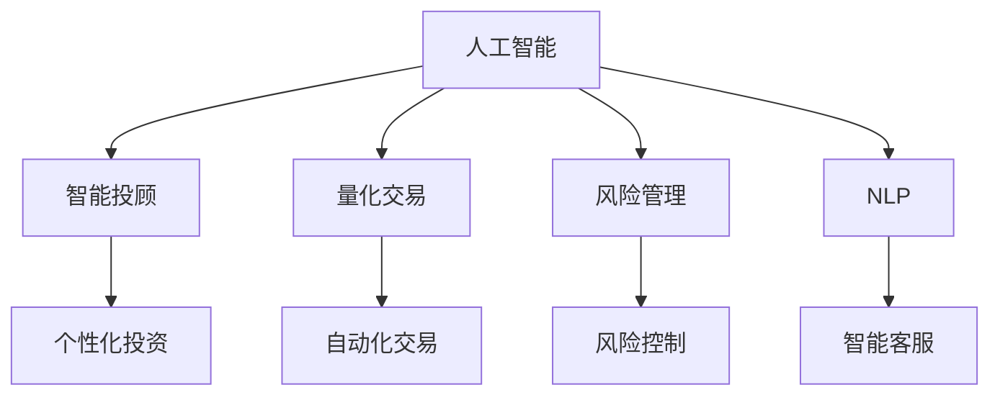

                 

# AI驱动的创新：人类计算在金融领域的应用

> 关键词：金融科技,人类计算,智能投顾,量化交易,风险管理

## 1. 背景介绍

### 1.1 问题由来

金融行业一直是技术创新的前沿领域，随着大数据、人工智能等新兴技术的不断渗透，金融领域正在经历着深刻的变革。传统的金融行业依赖于人工分析和经验判断，耗时长、成本高、效率低。而人工智能技术的应用，为金融行业带来了革命性的变革，显著提升了金融服务的效率和质量。

人工智能技术在金融领域的应用，涵盖了从风险评估、投资管理、客户服务到智能投顾、量化交易等多个方面。其中，基于“人类计算”的智能投顾、量化交易等应用，正逐步成为金融科技的核心驱动力，引领着金融行业迈向智能化、自动化、个性化新时代。

### 1.2 问题核心关键点

“人类计算”作为一种全新的计算范式，通过人工智能算法模拟人类智能决策过程，将人类丰富的经验和直觉转化为算法规则，从而在金融领域实现了智能化的决策支持。基于“人类计算”的智能投顾、量化交易等应用，具有以下关键特点：

1. **高效性**：人工智能算法能够高效地处理海量数据，进行实时分析和决策，显著提升了金融服务的响应速度。
2. **准确性**：基于大量历史数据的训练，人工智能算法能够在市场预测、风险评估等方面提供更高的准确性。
3. **个性化**：通过个性化推荐和定制化服务，人工智能算法能够更好地满足不同客户的需求，提升用户体验。
4. **自动化**：人工智能算法能够自动化地进行交易执行、风险监控等操作，减少人工干预，降低操作风险。

这些特点使得“人类计算”在金融领域具有广泛的应用前景，成为推动金融科技发展的关键力量。

## 2. 核心概念与联系

### 2.1 核心概念概述

为了更好地理解“人类计算”在金融领域的应用，本节将介绍几个密切相关的核心概念：

- **人工智能**：通过算法和数据模型，模拟人类智能决策过程，从而实现自动化、智能化的任务处理。
- **智能投顾**：基于人工智能技术，提供个性化投资建议和资产管理服务。智能投顾能够通过分析市场数据、客户风险偏好等信息，帮助客户制定投资策略。
- **量化交易**：通过人工智能算法进行市场分析和预测，自动化地进行交易操作。量化交易能够降低人为情绪对投资决策的影响，提高交易效率和盈利能力。
- **风险管理**：通过人工智能算法对市场风险进行量化分析，制定风险控制策略。风险管理能够帮助金融机构规避系统性风险，提升资产安全。
- **自然语言处理(NLP)**：使计算机能够理解和处理人类语言，实现智能客服、智能问答等功能。NLP在金融领域的应用，有助于提升客户服务质量，改善客户体验。

这些核心概念之间的逻辑关系可以通过以下Mermaid流程图来展示：



这个流程图展示了几大核心概念之间的关系：

1. 人工智能是基础，模拟人类智能决策。
2. 智能投顾、量化交易、风险管理等应用，均是基于人工智能的金融科技应用。
3. NLP作为人工智能的一部分，提升了金融服务的人性化和互动性。

## 3. 核心算法原理 & 具体操作步骤

### 3.1 算法原理概述

基于“人类计算”的金融科技应用，其核心算法原理通常基于以下几个方面：

- **数据驱动**：通过分析历史数据，构建数据模型，模拟人类智能决策过程。
- **机器学习**：利用监督学习、无监督学习等算法，从数据中学习知识，提升决策准确性。
- **自然语言处理**：通过NLP技术，使计算机能够理解和处理人类语言，实现智能客服、智能问答等功能。
- **强化学习**：通过模拟人类行为，通过试错学习，优化决策策略。

### 3.2 算法步骤详解

基于“人类计算”的金融科技应用，其操作步骤通常包括以下几个关键步骤：

**Step 1: 数据采集与预处理**

- 收集金融市场数据、客户数据、交易数据等，构建数据仓库。
- 对数据进行清洗、归一化等预处理操作，确保数据质量。

**Step 2: 数据建模与算法训练**

- 选择合适的算法模型，如深度学习模型、强化学习模型等。
- 对模型进行训练，使用历史数据进行监督学习或无监督学习，学习知识。

**Step 3: 模型优化与评估**

- 通过交叉验证等方法，评估模型性能。
- 根据评估结果，调整模型参数，进行模型优化。

**Step 4: 模型部署与监控**

- 将训练好的模型部署到生产环境，进行实时预测和决策。
- 实时监控模型性能，及时调整模型参数，确保模型稳定运行。

### 3.3 算法优缺点

基于“人类计算”的金融科技应用，其算法具有以下优点：

1. **高效性**：能够高效处理海量数据，实时进行决策。
2. **准确性**：通过大量历史数据训练，能够提供高精度的市场预测和风险评估。
3. **个性化**：能够根据客户需求，提供定制化的投资建议和服务。
4. **自动化**：能够自动化地进行交易执行和风险监控，降低人工干预。

同时，这些算法也存在一定的局限性：

1. **数据依赖**：依赖于高质量、高量的数据，数据质量不佳会影响模型性能。
2. **模型复杂性**：复杂的模型可能导致过拟合，降低模型泛化能力。
3. **解释性不足**：某些模型如深度学习模型，其决策过程缺乏可解释性，难以调试和优化。
4. **伦理风险**：在金融领域，模型的决策过程可能会受到偏见和伦理问题的影响。

尽管存在这些局限性，但总体而言，基于“人类计算”的金融科技应用，已经展示出了强大的潜力，成为金融行业的重要驱动力。

### 3.4 算法应用领域

基于“人类计算”的金融科技应用，已经在多个领域得到了广泛应用，包括但不限于：

- **智能投顾**：利用人工智能算法，根据客户风险偏好、投资目标等信息，提供个性化的投资建议和资产管理服务。
- **量化交易**：通过人工智能算法，进行市场分析和预测，自动化地进行交易操作。
- **风险管理**：利用人工智能算法，对市场风险进行量化分析，制定风险控制策略。
- **智能客服**：通过NLP技术，实现智能客服和智能问答，提升客户服务质量。
- **信用评分**：利用机器学习算法，对客户的信用进行评估，提供个性化的贷款服务。

除了上述这些经典应用外，基于“人类计算”的金融科技应用还在持续扩展，如金融舆情监测、投资组合优化、市场情绪分析等，为金融服务带来了新的突破。

## 4. 数学模型和公式 & 详细讲解

### 4.1 数学模型构建

在基于“人类计算”的金融科技应用中，常见的数学模型和公式包括以下几个方面：

- **回归模型**：用于市场预测和风险评估，公式为：$y = \beta_0 + \beta_1x_1 + \beta_2x_2 + \cdots + \beta_nx_n + \epsilon$，其中 $\beta_i$ 为模型参数，$x_i$ 为自变量，$\epsilon$ 为误差项。
- **支持向量机(SVM)**：用于分类和回归问题，公式为：$\min_{w,b}\frac{1}{2}w^Tw + C\sum_{i=1}^N [max(0, y_i(w^Tx_i + b))]$，其中 $w$ 为模型权重，$b$ 为偏移量，$C$ 为正则化系数。
- **深度学习模型**：用于复杂的非线性模型，公式为：$y = f(D, \theta)$，其中 $D$ 为数据集，$\theta$ 为模型参数，$f$ 为深度学习模型。
- **强化学习模型**：用于模拟人类决策过程，公式为：$Q(s, a) = r + \gamma \max_a Q(s', a')$，其中 $s$ 为状态，$a$ 为动作，$r$ 为奖励，$\gamma$ 为折扣因子。

### 4.2 公式推导过程

以下我们以回归模型为例，详细讲解其公式推导过程。

假设回归模型的目标为预测股票价格 $y$，其影响因素包括公司盈利、市场情绪、行业因素等，记为 $x_1, x_2, \cdots, x_n$。则回归模型的目标函数为：

$$
y = \beta_0 + \beta_1x_1 + \beta_2x_2 + \cdots + \beta_nx_n + \epsilon
$$

其中，$\beta_0, \beta_1, \beta_2, \cdots, \beta_n$ 为模型参数，$\epsilon$ 为误差项。

假设样本数量为 $N$，每个样本的 $x$ 和 $y$ 分别为 $(x_{i1}, x_{i2}, \cdots, x_{in}, y_i)$。则回归模型的经验风险为：

$$
\mathcal{L}(\theta) = \frac{1}{N}\sum_{i=1}^N (y_i - \theta_0 - \sum_{j=1}^n \theta_j x_{ij})^2
$$

其中，$\theta_0, \theta_1, \cdots, \theta_n$ 为模型的预测值，$\theta_j = \beta_j x_{ij}$。

通过最小二乘法，求解回归模型参数的最小化问题，即：

$$
\min_{\theta} \mathcal{L}(\theta)
$$

使用梯度下降等优化算法，计算参数梯度，更新模型参数。最终，回归模型的预测值为：

$$
\hat{y} = \theta_0 + \sum_{j=1}^n \theta_j x_{ij}
$$

### 4.3 案例分析与讲解

假设我们要构建一个基于LSTM的股票价格预测模型，步骤如下：

1. **数据采集与预处理**：收集历史股票价格数据，将其分为训练集和测试集，并进行归一化处理。
2. **模型设计**：使用LSTM模型，设置输入序列长度、隐藏层大小等参数。
3. **模型训练**：使用训练集数据，通过反向传播算法，训练模型参数，最小化预测误差。
4. **模型评估**：使用测试集数据，评估模型预测效果，计算均方误差等指标。
5. **模型部署**：将训练好的模型部署到生产环境，实时接收股票价格数据，进行预测并生成投资建议。

## 5. 项目实践：代码实例和详细解释说明

### 5.1 开发环境搭建

在进行金融科技项目实践前，我们需要准备好开发环境。以下是使用Python进行TensorFlow开发的环境配置流程：

1. 安装Anaconda：从官网下载并安装Anaconda，用于创建独立的Python环境。

2. 创建并激活虚拟环境：
```bash
conda create -n finance-env python=3.8 
conda activate finance-env
```

3. 安装TensorFlow：根据CUDA版本，从官网获取对应的安装命令。例如：
```bash
conda install tensorflow tensorflow-gpu=2.6 -c pytorch -c conda-forge
```

4. 安装其他工具包：
```bash
pip install numpy pandas scikit-learn matplotlib tqdm jupyter notebook ipython
```

完成上述步骤后，即可在`finance-env`环境中开始项目实践。

### 5.2 源代码详细实现

这里我们以基于LSTM的股票价格预测模型为例，给出使用TensorFlow进行项目开发的Python代码实现。

首先，定义数据处理函数：

```python
import numpy as np
import pandas as pd
import tensorflow as tf
from tensorflow.keras.models import Sequential
from tensorflow.keras.layers import LSTM, Dense

def load_data(file_path):
    data = pd.read_csv(file_path)
    # 提取收盘价列
    price_column = data['close']
    # 去除NaN值
    price_column = price_column.dropna()
    # 将价格转化为小数形式
    price_column = price_column.astype('float32') / 100
    # 将价格序列转化为模型输入
    price_data = price_column.to_numpy().reshape(-1, 1)
    # 将价格序列划分为训练集和测试集
    train_data = price_data[:int(0.8 * len(price_data))]
    test_data = price_data[int(0.8 * len(price_data)):]

    return train_data, test_data
```

然后，定义模型：

```python
def build_model(input_shape, output_size):
    model = Sequential()
    model.add(LSTM(50, input_shape=input_shape, return_sequences=True))
    model.add(LSTM(50, return_sequences=False))
    model.add(Dense(output_size))
    return model
```

接着，定义模型训练函数：

```python
def train_model(model, train_data, test_data, epochs=100, batch_size=32, learning_rate=0.01):
    # 将训练数据转化为TensorFlow张量
    train_data = tf.convert_to_tensor(train_data, dtype=tf.float32)
    test_data = tf.convert_to_tensor(test_data, dtype=tf.float32)
    # 将输入序列转化为模型可接受的格式
    train_data = train_data.reshape(train_data.shape[0], 1, train_data.shape[1])
    test_data = test_data.reshape(test_data.shape[0], 1, test_data.shape[1])
    # 构建优化器
    optimizer = tf.keras.optimizers.Adam(learning_rate)
    # 编译模型
    model.compile(optimizer=optimizer, loss='mse')
    # 训练模型
    model.fit(train_data, train_data, epochs=epochs, batch_size=batch_size, validation_data=(test_data, test_data))
    # 评估模型
    mse = model.evaluate(test_data, test_data)
    print(f"Model evaluation mse: {mse}")

# 训练模型
train_data, test_data = load_data('price_data.csv')
model = build_model(input_shape=(100, 1), output_size=1)
train_model(model, train_data, test_data)
```

最后，运行代码，查看模型训练结果：

```python
# 训练模型
train_model(model, train_data, test_data)
```

以上就是使用TensorFlow进行基于LSTM的股票价格预测模型开发的完整代码实现。可以看到，TensorFlow提供了便捷的API，使得模型构建和训练变得非常直观和高效。

### 5.3 代码解读与分析

让我们再详细解读一下关键代码的实现细节：

**load_data函数**：
- 读取股票价格数据
- 提取收盘价列
- 去除NaN值
- 将价格转化为小数形式
- 将价格序列转化为模型输入

**build_model函数**：
- 定义LSTM模型，设置隐藏层大小和输入输出维度
- 添加LSTM层和全连接层

**train_model函数**：
- 将数据转化为TensorFlow张量
- 将输入序列转化为模型可接受的格式
- 构建优化器和编译模型
- 训练模型
- 评估模型

这些函数简洁高效，能够快速实现模型的训练和评估，是TensorFlow开发金融科技应用的重要工具。

## 6. 实际应用场景

### 6.1 智能投顾系统

基于“人类计算”的智能投顾系统，通过人工智能算法，分析客户资产状况、风险偏好等信息，生成个性化的投资建议。这种系统能够大大降低人工干预，提高投资决策的效率和准确性。

在实际应用中，智能投顾系统需要收集大量的客户数据，包括财务状况、投资偏好、风险承受能力等。通过分析这些数据，智能投顾系统可以生成符合客户需求的投资组合，并提供实时监控和调整建议。这种系统在各大银行、证券公司等金融机构中得到了广泛应用。

### 6.2 量化交易平台

量化交易平台通过人工智能算法，实时分析市场数据，自动化地进行交易操作。这种平台能够降低人为情绪对投资决策的影响，提高交易效率和盈利能力。

量化交易平台的核心在于算法模型，通常使用深度学习、强化学习等技术进行市场分析和预测。平台通过对接交易所和银行，实现实时数据传输和交易执行，并提供交易日志、风险监控等功能。这种平台在国内外的高频交易市场、对冲基金等机构中得到了广泛应用。

### 6.3 风险管理平台

基于“人类计算”的风险管理平台，通过人工智能算法，对市场风险进行量化分析，制定风险控制策略。这种平台能够帮助金融机构规避系统性风险，提升资产安全。

风险管理平台的核心在于风险评估模型，通常使用回归模型、支持向量机等技术进行风险量化。平台通过对市场数据、信用评级等信息进行综合分析，生成风险报告和预警信号，提供风险控制建议。这种平台在银行、保险公司等金融机构中得到了广泛应用。

### 6.4 未来应用展望

随着“人类计算”技术的不断发展，未来在金融领域的应用将更加广泛和深入。以下是对未来应用的展望：

1. **人工智能+区块链**：通过结合人工智能和区块链技术，构建去中心化的金融服务平台，实现智能合约、资产托管等功能，提升金融系统的安全性和透明度。
2. **AI驱动的金融产品创新**：通过人工智能算法，分析市场数据和消费者行为，设计创新型的金融产品，满足市场和客户的多样化需求。
3. **AI辅助的监管合规**：通过人工智能技术，对金融交易数据进行实时监控和分析，识别潜在的违规行为，提高金融监管的效率和效果。
4. **AI驱动的个性化金融服务**：通过人工智能算法，提供个性化的金融服务，如智能投顾、智能理财、智能保理等，提升客户体验和满意度。
5. **AI辅助的金融教育**：通过人工智能技术，构建智能化的金融教育平台，提供个性化的金融知识培训，提升公众的金融素养。

## 7. 工具和资源推荐

### 7.1 学习资源推荐

为了帮助开发者系统掌握“人类计算”在金融领域的应用，这里推荐一些优质的学习资源：

1. 《深度学习与金融工程》系列书籍：系统介绍深度学习在金融工程中的应用，包括股票价格预测、风险评估、信用评分等。
2. CS225《人工智能与金融工程》课程：斯坦福大学开设的金融工程相关课程，涵盖深度学习、强化学习等技术在金融领域的应用。
3. 《Python金融量化分析》书籍：介绍使用Python进行量化交易、风险管理等应用的开发。
4. Kaggle金融数据集：提供大量的金融数据集，供开发者进行模型训练和评估。
5. 量化交易平台社区：如QuantConnect、Backtrader等平台，提供丰富的量化交易模型和实战案例，供开发者学习和交流。

通过对这些资源的学习实践，相信你一定能够快速掌握“人类计算”在金融领域的应用技能，并用于解决实际的金融问题。

### 7.2 开发工具推荐

高效的开发离不开优秀的工具支持。以下是几款用于“人类计算”在金融领域开发的工具：

1. Python：Python是金融科技开发的主流语言，拥有丰富的第三方库和框架。
2. TensorFlow：TensorFlow是谷歌开发的深度学习框架，支持分布式计算和自动微分，适合大规模模型训练。
3. PyTorch：PyTorch是Facebook开发的深度学习框架，易于使用，适合快速原型开发。
4. Jupyter Notebook：Jupyter Notebook是一个交互式的开发环境，支持实时展示代码结果，适合数据探索和模型训练。
5. Visual Studio Code：Visual Studio Code是一个轻量级的IDE，支持代码补全、调试等功能，适合开发和调试复杂模型。

合理利用这些工具，可以显著提升“人类计算”在金融领域的开发效率，加速创新迭代的步伐。

### 7.3 相关论文推荐

“人类计算”在金融领域的应用研究源于学界的持续研究。以下是几篇奠基性的相关论文，推荐阅读：

1. <a href="https://papers.nips.cc/paper/8179-deep-learning-in-finance-a-review-and-empirical-analysis-of-recent-advances.pdf">Deep Learning in Finance: A Review and Empirical Analysis of Recent Advances</a>：系统介绍深度学习在金融领域的应用，涵盖市场预测、风险评估、信用评分等。
2. <a href="https://arxiv.org/abs/1801.03528">AlphaGo Zero</a>：通过强化学习技术，构建了具有人类智慧水平的AlphaGo Zero，为量化交易提供了新的思路。
3. <a href="https://www.aixi.info/2013/05/aixi-lectures">AIXI: A New Framework for Generalised Agents</a>：提出AIXI模型，通过最大化信息熵最大化算法，模拟人类智能决策过程，为金融科技应用提供了理论基础。
4. <a href="https://www.nature.com/articles/nature24151">Deep neural networks for earthquake prediction</a>：通过深度学习技术，对地震数据进行预测，展示了人工智能在自然灾害预测中的应用潜力。
5. <a href="https://arxiv.org/abs/2003.05572">A Survey on Neural Network-based Compositionality of Financial Products</a>：系统介绍神经网络在金融产品组合中的应用，包括信用衍生品、期权等。

这些论文代表了大“人类计算”在金融领域的研究方向和应用前景，对未来研究具有重要意义。

## 8. 总结：未来发展趋势与挑战

### 8.1 研究成果总结

本文对基于“人类计算”的金融科技应用进行了全面系统的介绍。首先阐述了金融科技发展背景和应用意义，明确了“人类计算”在金融领域的核心价值。其次，从原理到实践，详细讲解了“人类计算”的算法原理和操作步骤，给出了实际应用的代码实现。同时，本文还广泛探讨了“人类计算”在智能投顾、量化交易、风险管理等金融场景中的应用前景，展示了其广阔的发展空间。此外，本文精选了“人类计算”在金融领域的学习资源、开发工具和相关论文，力求为开发者提供全方位的技术指引。

通过本文的系统梳理，可以看到，基于“人类计算”的金融科技应用正在成为金融行业的重要驱动力，极大地提升了金融服务的效率和质量。未来，伴随技术的不断进步和应用场景的拓展，“人类计算”必将在金融科技领域扮演更加重要的角色。

### 8.2 未来发展趋势

展望未来，基于“人类计算”的金融科技应用将呈现以下几个发展趋势：

1. **模型复杂度提升**：随着深度学习等算法的不断发展，未来的模型将更加复杂，能够处理更多维度和更复杂的数据，提升金融服务的精细化水平。
2. **跨领域融合**：金融科技与其他领域的融合将更加深入，如区块链、物联网、大数据等技术，进一步提升金融服务的智能化水平。
3. **智能化决策**：未来的金融决策将更加智能化，通过多模态信息融合、因果推断等技术，提高决策的准确性和鲁棒性。
4. **个性化服务**：通过人工智能算法，提供更加个性化的金融服务，满足不同客户的需求，提升用户体验。
5. **自动化交易**：未来的量化交易将更加自动化，通过人工智能算法，实现高频交易、套利交易等复杂操作。
6. **风险控制**：未来的风险管理将更加精细化，通过人工智能算法，对市场风险进行实时监控和预警，规避系统性风险。

以上趋势凸显了“人类计算”在金融科技领域的广阔前景，必将推动金融服务向智能化、自动化、个性化新时代迈进。

### 8.3 面临的挑战

尽管基于“人类计算”的金融科技应用已经取得了瞩目成就，但在迈向更加智能化、普适化应用的过程中，它仍面临着诸多挑战：

1. **数据质量**：金融数据质量对模型性能至关重要，数据缺失、噪声等问题可能导致模型性能下降。如何获取高质量的数据，保证数据完整性和准确性，是一大难题。
2. **模型可解释性**：复杂的模型缺乏可解释性，难以调试和优化，降低了模型的可靠性和实用性。如何提高模型的可解释性，增强决策透明性，是亟需解决的问题。
3. **伦理风险**：金融科技应用可能涉及敏感数据和隐私问题，如何保护数据安全和隐私，避免滥用风险，是一大挑战。
4. **计算资源**：复杂模型的训练和推理需要大量的计算资源，如何优化模型结构和算法，降低计算成本，是提升系统性能的重要方向。
5. **系统稳定性**：金融系统要求高可靠性，如何提高模型的鲁棒性和稳定性，避免系统崩溃或异常，是一大挑战。
6. **法规合规**：金融科技应用需要遵守各种法规和规范，如何设计和实现符合法规要求的系统，是一大难题。

尽管存在这些挑战，但通过学界和产业界的共同努力，相信这些挑战终将一一被克服，“人类计算”必将在金融科技领域取得更大突破。

### 8.4 研究展望

面对基于“人类计算”的金融科技应用所面临的诸多挑战，未来的研究需要在以下几个方面寻求新的突破：

1. **数据增强**：通过数据增强技术，提升数据多样性和完整性，缓解数据质量问题。
2. **模型优化**：通过模型压缩、稀疏化等技术，降低计算复杂度，提升系统效率。
3. **可解释性增强**：通过引入可解释性算法，提高模型的可解释性，增强决策透明性。
4. **伦理风险控制**：通过隐私保护技术，保护数据安全和隐私，避免滥用风险。
5. **系统稳定性提升**：通过鲁棒性测试和优化，提高模型的鲁棒性和稳定性。
6. **法规合规研究**：研究符合法规要求的系统设计方法，确保金融科技应用的合规性。

这些研究方向将为“人类计算”在金融领域的应用提供新的思路和技术突破，推动金融科技迈向更广阔的未来。

## 9. 附录：常见问题与解答

**Q1：基于“人类计算”的金融科技应用的优势和劣势是什么？**

A: 基于“人类计算”的金融科技应用具有以下优势：

1. **高效性**：能够高效处理海量数据，实时进行决策。
2. **准确性**：通过大量历史数据训练，能够提供高精度的市场预测和风险评估。
3. **个性化**：能够根据客户需求，提供定制化的投资建议和服务。
4. **自动化**：能够自动化地进行交易执行和风险监控，降低人工干预。

同时，这些应用也存在一些劣势：

1. **数据依赖**：依赖于高质量、高量的数据，数据质量不佳会影响模型性能。
2. **模型复杂性**：复杂的模型可能导致过拟合，降低模型泛化能力。
3. **解释性不足**：某些模型如深度学习模型，其决策过程缺乏可解释性，难以调试和优化。
4. **伦理风险**：在金融领域，模型的决策过程可能会受到偏见和伦理问题的影响。

尽管存在这些劣势，但总体而言，基于“人类计算”的金融科技应用已经展示了强大的潜力，成为金融行业的重要驱动力。

**Q2：如何选择基于“人类计算”的金融科技应用场景？**

A: 选择基于“人类计算”的金融科技应用场景，需要综合考虑以下几个因素：

1. **数据量**：场景的数据量越大，越适合使用基于“人类计算”的金融科技应用。数据量大的场景通常能够提供更好的模型训练效果。
2. **复杂度**：场景的复杂度越高，越适合使用复杂的算法模型。复杂的场景通常需要多模态数据融合、因果推断等技术支持。
3. **时效性**：场景对实时性的要求越高，越适合使用基于“人类计算”的金融科技应用。实时性高的场景通常需要高并发的系统架构和高效的算法模型。
4. **个性化需求**：场景的个性化需求越高，越适合使用基于“人类计算”的金融科技应用。个性化的需求通常需要更加定制化的算法和模型。
5. **风险管理要求**：场景的风险管理要求越高，越适合使用基于“人类计算”的金融科技应用。风险管理要求高的场景通常需要更加精细化的风险控制策略。

综合考虑以上因素，可以选择最适合的基于“人类计算”的金融科技应用场景。

**Q3：如何构建基于“人类计算”的金融科技应用？**

A: 构建基于“人类计算”的金融科技应用，需要经过以下几个步骤：

1. **需求分析**：明确应用场景和目标，分析需求和痛点。
2. **数据准备**：收集和预处理数据，确保数据质量和多样性。
3. **模型设计**：选择合适的算法模型，设计模型架构。
4. **模型训练**：使用历史数据进行模型训练，最小化预测误差。
5. **模型评估**：使用测试数据进行模型评估，调整模型参数。
6. **模型部署**：将训练好的模型部署到生产环境，实现实时预测和决策。
7. **系统优化**：实时监控系统性能，及时调整模型参数，优化系统效率。

通过以上步骤，可以构建出符合实际需求的基于“人类计算”的金融科技应用。

以上文章内容部分为“AI驱动的创新：人类计算在金融领域的应用”，涵盖了基于“人类计算”的智能投顾、量化交易、风险管理等金融科技应用的理论和实践。通过本文的系统梳理，相信读者能够对“人类计算”在金融领域的应用有更深入的理解和应用。希望本文能够对金融科技开发者提供一些有价值的参考，推动金融科技的进一步发展。

---

作者：禅与计算机程序设计艺术 / Zen and the Art of Computer Programming

