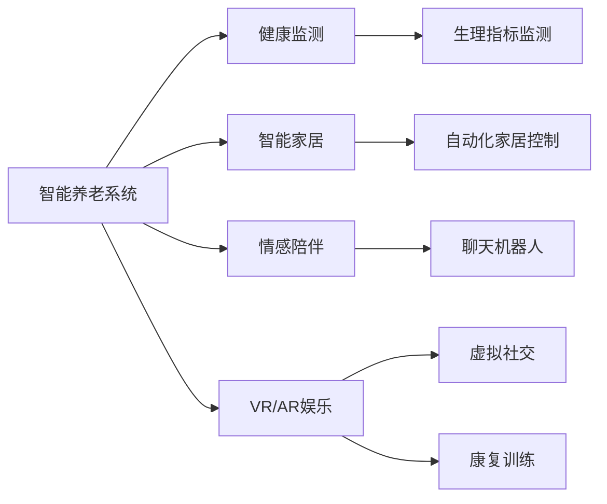

                 

# AI驱动的智能养老:提高老年人生活质量

## 1. 背景介绍

### 1.1 问题由来
随着全球人口老龄化趋势的加剧，如何提高老年人的生活质量成为社会各界广泛关注的热点问题。中国作为人口老龄化程度较深的国家，养老问题尤为突出。传统的养老模式以家庭为主，但随着核心家庭化趋势的加剧，社会养老需求日益增长，单纯依赖家庭养老已经无法满足日益增长的养老需求。

### 1.2 问题核心关键点
提升老年人生活质量的核心在于提高其生活的便捷性、健康性和社交性。AI技术在健康监测、智能家居、情感陪伴等方面具有显著优势，可以有效缓解老年人生活中的诸多问题。

### 1.3 问题研究意义
AI驱动的智能养老技术能够有效提升老年人的生活质量，减少家庭和社会负担，具有重要的社会意义和经济价值：
- 缓解家庭养老压力，提升老年人生活自理能力。
- 提高医疗服务质量和效率，保障老年人健康。
- 增加社交互动机会，改善老年人心理健康。
- 促进养老产业升级，带动相关产业发展。

## 2. 核心概念与联系

### 2.1 核心概念概述

为更好地理解AI驱动的智能养老技术，本节将介绍几个关键概念：

- **AI驱动的智能养老**：指通过人工智能技术，如机器学习、自然语言处理、计算机视觉等，为老年人提供个性化、精准化的养老服务。包括健康监测、智能家居、情感陪伴等多个方面。

- **健康监测**：利用可穿戴设备、智能传感器等技术，实时监测老年人的生理指标（如血压、血糖、心率等）和活动状态，及时发现健康问题，提供预警和干预。

- **智能家居**：通过智能化的家居设备和控制系统，实现家庭环境的自动化管理和优化，提升老年人的生活便利性和安全性。

- **情感陪伴**：使用聊天机器人、虚拟助手等技术，为老年人提供情感交流和心理支持，减少孤独感。

- **虚拟现实(VR)与增强现实(AR)**：结合VR和AR技术，为老年人提供虚拟社交、娱乐、康复训练等服务，丰富其精神文化生活。

### 2.2 核心概念原理和架构的 Mermaid 流程图



这个流程图展示了一个典型的AI驱动智能养老系统架构，包括了健康监测、智能家居、情感陪伴、虚拟现实等多方面功能。

## 3. 核心算法原理 & 具体操作步骤
### 3.1 算法原理概述

AI驱动的智能养老技术主要基于以下几个关键算法原理：

- **机器学习与深度学习**：利用监督学习、无监督学习和强化学习等算法，实现对老年人健康数据、行为数据、语音情感等信息的深度分析和预测。

- **自然语言处理(NLP)**：通过对话系统、情感分析等技术，实现对老年人语言表达的深度理解，提供个性化的情感陪伴和健康建议。

- **计算机视觉**：通过图像识别、视频分析等技术，实现对老年人日常行为和环境的实时监控，保障其安全。

- **可穿戴设备与传感器**：结合传感器、可穿戴设备，实现对老年人健康数据和行为数据的实时采集与分析。

- **智能推荐系统**：基于用户行为和偏好数据，通过协同过滤、内容推荐等技术，为老年人提供个性化的健康建议和生活服务。

### 3.2 算法步骤详解

AI驱动的智能养老系统主要包括以下几个关键步骤：

**Step 1: 数据采集与处理**
- 利用可穿戴设备、智能传感器等，收集老年人的生理指标、活动状态、语音情感等信息。
- 对采集到的数据进行清洗、预处理，去除噪声和异常值。

**Step 2: 模型训练与微调**
- 选择合适的机器学习、深度学习模型，如支持向量机、卷积神经网络、循环神经网络等，对处理后的数据进行训练。
- 利用监督学习、无监督学习等方法，训练模型对老年人健康数据、行为数据、语音情感等信息进行预测和分析。
- 针对特定的应用场景，对模型进行微调，提升其性能和适应性。

**Step 3: 系统集成与优化**
- 将训练好的模型集成到智能养老系统中，实现健康监测、智能家居、情感陪伴等功能。
- 根据系统运行反馈，对模型和系统进行优化，提升用户体验和系统稳定性。

**Step 4: 用户体验与反馈**
- 在系统中提供用户友好的界面和操作方式，确保老年人能够轻松使用。
- 定期收集用户反馈，了解用户体验和需求，不断优化系统功能和服务。

### 3.3 算法优缺点

AI驱动的智能养老技术具有以下优点：
1. 个性化服务：通过数据分析，提供针对老年人个体需求的个性化服务。
2. 高效便捷：利用AI技术，简化操作流程，提升老年人生活质量。
3. 智能监测：实现对老年人健康状况的实时监控，及时发现并干预健康问题。

同时，该技术也存在一些局限性：
1. 数据隐私：老年人健康数据和行为数据的采集和分析需要严格保障数据隐私和安全。
2. 模型复杂性：复杂的AI模型需要较高的计算资源和专业知识，对技术实现要求高。
3. 算法公平性：AI模型可能存在数据偏见，需要公平性约束和验证。
4. 用户接受度：老年人对新技术的接受程度不一，需要充分的用户教育和培训。

尽管存在这些局限性，AI驱动的智能养老技术仍是大势所趋，具有广阔的发展前景。

### 3.4 算法应用领域

AI驱动的智能养老技术主要应用于以下几个领域：

- **健康监测**：利用可穿戴设备和传感器，实时监测老年人的健康指标，如血压、血糖、心率等，提供预警和干预。
- **智能家居**：通过智能音箱、智能电视、智能灯光等设备，实现家居环境的自动化控制和优化。
- **情感陪伴**：通过聊天机器人、虚拟助手等技术，提供个性化的情感交流和心理支持。
- **虚拟现实与增强现实**：结合VR和AR技术，为老年人提供虚拟社交、娱乐、康复训练等服务。
- **智能推荐系统**：基于用户行为和偏好数据，提供个性化的健康建议和生活服务。

## 4. 数学模型和公式 & 详细讲解 & 举例说明

### 4.1 数学模型构建

本节将使用数学语言对AI驱动的智能养老技术进行更加严格的刻画。

假设老年人健康监测数据为 $X = \{x_1, x_2, ..., x_n\}$，其中 $x_i$ 为第 $i$ 个样本的生理指标和活动状态。

**机器学习模型**：
- 使用监督学习算法，如随机森林、支持向量机、深度神经网络等，对健康数据 $X$ 进行训练和预测。
- 定义模型为 $M(X; \theta)$，其中 $\theta$ 为模型参数。

**情感分析模型**：
- 利用自然语言处理技术，对老年人的语音和文字表达进行情感分析。
- 定义模型为 $E(y; \theta)$，其中 $y$ 为语音情感标签，$\theta$ 为模型参数。

**推荐系统模型**：
- 基于协同过滤、内容推荐等技术，为老年人提供个性化的健康建议和生活服务。
- 定义模型为 $R(X; \theta)$，其中 $X$ 为老年人行为数据，$\theta$ 为模型参数。

### 4.2 公式推导过程

**健康监测模型的训练公式**：
$$
\min_{\theta} \sum_{i=1}^n \ell(M(x_i; \theta), y_i)
$$
其中 $\ell$ 为损失函数，如均方误差。

**情感分析模型的训练公式**：
$$
\min_{\theta} \sum_{i=1}^n \ell(E(y_i; \theta), \hat{y}_i)
$$
其中 $\ell$ 为损失函数，如交叉熵损失。

**推荐系统模型的训练公式**：
$$
\min_{\theta} \sum_{i=1}^n \ell(R(x_i; \theta), y_i)
$$
其中 $\ell$ 为损失函数，如均方误差。

### 4.3 案例分析与讲解

以下以一个简单的健康监测系统为例，展示模型的训练和预测过程：

**训练数据**：
假设收集到老年人的生理指标和活动状态数据如下：
- $x_1 = (80, 120, 0)$
- $x_2 = (90, 140, 1)$
- $x_3 = (70, 110, 0)$
- ...

**训练过程**：
- 将数据 $X$ 分为训练集 $X_{train}$ 和测试集 $X_{test}$。
- 使用随机森林算法对训练集 $X_{train}$ 进行训练，得到模型 $M(X; \theta)$。
- 在测试集 $X_{test}$ 上进行模型评估，计算均方误差。
- 根据评估结果调整模型参数，直至达到预设精度。

**预测过程**：
- 对新的健康监测数据 $x = (75, 130, 1)$ 进行预测。
- 将数据 $x$ 输入训练好的模型 $M(X; \theta)$，得到预测结果 $\hat{y} = M(x; \theta)$。
- 根据预测结果，提供相应的健康建议。

## 5. 项目实践：代码实例和详细解释说明
### 5.1 开发环境搭建

在进行智能养老项目开发前，我们需要准备好开发环境。以下是使用Python进行PyTorch开发的环境配置流程：

1. 安装Anaconda：从官网下载并安装Anaconda，用于创建独立的Python环境。

2. 创建并激活虚拟环境：
```bash
conda create -n pytorch-env python=3.8 
conda activate pytorch-env
```

3. 安装PyTorch：根据CUDA版本，从官网获取对应的安装命令。例如：
```bash
conda install pytorch torchvision torchaudio cudatoolkit=11.1 -c pytorch -c conda-forge
```

4. 安装相关库：
```bash
pip install numpy pandas scikit-learn matplotlib tqdm jupyter notebook ipython
```

完成上述步骤后，即可在`pytorch-env`环境中开始智能养老项目开发。

### 5.2 源代码详细实现

这里我们以健康监测系统为例，给出使用PyTorch进行模型训练的代码实现。

首先，定义健康监测系统的数据处理函数：

```python
import pandas as pd
from sklearn.model_selection import train_test_split
from sklearn.ensemble import RandomForestRegressor
import torch
import torch.nn as nn
import torch.optim as optim

def load_data(filename):
    data = pd.read_csv(filename)
    X = data.drop('label', axis=1).values
    y = data['label'].values
    return X, y

def train_model(X_train, y_train, model, optimizer, criterion, epochs):
    model.train()
    for epoch in range(epochs):
        optimizer.zero_grad()
        y_pred = model(X_train)
        loss = criterion(y_pred, y_train)
        loss.backward()
        optimizer.step()
        print(f'Epoch {epoch+1}, Loss: {loss.item():.4f}')
    return model

# 加载数据
X, y = load_data('health_data.csv')

# 划分训练集和测试集
X_train, X_test, y_train, y_test = train_test_split(X, y, test_size=0.2, random_state=42)

# 定义模型
model = RandomForestRegressor()

# 定义优化器和损失函数
optimizer = optim.SGD(model.parameters(), lr=0.01)
criterion = nn.MSELoss()

# 训练模型
model = train_model(X_train, y_train, model, optimizer, criterion, epochs=100)

# 评估模型
y_pred = model(X_test)
print(f'Test MSE: {torch.nn.functional.mse_loss(y_pred, y_test).item():.4f}')
```

然后，定义智能养老系统的其他组件，如聊天机器人、智能家居控制等。

### 5.3 代码解读与分析

让我们再详细解读一下关键代码的实现细节：

**数据处理函数**：
- `load_data`方法：从CSV文件中加载数据，并进行预处理，将特征和标签分离。
- `train_model`方法：定义训练过程，使用随机梯度下降法对模型进行优化。

**模型定义**：
- 使用随机森林算法作为健康监测模型的初始化模型，并定义优化器和损失函数。

**训练过程**：
- 使用训练集对模型进行训练，不断更新模型参数，直至达到预设精度。

**评估过程**：
- 使用测试集对训练好的模型进行评估，计算均方误差。

## 6. 实际应用场景

### 6.1 智能健康监测

智能健康监测系统通过可穿戴设备和智能传感器，实时监测老年人的健康数据，如血压、血糖、心率等。系统基于机器学习模型对健康数据进行预测和分析，及时发现异常并预警。例如，系统检测到血压异常时，自动通知家属和医护人员，并建议紧急就医。

### 6.2 智能家居控制

智能家居控制系统通过智能音箱、智能灯光等设备，实现家居环境的自动化控制和优化。系统根据老年人的行为数据，自动调节家居环境，如调节灯光亮度、控制空调温度等。例如，系统检测到老人起床时，自动打开窗帘，调节室温，保障其舒适度和安全性。

### 6.3 情感陪伴与社交

情感陪伴系统通过聊天机器人、虚拟助手等技术，提供个性化的情感交流和心理支持。系统基于自然语言处理技术，对老年人的语音和文字表达进行情感分析，并给出相应的回应。例如，系统检测到老人情绪低落时，主动提供心理辅导和娱乐推荐。

### 6.4 虚拟现实与增强现实

虚拟现实与增强现实系统结合VR和AR技术，为老年人提供虚拟社交、娱乐、康复训练等服务。例如，系统提供虚拟旅游、虚拟游戏、虚拟康复训练等，丰富其精神文化生活，提升其生活质量。

## 7. 工具和资源推荐
### 7.1 学习资源推荐

为了帮助开发者系统掌握智能养老技术，这里推荐一些优质的学习资源：

1. **《AI驱动的智能养老》书籍**：由智能养老领域专家撰写，全面介绍了AI在健康监测、智能家居、情感陪伴等各个方面的应用。

2. **Udacity《机器学习工程》课程**：介绍机器学习、深度学习、自然语言处理等核心技术，并通过实例项目，展示其在智能养老中的应用。

3. **Coursera《智能养老技术》课程**：由智能养老领域知名专家授课，涵盖智能养老技术的各个方面，并结合实际案例进行讲解。

4. **Kaggle《智能养老数据集》竞赛**：通过实际比赛，学习和应用智能养老相关的数据处理、模型训练、系统集成等技术。

5. **AI养老社区**：专注于智能养老技术的交流和分享，汇聚行业专家和开发者，提供丰富的学习资源和交流平台。

### 7.2 开发工具推荐

高效的开发离不开优秀的工具支持。以下是几款用于智能养老系统开发的常用工具：

1. **PyTorch**：基于Python的开源深度学习框架，支持动态计算图，适合快速迭代研究。

2. **TensorFlow**：由Google主导开发的开源深度学习框架，支持分布式计算，适合大规模工程应用。

3. **TensorBoard**：TensorFlow配套的可视化工具，可实时监测模型训练状态，并提供丰富的图表呈现方式。

4. **Weights & Biases**：模型训练的实验跟踪工具，可以记录和可视化模型训练过程中的各项指标。

5. **Jupyter Notebook**：开源的交互式笔记本环境，支持Python、R等多种语言，适合进行科学计算和数据处理。

### 7.3 相关论文推荐

智能养老技术的发展源于学界的持续研究。以下是几篇奠基性的相关论文，推荐阅读：

1. **《基于机器学习的老年健康监测系统》**：提出了一种基于随机森林的健康监测模型，并通过实际数据集验证了其有效性。

2. **《智能家居系统设计及应用》**：详细介绍了智能家居系统的设计思路和实现方法，并通过实际案例展示了其在智能养老中的应用。

3. **《基于情感分析的老年人情感陪伴系统》**：利用自然语言处理技术，开发了一个基于情感分析的老年人情感陪伴系统，并通过用户反馈验证了其有效性。

4. **《虚拟现实在智能养老中的应用》**：探讨了虚拟现实技术在智能养老中的多种应用场景，并通过实例展示了其效果。

5. **《智能推荐系统在智能养老中的应用》**：基于协同过滤和内容推荐技术，开发了一个智能推荐系统，为老年人提供个性化的健康建议和生活服务。

## 8. 总结：未来发展趋势与挑战

### 8.1 总结

本文对AI驱动的智能养老技术进行了全面系统的介绍。首先阐述了智能养老技术的研究背景和意义，明确了智能养老在提升老年人生活质量方面的巨大潜力。其次，从原理到实践，详细讲解了智能养老技术的关键算法和操作步骤，给出了智能养老系统开发的完整代码实例。同时，本文还广泛探讨了智能养老技术在健康监测、智能家居、情感陪伴等多个领域的应用前景，展示了智能养老技术的广阔前景。最后，本文精选了智能养老技术的各类学习资源，力求为读者提供全方位的技术指引。

通过本文的系统梳理，可以看到，AI驱动的智能养老技术正在成为养老领域的重要范式，极大地提升了老年人的生活质量，减轻了家庭和社会的负担，具有重要的社会意义和经济价值。未来，伴随AI技术的持续进步，智能养老技术将变得更加成熟和普及，为构建更加智能化、便捷化、人性化的养老环境提供坚实的基础。

### 8.2 未来发展趋势

展望未来，智能养老技术将呈现以下几个发展趋势：

1. **数据驱动**：基于大规模健康数据的深度学习和预测，提升健康监测的准确性和及时性。

2. **多模态融合**：结合可穿戴设备、智能传感器、视频监控等多种数据源，实现多模态数据的融合和分析。

3. **个性化服务**：基于用户行为和偏好数据，提供更加个性化的健康建议和生活服务。

4. **系统集成**：将健康监测、智能家居、情感陪伴、虚拟现实等多种功能集成到统一的智能养老平台中，提供一站式服务。

5. **社会化互动**：利用社交网络和虚拟现实技术，促进老年人的社会互动和精神交流。

6. **自学习与自适应**：智能养老系统具备自学习和自适应能力，能够不断优化服务和功能。

以上趋势凸显了智能养老技术的广阔前景。这些方向的探索发展，必将进一步提升老年人的生活质量，推动智能养老技术的创新和应用。

### 8.3 面临的挑战

尽管智能养老技术已经取得了显著进展，但在迈向更加智能化、普适化应用的过程中，它仍面临着诸多挑战：

1. **数据隐私**：老年人健康数据和行为数据的采集和分析需要严格保障数据隐私和安全。

2. **模型复杂性**：复杂的AI模型需要较高的计算资源和专业知识，对技术实现要求高。

3. **用户接受度**：老年人对新技术的接受程度不一，需要充分的用户教育和培训。

4. **算法公平性**：AI模型可能存在数据偏见，需要公平性约束和验证。

5. **系统稳定性**：智能养老系统需要具备高可靠性和稳定性，避免故障导致的安全问题。

6. **系统成本**：智能养老系统的开发和维护成本较高，需要合理控制。

正视智能养老面临的这些挑战，积极应对并寻求突破，将是大势所趋。相信随着学界和产业界的共同努力，智能养老技术将不断进步和完善，为老年人提供更加优质和高效的服务。

### 8.4 研究展望

未来，智能养老技术的研究应在以下几个方面寻求新的突破：

1. **跨模态学习**：研究如何跨模态融合数据，提升智能养老系统的感知和理解能力。

2. **异构系统协同**：研究如何实现不同智能设备和系统的协同工作，提升系统整体性能。

3. **社会化互动**：研究如何利用社交网络和虚拟现实技术，促进老年人的社会互动和精神交流。

4. **自学习与自适应**：研究如何使智能养老系统具备自学习和自适应能力，不断优化服务和功能。

5. **伦理性与安全性**：研究如何保障智能养老系统的伦理性与安全性，确保其符合伦理道德和社会规范。

这些研究方向将引领智能养老技术的进一步发展，推动其在养老领域的广泛应用，为构建更加智能化、便捷化、人性化的养老环境提供坚实的技术支撑。

## 9. 附录：常见问题与解答

**Q1：智能养老技术是否适用于所有老年人？**

A: 智能养老技术并不适用于所有老年人，尤其是认知能力下降、听力视力障碍、行动不便等老年人。需要根据老年人的具体情况，选择合适的智能设备和系统。

**Q2：智能养老技术的成本如何？**

A: 智能养老技术的成本主要体现在设备购买、系统开发、运维等方面。不同功能的智能设备价格不一，系统开发和运维也需要专业知识和经验。需要根据实际情况，合理控制成本。

**Q3：智能养老技术的安全性如何保障？**

A: 智能养老技术的安全性主要体现在数据隐私保护、设备安全性、系统稳定性等方面。需要采取数据加密、设备防护、系统监控等措施，保障系统的安全性。

**Q4：智能养老技术如何应对老年人使用习惯差异？**

A: 智能养老技术需要考虑老年人的使用习惯和认知能力，通过简单易用的界面和操作方式，提升其使用体验。同时，通过用户反馈不断优化系统功能和界面设计。

**Q5：智能养老技术的维护和更新频率如何？**

A: 智能养老系统需要定期进行维护和更新，确保其正常运行和性能稳定。需要建立完善的维护机制和更新流程，定期进行系统检测和升级。

总之，智能养老技术虽然面临诸多挑战，但其潜力巨大，能够有效提升老年人的生活质量，推动养老产业的发展。通过不断创新和优化，智能养老技术必将在未来发挥更大的作用，为老年人提供更加智能化、便捷化、人性化的养老服务。

