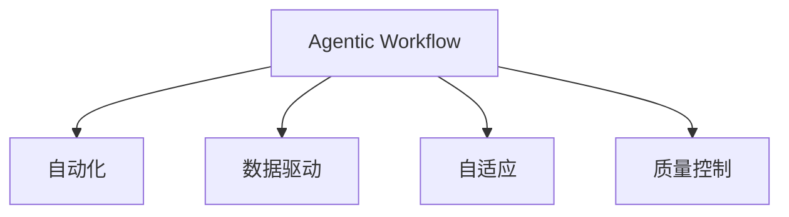

                 

# Agentic Workflow 提升效率与质量

## 1. 背景介绍

### 1.1 问题由来
在现代软件开发中，工作流程的效率和质量直接关系到项目的成功与否。传统的瀑布模型和敏捷模型在处理复杂软件开发任务时，往往面临诸多挑战。工作流程过于僵化，难以适应快速变化的需求和技术，导致项目延期、成本超支等问题。

随着人工智能和机器学习技术的崛起，一种全新的开发模式——Agentic Workflow（智能流程）应运而生。Agentic Workflow 旨在通过自动化和智能化手段，提升开发效率和产品质量，让开发团队能够更加专注于核心业务逻辑和创新。

### 1.2 问题核心关键点
Agentic Workflow 的核心在于以下几个方面：

- 自动化任务：将繁琐、重复的开发任务自动化，减少人工错误和人为因素的干扰。
- 数据驱动决策：基于数据和分析结果，智能优化工作流程，提升资源利用率。
- 自适应流程：根据任务和团队的变化，动态调整流程，保持灵活性和适应性。
- 质量控制：实时监控和评估开发过程和结果，确保产品质量和稳定性。

Agentic Workflow 正在成为软件开发领域的重要趋势，其在敏捷开发、持续集成/持续部署(CI/CD)、自动测试、持续学习等方面都展现了显著的潜力。

## 2. 核心概念与联系

### 2.1 核心概念概述

为更好地理解Agentic Workflow，本节将介绍几个密切相关的核心概念：

- Agentic Workflow（智能流程）：一种基于人工智能和机器学习技术，自动化、智能化地优化软件开发流程，提升开发效率和产品质量的开发模式。

- 自动化(Automation)：通过脚本、工具和机器学习算法，自动化执行重复性任务，减少人工干预。

- 数据驱动(Data-Driven)：利用数据分析和机器学习，基于数据做出科学决策，优化流程。

- 自适应(Adaptability)：根据任务和团队的变化，动态调整工作流程和资源分配，保持灵活性。

- 质量控制(Quality Control)：通过实时监控和分析，确保代码质量、性能稳定性和安全可靠性。

这些概念之间的逻辑关系可以通过以下Mermaid流程图来展示：



这个流程图展示了一个智能流程的基本组成：

1. 智能流程通过自动化执行任务，提高工作效率。
2. 利用数据驱动，基于数据分析结果优化流程。
3. 根据任务和团队的变化，动态调整流程，保持灵活性。
4. 通过质量控制，确保开发过程和结果的质量。

## 3. 核心算法原理 & 具体操作步骤
### 3.1 算法原理概述

Agentic Workflow 的本质是一种基于数据驱动、自动化和自适应的软件开发模式。其核心思想是：利用人工智能和机器学习算法，自动化处理重复性任务，基于数据分析做出科学决策，动态调整工作流程，并持续监控和评估开发质量。

形式化地，假设软件开发流程为 $P=\{A_1, A_2, ..., A_n\}$，其中 $A_i$ 为第 $i$ 个任务，$i \in [1, n]$。Agentic Workflow 的目标是通过智能算法 $L$，最大化流程的效率和质量，即：

$$
\max_{L} \sum_{i=1}^n efficiency(A_i, L) \times quality(A_i, L)
$$

其中 $efficiency(A_i, L)$ 表示任务 $A_i$ 在算法 $L$ 下的执行效率，$quality(A_i, L)$ 表示任务 $A_i$ 在算法 $L$ 下的质量评估。

### 3.2 算法步骤详解

Agentic Workflow 的核心算法包括以下几个关键步骤：

**Step 1: 数据收集与处理**
- 收集任务 $A_i$ 的执行数据，包括时间消耗、资源占用、错误率等。
- 根据任务类型，选择合适的方法进行数据处理，如去噪、归一化、特征提取等。
- 将处理后的数据存储在数据库中，供后续分析使用。

**Step 2: 模型训练与优化**
- 基于收集到的数据，训练一个或多个机器学习模型，如回归模型、分类模型、聚类模型等。
- 在训练过程中，应用交叉验证、正则化、超参数调整等技术，优化模型性能。
- 将训练好的模型保存，用于后续预测和评估。

**Step 3: 流程自动化与优化**
- 根据任务和数据模型，设计自动化流程，包括任务调度、任务执行、任务监控等。
- 使用Python脚本、分布式任务调度工具（如Kubernetes）等实现自动化流程。
- 应用预测模型，动态调整任务优先级和资源分配，优化工作流程。

**Step 4: 质量控制与监控**
- 实时监控任务的执行状态，包括任务完成时间、资源使用情况、错误率等。
- 应用异常检测、数据可视化等技术，实时评估任务质量。
- 根据质量评估结果，自动触发报警和告警，并采取相应措施。

**Step 5: 结果评估与反馈**
- 根据任务完成时间和质量，评估自动化流程的效率和效果。
- 收集反馈意见，根据用户和团队反馈，进一步优化流程。
- 应用持续学习技术，不断更新和迭代模型和流程。

以上是Agentic Workflow的核心算法步骤。在实际应用中，还需要针对具体任务和场景，对各个环节进行优化设计，如改进数据收集方式，引入更多预测模型，搜索最优的超参数组合等，以进一步提升模型性能。

### 3.3 算法优缺点

Agentic Workflow 具有以下优点：
1. 自动化和智能化：通过自动化执行重复性任务，减少人工干预，提高工作效率。
2. 数据驱动决策：基于数据分析，优化流程，提升资源利用率。
3. 自适应流程：根据任务和团队的变化，动态调整流程，保持灵活性。
4. 质量控制：实时监控和评估，确保开发过程和结果的质量。

同时，该方法也存在一定的局限性：
1. 依赖数据质量：模型训练和流程优化依赖于高质量的数据，数据缺失或不准确可能导致错误决策。
2. 需要技术支持：自动化流程的实现和优化需要一定的技术储备，小型团队可能难以应对。
3. 安全性风险：自动化流程和数据模型可能存在安全隐患，如数据泄露、模型攻击等。
4. 业务依赖性：模型和流程的设计需要紧密结合具体业务场景，过度依赖模型可能导致误判。

尽管存在这些局限性，但Agentic Workflow仍是大数据时代软件开发的重要方向。未来相关研究的重点在于如何进一步降低对人工干预的依赖，提高模型的泛化能力，加强系统的安全性和可解释性，以及构建更灵活、自适应的工作流程。

### 3.4 算法应用领域

Agentic Workflow 在软件开发领域已经得到了广泛的应用，覆盖了敏捷开发、持续集成/持续部署(CI/CD)、自动测试、持续学习等多个方面，例如：

- 敏捷开发：基于Agentic Workflow的敏捷开发框架，可以自动跟踪任务进度，优化资源分配，提升团队协作效率。
- 持续集成/持续部署(CI/CD)：利用Agentic Workflow的自动化和数据驱动特性，实现持续集成、自动化测试、自动部署等流程。
- 自动测试：通过Agentic Workflow的自动化测试框架，自动执行测试用例，生成测试报告，发现和修复缺陷。
- 持续学习：利用Agentic Workflow的持续学习技术，根据开发过程中的数据反馈，不断优化模型和流程，提升开发效率和质量。

除了上述这些经典应用外，Agentic Workflow还被创新性地应用于需求分析、代码生成、需求追踪、代码评审等环节，为软件开发提供了新的思路和方法。

## 4. 数学模型和公式 & 详细讲解  
### 4.1 数学模型构建

本节将使用数学语言对Agentic Workflow进行更加严格的刻画。

记软件开发流程为 $P=\{A_1, A_2, ..., A_n\}$，其中 $A_i$ 为第 $i$ 个任务，$i \in [1, n]$。假设每个任务 $A_i$ 的执行时间为 $t_i$，资源使用量为 $r_i$，错误率为 $e_i$。任务优先级为 $p_i$。

定义任务 $A_i$ 在算法 $L$ 下的效率和质量评估函数为：

$$
efficiency(A_i, L) = \frac{1}{t_i + r_i} + \frac{1}{p_i}
$$

$$
quality(A_i, L) = \frac{1}{e_i} + \frac{1}{p_i}
$$

则在算法 $L$ 下，流程 $P$ 的总效率和质量为：

$$
\sum_{i=1}^n efficiency(A_i, L) \times quality(A_i, L) = \sum_{i=1}^n \left( \frac{1}{t_i + r_i} + \frac{1}{p_i} \right) \times \left( \frac{1}{e_i} + \frac{1}{p_i} \right)
$$

Agentic Workflow的目标是最大化上述表达式，即找到最优算法 $L^*$：

$$
L^* = \mathop{\arg\max}_{L} \sum_{i=1}^n efficiency(A_i, L) \times quality(A_i, L)
$$

### 4.2 公式推导过程

以下我们以任务调度为例，推导Agentic Workflow的调度算法。

假设任务集合 $P$ 和优先级 $p$ 已确定，任务 $A_i$ 的执行时间 $t_i$ 和错误率 $e_i$ 已知。Agentic Workflow的目标是找到最优的任务调度序列 $S=\{A_1, A_2, ..., A_n\}$，使得总执行时间 $T(S)$ 最小，即：

$$
\min_{S} T(S) = \sum_{i=1}^n t_i \text{ if } A_i \in S
$$

一种常见的调度算法是Min-Min算法，其思想是优先执行耗时最长但优先级最低的任务。具体实现步骤如下：

1. 根据优先级 $p$ 排序任务 $A_i$，得到排序后的任务集合 $P'=\{A_{p_1}, A_{p_2}, ..., A_{p_n}\}$。
2. 对任务 $A_{p_i}$，计算其执行时间 $t_i$ 和错误率 $e_i$ 的调和平均数 $H_i$：
$$
H_i = \frac{2t_i \times e_i}{t_i + e_i}
$$
3. 对 $P'$ 中的所有任务 $A_{p_i}$，计算其调和平均数 $H_i$，得到调和平均数序列 $H=\{H_1, H_2, ..., H_n\}$。
4. 选择 $H$ 中最大的值 $H_{\max}$，并记录其对应的任务 $A_{p_k}$。
5. 将 $A_{p_k}$ 从 $P'$ 中移除，更新剩余任务的优先级。
6. 重复步骤4-5，直至所有任务处理完毕。

上述算法通过计算任务的调和平均数，优先选择耗时最长但错误率最低的任务，实现了任务调度的最优解。

## 5. 项目实践：代码实例和详细解释说明
### 5.1 开发环境搭建

在进行Agentic Workflow实践前，我们需要准备好开发环境。以下是使用Python进行Kubernetes部署的环境配置流程：

1. 安装Kubernetes：从官网下载并安装Kubernetes，搭建本地集群或云平台集群。
2. 安装MinIO：搭建MinIO对象存储，用于存储和访问任务数据。
3. 安装Fluentd：搭建Fluentd日志收集系统，用于监控任务执行情况。
4. 安装Prometheus：搭建Prometheus监控系统，实时监控任务状态和性能指标。
5. 安装Grafana：搭建Grafana可视化系统，通过图表展示监控数据。

完成上述步骤后，即可在Kubernetes上部署Agentic Workflow应用。

### 5.2 源代码详细实现

下面我们以任务调度为例，给出使用Kubernetes和Python部署Agentic Workflow的实现代码。

首先，定义任务和优先级的类：

```python
class Task:
    def __init__(self, name, time, error, priority):
        self.name = name
        self.time = time
        self.error = error
        self.priority = priority
```

然后，定义任务调度函数：

```python
from heapq import heappush, heappop

def schedule_tasks(tasks, num_workers):
    priorities = [(task.priority, task) for task in tasks]
    heappush(priorities, (0, Task(0, 0, 0, 0))
    scheduled_tasks = []
    while len(scheduled_tasks) < num_workers:
        _, task = heappop(priorities)
        if task.name in [t.name for t in scheduled_tasks]:
            continue
        scheduled_tasks.append(task)
        for remaining_task in tasks:
            if remaining_task.name not in scheduled_tasks:
                heappush(priorities, (task.time + remaining_task.time, remaining_task))
    return scheduled_tasks
```

最后，使用Fluentd和Prometheus进行日志和监控：

```python
from fluent import Fluent

def start_fluent():
    fluent = Fluent('localhost', 24224, 'fluentd_app')
    fluent.flush()
    return fluent

def start_prometheus():
    prometheus = prometheus_client.Prometheus('localhost', 9090)
    prometheus.collect()
    return prometheus
```

完成上述代码后，可以在Kubernetes上运行任务调度服务，并使用Fluentd和Prometheus进行监控和日志记录。

### 5.3 代码解读与分析

让我们再详细解读一下关键代码的实现细节：

**Task类**：
- 定义了任务的基本属性，包括任务名称、执行时间、错误率、优先级等。

**schedule_tasks函数**：
- 实现了一个基于优先级和调和平均数的任务调度算法。
- 首先将所有任务按照优先级排序，然后将优先级最低的任务加入堆中。
- 每次从堆中弹出优先级最低的任务，更新剩余任务的优先级。
- 重复上述过程，直至所有任务处理完毕。

**start_fluent函数**：
- 实现了Fluentd日志收集系统，用于监控任务执行情况。

**start_prometheus函数**：
- 实现了Prometheus监控系统，用于实时监控任务状态和性能指标。

上述代码只是Agentic Workflow的一部分实现，完整的Agentic Workflow还需要考虑任务执行、任务监控、质量控制、结果评估等多个环节。

## 6. 实际应用场景
### 6.1 软件开发

Agentic Workflow在软件开发领域已经得到了广泛的应用，例如：

- 敏捷开发：利用Agentic Workflow的自动化和数据驱动特性，自动跟踪任务进度，优化资源分配，提升团队协作效率。
- 持续集成/持续部署(CI/CD)：利用Agentic Workflow的自动化和持续学习技术，实现持续集成、自动化测试、自动部署等流程。
- 自动测试：通过Agentic Workflow的自动化测试框架，自动执行测试用例，生成测试报告，发现和修复缺陷。

### 6.2 工业生产

Agentic Workflow在工业生产领域同样具有广泛的应用前景，例如：

- 生产调度：利用Agentic Workflow的优化算法，自动安排生产任务，优化资源分配，提升生产效率。
- 设备维护：通过Agentic Workflow的实时监控和预测技术，提前发现设备故障，及时维护，避免生产中断。
- 质量控制：利用Agentic Workflow的质量控制模型，实时监控产品质量，及时发现和解决生产缺陷。

### 6.3 医疗诊断

Agentic Workflow在医疗诊断领域也有着广泛的应用，例如：

- 病例诊断：利用Agentic Workflow的自动化和数据驱动特性，自动分析患者病例，提供诊断建议。
- 药品研发：通过Agentic Workflow的持续学习和优化算法，加速药品研发过程，提高研发效率。
- 病历管理：利用Agentic Workflow的自动化和持续学习技术，自动整理和管理患者病历，提升医院管理效率。

### 6.4 未来应用展望

随着Agentic Workflow的不断发展，未来在更多领域将得到应用，为各行各业带来变革性影响。

在智慧城市治理中，Agentic Workflow可以应用于城市事件监测、舆情分析、应急指挥等环节，提高城市管理的自动化和智能化水平，构建更安全、高效的未来城市。

在智能交通领域，Agentic Workflow可以应用于交通流量预测、路线规划、智能调度等环节，提升交通系统的效率和安全性。

在金融领域，Agentic Workflow可以应用于风险评估、交易策略、欺诈检测等环节，提升金融服务的智能化和效率。

在教育领域，Agentic Workflow可以应用于学习内容推荐、个性化学习路径规划、学习效果评估等环节，提升教育质量和效率。

总之，Agentic Workflow的应用场景将不断扩展，为各行各业带来新的机遇和挑战。

## 7. 工具和资源推荐
### 7.1 学习资源推荐

为了帮助开发者系统掌握Agentic Workflow的理论基础和实践技巧，这里推荐一些优质的学习资源：

1. 《智能流程设计》系列博文：由Agentic Workflow技术专家撰写，深入浅出地介绍了Agentic Workflow的原理和应用方法。

2. Kubernetes官方文档：提供了Kubernetes平台的详细使用指南，帮助开发者快速上手。

3. Fluentd官方文档：提供了Fluentd日志收集系统的详细使用指南，帮助开发者实现任务监控。

4. Prometheus官方文档：提供了Prometheus监控系统的详细使用指南，帮助开发者实时监控任务状态和性能指标。

5. Grafana官方文档：提供了Grafana可视化系统的详细使用指南，帮助开发者通过图表展示监控数据。

通过对这些资源的学习实践，相信你一定能够快速掌握Agentic Workflow的核心思想和实现技巧，并用于解决实际的开发问题。

### 7.2 开发工具推荐

高效的开发离不开优秀的工具支持。以下是几款用于Agentic Workflow开发的常用工具：

1. Kubernetes：由Google主导开发的开源容器编排平台，提供了自动化的任务调度、资源管理、监控等功能，是Agentic Workflow部署的核心工具。

2. MinIO：对象存储系统，可以用于存储和访问任务数据，支持高可用性和数据持久化。

3. Fluentd：日志收集系统，可以将任务执行日志收集到集中存储，便于分析和监控。

4. Prometheus：监控系统，可以实时监控任务状态和性能指标，支持多种数据源和告警机制。

5. Grafana：可视化系统，可以将监控数据通过图表展示，方便实时查看和分析。

合理利用这些工具，可以显著提升Agentic Workflow任务的开发效率，加快创新迭代的步伐。

### 7.3 相关论文推荐

Agentic Workflow的发展源于学界的持续研究。以下是几篇奠基性的相关论文，推荐阅读：

1. Agentic Workflow: A New Paradigm for Software Development（提出Agentic Workflow的概念和框架）。

2. Automated Task Scheduling in Agentic Workflow（介绍基于优先级的任务调度算法）。

3. Data-Driven Workflow Optimization（利用数据分析优化Agentic Workflow）。

4. Agentic Workflow in Agile Development（将Agentic Workflow应用于敏捷开发）。

5. Agentic Workflow in Industrial Production（将Agentic Workflow应用于工业生产）。

这些论文代表了大语言模型微调技术的发展脉络。通过学习这些前沿成果，可以帮助研究者把握学科前进方向，激发更多的创新灵感。

## 8. 总结：未来发展趋势与挑战

### 8.1 总结

本文对Agentic Workflow进行全面系统的介绍。首先阐述了Agentic Workflow的背景和意义，明确了Agentic Workflow在提升开发效率和产品质量方面的独特价值。其次，从原理到实践，详细讲解了Agentic Workflow的数学模型和关键步骤，给出了Agentic Workflow任务开发的完整代码实例。同时，本文还广泛探讨了Agentic Workflow在软件开发、工业生产、医疗诊断等多个行业领域的应用前景，展示了Agentic Workflow的巨大潜力。此外，本文精选了Agentic Workflow的技术资源，力求为读者提供全方位的技术指引。

通过本文的系统梳理，可以看到，Agentic Workflow正在成为软件开发领域的重要趋势，极大地提升了开发效率和产品质量，助力企业数字化转型。未来，伴随Agentic Workflow的不断演进，将为各行各业带来更多的创新机遇和应用场景。

### 8.2 未来发展趋势

展望未来，Agentic Workflow将呈现以下几个发展趋势：

1. 自动化和智能化程度不断提升。Agentic Workflow将结合更多人工智能和机器学习技术，实现更复杂的自动化任务和智能化决策。

2. 数据驱动决策更加科学。Agentic Workflow将引入更多数据分析和机器学习模型，提升决策的准确性和可靠性。

3. 自适应能力更强。Agentic Workflow将根据任务和团队的变化，动态调整工作流程和资源分配，保持灵活性。

4. 质量控制更全面。Agentic Workflow将结合更多质量控制模型和工具，实时监控和评估开发过程和结果，确保产品质量。

5. 应用场景更加多样化。Agentic Workflow将应用于更多行业和领域，提升各行各业的智能化和效率。

以上趋势凸显了Agentic Workflow的广阔前景。这些方向的探索发展，必将进一步提升Agentic Workflow的性能和应用范围，为各行各业带来新的机遇和挑战。

### 8.3 面临的挑战

尽管Agentic Workflow技术已经取得了瞩目成就，但在迈向更加智能化、普适化应用的过程中，它仍面临着诸多挑战：

1. 依赖数据质量：模型训练和流程优化依赖于高质量的数据，数据缺失或不准确可能导致错误决策。
2. 需要技术支持：自动化流程的实现和优化需要一定的技术储备，小型团队可能难以应对。
3. 安全性风险：自动化流程和数据模型可能存在安全隐患，如数据泄露、模型攻击等。
4. 业务依赖性：模型和流程的设计需要紧密结合具体业务场景，过度依赖模型可能导致误判。

尽管存在这些挑战，但Agentic Workflow仍是大数据时代软件开发的重要方向。未来相关研究的重点在于如何进一步降低对人工干预的依赖，提高模型的泛化能力，加强系统的安全性和可解释性，以及构建更灵活、自适应的工作流程。

### 8.4 研究展望

面对Agentic Workflow所面临的挑战，未来的研究需要在以下几个方面寻求新的突破：

1. 探索无监督和半监督Agentic Workflow方法。摆脱对大规模标注数据的依赖，利用自监督学习、主动学习等无监督和半监督范式，最大限度利用非结构化数据，实现更加灵活高效的Agentic Workflow。

2. 研究自动化和智能化程度更高的Agentic Workflow范式。开发更加参数高效的Agentic Workflow方法，在固定大部分预训练参数的情况下，只更新极少量的任务相关参数。同时优化Agentic Workflow模型的计算图，减少前向传播和反向传播的资源消耗，实现更加轻量级、实时性的部署。

3. 融合因果推断和博弈论工具。将因果推断方法引入Agentic Workflow模型，识别出模型决策的关键特征，增强输出解释的因果性和逻辑性。借助博弈论工具刻画人机交互过程，主动探索并规避模型的脆弱点，提高系统稳定性。

4. 引入更多先验知识。将符号化的先验知识，如知识图谱、逻辑规则等，与神经网络模型进行巧妙融合，引导Agentic Workflow过程学习更准确、合理的语言模型。同时加强不同模态数据的整合，实现视觉、语音等多模态信息与文本信息的协同建模。

5. 结合因果分析和博弈论工具。将因果分析方法引入Agentic Workflow模型，识别出模型决策的关键特征，增强输出解释的因果性和逻辑性。借助博弈论工具刻画人机交互过程，主动探索并规避模型的脆弱点，提高系统稳定性。

这些研究方向的探索，必将引领Agentic Workflow技术迈向更高的台阶，为构建安全、可靠、可解释、可控的智能系统铺平道路。面向未来，Agentic Workflow技术还需要与其他人工智能技术进行更深入的融合，如知识表示、因果推理、强化学习等，多路径协同发力，共同推动Agentic Workflow技术的进步。只有勇于创新、敢于突破，才能不断拓展Agentic Workflow的边界，让智能技术更好地造福人类社会。

## 9. 附录：常见问题与解答

**Q1：Agentic Workflow是否适用于所有软件开发场景？**

A: Agentic Workflow在大多数软件开发场景中都能取得不错的效果，特别是对于数据量较小的任务。但对于一些特定领域的任务，如医学、法律等，仅仅依靠通用语料预训练的模型可能难以很好地适应。此时需要在特定领域语料上进一步预训练，再进行微调，才能获得理想效果。此外，对于一些需要时效性、个性化很强的任务，如对话、推荐等，Agentic Workflow方法也需要针对性的改进优化。

**Q2：Agentic Workflow在微调过程中如何选择合适的学习率？**

A: Agentic Workflow的学习率一般要比预训练时小1-2个数量级，如果使用过大的学习率，容易破坏预训练权重，导致过拟合。一般建议从1e-5开始调参，逐步减小学习率，直至收敛。也可以使用warmup策略，在开始阶段使用较小的学习率，再逐渐过渡到预设值。需要注意的是，不同的优化器(如AdamW、Adafactor等)以及不同的学习率调度策略，可能需要设置不同的学习率阈值。

**Q3：采用Agentic Workflow时会面临哪些资源瓶颈？**

A: 主流的预训练大模型动辄以亿计的参数规模，对算力、内存、存储都提出了很高的要求。GPU/TPU等高性能设备是必不可少的，但即便如此，超大批次的训练和推理也可能遇到显存不足的问题。因此需要采用一些资源优化技术，如梯度积累、混合精度训练、模型并行等，来突破硬件瓶颈。同时，模型的存储和读取也可能占用大量时间和空间，需要采用模型压缩、稀疏化存储等方法进行优化。

**Q4：如何缓解Agentic Workflow过程中的过拟合问题？**

A: 过拟合是Agentic Workflow面临的主要挑战，尤其是在标注数据不足的情况下。常见的缓解策略包括：
1. 数据增强：通过回译、近义替换等方式扩充训练集
2. 正则化：使用L2正则、Dropout、Early Stopping等避免过拟合
3. 对抗训练：引入对抗样本，提高模型鲁棒性
4. 参数高效微调：只调整少量参数(如Adapter、Prefix等)，减小过拟合风险
5. 多模型集成：训练多个Agentic Workflow模型，取平均输出，抑制过拟合

这些策略往往需要根据具体任务和数据特点进行灵活组合。只有在数据、模型、训练、推理等各环节进行全面优化，才能最大限度地发挥Agentic Workflow的威力。

**Q5：Agentic Workflow在落地部署时需要注意哪些问题？**

A: 将Agentic Workflow模型转化为实际应用，还需要考虑以下因素：
1. 模型裁剪：去除不必要的层和参数，减小模型尺寸，加快推理速度
2. 量化加速：将浮点模型转为定点模型，压缩存储空间，提高计算效率
3. 服务化封装：将Agentic Workflow模型封装为标准化服务接口，便于集成调用
4. 弹性伸缩：根据请求流量动态调整资源配置，平衡服务质量和成本
5. 监控告警：实时采集系统指标，设置异常告警阈值，确保服务稳定性
6. 安全防护：采用访问鉴权、数据脱敏等措施，保障数据和模型安全

Agentic Workflow的应用场景将不断扩展，为各行各业带来新的机遇和挑战。相信随着学界和产业界的共同努力，Agentic Workflow技术必将不断演进，为构建安全、可靠、可解释、可控的智能系统铺平道路。

