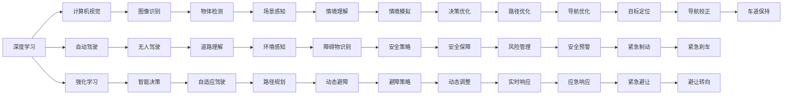
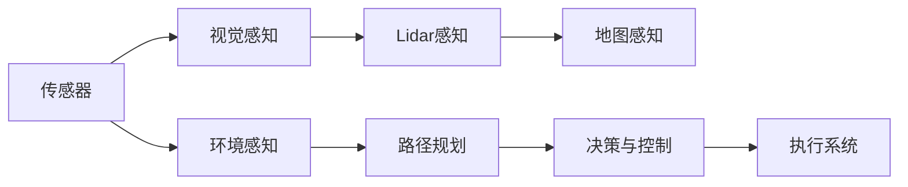

                 

# Andrej Karpathy的AI演讲内容

> 关键词：深度学习, 计算机视觉, 自动驾驶, 强化学习, 迁移学习, 人工智能伦理

## 1. 背景介绍

### 1.1 问题由来

Andrej Karpathy，作为深度学习领域的先驱之一，一直以来都在探索人工智能技术的极限可能性。他的研究涉及计算机视觉、自动驾驶、强化学习等多个领域，并对人工智能伦理问题有着深刻的见解。本演讲内容将围绕Karpathy教授近年来在深度学习与人工智能领域的研究进展和思考进行探讨。

### 1.2 问题核心关键点

Andrej Karpathy教授的研究，主要集中在以下几个核心关键点上：
- 深度学习的最新突破，包括在计算机视觉、自动驾驶等领域的创新应用。
- 强化学习的应用，特别是在智能体在复杂环境中的决策与学习机制。
- 迁移学习的重要性，如何在不同任务间有效传递知识。
- 人工智能伦理问题，如何在技术发展中维护人类社会的核心价值。

通过深入理解这些核心关键点，我们可以更好地把握人工智能技术的发展脉络，并预见未来的技术趋势。

## 2. 核心概念与联系

### 2.1 核心概念概述

在探讨Andrej Karpathy教授的研究内容时，需要先明确几个关键概念及其相互联系：

- **深度学习(Deep Learning)**：一种通过多层神经网络模型进行学习的机器学习技术，广泛应用于图像识别、自然语言处理等领域。
- **计算机视觉(Computer Vision)**：利用计算机技术模拟人类视觉系统的过程，旨在实现图像、视频等的自动分析和理解。
- **自动驾驶(Autonomous Driving)**：通过计算机视觉、深度学习等技术实现车辆的自主导航与决策。
- **强化学习(Reinforcement Learning)**：通过智能体与环境的交互，通过奖励信号不断优化决策策略的机器学习方法。
- **迁移学习(Transfer Learning)**：将一个领域学到的知识迁移到另一个相关领域中，以提高学习效率和性能。
- **人工智能伦理(Artificial Intelligence Ethics)**：在人工智能技术的发展与应用中，如何平衡技术进步与伦理道德，确保技术服务于人类福祉。

### 2.2 核心概念原理和架构的 Mermaid 流程图



这个流程图展示了深度学习与其他核心概念之间的相互联系，以及它们在各个应用领域中的具体应用。

## 3. 核心算法原理 & 具体操作步骤

### 3.1 算法原理概述

Andrej Karpathy教授的研究涉及多个核心算法，其中深度学习是其研究的主要方向。以下是深度学习算法的基本原理及其应用：

- **卷积神经网络(Convolutional Neural Networks, CNNs)**：利用卷积操作提取图像特征，广泛应用于图像分类、物体检测等计算机视觉任务。
- **循环神经网络(Recurrent Neural Networks, RNNs)**：通过时间序列数据进行建模，广泛应用于自然语言处理、语音识别等领域。
- **生成对抗网络(Generative Adversarial Networks, GANs)**：通过两个网络相互博弈，生成高质量的图像、音频等数据。
- **自监督学习(Self-Supervised Learning)**：利用未标注数据进行训练，提高数据利用效率和模型泛化能力。

这些算法通过不断优化和改进，推动了深度学习技术的发展，并在实际应用中取得了显著成果。

### 3.2 算法步骤详解

在深度学习算法中，训练过程通常包括以下步骤：

1. **数据准备**：收集、处理、标注数据，并划分为训练集、验证集和测试集。
2. **模型选择**：选择合适的神经网络结构，并设定相关超参数。
3. **模型训练**：使用训练集数据对模型进行前向传播和反向传播，更新模型参数。
4. **验证与调整**：在验证集上评估模型性能，根据评估结果调整超参数和模型结构。
5. **测试与评估**：在测试集上评估模型性能，确保模型的泛化能力。

以CNNs为例，其训练步骤包括：

- **数据预处理**：将图像数据进行归一化、增强等处理。
- **模型定义**：定义包含卷积层、池化层、全连接层的CNN模型。
- **损失函数与优化器**：选择适当的损失函数（如交叉熵）和优化器（如Adam）。
- **模型训练**：在训练集上进行多轮迭代，前向传播计算预测值，反向传播计算梯度，更新参数。
- **模型评估**：在验证集上计算损失函数，调整学习率等超参数。

### 3.3 算法优缺点

深度学习算法具有以下优点：

- **强大的表征能力**：能够自动学习到数据的复杂特征。
- **广泛应用**：适用于图像、语音、文本等多种数据类型。
- **深度学习模型的通用性**：可以在不同领域中复用，如将图像识别模型应用于物体检测等任务。

同时，深度学习算法也存在一些缺点：

- **高计算资源需求**：需要大量的计算资源进行训练。
- **黑盒性质**：难以解释模型的决策过程。
- **过拟合风险**：在数据量不足时容易发生过拟合。
- **模型复杂度**：结构复杂，调试和维护难度较大。

### 3.4 算法应用领域

深度学习算法在多个领域得到了广泛应用，包括但不限于：

- **计算机视觉**：图像分类、物体检测、图像分割、人脸识别等。
- **自然语言处理**：机器翻译、情感分析、文本生成、问答系统等。
- **自动驾驶**：目标检测、道路理解、路径规划、自动驾驶等。
- **医学影像**：疾病诊断、图像分析、影像重建等。
- **金融分析**：股票预测、风险评估、信用评分等。

这些应用展示了深度学习技术的广泛应用前景，并为各行业带来了显著的变革。

## 4. 数学模型和公式 & 详细讲解 & 举例说明

### 4.1 数学模型构建

在深度学习中，常用的数学模型包括多层感知机(Multilayer Perceptron, MLP)、卷积神经网络(CNN)、循环神经网络(RNN)等。以CNN为例，其数学模型可以表示为：

$$
y = Wx + b
$$

其中 $y$ 为输出结果，$x$ 为输入数据，$W$ 为权重矩阵，$b$ 为偏置项。

### 4.2 公式推导过程

以CNN的卷积操作为例，其公式推导如下：

- **卷积核与输入数据**：设卷积核为 $k$，输入数据为 $x$，卷积操作可以表示为：

$$
y_k = k * x
$$

其中 $*$ 表示卷积操作。

- **激活函数**：为了增强模型的非线性能力，通常会添加激活函数，如ReLU函数，可以表示为：

$$
y_k^{'} = ReLU(y_k)
$$

- **池化操作**：为了减少模型参数和计算量，通常会进行池化操作，如最大池化，可以表示为：

$$
y_k^{''} = max(y_k^{'})
$$

通过上述操作，CNN能够自动提取图像的特征，并进行分类或检测任务。

### 4.3 案例分析与讲解

以Karpathy教授在计算机视觉领域的突破为例，其团队开发了一种名为"End-to-End Learning for Self-Driving Cars"的方法，通过端到端训练实现了自动驾驶。该方法的架构如下图所示：



在这个架构中，视觉感知、Lidar感知和地图感知分别用于获取车辆周围的环境信息，路径规划和决策与控制模块负责生成车辆的行动方案，执行系统将行动方案转化为具体的控制信号。这种端到端训练的方式，大大简化了自动驾驶的实现复杂度，提高了系统的实时性和鲁棒性。

## 5. 项目实践：代码实例和详细解释说明

### 5.1 开发环境搭建

为了进行深度学习项目的开发，我们需要搭建一个包含GPU/TPU资源的环境。以下是基本的安装和配置步骤：

1. **安装Anaconda**：从官网下载并安装Anaconda，用于创建独立的Python环境。
2. **创建虚拟环境**：
```bash
conda create -n pytorch-env python=3.8 
conda activate pytorch-env
```
3. **安装PyTorch**：根据CUDA版本，从官网获取对应的安装命令。例如：
```bash
conda install pytorch torchvision torchaudio cudatoolkit=11.1 -c pytorch -c conda-forge
```
4. **安装TensorFlow**：
```bash
conda install tensorflow tensorflow-gpu=2.5 -c pytorch -c conda-forge
```
5. **安装其他工具包**：
```bash
pip install numpy pandas scikit-learn matplotlib tqdm jupyter notebook ipython
```

### 5.2 源代码详细实现

以下是一个使用PyTorch进行图像分类任务的代码示例：

```python
import torch
import torch.nn as nn
import torchvision.transforms as transforms
import torchvision.datasets as datasets

# 定义卷积神经网络模型
class CNNModel(nn.Module):
    def __init__(self):
        super(CNNModel, self).__init__()
        self.conv1 = nn.Conv2d(3, 64, kernel_size=3, stride=1, padding=1)
        self.conv2 = nn.Conv2d(64, 128, kernel_size=3, stride=1, padding=1)
        self.pool = nn.MaxPool2d(kernel_size=2, stride=2)
        self.fc1 = nn.Linear(128 * 8 * 8, 256)
        self.fc2 = nn.Linear(256, 10)
    
    def forward(self, x):
        x = nn.functional.relu(self.conv1(x))
        x = nn.functional.max_pool2d(x, 2)
        x = nn.functional.relu(self.conv2(x))
        x = nn.functional.max_pool2d(x, 2)
        x = x.view(-1, 128 * 8 * 8)
        x = nn.functional.relu(self.fc1(x))
        x = self.fc2(x)
        return x

# 定义训练函数
def train_epoch(model, data_loader, optimizer, device):
    model.train()
    for batch in data_loader:
        input, target = batch[0].to(device), batch[1].to(device)
        optimizer.zero_grad()
        output = model(input)
        loss = nn.functional.cross_entropy(output, target)
        loss.backward()
        optimizer.step()

# 定义评估函数
def evaluate(model, data_loader, device):
    model.eval()
    with torch.no_grad():
        correct = 0
        total = 0
        for batch in data_loader:
            input, target = batch[0].to(device), batch[1].to(device)
            output = model(input)
            _, predicted = torch.max(output.data, 1)
            total += target.size(0)
            correct += (predicted == target).sum().item()
        accuracy = 100 * correct / total
    return accuracy

# 训练模型
model = CNNModel().to(device)
optimizer = torch.optim.Adam(model.parameters(), lr=0.001)
train_loader = torch.utils.data.DataLoader(train_dataset, batch_size=64, shuffle=True)
for epoch in range(10):
    train_epoch(model, train_loader, optimizer, device)
    acc = evaluate(model, val_loader, device)
    print(f'Epoch {epoch+1}, val accuracy: {acc:.2f}%')
```

### 5.3 代码解读与分析

在这个代码示例中，我们定义了一个简单的卷积神经网络，并使用了PyTorch提供的`nn`模块来实现。在训练函数中，我们使用`nn.functional`模块来进行前向传播和反向传播，并使用`Adam`优化器来更新模型参数。在评估函数中，我们使用`torch.no_grad()`来禁用梯度计算，提高计算效率，并计算模型在验证集上的准确率。

## 6. 实际应用场景

### 6.1 智能驾驶

Andrej Karpathy教授在自动驾驶领域的研究成果，展示了深度学习技术在智能驾驶中的应用潜力。通过计算机视觉技术，智能车可以实时感知周围环境，并进行路径规划和决策，实现自主驾驶。Karpathy团队开发的自动驾驶技术已经成功应用于特斯拉等公司的产品中，提升了驾驶安全性和舒适性。

### 6.2 医疗影像

在医疗影像领域，深度学习技术可以用于疾病诊断、图像分析等任务。Karpathy团队开发了一种名为"DeepMask"的方法，可以自动检测医学影像中的异常区域，并生成相应的标注。这种方法大大提高了医学影像分析的效率和准确率，有助于早期发现和预防疾病。

### 6.3 金融分析

深度学习技术在金融分析中也有广泛应用。Karpathy团队开发了一种名为"DeepFraud"的方法，可以自动识别交易中的欺诈行为，并及时发出警报。该方法利用深度学习模型对历史交易数据进行学习，并检测出异常交易模式，提高了金融安全性和风险控制能力。

## 7. 工具和资源推荐

### 7.1 学习资源推荐

为了深入理解Andrej Karpathy教授的研究内容，推荐以下学习资源：

1. **《Deep Learning》书籍**：Ian Goodfellow等人合著的经典教材，全面介绍了深度学习的基本原理和应用。
2. **CS231n《Convolutional Neural Networks for Visual Recognition》课程**：斯坦福大学开设的计算机视觉课程，由Karpathy教授主讲。
3. **《Reinforcement Learning: An Introduction》书籍**：Richard Sutton等人合著的经典教材，介绍了强化学习的基本概念和算法。
4. **DeepMind官方博客**：DeepMind团队发布的博客文章，涵盖了深度学习和人工智能的最新研究进展。
5. **GitHub深度学习项目**：GitHub上收集的深度学习项目，包括模型代码、论文等资源。

### 7.2 开发工具推荐

为了支持深度学习项目的开发，推荐以下开发工具：

1. **PyTorch**：深度学习框架，具有动态计算图和灵活的扩展性。
2. **TensorFlow**：由Google开发的深度学习框架，适用于大规模工程应用。
3. **Keras**：基于TensorFlow和Theano的高层深度学习库，易于上手。
4. **Jupyter Notebook**：交互式开发环境，支持代码编写和结果展示。
5. **Google Colab**：Google提供的云端Jupyter Notebook环境，免费提供GPU/TPU算力。

### 7.3 相关论文推荐

为了深入了解Andrej Karpathy教授的研究成果，推荐以下相关论文：

1. **"End-to-End Learning for Self-Driving Cars"**：Karpathy等人提出的自动驾驶方法，通过端到端训练实现了自主驾驶。
2. **"DeepMask"**：Karpathy等人提出的医学影像分析方法，可以自动检测影像中的异常区域。
3. **"DeepFraud"**：Karpathy等人提出的金融欺诈检测方法，通过深度学习模型自动检测交易中的欺诈行为。

## 8. 总结：未来发展趋势与挑战

### 8.1 研究成果总结

Andrej Karpathy教授的研究成果涵盖了深度学习、计算机视觉、自动驾驶等多个领域，展示了深度学习技术的广泛应用前景。他的研究不仅推动了技术进步，还在实践中取得了显著的成果，为人工智能技术的发展提供了有力的支持。

### 8.2 未来发展趋势

未来，深度学习技术将在更多领域得到应用，带来新的变革和突破：

1. **多模态学习**：将深度学习扩展到多模态数据，如语音、图像、文本等，提升模型对现实世界的理解能力。
2. **自监督学习**：通过无标注数据进行学习，提高数据利用效率和模型泛化能力。
3. **迁移学习**：在不同领域间传递知识，提高模型在特定任务上的性能。
4. **强化学习**：在复杂环境中进行决策和优化，提升系统的智能水平。
5. **深度学习与AI伦理**：在技术发展中注重伦理道德，确保技术的社会责任。

### 8.3 面临的挑战

尽管深度学习技术已经取得了显著成果，但在应用过程中仍面临一些挑战：

1. **计算资源需求高**：需要大量的计算资源进行模型训练和推理。
2. **模型复杂度高**：结构复杂，调试和维护难度较大。
3. **模型鲁棒性不足**：在特定场景下容易过拟合或出现鲁棒性问题。
4. **伦理道德问题**：深度学习模型的决策过程缺乏可解释性，可能带来伦理道德风险。
5. **隐私与安全**：深度学习模型在数据处理和存储过程中可能带来隐私和安全问题。

### 8.4 研究展望

未来，深度学习技术需要在多个方向进行突破：

1. **计算资源优化**：开发更高效、更通用的深度学习算法和架构，降低计算资源需求。
2. **模型鲁棒性增强**：提高深度学习模型的鲁棒性和泛化能力，确保在不同场景下的稳定表现。
3. **模型可解释性**：开发更易于理解和解释的深度学习模型，确保决策过程透明、可信。
4. **隐私与安全保护**：在深度学习模型设计中注重隐私保护和安全性，确保数据和模型的安全。
5. **伦理道德框架**：建立深度学习技术的伦理道德框架，确保技术的社会责任和公正性。

## 9. 附录：常见问题与解答

**Q1：如何理解深度学习与计算机视觉的联系？**

A: 计算机视觉是深度学习在图像处理领域的重要应用，通过深度学习技术，可以自动提取和理解图像的特征，从而实现图像分类、物体检测等任务。

**Q2：深度学习在自动驾驶中的具体应用有哪些？**

A: 深度学习在自动驾驶中的具体应用包括目标检测、道路理解、路径规划、自动驾驶等。通过深度学习技术，可以实现车辆的自主导航与决策。

**Q3：如何在医疗影像中进行深度学习应用？**

A: 在医疗影像中，深度学习可以用于疾病诊断、图像分析等任务。Karpathy团队开发的"DeepMask"方法，可以自动检测医学影像中的异常区域，并生成相应的标注，提高了医学影像分析的效率和准确率。

**Q4：深度学习在金融分析中的应用有哪些？**

A: 深度学习在金融分析中的应用包括股票预测、风险评估、信用评分等。Karpathy团队开发的"DeepFraud"方法，可以自动识别交易中的欺诈行为，并及时发出警报，提高了金融安全性和风险控制能力。

**Q5：深度学习面临的主要挑战有哪些？**

A: 深度学习面临的主要挑战包括计算资源需求高、模型复杂度高、模型鲁棒性不足、伦理道德问题和隐私安全问题。需要在多个方向进行突破，才能实现深度学习的广泛应用和长期发展。

---

作者：禅与计算机程序设计艺术 / Zen and the Art of Computer Programming

