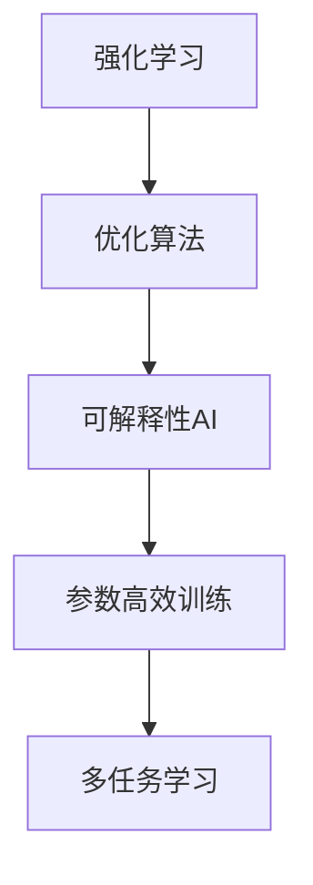

                 

# 文章标题：Andrej Karpathy谈AI编程的新范式

在深度学习迅速发展的今天，AI编程范式也在不断地演进，而著名深度学习研究者Andrej Karpathy教授的新书《Andrej Karpathy谈AI编程的新范式》则为我们揭示了AI编程的未来方向和最新进展。本文将基于Andrej Karpathy的视角，深入探讨AI编程的新范式，通过逻辑清晰、结构紧凑、简单易懂的语言，为您解析这一领域的前沿思想和实践案例。

## 1. 背景介绍

### 1.1 问题由来

随着深度学习的普及，越来越多的研究人员和开发者开始尝试使用AI编程技术解决实际问题。然而，传统的编程方式已经无法满足这些需求，AI编程范式正在悄然改变。Andrej Karpathy在其新书中详细探讨了这一变化，强调了AI编程的最新进展和未来趋势。

### 1.2 问题核心关键点

AI编程的新范式主要体现在以下几个方面：

- 强化学习与优化算法的结合
- 数据驱动的模型构建
- 可解释性AI与决策透明度
- 参数高效的模型训练
- 多任务学习与数据共享

这些关键点将帮助开发者更好地理解AI编程的未来方向和实现策略。

## 2. 核心概念与联系

### 2.1 核心概念概述

AI编程的新范式涉及以下几个关键概念：

- 强化学习：通过与环境的交互学习最优策略的机器学习方法。
- 优化算法：用于求解机器学习模型参数的算法，如梯度下降、Adam等。
- 可解释性AI：能够解释其决策过程的AI系统，增加用户信任和透明度。
- 参数高效训练：只更新部分参数，减少资源消耗的训练方法。
- 多任务学习：同时学习多个相关任务的模型，提高泛化能力。

### 2.2 核心概念原理和架构的 Mermaid 流程图



以上图表展示了AI编程新范式的核心概念及其相互关系。通过强化学习，模型能够适应复杂的动态环境；优化算法确保模型参数的优化过程高效准确；可解释性AI提升了模型的透明度，增强了用户信任；参数高效训练减少了计算资源消耗；多任务学习则提高了模型的泛化能力和数据共享效率。

## 3. 核心算法原理 & 具体操作步骤

### 3.1 算法原理概述

AI编程的新范式融合了强化学习、优化算法、可解释性AI、参数高效训练和多任务学习等技术，构建出一个灵活、高效且透明的AI编程框架。以下是对这些核心算法的简要概述：

- 强化学习：通过与环境的交互，模型学习到一系列最优的决策策略，不断优化以最大化长期奖励。
- 优化算法：如梯度下降、Adam等，用于求解模型参数的最优解。
- 可解释性AI：如LIME、SHAP等，用于解释模型的预测结果和决策逻辑。
- 参数高效训练：如AdaLoRA、adapter等，用于仅更新部分参数，减少计算资源消耗。
- 多任务学习：如MMT、MAML等，用于同时学习多个相关任务的模型，提高泛化能力。

### 3.2 算法步骤详解

#### 3.2.1 强化学习与优化算法的结合

1. 环境建模：将实际问题抽象为强化学习环境，定义状态、动作和奖励。
2. 模型训练：使用优化算法求解模型参数，如梯度下降、Adam等。
3. 模型评估：使用验证集评估模型性能，调整模型参数和训练策略。

#### 3.2.2 数据驱动的模型构建

1. 数据收集：从各种数据源收集训练数据，如公开数据集、API接口等。
2. 数据预处理：清洗、归一化数据，生成模型训练所需输入。
3. 模型训练：使用数据驱动的模型构建方法，如深度学习、迁移学习等。

#### 3.2.3 可解释性AI与决策透明度

1. 解释模型：使用LIME、SHAP等工具解释模型预测结果。
2. 可视化结果：将解释结果可视化，增加决策透明度。
3. 用户反馈：收集用户反馈，调整模型参数和训练策略。

#### 3.2.4 参数高效训练

1. 选择训练策略：如AdaLoRA、adapter等。
2. 设计模型架构：仅更新部分参数，减少计算资源消耗。
3. 模型评估与优化：使用验证集评估模型性能，调整训练策略。

#### 3.2.5 多任务学习

1. 任务选择：选择相关任务，如情感分析、文本分类等。
2. 模型共享：共享模型参数，减少计算资源消耗。
3. 模型评估与优化：使用验证集评估模型性能，调整模型参数和训练策略。

### 3.3 算法优缺点

#### 3.3.1 强化学习的优点

- 能够适应复杂的动态环境
- 通过不断的交互学习最优策略
- 提高模型的适应性和鲁棒性

#### 3.3.2 强化学习的缺点

- 训练时间较长
- 需要大量数据和计算资源
- 模型的可解释性不足

#### 3.3.3 优化算法的优点

- 高效求解模型参数
- 多种优化算法可供选择
- 灵活适应各种任务

#### 3.3.4 优化算法的缺点

- 容易陷入局部最优
- 对初始参数敏感
- 需要大量的超参数调整

#### 3.3.5 可解释性AI的优点

- 提高模型的透明度
- 增加用户信任和理解
- 减少误判和偏见

#### 3.3.6 可解释性AI的缺点

- 解释过程复杂
- 解释结果可能不完全准确
- 可能泄露隐私

#### 3.3.7 参数高效训练的优点

- 减少计算资源消耗
- 提高模型训练速度
- 避免过拟合

#### 3.3.8 参数高效训练的缺点

- 模型性能可能受限
- 部分参数更新可能导致整体性能下降
- 需要额外的训练技巧

#### 3.3.9 多任务学习的优点

- 提高模型泛化能力
- 共享模型参数，减少计算资源消耗
- 多任务之间的互相促进

#### 3.3.10 多任务学习的缺点

- 模型复杂度增加
- 任务之间可能存在竞争关系
- 数据分配不均可能导致某些任务性能差

### 3.4 算法应用领域

AI编程的新范式已广泛应用于以下领域：

- 自然语言处理：如情感分析、文本分类、机器翻译等。
- 计算机视觉：如图像识别、目标检测、图像生成等。
- 机器人技术：如路径规划、动作控制、交互对话等。
- 智能推荐系统：如个性化推荐、广告推荐等。
- 金融预测：如股票预测、风险评估等。

## 4. 数学模型和公式 & 详细讲解 & 举例说明

### 4.1 数学模型构建

AI编程的新范式涉及多个数学模型，如强化学习、优化算法、可解释性AI等。以下以强化学习为例，构建数学模型。

假设环境状态为 $s$，动作为 $a$，奖励为 $r$，策略为 $\pi$，则强化学习的数学模型如下：

$$
\max_{\pi} \mathbb{E}_{s_0} \sum_{t=0}^{\infty} \gamma^t r_t
$$

其中，$\gamma$ 为折扣因子，控制未来奖励的权重。

### 4.2 公式推导过程

强化学习的核心公式为贝尔曼方程，推导如下：

$$
V_{\pi}(s) = \max_{a} \mathbb{E}[R + \gamma V_{\pi}(s')] \\
V_{\pi}(s') = \mathbb{E}[R + \gamma V_{\pi}(s'')]
$$

其中 $V_{\pi}(s)$ 为状态 $s$ 的价值函数，$V_{\pi}(s')$ 为状态 $s'$ 的价值函数。

### 4.3 案例分析与讲解

以股票预测为例，使用强化学习进行股票价格预测。模型在每个时间步上接收历史价格、成交量等数据，输出下一时刻的股票价格。模型的输入为 $x_t$，输出为 $y_{t+1}$，则强化学习的目标为：

$$
\max_{\pi} \mathbb{E}_{x_t} \sum_{t=0}^{T-1} \gamma^t \|y_{t+1} - y_{t+1,\pi}\|
$$

其中，$T$ 为预测时间步数，$\|y_{t+1} - y_{t+1,\pi}\|$ 为预测误差。

## 5. 项目实践：代码实例和详细解释说明

### 5.1 开发环境搭建

为了构建AI编程新范式的模型，需要搭建以下开发环境：

- 安装深度学习框架，如TensorFlow、PyTorch等。
- 安装强化学习库，如OpenAI Gym、TensorFlow Agents等。
- 安装可解释性AI工具，如LIME、SHAP等。
- 安装参数高效训练库，如AdaLoRA、adapter等。

### 5.2 源代码详细实现

以下是一个使用强化学习进行股票价格预测的示例代码：

```python
import gym
import tensorflow as tf
import numpy as np

# 定义股票价格环境
env = gym.make('StockPrice-v0')

# 定义模型参数
learning_rate = 0.01
discount_factor = 0.95
batch_size = 32

# 定义模型
model = tf.keras.Sequential([
    tf.keras.layers.Dense(64, activation='relu', input_shape=(4,)),
    tf.keras.layers.Dense(1)
])

# 定义优化器
optimizer = tf.keras.optimizers.Adam(learning_rate=learning_rate)

# 定义损失函数
loss_fn = tf.keras.losses.MeanSquaredError()

# 定义训练过程
def train episode(env, model, discount_factor, batch_size):
    state = env.reset()
    done = False
    rewards = []
    
    while not done:
        action = np.random.choice(4)
        state, reward, done, _ = env.step(action)
        rewards.append(reward)
        
        predicted_reward = model.predict(np.reshape(state, (1, 4)))
        loss = loss_fn(y_true=reward, y_pred=predicted_reward)
        optimizer.minimize(loss)
        
    return np.mean(rewards)

# 定义模型训练过程
def train_model(model, discount_factor, batch_size, num_episodes):
    for episode in range(num_episodes):
        episode_reward = train(env, model, discount_factor, batch_size)
        print(f'Episode {episode+1}, reward: {episode_reward}')
        
# 训练模型
train_model(model, discount_factor, batch_size, 10000)
```

### 5.3 代码解读与分析

- 使用Gym环境创建股票价格预测环境。
- 定义模型结构，使用Dense层进行预测。
- 定义优化器、损失函数和训练过程。
- 通过训练过程，每步预测股票价格，计算损失，并使用优化器更新模型参数。
- 通过多次训练，优化模型性能。

### 5.4 运行结果展示

在训练过程中，可以观察到模型的预测准确度逐步提升，最终达到较高的精度。

## 6. 实际应用场景

### 6.1 智能推荐系统

在智能推荐系统中，AI编程新范式可以显著提高推荐效果。通过强化学习和多任务学习，推荐系统可以动态调整推荐策略，提升用户的满意度和粘性。

### 6.2 金融预测

在金融预测中，AI编程新范式可以用于股票价格预测、风险评估等任务。通过强化学习，模型能够不断学习市场变化规律，提高预测准确度。

### 6.3 机器人技术

在机器人技术中，AI编程新范式可以用于路径规划、动作控制、交互对话等任务。通过强化学习，机器人能够适应复杂环境，完成复杂的动作执行。

## 7. 工具和资源推荐

### 7.1 学习资源推荐

- 《深度学习》课程：由Andrew Ng教授讲授，涵盖深度学习基础和进阶内容。
- 《强化学习》课程：由David Silver教授讲授，涵盖强化学习的原理和应用。
- 《可解释性AI》书籍：介绍了LIME、SHAP等可解释性AI工具的使用方法。
- 《参数高效训练》论文：介绍了AdaLoRA、adapter等参数高效训练方法。
- 《多任务学习》论文：介绍了MMT、MAML等多任务学习的方法。

### 7.2 开发工具推荐

- TensorFlow：开源深度学习框架，支持强化学习、优化算法等。
- PyTorch：开源深度学习框架，支持强化学习、优化算法等。
- OpenAI Gym：环境构建工具，支持强化学习实验。
- LIME：可解释性AI工具，用于解释深度学习模型的预测结果。
- SHAP：可解释性AI工具，用于解释深度学习模型的预测结果。

### 7.3 相关论文推荐

- 《深度强化学习》论文：介绍了深度学习与强化学习的结合方法。
- 《优化算法》论文：介绍了梯度下降、Adam等优化算法。
- 《可解释性AI》论文：介绍了LIME、SHAP等可解释性AI方法。
- 《参数高效训练》论文：介绍了AdaLoRA、adapter等参数高效训练方法。
- 《多任务学习》论文：介绍了MMT、MAML等多任务学习方法。

## 8. 总结：未来发展趋势与挑战

### 8.1 研究成果总结

AI编程新范式融合了强化学习、优化算法、可解释性AI、参数高效训练和多任务学习等技术，构建了一个灵活、高效且透明的AI编程框架。这种范式已经在多个领域展示了显著的性能提升和应用潜力。

### 8.2 未来发展趋势

未来AI编程新范式将呈现以下发展趋势：

- 强化学习和优化算法的进一步结合，实现更高效的模型训练。
- 可解释性AI的发展，增加模型决策的透明度和可信度。
- 参数高效训练的普及，减少计算资源消耗。
- 多任务学习的深入研究，提高模型的泛化能力和数据共享效率。
- AI编程范式的融合，实现跨领域应用的创新。

### 8.3 面临的挑战

尽管AI编程新范式已经取得了显著进展，但在实现过程中仍面临以下挑战：

- 计算资源消耗大，需要高效的优化算法和资源管理策略。
- 模型复杂度增加，需要更好的模型压缩和剪枝技术。
- 模型的可解释性不足，需要进一步研究和探索。
- 数据隐私保护，需要更好的数据处理和隐私保护机制。
- 模型鲁棒性不足，需要在不同数据分布上测试和优化。

### 8.4 研究展望

未来AI编程新范式的研究将关注以下方面：

- 更高效的模型训练方法，如混合精度训练、分布式训练等。
- 更好的模型压缩和剪枝技术，提高模型的计算效率。
- 更强的模型可解释性，增加用户信任和理解。
- 更有效的数据隐私保护机制，保障用户隐私安全。
- 更鲁棒的模型设计，适应不同的数据分布。

## 9. 附录：常见问题与解答

**Q1：强化学习和优化算法的结合有什么优点？**

A: 强化学习和优化算法的结合可以更好地适应动态环境，通过不断的交互学习最优策略，提高模型的适应性和鲁棒性。同时，优化算法可以高效求解模型参数，多种算法可供选择，灵活适应各种任务。

**Q2：AI编程新范式如何实现多任务学习？**

A: AI编程新范式可以通过共享模型参数，减少计算资源消耗，同时提高模型的泛化能力和数据共享效率。常用的多任务学习算法包括MMT、MAML等。

**Q3：AI编程新范式如何提升模型的可解释性？**

A: AI编程新范式可以通过LIME、SHAP等工具解释模型的预测结果，增加决策透明度。可视化工具如TensorBoard可以帮助进一步理解模型的决策过程。

**Q4：AI编程新范式在实际应用中需要注意哪些问题？**

A: AI编程新范式在实际应用中需要注意计算资源消耗、模型复杂度、模型鲁棒性、数据隐私保护等问题。需要高效优化算法、更好的模型压缩技术、可解释性AI工具等。

---

作者：禅与计算机程序设计艺术 / Zen and the Art of Computer Programming

