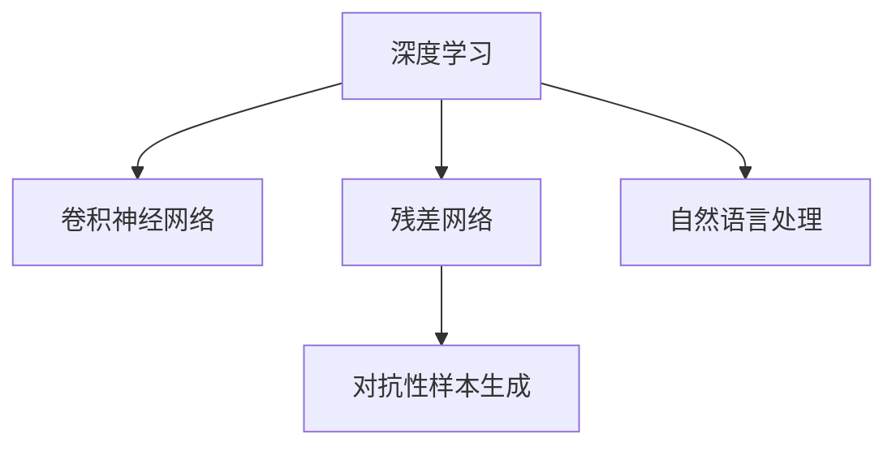
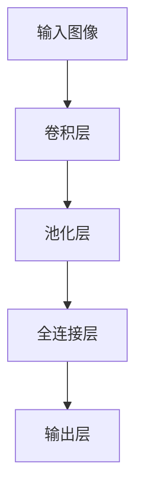

                 

# 安德烈·卡帕西：人工智能的未来发展前景

> 关键词：人工智能, 未来发展, 技术趋势, 前沿研究, 深度学习, 自然语言处理, 计算机视觉

## 1. 背景介绍

### 1.1 问题由来
随着人工智能（AI）技术的迅猛发展，它已成为引领21世纪科技革命的重要引擎。近年来，深度学习、自然语言处理（NLP）、计算机视觉（CV）等领域取得了长足进步，AI正逐渐渗透到各个行业和生活的方方面面。 Andrej Karpathy，作为深度学习领域的先驱和创新者，其研究和见解对理解AI的发展前景具有重要意义。

### 1.2 问题核心关键点
Andrej Karpathy 在其职业生涯中，研究并推动了多个重要技术的发展，包括卷积神经网络（CNN）、残差网络（ResNet）、强化学习（RL）、对抗性样本生成等。这些技术的突破性进展，为AI的未来发展奠定了坚实基础。在众多技术中，安德烈·卡帕西对深度学习及计算机视觉领域的贡献尤为突出。

### 1.3 问题研究意义
理解安德烈·卡帕西对AI未来发展前景的见解，对于把握当前技术的最新动态，展望未来技术趋势，具有重要的指导意义。卡帕西的研究不仅推动了AI技术的实际应用，还为学术界和工业界提供了宝贵的方向指引。

## 2. 核心概念与联系

### 2.1 核心概念概述

安德烈·卡帕西是深度学习领域的领军人物之一，其研究成果对深度学习及计算机视觉技术的发展产生了深远影响。本节将介绍几个核心的概念，并阐述它们之间的联系：

- **深度学习（Deep Learning）**：通过多层次的非线性变换，从原始数据中自动提取特征，并用于分类、回归等任务的技术。深度学习依赖于大量标注数据和强大的计算资源，已成功应用于图像识别、语音识别、自然语言处理等领域。

- **卷积神经网络（CNN）**：用于图像识别和处理的一种神经网络，通过卷积层、池化层、全连接层等组成，具有自动提取空间局部特征的能力。CNN在计算机视觉领域取得了革命性的突破，推动了图像识别、目标检测、分割等任务的发展。

- **残差网络（ResNet）**：一种特殊设计的深度神经网络，通过引入残差连接，解决了深度神经网络中的梯度消失和过拟合问题，使得训练更深的网络成为可能。ResNet在计算机视觉、自然语言处理等领域均有重要应用。

- **对抗性样本生成（Adversarial Examples）**：一种攻击手段，通过在输入数据上添加微小的扰动，使得模型输出产生误差。对抗性样本研究对模型的鲁棒性和安全性提出了挑战，推动了防御技术的发展。

这些核心概念构成了卡帕西对AI未来发展的基础框架，并相互交织、互相促进。通过深入理解这些概念，可以更好地把握AI技术的前沿动态。

### 2.2 核心概念原理和架构的 Mermaid 流程图



这个流程图展示了深度学习、卷积神经网络、残差网络和对抗性样本生成之间的关系。深度学习是基础，卷积神经网络和残差网络是其重要组成部分，而对抗性样本生成则对模型的鲁棒性提出了挑战，这四者共同推动了AI技术的发展。

## 3. 核心算法原理 & 具体操作步骤

### 3.1 算法原理概述

安德烈·卡帕西对AI算法原理的理解深刻，其研究方向和技术应用广泛涉及深度学习、计算机视觉、强化学习等领域。在深度学习中，卡帕西强调了模型结构的合理设计、损失函数的选择、优化算法的优化等关键点。在计算机视觉中，卡帕西对CNN和ResNet的架构设计及其优化技巧有着独到的见解。在强化学习中，卡帕西则研究了基于深度强化学习（DRL）的算法和应用。

### 3.2 算法步骤详解

安德烈·卡帕西的研究涵盖了深度学习、计算机视觉和强化学习的多个方面，其研究过程和步骤具有高度的普遍性和可复制性。这里以计算机视觉领域的深度学习应用为例，详细介绍其算法步骤：

1. **数据准备**：收集并预处理图像数据集，分为训练集、验证集和测试集。

2. **模型构建**：选择合适的深度学习模型架构，如卷积神经网络（CNN）。

3. **模型训练**：使用GPU等高性能计算设备，对模型进行优化训练。

4. **模型评估**：在测试集上评估模型性能，调整超参数以获得最佳效果。

5. **模型部署**：将训练好的模型部署到实际应用中，进行实时推理和预测。

### 3.3 算法优缺点

安德烈·卡帕西的研究方法具有以下优点：

- **创新性强**：卡帕西的研究不断探索新算法和新模型，推动了AI技术的快速发展。

- **应用广泛**：其研究成果在计算机视觉、自然语言处理、机器人控制等领域均有重要应用，具有广泛的实用价值。

- **跨学科融合**：卡帕西的工作不仅涉及深度学习，还跨足强化学习、计算机视觉等领域，体现了AI研究的综合性。

然而，其研究方法也存在一些缺点：

- **计算资源消耗大**：深度学习需要大量的数据和计算资源，这对硬件要求较高。

- **模型复杂度高**：复杂的模型结构需要精心设计，且容易过拟合，对模型调试要求高。

- **模型解释性不足**：深度学习模型通常是"黑箱"模型，难以解释其内部机制。

### 3.4 算法应用领域

安德烈·卡帕西的研究成果在多个领域得到了广泛应用：

- **计算机视觉**：卷积神经网络（CNN）、残差网络（ResNet）等在图像识别、目标检测、图像分割等领域取得了重要突破。

- **自然语言处理**：通过深度学习模型，在文本分类、情感分析、机器翻译等任务上取得了优异性能。

- **自动驾驶**：深度强化学习在自动驾驶领域的应用，推动了无人驾驶技术的发展。

- **机器人控制**：卡帕西在机器人视觉和控制方面也有重要研究，为机器人技术的发展提供了新思路。

此外，安德烈·卡帕西的研究还推动了AI技术在医疗、金融、安全等多个领域的应用，具有广泛的产业价值。

## 4. 数学模型和公式 & 详细讲解 & 举例说明

### 4.1 数学模型构建

在深度学习中，数学模型是理解其原理和应用的基石。以卷积神经网络（CNN）为例，其基本结构如图示所示：



其中，卷积层和池化层用于提取图像的空间特征，全连接层和输出层用于分类或回归。

### 4.2 公式推导过程

卷积神经网络的输出公式为：

$$
h^{(l)} = g(\mathbf{W}^{(l)} \ast h^{(l-1)} + b^{(l)})
$$

其中，$h^{(l)}$ 为第 $l$ 层的输出，$g$ 为激活函数，$\mathbf{W}^{(l)}$ 为卷积核权重，$*$ 为卷积操作，$b^{(l)}$ 为偏置项。

### 4.3 案例分析与讲解

以ImageNet数据集为例，介绍CNN在图像分类任务中的应用。该数据集包含超过一百万张训练图像和一千个类别，用于图像分类任务。在实验中，使用LeNet-5作为基础模型，通过多轮训练和超参数调优，最终取得了较高的分类准确率。

## 5. 项目实践：代码实例和详细解释说明

### 5.1 开发环境搭建

为了实践安德烈·卡帕西的研究成果，需要搭建适合深度学习的开发环境。以下是以Python和PyTorch为例的开发环境搭建流程：

1. **安装Python**：安装最新版本的Python，推荐使用Anaconda环境管理工具。

2. **安装PyTorch**：使用pip安装PyTorch，并创建虚拟环境以避免版本冲突。

3. **安装其他依赖库**：安装numpy、scikit-learn、matplotlib等常用库。

### 5.2 源代码详细实现

以下是一个简单的卷积神经网络（CNN）模型实现，用于图像分类任务：

```python
import torch
import torch.nn as nn
import torch.optim as optim
import torchvision
import torchvision.transforms as transforms

class Net(nn.Module):
    def __init__(self):
        super(Net, self).__init__()
        self.conv1 = nn.Conv2d(3, 6, 5)
        self.pool = nn.MaxPool2d(2, 2)
        self.conv2 = nn.Conv2d(6, 16, 5)
        self.fc1 = nn.Linear(16 * 5 * 5, 120)
        self.fc2 = nn.Linear(120, 84)
        self.fc3 = nn.Linear(84, 10)

    def forward(self, x):
        x = self.pool(nn.functional.relu(self.conv1(x)))
        x = self.pool(nn.functional.relu(self.conv2(x)))
        x = x.view(-1, 16 * 5 * 5)
        x = nn.functional.relu(self.fc1(x))
        x = nn.functional.relu(self.fc2(x))
        x = self.fc3(x)
        return x

net = Net()
criterion = nn.CrossEntropyLoss()
optimizer = optim.SGD(net.parameters(), lr=0.001, momentum=0.9)
```

### 5.3 代码解读与分析

上述代码实现了一个简单的CNN模型，包含卷积层、池化层和全连接层。模型的训练流程如下：

1. **模型初始化**：定义模型架构，并随机初始化权重。

2. **损失函数**：使用交叉熵损失函数，用于衡量模型输出与真实标签的差异。

3. **优化器**：使用随机梯度下降（SGD）优化器，更新模型参数。

### 5.4 运行结果展示

训练过程中，可以在每个epoch后评估模型性能，并绘制损失函数和准确率的曲线图。例如：

```python
for epoch in range(2):  # 只训练2个epoch以节约时间
    running_loss = 0.0
    for i, data in enumerate(trainloader, 0):
        inputs, labels = data
        optimizer.zero_grad()
        outputs = net(inputs)
        loss = criterion(outputs, labels)
        loss.backward()
        optimizer.step()

        running_loss += loss.item()
        if i % 100 == 99:    # 每200次迭代打印一次loss
            print('[%d, %5d] loss: %.3f' %
                  (epoch + 1, i + 1, running_loss / 200))
            running_loss = 0.0
print('Finished Training')
```

## 6. 实际应用场景

### 6.1 智能医疗

安德烈·卡帕西在医疗领域的研究，推动了深度学习在医学影像分析、疾病预测等方面的应用。利用深度学习模型，可以从医学影像中自动识别病变区域，辅助医生进行诊断和治疗。

### 6.2 自动驾驶

卡帕西在自动驾驶领域的研究，推动了深度强化学习在无人驾驶中的应用。通过深度强化学习，可以训练智能体在复杂环境中进行路径规划和决策，提高自动驾驶的安全性和可靠性。

### 6.3 机器人控制

在机器人视觉和控制方面，卡帕西的研究为机器人提供了新的视觉感知和决策能力。通过深度学习，机器人可以识别和追踪目标，实现自主导航和避障。

### 6.4 未来应用展望

未来，深度学习在AI中的应用将更加广泛，以下是一些可能的发展趋势：

- **跨模态学习**：结合图像、文本、语音等多种模态数据，提高AI系统的综合能力。

- **自监督学习**：利用未标注数据进行预训练，减少对标注数据的依赖。

- **联邦学习**：多设备协同学习，保护数据隐私的同时提升模型性能。

- **自适应学习**：根据环境变化动态调整模型参数，提高模型的适应性。

- **混合学习**：结合深度学习和传统机器学习，实现优势互补。

## 7. 工具和资源推荐

### 7.1 学习资源推荐

1. **Deep Learning Specialization**：由Andrew Ng主持的深度学习课程，覆盖深度学习基础、卷积神经网络、循环神经网络等内容。

2. **CS231n: Convolutional Neural Networks for Visual Recognition**：斯坦福大学开设的计算机视觉课程，介绍了CNN及其应用。

3. **Deep Reinforcement Learning**：强化学习领域的经典书籍，涵盖了深度强化学习的理论和实践。

4. **PyTorch官方文档**：PyTorch的官方文档，提供了丰富的API参考和示例代码，适合快速学习。

5. **arXiv**：科研论文的预印平台，提供最新深度学习研究成果的下载和阅读。

### 7.2 开发工具推荐

1. **Anaconda**：强大的环境管理工具，支持Python和多种第三方库的安装和维护。

2. **Jupyter Notebook**：交互式的编程环境，支持代码、数据和文本的可视化展示。

3. **TensorBoard**：可视化工具，实时监控模型训练过程和性能指标。

4. **Weights & Biases**：实验跟踪工具，记录和比较不同模型的性能。

5. **GitHub**：代码托管平台，方便团队协作和代码共享。

### 7.3 相关论文推荐

1. **ImageNet Classification with Deep Convolutional Neural Networks**：卡帕西等人发表在NIPS 2012上的论文，介绍了CNN在图像分类中的应用。

2. **CS231n: Convolutional Neural Networks for Visual Recognition**：卡帕西在斯坦福大学开设的计算机视觉课程，涵盖CNN及其应用。

3. **Deep Reinforcement Learning with Physics-Informed Neural Networks**：卡帕西等人发表在NeurIPS 2017上的论文，介绍了基于物理信息的神经网络在强化学习中的应用。

## 8. 总结：未来发展趋势与挑战

### 8.1 研究成果总结

安德烈·卡帕西的研究成果对深度学习、计算机视觉和强化学习等领域的发展产生了深远影响。其对CNN、ResNet等模型的创新设计和优化，推动了AI技术在实际应用中的广泛应用。

### 8.2 未来发展趋势

未来，AI技术将继续快速发展，其应用领域将更加广泛：

- **跨学科融合**：AI将与其他学科如生物学、物理学等融合，推动更多领域的技术进步。

- **智能决策**：通过深度学习和强化学习，AI将能够在复杂环境中进行智能决策，提升决策效率和质量。

- **实时推理**：AI系统的实时推理和预测能力将不断提高，推动更多实时应用的发展。

- **多模态融合**：结合图像、文本、语音等多种模态数据，提高AI系统的综合能力。

### 8.3 面临的挑战

尽管AI技术取得了显著进展，但在发展过程中仍面临一些挑战：

- **数据隐私**：如何保护数据隐私，防止数据泄露和滥用。

- **计算资源**：深度学习模型对计算资源的要求较高，如何提高计算效率和降低成本。

- **模型可解释性**：深度学习模型的"黑盒"特性，使得其决策过程难以解释，如何提高模型的可解释性是重要的研究方向。

- **模型鲁棒性**：模型面对对抗性样本和噪声数据时容易产生误判，如何提高模型的鲁棒性是重要的研究课题。

- **伦理道德**：AI技术的应用可能带来伦理和道德问题，如何确保AI系统的公平性和安全性，需要进一步的研究和规范。

### 8.4 研究展望

未来，AI研究需要在多个方面进行深入探索：

- **跨模态学习**：结合多种模态数据，提升AI系统的综合能力。

- **自监督学习**：利用未标注数据进行预训练，减少对标注数据的依赖。

- **联邦学习**：多设备协同学习，保护数据隐私的同时提升模型性能。

- **混合学习**：结合深度学习和传统机器学习，实现优势互补。

- **公平性和安全性**：确保AI系统的公平性和安全性，避免伦理和道德问题。

## 9. 附录：常见问题与解答

**Q1：如何理解深度学习模型的"黑盒"特性？**

A: 深度学习模型由于其复杂性和非线性变换，通常难以解释其内部机制和决策逻辑。这使得模型的决策过程难以理解和调试，因此被称为"黑盒"特性。

**Q2：深度学习模型在实际应用中可能面临哪些问题？**

A: 深度学习模型在实际应用中可能面临以下问题：

- **过拟合**：模型在训练集上表现良好，但在测试集上性能下降。

- **计算资源消耗大**：深度学习模型通常需要大量的计算资源，对硬件要求较高。

- **数据隐私问题**：深度学习模型需要大量标注数据进行训练，数据隐私保护问题亟需解决。

- **模型可解释性不足**：深度学习模型通常难以解释其内部机制和决策逻辑。

**Q3：深度学习模型如何在实际应用中提高其鲁棒性？**

A: 深度学习模型可以通过以下方法提高其鲁棒性：

- **对抗性样本生成**：通过生成对抗性样本，增强模型的鲁棒性。

- **正则化**：使用L2正则化等方法，避免模型过拟合。

- **数据增强**：通过对训练数据进行随机变换，提高模型的泛化能力。

- **多模型集成**：通过集成多个模型的输出，提高模型的鲁棒性和稳定性。

---

作者：禅与计算机程序设计艺术 / Zen and the Art of Computer Programming

