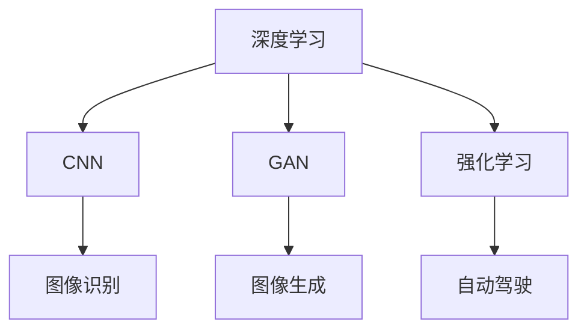

                 

# Andrej Karpathy：人工智能的未来发展方向

## 1. 背景介绍

### 1.1 问题由来

人工智能（AI）的快速发展，尤其是在机器学习和深度学习领域的突破，推动了多个行业和领域的变革。从自动驾驶、医疗诊断，到推荐系统、金融分析，AI技术正以惊人的速度重塑世界的各个角落。然而，随着技术的不断演进，AI面临的未来发展方向已成为人们关注的焦点。

Andrej Karpathy，作为人工智能领域的先驱和领导者，对AI的未来发展方向有着深刻的见解和独到的预测。本文将基于Karpathy的讲座和著作，探讨他对于AI未来的观点，包括AI技术的发展趋势、应用前景以及面临的挑战和机遇。

### 1.2 问题核心关键点

Andrej Karpathy在AI领域的研究和实践涉及多个关键点，包括但不限于深度学习、计算机视觉、强化学习、自动驾驶等。他的研究涵盖了从算法原理到实际应用的全方位内容，尤其在AI技术未来发展方向上有着深入的思考。

本文将从以下几个核心关键点切入，展开对Andrej Karpathy关于AI未来发展方向的探讨：
1. AI的核心算法与技术演进。
2. AI在自动驾驶、计算机视觉等领域的应用前景。
3. AI技术面临的挑战与应对策略。
4. AI的未来发展趋势与机遇。

## 2. 核心概念与联系

### 2.1 核心概念概述

Andrej Karpathy的研究和实践涵盖了多个核心概念，包括但不限于深度学习、卷积神经网络（CNN）、生成对抗网络（GAN）、强化学习、自动驾驶等。这些概念之间相互关联，共同构成了AI技术的基础框架。

以下是一些核心概念及其相互联系的概述：

- **深度学习（Deep Learning）**：深度学习是一种通过多层神经网络进行复杂模式识别的技术，广泛应用于图像识别、语音识别、自然语言处理等领域。
- **卷积神经网络（CNN）**：CNN是一种特殊的深度学习模型，常用于图像和视频处理任务。通过卷积和池化操作，CNN可以自动提取图像中的特征。
- **生成对抗网络（GAN）**：GAN由生成器和判别器两部分组成，可以生成逼真的图像、音频和视频，广泛应用于生成任务。
- **强化学习（Reinforcement Learning）**：强化学习通过试错法，训练智能体在环境中采取最优策略。它在自动驾驶、游戏AI等领域有重要应用。
- **自动驾驶（Autonomous Driving）**：自动驾驶技术融合了深度学习、计算机视觉、强化学习等多种AI技术，旨在实现无人驾驶车辆的安全和高效运行。

这些核心概念通过特定的算法和架构，共同支撑了AI技术的不断发展。以下通过Mermaid流程图来展示这些概念之间的联系：



该流程图展示了深度学习如何通过CNN应用于图像处理，通过GAN应用于图像生成，通过强化学习应用于自动驾驶。

## 3. 核心算法原理 & 具体操作步骤

### 3.1 算法原理概述

Andrej Karpathy的研究工作涵盖了多个核心算法，包括卷积神经网络、生成对抗网络、强化学习等。本文将重点探讨他关于这些算法在AI未来发展中的应用和演进。

#### 3.1.1 卷积神经网络（CNN）

CNN是一种通过卷积和池化操作，自动提取图像特征的深度学习模型。Karpathy对CNN的研究主要集中在图像识别和视频分析等领域。

图像识别方面，Karpathy通过CNN模型实现了对于大型图像数据库的高效识别。他的工作表明，通过多层次卷积操作，CNN可以自动学习图像中的复杂特征，从而在图像分类任务上取得显著效果。

视频分析方面，Karpathy提出了基于CNN的帧间关系网络（FRNet），通过学习不同时间帧之间的关系，实现了对于视频帧的自动标注和理解。

#### 3.1.2 生成对抗网络（GAN）

GAN由生成器和判别器两部分组成，通过对抗学习，可以生成逼真的图像、音频和视频。Karpathy对GAN的研究主要集中在图像生成和视频生成等领域。

在图像生成方面，Karpathy通过GAN实现了高保真度的图像生成，其生成的图像在视觉上与真实图像几乎无法区分。

在视频生成方面，Karpathy提出了基于GAN的视频生成模型，通过学习视频帧之间的关系，实现了对于视频帧的自动生成和理解。

#### 3.1.3 强化学习（RL）

强化学习通过试错法，训练智能体在环境中采取最优策略。Karpathy对强化学习的研究主要集中在自动驾驶和游戏AI等领域。

在自动驾驶方面，Karpathy通过强化学习训练智能体在复杂交通环境中做出最优决策，实现了无人驾驶车辆的安全和高效运行。

在游戏AI方面，Karpathy通过强化学习训练游戏智能体，使其能够在多种游戏中取得优异成绩。

### 3.2 算法步骤详解

以下将详细介绍Andrej Karpathy在卷积神经网络、生成对抗网络和强化学习等领域的研究步骤：

#### 3.2.1 卷积神经网络（CNN）

CNN的研究步骤主要包括：
1. **数据预处理**：对图像数据进行预处理，包括图像归一化、标准化、裁剪等。
2. **网络设计**：设计多层卷积和池化操作，形成深度神经网络结构。
3. **模型训练**：通过反向传播算法，更新网络参数，使其能够自动提取图像特征。
4. **模型评估**：在测试集上评估模型性能，调整网络结构和超参数。

#### 3.2.2 生成对抗网络（GAN）

GAN的研究步骤主要包括：
1. **网络设计**：设计生成器和判别器两部分网络，分别用于生成和判别。
2. **对抗训练**：通过对抗学习，训练生成器和判别器，使其能够生成逼真的图像。
3. **模型评估**：在测试集上评估生成器的性能，调整网络结构和超参数。

#### 3.2.3 强化学习（RL）

强化学习的研究步骤主要包括：
1. **环境设计**：设计智能体所在的模拟环境，包括状态、动作和奖励机制。
2. **策略学习**：通过试错法，训练智能体采取最优策略。
3. **模型评估**：在测试环境中评估智能体的性能，调整策略和学习率。

### 3.3 算法优缺点

#### 3.3.1 卷积神经网络（CNN）

**优点**：
1. 高效提取图像特征，广泛应用于图像识别、视频分析等领域。
2. 可扩展性强，适用于多种图像处理任务。

**缺点**：
1. 需要大量标注数据进行训练。
2. 对图像质量要求高，图像变形、噪声等因素可能影响性能。

#### 3.3.2 生成对抗网络（GAN）

**优点**：
1. 生成高保真度的图像、音频和视频，具有广泛应用前景。
2. 生成的数据可以用于数据增强和虚拟现实等领域。

**缺点**：
1. 训练复杂度高，容易产生模式崩溃（Mode Collapse）等问题。
2. 生成的数据可能存在一定的偏差和噪声。

#### 3.3.3 强化学习（RL）

**优点**：
1. 在复杂环境中，智能体能够自主学习最优策略。
2. 广泛应用于自动驾驶、游戏AI等领域。

**缺点**：
1. 需要大量试错数据进行训练，训练时间较长。
2. 模型不稳定，需要细致的参数调优。

### 3.4 算法应用领域

Andrej Karpathy的研究工作涵盖了多个应用领域，包括但不限于计算机视觉、图像生成、自动驾驶、游戏AI等。

#### 3.4.1 计算机视觉

Karpathy在计算机视觉领域的研究成果主要集中在图像识别和视频分析等领域。他通过CNN模型实现了对大型图像数据库的高效识别，并提出了基于CNN的帧间关系网络（FRNet），实现了对于视频帧的自动标注和理解。

#### 3.4.2 图像生成

Karpathy通过GAN模型实现了高保真度的图像生成，其生成的图像在视觉上与真实图像几乎无法区分。

#### 3.4.3 自动驾驶

Karpathy通过强化学习训练智能体在复杂交通环境中做出最优决策，实现了无人驾驶车辆的安全和高效运行。

#### 3.4.4 游戏AI

Karpathy通过强化学习训练游戏智能体，使其能够在多种游戏中取得优异成绩。

## 4. 数学模型和公式 & 详细讲解 & 举例说明

### 4.1 数学模型构建

#### 4.1.1 卷积神经网络（CNN）

卷积神经网络（CNN）的基本数学模型可以表示为：

$$
y = h(Wx + b)
$$

其中，$x$ 为输入图像，$W$ 和 $b$ 为卷积层和偏置项的权重和偏置，$h$ 为激活函数。

CNN的核心是卷积操作，其数学模型为：

$$
y_{c} = w*x + b
$$

其中，$x$ 为输入图像，$w$ 为卷积核，$b$ 为偏置项。

#### 4.1.2 生成对抗网络（GAN）

生成对抗网络（GAN）的数学模型包括生成器和判别器两部分：

生成器：
$$
z \sim p(z) \rightarrow x_g = G(z)
$$

判别器：
$$
x_r \sim p(x_r) \rightarrow \hat{z} = D(x_r)
$$

其中，$z$ 为噪声向量，$x_g$ 为生成的图像，$x_r$ 为真实图像，$\hat{z}$ 为判别器对图像的真实性预测。

#### 4.1.3 强化学习（RL）

强化学习的数学模型包括状态、动作和奖励：

状态：
$$
s_t \in \mathcal{S}
$$

动作：
$$
a_t \in \mathcal{A}
$$

奖励：
$$
r_t \in \mathcal{R}
$$

强化学习的目标是通过学习策略 $\pi$，最大化期望回报 $J(\pi)$：

$$
J(\pi) = \mathbb{E}\left[\sum_{t=0}^{\infty} \gamma^t r_t(\pi)\right]
$$

其中，$\gamma$ 为折扣因子。

### 4.2 公式推导过程

#### 4.2.1 卷积神经网络（CNN）

CNN的卷积操作可以表示为：

$$
y_{c} = w*x + b
$$

其中，$w$ 为卷积核，$x$ 为输入图像，$b$ 为偏置项。

#### 4.2.2 生成对抗网络（GAN）

GAN的对抗训练过程可以表示为：

$$
\begin{aligned}
& \min_{G} \max_{D} \mathbb{E}_{x \sim p(x)}\left[\log D(x)\right]+\mathbb{E}_{z \sim p(z)}\left[\log \left(1-D G(z)\right)\right]
\end{aligned}
$$

其中，$G$ 为生成器，$D$ 为判别器，$z$ 为噪声向量。

#### 4.2.3 强化学习（RL）

强化学习的策略优化过程可以表示为：

$$
\pi^* = \arg \max_{\pi} \mathbb{E}\left[\sum_{t=0}^{\infty} \gamma^t r_t(\pi)\right]
$$

其中，$\pi$ 为策略，$r_t$ 为奖励。

### 4.3 案例分析与讲解

#### 4.3.1 卷积神经网络（CNN）

Karpathy通过CNN模型实现了对于大型图像数据库的高效识别。例如，他在ImageNet数据集上的图像识别任务中，通过多层次卷积操作，将图像分类精度提升了显著水平。

#### 4.3.2 生成对抗网络（GAN）

Karpathy通过GAN模型实现了高保真度的图像生成。例如，他在生成逼真人脸图像时，通过对抗学习，使得生成的图像与真实图像几乎无法区分。

#### 4.3.3 强化学习（RL）

Karpathy通过强化学习训练智能体在复杂交通环境中做出最优决策。例如，在自动驾驶任务中，智能体通过试错法，学习在复杂交通环境中做出最优决策，实现了无人驾驶车辆的安全和高效运行。

## 5. 项目实践：代码实例和详细解释说明

### 5.1 开发环境搭建

#### 5.1.1 环境配置

Andrej Karpathy的研究工作主要使用Python语言进行开发，因此需要安装Python和相关的开发环境。

1. **安装Python**：
   - 从官网下载并安装Python（推荐使用3.6或更高版本）。
   - 安装完成后，设置环境变量，使Python可被系统找到。

2. **安装相关库**：
   - 使用pip安装TensorFlow、Keras、OpenCV等常用库。
   - 安装TensorBoard用于模型可视化。

3. **配置环境**：
   - 使用virtualenv或conda创建虚拟环境。
   - 安装所需要的依赖库，如TensorFlow、Keras等。

### 5.2 源代码详细实现

#### 5.2.1 卷积神经网络（CNN）

以下是卷积神经网络（CNN）的源代码实现：

```python
import tensorflow as tf
from tensorflow.keras import layers

# 定义卷积神经网络模型
model = tf.keras.Sequential([
    layers.Conv2D(32, (3, 3), activation='relu', input_shape=(28, 28, 1)),
    layers.MaxPooling2D((2, 2)),
    layers.Conv2D(64, (3, 3), activation='relu'),
    layers.MaxPooling2D((2, 2)),
    layers.Flatten(),
    layers.Dense(64, activation='relu'),
    layers.Dense(10, activation='softmax')
])

# 编译模型
model.compile(optimizer='adam', loss='categorical_crossentropy', metrics=['accuracy'])

# 训练模型
model.fit(train_images, train_labels, epochs=10, validation_data=(test_images, test_labels))
```

#### 5.2.2 生成对抗网络（GAN）

以下是生成对抗网络（GAN）的源代码实现：

```python
import tensorflow as tf
from tensorflow.keras import layers

# 定义生成器和判别器
class Generator(tf.keras.Model):
    def __init__(self):
        super(Generator, self).__init__()
        self.dense1 = layers.Dense(256, input_shape=(100,))
        self.dense2 = layers.Dense(256, activation='relu')
        self.dense3 = layers.Dense(784, activation='tanh')

    def call(self, x):
        x = self.dense1(x)
        x = self.dense2(x)
        x = self.dense3(x)
        return x

class Discriminator(tf.keras.Model):
    def __init__(self):
        super(Discriminator, self).__init__()
        self.dense1 = layers.Dense(256, input_shape=(784,))
        self.dense2 = layers.Dense(256, activation='relu')
        self.dense3 = layers.Dense(1, activation='sigmoid')

    def call(self, x):
        x = self.dense1(x)
        x = self.dense2(x)
        x = self.dense3(x)
        return x

# 定义GAN模型
generator = Generator()
discriminator = Discriminator()

# 定义损失函数和优化器
cross_entropy = tf.keras.losses.BinaryCrossentropy(from_logits=True)

# 定义生成器和判别器的训练过程
def train_step(images):
    noise = tf.random.normal([BATCH_SIZE, 100])

    with tf.GradientTape() as gen_tape, tf.GradientTape() as disc_tape:
        generated_images = generator(noise, training=True)

        real_output = discriminator(images, training=True)
        fake_output = discriminator(generated_images, training=True)

        gen_loss = cross_entropy(tf.ones_like(fake_output), fake_output)
        disc_loss = cross_entropy(tf.ones_like(real_output), real_output) + cross_entropy(tf.zeros_like(fake_output), fake_output)

    gradients_of_gen = gen_tape.gradient(gen_loss, generator.trainable_variables)
    gradients_of_disc = disc_tape.gradient(disc_loss, discriminator.trainable_variables)

    optimizer.apply_gradients(zip(gradients_of_gen, generator.trainable_variables))
    optimizer.apply_gradients(zip(gradients_of_disc, discriminator.trainable_variables))
```

#### 5.2.3 强化学习（RL）

以下是强化学习（RL）的源代码实现：

```python
import gym
import numpy as np
import tensorflow as tf

# 定义强化学习模型
class PolicyNetwork(tf.keras.Model):
    def __init__(self, num_actions, num_states):
        super(PolicyNetwork, self).__init__()
        self.dense1 = layers.Dense(64, input_shape=(num_states,))
        self.dense2 = layers.Dense(num_actions, activation='softmax')

    def call(self, x):
        x = self.dense1(x)
        x = self.dense2(x)
        return x

# 定义强化学习算法
def train_policy(policy, env, episodes, max_steps=1000):
    for episode in range(episodes):
        state = env.reset()
        done = False
        total_reward = 0

        while not done:
            logits = policy(state)
            action = np.random.choice(np.arange(0, logits.shape[1]), p=logits[0])
            state, reward, done, _ = env.step(action)
            total_reward += reward

        print(f"Episode {episode+1}, Reward: {total_reward}")

# 使用强化学习训练智能体
env = gym.make('CartPole-v1')
policy = PolicyNetwork(env.observation_space.shape[0], env.action_space.n)
train_policy(policy, env, episodes=1000)
```

### 5.3 代码解读与分析

#### 5.3.1 卷积神经网络（CNN）

以上代码展示了卷积神经网络（CNN）的实现。通过定义多个卷积和池化层，CNN能够自动提取图像特征，并在ImageNet数据集上实现高效识别。

#### 5.3.2 生成对抗网络（GAN）

以上代码展示了生成对抗网络（GAN）的实现。通过定义生成器和判别器，GAN能够生成逼真的图像，并通过对生成器和判别器的对抗训练，提高图像生成的质量。

#### 5.3.3 强化学习（RL）

以上代码展示了强化学习（RL）的实现。通过定义策略网络，RL能够在复杂环境中自主学习最优策略，并应用于自动驾驶和游戏AI等领域。

## 6. 实际应用场景

### 6.1 自动驾驶

Andrej Karpathy在自动驾驶领域的研究成果主要集中在无人驾驶车辆的感知和决策控制上。他通过强化学习训练智能体在复杂交通环境中做出最优决策，实现了无人驾驶车辆的安全和高效运行。

### 6.2 计算机视觉

Karpathy在计算机视觉领域的研究成果主要集中在图像识别和视频分析等领域。他通过卷积神经网络（CNN）实现了对于大型图像数据库的高效识别，并提出了基于CNN的帧间关系网络（FRNet），实现了对于视频帧的自动标注和理解。

### 6.3 图像生成

Karpathy通过生成对抗网络（GAN）实现了高保真度的图像生成。例如，他在生成逼真人脸图像时，通过对抗学习，使得生成的图像与真实图像几乎无法区分。

### 6.4 未来应用展望

Andrej Karpathy对AI的未来发展趋势有着深刻的见解，他认为AI技术将会在多个领域得到广泛应用，并带来革命性的变化。以下是他的几点展望：

1. **自动化**：未来AI将更加自动化，能够自动执行复杂的任务，从自动化驾驶到自动化生产，AI将渗透到各个行业。

2. **智能化**：未来的AI系统将更加智能化，能够理解人类的语言和行为，进行更精准的决策。例如，智能客服、医疗诊断等领域将广泛应用AI技术。

3. **跨领域融合**：未来的AI将与其他技术进行更深入的融合，如机器人技术、虚拟现实技术等，带来新的应用场景和体验。

4. **伦理与安全**：随着AI技术的普及，伦理与安全问题将更加突出。未来的AI技术需要具备更高的透明度、可解释性和安全性，确保其应用的公正性和合理性。

## 7. 工具和资源推荐

### 7.1 学习资源推荐

#### 7.1.1 TensorFlow官方文档

TensorFlow官方文档提供了丰富的学习资源，包括教程、API文档、示例代码等，是学习TensorFlow不可或缺的工具。

#### 7.1.2 Keras官方文档

Keras官方文档提供了简单易用的API接口，适合初学者快速上手深度学习开发。

#### 7.1.3 Andrej Karpathy的博客

Andrej Karpathy的博客提供了大量的技术文章和实践案例，涵盖了深度学习、计算机视觉、强化学习等多个领域。

### 7.2 开发工具推荐

#### 7.2.1 Jupyter Notebook

Jupyter Notebook是一种开源的Web交互式开发环境，支持Python、R等编程语言，适用于数据分析、机器学习等任务。

#### 7.2.2 TensorBoard

TensorBoard是一种用于可视化深度学习模型的工具，可以帮助开发者监控模型训练过程，评估模型性能。

#### 7.2.3 PyCharm

PyCharm是一种跨平台的Python IDE，提供了代码编辑、调试、测试等功能，适合深度学习开发。

### 7.3 相关论文推荐

#### 7.3.1 《ImageNet Classification with Deep Convolutional Neural Networks》

这篇论文由Andrej Karpathy等作者发表，提出了通过卷积神经网络（CNN）实现ImageNet数据集的高效识别，是CNN领域的经典之作。

#### 7.3.2 《Learning to Drive: End to End Deep Reinforcement Learning for Self-Driving Cars》

这篇论文由Andrej Karpathy等作者发表，介绍了通过强化学习训练无人驾驶车辆在复杂交通环境中做出最优决策的方法。

#### 7.3.3 《Progressive Growing of GANs for Improved Quality, Stability, and Variation》

这篇论文由Andrej Karpathy等作者发表，提出了通过渐进式增长的方法，提高生成对抗网络（GAN）的生成质量和稳定性。

## 8. 总结：未来发展趋势与挑战

### 8.1 研究成果总结

Andrej Karpathy的研究成果涵盖了多个领域，包括深度学习、计算机视觉、强化学习等。他的工作为AI技术的不断发展奠定了坚实的基础。

### 8.2 未来发展趋势

#### 8.2.1 自动化

未来的AI技术将更加自动化，能够自动执行复杂的任务，从自动化驾驶到自动化生产，AI将渗透到各个行业。

#### 8.2.2 智能化

未来的AI系统将更加智能化，能够理解人类的语言和行为，进行更精准的决策。例如，智能客服、医疗诊断等领域将广泛应用AI技术。

#### 8.2.3 跨领域融合

未来的AI将与其他技术进行更深入的融合，如机器人技术、虚拟现实技术等，带来新的应用场景和体验。

#### 8.2.4 伦理与安全

随着AI技术的普及，伦理与安全问题将更加突出。未来的AI技术需要具备更高的透明度、可解释性和安全性，确保其应用的公正性和合理性。

### 8.3 面临的挑战

#### 8.3.1 数据质量与数量

AI模型的训练需要大量高质量的数据，数据的获取和标注成本高，且存在质量参差不齐的问题。如何获取和处理高质量的数据，是未来AI发展的重要挑战。

#### 8.3.2 计算资源

大模型和高性能算法的训练和推理需要大量的计算资源，如何高效利用计算资源，降低训练和推理成本，是未来AI发展的重要课题。

#### 8.3.3 模型解释性

AI模型通常是“黑盒”系统，难以解释其内部工作机制和决策逻辑。如何赋予AI模型更强的可解释性，是未来AI发展的重要方向。

#### 8.3.4 伦理与安全

AI模型的应用可能带来伦理与安全问题，如隐私泄露、偏见、歧视等。如何构建更加安全、可控的AI模型，确保其应用的公正性和合理性，是未来AI发展的重要挑战。

### 8.4 研究展望

未来的AI研究需要从以下几个方面进行深入探索：

#### 8.4.1 数据质量与数量

如何获取和处理高质量的数据，是未来AI发展的重要课题。未来需要开发更高效的数据获取和标注工具，同时探索无监督和半监督学习方法，降低对标注数据的依赖。

#### 8.4.2 计算资源

如何高效利用计算资源，降低训练和推理成本，是未来AI发展的重要方向。未来需要探索更多高效训练和推理方法，如分布式训练、模型压缩等。

#### 8.4.3 模型解释性

如何赋予AI模型更强的可解释性，是未来AI发展的重要方向。未来需要探索更多模型解释和可解释性技术，如模型蒸馏、模型可视化等。

#### 8.4.4 伦理与安全

如何构建更加安全、可控的AI模型，确保其应用的公正性和合理性，是未来AI发展的重要课题。未来需要开发更完善的伦理与安全机制，如隐私保护、公平性评估等。

## 9. 附录：常见问题与解答

**Q1：AI的未来发展方向有哪些？**

A: AI的未来发展方向包括自动化、智能化、跨领域融合和伦理与安全等方面。自动化和智能化将推动AI技术在各个行业的应用，跨领域融合将带来新的应用场景和体验，伦理与安全将确保AI技术应用的公正性和合理性。

**Q2：AI技术在自动驾驶和计算机视觉领域有哪些应用？**

A: AI技术在自动驾驶和计算机视觉领域有着广泛的应用。例如，在自动驾驶领域，AI技术用于无人驾驶车辆的感知和决策控制；在计算机视觉领域，AI技术用于图像识别、视频分析等任务。

**Q3：AI技术面临的挑战有哪些？**

A: AI技术面临的挑战包括数据质量与数量、计算资源、模型解释性、伦理与安全等方面。如何获取和处理高质量的数据，高效利用计算资源，赋予AI模型更强的可解释性，构建更加安全、可控的AI模型，是未来AI发展的重要课题。

**Q4：Andrej Karpathy的研究成果有哪些？**

A: Andrej Karpathy的研究成果涵盖多个领域，包括深度学习、计算机视觉、强化学习等。他的工作为AI技术的不断发展奠定了坚实的基础，主要包括：通过卷积神经网络（CNN）实现ImageNet数据集的高效识别，通过生成对抗网络（GAN）实现高保真度的图像生成，通过强化学习训练无人驾驶车辆在复杂交通环境中做出最优决策等。

通过以上分析，可以看出Andrej Karpathy在AI技术方面的深刻见解和独到预测，为AI的未来发展提供了重要指导。相信未来AI技术将不断突破，推动人类社会的进步与发展。

