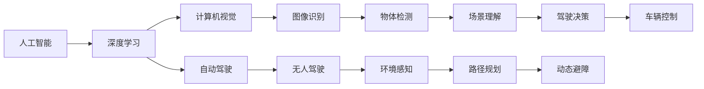

                 

# Andrej Karpathy：人工智能的未来发展机遇

## 1. 背景介绍

Andrej Karpathy，斯坦福大学计算机科学与工程学院教授，人工智能领域领军人物之一。他在深度学习、计算机视觉和自动驾驶等领域有着深入的研究和丰富的教学经验。本文将介绍Andrej Karpathy对人工智能未来发展的深入见解，及其对当前技术趋势的独到分析。

### 1.1 问题由来

当前，人工智能技术正处于快速发展与创新突破的关键时期。从图像识别到自然语言处理，从自动驾驶到智能家居，人工智能正以势不可挡的态势改变着人类社会的方方面面。然而，AI的发展也面临着诸如数据稀缺、模型复杂、计算成本高昂等诸多挑战。面对这些挑战，Andrej Karpathy提出了一系列基于其多年研究与实践的经验见解，为人工智能的未来发展指明了方向。

## 2. 核心概念与联系

### 2.1 核心概念概述

- **人工智能（AI）**：通过模拟人类智能行为，使机器能够执行复杂任务的技术，包括机器学习、深度学习、自然语言处理等。
- **深度学习（Deep Learning）**：一种模拟人脑神经网络工作原理的机器学习方法，通过多层神经网络来提取数据的复杂特征。
- **计算机视觉（CV）**：利用计算机处理图像和视频信息，实现自动化的视觉识别和理解。
- **自动驾驶（AD）**：使车辆能够自主导航、避障和决策的技术，实现无人驾驶。
- **自监督学习（Self-Supervised Learning）**：使用未标注的数据进行预训练，通过学习数据的隐含关系提升模型性能。

### 2.2 核心概念原理和架构的 Mermaid 流程图



这个流程图展示了人工智能各分支领域之间的联系，强调了深度学习在其中的核心作用。

## 3. 核心算法原理 & 具体操作步骤

### 3.1 算法原理概述

Andrej Karpathy强调，人工智能的发展离不开深度学习。深度学习模型通过多层神经网络结构，能够自动提取输入数据的高级特征，从而实现复杂任务的高效处理。

**3.2 算法步骤详解**

Andrej Karpathy提出了一个基于深度学习的AI发展框架，该框架包括预训练、微调、集成与优化四个步骤：

1. **预训练（Pre-training）**：在大规模未标注数据上进行无监督学习，建立通用特征提取器。
2. **微调（Fine-tuning）**：在特定任务上进行有监督学习，优化模型以适应具体需求。
3. **集成（Ensembling）**：通过多个模型的组合使用，提升整体性能和稳定性。
4. **优化（Optimization）**：通过优化算法（如Adam、SGD等）进一步提升模型精度。

**3.3 算法优缺点**

深度学习的优点包括：

- 自动特征提取：无需手动设计特征，能够自动发现数据中的隐含关系。
- 高效处理复杂任务：适用于图像识别、语音识别、自然语言处理等多种任务。
- 端到端学习：模型训练与实际应用可以无缝衔接。

缺点包括：

- 数据依赖：需要大量标注数据进行训练。
- 计算资源消耗高：大规模深度学习模型需要高性能计算设备支持。
- 可解释性不足：深度学习模型如黑盒，难以解释其内部决策过程。

**3.4 算法应用领域**

Andrej Karpathy认为，深度学习在以下几个领域有广泛应用前景：

- **计算机视觉**：图像分类、物体检测、场景理解等任务。
- **自然语言处理**：机器翻译、情感分析、对话生成等任务。
- **自动驾驶**：环境感知、路径规划、驾驶决策等任务。
- **医疗诊断**：病灶识别、病理分析、个性化治疗等任务。

## 4. 数学模型和公式 & 详细讲解 & 举例说明

### 4.1 数学模型构建

深度学习模型的核心是多层神经网络，通常包括输入层、隐藏层和输出层。以卷积神经网络（CNN）为例，其结构如下：

$$
\text{CNN} = \{ \text{Convolutional Layer}, \text{Pooling Layer}, \text{Fully Connected Layer} \}
$$

其中，卷积层通过滤波器提取图像局部特征，池化层对特征进行下采样，全连接层将特征映射到输出空间。

### 4.2 公式推导过程

以CNN的卷积层为例，假设输入图像为$X \in \mathbb{R}^{H \times W \times C}$，卷积核为$W \in \mathbb{R}^{K \times K \times C \times O}$，输出特征图为$Y \in \mathbb{R}^{H' \times W' \times O}$，其中$H', W'$为卷积后的尺寸。卷积操作可以表示为：

$$
Y_{i,j} = \sum_{k=0}^{K-1}\sum_{l=0}^{K-1}\sum_{c=0}^{C-1}X_{i+k,j+l,c} \cdot W_{k,l,c,o}
$$

### 4.3 案例分析与讲解

以图像分类任务为例，Andrej Karpathy介绍了一种基于ResNet的深度学习模型。ResNet使用残差连接（Residual Connection）来解决深度网络训练中的梯度消失问题，从而构建非常深的神经网络。

## 5. 项目实践：代码实例和详细解释说明

### 5.1 开发环境搭建

Andrej Karpathy推荐使用Python语言，并使用深度学习框架TensorFlow或PyTorch进行开发。这些框架提供了丰富的预训练模型和预训练数据集，可以极大简化模型训练过程。

### 5.2 源代码详细实现

以下是一个简单的CNN模型实现示例，使用TensorFlow进行定义和训练：

```python
import tensorflow as tf
from tensorflow.keras import layers, models

# 定义模型
model = models.Sequential()
model.add(layers.Conv2D(32, (3, 3), activation='relu', input_shape=(64, 64, 3)))
model.add(layers.MaxPooling2D((2, 2)))
model.add(layers.Conv2D(64, (3, 3), activation='relu'))
model.add(layers.MaxPooling2D((2, 2)))
model.add(layers.Conv2D(64, (3, 3), activation='relu'))
model.add(layers.Flatten())
model.add(layers.Dense(64, activation='relu'))
model.add(layers.Dense(10, activation='softmax'))

# 编译模型
model.compile(optimizer='adam',
              loss=tf.keras.losses.SparseCategoricalCrossentropy(from_logits=True),
              metrics=['accuracy'])

# 训练模型
model.fit(x_train, y_train, epochs=10, validation_data=(x_test, y_test))
```

### 5.3 代码解读与分析

此示例中，首先定义了一个包含多个卷积层、池化层和全连接层的CNN模型。然后使用TensorFlow编译模型，指定优化器和损失函数。最后，使用`fit`方法进行模型训练。

### 5.4 运行结果展示

在模型训练完成后，可以计算模型在测试集上的准确率：

```python
loss, accuracy = model.evaluate(x_test, y_test)
print('Test accuracy:', accuracy)
```

## 6. 实际应用场景

Andrej Karpathy认为，人工智能技术在未来有广阔的应用前景。以下是几个典型的应用场景：

### 6.1 医疗诊断

深度学习模型可以用于医学影像分析，如肺结节检测、乳腺癌分割等任务。通过大量医疗影像数据进行预训练和微调，模型能够快速准确地识别病变区域。

### 6.2 自动驾驶

自动驾驶技术通过计算机视觉、传感器数据和深度学习模型，实现车辆自主导航和决策。未来自动驾驶将成为交通基础设施的重要组成部分。

### 6.3 智能家居

基于深度学习的智能家居系统可以自动控制家电设备，提升生活便利性和舒适度。例如，智能音箱可以自动理解和响应用户指令，智能门锁可以根据用户行为自动调整安全设置。

### 6.4 未来应用展望

未来，人工智能技术将进一步突破数据限制，降低计算成本，提升模型性能。Andrej Karpathy预测，未来深度学习将与更多的领域进行跨界融合，如与量子计算、生物技术等结合，推动技术革新和产业升级。

## 7. 工具和资源推荐

### 7.1 学习资源推荐

Andrej Karpathy推荐以下学习资源：

- **Deep Learning Specialization**：Coursera上的深度学习专项课程，由Andrej Karpathy主讲。
- **Stanford CS231n**：斯坦福大学计算机视觉课程，提供深度学习在图像处理中的应用实例。
- **AutoML**：Google AI开发的自动机器学习平台，帮助用户更高效地构建深度学习模型。

### 7.2 开发工具推荐

Andrej Karpathy推荐以下开发工具：

- **TensorFlow**：Google开发的深度学习框架，提供了丰富的预训练模型和工具。
- **PyTorch**：Facebook开发的深度学习框架，易于使用，支持动态计算图。
- **JAX**：Google开发的Python科学计算库，支持高效自动微分和分布式计算。

### 7.3 相关论文推荐

Andrej Karpathy推荐以下相关论文：

- **ImageNet Classification with Deep Convolutional Neural Networks**：AlexNet论文，开启了深度学习在图像分类领域的革命。
- **Deep Residual Learning for Image Recognition**：ResNet论文，提出了残差连接，解决了深度网络训练问题。
- **Attention is All You Need**：Transformer论文，引入了自注意力机制，提升了自然语言处理任务的效果。

## 8. 总结：未来发展趋势与挑战

### 8.1 研究成果总结

Andrej Karpathy总结了近年来深度学习在多个领域取得的重大进展，并强调了自监督学习、集成学习等技术在提升模型性能方面的重要性。

### 8.2 未来发展趋势

Andrej Karpathy预测，未来人工智能将朝着以下几个方向发展：

- **无监督学习**：通过自监督学习，利用更多未标注数据进行预训练，提升模型泛化能力。
- **跨界融合**：深度学习与其他领域如生物技术、量子计算等结合，推动更多应用场景的突破。
- **计算效率提升**：开发更加高效的硬件和算法，降低计算资源消耗。
- **人机协作**：实现机器与人的协同工作，提升智能系统的应用价值。

### 8.3 面临的挑战

未来人工智能面临的挑战包括：

- **数据获取**：如何高效获取和标注更多数据，特别是在特定领域。
- **模型可解释性**：深度学习模型如黑盒，难以解释其内部工作机制。
- **计算资源**：大规模深度学习模型需要高性能计算设备支持。
- **伦理与安全**：深度学习模型可能存在偏见、有害信息等问题，需要确保模型公平性、安全性。

### 8.4 研究展望

Andrej Karpathy认为，未来需要在以下几个方向进行深入研究：

- **模型压缩与优化**：降低模型大小，提高计算效率。
- **跨模态学习**：实现视觉、语音、文本等多种模态信息的协同建模。
- **模型公平性**：消除模型中的偏见，提升模型公平性。
- **智能系统人机交互**：研究自然语言生成、情感分析等技术，提升人机交互体验。

总之，人工智能的未来发展机遇与挑战并存。唯有不断创新、突破技术瓶颈，才能推动人工智能技术更好地服务于人类社会。

## 9. 附录：常见问题与解答

### 9.1 常见问题

**Q1: 深度学习模型是否容易过拟合？**

**A:** 是的，深度学习模型通常具有较高的复杂度，容易在训练集上过拟合。可以通过正则化、dropout等技术缓解过拟合问题。

**Q2: 如何评估深度学习模型的性能？**

**A:** 常用评估指标包括准确率、精确率、召回率、F1值等。可以在测试集上计算这些指标来评估模型性能。

**Q3: 如何处理缺失数据？**

**A:** 可以使用插值、均值填补等方法处理缺失数据。对于图像处理任务，可以使用数据增强技术生成更多训练样本。

**Q4: 深度学习模型在实际应用中遇到哪些问题？**

**A:** 深度学习模型在实际应用中遇到的问题包括模型复杂度高、计算成本高、可解释性不足等。需要结合具体应用场景进行优化和改进。

**Q5: 如何提升深度学习模型的泛化能力？**

**A:** 可以通过增加数据量、改进模型结构、引入正则化技术等方法提升深度学习模型的泛化能力。

**Q6: 深度学习模型如何实现高效计算？**

**A:** 可以使用分布式计算、模型压缩、混合精度训练等技术实现深度学习模型的高效计算。

**Q7: 如何设计深度学习模型的输入和输出？**

**A:** 需要根据具体任务设计输入和输出格式，如将图像输入转换为张量，将输出转换为概率分布等。

通过以上常见问题的解答，可以看出深度学习技术在实际应用中仍需不断优化和改进。Andrej Karpathy提出的未来发展方向和挑战分析，为人工智能技术的未来发展提供了宝贵的指导和思路。

---

作者：禅与计算机程序设计艺术 / Zen and the Art of Computer Programming

