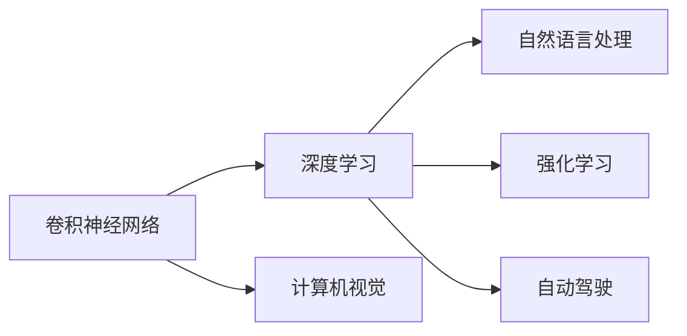

                 

# Andrej Karpathy：人工智能的未来发展机遇

> 关键词：深度学习,卷积神经网络,计算机视觉,自然语言处理,强化学习

## 1. 背景介绍

### 1.1 问题由来

Andrej Karpathy是计算机视觉和深度学习领域的领军人物，以其在卷积神经网络(CNN)、强化学习(Reinforcement Learning)和自动驾驶(Autonomous Driving)等方向的研究而闻名。本文将通过梳理Andrej Karpathy近年来的工作，探讨人工智能(AI)技术未来的发展机遇。

## 2. 核心概念与联系

### 2.1 核心概念概述

为了更好地理解Andrej Karpathy的研究，本文首先概述几个核心概念及其相互联系：

- **深度学习**：一种基于神经网络的学习方法，通过多层次的特征提取和抽象，可以实现复杂的任务。
- **卷积神经网络**：一种特殊的神经网络结构，广泛应用于图像识别、物体检测、人脸识别等计算机视觉任务。
- **计算机视觉**：研究如何使计算机能够理解并解释图像、视频等视觉数据的技术。
- **自然语言处理**：研究如何让计算机能够理解、处理和生成自然语言的技术。
- **强化学习**：一种学习方式，通过与环境的交互，使智能体最大化长期奖励。
- **自动驾驶**：一种利用计算机视觉和深度学习技术，使汽车实现自主驾驶的技术。

这些核心概念通过深度学习这一共同的框架相互联系，共同构成了Andrej Karpathy的研究基石。

### 2.2 核心概念原理和架构的 Mermaid 流程图



这个流程图展示了深度学习如何通过卷积神经网络、计算机视觉、自然语言处理、强化学习和自动驾驶等方向的应用，拓展了AI技术的边界。

## 3. 核心算法原理 & 具体操作步骤

### 3.1 算法原理概述

Andrej Karpathy的研究涵盖了深度学习在计算机视觉、自然语言处理和强化学习等多个领域的算法原理和操作步骤。以下将简要介绍其中几个关键算法：

- **卷积神经网络**：通过卷积操作提取图像特征，并通过池化操作降低特征维度，最终通过全连接层进行分类或回归。

- **Transformer模型**：用于自然语言处理任务的自注意力机制，通过多头自注意力和残差连接，实现高效的语言表示学习。

- **强化学习中的深度Q网络(DQN)**：通过Q值函数的深度神经网络，学习与环境交互的最优策略。

- **自动驾驶中的多任务学习**：通过同时训练多个相关任务，实现车辆控制、环境感知和路径规划等能力的协同提升。

### 3.2 算法步骤详解

以卷积神经网络为例，其核心步骤包括：

1. **数据预处理**：对图像数据进行归一化、缩放、旋转等预处理操作。
2. **卷积层**：通过卷积核对输入图像进行特征提取。
3. **池化层**：对卷积层输出进行下采样，减小特征维度。
4. **全连接层**：将池化层的输出进行全连接，进行分类或回归。
5. **反向传播**：通过梯度下降算法更新网络参数，最小化损失函数。

Transformer模型则主要包含：

1. **输入嵌入层**：将输入序列转换为模型可处理的向量表示。
2. **多头自注意力层**：通过多头注意力机制，学习序列间的依赖关系。
3. **前馈神经网络层**：对多头自注意力层的输出进行非线性变换。
4. **输出层**：将最终输出转换为所需的预测结果。

DQN算法主要包括以下步骤：

1. **状态观察**：观察当前环境状态。
2. **动作选择**：根据Q值函数选择动作。
3. **环境交互**：执行选择动作，观察新状态和奖励。
4. **Q值更新**：根据新状态和奖励更新Q值函数。
5. **目标网络更新**：定期将当前网络的参数复制到目标网络，避免过拟合。

多任务学习则在训练过程中同时优化多个任务的目标函数，通过共享网络参数，提升不同任务的表现。

### 3.3 算法优缺点

- **卷积神经网络**：优点在于能够高效处理图像数据，缺点是对复杂结构的建模能力较弱。
- **Transformer模型**：优点在于能够处理长序列数据，缺点是计算复杂度较高，需要较大的计算资源。
- **DQN算法**：优点在于能够自适应复杂环境，缺点是训练过程不稳定，容易陷入局部最优。
- **多任务学习**：优点在于能够提升多个任务的表现，缺点是需要更多的计算资源和数据。

### 3.4 算法应用领域

Andrej Karpathy的研究在以下几个领域得到了广泛应用：

- **计算机视觉**：通过卷积神经网络，实现了图像分类、目标检测、人脸识别等任务。
- **自然语言处理**：通过Transformer模型，实现了机器翻译、文本生成、对话系统等任务。
- **强化学习**：通过DQN算法，实现了自动驾驶、游戏AI等任务。
- **自动驾驶**：通过多任务学习，实现了车辆控制、环境感知和路径规划等能力的协同提升。

## 4. 数学模型和公式 & 详细讲解 & 举例说明

### 4.1 数学模型构建

以卷积神经网络为例，其数学模型可以表示为：

$$
f(x; \theta) = \sigma(W(x; \theta) + b)
$$

其中，$x$为输入数据，$\theta$为模型参数，$W$为卷积操作，$b$为偏置项，$\sigma$为激活函数。

### 4.2 公式推导过程

卷积神经网络的推导过程包括：

1. **卷积操作**：通过卷积核$k$对输入图像$x$进行特征提取，得到卷积层输出$y$。
2. **池化操作**：通过最大池化或平均池化，减小特征维度。
3. **全连接层**：将池化层输出进行全连接，得到分类或回归结果。

### 4.3 案例分析与讲解

以图像分类任务为例，假设输入图像$x$的大小为$n\times n$，卷积核$k$的大小为$m\times m$，步长为$s$，则卷积操作的输出大小为$\frac{n-m+2p}{s}+1$，其中$p$为填充像素数。通过多次卷积和池化，最终得到一个大小为$1\times 1$的特征图。

## 5. 项目实践：代码实例和详细解释说明

### 5.1 开发环境搭建

Andrej Karpathy的研究主要使用PyTorch框架进行实现。以下是搭建PyTorch开发环境的详细步骤：

1. 安装Anaconda：从官网下载并安装Anaconda，用于创建独立的Python环境。
2. 创建并激活虚拟环境：
```bash
conda create -n pytorch-env python=3.8 
conda activate pytorch-env
```

3. 安装PyTorch：根据CUDA版本，从官网获取对应的安装命令。例如：
```bash
conda install pytorch torchvision torchaudio cudatoolkit=11.1 -c pytorch -c conda-forge
```

4. 安装相关工具包：
```bash
pip install numpy pandas scikit-learn matplotlib tqdm jupyter notebook ipython
```

### 5.2 源代码详细实现

以卷积神经网络为例，以下是PyTorch代码实现：

```python
import torch
import torch.nn as nn
import torchvision.transforms as transforms

# 定义卷积神经网络模型
class CNNModel(nn.Module):
    def __init__(self):
        super(CNNModel, self).__init__()
        self.conv1 = nn.Conv2d(3, 64, kernel_size=3, stride=1, padding=1)
        self.pool1 = nn.MaxPool2d(kernel_size=2, stride=2)
        self.conv2 = nn.Conv2d(64, 128, kernel_size=3, stride=1, padding=1)
        self.pool2 = nn.MaxPool2d(kernel_size=2, stride=2)
        self.fc1 = nn.Linear(128*4*4, 256)
        self.fc2 = nn.Linear(256, 10)
    
    def forward(self, x):
        x = self.pool1(torch.relu(self.conv1(x)))
        x = self.pool2(torch.relu(self.conv2(x)))
        x = x.view(-1, 128*4*4)
        x = torch.relu(self.fc1(x))
        x = self.fc2(x)
        return x

# 加载数据集并进行预处理
transform = transforms.Compose([
    transforms.ToTensor(),
    transforms.Normalize(mean=[0.5, 0.5, 0.5], std=[0.5, 0.5, 0.5])
])

trainset = torchvision.datasets.CIFAR10(root='./data', train=True, download=True, transform=transform)
trainloader = torch.utils.data.DataLoader(trainset, batch_size=64, shuffle=True, num_workers=2)

testset = torchvision.datasets.CIFAR10(root='./data', train=False, download=True, transform=transform)
testloader = torch.utils.data.DataLoader(testset, batch_size=64, shuffle=False, num_workers=2)

# 定义模型和优化器
model = CNNModel()
criterion = nn.CrossEntropyLoss()
optimizer = torch.optim.Adam(model.parameters(), lr=0.001)

# 训练模型
for epoch in range(10):
    running_loss = 0.0
    for i, data in enumerate(trainloader, 0):
        inputs, labels = data
        optimizer.zero_grad()
        outputs = model(inputs)
        loss = criterion(outputs, labels)
        loss.backward()
        optimizer.step()
        running_loss += loss.item()
        if i % 100 == 99:
            print('[%d, %5d] loss: %.3f' % (epoch + 1, i + 1, running_loss / 100))
            running_loss = 0.0

# 测试模型
correct = 0
total = 0
with torch.no_grad():
    for data in testloader:
        images, labels = data
        outputs = model(images)
        _, predicted = torch.max(outputs.data, 1)
        total += labels.size(0)
        correct += (predicted == labels).sum().item()

print('Accuracy of the network on the 10000 test images: %d %%' % (100 * correct / total))
```

### 5.3 代码解读与分析

以下是代码中几个关键部分的详细解读：

- **定义模型**：通过继承`nn.Module`类，定义了卷积神经网络模型。
- **数据预处理**：使用`transforms`模块对数据进行归一化和转换操作。
- **训练模型**：通过循环迭代训练集，计算损失并更新模型参数。
- **测试模型**：在测试集上计算模型准确率，评估模型性能。

## 6. 实际应用场景

Andrej Karpathy的研究在多个实际应用场景中得到了广泛应用。

### 6.1 计算机视觉

卷积神经网络在计算机视觉领域的应用极为广泛，例如图像分类、目标检测和人脸识别等任务。Andrej Karpathy的研究推动了这些技术的进一步发展。

### 6.2 自然语言处理

Transformer模型在自然语言处理领域取得了突破性进展，广泛应用于机器翻译、文本生成和对话系统等任务。

### 6.3 强化学习

DQN算法在自动驾驶、游戏AI等领域得到了广泛应用，通过与环境的交互，实现智能决策。

### 6.4 自动驾驶

多任务学习在自动驾驶中得到了应用，通过同时优化车辆控制、环境感知和路径规划等任务，提升了驾驶安全性。

## 7. 工具和资源推荐

### 7.1 学习资源推荐

为了帮助开发者系统掌握Andrej Karpathy的研究，这里推荐一些优质的学习资源：

1. 《深度学习》：Ian Goodfellow所著的深度学习经典教材，系统介绍了深度学习的理论基础和算法原理。
2. 《计算机视觉：模型、学习和推理》：Andrej Karpathy所著的计算机视觉入门教材，介绍了计算机视觉的基本概念和常用算法。
3. 《强化学习：算法、复杂性和最优化》：Richard S. Sutton和Andrew G. Barto的经典著作，介绍了强化学习的理论基础和应用。
4. 《动手学深度学习》：李沐等人所著的深度学习教材，提供了丰富的代码实现和实例。

### 7.2 开发工具推荐

以下是几款用于Andrej Karpathy研究开发的常用工具：

1. PyTorch：基于Python的开源深度学习框架，支持动态计算图和高效加速，适合研究和应用开发。
2. TensorFlow：由Google主导开发的开源深度学习框架，生产部署方便，支持分布式计算和GPU加速。
3. Keras：基于TensorFlow的高层API，提供了简洁的模型构建接口，适合快速原型开发。
4. OpenAI Gym：用于强化学习的标准环境库，包含各种游戏和模拟环境，方便测试和调试。

### 7.3 相关论文推荐

Andrej Karpathy的研究涉及多个前沿领域，以下是几篇奠基性的相关论文：

1. Visualizing and Understanding Convolutional Networks（CVPR 2014）：介绍了卷积神经网络的可视化和理解方法。
2. Deep Residual Learning for Image Recognition（ICML 2015）：提出了深度残差网络，显著提升了图像分类精度。
3. Image Captioning with Visual Attention（NIPS 2015）：提出了基于视觉注意机制的图像描述生成方法。
4. Learning to Drive（NIPS 2016）：介绍了自动驾驶中的多任务学习和联合训练方法。

这些论文代表了Andrej Karpathy在深度学习领域的研究成果，对未来的技术发展具有重要意义。

## 8. 总结：未来发展趋势与挑战

### 8.1 研究成果总结

Andrej Karpathy的研究推动了深度学习在计算机视觉、自然语言处理和强化学习等领域的发展，取得了诸多突破性成果。

### 8.2 未来发展趋势

未来，深度学习技术将在以下几个方向继续发展：

1. **多模态学习**：融合视觉、听觉和文本等多种模态信息，提升智能系统的综合能力。
2. **自监督学习**：通过无标签数据进行预训练，减少对标注数据的依赖，提升模型的泛化能力。
3. **迁移学习**：将已有知识迁移到新任务上，提升模型的迁移能力和泛化性能。
4. **联邦学习**：通过分布式协作训练，保护数据隐私和模型安全。
5. **可解释性**：通过解释性技术，提升模型的透明性和可理解性。

### 8.3 面临的挑战

尽管深度学习技术取得了巨大进展，但仍面临以下挑战：

1. **数据质量**：高质量的数据集是深度学习模型的基础，但获取和标注数据的成本较高。
2. **模型复杂性**：深度模型往往具有高复杂度，难以理解和调试。
3. **计算资源**：大规模深度学习模型的训练和推理需要高性能计算资源。
4. **可解释性**：深度学习模型的决策过程缺乏可解释性，难以满足高风险领域的要求。
5. **安全性**：深度学习模型容易受到对抗样本的攻击，需要设计鲁棒模型。

### 8.4 研究展望

未来，深度学习技术需要在以下几个方面进行改进：

1. **数据增强**：通过数据增强技术，提升模型对数据分布变化的鲁棒性。
2. **模型简化**：通过模型简化和压缩技术，提升模型的计算效率和可解释性。
3. **联邦学习**：通过联邦学习技术，实现分布式数据和模型训练。
4. **可解释性**：通过解释性技术，提升模型的透明性和可理解性。
5. **安全性**：通过设计鲁棒模型和对抗样本防御技术，提升模型的安全性。

## 9. 附录：常见问题与解答

**Q1：深度学习模型为什么会过拟合？**

A: 深度学习模型过拟合的主要原因是模型复杂度较高，容易在训练数据上记忆噪声和细节。解决过拟合的方法包括：

1. **数据增强**：通过对数据进行旋转、裁剪、缩放等操作，增加数据多样性。
2. **正则化**：通过L1、L2正则化、Dropout等技术，约束模型复杂度。
3. **早停策略**：在验证集上监测模型性能，提前停止训练。

**Q2：如何提升深度学习模型的泛化能力？**

A: 提升深度学习模型泛化能力的方法包括：

1. **数据增强**：通过数据增强技术，增加数据多样性。
2. **迁移学习**：通过迁移学习，利用已有知识提升模型在新任务上的表现。
3. **自监督学习**：通过无标签数据进行预训练，减少对标注数据的依赖。
4. **模型简化**：通过模型简化和压缩技术，降低模型复杂度。

**Q3：深度学习模型如何进行迁移学习？**

A: 深度学习模型进行迁移学习的方法包括：

1. **微调**：在已有模型的基础上，针对新任务进行微调，增加少量新层。
2. **预训练**：在新任务上预训练模型，利用已有知识提升模型表现。
3. **特征抽取**：将预训练模型的特征提取部分用于新任务，减少训练时间。

**Q4：深度学习模型如何进行自监督学习？**

A: 深度学习模型进行自监督学习的方法包括：

1. **数据生成**：通过数据生成技术，增加无标签数据。
2. **自编码器**：通过自编码器技术，学习数据的内在表示。
3. **对比学习**：通过对比学习技术，学习数据之间的关系。

这些技术可以显著提升深度学习模型的泛化能力和迁移学习能力，提升其在实际应用中的表现。

---

作者：禅与计算机程序设计艺术 / Zen and the Art of Computer Programming

