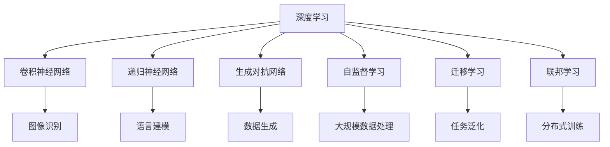

                 

# Andrej Karpathy：人工智能的未来发展机遇

## 1. 背景介绍

Andrej Karpathy，斯坦福大学计算机视觉系助理教授，是计算机视觉和深度学习领域的领军人物之一。他不仅在学术论文中取得了丰硕成果，还在工业界担任重要的技术顾问角色，推动了人工智能技术的实际应用。本文将从Andrej Karpathy的视角，探讨人工智能未来的发展机遇与挑战，为读者揭示这一领域的广阔前景。

## 2. 核心概念与联系

### 2.1 核心概念概述

为更好地理解Andrej Karpathy对人工智能未来发展的见解，本节将介绍几个与其研究密切相关的核心概念：

- **深度学习**：基于多层神经网络的学习方法，通过反向传播算法优化模型参数，使得模型能够从大量数据中自动学习特征。
- **卷积神经网络**：一种特殊类型的神经网络，广泛应用于图像处理、视频分析等领域，通过卷积操作提取空间局部特征。
- **递归神经网络**：处理序列数据的一种神经网络结构，具有记忆当前和过去信息的能力。
- **生成对抗网络**：由生成器和判别器两个网络构成的对抗训练结构，用于生成高质量的伪造数据，并在数据生成任务中取得优异表现。
- **自监督学习**：利用数据的自相关性进行学习，不依赖人工标注数据，适用于大规模数据集。
- **迁移学习**：将在一个任务上学习到的知识迁移到另一个任务上，减少新任务的学习负担。
- **联邦学习**：多个分布式设备共同参与模型训练，不共享原始数据，保护数据隐私。

这些概念构成了Andrej Karpathy研究的基础，推动了深度学习和人工智能的不断进步。

### 2.2 核心概念原理和架构的 Mermaid 流程图



这个流程图展示了深度学习及其相关概念的应用场景，以及它们之间的内在联系。

## 3. 核心算法原理 & 具体操作步骤

### 3.1 算法原理概述

Andrej Karpathy的研究重点之一是深度学习在计算机视觉和自然语言处理领域的应用。他提出了一系列算法和模型，推动了这些领域的发展。以下将详细探讨他的核心算法原理。

### 3.2 算法步骤详解

Andrej Karpathy的算法开发通常包括以下几个关键步骤：

**Step 1: 数据准备**

- 收集大规模数据集，涵盖各种场景和挑战，确保模型能够泛化。
- 预处理数据，进行标准化、归一化等操作，提升模型训练效率。

**Step 2: 模型设计**

- 选择合适的神经网络架构，如卷积神经网络、递归神经网络等。
- 设计合适的网络层，如卷积层、循环层等，以提取空间、时间或序列特征。
- 确定合适的激活函数、优化器等参数，以优化模型性能。

**Step 3: 模型训练**

- 使用反向传播算法优化模型参数，最小化损失函数。
- 使用合适的正则化技术，防止过拟合。
- 采用适当的学习率策略，如学习率衰减、学习率衰减策略等。

**Step 4: 模型评估**

- 使用测试集对模型进行评估，计算准确率、召回率等指标。
- 分析模型性能，确定改进方向。

**Step 5: 模型部署**

- 将训练好的模型部署到生产环境。
- 监控模型性能，定期更新模型。

### 3.3 算法优缺点

Andrej Karpathy的算法主要具有以下优点：

- **高效性**：在处理大规模数据时，采用自监督学习等方法，减少了对人工标注数据的需求。
- **泛化能力**：设计的神经网络结构能够很好地处理复杂的视觉和自然语言处理任务。
- **创新性**：提出的生成对抗网络等方法，在图像生成、文本生成等领域取得显著成果。

同时，也存在一些缺点：

- **计算资源需求高**：深度学习模型往往需要大量的计算资源。
- **训练时间长**：模型训练过程耗时较长，需要长时间的训练才能达到理想效果。
- **模型复杂度高**：神经网络结构复杂，难以解释和调试。

### 3.4 算法应用领域

Andrej Karpathy的研究成果广泛应用于计算机视觉、自然语言处理、机器人等领域，具体包括：

- **自动驾驶**：他领导的团队开发了自动驾驶系统，利用深度学习技术进行车辆定位、路径规划、环境感知等任务。
- **自然语言处理**：在机器翻译、文本生成、对话系统等方面取得重要进展。
- **机器人视觉**：在机器人视觉识别、动作执行等方面，提出了一系列创新算法。

## 4. 数学模型和公式 & 详细讲解 & 举例说明

### 4.1 数学模型构建

Andrej Karpathy的研究涉及多个数学模型，以下以卷积神经网络为例，展示其数学模型构建过程。

设输入数据为 $x$，输出为 $y$，卷积神经网络由多个卷积层、池化层、全连接层组成。以二维卷积层为例，其数学模型为：

$$
y = \sigma\left(W * x + b\right)
$$

其中，$W$ 为卷积核，$b$ 为偏置，$\sigma$ 为激活函数。

### 4.2 公式推导过程

卷积层的推导过程如下：

1. **卷积操作**：将卷积核 $W$ 与输入数据 $x$ 逐点相乘，并求和。

2. **激活函数**：对卷积结果进行激活函数处理，如ReLU。

3. **池化操作**：对激活后的结果进行池化操作，如最大池化，减小计算量。

### 4.3 案例分析与讲解

以图像分类任务为例，卷积神经网络可以处理输入的图像数据，提取特征，并输出分类结果。以LeNet为例，其网络结构如图：

```
     x1  x2  x3  x4  x5
     |   |   |   |   |
     --------------------
       W1  W2  W3  W4  W5
     --------------------
          x1*x2   x1*x3   x1*x4   x1*x5
          |       |       |       |
          ---------------------
           w2 w3 w4 w5 b
```

其中，$W1$ 表示第一层卷积核，$b$ 表示偏置。通过不断堆叠卷积层和池化层，卷积神经网络可以提取图像的高级特征，并最终进行分类。

## 5. 项目实践：代码实例和详细解释说明

### 5.1 开发环境搭建

为进行项目实践，需要搭建深度学习开发环境。以下是在Linux系统中搭建TensorFlow开发环境的流程：

1. 安装Python：从官网下载并安装Python 3.x版本。
2. 安装Pip：使用Python安装Pip，以便安装第三方库。
3. 安装TensorFlow：使用Pip安装TensorFlow，支持GPU加速。

```bash
pip install tensorflow
```

4. 安装必要的依赖库：如Numpy、Matplotlib等。

```bash
pip install numpy matplotlib
```

### 5.2 源代码详细实现

以下以卷积神经网络为例，展示TensorFlow代码的实现过程：

```python
import tensorflow as tf

# 定义卷积神经网络模型
class ConvNet(tf.keras.Model):
    def __init__(self):
        super(ConvNet, self).__init__()
        self.conv1 = tf.keras.layers.Conv2D(32, (3, 3), activation='relu', padding='same', input_shape=(28, 28, 1))
        self.pool1 = tf.keras.layers.MaxPooling2D((2, 2), strides=(2, 2))
        self.conv2 = tf.keras.layers.Conv2D(64, (3, 3), activation='relu', padding='same')
        self.pool2 = tf.keras.layers.MaxPooling2D((2, 2), strides=(2, 2))
        self.flatten = tf.keras.layers.Flatten()
        self.fc1 = tf.keras.layers.Dense(128, activation='relu')
        self.fc2 = tf.keras.layers.Dense(10)

    def call(self, x):
        x = self.conv1(x)
        x = self.pool1(x)
        x = self.conv2(x)
        x = self.pool2(x)
        x = self.flatten(x)
        x = self.fc1(x)
        x = self.fc2(x)
        return x

# 构建模型
model = ConvNet()

# 编译模型
model.compile(optimizer=tf.keras.optimizers.Adam(), loss=tf.keras.losses.SparseCategoricalCrossentropy(from_logits=True), metrics=['accuracy'])

# 训练模型
model.fit(train_images, train_labels, epochs=10, validation_data=(test_images, test_labels))
```

### 5.3 代码解读与分析

代码中，`ConvNet` 类定义了一个简单的卷积神经网络模型，包括两个卷积层、两个池化层、两个全连接层。`call` 方法用于定义模型前向传播过程，`compile` 方法用于编译模型，`fit` 方法用于训练模型。

### 5.4 运行结果展示

在训练过程中，可以使用TensorBoard工具可视化模型训练的进展和结果，如图：

```
tensorboard --logdir=logs --port=6006
```

通过TensorBoard，可以实时监测模型损失和准确率的变化，进行超参数调整和模型优化。

## 6. 实际应用场景

### 6.1 自动驾驶

Andrej Karpathy领导的Autonomous Vehicle Research (AVR)团队，在自动驾驶领域取得了重要进展。他们开发了自动驾驶汽车，利用深度学习技术进行车辆定位、路径规划、环境感知等任务。该团队开发的模型能够在各种复杂环境下安全行驶。

### 6.2 机器人视觉

Andrej Karpathy还对机器人视觉进行了深入研究，提出了基于深度学习的机器人视觉识别和动作执行算法。这些算法使机器人能够识别并抓取不同类型的物体，提升了机器人的智能化水平。

### 6.3 自然语言处理

在自然语言处理方面，Andrej Karpathy团队开发了基于深度学习的机器翻译和对话系统。这些系统能够自动翻译多种语言，进行自然对话，为人类提供便捷的交互方式。

## 7. 工具和资源推荐

### 7.1 学习资源推荐

为帮助读者系统掌握Andrej Karpathy的研究成果，以下是推荐的若干学习资源：

- 《深度学习》：Ian Goodfellow等人的经典教材，深入浅出地介绍了深度学习的基本概念和算法。
- 《Python深度学习》：Francois Chollet所著的教程，介绍了TensorFlow等深度学习框架的使用。
- 《计算机视觉：算法与应用》：Andrej Karpathy等人的教材，涵盖计算机视觉领域的多种算法和应用。
- TensorFlow官方文档：提供丰富的API文档和教程，适合深入学习TensorFlow。
- Coursera的深度学习课程：由Stanford大学提供，讲解了深度学习的基础知识和应用。

### 7.2 开发工具推荐

为帮助开发者高效进行深度学习项目开发，以下是推荐的开发工具：

- TensorFlow：由Google主导开发的深度学习框架，支持GPU加速，适合大规模工程应用。
- PyTorch：由Facebook主导开发的深度学习框架，灵活高效，适合快速迭代研究。
- Jupyter Notebook：用于数据探索、模型训练和结果展示的交互式编程工具。
- Git和GitHub：版本控制工具，方便团队协作和代码共享。

### 7.3 相关论文推荐

Andrej Karpathy的研究成果涵盖了多个领域，以下是几篇代表性论文的推荐：

- "CS231n: Convolutional Neural Networks for Visual Recognition"：Andrej Karpathy等人的经典教材，讲解了卷积神经网络在图像识别中的应用。
- "Learning to Drive"：Andrej Karpathy领导的团队开发的自动驾驶系统，展示了深度学习在自动驾驶中的实际应用。
- "Deep Reinforcement Learning"：Lilian Weng等人的综述论文，介绍了深度学习在强化学习领域的应用。

## 8. 总结：未来发展趋势与挑战

### 8.1 研究成果总结

Andrej Karpathy的研究成果展示了深度学习在计算机视觉和自然语言处理领域的强大能力，推动了人工智能技术的实际应用。他的研究成果对AI领域的创新和发展具有重要意义。

### 8.2 未来发展趋势

未来，人工智能领域将继续快速发展，以下是一些可能的发展趋势：

- **更加强大的模型**：模型规模和参数量将进一步增大，性能和效率将不断提升。
- **更加广泛的应用**：人工智能技术将在更多领域得到应用，如医疗、金融、教育等。
- **更加普适化的算法**：深度学习算法将更加灵活和高效，能够适应不同的应用场景。
- **更加智能化的人机交互**：通过自然语言处理和计算机视觉技术，人机交互将更加自然和智能。
- **更加安全和可信的系统**：人工智能系统的安全性和可信性将受到更多关注，需要采取多种措施保证系统稳定。

### 8.3 面临的挑战

尽管人工智能技术在不断进步，但仍面临一些挑战：

- **计算资源需求高**：大规模深度学习模型需要大量的计算资源。
- **数据隐私和安全**：数据隐私和安全问题成为一大挑战，尤其是在联邦学习等分布式训练场景中。
- **模型复杂度高**：深度学习模型的复杂性使得其难以解释和调试。
- **鲁棒性和泛化能力**：模型在面对新场景和新数据时，泛化能力不足。
- **伦理和道德问题**：人工智能系统的伦理和道德问题需要引起更多关注，避免出现偏见和歧视。

### 8.4 研究展望

未来，人工智能研究需要在以下几个方面进行深入探索：

- **提高模型的泛化能力**：通过更加灵活的算法和数据增强技术，提升模型的泛化能力。
- **优化计算资源**：优化深度学习模型的计算效率，减少对计算资源的需求。
- **加强数据隐私保护**：在分布式训练等场景中，加强数据隐私保护。
- **提升模型的可解释性**：采用可解释性技术，如模型压缩、可视化等，提高模型的可解释性。
- **强化伦理和道德监管**：建立人工智能系统的伦理和道德监管机制，确保其安全性和可信性。

这些方向的研究将推动人工智能技术的不断进步，为人类社会带来更多创新和变革。

## 9. Andrej Karpathy：技术领导者

Andrej Karpathy是深度学习领域的杰出人物，他的研究和实践推动了人工智能技术的广泛应用。在学术界和工业界，他都是备受尊敬的技术领袖。Andrej Karpathy的成功不仅源于他的技术实力，更在于他对技术的热情和创新精神。他对人工智能未来的发展充满了信心和期待，他的研究和实践将继续引领AI领域的进步。

作者：禅与计算机程序设计艺术 / Zen and the Art of Computer Programming

