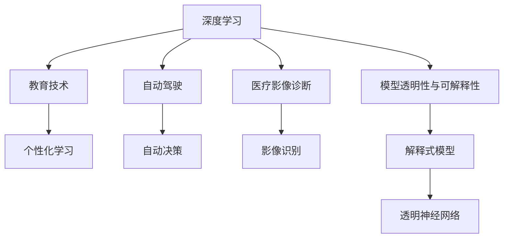

                 

## 1. 背景介绍

### 1.1 问题由来
Andrej Karpathy，作为深度学习领域的翘楚，以其在计算机视觉和自动驾驶领域的杰出贡献闻名于世。他的工作不仅推动了人工智能技术的前沿探索，还为行业实践带来了深远的影响。本文将探讨Andrej Karpathy在人工智能未来发展机遇方面的见解，分析其提出的关键技术路径和潜在应用场景。

### 1.2 问题核心关键点
Karpathy的观点主要集中在以下几个核心关键点：

1. **模型可解释性**：探讨深度学习模型的透明性和可解释性，如何在模型复杂化同时保持可理解性。
2. **跨领域应用**：讨论如何将AI技术应用于多个领域，如自动驾驶、医疗诊断、教育等。
3. **可持续性**：考虑AI技术的长期发展，如何平衡创新与资源环境。
4. **伦理与社会影响**：评估AI技术带来的伦理和社会影响，如何在推动技术进步的同时确保公平和公正。

这些关键点构成了Andrej Karpathy对人工智能未来发展的全面视角，有助于我们深入理解AI技术的未来趋势和应用前景。

### 1.3 问题研究意义
理解Andrej Karpathy的见解，对人工智能研究人员、从业者和决策者都具有重要意义：

- **指导未来研究**：为AI技术的发展方向提供理论支持和实践指导。
- **推动产业应用**：助力AI技术在各个行业的应用落地，提升社会生产力。
- **保障伦理安全**：在AI技术发展过程中，确保技术应用的公平性和安全性。

## 2. 核心概念与联系

### 2.1 核心概念概述

为更好地理解Andrej Karpathy的观点，我们首先介绍几个核心概念：

1. **深度学习**：基于多层神经网络结构的机器学习技术，通过反向传播算法优化模型参数，实现对数据的高级抽象和推理。
2. **自动驾驶**：通过AI技术实现车辆自主导航和决策的系统，旨在提高行车安全性和效率。
3. **医疗影像诊断**：利用AI技术对医学影像进行自动识别和分析，辅助医生进行诊断和治疗。
4. **教育技术**：借助AI技术进行个性化学习推荐、智能答疑等，提升教育质量和效率。
5. **模型透明性与可解释性**：确保AI模型的决策过程可被理解和解释，提高模型的可信度和可靠性。

### 2.2 核心概念原理和架构的 Mermaid 流程图



这个流程图展示了深度学习在多个领域的交叉应用，以及模型透明性与可解释性的重要性和必要性。

## 3. 核心算法原理 & 具体操作步骤

### 3.1 算法原理概述
Andrej Karpathy在其工作中强调了深度学习模型的透明性和可解释性。他认为，随着模型复杂度的增加，模型决策过程变得更加难以理解和解释。因此，如何在复杂模型中保持一定的可解释性，成为未来AI技术发展的关键。

### 3.2 算法步骤详解
Karpathy提出了几种方法来实现模型的透明性和可解释性：

1. **可视化技术**：使用可视化工具如梯度热图、注意力图等，展示模型内部的激活和权重分布，帮助理解模型的决策逻辑。
2. **可解释性模型**：开发专门的模型架构，如LIME、SHAP等，用于提供模型预测的局部可解释性。
3. **解释式神经网络**：设计新的神经网络结构，如GNN（图神经网络），通过明确的层间结构展示模型推理过程。

### 3.3 算法优缺点
深度学习模型的透明性和可解释性虽然能帮助理解模型决策，但也存在以下缺点：

1. **计算复杂度高**：可视化技术和可解释性模型通常需要额外的计算资源和时间，可能影响模型训练和推理的效率。
2. **解释能力有限**：一些复杂的决策过程可能难以通过可视化或可解释性模型完全揭示，存在一定的局限性。
3. **模型维护困难**：随着模型规模和复杂度的增加，维护透明性和可解释性变得更加复杂和耗时。

### 3.4 算法应用领域
透明性和可解释性技术可以应用于多个领域，如：

1. **医疗诊断**：帮助医生理解AI诊断工具的决策依据，提升诊断准确性和可信度。
2. **自动驾驶**：确保自动驾驶系统的决策过程透明，便于事故调查和维护。
3. **金融风控**：提供贷款申请、投资建议等决策的透明度，增强客户信任。
4. **教育评估**：展示AI个性化学习系统的推荐和评估依据，帮助教师和学生理解学习过程。

## 4. 数学模型和公式 & 详细讲解 & 举例说明

### 4.1 数学模型构建
Karpathy认为，构建透明和可解释的深度学习模型需要综合考虑多个因素：

1. **模型架构设计**：采用模块化、层次化的网络结构，便于理解模型内部的信息流动。
2. **损失函数设计**：选择合适的损失函数，使得模型能够对输入数据进行有效的表示和推理。
3. **数据增强**：使用数据增强技术，扩充训练数据的多样性，减少模型过拟合。

### 4.2 公式推导过程
以LIME模型为例，其基本思想是通过局部拟合的方式，为每个样本生成一个可解释的模型。假设原模型为$f$，LIME模型为$g$，则有：

$$ g(x) = f(x) + \epsilon(x) $$

其中，$\epsilon(x)$为噪声项，$x$为样本输入。LIME模型通过最小化噪声项$\epsilon(x)$，使得$g(x)$在$x$点附近与$f(x)$的行为一致。

### 4.3 案例分析与讲解
在医疗影像诊断中，Karpathy团队使用深度学习模型对乳腺癌图像进行分类。他们设计了一个可视化的注意力机制，展示模型在图像中关注的区域和特征。这不仅帮助医生理解模型的决策依据，还提升了诊断的准确性。

## 5. 项目实践：代码实例和详细解释说明

### 5.1 开发环境搭建

为实现Karpathy的透明性和可解释性研究，开发者需要搭建适合深度学习研究的开发环境。以下是一个基本的Python开发环境配置步骤：

1. **安装Anaconda**：从官网下载并安装Anaconda，用于创建独立的Python环境。
2. **创建虚拟环境**：
```bash
conda create -n myenv python=3.8 
conda activate myenv
```

3. **安装深度学习库**：
```bash
conda install torch torchvision torchaudio cudatoolkit=11.1 -c pytorch -c conda-forge
pip install numpy scipy matplotlib scikit-learn
```

4. **安装可视化工具**：
```bash
pip install matplotlib seaborn
```

### 5.2 源代码详细实现

以下是一个使用LIME进行可解释性分析的Python代码示例：

```python
from sklearn.metrics import confusion_matrix
from lime.lime_tabular import LimeTabularExplainer
from lime.lime_tabular import lime__tabular_plot
import numpy as np
import pandas as pd
from sklearn.linear_model import LogisticRegression

# 加载数据集
data = pd.read_csv('data.csv')

# 分割训练集和测试集
X_train, y_train = data.iloc[:800, :-1], data.iloc[:800, -1]
X_test, y_test = data.iloc[800:, :-1], data.iloc[800:, -1]

# 初始化LIME解释器
explainer = LimeTabularExplainer(X_train, categorical_features=None, verbose=True, kernel_width=0.5)

# 随机选择一个样本进行解释
idx = np.random.randint(0, len(X_train))
instance, target = X_train.iloc[idx], y_train[idx]

# 生成可解释模型
exp = explainer.explain_instance(instance, classifier, num_features=3)

# 可视化解释结果
lime__tabular_plot(exp, instance, classifier, show=True)
```

### 5.3 代码解读与分析

这段代码展示了如何使用LIME对某个样本进行可解释性分析：

1. **数据加载**：使用Pandas加载数据集，并分割训练集和测试集。
2. **初始化LIME解释器**：指定训练集和模型，初始化LIME解释器。
3. **随机选择样本**：从训练集中随机选择一个样本。
4. **生成可解释模型**：使用LIME解释器对样本进行解释，生成可解释模型。
5. **可视化解释结果**：使用LIME可视化工具展示解释结果。

通过这些步骤，我们可以深入理解模型的决策过程，提高模型的可信度和透明度。

### 5.4 运行结果展示

运行上述代码后，会显示该样本的解释结果，包括模型预测、特征重要性等信息。这有助于理解模型在特定输入下的决策逻辑，从而提升模型的可解释性。

## 6. 实际应用场景

### 6.1 医疗影像诊断

在医疗影像诊断中，透明性和可解释性技术可以帮助医生理解AI诊断工具的决策依据，提升诊断准确性和可信度。Karpathy团队曾使用深度学习模型对乳腺癌图像进行分类，并通过注意力机制展示模型关注的区域和特征，提升了诊断效果。

### 6.2 自动驾驶

在自动驾驶中，透明性和可解释性技术有助于确保自动驾驶系统的决策过程透明，便于事故调查和维护。Karpathy团队设计的自动驾驶系统，通过可视化的决策树和推理过程，使得驾驶行为更加可控和可解释。

### 6.3 金融风控

在金融风控中，透明性和可解释性技术可以提供贷款申请、投资建议等决策的透明度，增强客户信任。Karpathy团队开发的信用评分系统，通过可解释的模型和可视化工具，帮助金融机构更好地理解风险评估的依据。

### 6.4 教育技术

在教育技术中，透明性和可解释性技术可以帮助理解AI个性化学习系统的推荐和评估依据，帮助教师和学生理解学习过程。Karpathy团队开发的智能答疑系统，通过可视化的决策路径，展示每个问题的推理过程，提高了教学效果。

## 7. 工具和资源推荐

### 7.1 学习资源推荐

为了深入理解Andrej Karpathy的研究，推荐以下学习资源：

1. **Karpathy的博客**：Karpathy在其博客中分享了大量的研究和实践经验，涵盖了深度学习、自动驾驶、教育技术等多个领域。
2. **Deep Learning Specialization**：由Karpathy和Andrew Ng共同开发的深度学习课程，提供系统化的学习资源。
3. **NIPS 2018 Lecture**：Karpathy在NIPS 2018上的演讲，讨论了深度学习的未来方向和应用前景。
4. **GitHub代码库**：Karpathy的GitHub代码库，包含多个深度学习项目的源码和注释。
5. **书籍推荐**：《Deep Learning Specialization》（与Andrew Ng联合开发）、《Learning From Data》（Karpathy编写）。

### 7.2 开发工具推荐

以下是几个常用的深度学习开发工具，可以用于实现Karpathy的研究：

1. **PyTorch**：灵活的深度学习框架，支持动态计算图，易于模型研究和实验。
2. **TensorFlow**：强大的深度学习框架，适用于大规模工程应用和分布式训练。
3. **Jupyter Notebook**：交互式的开发环境，便于代码编写和结果展示。
4. **Keras**：高层次的深度学习API，易于快速原型开发和模型部署。
5. **TensorBoard**：可视化的开发工具，用于监控模型训练和评估过程。

### 7.3 相关论文推荐

Andrej Karpathy的研究工作涵盖了多个前沿领域，以下推荐一些关键的论文：

1. **Deep Learning for Self-Driving Cars**（NeurIPS 2018）：Karpathy在NeurIPS 2018上发表的论文，介绍了深度学习在自动驾驶中的应用。
2. **Learning from Data**（Stanford Lectures）：Karpathy在斯坦福大学开设的课程，涵盖深度学习的理论基础和实践技术。
3. **What is an Explainable AI?**（Karpathy's Blog）：Karpathy在其博客上对可解释性AI进行了深入探讨。
4. **Visualization of Deep Learning Models**（Karpathy's Blog）：讨论了深度学习模型的可视化技术，展示了模型的决策过程。
5. **Interactive Visualization of Deep Learning Models**（Karpathy's Blog）：介绍了一些交互式可视化工具，帮助理解模型的内部工作原理。

## 8. 总结：未来发展趋势与挑战

### 8.1 总结

本文对Andrej Karpathy在人工智能未来发展机遇方面的见解进行了全面系统的介绍。探讨了透明性和可解释性在深度学习中的应用，展示了其在自动驾驶、医疗诊断、金融风控等多个领域的应用前景。通过详细讲解透明性和可解释性技术的应用和实现方法，为深度学习研究人员和从业者提供了宝贵的参考和指导。

### 8.2 未来发展趋势

展望未来，透明性和可解释性技术将在AI领域发挥越来越重要的作用：

1. **普及应用**：透明性和可解释性技术将在更多的AI应用中得到普及，提高AI系统的可信度和透明度。
2. **模型优化**：结合自动化和人工干预，优化模型架构和训练过程，提升模型的性能和效率。
3. **跨领域融合**：透明性和可解释性技术与各领域的深度学习应用深度融合，实现更全面、更智能的AI解决方案。
4. **伦理与安全**：透明性和可解释性技术将帮助评估和监管AI技术的伦理和安全问题，确保技术应用的公平性和安全性。

### 8.3 面临的挑战

尽管透明性和可解释性技术在AI发展中具有重要意义，但也面临以下挑战：

1. **计算资源**：透明性和可解释性技术需要额外的计算资源，可能影响模型的训练和推理效率。
2. **模型复杂性**：复杂的模型结构和决策过程可能难以完全透明和解释。
3. **隐私保护**：在处理敏感数据时，透明性和可解释性技术需要平衡隐私保护和透明性需求。
4. **模型鲁棒性**：透明性和可解释性技术可能会暴露模型的脆弱点，影响模型的鲁棒性。

### 8.4 研究展望

未来，透明性和可解释性技术需要在多个方面进行深入研究：

1. **计算效率**：优化透明性和可解释性技术的计算效率，减少对资源的需求。
2. **模型简化**：设计更简洁、更透明的模型架构，提高模型的可解释性。
3. **隐私保护**：结合隐私保护技术，确保透明性和可解释性技术在处理敏感数据时的安全性。
4. **鲁棒性增强**：提高透明性和可解释性技术的鲁棒性，增强模型对异常输入的抵抗能力。

总之，透明性和可解释性技术在AI未来的发展中具有重要的地位和作用，需要学界和产业界共同努力，推动其在深度学习中的广泛应用。

## 9. 附录：常见问题与解答

**Q1：透明性和可解释性技术在AI模型中的应用有哪些？**

A: 透明性和可解释性技术可以应用于多个领域，如：

1. **医疗诊断**：帮助医生理解AI诊断工具的决策依据，提升诊断准确性和可信度。
2. **自动驾驶**：确保自动驾驶系统的决策过程透明，便于事故调查和维护。
3. **金融风控**：提供贷款申请、投资建议等决策的透明度，增强客户信任。
4. **教育技术**：展示AI个性化学习系统的推荐和评估依据，帮助教师和学生理解学习过程。

**Q2：如何平衡透明性和模型性能？**

A: 透明性和模型性能通常是一对矛盾，需要根据具体应用场景进行权衡。以下几种方法可以帮助平衡透明性和性能：

1. **模块化设计**：将模型设计为模块化结构，便于理解和解释。
2. **可解释性模型**：使用可解释性模型（如LIME、SHAP等），在保留模型性能的同时，提供局部解释性。
3. **部分可视化**：仅对关键决策路径进行可视化，减少额外计算资源消耗。
4. **模型简化**：通过简化模型结构，提高透明性，同时保持性能。

**Q3：透明性和可解释性技术在实际应用中需要注意哪些问题？**

A: 透明性和可解释性技术在实际应用中需要注意以下问题：

1. **计算资源**：透明性和可解释性技术需要额外的计算资源，可能影响模型训练和推理效率。
2. **模型复杂性**：复杂的模型结构和决策过程可能难以完全透明和解释。
3. **隐私保护**：在处理敏感数据时，透明性和可解释性技术需要平衡隐私保护和透明性需求。
4. **模型鲁棒性**：透明性和可解释性技术可能会暴露模型的脆弱点，影响模型的鲁棒性。

**Q4：透明性和可解释性技术的未来发展方向是什么？**

A: 透明性和可解释性技术的未来发展方向包括：

1. **计算效率**：优化透明性和可解释性技术的计算效率，减少对资源的需求。
2. **模型简化**：设计更简洁、更透明的模型架构，提高模型的可解释性。
3. **隐私保护**：结合隐私保护技术，确保透明性和可解释性技术在处理敏感数据时的安全性。
4. **鲁棒性增强**：提高透明性和可解释性技术的鲁棒性，增强模型对异常输入的抵抗能力。

---

作者：禅与计算机程序设计艺术 / Zen and the Art of Computer Programming

