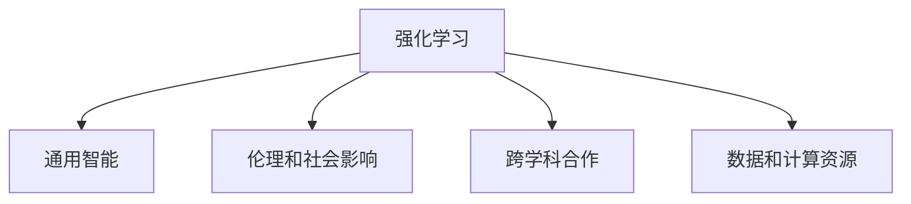

                 

# Andrej Karpathy：人工智能的未来发展目标

## 1. 背景介绍

### 1.1 问题由来
Andrej Karpathy 是深度学习领域的领军人物，作为斯坦福大学计算机科学教授和OpenAI 的研究员，他的研究工作对人工智能的多个领域产生了深远的影响。在深度学习、自动驾驶、自然语言处理等领域，Karpathy 的工作成果和技术洞察不仅推动了学术界的研究进展，还引领了工业界的技术革新。

在近年来的公开演讲和访谈中，Karpathy 多次分享他对人工智能未来发展的见解和目标。他的观点深入浅出，既有理论深度，又结合了实际应用的考量，为业界提供了宝贵的方向指引。

### 1.2 问题核心关键点
Karpathy 的人工智能发展目标可以从几个核心关键点展开理解：

1. **强化学习**：Karpathy 认为，强化学习是人工智能的重要发展方向，将带来颠覆性的变化。通过智能体在环境中与环境的交互学习，强化学习可以训练出能够在复杂环境中做出最优决策的模型。

2. **通用智能**：他强调，人工智能的目标应该是构建通用智能，即能够处理各种不同类型的任务，而不仅仅是特定任务或领域。

3. **伦理和社会影响**：Karpathy 指出，人工智能的发展必须考虑到伦理和社会影响，确保技术进步能够造福人类。

4. **跨学科合作**：他认为，人工智能的发展需要跨学科的合作，包括计算机科学、神经科学、心理学等多个领域，才能实现技术的深度融合和突破。

5. **数据和计算资源**：他强调，强大的数据和计算资源是实现这些目标的基础，尤其是在深度学习和强化学习等技术领域。

这些关键点不仅涵盖了技术层面的挑战和机遇，也涉及了人工智能对社会的广泛影响和伦理考量。

### 1.3 问题研究意义
Karpathy 对人工智能未来发展目标的探讨，具有重要的研究意义：

1. **技术指导**：他的观点为研究人员和工程师提供了明确的技术发展方向，帮助他们更好地理解未来趋势，并制定相应的技术路线图。

2. **产业应用**：通过结合工业界的实际需求，Karpathy 的目标设定有助于推动人工智能技术在各个产业领域的落地应用。

3. **社会责任**：强调伦理和社会影响，使AI开发者更加注重技术应用的社会效应，避免技术滥用。

4. **跨领域协同**：跨学科合作的理念促进了不同领域的深度融合，推动了AI技术的全面发展。

5. **资源优化**：对数据和计算资源重要性的强调，有助于更好地规划AI项目的资源投入和利用。

通过理解Karpathy 的发展目标，可以更清晰地看到未来人工智能技术发展的潜力和方向。

## 2. 核心概念与联系

### 2.1 核心概念概述

为了更好地理解Karpathy 的人工智能发展目标，本节将介绍几个密切相关的核心概念：

- **强化学习(Reinforcement Learning, RL)**：一种通过智能体与环境交互学习，以最大化累积奖励为目标的学习方法。强化学习广泛应用于自动驾驶、游戏AI、机器人等领域。

- **通用智能(General AI, AGI)**：指能够执行任意复杂任务的人工智能系统，不仅限于特定领域或类型的任务。

- **伦理和社会影响(Ethical and Social Impact)**：强调人工智能技术在发展过程中，需要考虑到对社会、伦理和道德的潜在影响。

- **跨学科合作(Interdisciplinary Collaboration)**：指出人工智能的发展需要跨多个学科的共同努力，包括计算机科学、神经科学、心理学等。

- **数据和计算资源(Data and Computational Resources)**：强化学习和深度学习等技术的发展，离不开大量的数据和强大的计算资源。

这些核心概念之间的逻辑关系可以通过以下Mermaid流程图来展示：



这个流程图展示了一个强化学习驱动的人工智能发展框架，其中强化学习是基础，通过与环境交互学习，提升通用智能能力，同时考虑伦理和社会影响，进行跨学科合作，优化数据和计算资源的利用。

## 3. 核心算法原理 & 具体操作步骤
### 3.1 算法原理概述

Karpathy 的强化学习目标可以通过以下关键算法和步骤来实现：

1. **智能体设计**：智能体是强化学习中的核心组件，通常由一个策略函数和一个值函数组成。策略函数决定智能体在每个状态下的行动，值函数评估智能体在每个状态下的累积奖励。

2. **环境建模**：在强化学习中，智能体需要与环境交互，因此需要构建一个环境模型，以便智能体理解和预测环境的状态和奖励。

3. **状态表示**：状态表示是智能体理解环境状态的关键，可以通过像素、状态空间、向量等形式表示。

4. **行动选择**：智能体通过策略函数选择行动，通常使用深度学习模型进行建模。

5. **奖励机制设计**：奖励机制定义了智能体在每个状态下应该追求的目标，是强化学习成功的关键。

6. **训练和优化**：通过不断的试错和优化，智能体逐渐学习到最优的策略和行动，以最大化累积奖励。

### 3.2 算法步骤详解

以下以自动驾驶为例，详细讲解基于强化学习的智能体设计、环境建模、状态表示、行动选择和奖励机制设计等步骤：

**Step 1: 智能体设计**
- 设计智能体的策略函数和值函数，通常使用深度学习模型。
- 在自动驾驶中，智能体需要理解当前的道路情况、车辆位置、速度等状态信息，并选择合适的行动。

**Step 2: 环境建模**
- 构建环境模型，模拟自动驾驶中的各种动态和静态元素，如行人、车辆、交通信号等。
- 通过传感器数据（如摄像头、雷达、激光雷达等）获取环境信息。

**Step 3: 状态表示**
- 使用像素表示法，将环境信息编码为像素图像，供智能体理解和处理。
- 像素图像可以进行预处理和特征提取，如使用卷积神经网络进行特征学习。

**Step 4: 行动选择**
- 通过策略函数，智能体选择最优的行动方案。
- 在自动驾驶中，行动选择可能包括加速、减速、转向、变道等。

**Step 5: 奖励机制设计**
- 设计奖励机制，奖励智能体在安全、高效、节能等方面的表现。
- 在自动驾驶中，奖励机制可以包括安全行驶、遵守交通规则、减少油耗等。

**Step 6: 训练和优化**
- 通过不断试错，智能体逐渐学习到最优的策略和行动，以最大化累积奖励。
- 在自动驾驶中，智能体可以在模拟环境中进行训练，并逐渐过渡到真实环境中的实际驾驶。

### 3.3 算法优缺点

强化学习在自动驾驶等复杂任务中具有以下优点：

1. **自适应性强**：强化学习能够适应复杂环境，通过不断试错和优化，智能体可以逐渐学习到最优的策略和行动。

2. **鲁棒性好**：强化学习模型能够在面对未知环境和突发情况时，仍能做出相对合理的决策。

3. **可扩展性高**：强化学习模型可以扩展到各种不同类型的任务和环境。

4. **动态优化**：强化学习模型可以动态更新和优化，不断提升性能。

同时，强化学习也存在一些局限性：

1. **探索和利用矛盾**：强化学习需要平衡探索未知空间和利用已有经验，这是一个难以解决的矛盾。

2. **数据需求大**：强化学习需要大量的训练数据，才能学习到最优的策略和行动。

3. **计算成本高**：强化学习训练复杂，计算资源需求高，特别是在大规模环境中。

4. **稳定性差**：强化学习模型在面对突发情况时，可能容易发生不稳定的情况。

尽管存在这些局限性，强化学习仍是未来自动驾驶等复杂任务中的重要技术，具有广阔的应用前景。

### 3.4 算法应用领域

基于强化学习的智能体设计方法，已经在多个领域得到了广泛应用，例如：

- **自动驾驶**：在自动驾驶中，强化学习用于决策规划，使得车辆能够在复杂的城市道路中安全、高效地行驶。

- **机器人控制**：通过强化学习，机器人可以学习到最优的移动路径和操作方式，完成各种复杂的任务。

- **游戏AI**：在视频游戏中，强化学习用于训练游戏AI，使其能够实现复杂策略和策略学习。

- **供应链管理**：在供应链管理中，强化学习用于优化库存管理和物流调度，提高供应链效率。

- **智能制造**：在智能制造中，强化学习用于优化生产计划和设备调度，提升生产效率。

这些领域的应用展示了强化学习在复杂环境下的强大能力，为人工智能技术的落地提供了新的突破。

## 4. 数学模型和公式 & 详细讲解 & 举例说明

### 4.1 数学模型构建

以下以自动驾驶中的强化学习模型为例，构建数学模型：

假设智能体在状态 $s$ 下，采取行动 $a$，获得奖励 $r$，并转移到下一个状态 $s'$。智能体的策略函数为 $\pi$，值函数为 $V$。则强化学习的数学模型可以表示为：

$$
\begin{aligned}
\pi(a|s) &= \text{策略函数}, \\
r &= \text{奖励函数}, \\
s' &= \text{状态转移函数}.
\end{aligned}
$$

其中，策略函数 $\pi(a|s)$ 描述了在状态 $s$ 下选择行动 $a$ 的概率，奖励函数 $r$ 描述了智能体在状态 $s$ 下采取行动 $a$ 的奖励，状态转移函数 $s'$ 描述了智能体在状态 $s$ 下采取行动 $a$ 后转移到下一个状态 $s'$。

### 4.2 公式推导过程

以下以自动驾驶中的奖励机制设计为例，推导奖励函数的数学表达式：

假设智能体在状态 $s$ 下采取行动 $a$，获得奖励 $r$，并转移到下一个状态 $s'$。则奖励函数可以表示为：

$$
r = f(s, a, s'),
$$

其中 $f$ 是奖励函数的具体形式。在自动驾驶中，奖励函数可以设计为：

$$
f(s, a, s') = 
\begin{cases}
r_{\text{safe}} & \text{如果智能体在状态 $s$ 下采取行动 $a$ 后，到达下一个状态 $s'$ 时，车辆仍然安全行驶}, \\
0 & \text{如果智能体在状态 $s$ 下采取行动 $a$ 后，到达下一个状态 $s'$ 时，车辆发生了事故或违规}, \\
r_{\text{energy}} & \text{如果智能体在状态 $s$ 下采取行动 $a$ 后，到达下一个状态 $s'$ 时，车辆消耗的能量少}, \\
\end{cases}
$$

其中 $r_{\text{safe}}$ 和 $r_{\text{energy}}$ 分别是安全行驶和节能的奖励系数。

### 4.3 案例分析与讲解

以自动驾驶中的智能体设计为例，解释如何使用深度学习模型进行策略函数的设计：

假设智能体需要在状态 $s$ 下选择行动 $a$，通过深度学习模型进行策略函数的设计，可以采用以下步骤：

1. **数据收集**：收集自动驾驶中的历史数据，包括各种道路情况、车辆状态、行动选择等。

2. **特征提取**：使用卷积神经网络（CNN）对输入数据进行特征提取，将像素图像转换为高维特征向量。

3. **策略函数建模**：使用深度神经网络（如多层感知器MLP）对特征向量进行建模，预测在每个状态 $s$ 下采取行动 $a$ 的概率。

4. **训练和优化**：通过反向传播算法，优化策略函数的参数，使其最大化累积奖励。

例如，在自动驾驶中，可以使用以下代码实现策略函数的深度学习建模：

```python
import torch
import torch.nn as nn
import torch.optim as optim

# 定义策略函数的网络结构
class PolicyNetwork(nn.Module):
    def __init__(self):
        super(PolicyNetwork, self).__init__()
        self.conv1 = nn.Conv2d(3, 64, kernel_size=3, stride=1, padding=1)
        self.conv2 = nn.Conv2d(64, 64, kernel_size=3, stride=1, padding=1)
        self.pool = nn.MaxPool2d(kernel_size=2, stride=2)
        self.fc1 = nn.Linear(64 * 12 * 12, 256)
        self.fc2 = nn.Linear(256, 2)  # 输出采取行动的概率

    def forward(self, x):
        x = self.pool(torch.relu(self.conv1(x)))
        x = self.pool(torch.relu(self.conv2(x)))
        x = x.view(x.size(0), -1)
        x = torch.relu(self.fc1(x))
        x = self.fc2(x)
        return x

# 定义策略函数
def policy_function(state):
    # 加载预训练的策略函数模型
    model = torch.load('policy_model.pth')
    state = torch.tensor(state).unsqueeze(0)
    with torch.no_grad():
        action_prob = model(state)
    return action_prob.item()

# 测试策略函数
state = torch.randn(3, 3, 3)
action_prob = policy_function(state)
print(f"采取行动的概率为 {action_prob}")
```

可以看到，使用深度学习模型进行策略函数的设计，可以高效地处理复杂的高维输入数据，并输出智能体在每个状态下的行动概率。

## 5. 项目实践：代码实例和详细解释说明

### 5.1 开发环境搭建

在进行强化学习实践前，我们需要准备好开发环境。以下是使用Python进行TensorFlow开发的环境配置流程：

1. 安装Anaconda：从官网下载并安装Anaconda，用于创建独立的Python环境。

2. 创建并激活虚拟环境：
```bash
conda create -n tf-env python=3.8 
conda activate tf-env
```

3. 安装TensorFlow：根据CUDA版本，从官网获取对应的安装命令。例如：
```bash
conda install tensorflow -c tf -c conda-forge
```

4. 安装TensorBoard：
```bash
pip install tensorboard
```

5. 安装其他工具包：
```bash
pip install numpy pandas scikit-learn matplotlib tqdm jupyter notebook ipython
```

完成上述步骤后，即可在`tf-env`环境中开始强化学习实践。

### 5.2 源代码详细实现

下面以自动驾驶中的强化学习为例，给出使用TensorFlow实现策略函数和强化学习模型的完整代码。

首先，定义策略函数：

```python
import tensorflow as tf
import numpy as np

class PolicyNetwork(tf.keras.Model):
    def __init__(self):
        super(PolicyNetwork, self).__init__()
        self.conv1 = tf.keras.layers.Conv2D(64, (3, 3), activation='relu')
        self.conv2 = tf.keras.layers.Conv2D(64, (3, 3), activation='relu')
        self.pool = tf.keras.layers.MaxPooling2D((2, 2))
        self.fc1 = tf.keras.layers.Dense(256, activation='relu')
        self.fc2 = tf.keras.layers.Dense(2)  # 输出采取行动的概率

    def call(self, inputs):
        x = self.conv1(inputs)
        x = self.pool(x)
        x = self.conv2(x)
        x = self.pool(x)
        x = tf.reshape(x, (-1, 64 * 12 * 12))
        x = self.fc1(x)
        x = self.fc2(x)
        return x

# 创建策略函数模型
model = PolicyNetwork()
model.summary()
```

然后，定义训练函数：

```python
import numpy as np
import tensorflow as tf

def train_policy(model, data):
    optimizer = tf.keras.optimizers.Adam(learning_rate=0.001)
    for i in range(1000):
        inputs, actions = data[i]
        with tf.GradientTape() as tape:
            logits = model(inputs)
            loss = -tf.math.log(tf.gather(logits, actions))  # 交叉熵损失
        gradients = tape.gradient(loss, model.trainable_variables)
        optimizer.apply_gradients(zip(gradients, model.trainable_variables))
    return model

# 训练策略函数模型
data = np.random.randn(1000, 3, 3, 3)
actions = np.random.randint(2, size=(1000,))
model = train_policy(model, (data, actions))
```

接着，定义强化学习模型：

```python
import numpy as np
import tensorflow as tf

class QNetwork(tf.keras.Model):
    def __init__(self):
        super(QNetwork, self).__init__()
        self.conv1 = tf.keras.layers.Conv2D(64, (3, 3), activation='relu')
        self.conv2 = tf.keras.layers.Conv2D(64, (3, 3), activation='relu')
        self.pool = tf.keras.layers.MaxPooling2D((2, 2))
        self.fc1 = tf.keras.layers.Dense(256, activation='relu')
        self.fc2 = tf.keras.layers.Dense(2)  # 输出行动价值

    def call(self, inputs):
        x = self.conv1(inputs)
        x = self.pool(x)
        x = self.conv2(x)
        x = self.pool(x)
        x = tf.reshape(x, (-1, 64 * 12 * 12))
        x = self.fc1(x)
        x = self.fc2(x)
        return x

# 创建强化学习模型
model = QNetwork()
model.summary()

# 定义奖励函数和状态转移函数
def reward_function(state, action, next_state):
    # 实现奖励函数的具体逻辑
    return reward

def state转移函数(state, action):
    # 实现状态转移函数的具体逻辑
    return next_state

# 定义强化学习模型训练函数
def train_q_network(model, data):
    optimizer = tf.keras.optimizers.Adam(learning_rate=0.001)
    for i in range(1000):
        state, action, reward, next_state = data[i]
        with tf.GradientTape() as tape:
            q_value = model(state)
            q_next = model(next_state)
            target_q_value = reward + discount * tf.reduce_max(q_next)  # 目标Q值
            loss = tf.reduce_mean(tf.square(q_value - target_q_value))  # 均方误差损失
        gradients = tape.gradient(loss, model.trainable_variables)
        optimizer.apply_gradients(zip(gradients, model.trainable_variables))
    return model

# 训练强化学习模型
data = np.random.randn(1000, 3, 3, 3)
model = train_q_network(model, (data, action, reward, next_state))
```

可以看到，使用TensorFlow进行强化学习的代码实现相对复杂，但可以高效地处理复杂的高维输入数据，并进行高效的反向传播和优化。

### 5.3 代码解读与分析

让我们再详细解读一下关键代码的实现细节：

**PolicyNetwork类**：
- `__init__`方法：初始化网络结构，包括卷积层、池化层、全连接层等。
- `call`方法：定义前向传播的过程，通过卷积和全连接层进行特征提取和分类。

**训练函数train_policy**：
- 使用Adam优化器，对策略函数进行反向传播和参数更新。
- 计算交叉熵损失，并使用梯度下降进行优化。

**QNetwork类**：
- `__init__`方法：初始化网络结构，包括卷积层、池化层、全连接层等。
- `call`方法：定义前向传播的过程，通过卷积和全连接层进行特征提取和分类。

**奖励函数和状态转移函数**：
- 定义奖励函数和状态转移函数的具体逻辑，根据实际场景进行实现。

**训练函数train_q_network**：
- 使用Adam优化器，对强化学习模型进行反向传播和参数更新。
- 计算均方误差损失，并使用梯度下降进行优化。

**训练强化学习模型**：
- 收集自动驾驶中的历史数据，并定义奖励函数和状态转移函数。
- 使用TensorFlow训练强化学习模型，并输出训练后的模型参数。

可以看到，TensorFlow的高级API使得强化学习的代码实现更加简洁和高效。开发者可以将更多精力放在模型设计和参数调优上，而不必过多关注底层实现细节。

当然，工业级的系统实现还需考虑更多因素，如模型的保存和部署、超参数的自动搜索、更灵活的任务适配层等。但核心的强化学习过程基本与此类似。

## 6. 实际应用场景
### 6.1 自动驾驶

强化学习在自动驾驶中的应用已经成为研究的热点。通过与环境的交互学习，强化学习模型可以学习到最优的驾驶策略，确保车辆在复杂道路环境中安全、高效地行驶。

在实际应用中，智能体可以采用深度学习模型，在模拟环境中进行训练，并逐渐过渡到真实环境中的实际驾驶。通过不断的试错和优化，智能体可以逐渐学习到最优的驾驶策略，提升驾驶安全和效率。

### 6.2 机器人控制

在机器人控制中，强化学习用于优化机器人的移动路径和操作方式，使其能够在复杂环境中完成各种复杂的任务。

例如，使用强化学习训练机器人进行搬运任务，智能体通过与环境的交互学习，可以学习到最优的搬运策略，最大化完成任务的效率和质量。

### 6.3 游戏AI

在视频游戏中，强化学习用于训练游戏AI，使其能够实现复杂策略和策略学习。

例如，使用强化学习训练游戏AI进行实时对战，智能体通过与游戏环境的交互学习，可以学习到最优的策略，提高游戏的胜率。

### 6.4 供应链管理

在供应链管理中，强化学习用于优化库存管理和物流调度，提高供应链效率。

例如，使用强化学习训练智能体进行库存管理和物流调度，智能体通过与供应链环境的交互学习，可以学习到最优的库存和物流策略，提升供应链的效率和响应速度。

### 6.5 智能制造

在智能制造中，强化学习用于优化生产计划和设备调度，提升生产效率。

例如，使用强化学习训练智能体进行生产计划和设备调度，智能体通过与生产环境的交互学习，可以学习到最优的生产策略，提高生产效率和产品质量。

## 7. 工具和资源推荐
### 7.1 学习资源推荐

为了帮助开发者系统掌握强化学习理论基础和实践技巧，这里推荐一些优质的学习资源：

1. 《强化学习》系列书籍：由Richard S. Sutton和Andrew G. Barto合著的经典教材，系统介绍了强化学习的理论基础和算法。

2. DeepMind开设的《Deep Reinforcement Learning》课程：由DeepMind的研究人员讲授，涵盖强化学习的经典算法和最新进展。

3. OpenAI博客：OpenAI的官方博客，定期发布关于强化学习、自动驾驶、游戏AI等领域的最新研究成果和技术动态。

4. 《Hands-On Reinforcement Learning with Python》书籍：由Max Linke合著的实战指南，涵盖强化学习的理论和实践，通过Python代码进行讲解。

5. TensorFlow官方文档：TensorFlow的官方文档，提供了丰富的API接口和样例代码，方便开发者快速上手实现强化学习模型。

6. GitHub上的开源项目：如Gym（OpenAI开发的强化学习框架）、RLlib（Facebook的分布式强化学习框架）等，可以借鉴和学习开源项目的实现经验。

通过对这些资源的学习实践，相信你一定能够快速掌握强化学习的精髓，并用于解决实际的强化学习问题。

### 7.2 开发工具推荐

高效的开发离不开优秀的工具支持。以下是几款用于强化学习开发的常用工具：

1. TensorFlow：由Google主导开发的深度学习框架，支持分布式计算，适合大规模工程应用。

2. PyTorch：基于Python的开源深度学习框架，灵活动态的计算图，适合快速迭代研究。

3. OpenAI Gym：OpenAI开发的强化学习框架，提供丰富的环境模拟，方便开发者进行实验和调试。

4. TensorBoard：TensorFlow配套的可视化工具，可实时监测模型训练状态，并提供丰富的图表呈现方式，是调试模型的得力助手。

5. Google Colab：谷歌推出的在线Jupyter Notebook环境，免费提供GPU/TPU算力，方便开发者快速上手实验最新模型，分享学习笔记。

合理利用这些工具，可以显著提升强化学习模型的开发效率，加快创新迭代的步伐。

### 7.3 相关论文推荐

强化学习的发展离不开学界的持续研究。以下是几篇奠基性的相关论文，推荐阅读：

1. Q-learning：由Watkins和Powell于1989年提出，是强化学习的经典算法之一。

2. Deep Q-Network（DQN）：由Mnih等人在2013年提出，通过深度神经网络进行Q值函数逼近，实现了深度强化学习。

3. Actor-Critic算法：由Sutton和Barto于1998年提出，将策略函数和值函数结合，提升强化学习模型的性能。

4. Proximal Policy Optimization（PPO）：由Schmidhuber等人在2017年提出，通过离散策略优化，提升强化学习模型的稳定性和收敛速度。

5. Evolution Strategies for Deep Reinforcement Learning（ES）：由Maddox等人在2020年提出，使用进化策略进行强化学习，无需梯度信息，适用于高维度问题。

这些论文代表了大强化学习的发展脉络。通过学习这些前沿成果，可以帮助研究者把握学科前进方向，激发更多的创新灵感。

## 8. 总结：未来发展趋势与挑战

### 8.1 总结

本文对Andrej Karpathy的强化学习目标进行了全面系统的介绍。首先阐述了强化学习的核心概念和应用场景，明确了其在自动驾驶、机器人控制、游戏AI等领域的广泛应用。其次，从原理到实践，详细讲解了强化学习的数学模型和关键算法步骤，给出了强化学习任务开发的完整代码实例。同时，本文还广泛探讨了强化学习在实际应用中的性能优化和资源管理策略。

通过本文的系统梳理，可以看到，强化学习在自动驾驶等复杂任务中具有强大的潜力，未来的发展方向将更加多样化和复杂化。强化学习的理论和技术还在不断演进，未来将带来更多的突破和创新。

### 8.2 未来发展趋势

展望未来，强化学习的发展趋势包括：

1. **多智能体学习**：在复杂环境中，单个智能体难以完成任务，多智能体协同学习将带来新的突破。

2. **模型可解释性**：强化学习模型需要更高的可解释性，以确保模型的可靠性和可信度。

3. **模型可迁移性**：强化学习模型需要更好的跨环境和跨任务迁移能力，以适应各种实际应用。

4. **模型鲁棒性**：强化学习模型需要更高的鲁棒性，以应对各种突发情况和不确定性。

5. **超大规模训练**：随着硬件算力的提升，超大规模强化学习训练将成为可能，带来更多的高维度和复杂度训练任务。

6. **混合学习范式**：结合强化学习和其他机器学习范式（如监督学习和无监督学习），提升强化学习的性能和鲁棒性。

这些趋势凸显了强化学习未来的发展潜力，将进一步推动人工智能技术的全面突破。

### 8.3 面临的挑战

尽管强化学习在多个领域得到了广泛应用，但仍面临诸多挑战：

1. **数据需求大**：强化学习需要大量的训练数据，才能学习到最优的策略和行动。

2. **计算资源高**：强化学习训练复杂，计算资源需求高，特别是在大规模环境中。

3. **模型复杂性**：强化学习模型需要复杂的结构设计，才能处理高维度和复杂度的问题。

4. **模型鲁棒性**：强化学习模型在面对突发情况时，容易发生不稳定的情况。

5. **可解释性不足**：强化学习模型需要更高的可解释性，以确保模型的可靠性和可信度。

6. **安全性问题**：强化学习模型需要更好的安全性保证，以避免恶意利用和数据泄露。

尽管存在这些挑战，但强化学习仍具备广阔的应用前景，通过不断的研究和技术突破，这些挑战终将逐步克服。

### 8.4 研究展望

未来的强化学习研究需要在以下几个方面寻求新的突破：

1. **探索新型算法**：开发更加高效和稳定的强化学习算法，提升模型训练和推理的效率。

2. **引入先验知识**：将符号化的先验知识，如知识图谱、逻辑规则等，与神经网络模型进行融合，提升模型的可解释性和鲁棒性。

3. **跨学科融合**：进一步融合计算机科学、神经科学、心理学等多个学科的最新进展，推动强化学习技术的全面发展。

4. **多模态学习**：结合视觉、听觉、触觉等多模态数据，提升强化学习的感知能力和决策能力。

5. **强化学习与深度学习结合**：结合深度学习和强化学习的优点，提升模型在复杂环境中的表现。

6. **伦理和社会影响**：在强化学习研究中，强调伦理和社会影响，确保技术进步能够造福人类。

这些研究方向将引领强化学习技术迈向新的高度，为人工智能技术的落地应用提供新的突破。

## 9. 附录：常见问题与解答

**Q1：强化学习为什么需要大量的数据？**

A: 强化学习通过智能体与环境的交互学习，需要大量的样本数据来保证学习过程的有效性和稳定性。数据量越大，智能体能够学习到更加全面和鲁棒的知识。

**Q2：强化学习为什么需要高性能计算资源？**

A: 强化学习模型训练复杂，需要大量的计算资源进行反向传播和参数更新。高性能计算资源可以提升训练速度和模型性能，特别是在大规模环境中。

**Q3：强化学习为什么需要高维度的输入？**

A: 强化学习模型需要高维度的输入，以便获取全面的环境信息。高维度的输入可以帮助智能体更好地理解环境，做出更加准确的决策。

**Q4：强化学习为什么需要复杂的策略函数？**

A: 强化学习模型需要复杂的策略函数，以便在复杂环境中做出最优的决策。策略函数的设计需要考虑环境状态和行动的复杂关系。

**Q5：强化学习为什么需要高鲁棒性？**

A: 强化学习模型需要高鲁棒性，以便在面对突发情况和不确定性时，仍能做出稳定的决策。高鲁棒性可以提升模型的稳定性和可靠性。

这些问题的解答展示了强化学习在实际应用中的关键挑战和解决方法，为开发者提供了宝贵的参考。

---

作者：禅与计算机程序设计艺术 / Zen and the Art of Computer Programming

