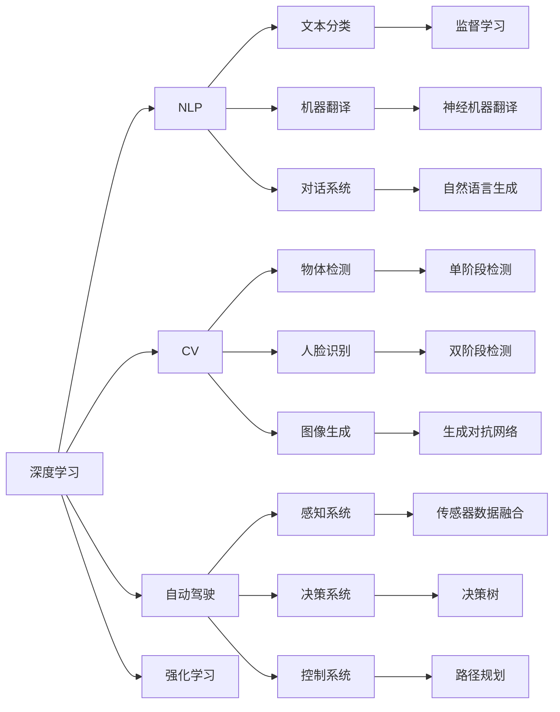

                 

# Andrej Karpathy：人工智能的未来发展目标

> 关键词：人工智能,深度学习,自然语言处理,计算机视觉,自动驾驶,未来发展

## 1. 背景介绍

### 1.1 问题由来
在过去的几十年中，人工智能(AI)技术取得了前所未有的进展。深度学习、自然语言处理(NLP)、计算机视觉(CV)等领域的突破，使得机器能够处理复杂的信息，实现人类难以想象的智能功能。然而，尽管取得了这些成就，AI技术仍面临许多挑战和瓶颈，阻碍了其进一步发展。

### 1.2 问题核心关键点
为了应对这些挑战，我们必须明确人工智能的未来发展目标。这些目标不仅包括技术上的突破，还包括伦理、安全、可解释性等方面的考量。本文将围绕以下核心问题展开讨论：
1. 人工智能在技术上的突破点是什么？
2. 如何保证AI技术的伦理和安全？
3. 如何提升AI的可解释性和透明度？
4. AI技术在未来的发展方向和应用场景有哪些？

## 2. 核心概念与联系

### 2.1 核心概念概述

在探讨人工智能的未来发展目标之前，我们首先需要理解以下几个核心概念：

- **深度学习(Deep Learning)**：一种模拟人类大脑神经网络的机器学习方法，通过多层次的非线性变换，可以从原始数据中自动提取特征，从而实现复杂的任务。
- **自然语言处理(NLP)**：使计算机能够理解、处理和生成自然语言的技术，包括文本分类、机器翻译、对话系统等。
- **计算机视觉(CV)**：使计算机能够“看”、“理解”和“解释”图像和视频的技术，包括物体检测、人脸识别、图像生成等。
- **自动驾驶(Autonomous Driving)**：通过感知、决策和控制，使车辆在无人干预的情况下自主行驶的技术。
- **可解释性(Explainability)**：使AI系统的决策过程透明、可理解，避免“黑盒”问题，提升信任度。

### 2.2 核心概念原理和架构的 Mermaid 流程图



## 3. 核心算法原理 & 具体操作步骤

### 3.1 算法原理概述

人工智能的未来发展目标可以概括为以下几个方面：

1. **技术突破**：在深度学习、NLP、CV等核心领域实现新的算法和技术突破，提升AI系统的性能和可扩展性。
2. **伦理与安全性**：建立AI技术的伦理和法律框架，确保其安全性和公正性。
3. **可解释性**：提升AI系统的透明度和可解释性，增强用户信任。
4. **应用场景**：推动AI技术在自动驾驶、智能制造、健康医疗等领域的应用，促进社会进步。

### 3.2 算法步骤详解

为了实现这些目标，我们需要采取以下步骤：

1. **算法优化与创新**：
   - **技术突破**：在深度学习、NLP、CV等核心领域，开发更高效、更通用的算法和技术，如Transformer、BERT、GAN等。
   - **技术融合**：将不同领域的算法和技术进行融合，实现跨领域的应用，如将NLP与CV结合，提升图像描述的准确性。
   - **新算法开发**：开发新的算法和模型结构，如稀疏卷积网络、自适应神经网络等，提升AI系统的性能和效率。

2. **伦理与法律框架**：
   - **伦理考量**：在AI系统设计时，考虑其对社会的影响，避免歧视、偏见等问题。
   - **法律框架**：建立AI技术的法律法规，确保其合法合规。
   - **伦理审查**：设立专门的伦理审查委员会，对AI系统的决策进行审查，确保其公正性。

3. **可解释性提升**：
   - **透明性**：在AI系统的设计中，确保其决策过程透明、可理解。
   - **可解释模型**：开发可解释的AI模型，如决策树、规则系统等，提升系统的透明度。
   - **用户教育**：对用户进行教育，提高其对AI系统的理解，增强信任度。

4. **应用场景拓展**：
   - **自动驾驶**：通过感知、决策和控制技术，实现无人驾驶汽车，提升交通安全性。
   - **智能制造**：利用AI技术优化生产流程，提高生产效率和产品质量。
   - **健康医疗**：通过AI技术辅助诊断和治疗，提升医疗服务水平。

### 3.3 算法优缺点

深度学习和大规模数据训练是当前AI技术的核心，但也存在以下缺点：

1. **数据依赖**：深度学习需要大量的标注数据，难以获取高质量的数据集。
2. **计算资源**：深度学习需要大量的计算资源，难以在小型设备上运行。
3. **过拟合**：深度学习模型容易过拟合，需要更多的正则化技术来避免。
4. **可解释性不足**：深度学习模型通常是“黑盒”，难以解释其内部机制。

为了克服这些缺点，未来AI技术的发展需要从以下几个方面进行改进：

1. **数据增强**：通过数据增强技术，扩充训练集，减少数据依赖。
2. **模型压缩**：通过模型压缩技术，减小计算资源需求，提高模型的可扩展性。
3. **正则化技术**：开发更有效的正则化技术，避免过拟合。
4. **可解释性模型**：开发可解释性强的AI模型，提高系统的透明性和可信度。

### 3.4 算法应用领域

深度学习和大规模数据训练已经在许多领域得到了广泛应用，以下是一些典型应用场景：

1. **自然语言处理**：
   - **机器翻译**：使用Transformer模型，将一种语言翻译成另一种语言。
   - **对话系统**：使用RNN、Transformer等模型，实现自然语言对话。
   - **文本分类**：使用CNN、RNN等模型，对文本进行分类。

2. **计算机视觉**：
   - **物体检测**：使用YOLO、Faster R-CNN等模型，实现实时物体检测。
   - **人脸识别**：使用Siamese网络、Triplet Loss等技术，实现人脸识别。
   - **图像生成**：使用GAN、VAE等技术，生成高质量的图像。

3. **自动驾驶**：
   - **感知系统**：使用深度学习模型，处理传感器数据，实现环境感知。
   - **决策系统**：使用强化学习技术，优化决策策略。
   - **控制系统**：使用深度学习模型，实现路径规划和车辆控制。

## 4. 数学模型和公式 & 详细讲解 & 举例说明

### 4.1 数学模型构建

在本节中，我们将以计算机视觉领域的物体检测为例，详细讲解深度学习模型的构建。

假设我们有一个包含N个图像和M个物体类别的数据集，每个图像的标注信息为$(x_i, y_i, b_i)$，其中$x_i$为图像像素坐标，$y_i$为物体类别标签，$b_i$为边界框坐标。我们的目标是用深度学习模型$f$来预测每个物体的类别和边界框。

### 4.2 公式推导过程

首先，我们需要将标注信息转换为模型能够处理的形式。具体步骤如下：

1. **数据预处理**：对图像进行预处理，如归一化、缩放等。
2. **标注信息转换**：将物体类别标签和边界框坐标转换为模型能够处理的格式。
3. **模型训练**：使用深度学习模型$f$，对标注数据进行训练。

具体公式推导如下：

- **数据预处理**：
  $$
  x_i' = \frac{x_i - \mu}{\sigma}
  $$

- **标注信息转换**：
  $$
  y_i' = [y_i, b_i]
  $$

- **模型训练**：
  $$
  \theta^* = \mathop{\arg\min}_{\theta} \frac{1}{N} \sum_{i=1}^N \ell(f(x_i'), y_i')
  $$

其中，$\ell$为损失函数，如均方误差损失。

### 4.3 案例分析与讲解

以物体检测为例，我们可以使用YOLO模型来实现。YOLO模型将图像分为多个网格，每个网格预测一个物体类别和边界框。通过端到端训练，YOLO模型能够实现实时物体检测。

- **网格划分**：将图像划分为$S$个网格，每个网格预测$K$个物体类别和边界框。
- **目标函数**：每个网格的目标函数为：
  $$
  \ell_i = \sum_{k=1}^K (y_i^k - \hat{y}_i^k)^2 + (b_i^k - \hat{b}_i^k)^2
  $$
- **总损失函数**：将所有网格的目标函数相加，得到总损失函数：
  $$
  \ell = \sum_{i=1}^S \ell_i
  $$

## 5. 项目实践：代码实例和详细解释说明

### 5.1 开发环境搭建

在实践深度学习项目时，我们需要搭建一个适合进行深度学习实验的开发环境。以下是搭建环境的具体步骤：

1. **安装深度学习框架**：
   - 安装PyTorch、TensorFlow等深度学习框架。
   - 安装相关的GPU加速库，如CUDA、cuDNN等。

2. **安装相关工具**：
   - 安装数据预处理工具，如PIL、OpenCV等。
   - 安装模型训练工具，如TensorBoard、Weights & Biases等。

3. **安装环境管理工具**：
   - 安装虚拟环境管理工具，如Anaconda、Virtualenv等。

### 5.2 源代码详细实现

以YOLO模型为例，以下是YOLO模型的Python代码实现：

```python
import torch
import torch.nn as nn
import torch.optim as optim
from torchvision import transforms

class YOLOModel(nn.Module):
    def __init__(self):
        super(YOLOModel, self).__init__()
        # 定义YOLO模型的网络结构
        # ...

    def forward(self, x):
        # 前向传播计算
        # ...

    def loss_function(self, x, y):
        # 计算损失函数
        # ...

# 加载数据集
train_dataset = ...
train_loader = ...

# 定义模型和优化器
model = YOLOModel()
optimizer = optim.Adam(model.parameters(), lr=0.001)

# 训练模型
for epoch in range(epochs):
    for i, (images, labels) in enumerate(train_loader):
        # 数据预处理
        transforms.ToTensor() images

        # 前向传播计算
        outputs = model(images)

        # 计算损失函数
        loss = self.loss_function(outputs, labels)

        # 反向传播更新参数
        optimizer.zero_grad()
        loss.backward()
        optimizer.step()

        # 输出训练日志
        print(f"Epoch {epoch+1}, Batch {i+1}, Loss: {loss.item()}")
```

### 5.3 代码解读与分析

1. **数据预处理**：
   - 使用`transforms.ToTensor()`将图像转换为Tensor格式。
   - 使用`nn.Module`定义模型结构，如卷积层、池化层、全连接层等。
   - 使用`nn.CrossEntropyLoss()`计算分类损失。

2. **模型训练**：
   - 定义训练循环，遍历训练集。
   - 在每个批次上，前向传播计算输出，计算损失函数。
   - 反向传播更新模型参数，输出训练日志。

3. **模型评估**：
   - 在验证集上评估模型性能，如准确率、精度等。
   - 输出评估结果，记录训练日志。

### 5.4 运行结果展示

在训练过程中，我们可以使用TensorBoard等工具，实时监控训练过程中的损失函数、精度等指标。通过调整超参数，如学习率、批大小等，优化训练效果。

## 6. 实际应用场景

### 6.1 自动驾驶

自动驾驶技术已经取得了显著进展，但仍面临许多技术挑战。以下是自动驾驶的几个关键环节：

1. **感知系统**：使用深度学习模型处理传感器数据，实现环境感知。
   - **激光雷达**：使用卷积神经网络处理激光雷达数据。
   - **摄像头**：使用卷积神经网络处理摄像头数据。
   - **雷达**：使用卷积神经网络处理雷达数据。

2. **决策系统**：使用强化学习技术，优化决策策略。
   - **环境建模**：使用深度学习模型对环境进行建模。
   - **决策优化**：使用强化学习技术，优化决策策略。

3. **控制系统**：使用深度学习模型实现路径规划和车辆控制。
   - **路径规划**：使用深度学习模型，实现路径规划。
   - **车辆控制**：使用深度学习模型，实现车辆控制。

### 6.2 智能制造

智能制造技术通过AI技术，优化生产流程，提高生产效率和产品质量。以下是智能制造的几个关键环节：

1. **数据采集**：使用传感器采集生产数据，如温度、湿度、压力等。
   - **传感器数据**：使用深度学习模型处理传感器数据。
   - **数据融合**：使用深度学习模型融合不同来源的数据。

2. **生产优化**：使用AI技术优化生产流程，提高生产效率。
   - **生产调度**：使用深度学习模型优化生产调度。
   - **质量检测**：使用深度学习模型检测产品质量。

3. **预测维护**：使用AI技术预测设备故障，进行预防性维护。
   - **故障预测**：使用深度学习模型预测设备故障。
   - **维护策略**：使用深度学习模型优化维护策略。

### 6.3 健康医疗

AI技术在健康医疗领域的应用越来越广泛，以下是一些典型应用场景：

1. **医学影像**：使用深度学习模型处理医学影像，辅助医生诊断和治疗。
   - **图像分类**：使用卷积神经网络对医学影像进行分类。
   - **图像分割**：使用深度学习模型对医学影像进行分割。

2. **电子病历**：使用NLP技术处理电子病历，辅助医生诊断和治疗。
   - **信息提取**：使用深度学习模型提取电子病历中的关键信息。
   - **关系挖掘**：使用深度学习模型挖掘电子病历中的关系。

3. **个性化治疗**：使用AI技术进行个性化治疗，提升治疗效果。
   - **基因分析**：使用深度学习模型分析基因数据。
   - **药物研发**：使用深度学习模型预测药物效果。

## 7. 工具和资源推荐

### 7.1 学习资源推荐

以下是一些推荐的学习资源，帮助开发者深入理解人工智能技术的原理和应用：

1. **《深度学习》书籍**：Ian Goodfellow等人所著，全面介绍了深度学习的原理和算法。
2. **CS231n《深度学习计算机视觉》课程**：斯坦福大学开设的计算机视觉课程，涵盖深度学习在计算机视觉中的应用。
3. **《TensorFlow官方文档》**：TensorFlow官方文档，提供了丰富的API和示例代码。
4. **Kaggle竞赛**：Kaggle举办的数据科学竞赛，提供丰富的数据集和模型实现。
5. **Coursera课程**：Coursera提供的数据科学和机器学习课程，涵盖深度学习、NLP、CV等方向。

### 7.2 开发工具推荐

以下是一些推荐的开发工具，帮助开发者提高开发效率和项目质量：

1. **PyTorch**：开源深度学习框架，提供丰富的模型和算法实现。
2. **TensorFlow**：开源深度学习框架，支持GPU加速和分布式训练。
3. **Jupyter Notebook**：交互式编程环境，方便进行模型训练和实验调试。
4. **Google Colab**：Google提供的在线Jupyter Notebook环境，免费提供GPU和TPU资源。
5. **Weights & Biases**：模型训练的实验跟踪工具，记录和可视化模型训练过程。

### 7.3 相关论文推荐

以下是一些推荐的相关论文，帮助开发者了解最新的AI技术进展：

1. **《ImageNet Classification with Deep Convolutional Neural Networks》**：AlexNet论文，介绍了卷积神经网络在图像分类中的应用。
2. **《LSTM: A Search Space Odyssey》**：LSTM论文，介绍了长短期记忆网络在序列数据中的应用。
3. **《Natural Language Processing with Transformers》**：Transformer论文，介绍了Transformer模型在NLP中的应用。
4. **《Imagenet Large Scale Visual Recognition Challenge》**：ImageNet论文，介绍了大规模图像识别任务和数据集。
5. **《Scalable TensorFlow》**：TensorFlow论文，介绍了TensorFlow的分布式计算和优化技术。

## 8. 总结：未来发展趋势与挑战

### 8.1 研究成果总结

在过去几年中，深度学习和大规模数据训练在NLP、CV等核心领域取得了显著进展，推动了人工智能技术的发展。然而，随着技术的不断演进，新的挑战和问题也逐渐显现出来，需要我们认真面对和解决。

### 8.2 未来发展趋势

未来，人工智能技术将在以下几个方面继续发展：

1. **技术突破**：在深度学习、NLP、CV等核心领域实现新的算法和技术突破，提升AI系统的性能和可扩展性。
2. **伦理与安全**：建立AI技术的伦理和法律框架，确保其安全性和公正性。
3. **可解释性**：提升AI系统的透明度和可解释性，增强用户信任。
4. **应用场景**：推动AI技术在自动驾驶、智能制造、健康医疗等领域的应用，促进社会进步。

### 8.3 面临的挑战

尽管深度学习和AI技术在许多领域取得了显著进展，但仍面临以下挑战：

1. **数据依赖**：深度学习需要大量的标注数据，难以获取高质量的数据集。
2. **计算资源**：深度学习需要大量的计算资源，难以在小型设备上运行。
3. **过拟合**：深度学习模型容易过拟合，需要更多的正则化技术来避免。
4. **可解释性不足**：深度学习模型通常是“黑盒”，难以解释其内部机制。

### 8.4 研究展望

为了克服这些挑战，未来的AI技术需要在以下几个方面进行改进：

1. **数据增强**：通过数据增强技术，扩充训练集，减少数据依赖。
2. **模型压缩**：通过模型压缩技术，减小计算资源需求，提高模型的可扩展性。
3. **正则化技术**：开发更有效的正则化技术，避免过拟合。
4. **可解释性模型**：开发可解释性强的AI模型，提高系统的透明性和可信度。

## 9. 附录：常见问题与解答

**Q1：深度学习在大规模数据训练中需要哪些资源？**

A: 深度学习在大规模数据训练中需要以下几个资源：
- **计算资源**：如GPU、TPU等高性能计算设备。
- **存储资源**：如SSD、HDD等高速存储设备。
- **网络带宽**：高带宽网络环境，以便快速传输数据。

**Q2：深度学习模型如何进行数据增强？**

A: 深度学习模型可以使用以下数据增强技术：
- **随机裁剪**：对图像进行随机裁剪，生成新的训练样本。
- **随机旋转**：对图像进行随机旋转，生成新的训练样本。
- **随机缩放**：对图像进行随机缩放，生成新的训练样本。
- **噪声注入**：在图像中添加噪声，生成新的训练样本。

**Q3：如何提升深度学习模型的可解释性？**

A: 提升深度学习模型的可解释性，可以使用以下方法：
- **可视化技术**：使用可视化技术，如t-SNE、PCA等，生成特征空间中的可视化结果。
- **特征提取**：使用深度学习模型，提取输入数据的关键特征，便于理解模型的决策过程。
- **模型简化**：使用模型简化技术，如剪枝、量化等，减小模型的复杂度，提高可解释性。

**Q4：如何确保深度学习模型的安全性和公正性？**

A: 确保深度学习模型的安全性和公正性，可以使用以下方法：
- **数据清洗**：对训练数据进行清洗，去除噪音和异常值。
- **模型监控**：对模型进行实时监控，检测异常行为。
- **隐私保护**：对敏感数据进行隐私保护，防止数据泄露。

**Q5：如何提升深度学习模型的效率和性能？**

A: 提升深度学习模型的效率和性能，可以使用以下方法：
- **模型压缩**：使用模型压缩技术，如剪枝、量化等，减小模型的规模。
- **算法优化**：优化深度学习算法的实现，提高计算效率。
- **分布式训练**：使用分布式训练技术，提高模型的并行性。

---

作者：禅与计算机程序设计艺术 / Zen and the Art of Computer Programming

