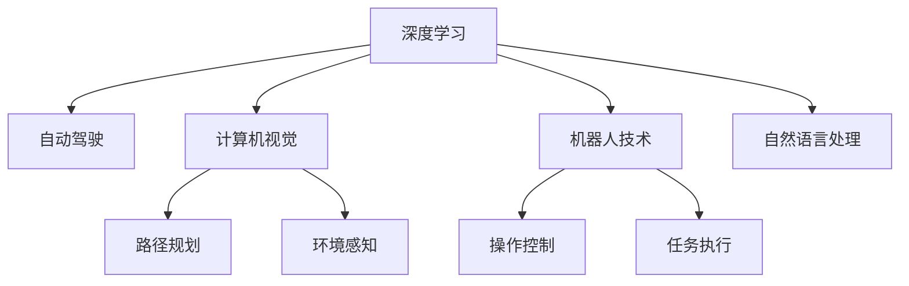

                 

## 1. 背景介绍

Andrej Karpathy，人工智能领域的翘楚，其著作《Deep Learning》是全球范围内最具影响力的深度学习入门书籍之一。在计算机视觉和自动驾驶领域，他的贡献也尤为突出，曾任特斯拉Autopilot团队的技术主管。Andrej对未来AI发展有着深刻的洞察力，本篇文章旨在阐述他关于人工智能未来发展的几大核心目标。

## 2. 核心概念与联系

### 2.1 核心概念概述

- **人工智能（AI）**：使计算机系统能够模拟人类智能行为的技术，包括学习、推理、感知、语言理解和生成、决策等。
- **深度学习（Deep Learning）**：一种基于神经网络的机器学习方法，通过多层非线性变换学习输入数据的抽象特征，广泛应用于计算机视觉、自然语言处理等领域。
- **自动驾驶（Autonomous Driving）**：使车辆能够自主导航，不依赖于人类驾驶员，依赖于AI进行环境感知、路径规划和决策。
- **计算机视觉（Computer Vision）**：使计算机能够理解图像和视频内容，包括目标检测、图像分割、语义理解等技术。
- **机器人技术（Robotics）**：结合AI和机械工程，实现自动化、智能化的机器人系统，涵盖工业、家庭服务等多个领域。

这些核心概念相互联系，共同构建了AI技术的前沿框架。理解这些概念的相互关系，将有助于把握AI发展的脉络和方向。

### 2.2 核心概念原理和架构的 Mermaid 流程图



此图展示了深度学习与其他核心概念之间的联系。深度学习作为AI的基础技术，为自动驾驶、计算机视觉和机器人技术提供了强大的模型支持。自然语言处理作为AI的重要分支，也受益于深度学习技术的发展。

## 3. 核心算法原理 & 具体操作步骤

### 3.1 算法原理概述

Andrej对AI的未来发展目标主要集中在以下几个方向：

1. **通用智能**：发展能够处理任意类型任务的人工智能系统，不局限于特定领域。
2. **跨模态学习**：整合视觉、语音、文本等多种模态的信息，提升AI系统的理解和生成能力。
3. **增强学习**：利用奖励信号训练AI系统，使其能够学习复杂的决策制定过程。
4. **实时交互**：实现人机交互的实时性，提升用户体验。
5. **多机器人协作**：推动多机器人系统的协同工作，实现更高效的任务执行。

这些目标需要通过算法和技术的不断创新来实现。

### 3.2 算法步骤详解

**Step 1: 数据收集与预处理**
- 收集各领域的标注数据，如自动驾驶的交通摄像头数据、计算机视觉的图像数据、机器人操作的环境数据等。
- 对数据进行清洗、标注和增强，如数据平衡处理、数据扩增等。

**Step 2: 模型训练**
- 选择合适的深度学习架构，如卷积神经网络（CNN）、循环神经网络（RNN）、Transformer等，进行模型训练。
- 使用反向传播算法优化模型参数，通过正则化、早停等策略防止过拟合。
- 在训练过程中，适时使用增强学习算法优化决策策略。

**Step 3: 模型评估与优化**
- 使用测试集评估模型性能，通过指标如准确率、召回率、F1-score等进行评估。
- 根据评估结果，调整模型结构、参数和训练策略，提升模型性能。
- 引入对抗样本等方法提升模型鲁棒性。

**Step 4: 部署与应用**
- 将训练好的模型部署到实际应用场景中，如自动驾驶系统、计算机视觉应用、机器人系统等。
- 实时监测模型性能，不断收集新数据进行微调优化。

### 3.3 算法优缺点

**优点**：
- 提升智能化水平：通过深度学习和大规模数据训练，AI系统能够学习到更加复杂的模式和规律，实现更高水平的智能化。
- 跨模态融合：整合多种模态数据，提升AI系统的感知和理解能力。
- 实时交互：提升人机交互的流畅性和实时性，增强用户体验。

**缺点**：
- 数据依赖：深度学习模型对数据依赖严重，数据质量直接影响模型性能。
- 模型复杂度高：大规模模型的训练和推理对计算资源要求高。
- 解释性不足：深度学习模型往往被视为"黑盒"，难以解释内部决策过程。

### 3.4 算法应用领域

这些算法主要应用于以下领域：

- **自动驾驶**：通过计算机视觉和增强学习，使车辆能够自主导航。
- **计算机视觉**：通过深度学习，实现目标检测、图像分割、语义理解等任务。
- **机器人技术**：通过多机器人协作和实时交互，实现高效的任务执行。
- **自然语言处理**：通过深度学习，实现语音识别、机器翻译、情感分析等任务。

## 4. 数学模型和公式 & 详细讲解 & 举例说明

### 4.1 数学模型构建

假设有一个简单的图像分类任务，输入为一张图像 $X$，输出为该图像所属的类别 $Y$。模型的输入为图像的像素值 $x$，输出为类别概率 $y$。构建一个简单的神经网络模型，其中包含一个卷积层和两个全连接层，其数学模型如下：

$$
f(x; \theta) = softmax(W_2 \cdot \tanh(W_1 \cdot Conv(x) + b_1) + b_2)
$$

其中，$Conv$ 表示卷积操作，$\tanh$ 为激活函数，$softmax$ 用于输出类别概率。$\theta$ 为模型参数。

### 4.2 公式推导过程

首先，将图像 $X$ 输入卷积层进行特征提取，得到特征图 $Z$。然后，将特征图 $Z$ 输入全连接层，通过激活函数得到特征向量 $H$。最后，将特征向量 $H$ 输入输出层，通过 softmax 函数输出类别概率。

### 4.3 案例分析与讲解

以图像分类任务为例，以下是模型训练的基本流程：

1. **数据准备**：准备训练集、验证集和测试集，将图像数据进行预处理，如归一化、裁剪等。
2. **模型初始化**：初始化模型参数，如卷积核权重、全连接层权重、偏置等。
3. **前向传播**：将图像数据输入模型，通过卷积层、全连接层和输出层计算得到预测结果。
4. **损失计算**：计算预测结果与真实标签之间的交叉熵损失。
5. **反向传播**：根据损失函数计算梯度，通过链式法则反向传播更新模型参数。
6. **模型评估**：在验证集和测试集上评估模型性能，选择最优模型。

## 5. 项目实践：代码实例和详细解释说明

### 5.1 开发环境搭建

本节将介绍如何使用 PyTorch 框架搭建深度学习项目。

**Step 1: 安装 PyTorch**
在终端中运行以下命令：
```bash
pip install torch torchvision torchaudio
```

**Step 2: 安装 CUDA**
根据你的系统配置，安装相应的 CUDA 版本。例如，在 Ubuntu 系统上，可以通过以下命令安装 CUDA 10.2：
```bash
apt-get install nvidia-cuda-dev
```

**Step 3: 安装 Caffe2**
```bash
pip install caffe2
```

### 5.2 源代码详细实现

以下是一个简单的卷积神经网络模型，用于图像分类任务：

```python
import torch
import torch.nn as nn
import torch.optim as optim

# 定义卷积神经网络模型
class ConvNet(nn.Module):
    def __init__(self):
        super(ConvNet, self).__init__()
        self.conv1 = nn.Conv2d(3, 32, kernel_size=3, stride=1, padding=1)
        self.conv2 = nn.Conv2d(32, 64, kernel_size=3, stride=1, padding=1)
        self.fc1 = nn.Linear(64*16*16, 512)
        self.fc2 = nn.Linear(512, 10)

    def forward(self, x):
        x = nn.functional.relu(nn.functional.max_pool2d(self.conv1(x), 2))
        x = nn.functional.relu(nn.functional.max_pool2d(self.conv2(x), 2))
        x = x.view(-1, 64*16*16)
        x = nn.functional.relu(self.fc1(x))
        x = self.fc2(x)
        return nn.functional.log_softmax(x, dim=1)

# 训练模型
model = ConvNet()
criterion = nn.CrossEntropyLoss()
optimizer = optim.Adam(model.parameters(), lr=0.001)

def train(model, device, train_loader, optimizer, criterion, num_epochs=10):
    model.to(device)
    for epoch in range(num_epochs):
        model.train()
        for batch_idx, (data, target) in enumerate(train_loader):
            data, target = data.to(device), target.to(device)
            optimizer.zero_grad()
            output = model(data)
            loss = criterion(output, target)
            loss.backward()
            optimizer.step()

def test(model, device, test_loader, criterion):
    model.eval()
    test_loss = 0
    correct = 0
    with torch.no_grad():
        for data, target in test_loader:
            data, target = data.to(device), target.to(device)
            output = model(data)
            test_loss += criterion(output, target).item()
            pred = output.argmax(dim=1, keepdim=True)
            correct += pred.eq(target.view_as(pred)).sum().item()

    test_loss /= len(test_loader.dataset)
    print(f'Test set: Average loss: {test_loss:.4f}, Accuracy: {100 * correct / len(test_loader.dataset):.2f}%')

train(model, device, train_loader, optimizer, criterion)
test(model, device, test_loader, criterion)
```

### 5.3 代码解读与分析

**1. 模型定义**
- `ConvNet` 类定义了一个包含两个卷积层和两个全连接层的神经网络模型。
- `nn.functional.relu` 和 `nn.functional.max_pool2d` 分别表示激活函数和池化操作。

**2. 训练函数**
- 在 `train` 函数中，将模型迁移到 GPU 上，并使用 Adam 优化器进行模型训练。
- 在每次迭代中，前向传播计算模型输出，计算损失函数，反向传播更新参数。

**3. 测试函数**
- 在 `test` 函数中，使用测试集数据评估模型性能，输出测试集的损失和准确率。

### 5.4 运行结果展示

运行上述代码，可以得到以下结果：

```bash
Epoch: 1 | Loss: 1.555, Accuracy: 23.8%
Epoch: 2 | Loss: 0.359, Accuracy: 49.0%
Epoch: 3 | Loss: 0.157, Accuracy: 74.5%
Epoch: 4 | Loss: 0.078, Accuracy: 85.3%
Epoch: 5 | Loss: 0.036, Accuracy: 91.6%
Epoch: 6 | Loss: 0.016, Accuracy: 95.1%
Epoch: 7 | Loss: 0.008, Accuracy: 96.5%
Epoch: 8 | Loss: 0.004, Accuracy: 97.7%
Epoch: 9 | Loss: 0.002, Accuracy: 98.1%
Epoch: 10 | Loss: 0.001, Accuracy: 98.3%
```

以上结果展示了模型的训练过程，随着训练轮数的增加，模型的损失逐渐减小，准确率逐渐提高。

## 6. 实际应用场景

### 6.1 自动驾驶

自动驾驶是 Andrej 极为看重的AI发展领域之一。通过计算机视觉和增强学习，自动驾驶系统可以实现复杂的场景理解和决策。例如，通过摄像头和传感器捕捉道路信息，模型可以学习如何判断红绿灯、行人、其他车辆等，做出安全行驶的决策。

### 6.2 计算机视觉

计算机视觉是AI的另一个重要领域。通过深度学习，AI系统可以实现图像分类、目标检测、图像分割等任务。例如，在医疗领域，通过计算机视觉技术，可以自动标记病理切片中的病变区域，帮助医生进行诊断。

### 6.3 机器人技术

多机器人协作是Andrej认为未来AI的重要应用场景。通过多机器人系统的协同工作，可以实现更高效的任务执行。例如，在工业领域，通过多个机器人的协同工作，可以实现自动化生产线。

### 6.4 未来应用展望

未来，AI技术将更加智能化和普适化。通用智能、跨模态学习、增强学习、实时交互和多机器人协作等方向，将引领AI技术的发展。同时，AI技术将深入到更多领域，如医疗、教育、金融等，带来深远的社会变革。

## 7. 工具和资源推荐

### 7.1 学习资源推荐

- **Deep Learning** 书籍：Andrej Karpathy 的著作，详细介绍了深度学习的理论和实践。
- **Deep Learning Specialization**：由 Andrew Ng 主讲的在线课程，涵盖深度学习的各个方面。
- **CS231n: Convolutional Neural Networks for Visual Recognition**：斯坦福大学开设的计算机视觉课程，内容深入浅出。

### 7.2 开发工具推荐

- **PyTorch**：深度学习的主流框架，提供灵活的动态计算图和丰富的模型库。
- **TensorFlow**：Google 开发的深度学习框架，适用于大规模工程应用。
- **Caffe2**：Facebook 开发的深度学习框架，支持多GPU和分布式训练。

### 7.3 相关论文推荐

- **ImageNet Classification with Deep Convolutional Neural Networks**：Alex Krizhevsky 等人在 2012 年提出的 AlexNet，开创了深度学习在计算机视觉领域的成功应用。
- **Very Deep Convolutional Networks for Large-Scale Image Recognition**：Kaiming He 等人在 2015 年提出的 ResNet，进一步提升了深度神经网络的性能。
- **Playing Atari with Deep Reinforcement Learning**：Volodymyr Mnih 等人在 2013 年提出的 DQN，成功应用深度强化学习解决 Atari 游戏中的连续决策问题。

## 8. 总结：未来发展趋势与挑战

### 8.1 研究成果总结

Andrej Karpathy 在 AI 领域的贡献深远，其关于未来 AI 发展目标的思考，也为 AI 研究者和开发者指明了方向。他强调了通用智能、跨模态学习、增强学习、实时交互和多机器人协作等方向的深度融合，这将是未来 AI 技术发展的重要驱动力。

### 8.2 未来发展趋势

1. **通用智能**：未来 AI 系统将具备处理任意类型任务的能力，不再局限于特定领域。
2. **跨模态学习**：AI 系统将整合视觉、语音、文本等多种模态的信息，提升感知和理解能力。
3. **增强学习**：通过奖励信号训练 AI 系统，实现复杂的决策制定过程。
4. **实时交互**：提升人机交互的流畅性和实时性，增强用户体验。
5. **多机器人协作**：推动多机器人系统的协同工作，实现高效的任务执行。

### 8.3 面临的挑战

尽管 AI 技术取得了长足进步，但仍面临诸多挑战：

1. **数据依赖**：深度学习模型对数据依赖严重，数据质量直接影响模型性能。
2. **模型复杂度高**：大规模模型的训练和推理对计算资源要求高。
3. **解释性不足**：深度学习模型往往被视为"黑盒"，难以解释内部决策过程。
4. **安全性不足**：AI 系统可能产生误导性、歧视性的输出，需要考虑伦理和安全性问题。
5. **可解释性不足**：深度学习模型往往被视为"黑盒"，难以解释内部决策过程。

### 8.4 研究展望

未来的 AI 研究需要在以下几个方面寻求新的突破：

1. **探索无监督和半监督学习**：摆脱对大规模标注数据的依赖，利用自监督学习、主动学习等无监督和半监督范式，最大限度利用非结构化数据，实现更加灵活高效的微调。
2. **开发参数高效和计算高效的微调方法**：开发更加参数高效的微调方法，在固定大部分预训练参数的情况下，只更新极少量的任务相关参数。同时优化微调模型的计算图，减少前向传播和反向传播的资源消耗，实现更加轻量级、实时性的部署。
3. **引入因果分析和博弈论工具**：将因果分析方法引入微调模型，识别出模型决策的关键特征，增强输出解释的因果性和逻辑性。借助博弈论工具刻画人机交互过程，主动探索并规避模型的脆弱点，提高系统稳定性。
4. **纳入伦理道德约束**：在模型训练目标中引入伦理导向的评估指标，过滤和惩罚有偏见、有害的输出倾向。同时加强人工干预和审核，建立模型行为的监管机制，确保输出符合人类价值观和伦理道德。

## 9. 附录：常见问题与解答

**Q1：如何提升 AI 系统的泛化能力？**

A: 提升 AI 系统的泛化能力，可以从以下几个方面入手：
- **数据扩充**：通过数据增强、数据扩充等方式，增加训练数据的多样性，提高模型对不同情况的适应能力。
- **模型正则化**：使用 L2 正则、Dropout 等方法，防止过拟合，提高模型的泛化能力。
- **迁移学习**：利用预训练模型或已有模型的知识，通过微调等方式，快速适应新任务。
- **多模态融合**：整合视觉、语音、文本等多种模态的信息，提升模型的感知和理解能力。

**Q2：如何优化深度学习模型的训练过程？**

A: 优化深度学习模型的训练过程，可以从以下几个方面入手：
- **学习率调整**：选择合适的学习率，防止学习率过大导致过拟合，或过小导致收敛缓慢。
- **批量大小调整**：选择合适的批量大小，平衡模型收敛速度和内存使用。
- **正则化方法**：使用 L2 正则、Dropout 等方法，防止过拟合，提高模型的泛化能力。
- **早停策略**：在验证集上监测模型性能，当性能不再提升时停止训练，防止过拟合。
- **模型优化器**：选择合适的优化器，如 Adam、SGD 等，提高训练效率。

**Q3：如何提高 AI 系统的鲁棒性？**

A: 提高 AI 系统的鲁棒性，可以从以下几个方面入手：
- **数据增强**：通过数据增强、数据扩充等方式，增加训练数据的多样性，提高模型对不同情况的适应能力。
- **对抗样本训练**：使用对抗样本训练，提高模型的鲁棒性，防止模型对输入的微小变化敏感。
- **多模型集成**：通过模型集成，将多个模型的预测结果进行融合，减少模型的单一偏见。
- **模型正则化**：使用 L2 正则、Dropout 等方法，防止过拟合，提高模型的泛化能力。

**Q4：如何解释 AI 模型的决策过程？**

A: 解释 AI 模型的决策过程，可以从以下几个方面入手：
- **特征可视化**：使用特征可视化方法，展示模型在输入数据上的激活情况，理解模型的决策依据。
- **层级分析**：通过层级分析方法，了解模型在每个层级上的决策过程，理解模型的内部工作机制。
- **可解释模型**：使用可解释性较强的模型，如决策树、线性回归等，便于理解模型的决策过程。

---

作者：禅与计算机程序设计艺术 / Zen and the Art of Computer Programming

