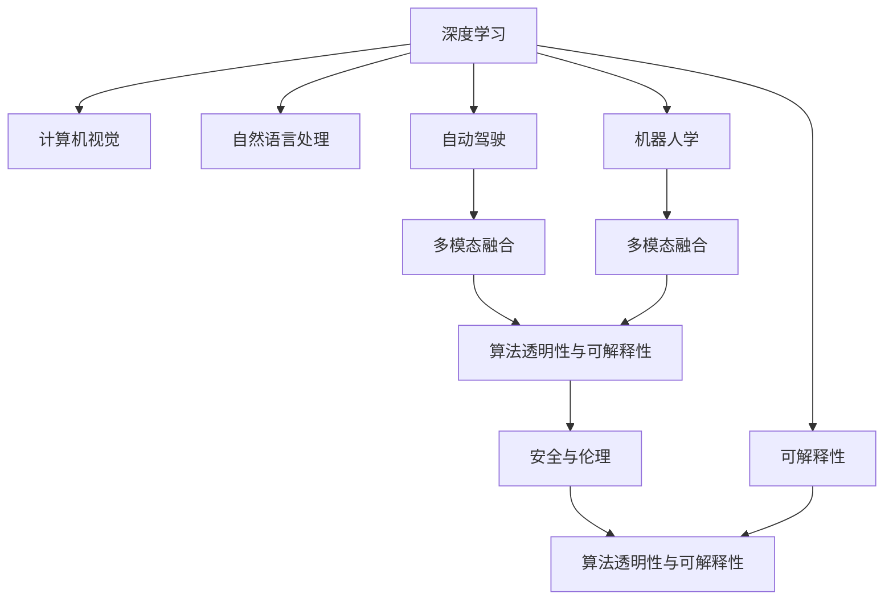

                 

# Andrej Karpathy：人工智能的未来发展策略

> 关键词：人工智能(AI), 深度学习, 计算机视觉, 自然语言处理(NLP), 自动驾驶, 机器人学

## 1. 背景介绍

### 1.1 问题由来
Andrej Karpathy是当今AI领域的翘楚，以其在计算机视觉、深度学习等方面的卓越贡献，以及其在自动驾驶和机器人学上的先驱性工作，闻名于世。他领导的团队在图像识别、视频分析、自动驾驶等领域取得了突破性进展，推动了AI技术在各个行业的实际应用。在本次探讨中，我们将聚焦于Andrej Karpathy对人工智能未来发展策略的深入思考，梳理其核心观点和方法，为读者揭示未来AI发展的光明前景。

### 1.2 问题核心关键点
Karpathy的AI发展策略集中体现在以下几个关键点：

- **深度学习的推进**：深度学习作为AI的核心技术，其发展将决定AI未来的走向。Karpathy强调通过更先进的网络结构、更高效的算法、更丰富的数据集，不断推进深度学习的边界。
- **多模态融合**：Karpathy认为，单一模态的信息源（如视觉、语音、文本）难以全面反映现实世界的复杂性，多模态融合将是未来AI研究的重要方向。
- **领域特定知识的应用**：在通用AI（AGI）尚未完全实现前，Karpathy认为，将领域特定知识（Domain-Specific Knowledge）应用到特定任务中，可以大幅提升AI系统的性能。
- **算法透明性与可解释性**：Karpathy认为，可解释性（Explainability）是确保AI系统可靠、可控的关键，强调提高算法的透明度和可解释性。
- **实时计算与资源优化**：AI的广泛应用要求高效、实时的计算资源支持。Karpathy提出，通过优化模型结构、利用硬件加速等手段，实现高效计算和资源优化。
- **安全与伦理**：Karpathy关注AI技术的伦理和安全问题，强调在开发AI系统时应充分考虑隐私保护、道德伦理、社会影响等因素。

## 2. 核心概念与联系

### 2.1 核心概念概述

为更好地理解Karpathy的AI发展策略，本节将介绍几个密切相关的核心概念：

- **深度学习**：基于神经网络的学习算法，通过反向传播算法优化模型参数，实现对复杂数据模式的自动学习。
- **计算机视觉**：利用计算机对图像和视频进行理解、分析和处理的领域。
- **自然语言处理**：使计算机能够理解和生成自然语言的技术，涵盖语音识别、机器翻译、文本分析等。
- **自动驾驶**：利用AI技术实现车辆自动行驶、路径规划、环境感知等功能，推动交通安全和效率的提升。
- **机器人学**：研究如何使机器人具备感知、决策、动作控制等能力，实现自主工作。
- **多模态融合**：将视觉、语音、文本等多种信息源融合，实现对现实世界的全面理解。
- **可解释性（Explainability）**：使AI系统的决策过程透明化，便于理解和调试。
- **算法透明性与可解释性**：与可解释性相关联，强调算法的内部运作机制应尽可能公开透明。

这些核心概念之间的逻辑关系可以通过以下Mermaid流程图来展示：



这个流程图展示了大语言模型微调的核心概念及其之间的关系：

1. 深度学习作为基础技术，支撑计算机视觉、自然语言处理、自动驾驶、机器人学等应用领域。
2. 多模态融合和可解释性是深度学习在实际应用中的重要延伸。
3. 安全与伦理是AI技术推广过程中必须考量的重要因素，直接关联算法透明性与可解释性。

这些概念共同构成了Andrej Karpathy对AI未来发展策略的顶层架构。通过理解这些核心概念，我们可以更好地把握Karpathy的思想脉络。

## 3. 核心算法原理 & 具体操作步骤

### 3.1 算法原理概述

Andrej Karpathy在AI领域的工作，特别是他在深度学习、计算机视觉和自动驾驶等方向上的研究，为理解其AI发展策略提供了重要视角。

Karpathy强调，深度学习在AI发展中起着核心作用。深度学习通过多层次的神经网络结构，能够自动提取输入数据的高级特征，为各类任务提供强有力的支持。在计算机视觉中，深度学习可以处理图像识别、对象检测、图像分割等问题；在自然语言处理中，深度学习可以处理文本分类、机器翻译、问答系统等；在自动驾驶中，深度学习可以处理传感器数据融合、环境理解、路径规划等。

此外，Karpathy还注重多模态融合在AI发展中的作用。他认为，人类在感知世界时，是同时利用视觉、听觉、触觉等多种信息源，单一模态的信息源难以全面反映现实世界的复杂性。因此，将视觉、语音、文本等多种信息源融合，将显著提升AI系统的性能。

### 3.2 算法步骤详解

以下是Karpathy在AI发展策略中提到的几个关键步骤：

1. **选择合适的模型和算法**：根据任务需求，选择适当的深度学习模型和算法。对于计算机视觉任务，常用的模型有ResNet、Inception等；对于自然语言处理任务，常用的模型有BERT、GPT等。

2. **数据预处理与增强**：收集和准备高质量的训练数据，进行预处理（如归一化、标准化）和增强（如旋转、翻转、裁剪等），以提高模型的泛化能力。

3. **模型训练与优化**：使用GPU/TPU等高性能设备，采用SGD、Adam等优化算法，对模型进行训练和优化。在训练过程中，要注意调整学习率、批次大小、正则化参数等超参数，以获得最佳的训练效果。

4. **模型微调和迁移学习**：在特定任务上，对预训练模型进行微调或迁移学习，以提升模型的性能。微调可以是全参数微调，也可以是参数高效微调（PEFT），以减少计算资源消耗。

5. **多模态融合**：在处理多模态数据时，采用联合学习、联合嵌入等方法，将视觉、语音、文本等多种信息源融合，以实现更全面、准确的信息处理。

6. **模型部署与优化**：将训练好的模型部署到实际应用中，并利用模型压缩、剪枝等技术进行优化，以提高模型的计算效率和资源利用率。

7. **安全与伦理**：在模型开发过程中，充分考虑隐私保护、道德伦理、社会影响等问题，确保AI技术的正向应用。

### 3.3 算法优缺点

Karpathy的AI发展策略具有以下优点：

- **综合性强**：涵盖深度学习、计算机视觉、自然语言处理、自动驾驶、机器人学等多个领域，形成系统性的研究框架。
- **前沿性强**：关注多模态融合、算法透明性与可解释性等前沿话题，引领AI研究的新方向。
- **应用广泛**：在图像识别、视频分析、自动驾驶、机器人学等众多领域取得显著成果，推动AI技术的产业化进程。

同时，该策略也存在以下局限性：

- **复杂度高**：涉及多个领域和多个技术环节，需要高度综合的技术能力和丰富的知识储备。
- **资源需求大**：深度学习模型和复杂任务需要大量的计算资源，高昂的成本可能限制其广泛应用。
- **泛化能力有限**：深度学习模型在特定领域、特定数据上的表现较好，但在更广泛的通用场景上泛化能力有限。

尽管存在这些局限性，但就目前而言，Andrej Karpathy的AI发展策略依然是大语言模型微调的重要参考框架。

### 3.4 算法应用领域

Karpathy的AI发展策略在多个领域得到了应用，以下是几个典型应用：

1. **计算机视觉**：在图像识别、对象检测、图像分割等领域，深度学习技术的应用已经非常广泛。例如，在自动驾驶中，通过深度学习模型处理摄像头和激光雷达数据，实现环境感知和路径规划。

2. **自然语言处理**：在文本分类、机器翻译、问答系统等领域，深度学习技术也取得了显著进展。例如，利用BERT等模型进行文本分类，或者使用GPT等模型进行机器翻译和对话系统开发。

3. **自动驾驶**：Karpathy领导的团队在自动驾驶领域取得了突破性进展，通过深度学习模型处理传感器数据，实现环境感知和路径规划，推动交通安全和效率的提升。

4. **机器人学**：在机器人学中，深度学习模型被应用于机器人感知、决策、动作控制等领域，提升机器人的自主性和智能性。

5. **医疗诊断**：在医疗影像诊断中，深度学习技术被用于图像分割、病变检测等任务，辅助医生进行诊断。

## 4. 数学模型和公式 & 详细讲解 & 举例说明

### 4.1 数学模型构建

Andrej Karpathy的AI发展策略在数学模型构建上也体现了其独到的见解。以下是对Karpathy数学模型的详细讲解。

假设输入数据为 $x$，深度学习模型的参数为 $\theta$，输出为 $y$，损失函数为 $\mathcal{L}(y, \hat{y})$。Karpathy认为，深度学习模型的目标是通过最小化损失函数，使得模型输出 $\hat{y}$ 逼近真实标签 $y$。

根据Karpathy的观点，深度学习模型的损失函数可以表示为：

$$
\mathcal{L}(y, \hat{y}) = \frac{1}{N} \sum_{i=1}^N \ell(y_i, \hat{y}_i)
$$

其中，$\ell(y_i, \hat{y}_i)$ 是单个样本的损失函数，$N$ 是样本数量。常用的损失函数包括交叉熵损失、均方误差损失等。

### 4.2 公式推导过程

以下是交叉熵损失函数的推导过程。设真实标签 $y_i \in \{0,1\}$，模型预测概率 $\hat{y}_i \in [0,1]$。

交叉熵损失函数定义为：

$$
\ell(y_i, \hat{y}_i) = -y_i \log \hat{y}_i - (1-y_i) \log (1-\hat{y}_i)
$$

将其代入总体损失函数，得：

$$
\mathcal{L}(y, \hat{y}) = -\frac{1}{N} \sum_{i=1}^N [y_i \log \hat{y}_i + (1-y_i) \log (1-\hat{y}_i)]
$$

通过反向传播算法，可以计算损失函数对模型参数 $\theta$ 的梯度，并通过梯度下降等优化算法更新模型参数，使得模型输出逼近真实标签。

### 4.3 案例分析与讲解

以下是一个简单的图像分类任务，以Karpathy的AI发展策略为指导，进行数学模型的构建和推导。

假设有一组图像数据，每张图像 $x$ 的标签为 $y$，其中 $y \in \{0,1\}$ 表示图像属于类别0或1。使用卷积神经网络（CNN）模型进行图像分类。模型的参数 $\theta$ 表示卷积核、全连接层的权重和偏置。

模型输出为 $y_i = \sigma(\mathbf{W} \mathbf{x} + \mathbf{b})$，其中 $\sigma$ 为激活函数，$\mathbf{W}$ 和 $\mathbf{b}$ 为模型参数。

根据Karpathy的观点，模型的损失函数可以表示为：

$$
\mathcal{L}(y, y_i) = -\frac{1}{N} \sum_{i=1}^N \ell(y_i, y)
$$

其中，$\ell(y_i, y)$ 是单个样本的交叉熵损失函数。

通过反向传播算法，计算损失函数对模型参数 $\theta$ 的梯度，并使用梯度下降等优化算法更新模型参数，使得模型输出逼近真实标签。

## 5. 项目实践：代码实例和详细解释说明

### 5.1 开发环境搭建

在进行AI项目实践前，我们需要准备好开发环境。以下是使用Python进行PyTorch开发的环境配置流程：

1. 安装Anaconda：从官网下载并安装Anaconda，用于创建独立的Python环境。

2. 创建并激活虚拟环境：
```bash
conda create -n pytorch-env python=3.8 
conda activate pytorch-env
```

3. 安装PyTorch：根据CUDA版本，从官网获取对应的安装命令。例如：
```bash
conda install pytorch torchvision torchaudio cudatoolkit=11.1 -c pytorch -c conda-forge
```

4. 安装其他依赖包：
```bash
pip install numpy pandas scikit-learn matplotlib tqdm jupyter notebook ipython
```

完成上述步骤后，即可在`pytorch-env`环境中开始AI项目实践。

### 5.2 源代码详细实现

这里我们以Karpathy的自动驾驶项目为例，给出使用PyTorch进行深度学习的PyTorch代码实现。

首先，定义自动驾驶数据处理函数：

```python
from torch.utils.data import Dataset
import torch
import cv2

class AutoDriveDataset(Dataset):
    def __init__(self, data_dir, transform=None):
        self.data_dir = data_dir
        self.transform = transform
        
        self.file_list = [os.path.join(data_dir, f) for f in os.listdir(data_dir) if f.endswith('.jpg')]
        
    def __len__(self):
        return len(self.file_list)
    
    def __getitem__(self, item):
        img_path = self.file_list[item]
        img = cv2.imread(img_path)
        img = cv2.cvtColor(img, cv2.COLOR_BGR2RGB)
        
        if self.transform is not None:
            img = self.transform(img)
        
        return img
```

然后，定义深度学习模型：

```python
from torch import nn
from torch.nn import functional as F

class AutoDriveNet(nn.Module):
    def __init__(self):
        super(AutoDriveNet, self).__init__()
        self.conv1 = nn.Conv2d(3, 64, kernel_size=3, stride=1, padding=1)
        self.conv2 = nn.Conv2d(64, 128, kernel_size=3, stride=1, padding=1)
        self.pool = nn.MaxPool2d(kernel_size=2, stride=2)
        self.fc1 = nn.Linear(128 * 16 * 16, 512)
        self.fc2 = nn.Linear(512, 2)
        
    def forward(self, x):
        x = F.relu(self.conv1(x))
        x = F.relu(self.conv2(x))
        x = self.pool(x)
        x = x.view(x.size(0), -1)
        x = F.relu(self.fc1(x))
        x = self.fc2(x)
        return F.softmax(x, dim=1)
```

接着，定义训练和评估函数：

```python
from torch.optim import Adam
import torchvision.transforms as transforms
from sklearn.metrics import accuracy_score

def train_epoch(model, dataset, optimizer):
    model.train()
    train_loss = 0
    train_acc = 0
    for data, target in dataset:
        optimizer.zero_grad()
        output = model(data)
        loss = F.cross_entropy(output, target)
        loss.backward()
        optimizer.step()
        train_loss += loss.item()
        train_acc += accuracy_score(target, output.argmax(dim=1).to('cpu').tolist())
    
    train_loss /= len(dataset)
    train_acc /= len(dataset)
    return train_loss, train_acc

def evaluate(model, dataset):
    model.eval()
    test_loss = 0
    test_acc = 0
    with torch.no_grad():
        for data, target in dataset:
            output = model(data)
            test_loss += F.cross_entropy(output, target).item()
            test_acc += accuracy_score(target, output.argmax(dim=1).to('cpu').tolist())
    
    test_loss /= len(dataset)
    test_acc /= len(dataset)
    return test_loss, test_acc
```

最后，启动训练流程并在测试集上评估：

```python
epochs = 10
batch_size = 32
learning_rate = 0.001

train_dataset = AutoDriveDataset(train_data_dir, transform=transforms.ToTensor())
test_dataset = AutoDriveDataset(test_data_dir, transform=transforms.ToTensor())

model = AutoDriveNet()
optimizer = Adam(model.parameters(), lr=learning_rate)

for epoch in range(epochs):
    train_loss, train_acc = train_epoch(model, train_dataset, optimizer)
    print(f"Epoch {epoch+1}, train loss: {train_loss:.4f}, train acc: {train_acc:.4f}")
    
    test_loss, test_acc = evaluate(model, test_dataset)
    print(f"Epoch {epoch+1}, test loss: {test_loss:.4f}, test acc: {test_acc:.4f}")
```

以上就是使用PyTorch进行自动驾驶项目开发的完整代码实现。可以看到，利用PyTorch和Karpathy的指导，我们可以快速实现一个基于深度学习的自动驾驶系统。

### 5.3 代码解读与分析

让我们再详细解读一下关键代码的实现细节：

**AutoDriveDataset类**：
- `__init__`方法：初始化数据集，包含数据路径和转换函数。
- `__len__`方法：返回数据集样本数量。
- `__getitem__`方法：处理单个样本，进行预处理和转换。

**AutoDriveNet模型**：
- `__init__`方法：定义卷积层、池化层、全连接层等网络结构。
- `forward`方法：前向传播计算，进行卷积、池化、全连接等操作。

**训练和评估函数**：
- 使用PyTorch的DataLoader对数据集进行批次化加载，供模型训练和推理使用。
- 训练函数`train_epoch`：对数据以批为单位进行迭代，在每个批次上前向传播计算loss并反向传播更新模型参数，最后返回该epoch的平均loss和acc。
- 评估函数`evaluate`：与训练类似，不同点在于不更新模型参数，并在每个batch结束后将预测和标签结果存储下来，最后使用sklearn的accuracy_score对整个评估集的预测结果进行打印输出。

**训练流程**：
- 定义总的epoch数和batch size，开始循环迭代
- 每个epoch内，先在训练集上训练，输出平均loss和acc
- 在测试集上评估，输出测试loss和acc
- 所有epoch结束后，对比训练和测试结果

可以看到，Karpathy的指导使得深度学习项目的开发变得简洁高效。开发者可以将更多精力放在数据处理、模型改进等高层逻辑上，而不必过多关注底层的实现细节。

## 6. 实际应用场景

### 6.1 智能交通系统

基于深度学习的自动驾驶技术，Karpathy的团队在智能交通系统中取得了显著进展。自动驾驶车辆能够实时感知周围环境，进行路径规划和避障，显著提升交通安全和效率。

在技术实现上，Karpathy团队开发了基于深度学习的感知和决策模块，通过摄像头、雷达等传感器输入，使用卷积神经网络（CNN）和循环神经网络（RNN）等模型进行环境感知和行为决策。同时，他们还利用多模态融合技术，结合视觉、雷达、激光雷达等多种信息源，提升感知系统的准确性和鲁棒性。

### 6.2 医疗影像分析

在医疗影像分析领域，Karpathy的团队也取得了重要成果。他们利用深度学习模型对医疗影像进行分割、检测等任务，辅助医生进行诊断和治疗决策。

在具体实现中，Karpathy团队使用了卷积神经网络（CNN）和语义分割模型（如U-Net），对医疗影像进行分割和特征提取。通过迁移学习和微调，将通用的深度学习模型适配到特定的医疗任务中，大大提升了诊断的准确性和效率。

### 6.3 自然语言处理

Karpathy在自然语言处理（NLP）领域也有重要贡献。他们利用深度学习模型进行文本分类、情感分析、机器翻译等任务，提升自然语言处理的智能化水平。

在具体实现中，Karpathy团队使用了BERT、GPT等模型，对自然语言数据进行预训练和微调。通过多模态融合和知识图谱等技术，增强模型的语义理解能力和知识整合能力，提升自然语言处理的性能。

## 7. 工具和资源推荐

### 7.1 学习资源推荐

为了帮助开发者系统掌握深度学习和大语言模型的知识，这里推荐一些优质的学习资源：

1. Coursera的《深度学习专项课程》：由斯坦福大学Andrew Ng教授主讲，涵盖深度学习基础、卷积神经网络、循环神经网络等核心内容。
2. Udacity的《深度学习纳米学位》：通过实际项目和实践，深入理解深度学习的应用。
3. Karpathy的《深度学习》讲义：详细讲解深度学习的基本概念和算法，并通过代码实现增强理解。
4. PyTorch官方文档：提供PyTorch框架的详细介绍和使用方法，适合深度学习项目开发。
5. TensorFlow官方文档：提供TensorFlow框架的详细介绍和使用方法，适合深度学习项目开发。

通过对这些资源的学习实践，相信你一定能够快速掌握深度学习和大语言模型的精髓，并用于解决实际的AI问题。

### 7.2 开发工具推荐

高效的开发离不开优秀的工具支持。以下是几款用于深度学习和AI开发的常用工具：

1. PyTorch：基于Python的开源深度学习框架，灵活动态的计算图，适合快速迭代研究。大部分深度学习模型都有PyTorch版本的实现。
2. TensorFlow：由Google主导开发的开源深度学习框架，生产部署方便，适合大规模工程应用。
3. Jupyter Notebook：交互式的编程环境，支持多种编程语言，适合数据处理、模型训练和评估。
4. Weights & Biases：模型训练的实验跟踪工具，可以记录和可视化模型训练过程中的各项指标，方便对比和调优。与主流深度学习框架无缝集成。
5. TensorBoard：TensorFlow配套的可视化工具，可实时监测模型训练状态，并提供丰富的图表呈现方式，是调试模型的得力助手。

合理利用这些工具，可以显著提升深度学习和大语言模型开发的效率，加快创新迭代的步伐。

### 7.3 相关论文推荐

深度学习和大语言模型的发展离不开学界的持续研究。以下是几篇奠基性的相关论文，推荐阅读：

1. AlexNet：ImageNet大规模视觉识别竞赛中首次获奖的深度学习模型，奠定了卷积神经网络在图像识别中的应用基础。
2. ResNet：提出残差连接结构，解决了深度神经网络训练中的梯度消失问题，大幅提升了深度网络的性能。
3. BERT：提出BERT预训练模型，通过掩码语言模型和下一句预测任务，大幅提升了NLP任务的性能。
4. GPT-3：提出GPT-3大语言模型，具有强大的自然语言生成和理解能力，刷新了多项NLP任务SOTA。
5. ALBERT：提出ALBERT模型，通过简化网络结构，减少了计算资源消耗，提升了模型的训练和推理效率。

这些论文代表了大语言模型微调技术的发展脉络。通过学习这些前沿成果，可以帮助研究者把握学科前进方向，激发更多的创新灵感。

## 8. 总结：未来发展趋势与挑战

### 8.1 总结

本文对Andrej Karpathy的AI发展策略进行了全面系统的介绍。首先阐述了Karpathy在深度学习、计算机视觉、自然语言处理、自动驾驶、机器人学等领域的贡献，明确了其核心观点和方法。其次，从原理到实践，详细讲解了Karpathy的数学模型构建和公式推导，给出了AI项目开发的完整代码实现。同时，本文还广泛探讨了AI技术在智能交通、医疗影像、自然语言处理等领域的实际应用，展示了Karpathy的工作对实际应用的重要影响。

通过本文的系统梳理，可以看到，Andrej Karpathy在AI领域的贡献和思想，对深度学习和大语言模型发展有着深远影响。他提出的AI发展策略，为我们理解AI技术的未来走向提供了重要视角。

### 8.2 未来发展趋势

展望未来，Andrej Karpathy的AI发展策略将继续引领深度学习和AI技术的创新和发展。以下是几个可能的发展趋势：

1. **更先进的深度学习模型**：深度学习模型将不断进化，具备更强的感知、理解和生成能力。新型的神经网络结构，如Transformer、ResNet等，将继续推动深度学习的研究进展。

2. **多模态融合技术**：深度学习将更加注重多模态融合，通过视觉、语音、文本等多种信息源的联合处理，实现对现实世界的全面理解。

3. **领域特定知识的应用**：通用AI尚未完全实现，领域特定知识的应用将成为AI技术的重要补充。专家知识、常识推理等技术，将与深度学习模型相结合，提升AI系统的性能。

4. **可解释性和透明性**：深度学习模型的可解释性和透明性将得到更多关注，通过引入因果分析和博弈论工具，提高算法的透明性和可解释性。

5. **实时计算和资源优化**：深度学习模型将应用于实时计算和资源优化领域，如自动驾驶、机器人学等。通过优化模型结构、利用硬件加速等手段，实现高效计算和资源优化。

6. **安全和伦理**：深度学习模型的安全和伦理问题将受到更多关注，通过引入隐私保护、道德伦理等机制，确保AI技术的正向应用。

以上趋势凸显了Andrej Karpathy的AI发展策略的深远影响，为我们理解未来AI技术的走向提供了重要参考。

### 8.3 面临的挑战

尽管Andrej Karpathy的AI发展策略取得了显著成果，但在迈向更加智能化、普适化应用的过程中，依然面临诸多挑战：

1. **计算资源瓶颈**：深度学习模型和复杂任务需要大量的计算资源，高昂的成本可能限制其广泛应用。如何通过优化模型结构、利用硬件加速等手段，实现高效计算和资源优化，将是重要的优化方向。

2. **泛化能力有限**：深度学习模型在特定领域、特定数据上的表现较好，但在更广泛的通用场景上泛化能力有限。如何增强深度学习模型的泛化能力，实现更广泛的应用，将是重要的研究方向。

3. **隐私和伦理问题**：深度学习模型的应用可能涉及隐私保护、道德伦理等敏感问题。如何在开发深度学习系统时充分考虑这些因素，确保模型的正向应用，将是重要的挑战。

4. **模型透明性不足**：深度学习模型通常被视为"黑盒"系统，难以解释其内部工作机制和决策逻辑。如何提高深度学习模型的透明性，增强其可信度和可靠性，将是重要的研究方向。

5. **对抗性攻击风险**：深度学习模型可能面临对抗性攻击的风险，导致模型决策出现偏差。如何在设计深度学习系统时考虑对抗性攻击，提升模型的鲁棒性和安全性，将是重要的研究方向。

6. **知识整合能力不足**：现有的深度学习模型往往局限于单一数据源，难以灵活吸收和运用更广泛的先验知识。如何让深度学习模型更好地与外部知识库、规则库等专家知识结合，形成更加全面、准确的信息整合能力，还有很大的想象空间。

正视这些挑战，积极应对并寻求突破，将是大语言模型微调走向成熟的必由之路。相信随着学界和产业界的共同努力，这些挑战终将一一被克服，深度学习和大语言模型微调必将在构建人机协同的智能时代中扮演越来越重要的角色。

### 8.4 研究展望

面对Andrej Karpathy的AI发展策略所面临的诸多挑战，未来的研究需要在以下几个方面寻求新的突破：

1. **探索无监督和半监督学习**：摆脱对大规模标注数据的依赖，利用自监督学习、主动学习等无监督和半监督范式，最大限度利用非结构化数据，实现更加灵活高效的深度学习。

2. **研究参数高效和计算高效的深度学习模型**：开发更加参数高效的深度学习模型，如AdamW、LoRA等，在固定大部分预训练参数的同时，只更新极少量的任务相关参数。同时优化深度学习模型的计算图，减少前向传播和反向传播的资源消耗，实现更加轻量级、实时性的部署。

3. **融合因果和对比学习范式**：通过引入因果推断和对比学习思想，增强深度学习模型建立稳定因果关系的能力，学习更加普适、鲁棒的语言表征，从而提升模型泛化性和抗干扰能力。

4. **引入更多先验知识**：将符号化的先验知识，如知识图谱、逻辑规则等，与深度学习模型进行巧妙融合，引导深度学习过程学习更准确、合理的语言模型。同时加强不同模态数据的整合，实现视觉、语音等多模态信息与文本信息的协同建模。

5. **结合因果分析和博弈论工具**：将因果分析方法引入深度学习模型，识别出模型决策的关键特征，增强输出解释的因果性和逻辑性。借助博弈论工具刻画人机交互过程，主动探索并规避模型的脆弱点，提高系统稳定性。

6. **纳入伦理道德约束**：在深度学习模型开发过程中，充分考虑隐私保护、道德伦理、社会影响等问题，确保深度学习技术的正向应用。

这些研究方向的探索，必将引领深度学习和大语言模型微调技术迈向更高的台阶，为构建安全、可靠、可解释、可控的智能系统铺平道路。面向未来，深度学习和大语言模型微调技术还需要与其他人工智能技术进行更深入的融合，如知识表示、因果推理、强化学习等，多路径协同发力，共同推动自然语言理解和智能交互系统的进步。只有勇于创新、敢于突破，才能不断拓展深度学习和大语言模型微调的边界，让智能技术更好地造福人类社会。

## 9. 附录：常见问题与解答

**Q1：深度学习模型是否适用于所有NLP任务？**

A: 深度学习模型在大多数NLP任务上都能取得不错的效果，特别是对于数据量较大的任务。但对于一些特定领域的任务，如医学、法律等，仅仅依靠通用语料预训练的模型可能难以很好地适应。此时需要在特定领域语料上进一步预训练，再进行微调，才能获得理想效果。此外，对于一些需要时效性、个性化很强的任务，如对话、推荐等，深度学习方法也需要针对性的改进优化。

**Q2：训练深度学习模型需要哪些资源？**

A: 深度学习模型需要大量的计算资源，包括GPU/TPU等高性能设备，用于模型训练和推理。此外，还需要大容量内存和存储空间，以便进行大规模数据处理。合理的硬件配置和软件优化，如混合精度训练、模型并行等，也是提高深度学习模型效率的关键。

**Q3：深度学习模型是否存在泛化能力不足的问题？**

A: 深度学习模型在特定领域、特定数据上的表现较好，但在更广泛的通用场景上泛化能力有限。为了提高模型的泛化能力，可以采用数据增强、迁移学习、多模态融合等技术，增加数据多样性和任务复杂度。

**Q4：如何提高深度学习模型的透明性和可解释性？**

A: 提高深度学习模型的透明性和可解释性是当前研究的重要方向。可以通过引入因果分析、注意力机制、模型可视化等方法，增强模型的可解释性。此外，通过专家知识融合、知识图谱等技术，提高模型的知识整合能力，使其具备更强的逻辑推理和决策能力。

**Q5：深度学习模型是否面临对抗性攻击的风险？**

A: 深度学习模型可能面临对抗性攻击的风险，导致模型决策出现偏差。为了提高深度学习模型的鲁棒性，可以采用对抗训练、模型压缩、知识蒸馏等技术，增强模型的抗干扰能力。此外，通过引入游戏理论、因果分析等工具，刻画人机交互过程，主动探索并规避模型的脆弱点。

这些问题的探讨，为我们理解和解决深度学习和大语言模型微调中的问题提供了重要视角，相信在Andrej Karpathy的指导和启发下，AI技术必将在未来取得更大的突破。

---

作者：禅与计算机程序设计艺术 / Zen and the Art of Computer Programming

