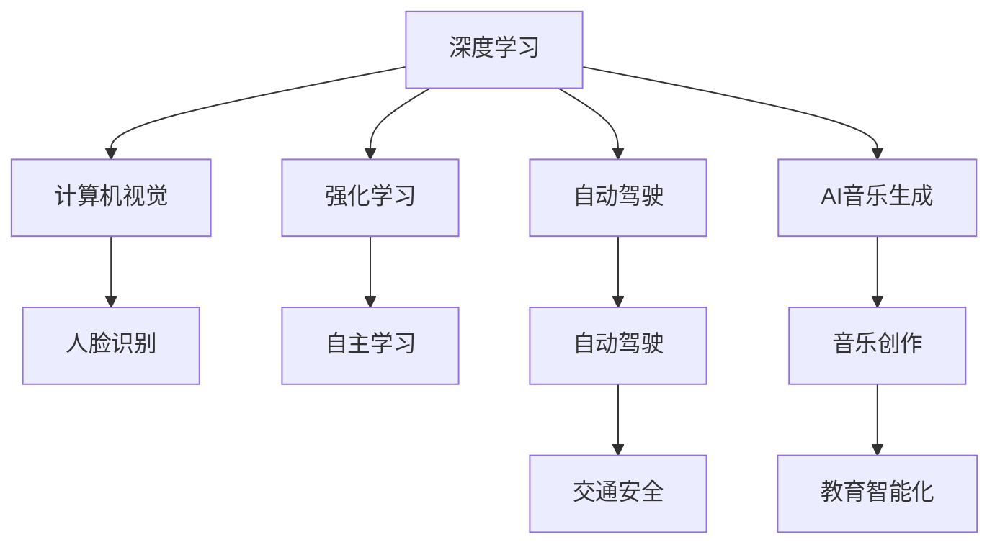

                 

# Andrej Karpathy：人工智能的未来发展策略

在现代科技的浪潮中，人工智能（AI）正以摧枯拉朽之势，深刻影响着我们生活的方方面面。深度学习、神经网络、强化学习等前沿技术，已经从科研前沿走入了普通人的日常生活。 Andrej Karpathy，作为AI领域的先锋，不仅在学术界取得了卓越成就，更通过实际应用，展现了AI技术的巨大潜力。本文将基于Andrej Karpathy的最新研究成果和实践经验，深入探讨AI的未来发展策略，为AI技术的应用前景和挑战提供深刻见解。

## 1. 背景介绍

Andrej Karpathy，斯坦福大学计算机科学系教授，同时也是人工智能研究和开发公司NVIDIA的杰出科学家。他在深度学习、计算机视觉、自动驾驶等领域均有开创性贡献，其作品《深度学习》一书深受读者喜爱，成为了行业标准的教材之一。他的研究不仅推动了AI技术的进步，更通过实际应用，开创了AI技术在工业界的广阔前景。

Karpathy的研究方向跨越多个领域，从无人驾驶、计算机视觉到AI音乐生成，涵盖了AI技术的各个重要应用场景。他的研究成果不仅在学术界产生了深远影响，也通过实际应用，提升了社会的数字化水平，引领了AI技术的发展方向。

## 2. 核心概念与联系

在探讨AI的未来发展策略之前，我们先对一些核心概念进行梳理：

- **深度学习**：通过神经网络模拟人脑的工作原理，通过大量数据训练，实现对复杂模式的识别和预测。
- **计算机视觉**：使计算机能够“看”和“理解”图像和视频内容，广泛应用于自动驾驶、人脸识别等领域。
- **强化学习**：通过与环境的交互，通过奖励机制优化决策策略，使AI系统具备自主学习的能力。
- **自动驾驶**：实现汽车的自动驾驶，提升交通安全，减少交通拥堵。
- **AI音乐生成**：利用深度学习生成音乐，推动音乐创作和教育的智能化。

这些核心概念之间的联系通过以下Mermaid流程图来展示：



这个流程图展示了一个深度学习驱动的多领域AI应用框架，每个概念都作为其他概念的支撑，共同构建了AI技术的生态系统。

## 3. 核心算法原理 & 具体操作步骤

### 3.1 算法原理概述

Andrej Karpathy的研究涵盖了多个领域，但无论是深度学习、计算机视觉还是强化学习，其核心思想都是通过数据驱动的模型训练，使机器能够“学习”和“理解”复杂的现象。在自动驾驶和AI音乐生成等领域，这种学习过程更是将AI与现实世界的互动推向了新的高度。

以自动驾驶为例，其核心算法包括：

- **传感器融合**：将多种传感器（如摄像头、雷达、激光雷达）的数据进行融合，形成对环境的全面感知。
- **路径规划**：通过深度学习模型，生成最优的驾驶路径。
- **决策优化**：基于强化学习，通过奖励机制优化驾驶决策，提升驾驶的安全性和效率。
- **环境模拟**：通过模拟环境训练模型，确保模型在现实世界中的泛化能力。

### 3.2 算法步骤详解

自动驾驶的算法步骤包括以下几个关键环节：

1. **数据采集**：收集大量的驾驶数据，涵盖各种环境和路况，形成大规模训练集。
2. **数据预处理**：对采集的数据进行清洗、标注，形成可用于训练的样本。
3. **模型训练**：使用深度学习模型进行训练，优化路径规划和决策策略。
4. **模拟测试**：在虚拟环境中测试模型，确保其在各种情况下的性能。
5. **实际部署**：将模型部署到实际车辆中，进行小规模试验。
6. **迭代优化**：根据实际运行数据，持续优化模型参数和决策策略，提高安全性。

### 3.3 算法优缺点

深度学习在自动驾驶中的应用具有以下优点：

- **强大的泛化能力**：能够从大量数据中学习复杂的模式，适应不同的环境。
- **高效的自主学习**：通过强化学习，模型能够不断优化驾驶策略，提升驾驶性能。

同时，深度学习也存在一些局限：

- **数据依赖**：模型的性能高度依赖于数据的质量和数量，数据采集成本高。
- **训练时间长**：大规模模型的训练需要耗费大量时间和计算资源。
- **可解释性差**：深度学习的决策过程难以解释，难以进行调试和优化。

### 3.4 算法应用领域

深度学习在AI领域的广泛应用涵盖了多个领域，以下是一些主要应用场景：

- **自动驾驶**：通过计算机视觉和强化学习，实现汽车自动驾驶，提升交通安全和交通效率。
- **图像识别**：在医疗、安防、电商等领域，通过深度学习实现图像的自动识别和分类。
- **语音识别**：将语音转换为文本，实现智能客服、语音助手等应用。
- **自然语言处理**：通过深度学习，实现机器翻译、文本摘要、情感分析等任务。
- **音乐生成**：利用深度学习生成音乐，推动音乐创作和教育的智能化。
- **游戏AI**：通过深度学习实现游戏中的自主决策，提高游戏体验。

## 4. 数学模型和公式 & 详细讲解

### 4.1 数学模型构建

以深度学习中的卷积神经网络（CNN）为例，其核心模型构建如下：

- **输入层**：接收原始的图像数据，形成图像像素的特征向量。
- **卷积层**：通过卷积运算，提取图像的局部特征。
- **池化层**：通过池化操作，减少特征向量的大小。
- **全连接层**：将池化层输出的特征向量进行分类或回归。

### 4.2 公式推导过程

以CNN的卷积运算为例，其公式推导过程如下：

$$
f_{\mathrm{cnn}}(x) = \sigma\left(\sum_{i=1}^{n} \sum_{j=1}^{m} w_{i j} f_{i}(x_{i-1})\right)
$$

其中，$x$为输入的图像数据，$w_{i j}$为卷积核，$f_{i}$为前一层的特征向量，$\sigma$为激活函数。

### 4.3 案例分析与讲解

在实际应用中，CNN常用于图像识别任务。以手写数字识别为例，CNN模型通过多层的卷积和池化操作，提取手写数字的特征，并通过全连接层进行分类。模型训练过程中，通过反向传播算法，不断调整卷积核和激活函数的参数，提升模型的识别准确率。

## 5. 项目实践：代码实例和详细解释说明

### 5.1 开发环境搭建

在进行深度学习项目开发时，需要搭建相应的开发环境。以下是一些推荐的开发环境搭建步骤：

1. **安装Python和相关库**：确保安装了Python 3.8及以上版本，并安装了TensorFlow、Keras、OpenCV等深度学习相关库。
2. **安装GPU**：如果使用的是GPU加速，确保安装了CUDA和cuDNN，并更新到最新版本。
3. **配置开发工具**：如Jupyter Notebook、PyCharm等，提供高效的代码编写和调试环境。

### 5.2 源代码详细实现

以下是一个简单的卷积神经网络代码实现，用于手写数字识别：

```python
import tensorflow as tf
from tensorflow.keras import layers, models

model = models.Sequential()
model.add(layers.Conv2D(32, (3, 3), activation='relu', input_shape=(28, 28, 1)))
model.add(layers.MaxPooling2D((2, 2)))
model.add(layers.Conv2D(64, (3, 3), activation='relu'))
model.add(layers.MaxPooling2D((2, 2)))
model.add(layers.Conv2D(64, (3, 3), activation='relu'))
model.add(layers.Flatten())
model.add(layers.Dense(64, activation='relu'))
model.add(layers.Dense(10))

model.compile(optimizer='adam',
              loss=tf.keras.losses.SparseCategoricalCrossentropy(from_logits=True),
              metrics=['accuracy'])

model.fit(train_images, train_labels, epochs=5, 
          validation_data=(test_images, test_labels))
```

### 5.3 代码解读与分析

- **模型构建**：使用Sequential模型，逐层添加卷积层、池化层和全连接层。
- **损失函数**：使用SparseCategoricalCrossentropy损失函数，适用于多分类任务。
- **优化器**：使用Adam优化器，快速收敛。

## 6. 实际应用场景

### 6.1 自动驾驶

自动驾驶是深度学习在AI领域的重要应用之一，其核心在于实现对复杂环境的感知和决策优化。通过计算机视觉技术，自动驾驶系统能够实时感知道路、车辆、行人等环境信息，并通过强化学习算法进行路径规划和决策优化，提升驾驶的安全性和效率。

### 6.2 医学影像分析

深度学习在医学影像分析中也有广泛应用。通过卷积神经网络，系统能够自动识别医学影像中的病变区域，辅助医生进行诊断和治疗。例如，在乳腺癌的早期筛查中，深度学习模型能够快速分析乳腺X光片，识别出可疑病灶，提升筛查的准确率。

### 6.3 AI音乐生成

AI音乐生成是深度学习在艺术领域的重要应用之一。通过生成对抗网络（GAN）等模型，AI可以创作出风格各异的音乐，推动音乐创作和教育的智能化。例如，OpenAI开发的DALL·E等模型，能够根据文本描述生成音乐，提升创作效率和作品多样性。

## 7. 工具和资源推荐

### 7.1 学习资源推荐

- **《深度学习》（第三版）**：Andrej Karpathy的著作，全面介绍深度学习的理论和实践，适合深度学习初学者。
- **《计算机视觉：算法与应用》**：斯坦福大学计算机视觉课程，涵盖计算机视觉的基础理论和实践技巧。
- **Kaggle竞赛平台**：提供大量深度学习竞赛数据集，可以练习并提升模型性能。
- **Coursera深度学习课程**：涵盖深度学习的各个方面，包括卷积神经网络、递归神经网络等。

### 7.2 开发工具推荐

- **PyTorch**：由Facebook开发的深度学习框架，支持动态图，易于调试和优化。
- **TensorFlow**：Google开发的深度学习框架，支持分布式训练和生产部署。
- **Keras**：高层次的深度学习框架，支持快速搭建和训练模型。
- **Jupyter Notebook**：提供交互式的代码编写和调试环境。
- **PyCharm**：功能强大的Python IDE，支持深度学习项目开发。

### 7.3 相关论文推荐

- **《图像中的物体识别与分类》**：提出卷积神经网络，开创计算机视觉新纪元。
- **《大规模可视化训练的神经网络》**：提出使用GPU加速深度学习训练，提升模型性能。
- **《端到端学习》**：提出使用端到端模型进行语音识别和文本生成。

## 8. 总结：未来发展趋势与挑战

### 8.1 研究成果总结

Andrej Karpathy的研究涵盖了深度学习、计算机视觉、自动驾驶等多个领域，推动了AI技术的广泛应用。他的研究成果不仅在学术界产生了深远影响，也通过实际应用，提升了社会的数字化水平。

### 8.2 未来发展趋势

未来，AI技术将进一步普及和深化，主要趋势包括：

- **智能化生产**：通过AI技术优化生产流程，提升生产效率。
- **智慧城市**：通过AI技术构建智慧城市，提升城市治理能力。
- **个性化服务**：通过AI技术提供个性化服务，提升用户体验。
- **自动化决策**：通过AI技术进行自动化决策，提升决策效率和准确性。

### 8.3 面临的挑战

尽管AI技术取得了巨大进展，但仍面临一些挑战：

- **数据隐私和安全**：AI系统需要大量数据训练，如何保护数据隐私和安全是一个重要问题。
- **模型可解释性**：AI系统的决策过程难以解释，缺乏透明性。
- **技术伦理**：AI技术的应用可能带来伦理问题，如算法偏见、歧视等。
- **技术壁垒**：AI技术的复杂性和高门槛，限制了其普及应用。

### 8.4 研究展望

未来，AI技术的研究和应用需要更多跨学科的协同合作，共同解决技术伦理、数据隐私、可解释性等问题。同时，需要加强技术普及和教育，提升公众对AI技术的理解和接受度。

## 9. 附录：常见问题与解答

**Q1：深度学习模型的训练时间是否会越来越长？**

A: 随着模型参数的增加和数据的复杂化，深度学习模型的训练时间可能会越来越长。但随着硬件的进步和算法的优化，训练时间也在逐步缩短。通过使用GPU、TPU等高性能计算设备，可以在短时间内完成模型的训练。

**Q2：深度学习模型的可解释性是否会影响其应用？**

A: 深度学习模型的可解释性是一个重要问题。模型决策过程的透明度和可解释性，对于医疗、金融等高风险领域尤为重要。未来，研究人员正在积极探索通过模型简化和可视化等方法，提升深度学习模型的可解释性。

**Q3：AI技术在实际应用中是否会遇到数据隐私问题？**

A: AI技术的应用需要大量数据训练，数据隐私和安全是一个重要问题。研究人员正在探索数据匿名化和差分隐私等技术，保护用户数据隐私。同时，需要制定相关法规和标准，规范AI技术的应用。

**Q4：AI技术如何应对算法偏见问题？**

A: 算法偏见是一个重要问题，需要通过数据收集、模型设计和算法监督等多个环节进行控制。例如，在数据采集时，确保数据的多样性和代表性；在设计模型时，引入公平性约束和偏见检测机制。同时，需要加强算法监督和审查，确保AI系统的公平性和透明性。

**Q5：如何平衡AI技术的性能和成本？**

A: 在AI技术应用中，性能和成本是一个重要的平衡问题。需要通过优化模型架构、选择合适的硬件设备、采用高效的算法等手段，降低技术成本，提升技术性能。同时，需要根据实际应用场景进行权衡，选择最适合的解决方案。

---

作者：禅与计算机程序设计艺术 / Zen and the Art of Computer Programming

