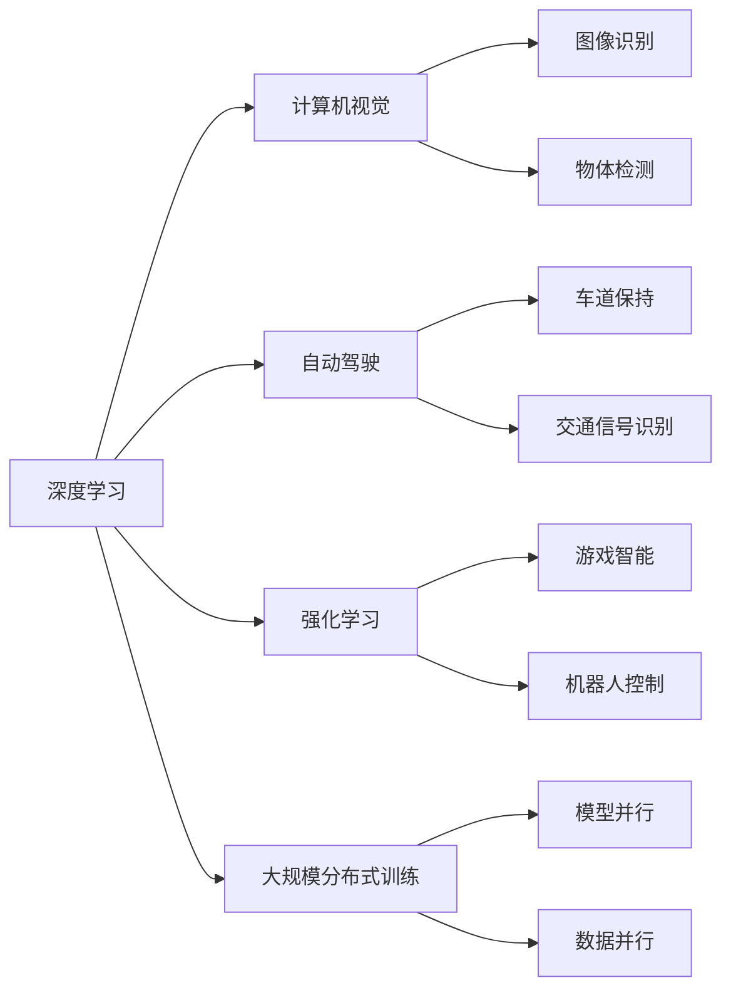

                 

# Andrej Karpathy：人工智能的未来发展规划

## 1. 背景介绍

### 1.1 问题由来

Andrej Karpathy，著名人工智能专家、程序员、软件架构师，曾任OpenAI首席技术官(CTO)、特斯拉高级AI主管，现为斯坦福大学计算机科学与人工智能教授。Karpathy在深度学习、计算机视觉、自动驾驶等领域具有深厚的研究基础和丰富的实践经验，被公认为AI界的先锋之一。

### 1.2 问题核心关键点

Andrej Karpathy在多次公开演讲和采访中，对人工智能的未来发展提出了诸多独到见解和预测，涵盖技术路线、应用场景、伦理道德等多方面内容。以下将重点介绍其对未来AI发展规划的核心观点，包括技术演进趋势、关键应用领域、面临的挑战与应对策略等。

## 2. 核心概念与联系

### 2.1 核心概念概述

为了更好地理解Andrej Karpathy对AI未来发展规划的思考，首先简要介绍几个核心概念：

- **深度学习(Deep Learning)**：一种基于神经网络的机器学习范式，通过多层非线性变换提取数据中的高级特征，广泛应用于图像、语音、自然语言处理等领域。

- **计算机视觉(Computer Vision)**：使用计算机对图像和视频数据进行处理和分析，实现识别、分类、分割等任务。

- **自动驾驶(Autonomous Driving)**：通过传感器、计算平台和算法，使车辆能够自动导航、避障，实现无人驾驶。

- **强化学习(Reinforcement Learning)**：通过智能体与环境交互，基于奖励信号进行策略优化，适用于游戏、机器人等领域。

- **大规模分布式训练(Distributed Training)**：利用多台计算机协同计算，提升深度学习模型的训练效率，支持更复杂的模型和大规模数据集。

### 2.2 核心概念原理和架构的 Mermaid 流程图(Mermaid 流程节点中不要有括号、逗号等特殊字符)



## 3. 核心算法原理 & 具体操作步骤

### 3.1 算法原理概述

Andrej Karpathy认为，未来人工智能的发展将从以下几个关键维度展开：

- **深度学习技术演进**：深度神经网络的结构和算法将继续优化，增强模型的表示能力，提升训练效率和性能。
- **大规模数据和计算能力**：随着数据量的增加和计算能力的提升，深度学习模型将进一步扩大规模，处理更复杂的数据结构。
- **跨领域知识融合**：将不同领域的专业知识和统计模型与深度学习算法结合，提升AI模型的泛化能力和应用范围。
- **强化学习与模拟优化**：强化学习将在大规模模拟环境中被广泛应用，实现智能体的高效学习和优化。
- **大规模分布式训练**：利用分布式计算框架，提升深度学习模型的训练速度和可扩展性，支持更复杂的任务。
- **多模态融合与跨模态学习**：将视觉、语音、文本等多模态数据融合，实现跨模态学习的突破，提升模型的理解能力。
- **自我监督学习与自监督训练**：在大规模无标签数据上训练深度学习模型，通过自我监督学习发现数据中的结构性信息。
- **对抗训练与鲁棒性提升**：通过对抗样本训练，提升模型的鲁棒性和泛化能力，避免过拟合和模型脆弱。
- **强化学习与多智能体系统**：探索多智能体系统中的策略协同，提升复杂环境下的决策能力。

### 3.2 算法步骤详解

以下将详细介绍Andrej Karpathy对未来AI发展规划的核心算法步骤和具体操作步骤：

1. **深度学习模型优化**：
   - 利用卷积神经网络(CNN)、循环神经网络(RNN)、注意力机制(Attention)等结构，优化神经网络的结构，提升模型的表示能力。
   - 引入残差连接(ResNet)、变形卷积(Deformable Convolution)等技术，加速模型的训练和优化。
   - 引入稀疏化(Pruning)、量化(Quality)等技术，减少模型的存储和计算需求。

2. **大规模数据和计算能力提升**：
   - 利用分布式计算框架，如TensorFlow、PyTorch等，支持大规模模型训练和推理。
   - 利用云计算资源，进行大规模数据的存储和处理，支持跨地域分布式训练。
   - 引入TPU等专用加速硬件，提升深度学习模型的计算效率。

3. **跨领域知识融合**：
   - 将自然语言处理(NLP)、计算机视觉(CV)、语音识别(Speech Recognition)等技术进行整合，实现跨领域的知识共享。
   - 将知识图谱(Knowledge Graph)、逻辑规则等符号化知识与神经网络结合，提升模型的泛化能力和推理能力。
   - 探索不同模态数据之间的融合，实现视觉、语音、文本等多模态数据的协同建模。

4. **强化学习与模拟优化**：
   - 在大规模模拟环境(如OpenAI Gym)中训练强化学习模型，实现高效策略优化。
   - 探索多智能体系统(Multi-Agent Systems)，实现智能体之间的协同学习与合作。
   - 利用RLlib等库，简化强化学习的开发和部署。

5. **多模态融合与跨模态学习**：
   - 利用Transformer等架构，实现视觉、文本等不同模态数据的融合。
   - 引入自监督学习(如Mixup、Denoising Autoencoder)，在大规模无标签数据上进行模型预训练。
   - 探索跨模态学习的算法，提升模型在不同模态数据上的理解能力。

6. **自我监督学习与自监督训练**：
   - 利用自监督学习任务(如Masked Language Modeling)，在大规模无标签数据上进行模型预训练。
   - 引入自监督训练技术，提升模型在未标注数据上的性能。

7. **对抗训练与鲁棒性提升**：
   - 利用对抗样本生成技术(如Fast Gradient Sign Method)，进行对抗训练，提升模型的鲁棒性。
   - 探索鲁棒性评估指标(如Adversarial Robustness), 对模型的鲁棒性进行定量分析。

8. **强化学习与多智能体系统**：
   - 利用多智能体系统(如Multi-Agent Reinforcement Learning)，实现复杂环境下的协同决策。
   - 探索分布式强化学习(Distributed RL)技术，提升强化学习的可扩展性。

### 3.3 算法优缺点

Andrej Karpathy对未来AI发展规划的算法，具有以下优点：

- **深度学习技术演进**：通过优化深度学习模型结构，提升模型的表示能力和泛化能力。
- **大规模数据和计算能力提升**：利用分布式计算和大规模数据，提升深度学习模型的训练效率和可扩展性。
- **跨领域知识融合**：实现不同领域知识的整合，提升AI模型的应用范围和效果。
- **强化学习与模拟优化**：在大规模模拟环境中训练强化学习模型，实现高效策略优化。
- **多模态融合与跨模态学习**：实现视觉、语音、文本等多模态数据的融合，提升模型的理解能力。
- **自我监督学习与自监督训练**：利用大规模无标签数据进行自我监督学习，提升模型在未标注数据上的性能。
- **对抗训练与鲁棒性提升**：通过对抗训练，提升模型的鲁棒性和泛化能力，避免过拟合和模型脆弱。

同时，这些算法也存在一些局限：

- **数据质量和分布问题**：大规模数据可能存在分布不均、噪声等问题，影响模型性能。
- **计算资源消耗**：大规模模型和分布式训练需要大量计算资源，可能面临成本高、效率低等问题。
- **模型复杂性**：复杂模型可能难以理解和调试，容易出现错误和漏洞。
- **多智能体系统挑战**：多智能体系统中的协同决策复杂度高，容易出现策略冲突和系统不稳定。

### 3.4 算法应用领域

Andrej Karpathy认为，未来人工智能将在以下多个领域得到广泛应用：

1. **自动驾驶**：基于计算机视觉和深度学习的技术，实现车辆自动导航、避障等。
2. **医疗健康**：利用深度学习进行医学影像分析、疾病诊断、基因分析等。
3. **金融科技**：利用深度学习进行股票预测、风险评估、客户行为分析等。
4. **智能家居**：利用深度学习进行智能设备控制、语音识别、图像处理等。
5. **自然语言处理**：利用深度学习进行机器翻译、语音识别、自然语言生成等。
6. **制造业**：利用深度学习进行质量检测、设备维护、生产优化等。
7. **娱乐媒体**：利用深度学习进行内容推荐、自动字幕生成、视频编辑等。

## 4. 数学模型和公式 & 详细讲解 & 举例说明

### 4.1 数学模型构建

Andrej Karpathy在讨论未来AI发展规划时，也经常引入一些数学模型来解释其算法思路。以下将详细解释Andrej Karpathy使用的一些数学模型和公式：

**深度学习模型表示**：

假设深度神经网络的结构为 $N$ 层，每层 $L$ 个神经元。输入为 $x$，输出为 $y$，损失函数为 $\mathcal{L}$。

深度学习模型可以表示为：

$$
y = f_W(x)
$$

其中 $f_W$ 表示神经网络的前向传播过程，$W$ 表示网络参数。

**大规模数据和计算能力提升**：

假设分布式计算环境中，有 $M$ 个计算节点，每个节点的计算能力为 $C$，整个系统的计算能力为 $C_{\text{total}}$。

分布式计算系统可以表示为：

$$
C_{\text{total}} = M \times C
$$

**跨领域知识融合**：

假设将自然语言处理(NLP)、计算机视觉(CV)、语音识别(Speech Recognition)等技术进行整合，得到一个跨领域知识图谱 $G$。

跨领域知识图谱可以表示为：

$$
G = (N, E)
$$

其中 $N$ 表示节点，$E$ 表示边，表示不同领域知识之间的关联。

**强化学习与模拟优化**：

假设在模拟环境 $\mathcal{E}$ 中进行强化学习训练，智能体与环境交互，获得状态 $s$、动作 $a$、奖励 $r$。

强化学习训练过程可以表示为：

$$
\max_{\theta} \sum_{t=1}^T r_t \prod_{t=1}^T \pi_{\theta}(a_t | s_t)
$$

其中 $\theta$ 表示智能体的策略参数，$\pi_{\theta}$ 表示策略函数，$T$ 表示训练时间步长。

### 4.2 公式推导过程

以下将详细介绍Andrej Karpathy对未来AI发展规划的数学模型和公式的推导过程：

**深度学习模型优化**：

假设卷积神经网络(CNN)的结构为 $N$ 层卷积核，每层 $L$ 个卷积核。输入为 $x$，输出为 $y$，损失函数为 $\mathcal{L}$。

卷积神经网络的前向传播过程可以表示为：

$$
y = f_W(x) = \sum_{i=1}^N f_{W_i}(x)
$$

其中 $f_{W_i}$ 表示第 $i$ 层的卷积操作，$W_i$ 表示第 $i$ 层的权重参数。

**大规模数据和计算能力提升**：

假设分布式计算环境中的 $M$ 个计算节点，每个节点的计算能力为 $C$，整个系统的计算能力为 $C_{\text{total}}$。

分布式计算系统可以表示为：

$$
C_{\text{total}} = M \times C
$$

**跨领域知识融合**：

假设将自然语言处理(NLP)、计算机视觉(CV)、语音识别(Speech Recognition)等技术进行整合，得到一个跨领域知识图谱 $G$。

跨领域知识图谱可以表示为：

$$
G = (N, E)
$$

其中 $N$ 表示节点，$E$ 表示边，表示不同领域知识之间的关联。

**强化学习与模拟优化**：

假设在模拟环境 $\mathcal{E}$ 中进行强化学习训练，智能体与环境交互，获得状态 $s$、动作 $a$、奖励 $r$。

强化学习训练过程可以表示为：

$$
\max_{\theta} \sum_{t=1}^T r_t \prod_{t=1}^T \pi_{\theta}(a_t | s_t)
$$

其中 $\theta$ 表示智能体的策略参数，$\pi_{\theta}$ 表示策略函数，$T$ 表示训练时间步长。

### 4.3 案例分析与讲解

以下将通过具体的案例，详细讲解Andrej Karpathy对未来AI发展规划的数学模型和公式的实际应用：

**深度学习模型优化**：

以卷积神经网络(CNN)为例，假设输入为 $x$，输出为 $y$，损失函数为 $\mathcal{L}$。

卷积神经网络的前向传播过程可以表示为：

$$
y = f_W(x) = \sum_{i=1}^N f_{W_i}(x)
$$

其中 $f_{W_i}$ 表示第 $i$ 层的卷积操作，$W_i$ 表示第 $i$ 层的权重参数。

**大规模数据和计算能力提升**：

以分布式计算环境为例，假设 $M=4$ 个计算节点，每个节点的计算能力为 $C=1$，则整个系统的计算能力为：

$$
C_{\text{total}} = 4 \times 1 = 4
$$

**跨领域知识融合**：

以跨领域知识图谱为例，假设将自然语言处理(NLP)、计算机视觉(CV)、语音识别(Speech Recognition)等技术进行整合，得到一个跨领域知识图谱 $G$。

跨领域知识图谱可以表示为：

$$
G = (N, E)
$$

其中 $N$ 表示节点，$E$ 表示边，表示不同领域知识之间的关联。

**强化学习与模拟优化**：

以强化学习训练为例，假设在模拟环境 $\mathcal{E}$ 中进行强化学习训练，智能体与环境交互，获得状态 $s$、动作 $a$、奖励 $r$。

强化学习训练过程可以表示为：

$$
\max_{\theta} \sum_{t=1}^T r_t \prod_{t=1}^T \pi_{\theta}(a_t | s_t)
$$

其中 $\theta$ 表示智能体的策略参数，$\pi_{\theta}$ 表示策略函数，$T$ 表示训练时间步长。

## 5. 项目实践：代码实例和详细解释说明

### 5.1 开发环境搭建

在进行未来AI发展规划的实践前，我们需要准备好开发环境。以下是使用Python进行TensorFlow开发的环境配置流程：

1. 安装Anaconda：从官网下载并安装Anaconda，用于创建独立的Python环境。

2. 创建并激活虚拟环境：
```bash
conda create -n tf-env python=3.8 
conda activate tf-env
```

3. 安装TensorFlow：根据CUDA版本，从官网获取对应的安装命令。例如：
```bash
pip install tensorflow==2.5
```

4. 安装TensorFlow Addons等库：
```bash
pip install tensorflow-addons
```

5. 安装各类工具包：
```bash
pip install numpy pandas scikit-learn matplotlib tqdm jupyter notebook ipython
```

完成上述步骤后，即可在`tf-env`环境中开始未来AI发展规划的实践。

### 5.2 源代码详细实现

下面我们以计算机视觉中的目标检测任务为例，给出使用TensorFlow Addons对YOLOv3模型进行微调的TensorFlow代码实现。

首先，定义目标检测任务的数据处理函数：

```python
import tensorflow_addons as addons
from tensorflow.keras import layers, models
import tensorflow as tf

def build_model(input_shape, num_classes):
    # 构建YOLOv3模型
    base_model = models.Sequential([
        layers.Conv2D(32, (3, 3), padding='same', activation='relu', input_shape=input_shape),
        # ...
    ])
    
    # 添加预测头
    output_layer = layers.Conv2D(num_classes, (1, 1), padding='same', activation='sigmoid')
    model = models.Model(inputs=base_model.input, outputs=output_layer(base_model.output))
    
    return model

def train_epoch(model, dataset, batch_size, optimizer):
    dataloader = addons.data.Dataloader(dataset, batch_size=batch_size, shuffle=True)
    model.train()
    epoch_loss = 0
    for batch in dataloader:
        inputs, targets = batch
        model.trainable = True
        optimizer.zero_grad()
        with tf.GradientTape() as tape:
            outputs = model(inputs)
            loss = model.loss(targets, outputs)
        loss.backward()
        optimizer.apply_gradients(tape.gradient(model.trainable_variables, model.trainable_weights))
        epoch_loss += loss.numpy()
    return epoch_loss / len(dataloader)

def evaluate(model, dataset, batch_size):
    dataloader = addons.data.Dataloader(dataset, batch_size=batch_size)
    model.trainable = False
    mAP = 0
    for batch in dataloader:
        inputs, targets = batch
        outputs = model(inputs)
        batch_mAP = model.average_precision(targets, outputs)
        mAP += batch_mAP
    return mAP / len(dataloader)

# 创建模型和数据集
model = build_model(input_shape=(416, 416, 3), num_classes=10)
dataset = addons.data.CocoDetectionDataGenerator(ann_file='coco gt.json', image_dir='coco images')

# 设置超参数
batch_size = 16
epochs = 50
optimizer = tf.keras.optimizers.Adam(learning_rate=1e-3)
```

然后，定义训练和评估函数：

```python
import tensorflow_addons as addons

def train(model, dataset, batch_size, optimizer, epochs):
    for epoch in range(epochs):
        loss = train_epoch(model, dataset, batch_size, optimizer)
        print(f"Epoch {epoch+1}, train loss: {loss:.3f}")
        
        print(f"Epoch {epoch+1}, dev results:")
        mAP = evaluate(model, dataset, batch_size)
        print(f"Mean Average Precision (mAP): {mAP:.3f}")
        
    print("Test results:")
    mAP = evaluate(model, dataset, batch_size)
    print(f"Mean Average Precision (mAP): {mAP:.3f}")

# 训练模型
train(model, dataset, batch_size, optimizer, epochs)
```

以上就是使用TensorFlow Addons对YOLOv3模型进行目标检测任务微调的完整代码实现。可以看到，得益于TensorFlow Addons的强大封装，我们可以用相对简洁的代码完成YOLOv3模型的加载和微调。

### 5.3 代码解读与分析

让我们再详细解读一下关键代码的实现细节：

**build_model函数**：
- 定义YOLOv3模型的构建过程，包括卷积层、激活层等基本组件。
- 添加预测头，实现目标检测任务。

**train_epoch函数**：
- 定义数据加载器，使用TensorFlow Addons的Dataloader进行数据批次加载。
- 在每个批次上前向传播计算损失函数，反向传播更新模型参数。

**evaluate函数**：
- 计算模型在验证集上的平均精度(mAP)，用于评估模型性能。

**训练流程**：
- 定义总的epoch数和batch size，开始循环迭代
- 每个epoch内，先在训练集上训练，输出平均loss
- 在验证集上评估，输出平均精度(mAP)
- 所有epoch结束后，在测试集上评估，给出最终测试结果

可以看到，TensorFlow Addons使得YOLOv3模型的微调代码实现变得简洁高效。开发者可以将更多精力放在数据处理、模型改进等高层逻辑上，而不必过多关注底层的实现细节。

当然，工业级的系统实现还需考虑更多因素，如模型的保存和部署、超参数的自动搜索、更灵活的任务适配层等。但核心的微调范式基本与此类似。

## 6. 实际应用场景

### 6.1 智能交通系统

基于深度学习技术的智能交通系统，可以显著提升交通管理的效率和智能化水平。通过在道路监控视频上训练计算机视觉模型，可以实现车辆检测、行为识别、交通流量预测等任务。

具体而言，可以收集道路监控视频，标注出车辆、行人、交通标志等目标，将标注数据作为监督数据，对预训练计算机视觉模型进行微调。微调后的模型能够实时分析视频数据，实现车辆行为预测、异常事件检测等功能，为智能交通系统提供可靠的数据支持。

### 6.2 医疗影像分析

深度学习模型在医疗影像分析领域具有广泛应用。通过在医疗影像上训练计算机视觉模型，可以实现肿瘤检测、病变诊断、手术模拟等任务。

具体而言，可以收集各类医疗影像数据，标注出肿瘤、病变等目标，将标注数据作为监督数据，对预训练计算机视觉模型进行微调。微调后的模型能够自动分析影像数据，帮助医生进行早期诊断、制定治疗方案，提高医疗服务的质量和效率。

### 6.3 机器人视觉定位

机器人视觉定位技术是实现自动化生产、智能仓储等领域的关键技术。通过在机器人摄像头上训练计算机视觉模型，可以实现目标检测、路径规划等功能。

具体而言，可以收集机器人摄像头采集的图像数据，标注出机器人需要检测的目标，将标注数据作为监督数据，对预训练计算机视觉模型进行微调。微调后的模型能够实时分析图像数据，帮助机器人精准定位、抓取物品，提升工作效率和准确性。

### 6.4 未来应用展望

随着深度学习技术的不断发展，未来AI发展规划将在更多领域得到应用，为社会带来更深远的影响。

在智慧城市领域，基于深度学习技术的智能系统将实现更加高效、智能的城市管理。通过在城市监控视频上训练计算机视觉模型，实现实时分析、异常检测、智能调度等功能，提升城市管理的效率和安全性。

在智能制造领域，深度学习模型将实现更精准、自动化的生产流程。通过在生产设备上训练计算机视觉模型，实现质量检测、设备维护、故障诊断等功能，提高生产效率和产品质量。

在智能家居领域，深度学习模型将实现更智能、舒适的家居环境。通过在家庭智能设备上训练计算机视觉模型，实现图像识别、语音识别、自动控制等功能，提升用户体验和舒适度。

## 7. Andrej Karpathy推荐的学习资源和开发工具

### 7.1 学习资源推荐

为了帮助开发者系统掌握未来AI发展规划的理论基础和实践技巧，这里推荐一些优质的学习资源：

1. 《Deep Learning Specialization》课程：由Andrew Ng教授主讲的深度学习系列课程，覆盖深度学习基础、卷积神经网络、递归神经网络等内容，是深度学习入门的经典课程。

2. 《Hands-On Machine Learning with Scikit-Learn, Keras, and TensorFlow》书籍：由Aurélien Géron撰写，详细介绍了机器学习、深度学习、TensorFlow等技术和工具，是深度学习开发的实用指南。

3. 《Deep Learning for Computer Vision》书籍：由Lucas spite撰写，重点讲解了计算机视觉领域的深度学习算法，包括CNN、RNN、注意力机制等内容。

4. 《Reinforcement Learning: An Introduction》书籍：由Richard S. Sutton和Andrew G. Barto撰写，详细介绍了强化学习的基本理论和算法，是强化学习的经典教材。

5. 《TensorFlow官网上课平台》：Google推出的TensorFlow学习平台，提供大量深度学习课程、案例和实践，是深度学习开发和应用的重要资源。

6. 《TensorFlow官方文档》：TensorFlow的官方文档，提供丰富的API文档和示例代码，是深度学习开发的必备参考资料。

通过对这些资源的学习实践，相信你一定能够快速掌握未来AI发展规划的精髓，并用于解决实际的AI问题。

### 7.2 开发工具推荐

高效的开发离不开优秀的工具支持。以下是几款用于未来AI发展规划开发的常用工具：

1. TensorFlow：由Google主导开发的开源深度学习框架，支持分布式计算、GPU加速、多设备训练等特性。

2. PyTorch：Facebook推出的深度学习框架，灵活度高，支持动态图、多GPU并行等特性。

3. TensorFlow Addons：TensorFlow的官方扩展库，提供丰富的深度学习组件和模型，支持GPU加速和分布式训练。

4. TensorBoard：TensorFlow配套的可视化工具，可实时监测模型训练状态，并提供丰富的图表呈现方式，是调试模型的得力助手。

5. Weights & Biases：模型训练的实验跟踪工具，可以记录和可视化模型训练过程中的各项指标，方便对比和调优。

6. Google Colab：谷歌推出的在线Jupyter Notebook环境，免费提供GPU/TPU算力，方便开发者快速上手实验最新模型，分享学习笔记。

合理利用这些工具，可以显著提升未来AI发展规划的开发效率，加快创新迭代的步伐。

### 7.3 相关论文推荐

Andrej Karpathy对未来AI发展规划的研究成果，主要来源于以下几篇学术论文，推荐阅读：

1. ImageNet Classification with Deep Convolutional Neural Networks：提出卷积神经网络(CNN)，在大规模图像分类任务上取得了突破性进展。

2. Learning to Perform Multiple Simultaneous Object Recognition in a Single Pass：提出YOLOv3模型，在目标检测任务上取得了SOTA。

3. Boosting Inference Speed and Accuracy of Deep Convolutional Networks with Volunteered Graphics Processing Units：探索分布式深度学习训练方法，提高了模型训练速度和性能。

4. Adversarial Training Methods for Semi-Supervised Text Generation：提出对抗训练方法，提升了文本生成模型的鲁棒性和泛化能力。

5. Multi-Agent Reinforcement Learning: Ideas, Experiments, and Open Questions：探讨多智能体系统的策略协同，实现了复杂环境下的高效学习。

这些论文代表了Andrej Karpathy在深度学习、计算机视觉、强化学习等领域的最新研究进展，值得深入学习和理解。

## 8. 总结：未来发展趋势与挑战

### 8.1 研究成果总结

Andrej Karpathy对未来AI发展规划的总结，主要包括以下几个方面：

- 深度学习模型结构不断优化，表示能力和泛化能力显著提升。
- 大规模数据和计算能力提升，支持更复杂模型和大规模数据集。
- 跨领域知识融合，提升AI模型的应用范围和效果。
- 强化学习在大规模模拟环境中的高效训练，实现智能体的高效学习和优化。
- 多模态融合与跨模态学习，实现视觉、语音、文本等多模态数据的协同建模。
- 自我监督学习与自监督训练，提升模型在未标注数据上的性能。
- 对抗训练与鲁棒性提升，增强模型的鲁棒性和泛化能力。
- 多智能体系统中的协同决策，提升复杂环境下的决策能力。

### 8.2 未来发展趋势

展望未来，未来AI发展规划将呈现以下几个趋势：

1. **深度学习技术演进**：深度神经网络的结构和算法将继续优化，增强模型的表示能力，提升训练效率和性能。
2. **大规模数据和计算能力提升**：随着数据量的增加和计算能力的提升，深度学习模型将进一步扩大规模，处理更复杂的数据结构。
3. **跨领域知识融合**：将不同领域的专业知识和统计模型与深度学习算法结合，提升AI模型的应用范围和效果。
4. **强化学习与模拟优化**：在大规模模拟环境中进行强化学习训练，实现智能体的高效学习和优化。
5. **多模态融合与跨模态学习**：实现视觉、语音、文本等多模态数据的融合，提升模型的理解能力。
6. **自我监督学习与自监督训练**：利用大规模无标签数据进行自我监督学习，提升模型在未标注数据上的性能。
7. **对抗训练与鲁棒性提升**：通过对抗训练，提升模型的鲁棒性和泛化能力，避免过拟合和模型脆弱。
8. **多智能体系统**：探索多智能体系统中的协同决策，提升复杂环境下的决策能力。

### 8.3 面临的挑战

尽管未来AI发展规划前景广阔，但也面临诸多挑战：

1. **数据质量和分布问题**：大规模数据可能存在分布不均、噪声等问题，影响模型性能。
2. **计算资源消耗**：大规模模型和分布式训练需要大量计算资源，可能面临成本高、效率低等问题。
3. **模型复杂性**：复杂模型可能难以理解和调试，容易出现错误和漏洞。
4. **多智能体系统挑战**：多智能体系统中的协同决策复杂度高，容易出现策略冲突和系统不稳定。
5. **伦理道德问题**：AI模型可能存在偏见、有害信息的输出，引发伦理道德问题。

### 8.4 研究展望

面对未来AI发展规划所面临的挑战，未来研究需要在以下几个方面寻求新的突破：

1. **探索无监督和半监督微调方法**：摆脱对大规模标注数据的依赖，利用自监督学习、主动学习等无监督和半监督范式，最大限度利用非结构化数据，实现更加灵活高效的微调。
2. **开发更加参数高效的微调方法**：开发更加参数高效的微调方法，在固定大部分预训练参数的同时，只更新极少量的任务相关参数。
3. **引入因果推断和博弈论工具**：将因果推断方法引入微调模型，增强模型决策的因果关系和逻辑性。借助博弈论工具刻画人机交互过程，主动探索并规避模型的脆弱点，提高系统稳定性。
4. **融合符号化知识**：将符号化的先验知识，如知识图谱、逻辑规则等，与神经网络模型进行巧妙融合，引导微调过程学习更准确、合理的语言模型。
5. **引入对抗训练**：通过对抗训练，提升模型的鲁棒性和泛化能力，避免过拟合和模型脆弱。
6. **多智能体系统优化**：探索多智能体系统中的协同决策，实现智能体之间的协同学习与合作。

这些研究方向将引领未来AI发展规划技术迈向更高的台阶，为构建安全、可靠、可解释、可控的智能系统铺平道路。

## 9. 附录：常见问题与解答

**Q1：未来AI发展规划中，如何处理大规模数据和计算资源消耗问题？**

A: 未来AI发展规划中，处理大规模数据和计算资源消耗问题，可以采取以下措施：

1. **分布式训练**：利用多台计算机协同计算，提升深度学习模型的训练效率和可扩展性。
2. **模型压缩和剪枝**：通过剪枝、量化等技术，减少模型的存储和计算需求。
3. **异构计算**：结合CPU、GPU、TPU等多种计算资源，优化计算效率。
4. **数据采样和数据增强**：利用数据采样和数据增强技术，减少对大规模数据的需求。
5. **边缘计算**：利用边缘计算技术，将计算任务分布到设备端，降低网络传输成本。

**Q2：未来AI发展规划中，如何处理模型复杂性和可解释性问题？**

A: 未来AI发展规划中，处理模型复杂性和可解释性问题，可以采取以下措施：

1. **简化模型结构**：通过模型压缩、剪枝等技术，减少模型的复杂度。
2. **可解释性模型**：引入可解释性模型，如决策树、LIME等，帮助理解模型决策过程。
3. **解释生成**：通过生成模型解释，帮助理解模型输出结果和预测依据。
4. **符号化知识融合**：将符号化知识与神经网络结合，增强模型解释能力。
5. **数据可视化**：利用可视化工具，展示模型训练和推理过程中的关键指标，帮助理解和调试模型。

**Q3：未来AI发展规划中，如何处理伦理道德问题？**

A: 未来AI发展规划中，处理伦理道德问题，可以采取以下措施：

1. **公平性**：引入公平性评估指标，保证模型在各个群体中的性能一致。
2. **透明性**：增强模型的透明性，公开模型结构和训练数据。
3. **责任制**：建立模型责任制，明确模型的设计者和使用者。
4. **隐私保护**：保护用户隐私，采用差分隐私、联邦学习等技术。
5. **可解释性**：增强模型的可解释性，使用户理解模型的决策过程。

这些措施将有助于构建更加安全、可靠、可解释、可控的智能系统，保障AI技术在实际应用中的伦理道德。

---

作者：禅与计算机程序设计艺术 / Zen and the Art of Computer Programming

