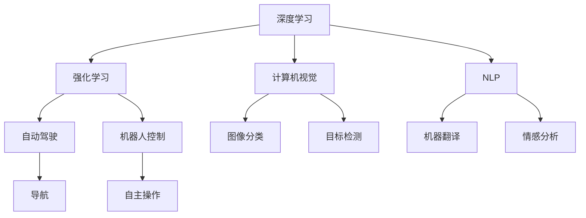

                 

# Andrej Karpathy：人工智能的未来发展趋势

> 关键词：深度学习, 强化学习, 自然语言处理, 计算机视觉, 自动驾驶, 机器人技术

## 1. 背景介绍

### 1.1 问题由来
Andrej Karpathy，作为一位著名的AI专家和计算机视觉领域的前沿研究者，他的研究和教学工作在深度学习和计算机视觉领域产生了深远影响。Karpathy曾供职于Google、Facebook等大型科技公司，并在斯坦福大学任教，对深度学习和计算机视觉的前沿技术有着深入的理解和独到的见解。在过去的几年里，Karpathy积极参与并推动了人工智能领域多项重要技术的发展，包括神经网络、卷积神经网络（CNNs）、生成对抗网络（GANs）、强化学习等。

### 1.2 问题核心关键点
在本文中，我们将深入探讨Andrej Karpathy对人工智能未来的预测和展望。他的观点基于其对深度学习、计算机视觉、自动驾驶和机器人技术等多领域的广泛研究和实践经验。我们通过梳理Karpathy的主要观点和理论，帮助读者理解未来人工智能发展的趋势，以及在这一过程中可能面临的挑战和机遇。

## 2. 核心概念与联系

### 2.1 核心概念概述

为更好地理解Karpathy的预测，我们首先列出几个核心概念：

- 深度学习（Deep Learning）：一种基于多层神经网络的人工智能技术，用于处理高维数据和复杂任务。深度学习的核心在于通过多层次的非线性映射学习数据的表示。

- 强化学习（Reinforcement Learning）：一种通过试错的方式，让智能体在环境中不断尝试优化策略的机器学习方法。强化学习在自动驾驶、机器人控制等领域有广泛应用。

- 计算机视觉（Computer Vision）：使计算机能够理解和分析图像和视频中的视觉信息的技术。深度学习在计算机视觉中取得突破，如图像分类、目标检测、图像生成等任务。

- 自然语言处理（Natural Language Processing, NLP）：使计算机能够理解、生成和处理人类语言的技术。深度学习在NLP领域实现了如机器翻译、文本生成、情感分析等任务的突破。

- 自动驾驶（Autonomous Driving）：利用计算机视觉和强化学习技术，使汽车等交通工具能够自主导航。

- 机器人技术（Robotics）：结合深度学习和强化学习，使机器人能够感知环境、执行复杂任务。

这些核心概念之间的逻辑关系可以通过以下Mermaid流程图来展示：



这个流程图展示了各个核心概念之间的关联和互动：

1. 深度学习作为基础技术，支持强化学习、计算机视觉和自然语言处理等子领域的发展。
2. 强化学习用于自动驾驶和机器人控制，而计算机视觉则用于图像分类和目标检测等任务。
3. 自然语言处理涉及机器翻译和情感分析等任务。
4. 自动驾驶和机器人技术则是深度学习和强化学习的具体应用。

这些概念构成了人工智能技术的主要框架，驱动着各领域的发展和应用。

## 3. 核心算法原理 & 具体操作步骤

### 3.1 算法原理概述

Karpathy在其研究中对深度学习和强化学习技术进行了深入探讨。以下是一些核心算法原理：

- **神经网络**：通过多层次的非线性映射，神经网络可以学习数据的复杂表示。在计算机视觉中，卷积神经网络（CNNs）被广泛应用于图像识别和分类。在自然语言处理中，循环神经网络（RNNs）和Transformer模型被用于语言生成和翻译。

- **生成对抗网络（GANs）**：由生成器和判别器两个部分组成，GANs能够生成高质量的图像和音频，并应用于图像增强和视频生成等领域。

- **强化学习**：智能体通过与环境的交互，学习优化策略。Q-learning和策略梯度是强化学习中的两个重要算法，用于解决复杂决策问题。

### 3.2 算法步骤详解

接下来，我们将详细解释一些具体的算法步骤：

**Step 1: 数据准备**
- 数据收集：从公共数据集、专业数据库、实时数据流中获取训练数据。
- 数据预处理：清洗、标注和扩充数据集，以满足训练模型的要求。

**Step 2: 模型选择**
- 选择合适的网络结构和激活函数，如卷积神经网络（CNNs）用于图像处理，循环神经网络（RNNs）用于序列数据处理，Transformer模型用于自然语言处理。
- 设计训练流程：包括损失函数、优化器、学习率调度等。

**Step 3: 模型训练**
- 将数据输入模型进行训练，通过反向传播算法更新模型参数。
- 监控训练进度：使用验证集评估模型性能，避免过拟合。

**Step 4: 模型评估与优化**
- 在测试集上评估模型性能，如准确率、F1分数、损失值等。
- 根据评估结果调整模型超参数，重新训练模型。

**Step 5: 模型部署**
- 将训练好的模型部署到实际应用环境中，如自动驾驶系统、机器人控制、自然语言处理应用等。

### 3.3 算法优缺点

深度学习和强化学习技术在应用中具有以下优点：

- **高效性**：通过自动化的特征学习和非线性映射，可以高效处理复杂数据。
- **可扩展性**：模型结构可扩展，能够处理大规模数据集和复杂任务。
- **鲁棒性**：通过大量数据训练，深度学习模型具有较强的鲁棒性和泛化能力。

同时，这些技术也存在一些缺点：

- **数据依赖**：深度学习模型需要大量标注数据进行训练，数据获取成本较高。
- **计算资源需求**：深度学习模型通常需要强大的计算资源，包括GPU和TPU等。
- **可解释性**：深度学习模型往往被视为“黑盒”，缺乏直观的解释。

### 3.4 算法应用领域

基于深度学习和强化学习技术的算法，已经在多个领域得到广泛应用：

- **计算机视觉**：如图像分类、目标检测、图像生成、图像修复等。
- **自然语言处理**：如机器翻译、文本生成、情感分析等。
- **自动驾驶**：如车辆导航、障碍物识别、交通信号理解等。
- **机器人技术**：如机器人控制、路径规划、物体抓取等。
- **金融科技**：如信用评估、风险预测等。

这些应用场景展示了深度学习和强化学习技术的广泛应用和巨大潜力。

## 4. 数学模型和公式 & 详细讲解  
### 4.1 数学模型构建

在本文中，我们将详细讲解深度学习和强化学习的数学模型构建。

**深度学习**：
- **神经网络**：输入 $x$，经过权重矩阵 $W$ 和偏置 $b$ 的线性变换，再加上非线性激活函数 $f$，得到输出 $y$。数学公式表示为：
$$
y = f(Wx + b)
$$
- **卷积神经网络**：通过卷积层、池化层和全连接层等组成，用于图像处理。数学公式表示为：
$$
y = f(W^{(1)} * \text{Conv2D}(x) + b^{(1)}) + f(W^{(2)} * \text{Pool2D}(y) + b^{(2)}) + ... + f(W^{(n)} * \text{Linear}(y) + b^{(n)})
$$

**强化学习**：
- **Q-learning**：通过状态值函数 $Q(s,a)$ 表示在状态 $s$ 下采取动作 $a$ 的长期回报，通过最大化 $Q(s,a)$ 来优化策略。数学公式表示为：
$$
Q(s,a) \leftarrow Q(s,a) + \alpha [r + \gamma \max_{a'} Q(s',a') - Q(s,a)]
$$
其中 $\alpha$ 为学习率，$r$ 为即时回报，$\gamma$ 为折扣因子。

## 5. 项目实践：代码实例和详细解释说明

### 5.1 开发环境搭建

在进行项目实践前，我们需要准备好开发环境。以下是使用Python进行TensorFlow和PyTorch开发的环境配置流程：

1. 安装Anaconda：从官网下载并安装Anaconda，用于创建独立的Python环境。
```bash
conda create -n pytorch-env python=3.8
conda activate pytorch-env
```

2. 安装TensorFlow和PyTorch：
```bash
pip install tensorflow==2.3 pytorch==1.8
```

3. 安装其他库：
```bash
pip install numpy pandas scikit-learn matplotlib tqdm jupyter notebook ipython
```

完成上述步骤后，即可在`pytorch-env`环境中开始项目实践。

### 5.2 源代码详细实现

这里我们以计算机视觉中的图像分类任务为例，给出使用TensorFlow进行卷积神经网络（CNN）的代码实现。

首先，定义图像分类模型：
```python
import tensorflow as tf
from tensorflow.keras import layers

def create_model(input_shape):
    model = tf.keras.Sequential([
        layers.Conv2D(32, (3, 3), activation='relu', input_shape=input_shape),
        layers.MaxPooling2D((2, 2)),
        layers.Conv2D(64, (3, 3), activation='relu'),
        layers.MaxPooling2D((2, 2)),
        layers.Flatten(),
        layers.Dense(64, activation='relu'),
        layers.Dense(num_classes, activation='softmax')
    ])
    return model
```

然后，定义数据预处理函数：
```python
def preprocess_data(X_train, y_train):
    X_train = X_train.astype('float32') / 255
    y_train = tf.keras.utils.to_categorical(y_train, num_classes)
    return X_train, y_train
```

接着，定义训练函数：
```python
def train_model(model, X_train, y_train, batch_size, epochs):
    model.compile(optimizer='adam', loss='categorical_crossentropy', metrics=['accuracy'])
    model.fit(X_train, y_train, batch_size=batch_size, epochs=epochs, validation_split=0.2)
```

最后，启动训练流程：
```python
input_shape = (28, 28, 1)
model = create_model(input_shape)
X_train, y_train = preprocess_data(X_train, y_train)
train_model(model, X_train, y_train, batch_size=32, epochs=10)
```

以上就是使用TensorFlow进行卷积神经网络图像分类的完整代码实现。可以看到，TensorFlow提供了丰富的API，使得模型定义和训练过程变得简单高效。

### 5.3 代码解读与分析

让我们再详细解读一下关键代码的实现细节：

**create_model函数**：
- 定义了一个包含卷积层、池化层和全连接层的卷积神经网络模型。

**preprocess_data函数**：
- 对训练数据进行归一化和标签编码处理。

**train_model函数**：
- 编译模型，定义损失函数和优化器。
- 在训练集上训练模型，使用验证集进行模型评估。

**训练流程**：
- 定义输入数据尺寸，创建模型。
- 预处理训练数据。
- 训练模型，使用交叉熵损失和Adam优化器，训练10个epoch。

可以看到，TensorFlow的API使得模型定义和训练过程非常简洁。这大大降低了深度学习模型的开发门槛，使得更多开发者能够快速上手。

当然，实际应用中还需要考虑更多因素，如模型裁剪、量化加速、服务化封装等。但核心的算法步骤和代码实现过程是相同的。

## 6. 实际应用场景

### 6.1 智能交通系统

计算机视觉和强化学习技术在智能交通系统中有着广泛应用。通过摄像头、雷达等传感器，智能交通系统能够实时监测道路状况，进行交通流量分析和路径规划。例如，使用深度学习技术进行车辆识别和交通标志识别，使用强化学习技术进行自动驾驶和路径规划。

在实际应用中，这些技术可以结合在一起，构成一个高效的智能交通系统，提升交通管理效率，减少交通事故，优化交通流。

### 6.2 医疗影像分析

深度学习在医疗影像分析中也有着广泛应用。通过卷积神经网络（CNNs），医生可以对医学影像进行自动诊断，如肺部CT扫描中的结节检测、乳腺X光中的肿瘤识别等。

在实际应用中，医疗影像分析系统可以结合自然语言处理技术，将图像诊断结果转化为易于理解的文本报告，方便医生阅读和决策。

### 6.3 个性化推荐系统

自然语言处理和强化学习技术在个性化推荐系统中也有着广泛应用。通过分析用户的浏览历史和行为数据，推荐系统可以为用户推荐最相关的商品、文章、视频等。

在实际应用中，推荐系统可以结合深度学习技术，对用户行为进行建模，提高推荐的准确性和个性化程度。

### 6.4 未来应用展望

随着深度学习和强化学习技术的不断发展，未来将会有更多的应用场景。以下是一些可能的未来应用：

- **自动驾驶**：在自动驾驶领域，深度学习和强化学习技术将继续提升车辆的感知能力和决策水平，实现更安全、更高效的自动驾驶。
- **机器人技术**：在机器人领域，深度学习和强化学习技术将使机器人能够感知环境、执行复杂任务，进一步提升机器人的智能化水平。
- **自然语言处理**：在自然语言处理领域，深度学习和强化学习技术将使得机器翻译、文本生成、情感分析等任务更加高效、准确。

这些技术的发展将推动人工智能在更多领域的应用，为社会带来更深远的影响。

## 7. 工具和资源推荐

### 7.1 学习资源推荐

为了帮助开发者系统掌握深度学习和强化学习技术，这里推荐一些优质的学习资源：

1. Deep Learning Specialization：由Coursera提供，由Andrew Ng教授授课，涵盖深度学习的各个方面，包括神经网络、卷积神经网络、生成对抗网络等。
2. Reinforcement Learning: Theory, Algorithms, and Applications：由DeepMind研究者David Silver撰写，全面介绍了强化学习的理论、算法和应用。
3. Hands-On Machine Learning with Scikit-Learn, Keras, and TensorFlow：由Aurélien Géron撰写，提供了大量深度学习和强化学习的实践案例，适合实战学习。
4. CS231n: Convolutional Neural Networks for Visual Recognition：斯坦福大学开设的计算机视觉课程，内容涵盖了图像分类、目标检测、图像生成等。
5. NLP with Transformers：由Google research团队撰写，介绍了Transformer模型在自然语言处理中的应用，包括机器翻译、文本生成等。

通过学习这些资源，相信你一定能够快速掌握深度学习和强化学习的精髓，并用于解决实际的NLP问题。

### 7.2 开发工具推荐

高效的开发离不开优秀的工具支持。以下是几款用于深度学习和强化学习开发的常用工具：

1. TensorFlow：由Google主导开发的深度学习框架，生产部署方便，适合大规模工程应用。
2. PyTorch：由Facebook主导开发的深度学习框架，灵活高效，适合研究应用。
3. OpenAI Gym：用于强化学习任务的环境库，提供了各种模拟环境，方便进行模型训练和测试。
4. Jupyter Notebook：开源的交互式笔记本，支持Python和R语言，适合数据可视化、代码调试等。
5. Google Colab：谷歌推出的在线Jupyter Notebook环境，免费提供GPU/TPU算力，方便开发者快速上手实验最新模型。

合理利用这些工具，可以显著提升深度学习和强化学习的开发效率，加快创新迭代的步伐。

### 7.3 相关论文推荐

深度学习和强化学习技术的发展源于学界的持续研究。以下是几篇奠基性的相关论文，推荐阅读：

1. ImageNet Classification with Deep Convolutional Neural Networks：提出卷积神经网络（CNNs）在图像分类任务中的突破性表现。
2. Generative Adversarial Nets：提出生成对抗网络（GANs），能够生成高质量的图像和音频。
3. Playing Atari with Deep Reinforcement Learning：展示了使用深度强化学习解决复杂决策问题的方法。
4. Attention Is All You Need：提出Transformer模型，改变了自然语言处理领域的游戏规则。
5. AlphaGo Zero：展示了使用强化学习技术，在围棋等复杂游戏中取得突破。

这些论文代表了大模型微调技术的发展脉络。通过学习这些前沿成果，可以帮助研究者把握学科前进方向，激发更多的创新灵感。

## 8. 总结：未来发展趋势与挑战

### 8.1 总结

本文对Andrej Karpathy关于人工智能未来发展的预测进行了系统梳理。从深度学习、计算机视觉、自动驾驶和机器人技术等多个领域，探讨了AI技术的发展趋势和应用前景。通过梳理Karpathy的主要观点和理论，帮助读者理解未来人工智能的发展方向。

通过本文的系统梳理，可以看到，基于深度学习和强化学习的技术正在成为AI技术发展的主流范式，极大地拓展了AI技术的应用边界，催生了更多的落地场景。未来，伴随这些技术的不断发展，人工智能必将在更多领域展现出巨大的潜力。

### 8.2 未来发展趋势

展望未来，人工智能的发展趋势如下：

1. **深度学习技术**：深度学习将继续在图像处理、语音识别、自然语言处理等领域发挥重要作用。深度学习模型的结构将更加复杂，性能将更加强大。
2. **强化学习技术**：强化学习将在自动驾驶、机器人控制等领域取得更显著的进展，智能体将具备更高的自主性和决策能力。
3. **多模态技术**：多模态技术将结合图像、语音、文本等不同模态的信息，提升智能系统的感知能力和综合处理能力。
4. **联邦学习**：联邦学习将解决数据隐私和安全问题，实现多方协作的模型训练，提升AI系统的可扩展性和鲁棒性。
5. **模型解释性**：随着模型的复杂性增加，模型的可解释性将成为研究重点，帮助用户理解模型的决策过程。
6. **人机协同**：未来的人工智能将更注重人机协同，提升系统的智能化水平和用户体验。

这些趋势凸显了人工智能技术的广阔前景。这些方向的探索发展，必将进一步提升AI系统的性能和应用范围，为人类社会带来更深远的影响。

### 8.3 面临的挑战

尽管深度学习和强化学习技术取得了巨大进展，但在迈向更加智能化、普适化应用的过程中，仍面临诸多挑战：

1. **数据依赖**：深度学习模型需要大量标注数据进行训练，数据获取成本较高。如何高效获取和利用数据，成为关键问题。
2. **计算资源**：深度学习模型通常需要强大的计算资源，GPU和TPU等高性能设备是必不可少的。如何优化资源使用，降低计算成本，是重要挑战。
3. **可解释性**：深度学习模型往往被视为“黑盒”，缺乏直观的解释。如何提升模型的可解释性，增加用户信任，是研究重点。
4. **安全性**：深度学习模型可能学习到有害信息，如何避免模型的偏见和恶意用途，保障系统安全，是重要挑战。
5. **伦理道德**：AI系统在决策过程中可能涉及伦理道德问题，如何确保系统的决策符合人类价值观，是重要挑战。

正视这些挑战，积极应对并寻求突破，将是大模型微调走向成熟的必由之路。相信随着学界和产业界的共同努力，这些挑战终将一一被克服，深度学习和强化学习技术必将带来更广泛的应用和更深刻的影响。

### 8.4 研究展望

未来，深度学习和强化学习技术的研究将集中在以下几个方面：

1. **多模态融合**：结合图像、语音、文本等不同模态的信息，提升智能系统的感知能力和综合处理能力。
2. **自监督学习**：通过自监督学习任务，增强模型的泛化能力和鲁棒性，减少对标注数据的依赖。
3. **联邦学习**：解决数据隐私和安全问题，实现多方协作的模型训练，提升AI系统的可扩展性和鲁棒性。
4. **可解释性**：提升模型的可解释性，帮助用户理解模型的决策过程，增加用户信任。
5. **伦理道德**：确保系统的决策符合人类价值观和伦理道德，避免偏见和恶意用途。

这些研究方向将推动深度学习和强化学习技术进一步发展，为构建更加智能、可靠、可解释的AI系统奠定基础。

## 9. 附录：常见问题与解答

**Q1：深度学习和强化学习技术是否适用于所有NLP任务？**

A: 深度学习和强化学习技术在大多数NLP任务上都能取得不错的效果，特别是对于数据量较小的任务。但对于一些特定领域的任务，如医学、法律等，仅仅依靠通用语料预训练的模型可能难以很好地适应。此时需要在特定领域语料上进一步预训练，再进行微调，才能获得理想效果。此外，对于一些需要时效性、个性化很强的任务，如对话、推荐等，微调方法也需要针对性的改进优化。

**Q2：深度学习模型在训练过程中如何避免过拟合？**

A: 深度学习模型在训练过程中可能面临过拟合的问题。为了避免过拟合，可以采取以下措施：
1. 数据增强：通过回译、近义替换等方式扩充训练集。
2. 正则化：使用L2正则、Dropout等技术。
3. 早期停止：根据验证集性能决定停止训练的时机。
4. 模型裁剪：去除不必要的层和参数，减小模型尺寸，加快推理速度。

**Q3：深度学习模型在部署时需要注意哪些问题？**

A: 将深度学习模型部署到实际应用中，还需要考虑以下因素：
1. 模型裁剪：去除不必要的层和参数，减小模型尺寸，加快推理速度。
2. 量化加速：将浮点模型转为定点模型，压缩存储空间，提高计算效率。
3. 服务化封装：将模型封装为标准化服务接口，便于集成调用。
4. 弹性伸缩：根据请求流量动态调整资源配置，平衡服务质量和成本。
5. 监控告警：实时采集系统指标，设置异常告警阈值，确保服务稳定性。
6. 安全防护：采用访问鉴权、数据脱敏等措施，保障数据和模型安全。

深度学习模型在实际应用中需要全面考虑，才能发挥最大的性能和应用价值。

---

作者：禅与计算机程序设计艺术 / Zen and the Art of Computer Programming

