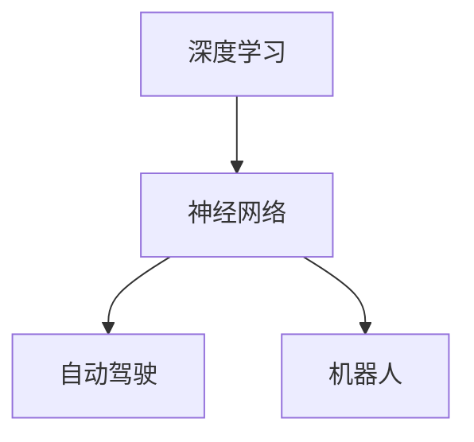

                 

# Andrej Karpathy：人工智能的未来发展趋势

> 关键词：人工智能,未来趋势,深度学习,神经网络,自动驾驶,机器人

## 1. 背景介绍

### 1.1 问题由来
在过去几十年中，人工智能（AI）技术取得了长足的发展，从简单的图像识别到复杂的自然语言处理，AI的应用范围不断扩大。人工智能的未来发展趋势一直是学界和业界关注的热点话题。本文将从深度学习、神经网络、自动驾驶和机器人等几个方面，探讨AI技术的未来发展趋势，并提供一些见解和思考。

### 1.2 问题核心关键点
人工智能的未来发展趋势主要包括以下几个方面：

- 深度学习的发展：深度学习是当前AI技术的主流，未来是否会出现新的深度学习架构或方法，将对AI的进展产生重要影响。
- 神经网络的演进：神经网络作为AI的核心组件，其结构和参数设计将直接影响AI系统的性能。
- 自动驾驶的突破：自动驾驶技术是AI应用的重要领域，未来的发展将对人类社会产生深远影响。
- 机器人的普及：机器人技术在制造业、医疗、家庭等领域的应用前景广阔，未来的发展将推动这些领域的技术进步。

这些关键点将帮助我们理解人工智能未来的发展方向和可能面临的挑战。

## 2. 核心概念与联系

### 2.1 核心概念概述

为更好地理解AI技术的未来发展趋势，本节将介绍几个密切相关的核心概念：

- 深度学习（Deep Learning）：一种基于多层神经网络的机器学习方法，通过逐层抽象特征，实现对复杂数据的处理。
- 神经网络（Neural Networks）：由神经元和连接构成的计算模型，通过反向传播算法进行训练，实现数据的自动特征提取。
- 自动驾驶（Autonomous Driving）：通过计算机视觉、传感器融合、路径规划等技术，使车辆自主导航、避障和决策。
- 机器人（Robots）：一种可移动、感知和执行任务的自动化设备，广泛应用于制造、医疗、家庭等领域。

这些核心概念之间的逻辑关系可以通过以下Mermaid流程图来展示：



这个流程图展示了大语言模型的核心概念及其之间的关系：

1. 深度学习提供了强大的数据处理能力，通过神经网络实现特征提取和模式识别。
2. 神经网络是深度学习的核心组件，通过反向传播算法训练模型。
3. 自动驾驶和机器人技术依赖于深度学习，实现环境感知和决策。

这些概念共同构成了AI技术的学习框架，使其能够在各种场景下发挥强大的能力。通过理解这些核心概念，我们可以更好地把握AI技术的发展方向。

## 3. 核心算法原理 & 具体操作步骤
### 3.1 算法原理概述

人工智能的未来发展趋势主要取决于以下几个核心算法的演进：

- 卷积神经网络（Convolutional Neural Networks, CNNs）：用于图像处理和计算机视觉任务，通过卷积操作提取空间局部特征。
- 循环神经网络（Recurrent Neural Networks, RNNs）：用于序列数据处理，通过循环结构捕捉时间依赖性。
- 生成对抗网络（Generative Adversarial Networks, GANs）：通过对抗训练生成逼真图像和音频，扩展了神经网络的应用范围。
- 强化学习（Reinforcement Learning, RL）：通过奖励机制训练智能体进行决策，实现自主导航和路径规划。

这些算法在各自的领域内都有重要的应用，未来也可能出现新的算法架构和方法，推动AI技术的发展。

### 3.2 算法步骤详解

以卷积神经网络为例，介绍其训练步骤：

1. 数据预处理：对输入数据进行归一化、扩充、标准化等处理。
2. 定义网络结构：确定卷积核大小、步幅、池化层、全连接层等网络结构参数。
3. 损失函数设计：选择合适的损失函数，如交叉熵、均方误差等，评估模型预测误差。
4. 反向传播：使用反向传播算法计算梯度，更新模型参数。
5. 训练迭代：通过多次前向传播和反向传播，不断优化模型参数，直至收敛。

### 3.3 算法优缺点

深度学习算法在处理复杂数据方面具有显著优势，但也存在一些缺点：

- 需要大量标注数据：深度学习模型通常需要大量的标注数据进行训练，标注成本较高。
- 过拟合风险：深度模型容易过拟合，需要在训练过程中进行正则化和防止过拟合的措施。
- 计算资源消耗高：深度模型参数量巨大，训练和推理需要高性能计算资源。
- 可解释性不足：深度模型往往被视为"黑箱"，难以解释其内部决策过程。

尽管存在这些缺点，但深度学习依然是当前AI技术的主流，未来可能会继续演进，提高模型的参数效率和可解释性。

### 3.4 算法应用领域

深度学习在以下几个领域中得到了广泛应用：

- 计算机视觉：如图像分类、目标检测、图像生成等。
- 自然语言处理：如文本分类、情感分析、机器翻译等。
- 语音识别：如语音转文本、语音生成等。
- 医疗健康：如医学影像分析、疾病预测等。
- 自动驾驶：如交通场景理解、路径规划、车辆控制等。

这些应用领域的成功，展示了深度学习在处理复杂数据方面的强大能力。

## 4. 数学模型和公式 & 详细讲解  
### 4.1 数学模型构建

假设我们有一个图像分类任务，输入为高维图像 $x$，输出为 $C$ 类别的概率 $p_C(x)$。一个典型的卷积神经网络（CNN）由多个卷积层和池化层组成，最后连接一个全连接层。

定义卷积核 $w$ 和偏置项 $b$，卷积操作为：

$$y = \sigma(\mathbf{W} * \mathbf{x} + \mathbf{b})$$

其中 $\sigma$ 为激活函数，如ReLU。

### 4.2 公式推导过程

以一个简单的CNN为例，推导其训练过程：

1. 定义损失函数 $L$，如交叉熵损失：

$$L = -\sum_{i=1}^C y_i \log p_C(x_i)$$

2. 反向传播计算梯度：

$$\frac{\partial L}{\partial \mathbf{W}} = \frac{\partial L}{\partial \mathbf{y}} \frac{\partial \mathbf{y}}{\partial \mathbf{x}} \frac{\partial \mathbf{x}}{\partial \mathbf{W}}$$

3. 通过链式法则，计算每个参数的梯度，更新模型参数。

4. 不断迭代训练，直至收敛。

### 4.3 案例分析与讲解

以CIFAR-10数据集为例，训练一个简单的CNN模型：

```python
import torch
import torch.nn as nn
import torch.optim as optim
import torchvision
import torchvision.transforms as transforms

# 定义网络结构
class CNN(nn.Module):
    def __init__(self):
        super(CNN, self).__init__()
        self.conv1 = nn.Conv2d(3, 6, 5)
        self.pool = nn.MaxPool2d(2, 2)
        self.conv2 = nn.Conv2d(6, 16, 5)
        self.fc1 = nn.Linear(16 * 5 * 5, 120)
        self.fc2 = nn.Linear(120, 84)
        self.fc3 = nn.Linear(84, 10)

    def forward(self, x):
        x = self.pool(F.relu(self.conv1(x)))
        x = self.pool(F.relu(self.conv2(x)))
        x = x.view(-1, 16 * 5 * 5)
        x = F.relu(self.fc1(x))
        x = F.relu(self.fc2(x))
        x = self.fc3(x)
        return x

# 加载数据集
train_dataset = torchvision.datasets.CIFAR10(root='./data', train=True,
                                           transform=transforms.ToTensor(),
                                           download=True)

# 定义超参数
learning_rate = 0.001
num_epochs = 5

# 初始化模型和优化器
model = CNN()
optimizer = optim.SGD(model.parameters(), lr=learning_rate, momentum=0.9)

# 训练模型
for epoch in range(num_epochs):
    running_loss = 0.0
    for i, data in enumerate(train_loader, 0):
        inputs, labels = data
        optimizer.zero_grad()
        outputs = model(inputs)
        loss = F.cross_entropy(outputs, labels)
        loss.backward()
        optimizer.step()

    print('Epoch [%d/%d], loss: %.3f' % (epoch+1, num_epochs, running_loss/len(train_loader)))
```

以上是使用PyTorch实现CNN模型的完整代码。可以看到，通过简单几行代码，就可以实现一个高效的图像分类模型。

## 5. 项目实践：代码实例和详细解释说明
### 5.1 开发环境搭建

在进行深度学习项目实践前，我们需要准备好开发环境。以下是使用Python进行PyTorch开发的环境配置流程：

1. 安装Anaconda：从官网下载并安装Anaconda，用于创建独立的Python环境。

2. 创建并激活虚拟环境：
```bash
conda create -n pytorch-env python=3.8 
conda activate pytorch-env
```

3. 安装PyTorch：根据CUDA版本，从官网获取对应的安装命令。例如：
```bash
conda install pytorch torchvision torchaudio cudatoolkit=11.1 -c pytorch -c conda-forge
```

4. 安装TensorFlow：
```bash
pip install tensorflow
```

5. 安装各类工具包：
```bash
pip install numpy pandas scikit-learn matplotlib tqdm jupyter notebook ipython
```

完成上述步骤后，即可在`pytorch-env`环境中开始深度学习项目的开发。

### 5.2 源代码详细实现

以下是一个简单的深度学习项目：手写数字识别。我们将使用MNIST数据集，通过训练一个简单的神经网络实现数字识别。

首先，加载数据集：

```python
import torch
import torch.nn as nn
import torchvision.transforms as transforms

train_dataset = torchvision.datasets.MNIST(root='./data', train=True,
                                          transform=transforms.ToTensor(),
                                          download=True)
```

然后，定义模型和优化器：

```python
class Net(nn.Module):
    def __init__(self):
        super(Net, self).__init__()
        self.fc1 = nn.Linear(28*28, 256)
        self.fc2 = nn.Linear(256, 10)
        
    def forward(self, x):
        x = F.relu(self.fc1(x.view(-1, 28*28)))
        x = self.fc2(x)
        return x

model = Net()
optimizer = optim.SGD(model.parameters(), lr=0.1)
```

接着，定义训练函数：

```python
def train(model, train_loader, optimizer):
    for epoch in range(5):
        running_loss = 0.0
        for i, data in enumerate(train_loader, 0):
            inputs, labels = data
            optimizer.zero_grad()
            outputs = model(inputs)
            loss = F.cross_entropy(outputs, labels)
            loss.backward()
            optimizer.step()

            running_loss += loss.item()
            if i % 100 == 99:
                print('Epoch [%d/%d], loss: %.3f' % (epoch+1, 5, running_loss/100))
                running_loss = 0.0
```

最后，启动训练流程并在测试集上评估：

```python
train_loader = torch.utils.data.DataLoader(train_dataset, batch_size=64, shuffle=True)
train(model, train_loader, optimizer)

test_dataset = torchvision.datasets.MNIST(root='./data', train=False, transform=transforms.ToTensor())
test_loader = torch.utils.data.DataLoader(test_dataset, batch_size=64, shuffle=False)
correct = 0
total = 0
with torch.no_grad():
    for data in test_loader:
        images, labels = data
        outputs = model(images)
        _, predicted = torch.max(outputs.data, 1)
        total += labels.size(0)
        correct += (predicted == labels).sum().item()

print('Accuracy of the network on the test images: %d %%' % (100 * correct / total))
```

以上就是使用PyTorch实现手写数字识别的完整代码。可以看到，通过简单几行代码，就可以实现一个高效的深度学习模型。

### 5.3 代码解读与分析

让我们再详细解读一下关键代码的实现细节：

**Net类**：
- `__init__`方法：初始化网络参数，如全连接层的大小。
- `forward`方法：定义前向传播过程，将输入转换为输出。

**训练函数**：
- 使用PyTorch的DataLoader对数据集进行批次化加载，供模型训练使用。
- 训练函数中，循环迭代每个批次的数据，前向传播计算损失函数并反向传播更新模型参数，最后输出每个epoch的平均loss。

**测试函数**：
- 使用PyTorch的DataLoader对测试集进行批次化加载，供模型评估使用。
- 在测试函数中，循环迭代每个批次的数据，进行前向传播并计算正确率。

可以看到，PyTorch提供了强大的自动化计算图和GPU加速能力，使得深度学习模型的开发和训练变得简单高效。

## 6. 实际应用场景
### 6.1 自动驾驶

自动驾驶是深度学习在AI领域的重要应用之一。通过计算机视觉、传感器融合、路径规划等技术，使车辆自主导航、避障和决策。

在技术实现上，可以收集大量驾驶数据，使用深度学习模型进行环境感知和决策。常用的模型包括：

- 卷积神经网络（CNN）：用于图像分类和目标检测。
- 循环神经网络（RNN）：用于时间序列数据的处理。
- 生成对抗网络（GAN）：用于生成逼真场景模拟数据。

此外，还可以使用强化学习技术，通过奖励机制训练智能体进行路径规划和决策。

### 6.2 机器人

机器人技术在制造业、医疗、家庭等领域的应用前景广阔。通过深度学习，机器人可以实现环境感知、动作执行、路径规划等任务。

在技术实现上，可以收集大量机器人的行为数据，使用深度学习模型进行行为识别和路径规划。常用的模型包括：

- 卷积神经网络（CNN）：用于图像分类和目标检测。
- 循环神经网络（RNN）：用于时间序列数据的处理。
- 生成对抗网络（GAN）：用于生成逼真图像和场景模拟数据。

此外，还可以使用强化学习技术，通过奖励机制训练智能体进行路径规划和决策。

### 6.3 医疗健康

深度学习在医疗健康领域的应用广泛，如医学影像分析、疾病预测等。通过深度学习模型，可以自动识别医学影像中的病变部位，进行疾病预测和诊断。

在技术实现上，可以收集大量医学影像和患者数据，使用深度学习模型进行影像分类和预测。常用的模型包括：

- 卷积神经网络（CNN）：用于医学影像分类和目标检测。
- 循环神经网络（RNN）：用于时间序列数据的处理。
- 生成对抗网络（GAN）：用于生成逼真图像和场景模拟数据。

此外，还可以使用强化学习技术，通过奖励机制训练智能体进行决策和治疗。

## 7. 工具和资源推荐
### 7.1 学习资源推荐

为了帮助开发者系统掌握深度学习理论基础和实践技巧，这里推荐一些优质的学习资源：

1. 《深度学习》（Ian Goodfellow等著）：深度学习领域的经典教材，系统介绍了深度学习的基本概念和算法。
2. 《动手学深度学习》（李沐等著）：通过代码实现深度学习算法，深入浅出地介绍了深度学习的基本原理。
3. Coursera《深度学习》课程：由深度学习专家Andrew Ng讲授，涵盖了深度学习的基本概念和算法。
4. Fast.ai课程：通过动手实践，介绍深度学习的快速入门方法和应用场景。

通过对这些资源的学习实践，相信你一定能够快速掌握深度学习模型的核心原理和应用方法。

### 7.2 开发工具推荐

高效的深度学习开发离不开优秀的工具支持。以下是几款用于深度学习开发的常用工具：

1. PyTorch：基于Python的开源深度学习框架，灵活动态的计算图，适合快速迭代研究。
2. TensorFlow：由Google主导开发的开源深度学习框架，生产部署方便，适合大规模工程应用。
3. Keras：一个高层次的深度学习库，易于上手，适合快速原型设计和实验。
4. Jupyter Notebook：一个交互式的开发环境，支持多种编程语言和库的集成，方便代码调试和共享。
5. Visual Studio Code：一个轻量级的IDE，支持深度学习库的集成和调试。

合理利用这些工具，可以显著提升深度学习模型的开发效率，加快创新迭代的步伐。

### 7.3 相关论文推荐

深度学习技术的发展源于学界的持续研究。以下是几篇奠基性的相关论文，推荐阅读：

1. AlexNet：在ImageNet上首次取得突破性成绩的卷积神经网络。
2. VGGNet：提出了一种更加简洁的卷积神经网络架构，取得了非常好的图像分类效果。
3. ResNet：通过残差连接解决深度网络的退化问题，实现了更大的深度网络。
4. InceptionNet：提出了一种多尺度卷积结构，提高了深度网络的性能。
5. GoogleNet：通过改进卷积结构和网络结构，取得了非常好的图像分类效果。

这些论文代表了深度学习的发展脉络，展示了深度学习模型在图像分类、目标检测等领域的强大能力。

## 8. 总结：未来发展趋势与挑战
### 8.1 总结

本文对深度学习、神经网络、自动驾驶和机器人等几个方面的AI技术发展进行了详细探讨。深度学习作为AI的主流技术，将继续演进，推动AI技术的发展。未来，AI技术将在更多领域得到应用，带来新的突破。

### 8.2 未来发展趋势

深度学习在AI领域的应用前景广阔，未来可能出现以下趋势：

1. 新的深度学习架构：随着研究的不断深入，将会出现新的深度学习架构，如神经网络生成模型（NGM）、神经网络进化模型（NGEM）等，进一步提高模型的表达能力和性能。
2. 更多的数据驱动方法：深度学习模型的性能很大程度上取决于数据质量，未来将会有更多数据驱动方法，如自监督学习、无监督学习、半监督学习等，利用更丰富的数据资源提升模型性能。
3. 更高效的网络结构：未来将会出现更高效的网络结构，如轻量级网络、可解释网络等，提升模型的推理速度和可解释性。
4. 更广泛的应用场景：深度学习将应用于更多领域，如医疗、金融、教育等，带来新的突破。

这些趋势将进一步推动深度学习技术的发展，拓展AI技术的应用范围，提升AI技术的性能。

### 8.3 面临的挑战

尽管深度学习技术在不断进步，但仍面临一些挑战：

1. 数据获取和标注：深度学习模型的性能很大程度上取决于数据质量，获取高质量标注数据和无标签数据是AI发展的瓶颈。
2. 模型过拟合：深度学习模型容易过拟合，需要在训练过程中进行正则化和防止过拟合的措施。
3. 计算资源消耗：深度学习模型参数量巨大，训练和推理需要高性能计算资源。
4. 可解释性不足：深度学习模型往往被视为"黑箱"，难以解释其内部决策过程。

这些挑战需要通过不断优化模型设计、算法改进和数据处理等手段来解决。

### 8.4 研究展望

未来的研究将在以下几个方面取得进展：

1. 数据驱动方法：通过自监督学习、无监督学习和半监督学习，利用更丰富的数据资源提升模型性能。
2. 更高效的网络结构：研究轻量级网络、可解释网络等新结构，提升模型的推理速度和可解释性。
3. 多模态学习：将深度学习应用于多模态数据处理，如语音、图像、文本等，提高模型的表达能力和性能。
4. 自动化机器学习：通过自动化机器学习（AutoML）技术，提升模型设计和调优的效率和效果。

这些研究方向将进一步推动深度学习技术的发展，拓展AI技术的应用范围，提升AI技术的性能。

## 9. 附录：常见问题与解答

**Q1：深度学习与传统机器学习有什么区别？**

A: 深度学习是一种基于多层神经网络的机器学习方法，通过逐层抽象特征，实现对复杂数据的处理。与传统机器学习方法相比，深度学习不需要手动提取特征，能够自动学习数据特征，具有更好的表达能力和性能。

**Q2：如何选择合适的深度学习模型？**

A: 选择合适的深度学习模型需要考虑数据类型、任务类型、计算资源等因素。一般而言，对于图像分类任务，卷积神经网络（CNN）表现较好；对于序列数据处理任务，循环神经网络（RNN）和长短时记忆网络（LSTM）表现较好。此外，还有生成对抗网络（GAN）、深度信念网络（DBN）等不同类型的深度学习模型，需要根据具体任务进行选择。

**Q3：深度学习模型的训练需要多少数据？**

A: 深度学习模型的训练需要大量的标注数据，一般建议数据量在几万到几百万之间。标注数据越多，模型性能越好。对于小样本数据集，可以使用迁移学习和数据增强等技术，提升模型的泛化能力和性能。

**Q4：深度学习模型的可解释性不足怎么办？**

A: 深度学习模型往往被视为"黑箱"，难以解释其内部决策过程。为了提高模型的可解释性，可以采用多种方法，如可视化技术、特征提取技术、解释性模型等。此外，还可以通过简化模型结构、增加模型输出等方式，提高模型的可解释性。

**Q5：深度学习模型面临的挑战有哪些？**

A: 深度学习模型面临的挑战主要包括数据获取和标注、模型过拟合、计算资源消耗、可解释性不足等。为了解决这些问题，需要优化模型设计、改进算法、增加数据量等手段，提升模型的性能和可解释性。

---

作者：禅与计算机程序设计艺术 / Zen and the Art of Computer Programming

